# AI-Native PM Tool — Definitive System Architecture v3.1

> **Design philosophy:** The AI runs the project. The human supervises. Every architectural decision answers: "Does this let the AI act autonomously, safely, and observably — and does it survive from R0 through R3 without a rewrite?"
>
> **Cloud:** AWS (single-cloud, managed services preferred)
> **Team:** 5-7 engineers. Every choice optimizes for operator simplicity at this team size.
> **Target scale:** R0: 1 tenant, 10 users -> R3: 10+ tenants, 100+ users, 100K+ tasks
>
> **v3.1 - February 2026 - Aligned to Product Roadmap v2.1 (103 features)**

---

## Changelog from v3.0

| Change | v3.0 | v3.1 |
|--------|------|------|
| Feature count | 88 | 103 (15 ClickUp gap features added) |
| NATS streams | 6 | 12 |
| Durable consumers | 8 | 11 |
| DDL tables | ~16 | 30 |
| Application modules | 7 (+ Config) | 14 (+ 6 new: Notification, Goals, Automation, Forms, Documents, Views) |
| AI capabilities | 9 | 10 (+ AI Writing Assistant F-102) |
| API endpoints | ~35 | ~85 |
| Mermaid diagrams | 0 | 12 |
| Feature promotions | - | Kanban R3->R1, Gantt R3->R2, Templates R3->R1 |
| New section | - | Section 9: Subsystem Architectures (7 subsystems) |

### Cross-Reference Legend

| Prefix | Source Document | Example |
|--------|----------------|---------|
| **FR-xxx** | requirements.md | FR-200 (NL to WBS) |
| **NFR-xxx** | requirements.md | NFR-100 (API latency) |
| **F-xxx** | roadmap-v2.md | F-011 (NL project setup) |
| **ADR-xxx** | This document | ADR-001 (Hosted Claude API) |

---

## 1. Architecture Principles

Seven principles resolve every tension and govern every decision below.

1. **AWS-managed over self-managed.** ECS Fargate over Kubernetes. RDS over self-hosted PostgreSQL. ElastiCache over self-managed Redis. A 5-person team cannot operate a Kubernetes cluster and build an AI product simultaneously.

2. **Monorepo, modular monolith, not microservices.** One deployable API service with well-separated internal modules (14 modules at v3.1). Split into services only when independently scaling AI workers is required (R1+). Premature microservices at this team size creates operational overhead that kills velocity.

3. **Event-driven from day 1, but start simple.** NATS JetStream for the event bus — lighter than Kafka, persistent with replay, sufficient through R3. Every state mutation emits an event. Every AI capability consumes events. 12 streams, 11 consumers.

4. **Single database, stretched intelligently.** PostgreSQL 16 with pgvector for relational + vector in one engine. RLS for tenant isolation. JSONB for flexible fields. 30 tables with full DDL. Evaluate dedicated vector store only if p95 similarity search exceeds 100ms at 1M+ embeddings.

5. **AI is a first-class infrastructure concern.** The AI engine is not a feature bolted onto a PM tool. It has its own orchestration pipeline, cost tracking, autonomy policies, traceability, evaluation harness, and circuit breakers — all from R0. 10 AI capabilities across R0-R3.

6. **Security is structural, not aspirational.** `tenant_id` on every table from day 1. RLS enforced at the database layer on all 30 tables. Immutable audit trail. SOC 2 controls built into the architecture, not retrofitted.

7. **Evergreen means building the R3 data model in R0.** The schema, event streams, and AI pipeline support per-tenant learning, client projection, and enterprise isolation from day 1 — even if those features aren't exposed until R2-R3. No "rewrite required" gates between releases.

---

## 2. System Context & Visual Architecture

### 2.1 C4 Level 1 — System Context

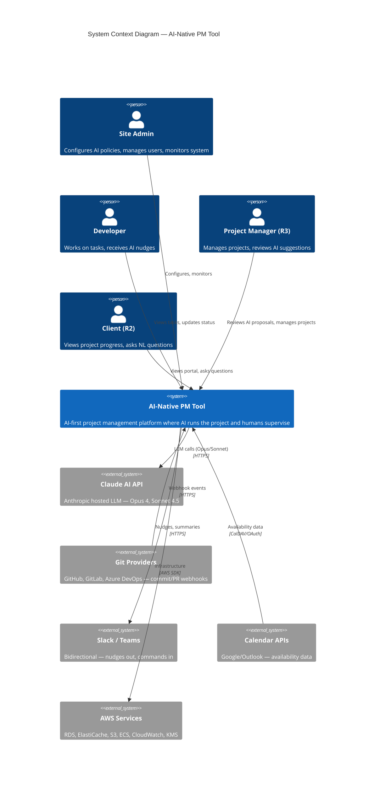

### 2.2 C4 Level 2 — Container Diagram

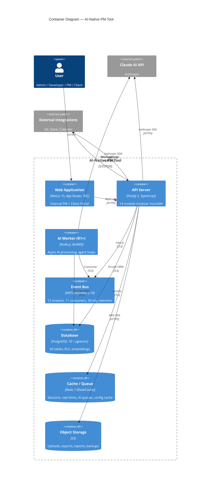

### 2.3 10-Tier Architecture

```
+============================================================================+
|  TIER 1: CLIENT LAYER                                                       |
|  Next.js 15 App Router | (internal) routes | (portal) routes | Slack Bot   |
|  Views: List, Board(R1), Calendar(R1), Table(R1), Gantt(R2), Timeline(R1)  |
|  Notification Inbox(R1) | Goals Dashboard(R2) | Docs/KB(R2)               |
+============================================================================+
          |                           |                        |
          v                           v                        v
+============================================================================+
|  TIER 2: GATEWAY & AUTH                                                     |
|  AWS ALB + WAF | JWT (RS256) | RBAC Engine | Tenant Config | WebSocket(R1)|
+============================================================================+
          |
          v
+============================================================================+
|  TIER 3: APPLICATION SERVICES (Fastify Modular Monolith — 14 Modules)      |
|  Project | Task | Dependency | Comment | Audit | User | Projection | Config|
|  + Notification | Goals | Automation | Forms | Documents | Views           |
+============================================================================+
          |                           |
          v                           v
+============================================================================+
|  TIER 4: AI ENGINE                                                          |
|  Orchestrator (7-stage) | 10 Capabilities | Shared Infra (Gateway, RAG)   |
|  + AI Writing Assistant (F-102, R2)                                        |
+============================================================================+
          |                           |
          v                           v
+============================================================================+
|  TIER 5: EVENT BUS                                                          |
|  NATS JetStream (3-node) | 12 Streams | 11 Durable Consumers | DLQ        |
+============================================================================+
          |
          v
+============================================================================+
|  TIER 6: DATABASE                                                           |
|  PostgreSQL 16 + pgvector (30 tables) | Redis 7 (ElastiCache) | S3        |
+============================================================================+
          |
+============================================================================+
|  TIER 7: INTEGRATION GATEWAY                                                |
|  Git Adapter | Slack Adapter | Calendar Adapter | Webhooks | Jira Import   |
+============================================================================+

+============================================================================+
|  TIER 8: SECURITY & AI SAFETY                                               |
|  Encryption (AES-256/TLS 1.3) | RLS (30 tables) | Secrets Mgr | PII      |
+============================================================================+

+============================================================================+
|  TIER 9: DEPLOYMENT & CI/CD                                                 |
|  ECS Fargate | AWS CDK (TypeScript) | GitHub Actions | ECR | CloudFront   |
+============================================================================+

+============================================================================+
|  TIER 10: MONITORING & OBSERVABILITY                                        |
|  CloudWatch Metrics/Logs | X-Ray Tracing | Sentry | AI Dashboard          |
+============================================================================+
```

### 2.4 Tier Summary

| Tier | Name | Key Technology | Primary Release | Key FRs |
|------|------|---------------|----------------|---------|
| 1 | Client Layer | Next.js 15, RSC, Shadcn UI | R0 | FR-500-503, FR-201, FR-203, FR-1900-1901, FR-2002-2003 |
| 2 | Gateway & Auth | ALB + WAF, JWT RS256, RBAC | R0 | FR-103, FR-104, FR-800-802 |
| 3 | Application Services | Fastify 5, Drizzle ORM, 14 modules | R0 | FR-102, FR-105-109, FR-900, FR-2000-2014 |
| 4 | AI Engine | Claude Opus 4 / Sonnet 4.5, 7-stage pipeline | R0 | FR-200-203, FR-300-305, FR-600-607, FR-2013 |
| 5 | Event Bus | NATS JetStream 2.10+, 12 streams | R0 | FR-100 |
| 6 | Database | PostgreSQL 16, pgvector, 30 tables | R0 | FR-101, FR-102, NFR-100-103 |
| 7 | Integration Gateway | Fastify plugins, OAuth 2.0 | R1 | FR-700-702 |
| 8 | Security & AI Safety | KMS, RLS (30 tables), Secrets Manager | R0 | FR-800-802, NFR-200-205 |
| 9 | Deployment & CI/CD | ECS Fargate, CDK, GitHub Actions | R0 | NFR-300-303 |
| 10 | Monitoring | CloudWatch, X-Ray, Sentry | R0 | FR-400-402 |

---

## 3. Tier 1 — Client Layer

All user-facing surfaces. The AI is the primary interaction model; traditional PM interfaces are supplementary.

| Component | Technology | Release | Purpose | Feature Refs |
|-----------|-----------|---------|---------|-------------|
| **Web Application** | Next.js 15, App Router, RSC, TypeScript 5+ | R0 | Primary PM interface. AI review/approve UI, "What's Next" developer view, NL query panel, project dashboards. SSR for initial load, client components for interactivity. | F-016, F-012, F-014, F-023-026 |
| **List View** | React, Shadcn Table | R0 | Filterable/sortable task list with status, priority, assignee, phase columns. | F-024 |
| **Board View (Kanban)** | React, dnd-kit | R1 | Read-only Kanban board with AI annotations (blocked flags, priority). Drag-and-drop in R2. | F-087 (FR-1900) |
| **Calendar View** | React, custom calendar grid | R1 | Month/week/day views, tasks as colored chips by priority/status, drag to reschedule. | F-091 (FR-2002) |
| **Table View** | React, TanStack Table | R1 | Spreadsheet-like bulk editing: inline edit, column resize/reorder/hide, sort, saved views. | F-092 (FR-2003) |
| **Timeline View** | React, SVG-based | R1 | AI-annotated timeline: predicted delays flagged, at-risk milestones, resource conflicts. | F-052 |
| **Gantt Chart** | React, SVG-based | R2 | Full Gantt with AI overlays: critical path, predicted delays, dependency lines. | F-088 (FR-1901) |
| **Notification Inbox** | React, SSE/WebSocket | R1 | Bell icon with unread count, filter by type, click-through to source entity. | F-096 (FR-2007) |
| **Goals Dashboard** | React, Recharts | R2 | OKR tree view, auto-calculated progress from linked tasks, AI risk flags. | F-095 (FR-2006) |
| **Docs & Knowledge Base** | React, Markdown editor | R2 | Collaborative documents linked to projects, searchable, embeddable in RAG. | F-101 (FR-2012) |
| **Client Portal** | Next.js 15, `(portal)` route group | R2 | Client-facing view consuming projection layer. Filtered tasks, AI narratives, scoped NL queries. White-labelable. | F-055, F-059 |
| **Slack / Teams Bot** | Slack Bolt SDK / Teams Bot Framework | R1 | Slash commands, nudge delivery, daily summaries, risk alerts. | F-036 |
| **Public REST API** | Versioned `/api/v1/`, API key auth | R2 | External programmatic access with rate limiting, webhook subscriptions, OpenAPI 3.1. | F-063 |

**Key decisions:**
- Next.js 15 with route groups (`/(internal)/` and `/(portal)/`) — single app, shared components, one deployment.
- No mobile app in year 1. Slack bot IS the mobile interface.
- No GraphQL. REST with composite endpoints handles all query patterns.
- 6 view types (list, board, calendar, table, timeline, gantt) — each ships as a view toggle within the project detail page.

---

## 4. Tier 2 — Gateway & Auth

Single entry point for all traffic. Every request is authenticated, tenant-resolved, and rate-limited.

| Component | Technology | Release | Purpose |
|-----------|-----------|---------|---------|
| **API Gateway** | AWS ALB + WAF | R0 | TLS 1.3 termination, path-based routing, OWASP Top 10 WAF rules, rate limiting (1000 req/5min/IP). |
| **Authentication** | Custom Fastify plugin, RS256 JWT | R0 | Password auth (bcrypt, cost 12+). SAML/OIDC SSO (R1). MFA via TOTP (R1). 1h access tokens, 30d refresh with rotation. |
| **RBAC Engine** | Application-layer + DB check | R0-R3 | Four-stage rollout: Admin + Developer (R0) -> +Client (R2) -> +PM (R3). Per-request enforcement chain: authenticate -> resolve tenant -> set RLS -> check role -> check scope. |
| **Config Service** | Tenant config table + Redis (5min TTL) | R0 | Per-tenant settings: status labels, priority scales, AI model prefs, feature flags, autonomy policies. Cache invalidated via NATS event. |
| **WebSocket Gateway** | Socket.io on Fastify, ALB WebSocket | R1 | Real-time task board updates, comment streams, AI decision notifications, user presence. |

**JWT claims:** `sub` (user_id), `tenant_id`, `role`, `email`, `iat`, `exp`, `jti`. Signed RS256. Key rotation every 90 days via Secrets Manager.

**Session state:** Redis (ElastiCache) — refresh tokens, active session tracking, concurrent session limits (max 5), forced logout.

---

## 5. Tier 3 — Application Services (14 Modules)

One deployable Fastify API service with well-separated internal modules. Each module owns its domain logic, database queries, and event emissions. They share a process, a database connection pool, and a NATS client.

### 5.1 C4 Level 3 — API Server Components

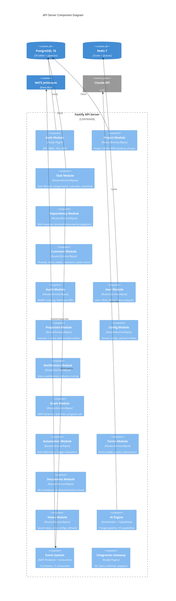

### 5.2 Module Catalog

| Module | Release | Key Responsibilities | Feature Refs |
|--------|---------|---------------------|-------------|
| **Project** | R0 | Project CRUD, NL description storage, WBS baseline snapshots (JSONB), phase management, composite endpoints. | F-003, F-011 |
| **Task** | R0 | Full task lifecycle: configurable statuses, multiple assignees (junction table), effort tracking, `ai_generated` + `ai_confidence` flags, single-level sub-tasks, checklists (F-089), recurring tasks (F-090). | F-006, F-008, F-089, F-090 |
| **Dependency** | R0 | Finish-to-start relationships, circular dependency prevention via DAG traversal, auto blocked/unblocked propagation. | F-007 |
| **Comment** | R0 | Per-task threads, `client_visible` boolean, edit/delete with "edited" indicator, @mentions (F-093), action items (F-097). Feeds embedding pipeline for RAG. | F-026, F-093, F-097 |
| **Audit** | R0 | Immutable INSERT-only `audit_log`. Field-level diffs: `entity_type`, `entity_id`, `field_name`, `old_value`, `new_value`, `actor_type`, `actor_id`, `ai_action_id`. Partitioned monthly. | F-009 |
| **User** | R0 | Tenant-scoped user management, `/users/me/next` endpoint for AI-curated task prioritization, availability tracking, workload metrics. | F-004, F-012 |
| **Projection** | R0/R2 | Internal truth -> client-safe view transformation. Field-level redaction rules, narrative generation, approval workflow. Data layer, not UI filter. | F-042, F-055 |
| **Config** | R0 | Per-tenant settings: status labels, priority levels, AI confidence thresholds, autonomy policies. Redis-cached with NATS invalidation. | F-010 |
| **Notification** | R1 | Notification generator (from events), notification inbox API, user notification preferences (in-app/email/Slack), delivery routing. | F-096 (FR-2007) |
| **Goals** | R2 | Goal/Objective/Key Result CRUD, self-referencing hierarchy, goal-task links, auto-calculated progress, AI risk flagging. | F-095 (FR-2006) |
| **Automation** | R2 | User-configurable if-then rules. Trigger types: status_changed, assigned, due_soon, dependency_resolved, custom_field_changed. Action types: change_status, assign_user, add_tag, send_notification, trigger_webhook. | F-098 (FR-2009) |
| **Forms** | R2 | Form builder with drag-and-drop fields. Public shareable link (no auth). Submissions create tasks. Form field types: text, number, date, select, multi-select, URL, email, checkbox. | F-099 (FR-2010) |
| **Documents** | R2 | Collaborative Markdown documents linked to projects. Draft/published/archived statuses. Indexed into pgvector for RAG. Client-visible flag for projection layer. | F-101 (FR-2012) |
| **Views** | R1 | Saved view configurations (list, board, calendar, table, timeline, gantt). Column configs, sort/filter state, default views per user per project. | F-092 (FR-2003) |

**Module architecture pattern:** Each module follows `routes/ -> services/ -> repositories/ -> types/ -> events/`. Modules communicate via service interfaces, never direct repository imports. Cross-module side effects flow through NATS events.

---

## 6. Tier 4 — AI Engine

This is the product. Every other tier exists to feed data into and execute actions from this tier.

### 6.1 AI Orchestrator — 7-Stage Pipeline

All AI operations flow through a single orchestration pipeline. No AI capability calls the LLM directly.

```
1. TRIGGER        -> Event from NATS, user request from API, or scheduled job
2. AUTONOMY CHECK -> Policy engine determines: shadow, propose, or execute (F-015)
3. CONTEXT ASSEMBLY -> RAG retrieval + event history + domain template + token budget
                       + custom field data + document content (v3.1: expanded context)
4. CONFIDENCE CHECK -> Pre-flight: is context sufficient? Below threshold -> graceful degradation (F-018)
5. LLM CALL       -> Routed through LLM Gateway (model selection, retry, streaming)
6. POST-PROCESSING -> Parse structured output, validate against schema, extract actions
7. DISPOSITION     -> Shadow: log only. Propose: create proposal. Execute: apply + log.
```

**v3.1 context assembly updates:**
- Custom field values (F-094) are included in context assembly for WBS generation, prioritization, and NL queries
- Document content (F-101) is embedded and retrievable via RAG, enriching AI responses with organizational knowledge
- Checklist data (F-089) is included in task context for summary generation
- Goal/OKR data (F-095) is available for portfolio-level AI operations

### 6.2 AI Capabilities (10)

| # | Capability | Model | Release | Token Profile | Feature Ref | Purpose |
|---|-----------|-------|---------|---------------|-------------|---------|
| 1 | **NL->WBS Generator** | Claude Opus 4 | R0 | ~5K in / ~3K out | F-011 (FR-200) | 5-stage sub-pipeline: domain detection -> template selection -> RAG enrichment -> Opus generation -> schema validation. Domain-specific templates for software delivery, data migration, consultancy. **40%+ of R0 AI engineering time.** |
| 2 | **"What's Next" Engine** | Rules-based (R0) / Sonnet (R1) | R0 | ~1K in / ~500 out | F-012 (FR-201) | Per-developer task prioritization. R0: dependency resolved -> due date -> priority (pure algorithm). R1: LLM-ranked with velocity context and NL explanations. |
| 3 | **NL Query Engine** | Claude Sonnet 4.5 | R0 | ~2K in / ~1K out | F-014 (FR-203) | Natural language questions about project state. RAG retrieval -> context assembly -> Sonnet synthesis. Streaming SSE, p95 <8s. |
| 4 | **Summary Engine** | Claude Sonnet 4.5 | R0/R1 | ~3K in / ~1K out | F-013 (FR-202) | Daily summaries (R0), weekly status reports (R1), client narratives (R2). Client summaries route through projection layer + mandatory approval. |
| 5 | **Risk Predictor** | Claude Opus 4 | R1 | ~4K in / ~2K out | F-030 (FR-603) | Pattern analysis: blocker duration, stalled tasks, dependency chain growth, scope drift. Shadow mode first 2-4 weeks. Outputs risk flags with confidence + mitigations. |
| 6 | **AI PM Agent** | Claude Sonnet 4.5 | R1 | ~2K in / ~500 out/action | F-028 (FR-601) | Autonomous 15-min loop. Chases overdue updates via Slack DMs, nudges stalled work, proposes escalations. Quiet hours + max 2 nudges/task/day. |
| 7 | **Scope Creep Detector** | Claude Sonnet 4.5 | R1 | ~3K in / ~1K out | F-034 (FR-607) | Monitors task additions vs original WBS baseline (JSONB snapshot). Alerts when scope drifts >15%. |
| 8 | **SOW Generator** | Claude Opus 4 | R3 | ~8K in / ~5K out | F-083 (FR-1800) | Revenue-generating: generates Statements of Work from historical delivery data. Long-context Opus + template system + approval workflow. The consultancy killer feature. |
| 9 | **Per-Tenant Learning** | RAG enrichment | R3 | Variable | F-074 (FR-1700) | Tenant-scoped model contexts that improve WBS, estimation, and risk prediction from each org's own delivery history. The moat. |
| 10 | **AI Writing Assistant** | Claude Sonnet 4.5 | R2 | ~2K in / ~1K out | F-102 (FR-2013) | Content generation: draft task descriptions from title, improve/expand text, generate meeting notes, translate technical -> business language. **New in v3.1.** |

### 6.3 Shared AI Infrastructure

| Component | Technology | Purpose |
|-----------|-----------|---------|
| **Context Assembly Layer** | TypeScript module | Loads tenant data, retrieves similar historical context via pgvector (cosine similarity, top-k=10), aggregates recent events, selects domain template, enforces per-operation token budget. **v3.1:** expanded to include custom fields, documents, checklists, goals. |
| **LLM Gateway** | TypeScript wrapping Anthropic SDK | Model routing (Opus for generation/risk, Sonnet for queries/summaries). Retry with exponential backoff (3 attempts: 1s, 2s, 4s). Fallback chain (Opus -> Sonnet). Streaming for interactive queries. Rate limiting per tenant. **Circuit breaker:** 5 consecutive failures -> 60s open -> cached/fallback responses. |
| **Prompt Registry** | Versioned YAML in `/prompts/` | Central repository of prompt templates with Handlebars context injection. Schema validation for expected output. Version-pinned per capability. PR-reviewed like code. |
| **Evaluation Harness** | Golden test sets + CI | Automated quality checks on every prompt version change. Tracks: acceptance rate (<60% triggers review), override rate (>40% = miscalibration), hallucination incidents. R0: manual + golden sets. R1: fully automated CI. |
| **Traceability Pipeline** | `ai_actions` table + logs | Every AI action logged: trigger_event -> context_assembled -> prompt_hash -> model_output -> confidence_score -> disposition -> human_review -> rollback_data. Full chain queryable via API. |
| **Cost Tracker** | Redis counters + `ai_cost_log` table | Per-operation: input tokens, output tokens, USD cost, model, capability, tenant_id. Per-tenant monthly budget caps with pre-flight check. Alerts at 80% and 100%. |

---

## 7. Tier 5 — Event Bus

The nervous system. Every AI capability, integration, and observability pipeline consumes from this bus.

**Configuration:** NATS JetStream 2.10+, 3-node cluster on ECS Fargate, EFS for persistence, 30-day retention, at-least-once delivery.

### 7.1 Stream Topology (12 Streams)

| Stream | Subjects | Producers | Key Consumers |
|--------|----------|-----------|---------------|
| `pm.tasks` | `.created`, `.updated`, `.status_changed`, `.assigned`, `.completed`, `.dependency_resolved`, `.dependency_blocked`, `.checklist_updated`, `.recurrence_triggered`, `.custom_field_updated` | Task Module, Recurrence Scheduler | AI Adaptive, Audit Writer, Embedding Pipeline, Notification Generator, Projection Updater, Automation Engine |
| `pm.projects` | `.created`, `.updated`, `.phase_changed`, `.baseline_set` | Project Module | AI Summarizer, Embedding Pipeline, Scope Creep Detector |
| `pm.comments` | `.created`, `.updated`, `.deleted`, `.mention_created`, `.action_assigned` | Comment Module | Embedding Pipeline, Notification Generator, Automation Engine |
| `pm.ai` | `.action_proposed`, `.action_approved`, `.action_rejected`, `.action_executed`, `.confidence_low` | AI Orchestrator | Traceability Pipeline, Cost Tracker, Evaluation Harness |
| `pm.integrations` | `.git_commit`, `.git_pr_merged`, `.slack_message`, `.calendar_updated` | Integration Adapters | AI Adaptive, Task Module (auto-complete) |
| `pm.notifications` | `.created` | Notification Generator | Notification Router (delivery) |
| `pm.reminders` | `.due` | Reminder Scheduler | Notification Generator |
| `pm.goals` | `.progress_updated`, `.at_risk` | Goals Module | Notification Generator, AI Adaptive |
| `pm.automations` | `.triggered`, `.executed` | Automation Engine | Audit Writer, Cost Tracker |
| `pm.forms` | `.submitted` | Forms Module (public endpoint) | Task Module (creates task), Notification Generator |
| `pm.documents` | `.created`, `.updated` | Documents Module | Embedding Pipeline (RAG), Notification Generator |
| `pm.system` | `.config_changed`, `.tenant_created`, `.user_invited` | Config, User Modules | Config Cache Invalidation, Notification Router |

### 7.2 Event Flow Diagram

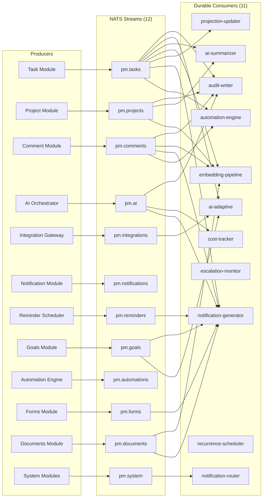

### 7.3 Consumer Groups (11 Durable Consumers)

| Consumer | Subscribes To | Purpose | Release |
|----------|--------------|---------|---------|
| `audit-writer` | `pm.tasks.*`, `pm.projects.*`, `pm.comments.*`, `pm.ai.*`, `pm.automations.*` | Writes immutable audit log entries for every state change | R0 |
| `ai-adaptive` | `pm.tasks.*`, `pm.integrations.*`, `pm.goals.*` | Feeds task state changes and git activity to adaptive engine | R0 (rules) / R1 (AI) |
| `ai-summarizer` | `pm.tasks.*`, `pm.projects.*`, `pm.comments.*` | Aggregates activity for daily/weekly summary generation | R0 |
| `embedding-pipeline` | `pm.tasks.created/updated`, `pm.comments.created`, `pm.projects.created`, `pm.documents.*` | Generates embeddings, stores in pgvector | R0 |
| `projection-updater` | `pm.tasks.*`, `pm.projects.*`, `pm.comments.*` | Updates client-facing projection views | R0 (model) / R2 (active) |
| `notification-router` | `pm.notifications.created`, `pm.system.*` | Routes notifications to channels (in-app, email, Slack) | R0 (in-app) / R1 (Slack) |
| `cost-tracker` | `pm.ai.*`, `pm.automations.*` | Tracks AI operation costs per tenant, updates Redis counters | R0 |
| `escalation-monitor` | `pm.tasks.status_changed`, `pm.tasks.dependency_blocked` | Monitors for escalation conditions (blocked >48h, overdue) | R1 |
| `notification-generator` | `pm.tasks.*`, `pm.comments.*`, `pm.ai.*`, `pm.reminders.*`, `pm.goals.*`, `pm.forms.*`, `pm.documents.*` | Creates notification records based on user preferences | R1 |
| `recurrence-scheduler` | `pm.tasks.recurrence_triggered` | Clones recurring tasks when schedule fires (iCal RRULE) | R1 |
| `automation-engine` | `pm.tasks.*`, `pm.comments.*` | Evaluates and executes user-defined automation rules | R2 |

**DLQ strategy:** 3 retries with exponential backoff (1s, 5s, 25s). Each consumer has a dedicated DLQ stream. 7-day retention. CloudWatch alarm on DLQ count >0. Manual replay via admin CLI.

**Idempotency:** All consumers use event `id` field for deduplication via Redis keys with 7-day TTL.

---

## 8. Tier 6 — Data Layer

One database, stretched intelligently. Separate stores only where access patterns demand it.

| Component | AWS Service | Configuration | Purpose |
|-----------|-------------|---------------|---------|
| **PostgreSQL 16** | RDS (Multi-AZ) | R0: `db.r6g.large` (2 vCPU, 16 GB). R2: `db.r6g.xlarge` + read replica. | Primary relational store. 30 tables. `tenant_id` on every table. Strong FK constraints. JSONB for WBS baselines, AI metadata, configurable fields. Immutable `audit_log`. Drizzle ORM. |
| **pgvector** | Co-located in RDS | `text-embedding-3-small` (1536 dimensions). IVFFlat index R0-R2, evaluate HNSW at R3. | Embeddings for tasks, comments, project descriptions, documents, audit summaries. Co-located = SQL JOINs in RAG queries. |
| **Redis 7** | ElastiCache Serverless | AOF persistence + hourly snapshots. | Sessions, rate limiting, AI operation queues (BullMQ), presence, config cache, AI response cache. |
| **S3** | S3 Standard + Glacier | 4 buckets: `uploads`, `exports`, `reports`, `backups`. Versioning. Glacier lifecycle >90 days. Cross-region on backups. | File attachments, exports, report PDFs, DB backups, prompt archives. |
| **Full-Text Search** | PostgreSQL FTS | `tsvector` on tasks, projects, comments, documents. GIN indexes. | Task/project/document search. Evaluate Elasticsearch at R3 if >500K documents. |

### 8.1 Complete Table Catalog (30 Tables)

| # | Table | FR Ref | Release | Key Purpose | Rows Estimate (R3) |
|---|-------|--------|---------|-------------|-------------------|
| 1 | `tenants` | FR-101 | R0 | Tenant definitions, plan, AI budget | ~10 |
| 2 | `users` | FR-103 | R0 | User accounts, roles, MFA, preferences | ~500 |
| 3 | `projects` | FR-102 | R0 | Projects, NL description, WBS baseline | ~200 |
| 4 | `phases` | FR-102 | R0 | Project phases, ordering | ~1,000 |
| 5 | `tasks` | FR-105 | R0 | Full task data model, AI metadata, recurrence | ~100,000 |
| 6 | `task_assignments` | FR-105 | R0 | Multi-assignee junction (assignee/reviewer/approver) | ~150,000 |
| 7 | `task_dependencies` | FR-106 | R0 | Finish-to-start relationships | ~50,000 |
| 8 | `comments` | FR-503 | R0 | Task comments, client_visible, action items | ~200,000 |
| 9 | `tags` | FR-1000 | R1 | Default + custom tags per project/tenant | ~2,000 |
| 10 | `task_tags` | FR-1000 | R1 | Task-to-tag junction | ~300,000 |
| 11 | `ai_actions` | FR-400 | R0 | Full AI traceability chain | ~50,000 |
| 12 | `ai_cost_log` | FR-1000 | R0 | Per-operation token + cost tracking | ~100,000 |
| 13 | `audit_log` | FR-108 | R0 | Immutable, INSERT-only, monthly partitioned | ~2,000,000 |
| 14 | `tenant_configs` | FR-109 | R0 | Per-tenant key-value configuration | ~200 |
| 15 | `embeddings` | FR-200 | R0 | pgvector 1536-dim, IVFFlat indexed | ~500,000 |
| 16 | `task_checklists` | FR-2000 | R0 | Checklists within tasks | ~50,000 |
| 17 | `checklist_items` | FR-2000 | R0 | Individual checklist items | ~200,000 |
| 18 | `mentions` | FR-2004 | R0 | @mentions in comments | ~100,000 |
| 19 | `custom_field_definitions` | FR-2005 | R1 | Field schemas (text/number/date/select/formula) | ~500 |
| 20 | `custom_field_values` | FR-2005 | R1 | Polymorphic field values per task | ~500,000 |
| 21 | `saved_views` | FR-2003 | R1 | View configs (list/board/calendar/table/gantt/timeline) | ~2,000 |
| 22 | `goals` | FR-2006 | R2 | OKR hierarchy (goal/objective/key_result) | ~1,000 |
| 23 | `goal_task_links` | FR-2006 | R2 | Goal-to-task association | ~10,000 |
| 24 | `notifications` | FR-2007 | R1 | User notification records | ~1,000,000 |
| 25 | `notification_preferences` | FR-2007 | R1 | Per-user per-type per-channel preferences | ~5,000 |
| 26 | `automation_rules` | FR-2009 | R2 | If-then automation rule definitions | ~500 |
| 27 | `forms` | FR-2010 | R2 | Form definitions, public slugs, field schemas | ~200 |
| 28 | `documents` | FR-2012 | R2 | Markdown docs, draft/published/archived | ~5,000 |
| 29 | `reminders` | FR-2014 | R1 | Personal task reminders | ~20,000 |
| 30 | `tasks` (extended) | FR-2001/2008 | R1 | Added: `recurrence_rule`, `recurrence_parent_id`, `next_recurrence_at` (to tasks table) | — |

### 8.2 Entity-Relationship Diagram (Core Tables)

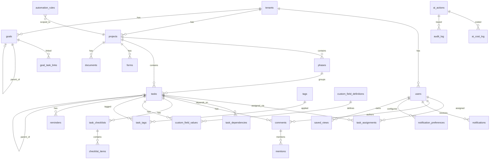

### 8.3 Row-Level Security (RLS)

All 30 tenant-scoped tables have RLS policies:

```sql
CREATE POLICY tenant_isolation ON <table_name>
  USING (tenant_id = current_setting('app.current_tenant_id')::uuid);
```

**Middleware:** `SET LOCAL app.current_tenant_id = '<tenant_id>'` per request from JWT claim. `SET LOCAL` scopes to current transaction, preventing cross-request leakage in connection pools.

**Tables with RLS enabled:** `users`, `projects`, `phases`, `tasks`, `task_assignments`, `task_dependencies`, `comments`, `tags`, `task_tags`, `ai_actions`, `ai_cost_log`, `audit_log`, `tenant_configs`, `embeddings`, `task_checklists`, `checklist_items`, `mentions`, `custom_field_definitions`, `custom_field_values`, `saved_views`, `goals`, `goal_task_links`, `notifications`, `notification_preferences`, `automation_rules`, `forms`, `documents`, `reminders`.

### 8.4 Indexing Strategy

- `tenant_id` as first column in every composite index (tenant locality in B-tree)
- GIN indexes for `tsvector` full-text search
- IVFFlat for pgvector (R0-R2), evaluate HNSW at R3
- Partial indexes: `WHERE deleted_at IS NULL`, `WHERE ai_generated = true`, `WHERE is_sent = false`
- `audit_log` partitioned by month via `created_at`

### 8.5 Custom Fields — Polymorphic Storage Pattern

Custom fields (F-094 / FR-2005) use a definition + values pattern:

- **Definitions** (`custom_field_definitions`): tenant/project-scoped, typed (`text`, `number`, `date`, `select`, `multi_select`, `url`, `email`, `checkbox`, `formula`)
- **Values** (`custom_field_values`): polymorphic storage with `value_text`, `value_number`, `value_date`, `value_json` columns — only the appropriate column is populated based on field type
- **Formula fields** (F-100 / FR-2011): `formula_expression` stored on definition, computed at read time

---

## 9. New Subsystem Architectures

These 7 subsystems were introduced or significantly expanded by the ClickUp gap analysis. Each uses existing infrastructure (NATS, PostgreSQL, Redis) without requiring new architectural components.

### 9.1 Notification Pipeline (F-096 / FR-2007)

Two-stage pipeline: generate notification records from events, then route to delivery channels.

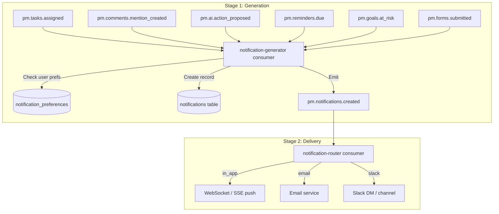

**Key design decisions:**
- Notification preferences stored per-user per-type per-channel
- Bell icon shows unread count (WebSocket push in R1, polling in R0)
- Notification inbox supports filtering by type and read/unread status
- Batch notification grouping: multiple rapid events consolidated into a single notification

### 9.2 Automation Engine (F-098 / FR-2009)

Deterministic if-then rules, distinct from AI autonomy.

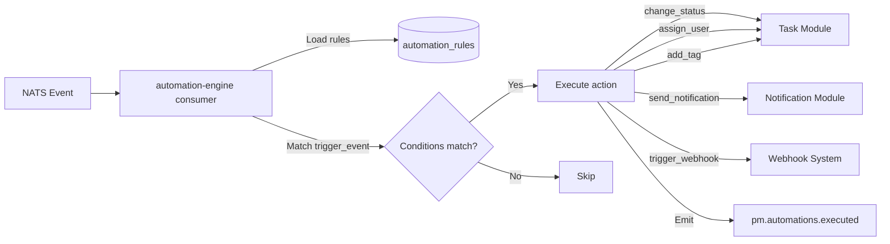

**Trigger types:** `task_status_changed`, `task_assigned`, `task_due_soon`, `dependency_resolved`, `custom_field_changed`
**Action types:** `change_status`, `assign_user`, `add_tag`, `send_notification`, `set_priority`, `trigger_webhook`

### 9.3 Recurring Task Scheduler (F-090 / FR-2001)

Uses iCal RRULE format for schedule definition. pg_cron or BullMQ scheduled job checks for due recurrences.

**Flow:**
1. Recurring task created with `recurrence_rule` (iCal RRULE) and `next_recurrence_at` computed
2. Scheduler job runs every 5 minutes: `SELECT * FROM tasks WHERE next_recurrence_at <= now() AND recurrence_rule IS NOT NULL`
3. For each due task: clone it (title, description, assignees, checklist template, phase), link via `recurrence_parent_id`
4. Update `next_recurrence_at` based on RRULE
5. Emit `pm.tasks.recurrence_triggered` and `pm.tasks.created`

### 9.4 Custom Fields System (F-094 / FR-2005)

Polymorphic storage pattern — field definition + typed value columns.

**Flow:** Define field schema -> tasks gain optional custom field values -> AI context assembly reads custom fields for WBS/prioritization/queries -> table view renders inline-editable custom field columns -> automation triggers can reference custom field changes.

### 9.5 Goals & OKR (F-095 / FR-2006)

Self-referencing hierarchy: Goal -> Objectives -> Key Results. Tasks link to any level.

**Progress calculation:** `goal.current_value = SUM(linked_tasks.completed_count) / SUM(linked_tasks.total_count) * target_value`

**AI integration:** AI PM Agent flags goals at risk based on linked task progress velocity. Emits `pm.goals.at_risk` for notification pipeline.

### 9.6 Documents & Knowledge Base (F-101 / FR-2012)

Markdown documents with draft/published/archived lifecycle. Indexed into pgvector for RAG.

**RAG integration:**
1. Document created/updated -> `pm.documents.created/updated` event
2. `embedding-pipeline` consumer generates embedding for document content
3. Stored in `embeddings` table with `entity_type = 'document'`
4. NL Query Engine and WBS Generator can retrieve relevant document content during context assembly

### 9.7 Form Intake System (F-099 / FR-2010)

Public shareable forms that create tasks on submission.

**Flow:**
1. PM builds form via drag-and-drop builder (field types: text, number, date, select, etc.)
2. Form published -> generates public URL (`/forms/{public_slug}`)
3. Submission -> `pm.forms.submitted` event -> Task Module creates task with form data mapped to task fields
4. Notification sent to configured assignee

---

## 10. Tier 7 — Integration Gateway

Adapters that bring external signals into the event bus. Each adapter is a lightweight Fastify plugin.

| Adapter | Protocol | Release | Signal Value |
|---------|----------|---------|-------------|
| **Git** (GitHub, GitLab, Azure DevOps) | Inbound webhooks | R1 | Ground truth for progress. Auto-link commits/PRs to tasks. Auto-complete on merge. |
| **Slack / Teams** | OAuth 2.0 + Events API | R1 | Bidirectional. AI PM Agent nudges, daily summaries, slash commands (`/aipm status/next/query`). |
| **Calendar** (Google, Outlook) | CalDAV / OAuth 2.0 | R2 | Team availability for resource optimization. |
| **Webhook System** (outbound) | Tenant-configurable | R2 | Event subscriptions to external URLs. HMAC-SHA256 verification. 3 retries. |
| **Jira Import** | REST API batch | R2 | One-time migration: projects, tasks, dependencies, comments. |

**Adapter architecture:** Each integration is a Fastify plugin with three responsibilities: (1) authenticate external service, (2) normalize inbound events to NATS subjects, (3) format outbound messages. Adapters share no state.

---

## 11. Tier 8 — Security & AI Safety

### 11.1 Encryption Matrix

| Data State | Method | Key Management |
|------------|--------|---------------|
| At rest (RDS, S3, ElastiCache) | AES-256 | AWS KMS (auto-rotation) |
| In transit (all connections) | TLS 1.3 | ACM-managed certs, RDS CA |
| JWT signing | RS256 | Asymmetric keypair in Secrets Manager |

### 11.2 Three-Layer Tenant Isolation

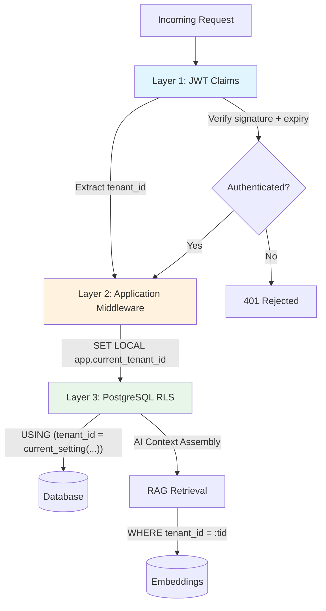

**AI-specific isolation:** RAG retrieval scoped by `tenant_id` in WHERE clause (not post-filter). Embedding queries include tenant filter in vector search. Context assembly verified to contain only current tenant's data.

### 11.3 SOC 2 Control Mapping

| Criteria | Implementation | Release |
|----------|---------------|---------|
| CC6.1 Logical access | RBAC + JWT + RLS | R0 |
| CC6.2 Authentication | Password + MFA + SSO | R0/R1 |
| CC6.6 System boundaries | VPC, security groups, WAF | R0 |
| CC6.7 Change management | GitOps, PR approvals, CI/CD | R0 |
| CC7.1 Monitoring | CloudWatch, Sentry, alerting | R0 |
| CC8.1 Data protection | Encryption at rest + in transit | R0 |
| PI1.1 Data integrity | FK constraints, immutable audit | R0 |
| SOC 2 Type I audit | Formal audit initiated | R2 |
| SOC 2 Type II | 6-month sustained evidence | R3 |

### 11.4 Prompt Injection Defense (R2+)

| Defense Layer | Implementation |
|---------------|---------------|
| Input sanitization | Strip control characters, limit length before LLM context |
| Structured fields | Tenant data in structured fields, not raw user input in system prompts |
| Output validation | LLM output validated against JSON schema before execution |
| Action logging | Every AI action logged in `ai_actions` table |
| Rate limiting | Per-tenant rate limits prevent abuse |

---

## 12. Tier 9 — Deployment & CI/CD

### 12.1 AWS Deployment Topology

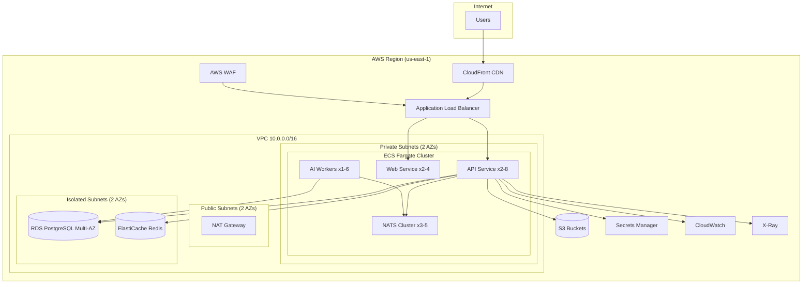

### 12.2 ECS Fargate Services

| Service | R0 Tasks | R1 Tasks | R2 Tasks | R3 Tasks | CPU | Memory |
|---------|----------|----------|----------|----------|-----|--------|
| API | 2 | 2 | 3-4 | 2-8 | 1 vCPU | 2 GB |
| AI Workers | 1 (in-process) | 2 (separate) | 2-4 | 2-6 | 1 vCPU | 4 GB |
| Web (Next.js) | 2 | 2 | 2 | 2-4 | 0.5 vCPU | 1 GB |
| NATS Cluster | 3 | 3 | 3 | 3-5 | 0.5 vCPU | 1 GB |

**Auto-scaling:** API on CPU 70% (min 2, max 8). AI Workers on BullMQ queue depth >50 (min 1, max 4).

### 12.3 CDK Stack Structure

| Stack | Resources |
|-------|-----------|
| `VpcStack` | VPC, subnets, NAT gateways, security groups |
| `DatabaseStack` | RDS PostgreSQL, ElastiCache Redis, S3 buckets |
| `ComputeStack` | ECS cluster, Fargate services, ALB, auto-scaling |
| `MonitoringStack` | CloudWatch dashboards, alarms, SNS, X-Ray |
| `PipelineStack` | ECR repos, IAM roles, CodePipeline (optional) |

### 12.4 Environments

| Aspect | Dev | Staging | Production |
|--------|-----|---------|------------|
| AZ | Single | Multi-AZ | Multi-AZ |
| RDS | db.t3.medium | db.r6g.large | db.r6g.large (Multi-AZ) |
| Encryption | At rest only | Full | Full |
| Monitoring | Basic | Full | Full + PagerDuty |

---

## 13. Tier 10 — Monitoring & Observability

| Component | Service | Purpose |
|-----------|---------|---------|
| **Metrics** | CloudWatch + EMF | Request latency, error rates, AI operation latency/cost, confidence distribution |
| **Logging** | CloudWatch Logs | Structured JSON, 30-day retention (prod), 7-day (staging) |
| **Tracing** | AWS X-Ray | End-to-end: API -> AI Orchestrator -> LLM Gateway -> DB |
| **Errors** | Sentry | Frontend + backend error grouping, source maps, release tracking |
| **Alerting** | CloudWatch Alarms -> SNS -> PagerDuty/Slack | Circuit breaker open, AI fail rate >10%, budget exceeded, NATS lag >1000, p95 >2s |
| **AI Dashboard** | CloudWatch Custom | Per-capability latency, per-tenant budget, acceptance rates, circuit breaker state |

**AI-specific metrics:** operation latency per capability, token usage, cost per operation, confidence score distribution, acceptance rate, override rate, circuit breaker state.

---

## 14. Data Flow Diagrams

### 14.1 NL-to-WBS Sequence

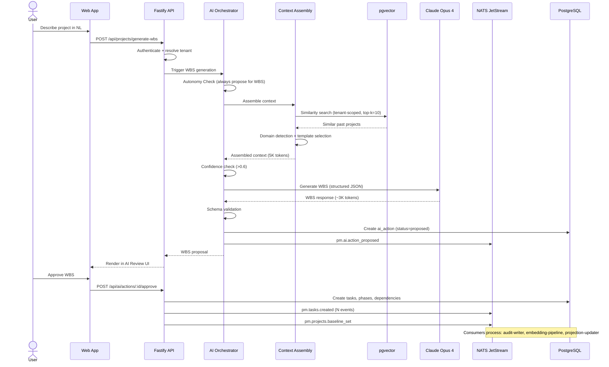

### 14.2 AI PM Agent Sequence

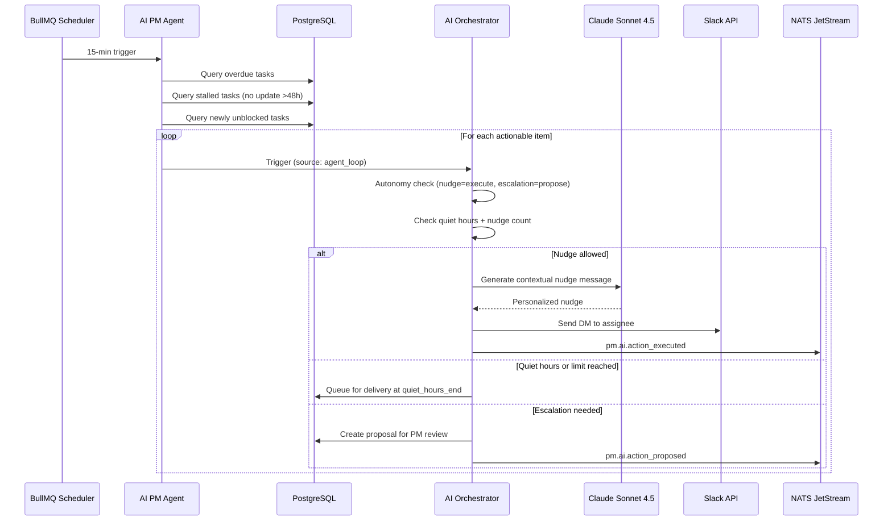

### 14.3 Notification Pipeline Sequence

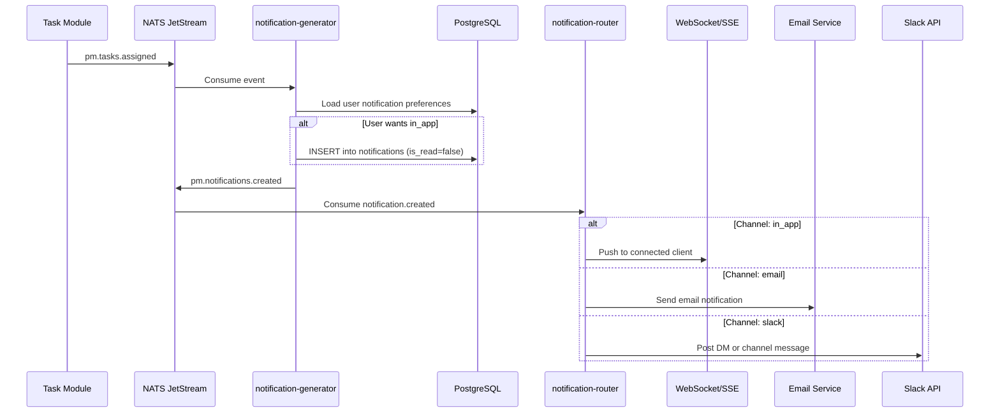

---

## 15. API Endpoint Summary

### 15.1 Conventions

| Convention | Value |
|-----------|-------|
| Base URL | `/api/v1/` |
| Auth | Bearer JWT in Authorization header |
| Pagination | Cursor-based (`?cursor=<id>&limit=20`) |
| Includes | `?include=phases,tasks,dependencies` |
| Filtering | Query params (`?status=in_progress&priority=high`) |
| Sorting | `?sort=due_date&order=asc` |
| Errors | `{ error: string, code: string, details?: object }` |

### 15.2 Endpoint Catalog (~85 Endpoints)

| Module | Method | Path | Purpose | Release |
|--------|--------|------|---------|---------|
| **Auth** | POST | `/auth/register` | User registration | R0 |
| | POST | `/auth/login` | Email/password login | R0 |
| | POST | `/auth/refresh` | Token refresh | R0 |
| | POST | `/auth/logout` | Session logout | R0 |
| | POST | `/auth/reset-password` | Password reset request | R0 |
| | POST | `/auth/sso/:provider` | SSO login | R1 |
| | POST | `/auth/mfa/setup` | MFA setup | R1 |
| | POST | `/auth/mfa/verify` | MFA verification | R1 |
| **Projects** | GET | `/projects` | List projects | R0 |
| | POST | `/projects` | Create project | R0 |
| | GET | `/projects/:id` | Get project (with includes) | R0 |
| | PATCH | `/projects/:id` | Update project | R0 |
| | DELETE | `/projects/:id` | Soft-delete project | R0 |
| | POST | `/projects/generate-wbs` | NL to WBS generation | R0 |
| | GET | `/projects/:id/baseline` | Get WBS baseline | R0 |
| | GET | `/projects/:id/phases` | List phases | R0 |
| | POST | `/projects/:id/phases` | Create phase | R0 |
| **Tasks** | GET | `/tasks` | List tasks (filtered) | R0 |
| | POST | `/tasks` | Create task | R0 |
| | GET | `/tasks/:id` | Get task detail | R0 |
| | PATCH | `/tasks/:id` | Update task | R0 |
| | DELETE | `/tasks/:id` | Soft-delete task | R0 |
| | POST | `/tasks/:id/transition` | Status transition | R0 |
| | GET | `/tasks/:id/subtasks` | Get sub-tasks | R0 |
| | POST | `/tasks/:id/assign` | Assign users | R0 |
| | GET | `/tasks/:id/dependencies` | Get dependencies | R0 |
| | POST | `/tasks/:id/dependencies` | Create dependency | R0 |
| | GET | `/tasks/:id/checklists` | Get checklists | R0 |
| | POST | `/tasks/:id/checklists` | Create checklist | R0 |
| | PATCH | `/checklists/:id/items/:itemId` | Toggle checklist item | R0 |
| | POST | `/tasks/bulk` | Bulk create (WBS import) | R0 |
| | POST | `/tasks/import` | CSV/XLSX import | R2 |
| | GET | `/tasks/:id/custom-fields` | Get custom field values | R1 |
| | PATCH | `/tasks/:id/custom-fields` | Set custom field values | R1 |
| | GET | `/tasks/:id/reminders` | Get reminders | R1 |
| | POST | `/tasks/:id/reminders` | Create reminder | R1 |
| **Comments** | GET | `/tasks/:id/comments` | List comments | R0 |
| | POST | `/tasks/:id/comments` | Create comment | R0 |
| | PATCH | `/comments/:id` | Edit comment | R1 |
| | DELETE | `/comments/:id` | Soft-delete comment | R1 |
| | POST | `/comments/:id/assign` | Create action item | R1 |
| **Users** | GET | `/users` | List users | R0 |
| | GET | `/users/me` | Current user profile | R0 |
| | GET | `/users/me/next` | What's Next prioritized list | R0 |
| | GET | `/users/me/mentions` | My @mentions | R0 |
| | GET | `/users/me/action-items` | My action items | R1 |
| | PATCH | `/users/me` | Update profile | R0 |
| **AI** | GET | `/ai/actions` | List AI actions (filtered) | R0 |
| | GET | `/ai/actions/:id` | AI action detail | R0 |
| | POST | `/ai/actions/:id/approve` | Approve AI action | R0 |
| | POST | `/ai/actions/:id/reject` | Reject AI action | R0 |
| | POST | `/ai/actions/:id/rollback` | Rollback AI action | R0 |
| | POST | `/query` | NL query (streaming SSE) | R0 |
| | POST | `/ai/write` | AI writing assistant | R2 |
| | GET | `/ai/costs` | Cost dashboard data | R0 |
| | GET | `/ai/evaluation` | Evaluation metrics | R1 |
| **Notifications** | GET | `/notifications` | Get notification inbox | R1 |
| | PATCH | `/notifications/:id/read` | Mark as read | R1 |
| | POST | `/notifications/read-all` | Mark all as read | R1 |
| | GET | `/notifications/preferences` | Get preferences | R1 |
| | PATCH | `/notifications/preferences` | Update preferences | R1 |
| **Goals** | GET | `/goals` | List goals | R2 |
| | POST | `/goals` | Create goal | R2 |
| | GET | `/goals/:id` | Get goal with key results | R2 |
| | PATCH | `/goals/:id` | Update goal | R2 |
| | POST | `/goals/:id/link-tasks` | Link tasks to goal | R2 |
| **Custom Fields** | GET | `/custom-fields` | List field definitions | R1 |
| | POST | `/custom-fields` | Create field definition | R1 |
| | PATCH | `/custom-fields/:id` | Update field definition | R1 |
| **Automation** | GET | `/automations` | List rules | R2 |
| | POST | `/automations` | Create rule | R2 |
| | PATCH | `/automations/:id` | Update rule | R2 |
| | DELETE | `/automations/:id` | Delete rule | R2 |
| **Forms** | GET | `/forms` | List forms | R2 |
| | POST | `/forms` | Create form | R2 |
| | GET | `/forms/:id` | Get form detail | R2 |
| | PATCH | `/forms/:id` | Update form | R2 |
| | POST | `/forms/:slug/submit` | Public form submission | R2 |
| **Documents** | GET | `/documents` | List documents | R2 |
| | POST | `/documents` | Create document | R2 |
| | GET | `/documents/:id` | Get document | R2 |
| | PATCH | `/documents/:id` | Update document | R2 |
| **Views** | GET | `/views` | List saved views | R1 |
| | POST | `/views` | Create saved view | R1 |
| | PATCH | `/views/:id` | Update view config | R1 |
| | DELETE | `/views/:id` | Delete view | R1 |
| **Settings** | GET | `/settings` | Get tenant settings | R0 |
| | PATCH | `/settings` | Update tenant settings | R0 |
| | GET | `/settings/integrations` | Integration configs | R1 |
| **Portal** | GET | `/portal/overview` | Client portal overview | R2 |
| | GET | `/portal/milestones` | Client milestones | R2 |
| | POST | `/portal/query` | Client NL query | R2 |
| **Webhooks** | GET | `/webhooks/subscriptions` | List webhook subscriptions | R2 |
| | POST | `/webhooks/subscriptions` | Create subscription | R2 |
| | POST | `/webhooks/git/:provider` | Inbound git webhook | R1 |

---

## 16. Cost Model

### 16.1 Infrastructure Costs (Monthly, AWS)

| Component | R0 (Internal) | R1 (Pilot) | R2 (3 Tenants) | R3 (10 Tenants) |
|-----------|---------------|------------|-----------------|------------------|
| ECS Fargate (API + AI + Web) | $120 | $200 | $400 | $800 |
| RDS PostgreSQL (Multi-AZ) | $95 | $95 | $190 | $380 |
| ElastiCache Redis | $25 | $50 | $100 | $200 |
| NATS (3-node ECS) | $60 | $60 | $60 | $90 |
| Claude API (AI operations) | $30 | $80 | $150 | $400 |
| S3 + CloudFront | $10 | $15 | $30 | $60 |
| Monitoring (CloudWatch + Sentry) | $30 | $50 | $80 | $150 |
| Secrets Manager + misc | $10 | $15 | $20 | $30 |
| **Total** | **~$380** | **~$565** | **~$1,030** | **~$2,110** |

**v3.1 note:** New consumers and modules add negligible compute cost (shared ECS tasks). Primary cost increase comes from expanded AI Writing Assistant (F-102) token usage, estimated at $5-15/tenant/month additional.

### 16.2 Unit Economics (R2 Target)

- Revenue per tenant: $500/mo (Pro tier average)
- Infrastructure cost per tenant: ~$110/mo (shared infra amortized over 3 tenants + per-tenant AI)
- **Gross margin: ~78%**

### 16.3 AI Token Cost Model (Per Tenant Per Month)

| Tier | AI Ops/Month | Estimated Token Cost | Subscription Price |
|------|-------------|---------------------|--------------------|
| Starter | ~500 | $8-15 | $29/mo |
| Pro | ~2,000 | $25-50 | $99/mo |
| Enterprise | ~5,000+ | $60-120 | $249+/mo |

---

## 17. Release-Architecture Alignment

| Tier | R0 (Months 1-3) | R1 (Months 4-6) | R2 (Months 7-9) | R3 (Months 10-12) |
|------|------------------|------------------|------------------|---------------------|
| **Client** | Web app (list view), AI review UI | + Board, Calendar, Table, Timeline views, Notification inbox, Slack bot | + Client portal, Gantt view, Goals dashboard, Docs/KB, Public API | Optional: enhanced views |
| **Gateway** | ALB + WAF, password auth, RBAC (Admin+Dev) | + SSO, MFA, WebSocket | + Client role | + PM role |
| **Application** | 8 modules (Project-Config) | + Notification, Views, Custom Fields (14 total) | + Goals, Automation, Forms, Documents | + Enterprise config |
| **AI Engine** | NL->WBS, What's Next (rules), NL Query, Shadow mode, Autonomy, Traceability | + Adaptive engine, AI PM Agent, Risk predictor, Scope creep, Summary (full) | + AI Writing Assistant, AI guardrails, Cost dashboard | + Per-tenant learning, SOW generator |
| **Event Bus** | 6 core streams, 7 consumers | + 6 new streams (12 total), + 4 new consumers (11 total) | No stream changes needed | Evaluate 5-node |
| **Data** | 18 tables, PG 16 + pgvector, Redis, S3 | + 12 tables (30 total) | + Read replica | Evaluate schema isolation |
| **Integrations** | None | + Git, Slack/Teams | + Calendar, Webhooks, Jira import | + Additional providers |
| **Security** | RLS, encryption, audit trail | + SOC 2 controls | + PII scanning, prompt injection, SOC 2 Type I | + SOC 2 Type II |
| **Deployment** | ECS Fargate (2 tasks), CDK, CI/CD | + AI Worker separate service | + Auto-scaling | + Performance tuning |
| **Monitoring** | CloudWatch basics, Sentry | + X-Ray, AI dashboard | + Custom alerting | + Tenant-level monitoring |

---

## 18. Architecture Decision Records (ADR Summary)

| ADR | Decision | Over | Rationale | Revisit When |
|-----|----------|------|-----------|-------------|
| ADR-001 | Hosted Claude API | Self-hosted LLM | Lower ops burden, latest model access. 5-person team can't run GPU infra. | R3: evaluate fine-tuning for per-tenant learning |
| ADR-002 | RAG with pgvector | Prompt engineering / dedicated vector DB | Co-located = SQL JOINs in RAG. Single DB to operate. | p95 vector search >100ms at 1M+ embeddings |
| ADR-003 | NATS JetStream | Kafka / Redis Streams / SQS | Persistent, replayable, lightweight ops. Sufficient for 11 consumers. | Consumer count >50 or throughput >100K events/min |
| ADR-004 | Shared schema + RLS | Schema-per-tenant / DB-per-tenant | Fast to ship. DB-enforced isolation. Single connection pool. | R3: evaluate schema isolation for enterprise |
| ADR-005 | Hybrid pricing | Pure per-seat / pure usage | Per-seat erodes margins on heavy AI users. Hybrid aligns cost. | After first 10 paying tenants |
| ADR-006 | PostgreSQL 16 + pgvector | Separate Pinecone/Weaviate | One DB. Co-location enables relational+vector queries. | Vector corpus >1M rows or latency degrades |
| ADR-007 | Fastify (Node.js + TS) | NestJS / FastAPI | Shared language with Next.js. Fastest Node.js framework. | Python ML requirements emerge in R3 |
| ADR-008 | ECS Fargate | EKS (Kubernetes) | Zero cluster mgmt. Right complexity for 5-person team. | Service count >15 or dedicated platform engineer |
| ADR-009 | AWS CDK (TypeScript) | Terraform | Same language as stack. Higher-level constructs. | Multi-cloud becomes a requirement |
| ADR-010 | Modular monolith -> extract AI worker | Microservices from day 1 | Microservices at 5 engineers = ops overhead that kills velocity. | Module scaling diverges significantly |
| ADR-011 | Next.js 15 single app, route groups | Separate frontends | One codebase, shared components, single deployment. | Portal needs fundamentally different deploy model |
| ADR-012 | CloudWatch + X-Ray + Sentry | Datadog / Grafana Cloud | Included with AWS + Sentry for frontend. Three focused tools. | Observability outgrows CloudWatch |

**v3.1 note:** No new ADRs were required. All 15 gap features (F-089 through F-103) are absorbed by existing architectural decisions — they use the same NATS event bus, PostgreSQL storage, RLS isolation, and AI orchestration pipeline. This validates Principle #7 (Evergreen architecture).

---

## 19. Monorepo Structure

```
ai-pm-tool/
+-- apps/
|   +-- web/                        # Next.js 15 (internal + portal)
|   |   +-- app/
|   |   |   +-- (internal)/         # Internal PM routes
|   |   |   |   +-- dashboard/
|   |   |   |   +-- projects/
|   |   |   |   +-- tasks/
|   |   |   |   +-- ai-review/
|   |   |   |   +-- notifications/  # NEW: notification inbox
|   |   |   |   +-- goals/          # NEW: goals & OKR dashboard
|   |   |   |   +-- documents/      # NEW: docs & knowledge base
|   |   |   |   +-- settings/
|   |   |   +-- (portal)/           # Client portal routes (R2)
|   |   |   +-- api/                # BFF routes
|   |   +-- components/
|   |   |   +-- ui/                 # Shadcn UI primitives
|   |   |   +-- ai/                 # AI review, What's Next, NL Query
|   |   |   +-- projects/
|   |   |   +-- tasks/
|   |   |   +-- views/              # NEW: board, calendar, table, gantt
|   |   |   +-- notifications/      # NEW: inbox, preferences
|   |   |   +-- goals/              # NEW: goal tree, progress
|   |   |   +-- documents/          # NEW: markdown editor, list
|   |   |   +-- forms/              # NEW: form builder, preview
|   |   |   +-- layout/
|   |   +-- lib/
|   |   +-- styles/
|   +-- api/                        # Fastify API server
|   |   +-- src/
|   |   |   +-- modules/
|   |   |   |   +-- project/
|   |   |   |   +-- task/
|   |   |   |   +-- dependency/
|   |   |   |   +-- comment/
|   |   |   |   +-- audit/
|   |   |   |   +-- user/
|   |   |   |   +-- projection/
|   |   |   |   +-- config/
|   |   |   |   +-- notification/   # NEW
|   |   |   |   +-- goals/          # NEW
|   |   |   |   +-- automation/     # NEW
|   |   |   |   +-- forms/          # NEW
|   |   |   |   +-- documents/      # NEW
|   |   |   |   +-- views/          # NEW
|   |   |   +-- ai/
|   |   |   |   +-- orchestrator/
|   |   |   |   +-- capabilities/
|   |   |   |   |   +-- wbs-generator/
|   |   |   |   |   +-- whats-next/
|   |   |   |   |   +-- nl-query/
|   |   |   |   |   +-- summary/
|   |   |   |   |   +-- risk-predictor/
|   |   |   |   |   +-- pm-agent/
|   |   |   |   |   +-- scope-creep/
|   |   |   |   |   +-- writing-assistant/  # NEW
|   |   |   |   +-- gateway/
|   |   |   |   +-- context/
|   |   |   |   +-- evaluation/
|   |   |   |   +-- traceability/
|   |   |   +-- events/
|   |   |   +-- integrations/
|   |   |   +-- auth/
|   |   |   +-- common/
|   +-- ai-worker/                  # R1+: Separate ECS service
+-- packages/
|   +-- shared/                     # Shared types, validators, constants
|   +-- db/                         # Drizzle schema + migrations (30 tables)
|   +-- prompts/                    # Versioned prompt templates
+-- infra/                          # AWS CDK
+-- tests/
|   +-- integration/
|   +-- ai-evaluation/
|   +-- load/
+-- turbo.json
+-- pnpm-workspace.yaml
+-- docker-compose.yml              # Local dev: PG, Redis, NATS
```

---

## 20. Evergreen Architecture Validation

The ClickUp gap analysis (v3.0 -> v3.1) added 15 features, 14 tables, 6 streams, and 3 consumers — yet required **zero architectural changes**:

1. **New modules** (Notification, Goals, Automation, Forms, Documents, Views) follow the identical module pattern as the original 8. No new patterns invented.

2. **New NATS streams** (6) use the same JetStream configuration, DLQ strategy, and idempotency patterns. No new infrastructure components.

3. **New tables** (14) follow existing conventions: `tenant_id` first column, RLS policies, soft deletes, Drizzle ORM schema. No schema design pattern changes.

4. **New consumers** (3) — `notification-generator`, `recurrence-scheduler`, `automation-engine` — plug into the existing consumer framework.

5. **AI Writing Assistant** (F-102) is a new capability that plugs into the existing AI Orchestrator 7-stage pipeline with its own prompt templates and context requirements.

6. **Custom fields** (F-094) use a polymorphic storage pattern that the existing JSONB infrastructure already supports.

This validates Architecture Principle #7: **the R0 schema supports R3 features**. The gap features are absorbed, not architecturally accommodated. The event bus decouples everything. Adding a new module or consumer requires zero changes to existing producers.

---

*AI-Native PM Tool - Architecture v3.1 - 103 features - 30 tables - 12 streams - 11 consumers - ~85 endpoints - 12 Mermaid diagrams - AWS-native - Event-driven - Tenant-isolated - Observable AI - Evergreen from R0 through R3+*
