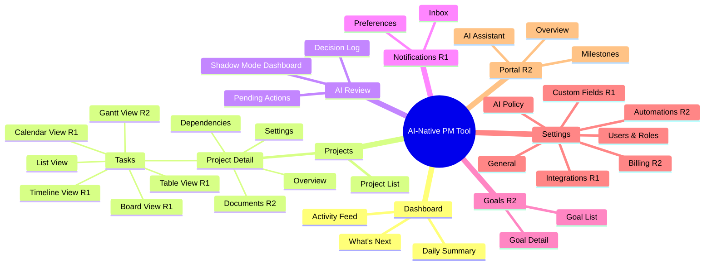
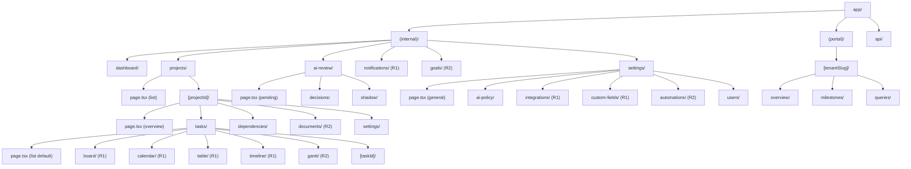
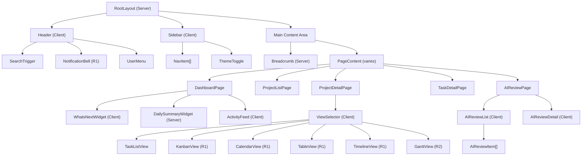
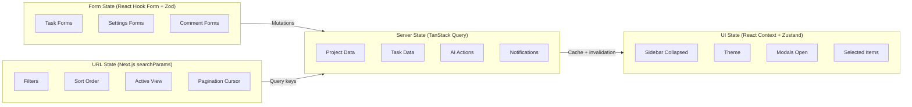
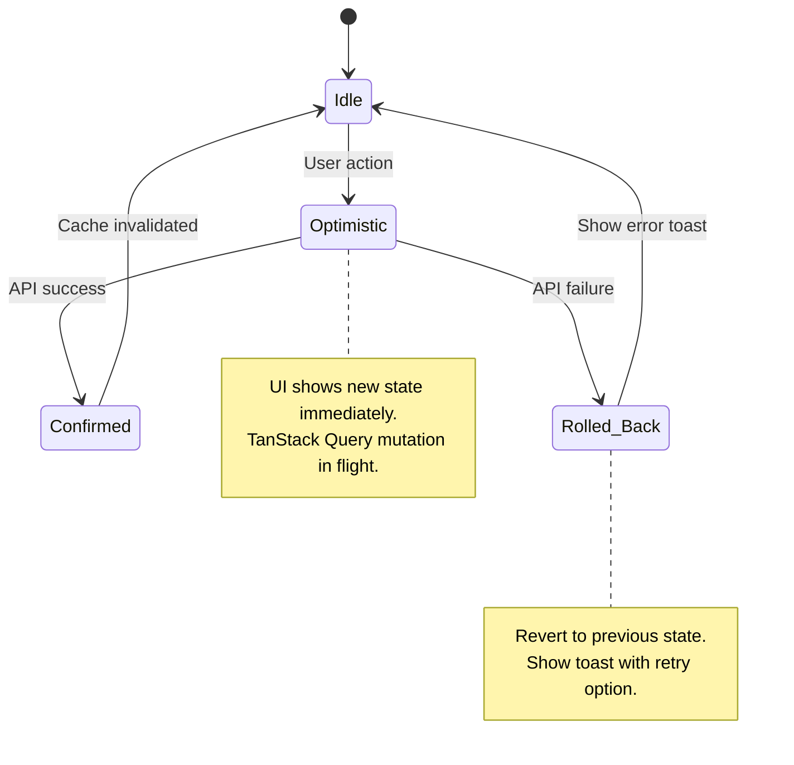
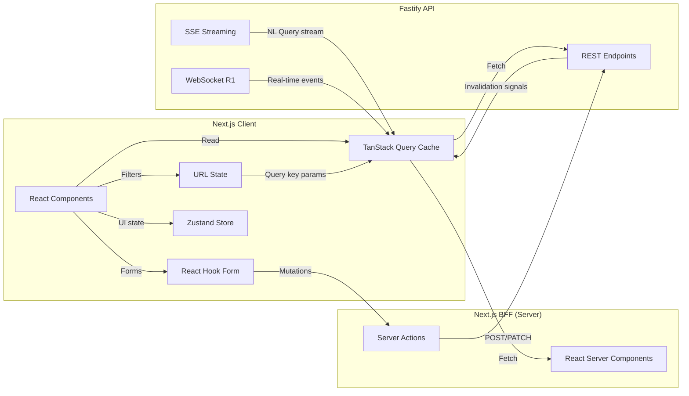

# AI-Native PM Tool — UI/UX & System Design Document

> **Version:** 1.0
> **Date:** February 2026
> **Status:** Draft
> **Aligned to:** Architecture v3.1, Product Roadmap v2.1 (103 features), CLAUDE.md UI standards
>
> **Design philosophy:** The AI is the primary interaction model. Traditional PM interfaces are fallbacks. Every screen answers: "Can the user supervise the AI in under 5 seconds?"

---

## 1. Introduction & Cross-References

### 1.1 Purpose

This document is the complete frontend design specification for the AI-Native PM Tool. It bridges the gap between the backend architecture (architecture-v3.1.md, design.md) and implementation — providing the design tokens, component hierarchy, wireframes, interaction patterns, and accessibility specs that a frontend team needs to implement without design ambiguity.

### 1.2 Tech Stack

| Layer | Technology | Purpose |
|-------|-----------|---------|
| Framework | Next.js 15, App Router, React Server Components | SSR, routing, server actions |
| Language | TypeScript 5+ (strict mode) | Type safety end-to-end |
| UI Library | Shadcn UI | Accessible primitives (Dialog, Select, Popover, etc.) |
| Styling | Tailwind CSS v4 | Utility-first, design tokens |
| Data Fetching | TanStack Query v5 | Server state, cache, mutations |
| Forms | React Hook Form + Zod | Validation, type-safe schemas |
| Drag & Drop | dnd-kit | Kanban board, form builder |
| Command Palette | cmdk | Cmd+K search/actions |
| Charts | Recharts | Dashboard visualizations |
| Virtual Scroll | @tanstack/react-virtual | Large lists, tables |
| Icons | Lucide React | 16x16px, consistent |
| State (global) | Zustand (minimal) | UI state only (sidebar, theme) |

### 1.3 Cross-Reference Conventions

| Prefix | Source | Example |
|--------|--------|---------|
| FR-xxx | requirements.md | FR-500 (task detail view) |
| F-xxx | roadmap-v2.md | F-023 (task detail) |
| ADR-xxx | architecture-v3.1.md | ADR-011 (route groups) |
| W-xxx | This document, wireframe | W-01 (app shell) |

---

## 2. Information Architecture & Navigation

### 2.1 Sitemap



### 2.2 URL Routing Tree (App Router)



### 2.3 Sidebar Navigation

The sidebar is the primary navigation mechanism. Role-based visibility.

**Collapsed state (default):** 56px wide, icon-only. **Expanded state:** 240px wide, icon + label.

| Section | Icon | Label | Route | Role | Release | Badge |
|---------|------|-------|-------|------|---------|-------|
| Dashboard | `LayoutDashboard` | Dashboard | `/dashboard` | All | R0 | - |
| Projects | `FolderKanban` | Projects | `/projects` | All | R0 | Count |
| AI Review | `Sparkles` | AI Review | `/ai-review` | Admin, PM | R0 | Pending count |
| Notifications | `Bell` | Notifications | `/notifications` | All | R1 | Unread count |
| Goals | `Target` | Goals | `/goals` | Admin, PM | R2 | At-risk count |
| Settings | `Settings` | Settings | `/settings` | Admin | R0 | - |

**Behavior:**
- Desktop: collapsed by default, expands on hover or click, stays expanded if pinned
- Mobile: hamburger menu -> full-screen slide, swipe to dismiss
- Expanded/collapsed state persisted in localStorage
- Active route highlighted with `text-black dark:text-white` + left border accent
- Unselected items: `text-gray-500`, hover: `text-gray-700 dark:text-gray-300`

### 2.4 Breadcrumb Strategy

Breadcrumbs appear below the header bar for all nested routes.

```
Dashboard
Projects > Acme Redesign
Projects > Acme Redesign > Tasks > TASK-042
Settings > AI Policy
```

- Each segment is clickable and navigates to that level
- Typography: `text-xs`, interactive segments `text-blue-600`, current segment `text-gray-900`
- Max depth: 4 levels (truncate middle segments with ellipsis on mobile)

### 2.5 Mobile Bottom Navigation (R1)

On screens <768px, a bottom nav bar replaces the sidebar:

| Item | Icon | Route |
|------|------|-------|
| Dashboard | `LayoutDashboard` | `/dashboard` |
| Projects | `FolderKanban` | `/projects` |
| AI | `Sparkles` | `/ai-review` |
| Notifications | `Bell` | `/notifications` |
| Menu | `Menu` | Opens full sidebar |

- 5 items max, labels with icons, current section indicator
- Hide on scroll down, show on scroll up
- Safe area spacing for notched devices

---

## 3. Design System & Tokens

### 3.1 Color Palette

#### Semantic Tokens (Light / Dark)

| Token | Light | Dark | Usage |
|-------|-------|------|-------|
| `--background` | `#FFFFFF` | `#09090B` | Page background |
| `--foreground` | `#09090B` | `#FAFAFA` | Primary text |
| `--card` | `#FFFFFF` | `#09090B` | Card background |
| `--card-foreground` | `#09090B` | `#FAFAFA` | Card text |
| `--primary` | `#18181B` | `#FAFAFA` | Primary actions |
| `--primary-foreground` | `#FAFAFA` | `#18181B` | Primary action text |
| `--secondary` | `#F4F4F5` | `#27272A` | Secondary elements |
| `--secondary-foreground` | `#18181B` | `#FAFAFA` | Secondary text |
| `--muted` | `#F4F4F5` | `#27272A` | Subtle backgrounds |
| `--muted-foreground` | `#71717A` | `#A1A1AA` | Subtle text |
| `--accent` | `#F4F4F5` | `#27272A` | Accents |
| `--destructive` | `#EF4444` | `#7F1D1D` | Delete, error |
| `--border` | `#E4E4E7` | `#27272A` | Borders |
| `--ring` | `#18181B` | `#D4D4D8` | Focus rings |

#### AI-Specific Tokens

| Token | Color | Usage |
|-------|-------|-------|
| `--ai-primary` | `#7C3AED` (violet-600) | AI-generated content indicators |
| `--ai-primary-light` | `#EDE9FE` (violet-50) | AI content background |
| `--ai-confidence-high` | `#16A34A` (green-600) | Confidence >0.8 |
| `--ai-confidence-medium` | `#CA8A04` (yellow-600) | Confidence 0.5-0.8 |
| `--ai-confidence-low` | `#DC2626` (red-600) | Confidence <0.5 |
| `--ai-sparkle` | `#8B5CF6` (violet-500) | Sparkle icon color |

#### Priority Tokens

| Token | Color | Usage |
|-------|-------|-------|
| `--priority-critical` | `#DC2626` (red-600) | Critical priority |
| `--priority-high` | `#EA580C` (orange-600) | High priority |
| `--priority-medium` | `#CA8A04` (yellow-600) | Medium priority |
| `--priority-low` | `#2563EB` (blue-600) | Low priority |

#### Status Tokens

| Token | Color | Usage |
|-------|-------|-------|
| `--status-created` | `#6B7280` (gray-500) | Created/Not started |
| `--status-in-progress` | `#2563EB` (blue-600) | In progress |
| `--status-in-review` | `#7C3AED` (violet-600) | In review |
| `--status-blocked` | `#DC2626` (red-600) | Blocked |
| `--status-completed` | `#16A34A` (green-600) | Completed |
| `--status-cancelled` | `#9CA3AF` (gray-400) | Cancelled |

### 3.2 Typography Scale

All typography uses Inter font, loaded via `next/font/google`.

| Level | Class | Size | Weight | Line Height | Usage |
|-------|-------|------|--------|-------------|-------|
| **Display** | `text-lg font-bold` | 18px | 700 | 28px | Page titles only |
| **Heading** | `text-sm font-semibold` | 14px | 600 | 20px | Section headers, card titles |
| **Body** | `text-xs font-normal` | 12px | 400 | 16px | All body text, labels, nav items (BASELINE) |
| **Caption** | `text-[11px] font-normal` | 11px | 400 | 14px | Timestamps, metadata, helper text |
| **Mono** | `text-xs font-mono` | 12px | 400 | 16px | Code, IDs, technical values |

**Rules:** The `text-xs font-normal` is the baseline for ALL interface elements including navigation, menus, and dashboard content. Headers may use `font-bold` but must remain `text-xs`. Only page titles use `text-lg`.

### 3.3 Spacing System

4px base grid, Tailwind tokens only.

| Token | Value | Usage |
|-------|-------|-------|
| `space-0.5` | 2px | Inline icon gaps |
| `space-1` | 4px | Tight element spacing |
| `space-1.5` | 6px | Menu item padding (py) |
| `space-2` | 8px | Standard padding |
| `space-3` | 12px | Card padding |
| `space-4` | 16px | Section spacing |
| `space-6` | 24px | Large gaps |
| `space-8` | 32px | Page margins |

### 3.4 Shadows, Borders, Radii

| Token | Value | Usage |
|-------|-------|-------|
| `shadow-sm` | `0 1px 2px rgba(0,0,0,0.05)` | Cards, dropdowns |
| `shadow-md` | `0 4px 6px rgba(0,0,0,0.1)` | Modals, popovers |
| `shadow-lg` | `0 10px 15px rgba(0,0,0,0.1)` | Command palette |
| `border` | `1px solid var(--border)` | Standard border |
| `rounded-md` | 6px | Buttons, inputs |
| `rounded-lg` | 8px | Cards, panels |
| `rounded-full` | 9999px | Avatars, badges |

### 3.5 Icon System

- Library: Lucide React
- Size: 16x16px (`w-4 h-4`) for all inline icons
- Size: 20x20px (`w-5 h-5`) for standalone action icons
- Color: inherits from text color
- AI indicator: `Sparkles` icon in `--ai-sparkle` color

### 3.6 Z-Index Layers

| Layer | z-index | Usage |
|-------|---------|-------|
| Base | 0 | Page content |
| Sticky | 10 | Sticky headers, table headers |
| Sidebar | 20 | Sidebar navigation |
| Header | 30 | Top header bar |
| Dropdown | 40 | Menus, popovers |
| Modal backdrop | 50 | Modal overlay |
| Modal | 60 | Modal content |
| Toast | 70 | Toast notifications |
| Command palette | 80 | Cmd+K overlay |
| Tooltip | 90 | Tooltips |

### 3.7 Animation Tokens

| Token | Value | Usage |
|-------|-------|-------|
| `duration-150` | 150ms | Hover transitions |
| `duration-200` | 200ms | State changes |
| `duration-300` | 300ms | Panel slides, menu expand/collapse |
| `ease-spring` | `cubic-bezier(0.16, 1, 0.3, 1)` | Spring-like entrance animations |
| `ease-out` | `cubic-bezier(0, 0, 0.2, 1)` | Standard exit |

**Reduced motion:** All animations wrapped in `@media (prefers-reduced-motion: no-preference)`. With `prefers-reduced-motion: reduce`, transitions are instant and opacity-only.

---

## 4. App Shell & Layout System

### 4.1 App Shell Wireframe (W-01)

```
+--+--------------------------------------------------------------------+
|  |  [Logo]  AI-Native PM Tool          [Search] [?] [Bell 3] [Avatar] |  <- Header (48px)
|  +--------------------------------------------------------------------+
|  |                                                                     |
|S |  [Breadcrumb: Projects > Acme Redesign > Tasks]                    |
|I |                                                                     |
|D |  +---------------------------------------------------------------+ |
|E |  |                                                               | |
|B |  |                     MAIN CONTENT AREA                         | |
|A |  |                                                               | |
|R |  |              (varies by route — see wireframes)               | |
|  |  |                                                               | |
|56|  |                                                               | |
|px|  |                                                               | |
|  |  |                                                               | |
|  |  +---------------------------------------------------------------+ |
|  |                                                                     |
+--+---------------------------------------------------------------------+
```

**Header bar (48px):**
- Left: Logo (24x24), App name (hidden on mobile)
- Center: Search trigger (`Cmd+K` hint), opens command palette
- Right: Help icon, Notification bell (with unread badge), User avatar dropdown

**Sidebar (56px collapsed / 240px expanded):**
- Top: Navigation items (see Section 2.3)
- Bottom: Collapse/expand toggle, theme toggle

**Content area:** Full remaining width and height, scrollable independently.

### 4.2 Layout Variants

**Full-width layout** (Dashboard, Project List):
```
+--+--------------------------------------------------------------------+
|SB|                          Full Content                              |
+--+--------------------------------------------------------------------+
```

**Sidebar + Main layout** (Project Detail, Task List):
```
+--+--------------------------------------------------------------------+
|SB|  [Sub-nav / Tabs]                                                  |
|  |  +---------------------------------------------------------------+ |
|  |  |                        Main Panel                             | |
|  |  +---------------------------------------------------------------+ |
+--+--------------------------------------------------------------------+
```

**Split Panel layout** (Task Detail, AI Review) (W-02):
```
+--+---------------------------------+----------------------------------+
|SB|         Left Panel              |          Right Panel             |
|  |         (list / nav)            |          (detail / preview)      |
|  |                                 |                                  |
|  |  - Item 1                       |  [Task Title]                   |
|  |  - Item 2  <-- selected         |  [Description]                  |
|  |  - Item 3                       |  [Fields]                       |
|  |  - Item 4                       |  [Comments]                     |
|  |                                 |                                  |
+--+---------------------------------+----------------------------------+
```

**Overlay layout** (NL Query, Command Palette):
Content rendered as slide-out panel or centered modal over the current page.

---

## 5. R0 Page Wireframes

### 5.1 Dashboard / What's Next (W-03)

```
+--+--------------------------------------------------------------------+
|SB|  Dashboard                                              [AI: text] |
|  |                                                                     |
|  |  +------------------------------+  +------------------------------+ |
|  |  | YOUR NEXT TASKS              |  | AI DAILY SUMMARY             | |
|  |  |                              |  |                              | |
|  |  | 1. [!] Fix auth bug          |  | "Today on Acme Redesign:     | |
|  |  |    Acme - Due tomorrow       |  |  3 tasks completed, 2 new    | |
|  |  |    "Dependency resolved 2h   |  |  blockers identified.        | |
|  |  |     ago, blocks 3 tasks"     |  |  Sprint velocity is on       | |
|  |  |    [Start] [View]            |  |  track."                     | |
|  |  |                              |  |                              | |
|  |  | 2. [M] Design review         |  | [View full summary]          | |
|  |  |    Beta - Due Fri            |  +------------------------------+ |
|  |  |    "High priority, no deps"  |                                  |
|  |  |    [Start] [View]            |  +------------------------------+ |
|  |  |                              |  | RECENT ACTIVITY              | |
|  |  | 3. [L] Update docs           |  |                              | |
|  |  |    Acme - No due date        |  | * Sarah completed "API auth" | |
|  |  |    "Low priority, 0 blocks"  |  | * AI proposed 5 new tasks    | |
|  |  |    [Start] [View]            |  | * 2 dependencies resolved    | |
|  |  |                              |  | * Risk flag: Sprint delay    | |
|  |  | [Load more]                  |  |                              | |
|  |  +------------------------------+  +------------------------------+ |
|  |                                                                     |
|  |  +------------------------------+  +------------------------------+ |
|  |  | PROJECTS OVERVIEW            |  | AI CONFIDENCE                | |
|  |  |                              |  |                              | |
|  |  | Acme Redesign   [====  ] 68% |  | WBS Generation    [===] 0.82 | |
|  |  | Beta Launch     [==    ] 34% |  | Risk Prediction   [== ] 0.71 | |
|  |  | Data Migration  [=     ] 15% |  | NL Query          [===] 0.89 | |
|  |  +------------------------------+  +------------------------------+ |
+--+--------------------------------------------------------------------+
```

**Key interactions:**
- "What's Next" is the primary widget — occupies the most visual weight
- Each task card shows: priority badge, title, project name, due date, AI reasoning for rank
- Quick actions: Start (transitions to in_progress), View (navigates to task detail)
- AI Daily Summary: generated text with "view full" link
- Projects Overview: horizontal progress bars with percentage
- Auto-refreshes via polling (R0) / WebSocket (R1)

### 5.2 Project List (W-04)

```
+--+--------------------------------------------------------------------+
|SB|  Projects                                        [+ New Project]   |
|  |                                                                     |
|  |  [Search projects...]  [Status: All v] [Sort: Updated v]          |
|  |                                                                     |
|  |  +---------------------------------------------------------------+ |
|  |  | NAME             | STATUS    | TASKS  | PROGRESS | UPDATED     | |
|  |  |------------------+-----------+--------+----------+-------------| |
|  |  | Acme Redesign    | Active    | 42/58  | [====] 72% | 2h ago   | |
|  |  | Beta Launch      | Active    | 18/53  | [==  ] 34% | 1d ago   | |
|  |  | Data Migration   | Planning  | 0/0    | [    ]  0% | 3d ago   | |
|  |  | Q4 Analytics     | Completed | 31/31  | [=====]100%| 2w ago   | |
|  |  +---------------------------------------------------------------+ |
|  |                                                                     |
|  |  Showing 4 of 4 projects                                          |
+--+--------------------------------------------------------------------+
```

**"+ New Project" button** opens the NL project setup flow (see W-09).

### 5.3 Project Detail (W-05)

```
+--+--------------------------------------------------------------------+
|SB|  [< Projects]  Acme Redesign                      [Settings] [...]|
|  |                                                                     |
|  |  [Overview] [Tasks] [Dependencies] [Documents] [Settings]          |
|  |                                                                     |
|  |  +------------------------------+  +------------------------------+ |
|  |  | PROJECT HEALTH               |  | PHASES                       | |
|  |  | Progress: [====  ] 72%       |  |                              | |
|  |  | On track  |  Due: Mar 15     |  | 1. Discovery     [=====]100%| |
|  |  | Tasks: 42/58 | Blocked: 3    |  | 2. Design        [====] 80% | |
|  |  |                              |  | 3. Development   [==  ] 40% | |
|  |  | AI Risk: Low confidence      |  | 4. Testing       [    ]  0% | |
|  |  | "Timeline is achievable      |  | 5. Launch        [    ]  0% | |
|  |  |  given current velocity"     |  |                              | |
|  |  +------------------------------+  +------------------------------+ |
|  |                                                                     |
|  |  +---------------------------------------------------------------+ |
|  |  | RECENT ACTIVITY                                                | |
|  |  | * Task "Fix auth" moved to in_progress by @sarah      10m ago | |
|  |  | * AI proposed 3 new tasks for Phase 3                  1h ago | |
|  |  | * Dependency resolved: "API design" unblocked "FE impl" 3h ago| |
|  |  +---------------------------------------------------------------+ |
+--+--------------------------------------------------------------------+
```

### 5.4 Task Detail — 3-Column Layout (W-06)

```
+--+--------------------------------------------------------------------+
|SB|  [< Acme Redesign > Tasks]  TASK-042: Fix authentication bug       |
|  |                                                                     |
|  |  +---------------------+--------------------+---------------------+ |
|  |  | DETAILS             | SIDEBAR            | ACTIVITY            | |
|  |  |                     |                    |                     | |
|  |  | [Edit] Description  | Status             | COMMENTS            | |
|  |  | Fix the JWT refresh | [In Progress v]    |                     | |
|  |  | token rotation bug  |                    | @sarah  2h ago      | |
|  |  | that causes logout  | Priority           | "Found the root     | |
|  |  | after 30 minutes... | [! Critical v]     |  cause - refresh    | |
|  |  |                     |                    |  token rotation     | |
|  |  | SUB-TASKS           | Assignees          |  not invalidating   | |
|  |  | [x] Identify root   | [@sarah] [@mike]   |  old tokens"        | |
|  |  | [ ] Write fix       |                    |                     | |
|  |  | [ ] Add tests       | Phase              | @ai-agent  1h ago   | |
|  |  | [ ] Deploy          | [Development v]    | [*] "This blocks    | |
|  |  |                     |                    |  3 downstream       | |
|  |  | CHECKLIST (2/4)     | Due Date           |  tasks. Recommend   | |
|  |  | [x] Reproduce bug  | [Mar 10]           |  prioritizing."     | |
|  |  | [x] Root cause     |                    |                     | |
|  |  | [ ] Code review    | Effort             | [Add comment...]    | |
|  |  | [ ] QA sign-off    | Est: 8h  Act: 5h   | [@mention] [Send]   | |
|  |  |                     |                    |                     | |
|  |  | DEPENDENCIES        | Tags               | AUDIT HISTORY       | |
|  |  | Blocked by:         | [auth] [urgent]    |                     | |
|  |  |  (none)             |                    | * Status changed    | |
|  |  | Blocks:             | AI Metadata        |   created->in_prog  | |
|  |  |  TASK-043           | [*] AI Generated   |   by @sarah  3h ago | |
|  |  |  TASK-044           | Confidence: 0.85   | * Assigned to       | |
|  |  |  TASK-045           |                    |   @sarah by @admin  | |
|  |  |                     | Custom Fields      |   1d ago            | |
|  |  |                     | Sprint: Sprint 3   | * Created by AI     | |
|  |  |                     | Story Points: 5    |   via WBS gen       | |
|  |  |                     |                    |   2d ago            | |
|  |  +---------------------+--------------------+---------------------+ |
+--+--------------------------------------------------------------------+
```

**Key interactions:**
- Inline editing for all fields (click to edit, blur to save)
- Sub-tasks: checkbox toggle, drag to reorder, promote/demote
- Checklist: progress bar, checkbox toggle, add inline
- Dependencies: click to navigate, visual blocked/blocks indicators
- Comments: @mention autocomplete, action item creation
- AI metadata: sparkle icon, confidence badge, "AI Generated" indicator
- Audit history: chronological timeline with actor attribution
- Custom fields (R1): rendered dynamically based on field definitions

### 5.5 Task List (W-07)

```
+--+--------------------------------------------------------------------+
|SB|  Acme Redesign > Tasks                  [+ Add Task] [Views: v]   |
|  |                                                                     |
|  |  [Search tasks...] [Status: v] [Priority: v] [Assignee: v] [Phase]|
|  |  [Sort: Due Date v]  [Group: Phase v]                [Saved Views]|
|  |                                                                     |
|  |  PHASE: DEVELOPMENT (12 tasks)                         [collapse] |
|  |  +---------------------------------------------------------------+ |
|  |  |   | TITLE              |STATUS    |PRI |ASSIGNEE|DUE    |CONF | |
|  |  |---+--------------------+----------+----+--------+-------+-----| |
|  |  |[x]| Fix auth bug       |In Prog   | !  |@sarah  |Mar 10 |0.85 | |
|  |  |[ ]| API rate limiting   |Created   | H  |@mike   |Mar 12 |0.72 | |
|  |  |[ ]| FE dashboard       |Blocked   | M  |@alex   |Mar 14 | -  | |
|  |  |[ ]| Error handling     |Created   | M  |  -     |Mar 15 |0.91 | |
|  |  +---------------------------------------------------------------+ |
|  |                                                                     |
|  |  PHASE: TESTING (8 tasks)                              [collapse] |
|  |  +---------------------------------------------------------------+ |
|  |  |   | TITLE              |STATUS    |PRI |ASSIGNEE|DUE    |CONF | |
|  |  |---+--------------------+----------+----+--------+-------+-----| |
|  |  |[ ]| Integration tests  |Created   | H  |  -     |Mar 20 |0.88 | |
|  |  |[ ]| Load testing       |Created   | M  |  -     |Mar 22 | -  | |
|  |  +---------------------------------------------------------------+ |
|  |                                                                     |
|  |  Showing 20 of 58 tasks  [Load more]                              |
+--+--------------------------------------------------------------------+
```

**"Views" dropdown** (R1): List | Board | Calendar | Table | Timeline | Gantt

### 5.6 AI Review Panel — Split View (W-08)

```
+--+---------------------------------+----------------------------------+
|SB| AI REVIEW (5 pending)           |  DETAIL                          |
|  |                                  |                                  |
|  | [All] [WBS] [Risk] [Nudge]      |  WBS Generation                  |
|  | [Bulk: Approve All] [Reject All]|  Confidence: [====] 0.87         |
|  |                                  |  Triggered: 2h ago               |
|  | +----------------------------+  |                                  |
|  | | [*] WBS: Data Migration    |  |  PROPOSED CHANGES                |
|  | |     Confidence: 0.87       |  |  Create 5 phases, 42 tasks,      |
|  | |     5 phases, 42 tasks     |  |  18 dependencies                 |
|  | |     [Approve] [Reject]     |  |                                  |
|  | +----------------------------+  |  Phase 1: Discovery (8 tasks)    |
|  | | [*] Risk: Sprint delay     |  |    - Stakeholder interviews      |
|  | |     Confidence: 0.71       |  |    - Requirements gathering      |
|  | |     2 tasks affected       |  |    - Data audit                  |
|  | |     [Approve] [Reject]     |  |    ...                           |
|  | +----------------------------+  |                                  |
|  | | [*] Nudge: @sarah overdue  |  |  AI REASONING                    |
|  | |     Confidence: 0.92       |  |  "Based on 3 similar past        |
|  | |     TASK-042, 2d overdue   |  |   data migrations, I structured  |
|  | |     [Approve] [Reject]     |  |   this as a 5-phase project      |
|  | +----------------------------+  |   with an emphasis on data        |
|  | | [*] Summary: Weekly report |  |   validation (Phase 4)."         |
|  | |     Confidence: 0.89       |  |                                  |
|  | |     [Approve] [Edit] [Rej] |  |  DIFF VIEW (for edits)           |
|  | +----------------------------+  |  - Task "ETL pipeline"            |
|  | | [*] Nudge: @mike stalled   |  |    + est: 24h (was: 16h)        |
|  | |     Confidence: 0.88       |  |    + added dependency on         |
|  | |     TASK-039, no update 3d |  |      "Schema design"             |
|  | |     [Approve] [Reject]     |  |                                  |
|  | +----------------------------+  |  [Approve] [Edit] [Reject]       |
+--+---------------------------------+----------------------------------+
```

**Keyboard shortcuts:**
- `j/k` = navigate list up/down
- `a` = approve selected
- `r` = reject selected
- `e` = edit selected
- `Enter` = open detail panel
- `Shift+A` = approve all

### 5.7 NL Query — Slide-Out Panel (W-09)

```
+--+--------------------------------------------------------------------+
|SB|  [Current page content dimmed]                                     |
|  |                                                                     |
|  |  +------------------------------------------+                      |
|  |  | ASK AI                             [X]   |                      |
|  |  |                                          |                      |
|  |  | [What would you like to know?       ]    |                      |
|  |  |                                          |                      |
|  |  | SUGGESTED QUERIES                        |                      |
|  |  | * What's blocked right now?              |                      |
|  |  | * What did the team ship this week?      |                      |
|  |  | * How is Acme Redesign tracking?         |                      |
|  |  |                                          |                      |
|  |  | ---------------------------------------- |                      |
|  |  |                                          |                      |
|  |  | YOU: What's blocked right now?           |                      |
|  |  |                                          |                      |
|  |  | AI: There are 3 blocked tasks across     |                      |
|  |  | 2 projects:                              |                      |
|  |  |                                          |                      |
|  |  | 1. **FE Dashboard** (Acme) - blocked     |                      |
|  |  |    by "API rate limiting" (TASK-039)     |                      |
|  |  | 2. **Deployment** (Acme) - blocked by    |                      |
|  |  |    "Integration tests" (TASK-051)       |                      |
|  |  | 3. **Data sync** (Beta) - blocked by     |                      |
|  |  |    "Schema migration" (TASK-012)        |                      |
|  |  |                                          |                      |
|  |  | [*] Confidence: 0.92                     |                      |
|  |  |                                          |                      |
|  |  | Sources: TASK-039, TASK-051, TASK-012    |                      |
|  |  +------------------------------------------+                      |
+--+--------------------------------------------------------------------+
```

**Triggered by:** `Cmd/Ctrl+K` from any page, or clicking the search icon in the header.
**Streaming:** Response tokens appear as they arrive from Claude Sonnet (SSE).
**Query history:** Last 20 queries stored client-side (localStorage).

### 5.8 Settings / AI Policy (W-10)

```
+--+--------------------------------------------------------------------+
|SB|  Settings > AI Policy                                              |
|  |                                                                     |
|  |  [General] [AI Policy] [Integrations] [Users] [Custom Fields]     |
|  |                                                                     |
|  |  AUTONOMY MODES                                                    |
|  |  +---------------------------------------------------------------+ |
|  |  | ACTION TYPE          | MODE       | CONSTRAINTS               | |
|  |  |----------------------+------------+---------------------------| |
|  |  | WBS Generation       | [Propose v]| Always requires approval  | |
|  |  | What's Next          | [Execute v]| Read-only, safe           | |
|  |  | Daily Summary        | [Execute v]| Read-only, safe           | |
|  |  | NL Query             | [Execute v]| Read-only, safe           | |
|  |  | Nudge (stalled)      | [Execute v]| Quiet hrs, max 2/task/day | |
|  |  | Auto-Escalation      | [Propose v]| 48h threshold             | |
|  |  | Risk Prediction      | [Shadow  v]| Shadow first 2-4 weeks    | |
|  |  | Scope Creep Alert    | [Propose v]| 15% drift threshold       | |
|  |  | Status Report        | [Propose v]| PM reviews before send    | |
|  |  | Client Narrative     | [Propose v]| Always requires PM review | |
|  |  +---------------------------------------------------------------+ |
|  |                                                                     |
|  |  CONFIDENCE THRESHOLDS                                             |
|  |  +---------------------------------------------------------------+ |
|  |  | CAPABILITY           | THRESHOLD  | CURRENT AVG               | |
|  |  |----------------------+------------+---------------------------| |
|  |  | WBS Generation       | [0.6   ]   | 0.82                      | |
|  |  | Risk Prediction      | [0.7   ]   | 0.71                      | |
|  |  | NL Query             | [0.5   ]   | 0.89                      | |
|  |  | Summary              | [0.5   ]   | 0.85                      | |
|  |  +---------------------------------------------------------------+ |
|  |                                                                     |
|  |  QUIET HOURS                                                       |
|  |  Start: [18:00]  End: [09:00]  Timezone: [UTC v]                  |
|  |  Max nudges per task per day: [2]                                  |
|  |                                                                     |
|  |  [Save Changes]                                                    |
+--+--------------------------------------------------------------------+
```

### 5.9 Login (W-11)

```
+--------------------------------------------------------------------+
|                                                                      |
|                    [Logo]                                             |
|                    AI-Native PM Tool                                 |
|                                                                      |
|              +-----------------------------+                         |
|              |  Sign In                    |                         |
|              |                             |                         |
|              |  Email                      |                         |
|              |  [user@example.com       ]  |                         |
|              |                             |                         |
|              |  Password                   |                         |
|              |  [**************         ]  |                         |
|              |                             |                         |
|              |  [Forgot password?]         |                         |
|              |                             |                         |
|              |  [       Sign In        ]   |                         |
|              |                             |                         |
|              |  --- or ---                 |                         |
|              |                             |                         |
|              |  [  Sign in with SSO    ]   |                         |
|              |                             |                         |
|              +-----------------------------+                         |
|                                                                      |
+--------------------------------------------------------------------+
```

**States:** Default, loading (button spinner), error (inline under field), SSO redirect.

---

## 6. R1 Page Wireframes

### 6.1 Kanban Board (W-12)

```
+--+--------------------------------------------------------------------+
|SB|  Acme > Tasks  [List] [Board] [Calendar] [Table] [Timeline]       |
|  |                                                                     |
|  |  [Search] [Filter: Assignee v] [Filter: Priority v]  [+ Add Task] |
|  |                                                                     |
|  |  CREATED (5)    IN PROGRESS (3)  IN REVIEW (2)    COMPLETED (12)   |
|  |  +-----------+  +-----------+    +-----------+    +-----------+    |
|  |  | [M] Setup |  | [!] Auth  |   | [H] API   |   | [M] Login |    |
|  |  | @alex     |  | @sarah    |   | @mike     |   | @sarah    |    |
|  |  | Mar 15    |  | Mar 10    |   | Mar 8     |   | Feb 28    |    |
|  |  | [*] 0.85  |  | [blocked] |   |           |   |           |    |
|  |  +-----------+  +-----------+    +-----------+    +-----------+    |
|  |  | [L] Docs  |  | [H] FE   |   | [M] Tests |   | [H] DB    |    |
|  |  | unassigned|  | @alex     |   | @alex     |   | @mike     |    |
|  |  | No date   |  | Mar 14    |   | Mar 9     |   | Feb 25    |    |
|  |  +-----------+  | [*] 0.72  |   +-----------+    +-----------+    |
|  |  | ...       |  +-----------+                     | ...       |    |
|  |  +-----------+  | [M] Rate  |                     +-----------+    |
|  |                 | @mike     |                                      |
|  |                 | Mar 12    |                                      |
|  |                 +-----------+                                      |
+--+--------------------------------------------------------------------+
```

**R1:** Read-only Kanban (no drag-and-drop). Each card shows: priority badge, title, assignee avatar, due date, AI confidence (if AI-generated), blocked indicator.
**R2:** Drag-and-drop between columns to change status.

### 6.2 Calendar View (W-13)

```
+--+--------------------------------------------------------------------+
|SB|  Acme > Tasks  [List] [Board] [Calendar] [Table] [Timeline]       |
|  |                                                                     |
|  |  [< Feb]  March 2026  [Apr >]         [Month] [Week] [Day]       |
|  |                                                                     |
|  |  MON     TUE     WED     THU     FRI     SAT     SUN             |
|  |  +-------+-------+-------+-------+-------+-------+-------+       |
|  |  |  2    |  3    |  4    |  5    |  6    |  7    |  8    |       |
|  |  |       |       |       |       |       |       |       |       |
|  |  +-------+-------+-------+-------+-------+-------+-------+       |
|  |  |  9    | 10    | 11    | 12    | 13    | 14    | 15    |       |
|  |  |       |[!]Auth|       |[H]Rate|       |[M]FE  |       |       |
|  |  |       |       |       |       |       |       |       |       |
|  |  +-------+-------+-------+-------+-------+-------+-------+       |
|  |  | 16    | 17    | 18    | 19    | 20    | 21    | 22    |       |
|  |  |       |       |       |       |[H]Int |       |[M]Load|       |
|  |  |       |       |       |       |tests  |       |test   |       |
|  |  +-------+-------+-------+-------+-------+-------+-------+       |
|  |  | 23    | 24    | 25    | 26    | 27    | 28    | 29    |       |
|  |  |       |       |       |       |       |       |       |       |
|  |  +-------+-------+-------+-------+-------+-------+-------+       |
+--+--------------------------------------------------------------------+
```

Tasks displayed as colored chips (priority color). Click opens task detail. Drag to reschedule due date.

### 6.3 Table View (W-14)

```
+--+--------------------------------------------------------------------+
|SB|  Acme > Tasks  [List] [Board] [Calendar] [Table] [Timeline]       |
|  |                                                                     |
|  |  [Saved Views: Default v] [+ Save View]  [Columns v]  [Export]    |
|  |                                                                     |
|  |  +---------------------------------------------------------------+ |
|  |  |TITLE          |STATUS     |PRI|ASSIGNEE|DUE    |EST |ACT|CONF| |
|  |  |===============+===========+===+========+=======+====+===+====| |
|  |  |Fix auth bug   |In Progress| ! |@sarah  |Mar 10 | 8h|5h |0.85| |
|  |  |API rate limit |Created    | H |@mike   |Mar 12 |16h| - |0.72| |
|  |  |FE dashboard   |Blocked    | M |@alex   |Mar 14 |24h| - | -  | |
|  |  |Error handling |Created    | M |  -     |Mar 15 |12h| - |0.91| |
|  |  |DB optimization|In Progress| H |@mike   |Mar 16 | 8h|3h | -  | |
|  |  |User settings  |Created    | L |  -     |  -    |  -| - |0.78| |
|  |  |...            |           |   |        |       |   |   |    | |
|  |  +---------------------------------------------------------------+ |
|  |                                                                     |
|  |  Showing 20 of 58  [Load more]              Total effort: 320h    |
+--+--------------------------------------------------------------------+
```

**Features:** Column resize/reorder/hide. Inline editing (click cell to edit). Sort by any column. Column visibility toggle. Saved views (named filter+column configs).

### 6.4 AI-Annotated Timeline (W-15)

```
+--+--------------------------------------------------------------------+
|SB|  Acme > Tasks  [List] [Board] [Calendar] [Table] [Timeline]       |
|  |                                                                     |
|  |  March 2026                                                        |
|  |  1   5   10   15   20   25   30                                   |
|  |  |   |    |    |    |    |    |                                    |
|  |  |   |    |    |    |    |    |                                    |
|  |  |===Discovery=====|    |    |    Phase 1 (Complete)               |
|  |  |   |    |====Design=========|    Phase 2 (In Progress)          |
|  |  |   |    |    |====Development==========|  Phase 3               |
|  |  |   |    |    |    |    |    |====Testing====|  Phase 4           |
|  |  |   |    |    |    |    |    |    |    |==Launch=|  Phase 5       |
|  |  |   |    |    |    |    |    |                                    |
|  |  |   |    | [!] Predicted delay: Dev phase trending 3 days late   |
|  |  |   |    |    |    |    [*] Critical path task: "API integration"|
|  |  |   |    |    |    |    |    |                                    |
|  |  AI OVERLAYS:                                                      |
|  |  [!] Predicted delay (red dashed line showing projected end)      |
|  |  [*] Critical path (bold outline on critical tasks)               |
|  |  [~] Resource conflict (orange indicator on overlapping tasks)    |
+--+--------------------------------------------------------------------+
```

### 6.5 Portfolio Dashboard (W-16)

```
+--+--------------------------------------------------------------------+
|SB|  Portfolio Dashboard                                               |
|  |                                                                     |
|  |  +---------------------------------------------------------------+ |
|  |  | AI PORTFOLIO SUMMARY                                          | |
|  |  | "2 of 3 active projects are on track. Acme Redesign has a    | |
|  |  |  developing risk in Phase 3 (Development) due to resource    | |
|  |  |  concentration on @mike. Beta Launch is ahead of schedule."  | |
|  |  +---------------------------------------------------------------+ |
|  |                                                                     |
|  |  +---------------------------+  +--------------------------------+ |
|  |  | PROJECT HEALTH            |  | RESOURCE UTILIZATION           | |
|  |  |                           |  |                                | |
|  |  | Acme    [====] 72% [!]    |  | @sarah  [========] 85%         | |
|  |  | Beta    [==  ] 34% [ok]   |  | @mike   [==========] 110% [!] | |
|  |  | DataMig [=   ] 15% [ok]   |  | @alex   [======] 60%           | |
|  |  +---------------------------+  +--------------------------------+ |
|  |                                                                     |
|  |  +---------------------------+  +--------------------------------+ |
|  |  | CROSS-PROJECT DEPS        |  | DELIVERY CONFIDENCE            | |
|  |  |                           |  |                                | |
|  |  | Acme:TASK-042 blocks      |  | Acme: 0.72 (declining)         | |
|  |  |   Beta:TASK-019           |  | Beta: 0.88 (stable)            | |
|  |  |                           |  | DataMig: 0.65 (too early)      | |
|  |  +---------------------------+  +--------------------------------+ |
+--+--------------------------------------------------------------------+
```

### 6.6 Notification Inbox (W-17)

```
+--+--------------------------------------------------------------------+
|SB|  Notifications                                    [Mark all read]  |
|  |                                                                     |
|  |  [All] [Mentions] [Assignments] [AI Actions] [Reminders]          |
|  |                                                                     |
|  |  TODAY                                                             |
|  |  +---------------------------------------------------------------+ |
|  |  | [*] AI proposed 5 tasks for "Data Migration"        10m ago   | |
|  |  |     Confidence: 0.87  [Review]                                | |
|  |  +---------------------------------------------------------------+ |
|  |  | [@] @sarah mentioned you in TASK-042                  1h ago   | |
|  |  |     "Can @mike review the auth fix?"  [View]                  | |
|  |  +---------------------------------------------------------------+ |
|  |  | [!] TASK-039 is overdue by 2 days                     3h ago   | |
|  |  |     AI PM Agent will nudge @mike  [View]                      | |
|  |  +---------------------------------------------------------------+ |
|  |                                                                     |
|  |  YESTERDAY                                                         |
|  |  +---------------------------------------------------------------+ |
|  |  | [+] You were assigned to TASK-055                     1d ago   | |
|  |  |     "Integration tests" in Acme Redesign  [View]              | |
|  |  +---------------------------------------------------------------+ |
|  |  | [ok] Dependency resolved: TASK-038 unblocked          1d ago   | |
|  |  |     TASK-042 can now proceed  [View]                          | |
|  |  +---------------------------------------------------------------+ |
+--+--------------------------------------------------------------------+
```

### 6.7 Dependency Graph (W-18 — part of Task Detail)

```
+--+--------------------------------------------------------------------+
|SB|  Acme > Tasks > TASK-042 > Dependencies                           |
|  |                                                                     |
|  |  UPSTREAM (blocks me)              DOWNSTREAM (I block)            |
|  |                                                                     |
|  |  +-------------+                  +-------------+                  |
|  |  | TASK-038    |                  | TASK-043    |                  |
|  |  | Schema      |  ----[ok]---->   | FE Forms    |                  |
|  |  | [Completed] |   (resolved)     | [Created]   |                  |
|  |  +-------------+                  +-------------+                  |
|  |                                                                     |
|  |         +------[TASK-042]------+                                   |
|  |         |   Fix auth bug       |  +-------------+                  |
|  |         |   [In Progress]      |->| TASK-044    |                  |
|  |         +---------------------+   | API Deploy  |                  |
|  |                                   | [Blocked]   |                  |
|  |                                   +-------------+                  |
|  |                                                                     |
|  |                                   +-------------+                  |
|  |                               --->| TASK-045    |                  |
|  |                                   | E2E Tests   |                  |
|  |                                   | [Blocked]   |                  |
|  |                                   +-------------+                  |
|  |                                                                     |
|  |  CRITICAL PATH: This task is on the critical path.                |
|  |  Completing it will unblock 3 downstream tasks.                   |
+--+--------------------------------------------------------------------+
```

---

## 7. R2-R3 Page Wireframes

### 7.1 Client Portal (W-19)

```
+--------------------------------------------------------------------+
|  [Client Logo]  Acme Corp — Project Portal           [Ask AI] [?]  |
|                                                                      |
|  [Overview] [Milestones] [AI Assistant]                             |
|                                                                      |
|  +---------------------------------------------------------------+  |
|  | PROJECT SUMMARY (AI-generated, approved by PM)                |  |
|  | "Your Acme Redesign project is 72% complete and on track for  |  |
|  |  the March 15 delivery date. Phase 2 (Design) is finishing    |  |
|  |  this week, and Phase 3 (Development) is 40% through.        |  |
|  |  No significant risks at this time."                          |  |
|  |                                                                |  |
|  |  Last updated: 2h ago  |  Confidence: High                   |  |
|  +---------------------------------------------------------------+  |
|                                                                      |
|  +------------------------------+  +------------------------------+  |
|  | MILESTONES                   |  | PROGRESS                     |  |
|  |                              |  |                              |  |
|  | [ok] Discovery    Feb 1      |  | Overall: [========] 72%      |  |
|  | [ok] Design       Feb 28     |  |                              |  |
|  | [..] Development  Mar 10     |  | Tasks: 42/58                 |  |
|  | [  ] Testing      Mar 15     |  | On time: 89%                 |  |
|  | [  ] Launch       Mar 20     |  | At risk: 3 tasks             |  |
|  +------------------------------+  +------------------------------+  |
|                                                                      |
|  +---------------------------------------------------------------+  |
|  | RECENT UPDATES                                                 |  |
|  | * Phase 2 (Design) completed on schedule            Yesterday |  |
|  | * Development sprint started with 18 tasks          2 days ago|  |
|  | * 95% of Phase 1 deliverables accepted              1 week ago|  |
|  +---------------------------------------------------------------+  |
+--------------------------------------------------------------------+
```

**Key:** No internal noise (assignees, actual effort, AI confidence, internal comments are all redacted). All content passes through the projection layer.

### 7.2 Goals & OKR Dashboard (W-20)

```
+--+--------------------------------------------------------------------+
|SB|  Goals & OKRs                                     [+ New Goal]    |
|  |                                                                     |
|  |  Q1 2026 GOALS                                                     |
|  |                                                                     |
|  |  +---------------------------------------------------------------+ |
|  |  | [TARGET] Launch MVP to 3 clients              [====] 67%      | |
|  |  |                                                               | |
|  |  |   [O] Complete core platform                  [=====] 90%     | |
|  |  |     [KR] Ship NL-to-WBS generator             [=====] 100%   | |
|  |  |     [KR] Achieve 60% WBS acceptance rate      [====] 82%     | |
|  |  |     [KR] Deploy client portal                  [===] 60%      | |
|  |  |       Linked: 12 tasks (8 completed)                          | |
|  |  |                                                               | |
|  |  |   [O] Acquire paying customers                [==] 33%        | |
|  |  |     [KR] 3 signed contracts                   [=] 1/3  [!]   | |
|  |  |     [KR] NPS > 40                             [-] no data     | |
|  |  |       AI: "At risk - only 1 of 3 contracts signed with       | |
|  |  |       6 weeks remaining. Recommend accelerating sales."       | |
|  |  +---------------------------------------------------------------+ |
+--+--------------------------------------------------------------------+
```

### 7.3 Gantt Chart (W-21 — R2)

```
+--+--------------------------------------------------------------------+
|SB|  Acme > Tasks  [List] [Board] [Calendar] [Table] [Timeline] [Gantt]|
|  |                                                                     |
|  |  [Zoom: Week v]  [Show: Critical Path] [Show: Dependencies]       |
|  |                                                                     |
|  |  TASK                    | Mar 1  | Mar 8  | Mar 15 | Mar 22      |
|  |  ========================|========|========|========|==========    |
|  |  Phase 1: Discovery      |========|        |        |             |
|  |    Stakeholder interviews |===     |        |        |             |
|  |    Requirements           |  ====  |        |        |             |
|  |    Data audit             |    ====|        |        |             |
|  |  Phase 2: Design          |     ===|====    |        |             |
|  |    Wireframes             |     ===|        |        |             |
|  |    Prototype              |        |====    |        |             |
|  |  Phase 3: Development     |        |  ======|========|=            |
|  |    Auth system       [!]  |        |  ===   |        |             |
|  |    API endpoints          |        |    ====|===     |             |
|  |    Frontend           [*] |        |        |=======  |             |
|  |  Phase 4: Testing         |        |        |   =====|===          |
|  |                                                                     |
|  |  [!] AI: Predicted 3-day delay on "Auth system"                   |
|  |  [*] Critical path task                                           |
|  |  --- Dependency line (solid = active, dashed = resolved)          |
+--+--------------------------------------------------------------------+
```

---

## 8. Component Architecture

### 8.1 React Component Hierarchy



### 8.2 Server vs Client Component Boundaries

| Component | Type | Rationale |
|-----------|------|-----------|
| RootLayout, page layouts | Server | Static structure, metadata |
| Breadcrumb | Server | Derived from route params |
| Project list, task list (initial) | Server | SSR for SEO, fast initial load |
| Sidebar, Header | Client | Interactivity (collapse, dropdowns) |
| AI Review list/detail | Client | Bulk actions, keyboard shortcuts |
| NL Query panel | Client | Streaming SSE, real-time input |
| Kanban board | Client | Drag-and-drop (R2) |
| Table view | Client | Inline editing, column interaction |
| Task detail | Client | Inline editing, comments, state |
| Charts/graphs | Client | Recharts renders client-side |
| Form builder | Client | Drag-and-drop, preview |

### 8.3 Shared Component Library

Custom components built on Shadcn UI primitives:

| Component | Props | Purpose |
|-----------|-------|---------|
| `ConfidenceBadge` | `score: number` | Color-coded confidence (green/yellow/red) |
| `PriorityBadge` | `priority: Priority` | Colored dot + label |
| `StatusBadge` | `status: TaskStatus` | Colored pill |
| `AIGeneratedIndicator` | `confidence?: number` | Sparkle icon + optional confidence |
| `EmptyState` | `icon, title, description, action` | Consistent empty state pattern |
| `LoadingSkeleton` | `variant: 'card' \| 'list' \| 'table'` | Skeleton loading animations |
| `InlineEdit` | `value, onSave, type` | Click-to-edit for any field |
| `UserAvatar` | `user: User, size: 'sm' \| 'md'` | Avatar with fallback initials |
| `DatePicker` | `value, onChange` | Shadcn date picker, localized |
| `TagInput` | `tags, onAdd, onRemove` | Multi-tag input with autocomplete |
| `ProgressBar` | `value, max, variant` | Horizontal progress bar |
| `TimeAgo` | `date: Date` | Relative timestamp ("2h ago") |
| `CommandPalette` | - | cmdk-based global command palette |
| `NLQueryPanel` | - | Slide-out AI query interface |
| `ConfirmDialog` | `title, description, onConfirm` | Destructive action confirmation |

### 8.4 Custom Hooks Library

| Hook | Purpose |
|------|---------|
| `useAuth()` | Current user, role, tenant_id, logout |
| `useProject(id)` | TanStack Query wrapper for project data |
| `useTask(id)` | TanStack Query wrapper for task data |
| `useTasks(filters)` | Filtered task list with pagination |
| `useWhatsNext()` | Prioritized task list for current user |
| `useAIActions(filters)` | Pending AI actions |
| `useNotifications()` | Notification inbox with unread count |
| `useOptimisticMutation(key)` | Optimistic update pattern |
| `useDebounce(value, ms)` | Debounced value for search inputs |
| `useKeyboardShortcuts(map)` | Global keyboard shortcut handler |
| `useMediaQuery(query)` | Responsive breakpoint detection |
| `useLocalStorage(key, default)` | Persistent UI state |

### 8.5 State Management Strategy



**Rules:**
- **Server state:** Always TanStack Query. Never local state for data from the API.
- **Form state:** Always React Hook Form + Zod. Never controlled inputs without RHF.
- **URL state:** Filters, sorting, pagination, active view — all in URL searchParams for shareability.
- **UI state:** Sidebar state, theme, active selection — Zustand for cross-component globals, React Context for scoped UI state.

---

## 9. AI-Specific UI Patterns

### 9.1 Confidence Visualization

Three-tier color-coded badges displayed on all AI-generated content:

| Score Range | Color | Label | Icon |
|-------------|-------|-------|------|
| >= 0.8 | `--ai-confidence-high` (green) | High | Filled circle |
| 0.5 - 0.79 | `--ai-confidence-medium` (yellow) | Medium | Half circle |
| < 0.5 | `--ai-confidence-low` (red) | Low | Empty circle |

**Display:** `<ConfidenceBadge score={0.87} />` renders as: `[0.87]` with green background.

### 9.2 AI Action Review Interface

The AI Review UI (FR-301, F-016) is the core interaction pattern. It is a high-density review screen, not a chat box.

**Design requirements:**
- Display up to 50 AI suggestions in a scannable list
- Each suggestion shows: capability type icon, confidence badge, summary text, affected entities
- Bulk operations: approve all, reject all, approve selected
- Keyboard shortcuts (see W-08)
- Filter by: capability type, confidence level, status
- Inline editing: modify AI-generated content before approving
- Diff view: shows before/after for edits

### 9.3 Streaming Response Display

NL Query responses stream tokens via SSE:

```
User types question
  -> Show "AI is thinking..." with animated sparkle
  -> First token arrives: replace loading with streaming text
  -> Tokens appear with typewriter effect (no animation if reduced-motion)
  -> Final token: show confidence badge + source references
```

**Implementation:** `ReadableStream` from `fetch()` response. Tokens appended to state, React re-renders incrementally.

### 9.4 Autonomy Level Indicator

Each AI action shows its disposition mode in the review UI:

| Mode | Visual | Meaning |
|------|--------|---------|
| Shadow | Gray ghost icon | AI ran but didn't surface (admin-only visible) |
| Propose | Purple sparkle icon | Awaiting human approval |
| Execute | Green check icon | AI acted autonomously (logged) |

### 9.5 AI-Generated Content Markers

All AI-generated content is marked with a consistent visual indicator:

- **Sparkle icon** (`Sparkles` from Lucide) in `--ai-sparkle` color
- **"AI Generated" label** in `text-[11px] text-violet-500`
- **Background tint:** `bg-violet-50 dark:bg-violet-950` for AI-generated blocks (subtle)
- Tasks with `ai_generated = true` show this marker in list views, detail views, and board cards

### 9.6 "AI is Thinking" Loading States

| Duration | Display |
|----------|---------|
| 0-1s | Subtle sparkle animation in the trigger area |
| 1-3s | "AI is analyzing..." with animated dots |
| 3-8s | "AI is generating your response..." with progress ring |
| 8s+ | "This is taking longer than usual. AI is processing complex data..." |

### 9.7 AI Decision Log Viewer

Accessible from Settings > AI Policy > Decision Log, and from individual task detail views.

Shows chronological log of all AI actions with:
- Timestamp, capability type, trigger source
- Input summary (truncated), model used, tokens/cost
- Confidence score, disposition, human review result
- Expandable: full context, reasoning, rollback data

---

## 10. Interaction Patterns & States

### 10.1 Loading States

| Scenario | Pattern | Component |
|----------|---------|-----------|
| Page load | Skeleton screens matching content layout | `<LoadingSkeleton variant="page" />` |
| Action <3s | Button spinner (inline, no layout shift) | `<Button loading />` |
| Action 3-8s | Progress indicator with message | `<ProgressOverlay message="..." />` |
| Action >8s | Progress + informative message | `<ProgressOverlay message="..." detail="..." />` |
| Infinite scroll | Skeleton rows at bottom of list | `<LoadingSkeleton variant="row" />` |

### 10.2 Empty States

| Scenario | Content |
|----------|---------|
| First use (no projects) | Illustration + "Create your first project" + "Describe it in plain English and AI will generate the structure" + [Create Project] button |
| No results (filtered) | "No tasks match your filters" + [Clear Filters] button |
| No notifications | "You're all caught up!" + checkmark illustration |
| No AI actions pending | "No AI actions pending review" + "The AI will propose actions as events occur" |

### 10.3 Error States

| Scenario | Display |
|----------|---------|
| Field validation | Inline error text below field, red border, `text-destructive` |
| API error | Toast notification: "Failed to update task. [Retry]" |
| Network error | Full-page: "Connection lost. Retrying..." with auto-retry |
| AI error | Inline: "AI couldn't generate a response. [Try again] or [Ask differently]" |
| Permission error | Toast: "You don't have permission to perform this action." |

### 10.4 Optimistic Updates



**Applied to:** Task status changes, comment creation, checklist item toggle, notification mark-as-read, task assignment.

### 10.5 Real-Time Updates

| Release | Method | Scope |
|---------|--------|-------|
| R0 | Polling (30s interval) | Dashboard, task lists, AI review |
| R1 | WebSocket (Socket.io) | Board view, comment threads, notification count, user presence |

**Cache invalidation:** WebSocket events trigger TanStack Query cache invalidation for affected query keys.

### 10.6 Drag-and-Drop

| Feature | Library | Release |
|---------|---------|---------|
| Kanban board (status change) | dnd-kit | R2 |
| Calendar view (reschedule) | dnd-kit | R1 |
| Form builder (field ordering) | dnd-kit | R2 |
| Checklist reorder | dnd-kit | R0 |
| Sub-task reorder | dnd-kit | R0 |

### 10.7 Keyboard Shortcuts

| Shortcut | Action | Scope |
|----------|--------|-------|
| `Cmd/Ctrl+K` | Open command palette / NL query | Global |
| `Cmd/Ctrl+N` | New task | Project context |
| `j / k` | Navigate list up/down | AI Review, Task List |
| `a` | Approve selected AI action | AI Review |
| `r` | Reject selected AI action | AI Review |
| `e` | Edit selected item | AI Review, Task Detail |
| `Enter` | Open selected item | Lists |
| `Escape` | Close modal/panel/overlay | Global |
| `?` | Show keyboard shortcuts help | Global |
| `g d` | Go to Dashboard | Global |

### 10.8 Command Palette (cmdk)

Triggered by `Cmd/Ctrl+K`. Sections:

1. **AI Query:** Type a question, routes to NL Query Engine
2. **Navigation:** Go to Dashboard, Projects, AI Review, Settings
3. **Actions:** Create Task, Create Project
4. **Recent:** Last 5 visited pages
5. **Search:** Full-text search across tasks, projects, comments

---

## 11. Data Visualization

### 11.1 Dashboard Charts (Recharts)

| Chart | Type | Data Source | Purpose |
|-------|------|------------|---------|
| Task completion trend | Line chart | Tasks completed per week | Velocity tracking |
| Status distribution | Donut chart | Tasks by status | Current state overview |
| Priority breakdown | Stacked bar | Tasks by priority per project | Risk distribution |
| AI confidence histogram | Bar chart | AI action confidence scores | AI quality monitoring |

### 11.2 Project Detail Charts

| Chart | Type | Data Source | Purpose |
|-------|------|------------|---------|
| Burndown | Line chart | Remaining tasks over time | Sprint progress |
| Phase progress | Horizontal bar | Tasks completed per phase | Phase health |
| Effort actual vs estimated | Grouped bar | Task effort data | Estimation accuracy |
| Dependency tree | Custom (reactflow) | Task dependencies | Bottleneck visualization |

### 11.3 Timeline / Gantt Specifications

- Rendering: SVG-based, custom implementation
- Zoom levels: Day, Week, Month
- Interactions: Click task bar to open detail, drag to reschedule (R2)
- AI overlays: dashed line for predicted delay, bold border for critical path, orange marker for resource conflict
- Performance: Virtual rendering for projects with >100 tasks

### 11.4 OKR Progress Trees

- Goal hierarchy rendered as indented tree (not chart)
- Progress bars at each level auto-calculated from children
- AI risk flags inline ("At risk" badge with tooltip showing reasoning)

---

## 12. Client-Side Data Flow

### 12.1 TanStack Query Patterns

**Cache key conventions:**

| Query | Key | Stale Time |
|-------|-----|------------|
| Project list | `['projects', filters]` | 30s |
| Project detail | `['projects', projectId]` | 30s |
| Task list | `['tasks', projectId, filters]` | 15s |
| Task detail | `['tasks', taskId]` | 15s |
| What's Next | `['whats-next', userId]` | 30s |
| AI actions | `['ai-actions', filters]` | 10s |
| Notifications | `['notifications', userId]` | 10s |

### 12.2 Mutation & Invalidation Patterns

| Mutation | Optimistic? | Invalidates |
|----------|-------------|-------------|
| Update task status | Yes | `['tasks', taskId]`, `['tasks', projectId, *]`, `['whats-next']` |
| Create comment | Yes | `['tasks', taskId]` (comments sub-query) |
| Approve AI action | No (wait for server) | `['ai-actions', *]`, `['tasks', *]` |
| Toggle checklist item | Yes | `['tasks', taskId]` |
| Mark notification read | Yes | `['notifications', userId]` |

### 12.3 Data Flow Diagram



### 12.4 URL State Management

| Parameter | Example | Purpose |
|-----------|---------|---------|
| `?status=in_progress,blocked` | Filter tasks | Filterable |
| `?priority=critical,high` | Filter by priority | Filterable |
| `?assignee=user_id` | Filter by assignee | Filterable |
| `?sort=due_date&order=asc` | Sort order | Sortable |
| `?view=board` | Active view type | View selection |
| `?cursor=uuid&limit=20` | Pagination | Cursor-based |
| `?q=search+term` | Search query | Searchable |

All filter state lives in URL searchParams — shareable, bookmarkable, browser-navigable.

**Saved views (R1):** Named combinations of filters + sort + view type + column config. Stored in `saved_views` table. Selectable from dropdown.

---

## 13. Responsive Design

### 13.1 Breakpoint System

| Breakpoint | Width | Alias | Layout Changes |
|-----------|-------|-------|---------------|
| xs | 320px | Mobile S | Single column, bottom nav |
| sm | 375px | Mobile L | Single column, bottom nav |
| md | 768px | Tablet | Sidebar visible, 2-column possible |
| lg | 1024px | Desktop S | Full layout, sidebar + content |
| xl | 1440px | Desktop L | Full layout, split panels |

### 13.2 Per-Page Responsive Behavior

| Page | Mobile (<768px) | Tablet (768-1024px) | Desktop (>1024px) |
|------|-----------------|--------------------|--------------------|
| Dashboard | Stack widgets vertically, full width | 2-column grid | 2-column grid with sidebar |
| Project List | Card layout, swipe actions | Table layout | Table layout with sidebar |
| Task Detail | Single column, tabs for sections | 2-column (detail + sidebar) | 3-column (see W-06) |
| AI Review | List only (detail opens full-screen) | Split panel | Split panel (see W-08) |
| Kanban Board | Single column (swipe between statuses) | 2-3 columns visible | All columns visible |
| Calendar | Day view default, swipe for navigation | Week view | Month view |
| Table View | Hidden (redirect to list view) | Horizontal scroll | Full table |

### 13.3 Mobile Navigation

- **< 768px:** Hamburger menu replaces sidebar. Bottom navigation bar with 5 items.
- **Hamburger:** Full-screen slide-out overlay with all navigation items.
- **Touch targets:** Minimum 44x44pt (iOS) / 48x48dp (Android).
- **Swipe gestures:** Swipe right to go back, swipe on kanban columns.

### 13.4 Safe Area Handling

```css
:root {
  --safe-area-top: env(safe-area-inset-top);
  --safe-area-bottom: env(safe-area-inset-bottom);
  --safe-area-left: env(safe-area-inset-left);
  --safe-area-right: env(safe-area-inset-right);
}

.header { padding-top: var(--safe-area-top); }
.bottom-nav { padding-bottom: var(--safe-area-bottom); }
```

---

## 14. Accessibility (WCAG AA)

### 14.1 ARIA Landmarks

| Landmark | Element | Role |
|----------|---------|------|
| Header | `<header>` | `role="banner"` |
| Sidebar | `<nav>` | `role="navigation" aria-label="Main navigation"` |
| Main content | `<main>` | `role="main"` |
| Breadcrumb | `<nav>` | `role="navigation" aria-label="Breadcrumb"` |
| Search | `<div>` | `role="search"` |

### 14.2 Keyboard Navigation

| Component | Keys | Behavior |
|-----------|------|----------|
| Sidebar nav | Arrow Up/Down | Move between items |
| | Enter | Navigate to route |
| | Escape | Collapse sidebar |
| Task list | Arrow Up/Down | Move between rows |
| | Enter | Open task detail |
| | Space | Toggle selection |
| AI Review | j/k | Navigate items |
| | a/r/e | Approve/Reject/Edit |
| | Shift+A | Approve all |
| Modals | Tab | Cycle through focusable elements |
| | Escape | Close modal |
| | Enter | Confirm default action |
| Command palette | Arrow Up/Down | Navigate results |
| | Enter | Select result |
| | Escape | Close palette |
| Kanban board | Arrow Left/Right | Move between columns |
| | Arrow Up/Down | Move within column |

### 14.3 Focus Management

- **Focus trap:** Modals, command palette, and slide-out panels trap focus
- **Focus return:** When a modal closes, focus returns to the trigger element
- **Focus ring:** `ring-2 ring-ring ring-offset-2` visible on keyboard navigation, hidden on mouse click
- **Skip link:** "Skip to main content" link as first focusable element

### 14.4 Contrast Compliance

| Element | Ratio Required | Our Ratio |
|---------|---------------|-----------|
| Body text on background | 4.5:1 (WCAG AA) | 15.4:1 (`#09090B` on `#FFFFFF`) |
| Heading text | 4.5:1 | 15.4:1 |
| Muted text on background | 4.5:1 | 5.7:1 (`#71717A` on `#FFFFFF`) |
| Large text (>18px bold) | 3:1 | Exceeds |
| Interactive elements | 3:1 | Exceeds |
| Placeholder text | 4.5:1 | 4.6:1 (`#A1A1AA` on `#FFFFFF`) |

### 14.5 Screen Reader Considerations

- `aria-live="polite"` on: notification count, AI streaming responses, toast messages
- `aria-expanded` on: sidebar sections, dropdown menus, accordion panels
- `aria-label` on: icon-only buttons, sparkle indicators ("AI generated with 87% confidence")
- `role="status"` on: loading indicators, progress bars
- `aria-describedby` on: form fields linking to error/helper text
- AI-generated content announced: "AI generated content follows" before sparkle-marked blocks

---

## 15. Performance Optimization

### 15.1 Code Splitting

| Strategy | Implementation |
|----------|---------------|
| Route-level | Next.js App Router automatic code splitting per route |
| Component-level | `React.lazy()` for heavy components: Gantt chart, form builder, markdown editor |
| Library-level | Dynamic imports for Recharts, dnd-kit, cmdk (only loaded when needed) |

### 15.2 Image Optimization

- `next/image` for all images (automatic WebP/AVIF, lazy loading, responsive srcsets)
- Blur-up placeholders for avatar images
- `width` and `height` attributes on all images (prevents CLS)

### 15.3 Font Loading

```typescript
// app/layout.tsx
import { Inter } from 'next/font/google';

const inter = Inter({
  subsets: ['latin'],
  display: 'swap',
  variable: '--font-inter',
});
```

### 15.4 Virtual Scrolling

| Component | Threshold | Library |
|-----------|-----------|---------|
| Task list | >50 items | @tanstack/react-virtual |
| AI Review list | >20 items | @tanstack/react-virtual |
| Notification inbox | >30 items | @tanstack/react-virtual |
| Table view | >100 rows | @tanstack/react-virtual |
| Comment thread | >50 comments | @tanstack/react-virtual |

### 15.5 Search Debouncing

All search inputs debounced at 300ms before triggering API call.

### 15.6 Bundle Budgets

| Budget | Target | Action if Exceeded |
|--------|--------|-------------------|
| Initial bundle (JS) | <200KB (gzipped) | Block merge, investigate |
| Per-route bundle | <50KB (gzipped) | Warn, suggest code splitting |
| Largest component | <100KB (gzipped) | Warn, suggest lazy loading |
| Total page weight | <500KB (gzipped) | Alert, optimize |

### 15.7 Performance Budgets (Core Web Vitals)

| Metric | Target | Measurement |
|--------|--------|-------------|
| First Contentful Paint (FCP) | <1.5s | Lighthouse, lab |
| Time to Interactive (TTI) | <3s | Lighthouse, lab |
| Cumulative Layout Shift (CLS) | <0.1 | Lighthouse, field |
| First Input Delay (FID) | <100ms | Field data |
| Largest Contentful Paint (LCP) | <2.5s | Lighthouse, lab |
| Performance Score | >90 | Lighthouse |

---

*AI-Native PM Tool - UI/UX & System Design v1.0 - 19 wireframes - 6 Mermaid diagrams - Complete design token system - 15 sections - WCAG AA compliant - Performance budgeted - Mobile-first responsive*
