# AI-Native PM Tool — System Architecture v3.1

> **Design philosophy:** The AI runs the project. The human supervises. Every architectural decision answers: "Does this let the AI act autonomously, safely, and observably -- and does it survive from R0 through R3 without a rewrite?"
>
> **Cloud:** AWS (single-cloud, managed services preferred)
> **Team:** 5-7 engineers. Every choice optimizes for operator simplicity at this team size.
> **Target scale:** R0: 1 tenant, 10 users -> R3: 10+ tenants, 100+ users, 100K+ tasks
>
> **v3.1 -- February 2026 -- Aligned to Product Roadmap v2.1 (103 features)**

---

## Changelog from v3.0

| Change | v3.0 | v3.1 |
|--------|------|------|
| Total features | 88 | 103 (15 ClickUp gap features added) |
| Application modules | 8 | 14 (+notification, goals, automation, forms, documents, views) |
| NATS streams | 6 | 12 (+pm.notifications, pm.reminders, pm.goals, pm.automations, pm.forms, pm.documents) |
| Durable consumers | 8 | 11 (+notification-generator, recurrence-scheduler, automation-engine) |
| Database tables | ~16 | 30 (+14 new tables for gap features) |
| API endpoints | ~35 | ~85 (+50 new endpoints across 15 modules) |
| AI capabilities | 9 | 10 (+AI Writing Assistant F-102) |
| Feature promotions | -- | Kanban R3->R1, Gantt R3->R2, Templates R3->R1 |
| Feature deferrals | -- | Bulk Import R1->R2, Calendar Integration R1->R2 |

### Cross-Reference Legend

| Prefix | Source Document | Example |
|--------|----------------|---------|
| **FR-xxx** | requirements.md -- Functional Requirements | FR-200 (NL to WBS generation) |
| **NFR-xxx** | requirements.md -- Non-Functional Requirements | NFR-100 (API latency p95 < 500ms) |
| **F-xxx** | roadmap-v2.md -- Feature identifiers | F-011 (NL project setup) |
| **ADR-xxx** | Architecture Decision Records (this document) | ADR-001 (Hosted Claude API) |

---

## 1. Architecture Principles

Seven principles govern every decision. They resolve all tensions between speed-to-ship and long-term scalability.

1. **AWS-managed over self-managed.** ECS Fargate over Kubernetes. RDS over self-hosted PostgreSQL. ElastiCache over self-managed Redis. A 5-person team cannot operate a Kubernetes cluster and build an AI product simultaneously.

2. **Monorepo, modular monolith, not microservices.** One deployable API service with well-separated internal modules (14 modules in v3.1). Split into services only when independently scaling AI workers is required (R1+). Premature microservices at this team size creates operational overhead that kills velocity.

3. **Event-driven from day 1, but start simple.** NATS JetStream for the event bus -- lighter than Kafka, persistent with replay, sufficient through R3. Every state mutation emits an event. Every AI capability consumes events. 12 streams and 11 consumers in v3.1.

4. **Single database, stretched intelligently.** PostgreSQL 16 with pgvector for relational + vector in one engine. RLS for tenant isolation. JSONB for flexible fields. Evaluate dedicated vector store only if p95 similarity search exceeds 100ms at 1M+ embeddings.

5. **AI is a first-class infrastructure concern.** The AI engine is not a feature bolted onto a PM tool. It has its own orchestration pipeline, cost tracking, autonomy policies, traceability, evaluation harness, and circuit breakers -- all from R0.

6. **Security is structural, not aspirational.** `tenant_id` on every table from day 1. RLS enforced at the database layer. Immutable audit trail. SOC 2 controls built into the architecture, not retrofitted.

7. **Evergreen means building the R3 data model in R0.** The schema, event streams, and AI pipeline support per-tenant learning, client projection, and enterprise isolation from day 1 -- even if those features are not exposed until R2-R3. No "rewrite required" gates between releases.

---

## 2. System Context and Visual Architecture

### 2.1 C4 Level 1 -- System Context Diagram

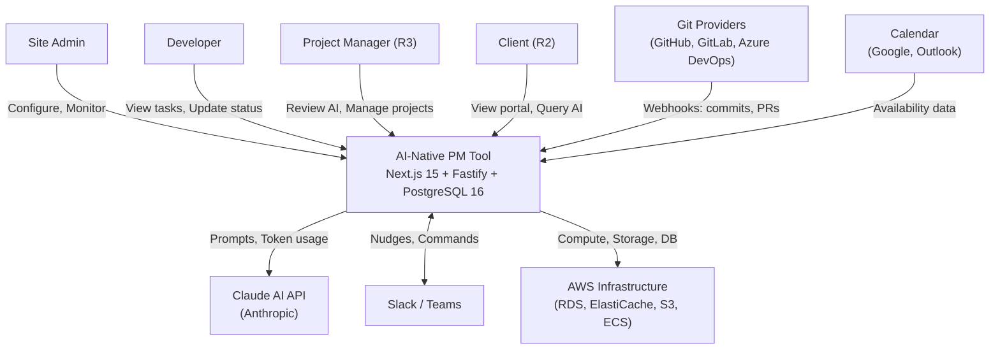

### 2.2 C4 Level 2 -- Container Diagram

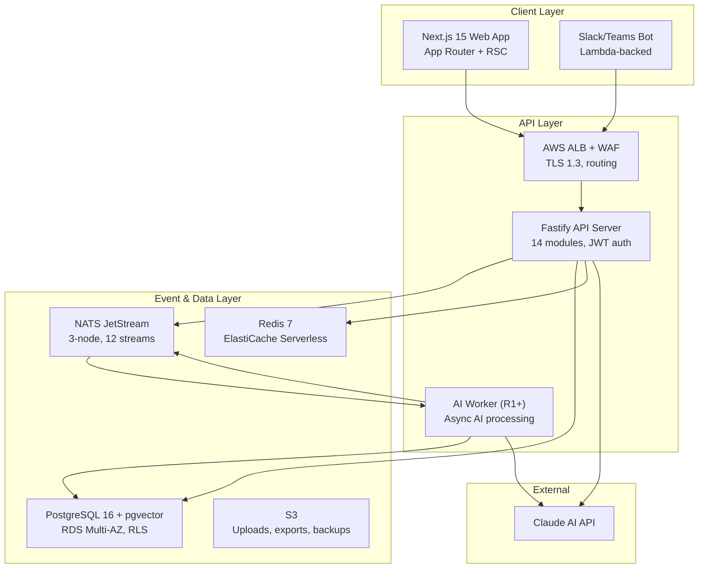

### 2.3 10-Tier Architecture (ASCII)

```
+============================================================================+
|  TIER 1: CLIENT LAYER                                                       |
|  Next.js 15 App Router | (internal) routes | (portal) routes | Slack Bot   |
|  + Kanban (R1) | Calendar (R1) | Table (R1) | Gantt (R2) | Goals (R2)     |
+============================================================================+
          |                           |                        |
          v                           v                        v
+============================================================================+
|  TIER 2: GATEWAY & AUTH                                                     |
|  AWS ALB + WAF | JWT (RS256) | RBAC Engine | Tenant Config | WebSocket(R1)|
+============================================================================+
          |
          v
+============================================================================+
|  TIER 3: APPLICATION SERVICES (Fastify Modular Monolith)                    |
|  Project | Task | Dependency | Comment | Audit | User | Projection | Config|
|  + Notification | Goals | Automation | Forms | Documents | Views           |
+============================================================================+
          |                           |
          v                           v
+============================================================================+
|  TIER 4: AI ENGINE                                                          |
|  Orchestrator (7-stage) | 10 Capabilities | Shared Infra (Gateway, RAG)   |
|  + AI Writing Assistant (F-102)                                             |
+============================================================================+
          |                           |
          v                           v
+============================================================================+
|  TIER 5: EVENT BUS                                                          |
|  NATS JetStream (3-node) | 12 Streams | 11 Durable Consumers | DLQ         |
+============================================================================+
          |
          v
+============================================================================+
|  TIER 6: DATABASE                                                           |
|  PostgreSQL 16 + pgvector (RDS) | 30 Tables | Redis 7 (ElastiCache) | S3  |
+============================================================================+
          |
+============================================================================+
|  TIER 7: INTEGRATION GATEWAY                                                |
|  Git Adapter | Slack Adapter | Calendar Adapter | Webhooks | Jira Import   |
+============================================================================+

+============================================================================+
|  TIER 8: SECURITY & AI SAFETY                                               |
|  Encryption (AES-256/TLS 1.3) | RLS | Secrets Manager | PII | Prompt Def. |
+============================================================================+

+============================================================================+
|  TIER 9: DEPLOYMENT & CI/CD                                                 |
|  ECS Fargate | AWS CDK (TypeScript) | GitHub Actions | ECR | CloudFront   |
+============================================================================+

+============================================================================+
|  TIER 10: MONITORING & OBSERVABILITY                                        |
|  CloudWatch Metrics/Logs | X-Ray Tracing | Sentry | AI Dashboard          |
+============================================================================+
```

### 2.4 Tier Summary

| Tier | Name | Key Technology | Primary Release | Related FRs |
|------|------|---------------|----------------|-------------|
| 1 | Client Layer | Next.js 15, React Server Components | R0 | FR-500-FR-503, FR-201, FR-203, FR-1900-FR-1901 |
| 2 | Gateway & Auth | ALB + WAF, JWT RS256, RBAC | R0 | FR-103, FR-104, FR-800-FR-802 |
| 3 | Application Services | Fastify 5, Drizzle ORM, TypeBox | R0 | FR-102, FR-105-FR-109, FR-900, FR-2000-FR-2014 |
| 4 | AI Engine | Claude Opus 4 / Sonnet 4.5, Orchestrator | R0 | FR-200-FR-203, FR-300-FR-305, FR-600-FR-607, FR-2013 |
| 5 | Event Bus | NATS JetStream 2.10+ | R0 | FR-100 |
| 6 | Database | PostgreSQL 16, pgvector, Redis 7, S3 | R0 | FR-101, FR-102, NFR-100-NFR-103 |
| 7 | Integration Gateway | Fastify plugins, OAuth 2.0 | R1 | FR-700-FR-702 |
| 8 | Security & AI Safety | KMS, RLS, Secrets Manager | R0 | FR-800-FR-802, NFR-200-NFR-205 |
| 9 | Deployment & CI/CD | ECS Fargate, CDK, GitHub Actions | R0 | NFR-300-NFR-303 |
| 10 | Monitoring & Observability | CloudWatch, X-Ray, Sentry | R0 | FR-400-FR-402 |

---

## 3. Tier 1 -- Client Layer

All user-facing surfaces. The AI is the primary interaction model; traditional PM interfaces are fallbacks.

| Component | Technology | Release | Purpose |
|-----------|-----------|---------|---------|
| **Web Application** | Next.js 15, App Router, React Server Components, TypeScript 5+ | R0 | Primary PM interface. AI review/approve UI (F-016), "What's Next" developer view (F-012), NL query panel (F-014), project dashboards. SSR for initial load, client components for interactivity. |
| **Kanban Board View** | React DnD, client component | R1 | AI-annotated board view with blocked task flags and priority overlays (F-087). Read-only in R1; drag-and-drop in R2. |
| **Calendar View** | Custom calendar grid, client component | R1 | Tasks by due date on month/week/day grid. Tasks as colored chips by priority/status. Drag to reschedule (F-091). |
| **Table View** | Virtualized table, client component | R1 | Spreadsheet-like bulk editing. Column resize/reorder/hide. Sort by any column. Saved views system (F-092). |
| **Gantt Chart View** | Gantt library, AI overlays | R2 | AI-annotated timeline: predicted delays, critical path, at-risk milestones (F-088). |
| **Notification Inbox** | Client component, WebSocket | R1 | Bell icon with unread count. Filter by type. Click-through to source entity (F-096). |
| **Goals Dashboard** | Server + client components | R2 | Goal tree view, OKR hierarchy, auto-calculated progress from linked tasks (F-095). |
| **Client Portal** | Next.js 15, separate route group (`/portal/[tenantSlug]`) | R2 | Client-facing view consuming the projection layer. Filtered tasks, AI-generated narratives, scoped NL queries (F-055, F-059). White-labelable via tenant config. |
| **Slack / Teams Bot** | Slack Bolt SDK / Teams Bot Framework, Lambda-backed | R1 | AI PM Agent delivery channel. Slash commands, nudges, summaries (F-036). |
| **Public REST API** | Versioned `/api/v1/`, cursor-based pagination, API key auth | R2 | External programmatic access with per-key rate limiting, webhook subscriptions, OpenAPI 3.1 (F-063). |

**Route Groups:**

| Route Group | URL Pattern | Purpose | Release |
|-------------|-------------|---------|---------|
| `(internal)` | `/dashboard`, `/projects/*`, `/tasks/*`, `/ai-review/*`, `/settings/*`, `/goals/*` | Primary PM interface | R0 |
| `(portal)` | `/portal/[tenantSlug]/*` | Client-facing portal | R2 |
| `api/` | `/api/*` | BFF routes proxying to Fastify API | R0 |

**Key decisions:**

- Next.js 15 over 14 for React Server Components maturity and App Router stability. Single Next.js app with route groups for internal vs portal.
- No mobile app in year 1. The Slack bot IS the mobile interface.
- No GraphQL. REST with composite endpoints (`?include=phases,tasks,dependencies`) handles all query patterns.
- Kanban promoted from R3 to R1 (table-stakes for any PM tool).
- Gantt promoted from R3 to R2 (consultancy clients expect timeline views).

---

## 4. Tier 2 -- Gateway and Auth

Single entry point for all traffic. Every request is authenticated, tenant-resolved, and rate-limited before reaching application code.

| Component | Technology | Release | Purpose |
|-----------|-----------|---------|---------|
| **API Gateway** | AWS ALB + AWS WAF | R0 | TLS 1.3 termination, request routing (web app vs API vs portal), WAF rules for OWASP Top 10. Path-based routing: `/api/*` -> API target group, `/*` -> Web target group. |
| **Authentication Service** | Custom auth module (Fastify plugin), RS256 JWT | R0 | Password auth with bcrypt (R0). SAML/OIDC SSO via `passport-saml` + `openid-client` (R1). MFA via TOTP (R1). JWT carries `tenant_id`, `user_id`, `role` claims. 1h access tokens, 30d refresh with rotation. |
| **RBAC Engine** | Application-layer enforcement + DB check | R0-R3 | Four-stage rollout: Admin + Developer (R0) -> +Client (R2) -> +PM (R3). Enforcement chain: authenticate -> resolve tenant -> set RLS context -> check role -> check resource scope. |
| **Config Service** | Tenant config table + in-memory cache (5min TTL) | R0 | Per-tenant settings: custom status labels, priority scales, AI model preferences, feature flags, autonomy policy defaults (F-010). Redis-cached, invalidated on update via `pm.system.config_changed` NATS event. |
| **WebSocket Gateway** | Socket.io on Fastify, ALB WebSocket support | R1 | Real-time task board updates, comment streams, AI decision notifications, notification inbox live updates, user presence per project view. Authenticated via same JWT. |

**Key decisions:**

- Custom auth over Auth0/Clerk/Supabase Auth -- full control over tenant isolation in JWT claims, session management, and audit trail.
- ALB over API Gateway (AWS) -- handles routing and TLS without per-request pricing and Lambda cold-start overhead.
- Session state in Redis (ElastiCache) -- refresh tokens, active session tracking, concurrent session limits, forced logout.

---

## 5. Tier 3 -- Application Services (Modular Monolith)

One deployable Fastify API service with 14 well-separated internal modules. Each module owns its domain logic, database queries, and event emissions. They share a process, a database connection pool, and a NATS client.

### 5.1 C4 Level 3 -- API Server Components

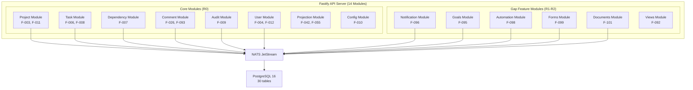

### 5.2 Module Catalog

| Module | Key Responsibilities | Feature Refs | Release |
|--------|---------------------|-------------|---------|
| **Project** | Project CRUD, NL description storage, WBS baseline snapshots (JSONB), phase management, composite endpoints. | F-003, F-011 | R0 |
| **Task** | Full task lifecycle: configurable statuses, multiple assignees (junction table with roles), effort tracking, `ai_generated` + `ai_confidence` flags, sub-tasks, checklists (F-089), recurring tasks (F-090). | F-006, F-008, F-089, F-090 | R0 |
| **Dependency** | Finish-to-start relationships, circular dependency prevention via DAG traversal, automatic blocked/unblocked propagation. | F-007 | R0 |
| **Comment** | Per-task threads, `client_visible` boolean, @mentions (F-093), action items (F-097), edit/delete with "edited" indicator. | F-026, F-093, F-097 | R0 |
| **Audit** | Immutable `audit_log` table (INSERT only). Field-level diffs with `actor_type` (user/ai/system/integration). Partitioned by month. | F-009 | R0 |
| **User** | Tenant-scoped user management, `/users/me/next` endpoint, availability tracking, workload metrics. | F-004, F-012 | R0 |
| **Projection** | Internal truth -> client-safe view transformation. Field-level redaction, narrative generation, approval workflow. | F-042, F-055 | R0 (model) / R2 (active) |
| **Config** | Per-tenant settings: status labels, priority levels, phase templates, feature flags, autonomy policies. | F-010 | R0 |
| **Notification** | Notification inbox (F-096), preference management, channel dispatch (in-app, email, Slack), reminders (F-103). | F-096, F-103 | R1 |
| **Goals** | Goals and OKR hierarchy, key results, goal-task links, auto-calculated progress, AI risk flagging. | F-095 | R2 |
| **Automation** | User-configurable if-then rules. Trigger evaluation, action execution, execution logging. | F-098 | R2 |
| **Forms** | Form builder, public submission endpoint, task creation on submission, submission tracking. | F-099 | R2 |
| **Documents** | Collaborative documents, Markdown content, draft/published/archived lifecycle, pgvector indexing for RAG. | F-101 | R2 |
| **Views** | Saved views system, view configurations (columns, sort, filters, grouping), shared vs personal views. | F-092 | R1 |

### 5.3 Technology Stack

| Choice | Technology | Rationale |
|--------|-----------|-----------|
| Runtime | Node.js 22 LTS | Shared language with Next.js frontend. TypeScript end-to-end. |
| Framework | Fastify 5 | Fastest Node.js HTTP framework. Plugin architecture maps to modules. Schema-based validation via TypeBox. |
| ORM | Drizzle ORM | TypeScript-first, readable SQL, schema-as-code with versioned migrations. |
| Validation | TypeBox (Fastify native) + Zod (shared with frontend) | Request validation at framework level. Shared types via monorepo. |
| Monorepo | Turborepo + pnpm workspaces | `packages/shared` for types, `apps/web` for Next.js, `apps/api` for Fastify, `apps/ai-worker` for async AI (R1). |

---

## 6. Tier 4 -- AI Engine

This is the product. Every other tier exists to feed data into and execute actions from this tier.

### 6.1 AI Orchestrator -- 7-Stage Pipeline

All AI operations flow through a single orchestration pipeline. No AI capability calls the LLM directly.

```
1. TRIGGER        -> Event from NATS or user request from API
2. AUTONOMY CHECK -> Policy engine determines: propose or execute? (F-015)
3. CONTEXT ASSEMBLY -> RAG retrieval + event history + domain template + token budget
                       + custom field values + document content (v3.1)
4. CONFIDENCE CHECK -> Pre-flight: is context sufficient? Below threshold -> graceful degradation (F-018)
5. LLM CALL       -> Routed through LLM Gateway (model selection, retry, streaming)
6. POST-PROCESSING -> Parse structured output, validate against schema, extract actions
7. DISPOSITION     -> Shadow mode: log only. Propose mode: create proposal. Execute mode: apply + log.
```

| Component | Technology | Purpose |
|-----------|-----------|---------|
| **Orchestrator** | TypeScript module in API (R0) -> separate ECS service (R1+) | Routes all AI requests through the 7-stage pipeline. No capability bypasses this. |
| **Autonomy Policy Engine** | Config-driven rules per action type per tenant | Determines per action whether AI proposes or executes. Supports shadow mode (F-017), quiet hours, nudge limits (max 2/task/day). Default: propose everything, execute nothing. |
| **Shadow Mode** | Boolean flag per tenant + per AI capability | All AI actions logged but not executed or surfaced. Admins review accuracy before enabling live mode. |

### 6.2 AI Capabilities (10)

| # | Capability | Model | Release | Token Profile | Purpose |
|---|-----------|-------|---------|---------------|---------|
| 1 | **NL-to-WBS Generator** | Claude Opus 4 | R0 | ~5K in / ~3K out | 5-stage sub-pipeline: domain detection -> template selection -> RAG enrichment -> Opus generation -> schema validation. Domain templates for software delivery, data migration, consultancy. **40%+ of R0 AI engineering time.** |
| 2 | **"What's Next" Engine** | Rules-based (R0) -> Claude Sonnet (R1) | R0 | ~1K in / ~500 out | Per-developer task prioritization. R0: dependency resolved -> due date -> priority. R1: LLM-ranked with velocity context. |
| 3 | **NL Query Engine** | Claude Sonnet 4.5 | R0 | ~2K in / ~1K out | NL questions about project state. RAG retrieval from pgvector -> Sonnet synthesis. Target p95 < 8s. |
| 4 | **Summary Engine** | Claude Sonnet 4.5 | R0/R1 | ~3K in / ~1K out | Daily summaries (F-013), weekly reports (F-029), client narratives (F-057). |
| 5 | **Risk Predictor** | Claude Opus 4 | R1 | ~4K in / ~2K out | Pattern analysis: blocker duration, stalled tasks, dependency chain growth, scope drift. Shadow mode first 2-4 weeks. |
| 6 | **AI PM Agent** | Claude Sonnet 4.5 | R1 | ~2K in / ~500 out | Autonomous 15-min loop: chase overdue updates via Slack, nudge stalled work, propose escalations. |
| 7 | **Scope Creep Detector** | Claude Sonnet 4.5 | R1 | ~3K in / ~1K out | Task additions vs WBS baseline (JSONB snapshot). Alerts when scope drifts > 15%. |
| 8 | **SOW Generator** | Claude Opus 4 | R3 | ~8K in / ~5K out | Generates Statements of Work from historical delivery data. Long-context with template system + approval workflow. Consultancy killer feature. |
| 9 | **Per-Tenant Learning** | Fine-tuned context / RAG enrichment | R3 | Variable | Tenant-scoped contexts that improve WBS, estimation, and risk prediction from each org's own history. The moat. |
| 10 | **AI Writing Assistant** | Claude Sonnet 4.5 | R2 | ~2K in / ~1K out | Content generation for task descriptions, comments, reports, documents. Draft from title, improve/expand text, translate technical -> business language (F-102). |

### 6.3 Shared AI Infrastructure

| Component | Technology | Purpose |
|-----------|-----------|---------|
| **Context Assembly Layer** | TypeScript module | Loads tenant data, retrieves similar context via pgvector (cosine similarity, top-k=10), aggregates recent events. **v3.1 update:** also ingests custom field values (F-094) and document content (F-101) to enrich AI context for WBS generation and NL queries. |
| **LLM Gateway** | TypeScript module wrapping Anthropic SDK | Model routing (Opus for generation/risk, Sonnet for queries/summaries). Retry with exponential backoff + fallback (Opus -> Sonnet). Streaming for interactive queries. **Circuit breaker:** 5 consecutive failures -> 60s open state -> cached/fallback responses. |
| **Prompt Registry** | Versioned YAML files in repo (`/prompts/{capability}/v{N}.yaml`) | Central prompt templates with Handlebars-style context injection. Schema validation for output format. Version-pinned per capability. |
| **Evaluation Harness** | Golden test sets + acceptance tracking | Quality checks on every prompt version change. Tracks: acceptance rate (< 60% triggers review), override rate (> 40% = miscalibration), hallucination incidents. |
| **Traceability Pipeline** | `ai_actions` table + structured logs | Every AI action logged: trigger -> context -> prompt hash -> output -> confidence -> disposition -> review -> rollback. Full chain queryable (F-020). |
| **Cost Tracker** | Redis counters + `ai_cost_log` table | Per-operation: input/output tokens, USD cost, model, capability, tenant_id. Per-tenant monthly budget caps with pre-flight check. Alerts at 80% and 100% (F-046, F-061). |

---

## 7. Tier 5 -- Event Bus

The nervous system. Every AI capability, every integration, and every observability pipeline consumes from this bus.

### 7.1 NATS JetStream Configuration

| Attribute | Value |
|-----------|-------|
| **Version** | NATS 2.10+ |
| **Deployment** | 3-node cluster on ECS Fargate with EFS for JetStream persistence |
| **Retention** | 30-day message retention per stream |
| **Delivery** | At-least-once delivery guarantee |
| **Max message size** | 1MB |
| **Storage** | File-based (EFS mount) for persistence across container restarts |
| **Cluster discovery** | ECS Service Discovery (Cloud Map) |

### 7.2 Stream Topology (12 Streams)

| Stream | Subjects | Producers | Key Consumers |
|--------|----------|-----------|---------------|
| `pm.tasks` | `.created`, `.updated`, `.status_changed`, `.assigned`, `.completed`, `.dependency_resolved`, `.dependency_blocked`, `.checklist_updated`, `.recurrence_triggered`, `.custom_field_updated` | Task Module, Recurrence Scheduler | AI Adaptive, Audit Writer, Embedding Pipeline, Notification Gen, Projection Updater, Automation Engine |
| `pm.projects` | `.created`, `.updated`, `.phase_changed`, `.baseline_set` | Project Module | AI Summarizer, Embedding Pipeline, Scope Creep Detector |
| `pm.comments` | `.created`, `.updated`, `.deleted`, `.mention_created`, `.action_assigned` | Comment Module | Embedding Pipeline, Notification Gen, Automation Engine |
| `pm.ai` | `.action_proposed`, `.action_approved`, `.action_rejected`, `.action_executed`, `.confidence_low` | AI Orchestrator | Traceability Pipeline, Cost Tracker, Evaluation Harness |
| `pm.integrations` | `.git_commit`, `.git_pr_merged`, `.slack_message`, `.calendar_updated` | Integration Adapters | AI Adaptive, Task Module (auto-complete on merge) |
| `pm.notifications` | `.created` | Notification Generator | Notification Router (delivery) |
| `pm.reminders` | `.due` | Reminder Scheduler (pg_cron) | Notification Gen |
| `pm.goals` | `.progress_updated`, `.at_risk` | Goals Module | Notification Gen, AI Adaptive |
| `pm.automations` | `.triggered`, `.executed` | Automation Engine | Audit Writer, Cost Tracker |
| `pm.forms` | `.submitted` | Forms Module (public endpoint) | Task Module (creates task), Notification Gen |
| `pm.documents` | `.created`, `.updated` | Documents Module | Embedding Pipeline (RAG), Notification Gen |
| `pm.system` | `.config_changed`, `.tenant_created`, `.user_invited` | Config, User Modules | Config Cache Invalidation, Notification Router |

### 7.3 Durable Consumers (11)

| Consumer | Subscribes To | Purpose | Release |
|----------|--------------|---------|---------|
| `audit-writer` | `pm.tasks.*`, `pm.projects.*`, `pm.comments.*`, `pm.ai.*` | Writes immutable audit log entries for every state change | R0 |
| `ai-adaptive` | `pm.tasks.*`, `pm.integrations.*` | Feeds task state changes and git activity to the adaptive task engine | R0/R1 |
| `ai-summarizer` | `pm.tasks.*`, `pm.projects.*`, `pm.comments.*` | Aggregates activity for daily/weekly summary generation | R0 |
| `embedding-pipeline` | `pm.tasks.created`, `pm.tasks.updated`, `pm.comments.created`, `pm.projects.created`, `pm.documents.*` | Generates embeddings for new/updated content, stores in pgvector | R0 |
| `projection-updater` | `pm.tasks.*`, `pm.projects.*`, `pm.comments.*` | Updates client-facing projection views when internal data changes | R0/R2 |
| `notification-router` | `pm.notifications.created`, `pm.tasks.assigned`, `pm.tasks.status_changed`, `pm.comments.created`, `pm.ai.action_proposed`, `pm.system.user_invited` | Routes notifications to channels (in-app, email, Slack) | R0/R1 |
| `cost-tracker` | `pm.ai.*` | Tracks AI operation costs per tenant, updates Redis counters | R0 |
| `escalation-monitor` | `pm.tasks.status_changed`, `pm.tasks.dependency_blocked` | Monitors for escalation conditions (blocked > 48h, overdue) | R1 |
| **`notification-generator`** | `pm.tasks.*`, `pm.comments.*`, `pm.ai.*`, `pm.reminders.*`, `pm.goals.*` | Creates notification records based on user preferences (FR-2007) | R1 |
| **`recurrence-scheduler`** | `pm.tasks.recurrence_triggered` | Clones recurring tasks when schedule fires (FR-2001) | R1 |
| **`automation-engine`** | `pm.tasks.*`, `pm.comments.*` | Evaluates and executes user-defined automation rules (FR-2009) | R2 |

### 7.4 Event Flow Diagram

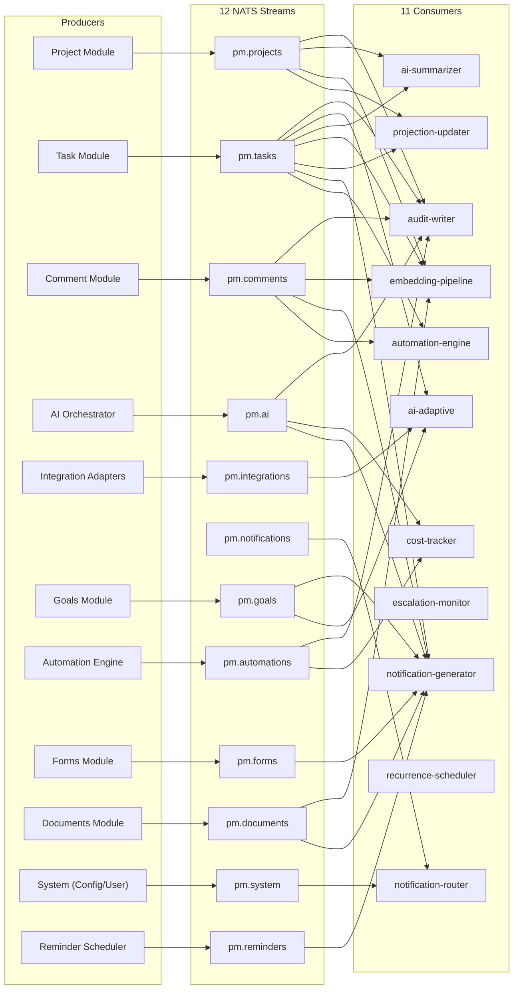

### 7.5 DLQ Strategy

| Aspect | Configuration |
|--------|---------------|
| **Retry policy** | 3 retries with exponential backoff: 1s, 5s, 25s |
| **DLQ per consumer** | Dedicated DLQ stream per consumer (e.g., `dlq.audit-writer`) |
| **DLQ retention** | 7 days |
| **DLQ monitoring** | CloudWatch alarm on DLQ message count > 0 |
| **DLQ replay** | Manual replay via admin CLI tool: read from DLQ, re-publish to original stream |

**Key decision -- NATS over Kafka:** Kafka is the right choice at 1000+ consumers and petabyte-scale streams. At 11 consumers and < 10K events/day, NATS JetStream provides persistence, replay, and consumer groups with dramatically lower operational complexity. A 3-node NATS cluster on ECS Fargate requires zero ZooKeeper, zero broker tuning, and zero partition rebalancing.

---

## 8. Tier 6 -- Data Layer

One database, stretched intelligently. Separate stores only where access patterns demand it.

### 8.1 Storage Components

| Component | AWS Service | Configuration | Purpose |
|-----------|-------------|---------------|---------|
| **PostgreSQL 16** | RDS (Multi-AZ) | R0: `db.r6g.large` (2 vCPU, 16 GB). R2: `db.r6g.xlarge` + read replica. | Primary relational store. `tenant_id` on every table. 30 tables. JSONB for WBS baselines, AI action metadata, configurable fields. Drizzle ORM with versioned migrations. |
| **pgvector** | Co-located in RDS | `text-embedding-3-small` (1536 dims). IVFFlat index R0-R2, evaluate HNSW at R3. | Embeddings for tasks, comments, project descriptions, documents (F-101). Co-located = SQL JOINs in RAG queries. |
| **Redis 7** | ElastiCache Serverless | AOF persistence + hourly snapshots. | Session storage, rate limiting, AI queues (BullMQ), real-time presence, config cache, AI response cache. |
| **S3** | S3 Standard + S3 Glacier | 4 buckets: `uploads`, `exports`, `reports`, `backups`. | File attachments, exports, report PDFs, database backups. Glacier lifecycle for audit archives > 90 days. |
| **Full-Text Search** | PostgreSQL FTS | `tsvector` columns on tasks, projects, comments, documents. GIN indexes. | Search across all text content. Evaluate Elasticsearch at R3 if corpus > 500K documents. |

### 8.2 Complete Table Catalog (30 Tables)

| # | Table | FR Ref | Release | Est. Rows (R3) | RLS | Notes |
|---|-------|--------|---------|----------------|-----|-------|
| 1 | `tenants` | FR-101 | R0 | ~10 | No | Queried by super admin |
| 2 | `users` | FR-103 | R0 | ~200 | Yes | (tenant_id, email) unique |
| 3 | `projects` | FR-102 | R0 | ~100 | Yes | JSONB wbs_baseline |
| 4 | `phases` | FR-102 | R0 | ~500 | Yes | Per-project ordering |
| 5 | `tasks` | FR-105 | R0 | ~100K | Yes | FTS via tsvector, recurrence columns (R1) |
| 6 | `task_assignments` | FR-105 | R0 | ~150K | Yes | Roles: assignee, reviewer, approver |
| 7 | `task_dependencies` | FR-106 | R0 | ~50K | Yes | Finish-to-start only |
| 8 | `comments` | FR-503 | R0 | ~200K | Yes | FTS, action item columns (R1) |
| 9 | `tags` | FR-1100 | R1 | ~500 | Yes | Project or tenant scope |
| 10 | `task_tags` | FR-1100 | R1 | ~300K | Yes | Junction table |
| 11 | `ai_actions` | FR-400 | R0 | ~50K | Yes | Full AI traceability |
| 12 | `ai_cost_log` | FR-1000 | R0 | ~100K | Yes | Per-operation cost tracking |
| 13 | `audit_log` | FR-108 | R0 | ~1M+ | Yes | Partitioned by month, INSERT only |
| 14 | `tenant_configs` | FR-109 | R0 | ~100 | Yes | Key-value JSONB config |
| 15 | `embeddings` | FR-200 | R0 | ~500K | Yes | IVFFlat vector index |
| 16 | `task_checklists` | FR-2000 | R0 | ~50K | Yes | Per-task checklists |
| 17 | `checklist_items` | FR-2000 | R0 | ~200K | Yes | Checklist items with completion |
| 18 | `mentions` | FR-2004 | R0 | ~100K | Yes | Comment @mentions |
| 19 | `custom_field_definitions` | FR-2005 | R1 | ~1K | Yes | Polymorphic field types |
| 20 | `custom_field_values` | FR-2005 | R1 | ~500K | Yes | Per-task field values |
| 21 | `saved_views` | FR-2003 | R1 | ~2K | Yes | View configs (JSONB) |
| 22 | `goals` | FR-2006 | R2 | ~1K | Yes | Self-referencing hierarchy |
| 23 | `goal_task_links` | FR-2006 | R2 | ~10K | Yes | Goal-task junction |
| 24 | `notifications` | FR-2007 | R1 | ~500K | Yes | Evaluate partitioning at 1M |
| 25 | `notification_preferences` | FR-2007 | R1 | ~2K | Yes | Per-user, per-type, per-channel |
| 26 | `automation_rules` | FR-2009 | R2 | ~500 | Yes | Trigger + action config (JSONB) |
| 27 | `forms` | FR-2010 | R2 | ~200 | Yes | Field definitions (JSONB), public slug |
| 28 | `documents` | FR-2012 | R2 | ~10K | Yes | Markdown, FTS, client_visible |
| 29 | `reminders` | FR-2014 | R1 | ~20K | Yes | Partial index on unsent |
| 30 | `tasks` (extensions) | FR-2001, FR-2008 | R1 | -- | -- | Recurrence columns + action item columns on comments |

### 8.3 Entity-Relationship Diagram (Core Tables)

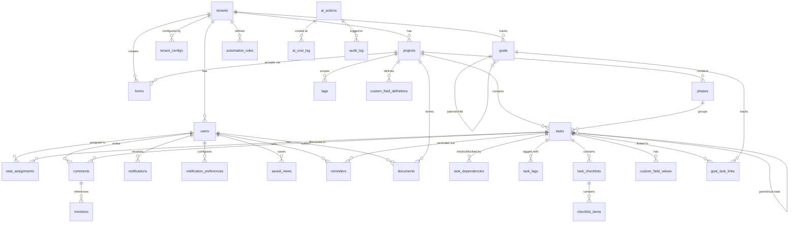

### 8.4 Row-Level Security (RLS)

Every tenant-scoped table has an RLS policy:

```sql
CREATE POLICY tenant_isolation ON tasks
  USING (tenant_id = current_setting('app.current_tenant_id')::uuid);
```

The API middleware sets `app.current_tenant_id` per request from the JWT claim before any query executes. Application code physically cannot query across tenants. This is database-enforced, not application-trust.

### 8.5 Indexing Strategy

- `tenant_id` as the first column in every composite index (tenant locality in B-tree scans)
- Soft deletes (`deleted_at` timestamp) on all user-facing entities; hard deletes only via background jobs
- `created_at` and `updated_at` auto-managed via Drizzle defaults + `ON UPDATE` triggers
- `ai_generated` boolean + `ai_confidence` float on tasks and comments
- `audit_log`: INSERT-only, partitioned by month, no UPDATE/DELETE grants
- GIN indexes on all `tsvector` columns for full-text search
- IVFFlat index on embeddings for vector similarity (evaluate HNSW at R3)
- Partial indexes on active queries (e.g., `reminders WHERE is_sent = false`)

### 8.6 Custom Fields -- Polymorphic Storage Pattern

Custom field values use a polymorphic column pattern to support multiple data types without separate tables:

| Field Type | Storage Column | Example |
|-----------|---------------|---------|
| `text`, `url`, `email` | `value_text` | `"https://example.com"` |
| `number`, `checkbox` | `value_number` | `42.5` or `1`/`0` |
| `date` | `value_date` | `2026-03-15T00:00:00Z` |
| `select`, `multi_select`, `formula` | `value_json` | `["option1", "option2"]` |

Formula fields (F-100) evaluate expressions using task data: `cost = hours * rate`, date diffs, conditionals, subtask aggregations. Expressions stored in `custom_field_definitions.formula_expression` and computed on read.

---

## 9. New Subsystem Architectures

Seven subsystems added or significantly expanded in v3.1. Each with its own data flow and integration points.

### 9.1 Notification Pipeline (F-096, FR-2007)

Two-stage architecture: event -> preference filter -> channel dispatch.

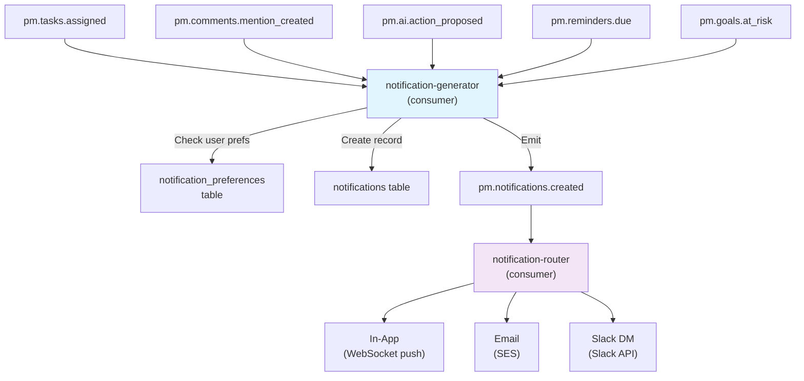

**Stage 1 (notification-generator):** Listens to domain events, looks up user notification preferences, creates notification records, emits `pm.notifications.created`.

**Stage 2 (notification-router):** Listens to `pm.notifications.created`, dispatches to appropriate channels based on user preference. In-app via WebSocket, email via SES, Slack via Slack API.

### 9.2 Automation Engine (F-098, FR-2009)

User-configurable if-then rules that are distinct from AI-driven actions.

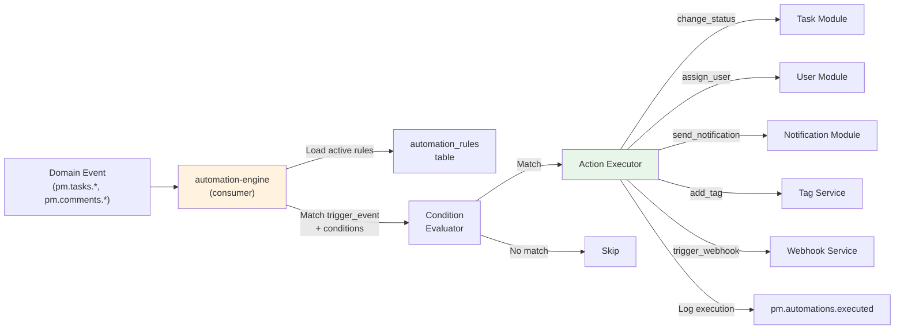

**Trigger types:** `task_status_changed`, `task_assigned`, `task_due_soon`, `dependency_resolved`, `custom_field_changed`.

**Action types:** `change_status`, `assign_user`, `add_tag`, `send_notification`, `set_priority`, `trigger_webhook`.

### 9.3 Recurring Task Scheduler (F-090, FR-2001)

Uses iCal RRULE format for recurrence patterns.

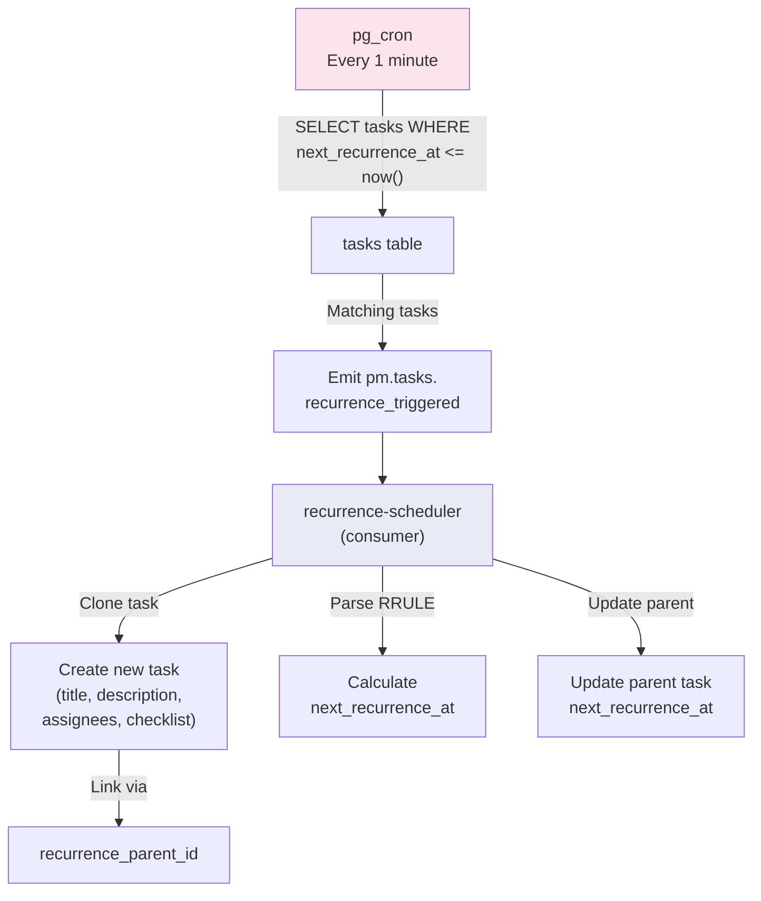

**Supported patterns:** daily, weekly (specific days), monthly (day of month), custom via iCal RRULE. Cloned tasks inherit title, description, assignees, checklist template, and phase from the recurrence parent.

### 9.4 Custom Fields -- Polymorphic Storage (F-094, FR-2005)

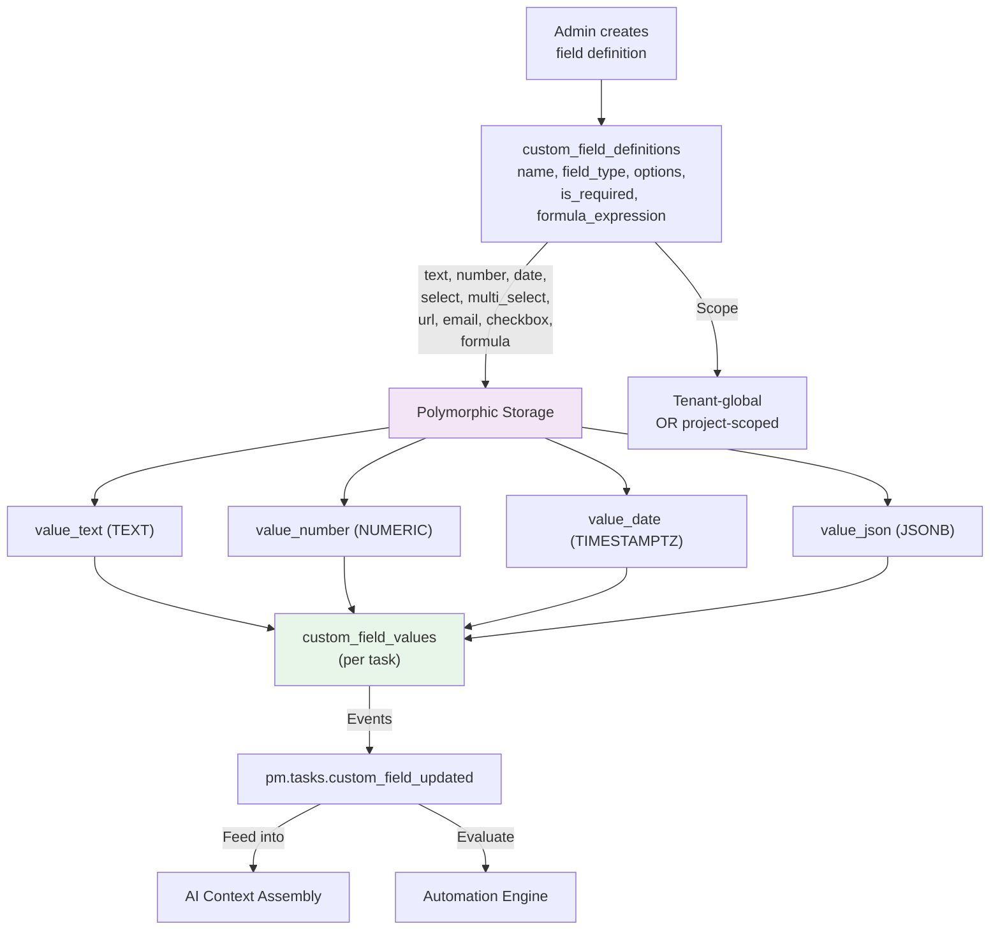

AI capabilities consume custom field values during context assembly. When a custom field changes, `pm.tasks.custom_field_updated` is emitted, allowing automations to trigger and embeddings to update.

### 9.5 Goals and OKR Hierarchy (F-095, FR-2006)

Self-referencing hierarchy supporting objectives, key results, and goals at any nesting depth.

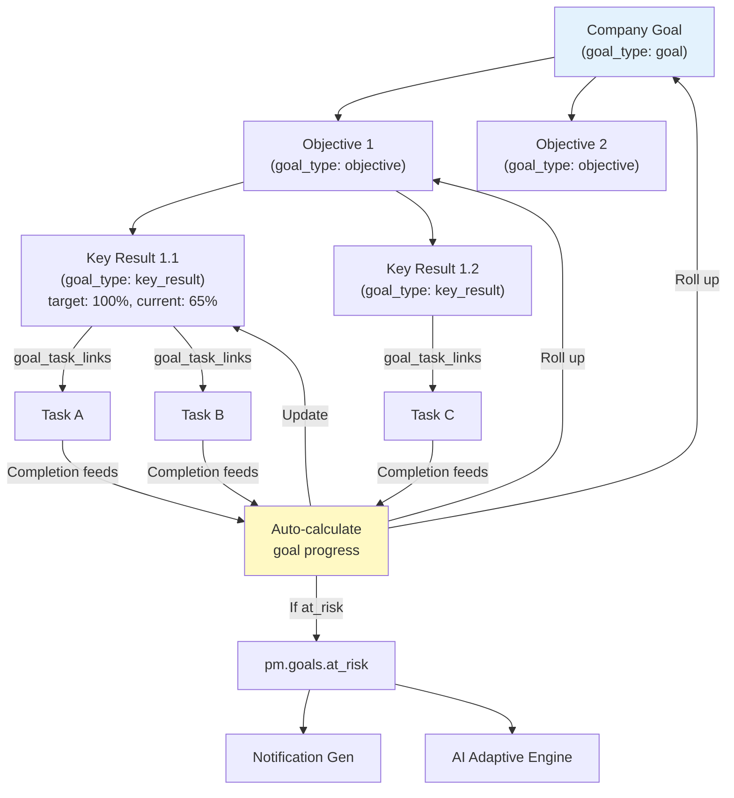

Progress auto-calculates from linked task completion. When a goal's progress falls behind its expected trajectory, `pm.goals.at_risk` is emitted, triggering notifications and AI analysis.

### 9.6 Documents and Knowledge Base (F-101, FR-2012)

Collaborative documents with RAG integration for enriching AI context.

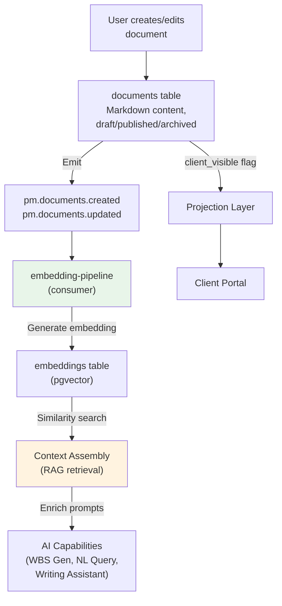

Documents are indexed into pgvector embeddings alongside tasks, comments, and project descriptions. The AI Writing Assistant (F-102) can reference document content when generating task descriptions or client reports.

### 9.7 Form Intake Pipeline (F-099, FR-2010)

Public-facing forms that create tasks on submission without requiring authentication.

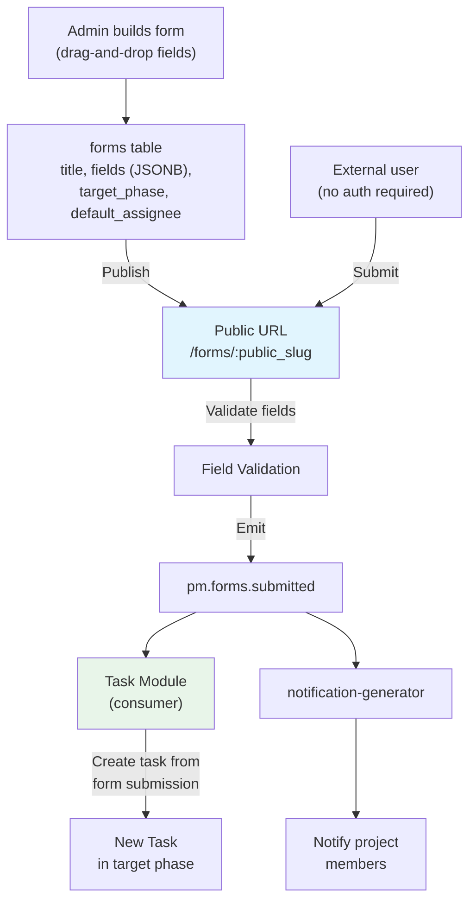

Published forms have a unique public slug. Submissions are validated against field definitions, converted to tasks in the configured project/phase, and project members are notified.

---

## 10. Tier 7 -- Integration Gateway

Adapters that bring external signals into the event bus. Each adapter is a lightweight Fastify plugin that normalizes external events into `pm.integrations.*` NATS subjects.

| Adapter | Protocol | Release | Signal Value |
|---------|----------|---------|-------------|
| **Git (GitHub, GitLab, Azure DevOps)** | Inbound webhooks | R1 | Most important signal source. Commit activity is ground truth. Auto-link commits/PRs to tasks via branch naming. Auto-complete on PR merge (when autonomy policy allows). |
| **Slack / Teams** | OAuth 2.0 + Events API | R1 | Bidirectional. Inbound: slash commands, message context. Outbound: AI PM Agent nudges, summaries, risk alerts, notifications. |
| **Calendar (Google, Outlook)** | CalDAV / OAuth 2.0 | R2 | Team member availability for resource optimization (F-032). Deferred from R1 to R2; calendar view (F-091) ships in R1 without external sync. |
| **Webhook System (outbound)** | Tenant-configurable subscriptions | R2 | Event notifications to external URLs. Retry with exponential backoff. HMAC-SHA256 signature verification. |
| **Jira Import** | REST API batch migration | R2 | One-time inbound migration: projects, tasks, dependencies, comments. Sales enablement for prospects switching from Jira. |

**Adapter architecture:** Each integration is a Fastify plugin with three responsibilities: (1) authenticate the external service (OAuth token management), (2) normalize inbound events to NATS subjects, (3) format outbound messages for the external service API. Adapters share no state with each other.

---

## 11. Tier 8 -- Security and AI Safety

Security is structural in this architecture, not a feature. Every tier already enforces tenant isolation, authentication, and audit.

### 11.1 Security Controls

| Control | Implementation | Release |
|---------|---------------|---------|
| **Encryption at rest** | AES-256 via AWS KMS. RDS encrypted storage. S3 SSE. ElastiCache encryption. | R0 |
| **Encryption in transit** | TLS 1.3 on all connections: ALB->services, services->RDS, services->ElastiCache, services->NATS. | R0 |
| **Tenant isolation** | PostgreSQL RLS (database-enforced). JWT tenant_id claims. Per-request context setting. | R0 |
| **Secrets management** | AWS Secrets Manager for DB credentials, API keys, JWT signing keys. Auto-rotated. | R0 |
| **Immutable audit trail** | `audit_log` table: INSERT only. No UPDATE/DELETE grants. Field-level diffs with actor tracking. Monthly partitioning. | R0 |
| **PII handling** | `client_visible=false` redacted before LLM ingestion. Emails hashed in logs. AI prompts sanitized. | R1 |
| **Prompt injection defense** | Input sanitization before LLM context assembly. Tenant data in structured fields. Output validation against schema. | R2 |
| **AI cross-tenant leakage prevention** | RAG retrieval scoped by `tenant_id` in WHERE clause. Embedding queries include tenant filter. Context assembly verified to contain only current tenant data. | R0 |
| **SOC 2 Type I** | Access controls, change management, data protection, monitoring, incident response. | R2 |
| **SOC 2 Type II** | 6-month sustained evidence collection. Automated control monitoring. | R3 |

### 11.2 Three-Layer Tenant Isolation

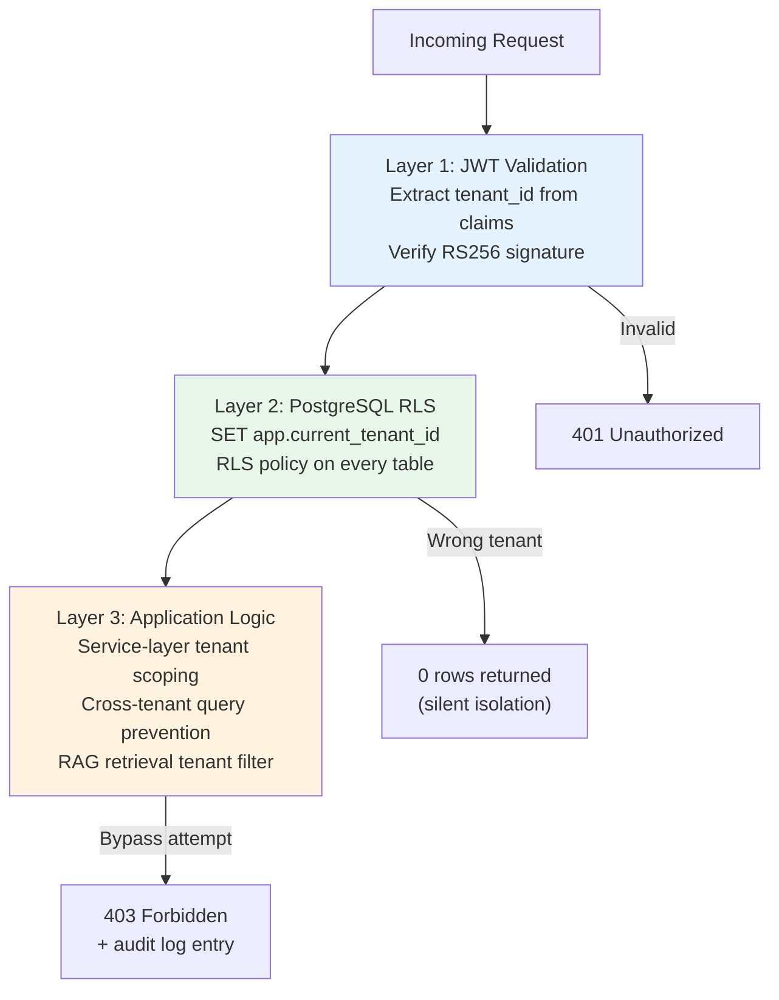

---

## 12. Tier 9 -- Deployment and CI/CD

Optimized for a small team on AWS. Managed services everywhere. GitOps for reproducibility.

### 12.1 AWS Deployment Topology

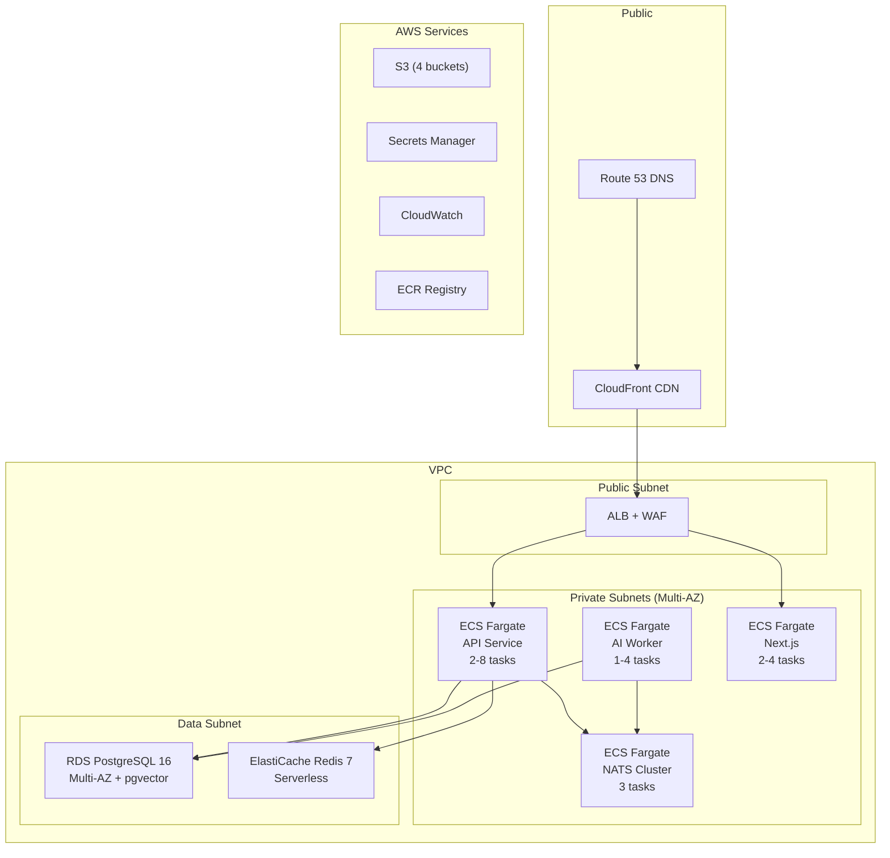

### 12.2 Compute Configuration

| Service | R0 | R1 | R2 | R3 | CPU | Memory |
|---------|----|----|----|----|-----|--------|
| API | 2 tasks | 2 | 3-4 | 2-8 | 1 vCPU | 2 GB |
| AI Worker | 1 task | 2 | 2-4 | 2-6 | 1 vCPU | 4 GB |
| Web (Next.js) | 2 tasks | 2 | 2-4 | 2-4 | 0.5 vCPU | 1 GB |
| NATS | 3 tasks | 3 | 3 | 3-5 | 0.5 vCPU | 1 GB |

### 12.3 CI/CD Pipeline

Trunk-based development. All changes via PR with approval.

```
Automated: lint -> type-check -> unit test -> integration test (testcontainers)
  -> build -> deploy to staging -> smoke test -> promote to production
```

Infrastructure as Code: AWS CDK (TypeScript). Single `cdk deploy` for full environment.

**Environments:** `dev` (single-AZ, smallest instances), `staging` (mirrors prod topology), `prod` (Multi-AZ, encrypted, monitored). Feature flags via tenant config for gradual rollout.

---

## 13. Tier 10 -- Monitoring and Observability

The AI engine requires purpose-built observability beyond standard application monitoring.

| Component | AWS Service / Tool | Purpose |
|-----------|-------------------|---------|
| **Metrics** | CloudWatch Metrics + Dashboards | Application metrics, database metrics, AI metrics (latency, tokens, cost, confidence). Custom metrics via CloudWatch EMF. |
| **Logging** | CloudWatch Logs + Logs Insights | Centralized structured JSON logs from all ECS services. 30-day retention (prod), 7-day (staging). |
| **Distributed Tracing** | AWS X-Ray | End-to-end request tracing: API -> AI Orchestrator -> LLM Gateway -> Database. Critical for AI latency debugging. |
| **Error Tracking** | Sentry (SaaS) | Real-time error capture with source maps, breadcrumbs, release tracking. Frontend error grouping. |
| **Alerting** | CloudWatch Alarms -> SNS -> PagerDuty/Slack | Circuit breaker open, AI failure rate > 10%, budget exceeded, NATS consumer lag > 1000, RDS pool > 80%, p95 > 2s, 5xx spike. |
| **AI Dashboard** | CloudWatch Dashboard (custom) | Per-capability latency, per-tenant budget gauges, acceptance/rejection rates, prompt version A/B, circuit breaker state, shadow mode status. |

**Performance Budgets:**

| Metric | Target |
|--------|--------|
| API p95 latency | < 500ms (non-AI endpoints) |
| AI operation p95 | < 8s (NL query), < 30s (WBS generation) |
| First Contentful Paint | < 1.5s |
| Time to Interactive | < 3s |
| NATS consumer lag | < 1000 messages |

---

## 14. Data Flow Diagrams

### 14.1 NL-to-WBS Sequence

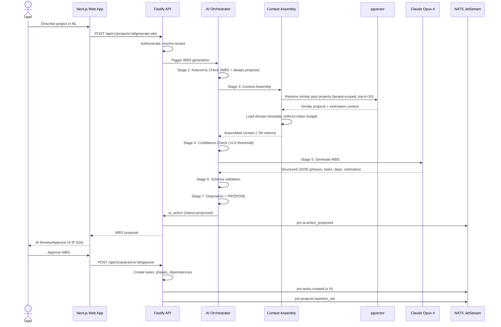

### 14.2 AI PM Agent Loop Sequence

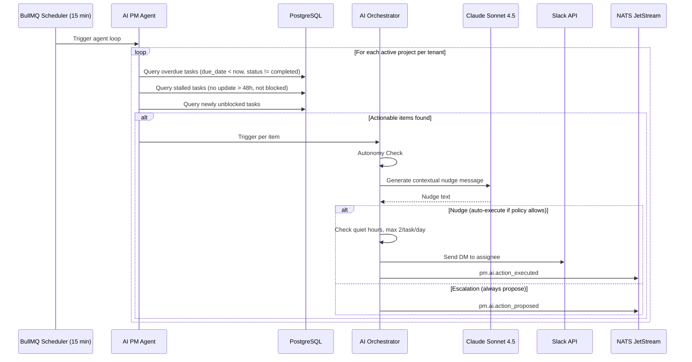

### 14.3 Notification Pipeline Sequence

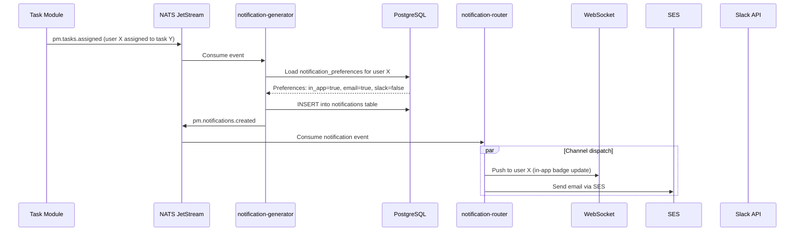

---

## 15. API Endpoint Summary

~85 endpoints across 15 modules. All endpoints use `/api/v1/` prefix, JWT auth (unless noted), and cursor-based pagination.

| Module | Endpoints | Key Routes | Release |
|--------|-----------|------------|---------|
| **Projects** | 10 | CRUD + generate-wbs + baseline + phases | R0 |
| **Tasks** | 8 | CRUD + status transition + bulk create + import | R0 |
| **Dependencies** | 3 | Add, list, remove | R0 |
| **Assignments** | 2 | Assign, remove | R0 |
| **Comments** | 4 | CRUD | R0 |
| **Users** | 7 | Profile, invite, role, What's Next | R0 |
| **AI Operations** | 9 | Query, actions CRUD, approve/reject/rollback, costs, policy | R0 |
| **Audit** | 2 | Query log, entity trail | R0 |
| **Config** | 2 | Get all, update key | R0 |
| **Auth** | 9 | Login, refresh, logout, password reset, MFA, SSO | R0/R1 |
| **Portal** | 6 | Projects, milestones, updates, query, comments | R2 |
| **Admin** | 6 | Tenants CRUD, AI dashboard, shadow mode | R0/R1 |
| **Checklists** | 7 | CRUD for checklists + items | R0 |
| **Mentions** | 1 | List mentions for user | R0 |
| **Custom Fields** | 5 | Definitions CRUD + set values on task | R1 |
| **Notifications** | 5 | List, mark read, read all, get/update preferences | R1 |
| **Action Items** | 2 | Assign comment, list pending | R1 |
| **Reminders** | 3 | Create, list, delete | R1 |
| **Saved Views** | 4 | CRUD | R1 |
| **Goals** | 8 | CRUD + link/unlink tasks + progress | R2 |
| **Automations** | 5 | CRUD + execution logs | R2 |
| **Forms** | 6 | CRUD + public submit + submissions | R2 |
| **Documents** | 5 | CRUD | R2 |
| **AI Writing** | 1 | Generate/improve content (streaming) | R2 |

**Conventions:**

| Aspect | Convention |
|--------|-----------|
| Base URL | `/api/v1/` |
| Auth | `Authorization: Bearer <jwt>` |
| Pagination | Cursor-based: `?cursor=<opaque>&limit=50` (max 100) |
| Sorting | `?sort=created_at&order=desc` |
| Filtering | Query params: `?status=in_progress&priority=high` |
| Includes | `?include=phases,tasks,dependencies` |
| Error format | `{ "error": { "code": "...", "message": "...", "details": [...] } }` |
| Rate limiting | Per-tenant, per-endpoint. Headers: `X-RateLimit-*` |
| IDs | UUID v4 |
| Timestamps | ISO 8601 with timezone |

---

## 16. Cost Model

### 16.1 Infrastructure Costs (Monthly, AWS)

| Component | R0 (Internal) | R1 (Pilot) | R2 (3 Tenants) | R3 (10 Tenants) |
|-----------|---------------|------------|-----------------|------------------|
| ECS Fargate (API + AI + Web) | $120 | $200 | $400 | $800 |
| RDS PostgreSQL (Multi-AZ) | $95 | $95 | $190 | $380 |
| ElastiCache Redis | $25 | $50 | $100 | $200 |
| NATS (3-node ECS) | $60 | $60 | $60 | $90 |
| Claude API (AI operations) | $30 | $80 | $150 | $400 |
| S3 + CloudFront | $10 | $15 | $30 | $60 |
| Monitoring (CloudWatch + Sentry) | $30 | $50 | $80 | $150 |
| SES (notifications) | $0 | $5 | $15 | $40 |
| Secrets Manager + misc | $10 | $15 | $20 | $30 |
| **Total** | **~$380** | **~$570** | **~$1,045** | **~$2,150** |

### 16.2 Unit Economics (R2 Target)

- Revenue per tenant: $500/mo (Pro tier average)
- Infrastructure cost per tenant: ~$115/mo (shared infra amortized + per-tenant AI)
- **Gross margin: ~77%**
- At 10 tenants (R3): ~$5,000 revenue / ~$2,150 infra = **~57% gross margin** (AI costs scale sub-linearly with caching and prompt optimization)

### 16.3 AI Token Cost Model (Per Tenant Per Month)

| Tier | AI Ops/Month | Estimated Token Cost | Subscription Price |
|------|-------------|---------------------|--------------------|
| Starter | ~500 | $8-15 | $29/mo |
| Pro | ~2,000 | $25-50 | $99/mo |
| Enterprise | ~5,000+ | $60-120 | $249+/mo |

**v3.1 cost delta:** Three new consumers (notification-generator, recurrence-scheduler, automation-engine) add negligible compute cost -- they share the existing ECS task fleet. The primary cost increase is SES for email notifications (~$15-40/mo at R2-R3).

---

## 17. Release-Architecture Alignment

| Tier | R0 (Months 1-3) | R1 (Months 4-6) | R2 (Months 7-9) | R3 (Months 10-12) |
|------|------------------|------------------|------------------|---------------------|
| **Client** | Web app (internal), list views | + Kanban, Calendar, Table views, Notification inbox, Slack bot | + Client portal, Gantt view, Goals dashboard, Public API | + PM role views |
| **Gateway** | ALB + WAF, password auth, RBAC (Admin+Dev) | + SSO, + MFA, + WebSocket | + Client role | + PM role |
| **Application** | 8 core modules (Project, Task, Dep, Comment, Audit, User, Projection, Config) | + Notification, Views modules; + Custom Fields, Recurring Tasks, Templates (basic) | + Goals, Automation, Forms, Documents modules; + Projection live | + Enterprise config |
| **AI Engine** | NL-to-WBS, What's Next (rules), NL Query, Shadow mode, Autonomy policy, Traceability | + Risk predictor, AI PM Agent, Scope creep, Summary (full), Adaptive engine | + AI Writing Assistant (F-102), AI guardrails, Cost dashboard | + Per-tenant learning, SOW generator |
| **Event Bus** | 6 core streams, 7 consumers | + 6 new streams (12 total), + 3 new consumers (10 total) | + automation-engine consumer (11 total) | Evaluate 5-node if throughput demands |
| **Data** | PG 16 + pgvector (r6g.large), Redis, S3; 18 core tables | + 6 new tables (custom fields, saved views, notifications, reminders); 24 total | + 6 new tables (goals, automations, forms, documents); 30 total | + Read replica, evaluate schema isolation |
| **Integrations** | None | + Git, + Slack/Teams | + Calendar sync, + Webhooks, + Jira import | + Additional Git providers |
| **Security** | RLS, encryption, audit trail, secrets mgmt | + SOC 2 controls implementation | + PII scanning, prompt injection defense, SOC 2 Type I | + SOC 2 Type II |
| **Deployment** | ECS Fargate (2 tasks), CDK, GitHub Actions | + AI Worker as separate service | + Auto-scaling policies | + Performance optimization |
| **Monitoring** | CloudWatch basics, Sentry | + X-Ray tracing, AI dashboard | + Custom alerting | + Tenant-level monitoring |

---

## 18. Architecture Decision Records (ADR Summary)

| ADR | Decision | Over | Rationale | Revisit When |
|-----|----------|------|-----------|-------------|
| ADR-001 | Hosted Claude API | Self-hosted / fine-tuned LLM | Lower ops burden, faster iteration, latest model access. 5-person team cannot run GPU infra. | R3: evaluate fine-tuning for per-tenant learning |
| ADR-002 | RAG with pgvector | Prompt engineering only / dedicated vector DB | pgvector co-located with relational data enables SQL JOINs in RAG queries. | p95 vector search > 100ms at 1M+ embeddings |
| ADR-003 | NATS JetStream | Kafka / Redis Streams / SQS | Kafka overprovisioned for 11 consumers. NATS: persistent, replayable, lightweight ops. | Consumer count > 50 or throughput > 100K events/min |
| ADR-004 | Shared schema + RLS | Schema-per-tenant / DB-per-tenant | Fast to ship. Database-enforced isolation. Single connection pool. | R3: evaluate schema isolation for enterprise tier |
| ADR-005 | Hybrid pricing | Pure per-seat / pure usage-based | Per-seat erodes margins on heavy AI users. Hybrid: subscription + AI metering. | After first 10 paying tenants |
| ADR-006 | PostgreSQL 16 + pgvector | Separate Pinecone/Weaviate | One database to operate. Co-location enables relational+vector queries. | Vector corpus > 1M rows or latency degrades |
| ADR-007 | Fastify (Node.js + TypeScript) | NestJS / FastAPI | Shared language with Next.js. Fastest Node.js framework. Single hiring profile. | Python-specific ML requirements in R3 |
| ADR-008 | ECS Fargate | EKS (Kubernetes) | Zero cluster management for 5-person team. | Service count > 15 or dedicated platform engineer |
| ADR-009 | AWS CDK (TypeScript) | Terraform / CloudFormation | Same language as entire stack. Higher-level constructs. | Multi-cloud requirement |
| ADR-010 | Modular monolith -> extract AI worker | Microservices from day 1 | Microservices at 5 engineers = overhead killing velocity. Clean module boundaries enable extraction. | Module scaling requirements diverge significantly |
| ADR-011 | Next.js 15 (single app, route groups) | Separate frontends | One codebase, shared components, single deployment. Route groups for clean separation. | Portal requires different deployment model |
| ADR-012 | CloudWatch + X-Ray + Sentry | Datadog / Grafana Cloud | CloudWatch included with AWS. X-Ray native tracing. Sentry for frontend errors. Three focused tools, not one expensive vendor. | Observability needs outgrow CloudWatch |

---

## 19. Monorepo Structure

```
ai-pm-tool/
+-- apps/
|   +-- web/                        # Next.js 15 (internal + portal)
|   |   +-- app/
|   |   |   +-- (internal)/         # Internal PM routes
|   |   |   |   +-- dashboard/
|   |   |   |   +-- projects/
|   |   |   |   +-- tasks/
|   |   |   |   +-- ai-review/
|   |   |   |   +-- goals/          # NEW (R2)
|   |   |   |   +-- settings/
|   |   |   +-- (portal)/           # Client portal routes (R2)
|   |   |   |   +-- [tenantSlug]/
|   |   |   +-- api/                # BFF routes
|   |   +-- components/
|   |   |   +-- ui/                 # Shadcn UI primitives
|   |   |   +-- ai/                 # AI review, What's Next, NL Query, Writing Assistant
|   |   |   +-- views/              # Kanban, Calendar, Table, Gantt, Timeline
|   |   |   +-- notifications/      # Inbox, badge, preferences
|   |   |   +-- goals/              # Goal tree, OKR cards
|   |   |   +-- forms/              # Form builder, public form renderer
|   |   |   +-- documents/          # Document editor
|   |   +-- lib/
|   |   +-- styles/
|   +-- api/                        # Fastify API server
|   |   +-- src/
|   |   |   +-- modules/
|   |   |   |   +-- project/        # routes/ services/ repositories/ types/ events/
|   |   |   |   +-- task/
|   |   |   |   +-- dependency/
|   |   |   |   +-- comment/
|   |   |   |   +-- audit/
|   |   |   |   +-- user/
|   |   |   |   +-- projection/
|   |   |   |   +-- config/
|   |   |   |   +-- notification/   # NEW: inbox, preferences, reminders
|   |   |   |   +-- goals/          # NEW: goals, key results, task links
|   |   |   |   +-- automation/     # NEW: rules, conditions, actions
|   |   |   |   +-- forms/          # NEW: builder, submissions, public endpoint
|   |   |   |   +-- documents/      # NEW: content, versioning, RAG indexing
|   |   |   |   +-- views/          # NEW: saved views, configs
|   |   |   +-- ai/
|   |   |   |   +-- orchestrator/
|   |   |   |   +-- capabilities/
|   |   |   |   |   +-- wbs-generator/
|   |   |   |   |   +-- whats-next/
|   |   |   |   |   +-- nl-query/
|   |   |   |   |   +-- summary/
|   |   |   |   |   +-- risk-predictor/
|   |   |   |   |   +-- pm-agent/
|   |   |   |   |   +-- scope-creep/
|   |   |   |   |   +-- writing-assistant/   # NEW (F-102)
|   |   |   |   +-- gateway/
|   |   |   |   +-- context/
|   |   |   |   +-- evaluation/
|   |   |   |   +-- traceability/
|   |   |   +-- events/             # NATS producers + consumers
|   |   |   +-- integrations/
|   |   |   +-- auth/
|   |   |   +-- common/
|   |   +-- Dockerfile
|   +-- ai-worker/                  # R1+: Separate ECS service
|       +-- src/
|           +-- agent-loop/
|           +-- consumers/
|           +-- scheduled/
+-- packages/
|   +-- shared/                     # Shared types, validators, constants
|   |   +-- types/
|   |   +-- validators/
|   |   +-- constants/
|   +-- db/                         # Drizzle schema + migrations
|   |   +-- schema/
|   |   +-- migrations/
|   |   +-- seeds/
|   +-- prompts/                    # Versioned prompt templates
|       +-- wbs-generator/
|       +-- nl-query/
|       +-- summary/
|       +-- risk-predictor/
|       +-- writing-assistant/      # NEW
+-- infra/                          # AWS CDK
|   +-- lib/
|   |   +-- vpc-stack.ts
|   |   +-- database-stack.ts
|   |   +-- compute-stack.ts
|   |   +-- monitoring-stack.ts
|   |   +-- pipeline-stack.ts
|   +-- bin/
|       +-- app.ts
+-- tests/
|   +-- integration/
|   +-- ai-evaluation/              # Golden test sets
|   +-- load/
+-- turbo.json
+-- pnpm-workspace.yaml
+-- docker-compose.yml              # Local dev: PG, Redis, NATS
```

---

## 20. What Makes This Architecture Evergreen

1. **No rewrite gates.** The R0 schema supports R3 features. `tenant_id` is on every table from day 1. The projection module's data model exists even if the portal UI ships in R2. Per-tenant AI learning in R3 consumes the same event bus and embedding pipeline built in R0.

2. **Scaling is configuration, not architecture.** R0-to-R2 scaling = changing ECS task counts and RDS instance sizes in CDK config. No service topology changes until AI worker extraction in R1 (planned, not reactive).

3. **AI capabilities are pluggable.** Adding a new AI capability (e.g., SOW Generator in R3, AI Writing Assistant in R2) means: create a new directory under `ai/capabilities/`, define its prompt templates, context requirements, and confidence thresholds, and register it with the orchestrator. Pipeline, traceability, cost tracking, and evaluation harness handle it automatically.

4. **Technology choices degrade gracefully.** pgvector -> dedicated vector store is a connection string change + migration. ECS Fargate -> EKS is a deployment-layer swap. NATS -> Kafka is a producer/consumer interface change (same event schema). None require application logic changes.

5. **The event bus decouples everything.** Adding a new consumer (notification-generator, automation-engine, recurrence-scheduler -- all added in v3.1) requires zero changes to producers. The event schema is the contract. The 6 new streams in v3.1 were added without modifying any existing stream configuration.

6. **New modules follow established patterns.** All 6 new modules (notification, goals, automation, forms, documents, views) follow the same directory structure (`routes/`, `services/`, `repositories/`, `types/`, `events/`), share the same database connection pool, and emit events to the same NATS bus. Zero new infrastructure patterns were needed.

---

*AI-Native PM Tool -- Architecture v3.1 -- 103 Features -- 14 Modules -- 12 Streams -- 11 Consumers -- 30 Tables -- ~85 Endpoints -- AWS-native -- Event-driven -- Tenant-isolated -- Observable AI -- Evergreen from R0 through R3+*
