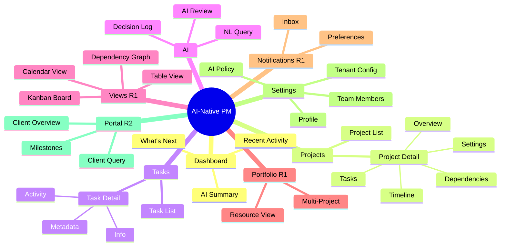
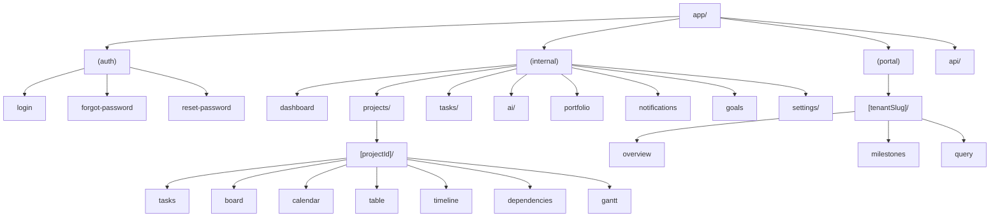
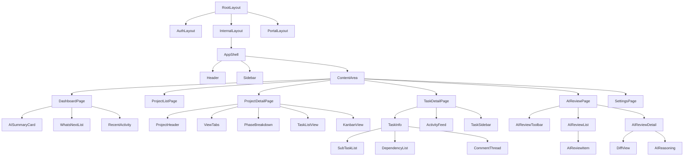
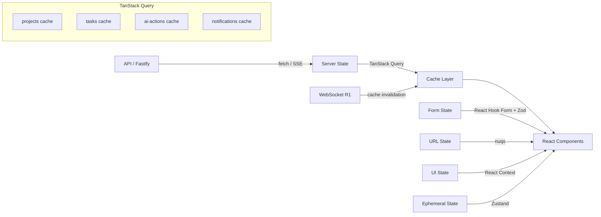
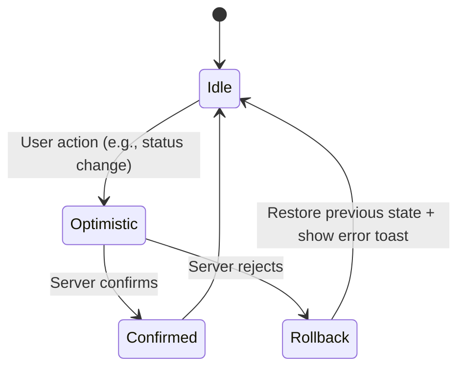
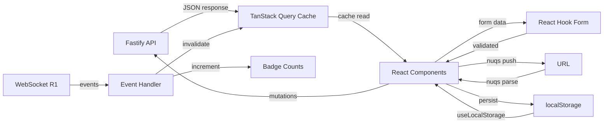

# AI-Native PM Tool — UI/UX Design System & Page Specification

> **Version:** 1.0
> **Date:** February 2026
> **Status:** Draft
> **Aligned to:** Architecture v3.1, Product Roadmap v2.1, Requirements v1.0, Design v1.0
> **Target:** Frontend implementation team — zero design ambiguity

---

## 1. Introduction & Cross-References

### 1.1 Purpose

This document is the complete frontend design specification for the AI-Native PM Tool. It defines every page, component, layout, interaction pattern, and design token required to implement the web application. A frontend engineer should be able to build any screen from this document alone, without consulting a designer.

### 1.2 Tech Stack

| Layer | Technology | Purpose |
|-------|-----------|---------|
| Framework | Next.js 15 App Router | RSC, route groups `(internal)` + `(portal)`, server actions |
| UI Primitives | Shadcn UI | Accessible, unstyled component library |
| Styling | Tailwind CSS v4 | Utility-first, design token enforcement |
| Server State | TanStack Query v5 | Cache, mutations, optimistic updates |
| Forms | React Hook Form + Zod | Validation, schema sharing with backend |
| Drag & Drop | dnd-kit | Kanban, task reordering |
| Command Palette | cmdk | Cmd+K global search and actions |
| Charts | Recharts | Dashboard visualizations |
| URL State | nuqs | Filter/pagination state in URL |
| Virtual Scroll | @tanstack/react-virtual | Long list performance |
| Icons | Lucide React | 16x16 icon system |
| Font | Inter (next/font/google) | System typography |

### 1.3 Cross-Reference Conventions

| Prefix | Source Document | Example |
|--------|----------------|---------|
| **FR-xxx** | requirements.md — Functional Requirements | FR-500 (Task Detail View) |
| **NFR-xxx** | requirements.md — Non-Functional Requirements | NFR-100 (API latency p95 < 500ms) |
| **F-xxx** | roadmap-v2.md — Feature IDs | F-012 (What's Next) |
| **ADR-xxx** | design.md — Architecture Decision Records | ADR-011 (Next.js route groups) |

### 1.4 Release Scope

| Release | UI Pages Delivered |
|---------|-------------------|
| R0 | Dashboard, Project List, Project Detail, Task List, Task Detail, AI Review, NL Query, Settings, Login |
| R1 | Kanban Board, Calendar View, Table View, AI Timeline, Portfolio Dashboard, Notification Inbox, Dependency Graph |
| R2 | Client Portal, Goals/OKR Dashboard, Gantt Chart, Form Builder, Docs Editor |
| R3 | SOW Generator, Coaching Dashboard, Analytics/Benchmarking |

---

## 2. Information Architecture & Navigation

### 2.1 Sitemap



### 2.2 URL Routing Tree (App Router)

```
app/
├── (auth)/
│   ├── login/page.tsx
│   ├── forgot-password/page.tsx
│   └── reset-password/page.tsx
├── (internal)/
│   ├── layout.tsx                    # AppShell: header + sidebar + content
│   ├── dashboard/page.tsx            # What's Next + AI Summary (FR-201)
│   ├── projects/
│   │   ├── page.tsx                  # Project list (FR-501)
│   │   └── [projectId]/
│   │       ├── page.tsx              # Project detail — overview tab (FR-501)
│   │       ├── tasks/page.tsx        # Task list for project (FR-501)
│   │       ├── board/page.tsx        # Kanban view (FR-1900, R1)
│   │       ├── calendar/page.tsx     # Calendar view (FR-2002, R1)
│   │       ├── table/page.tsx        # Table view (FR-2003, R1)
│   │       ├── timeline/page.tsx     # AI timeline (FR-1201, R1)
│   │       ├── dependencies/page.tsx # Dependency graph (FR-1200, R1)
│   │       ├── gantt/page.tsx        # Gantt chart (FR-1202, R2)
│   │       └── settings/page.tsx     # Project settings
│   ├── tasks/
│   │   └── [taskId]/page.tsx         # Task detail (FR-500)
│   ├── ai/
│   │   ├── review/page.tsx           # AI review queue (FR-301)
│   │   └── decisions/page.tsx        # AI decision log (FR-608, R1)
│   ├── portfolio/page.tsx            # Portfolio dashboard (FR-1202, R1)
│   ├── notifications/page.tsx        # Notification inbox (FR-2007, R1)
│   ├── goals/page.tsx                # Goals & OKRs (FR-2006, R2)
│   └── settings/
│       ├── page.tsx                  # Profile settings
│       ├── ai-policy/page.tsx        # Autonomy controls (FR-300)
│       ├── team/page.tsx             # User management
│       └── tenant/page.tsx           # Tenant config (FR-109)
├── (portal)/                         # R2 — Client-facing
│   └── [tenantSlug]/
│       ├── layout.tsx                # Portal shell: simplified header + nav
│       ├── page.tsx                  # Client overview (FR-1301)
│       ├── milestones/page.tsx       # Milestone progress (FR-1301)
│       └── query/page.tsx            # Client NL query (FR-1305)
└── api/                              # BFF routes
    └── [...proxy]/route.ts           # Proxy to Fastify API
```

### 2.3 Route Group Structure



### 2.4 Sidebar Navigation

The sidebar is role-based (FR-502, F-025). Items shown per role:

| Nav Item | Icon | URL | Admin | Developer | PM (R3) | Client (R2) |
|----------|------|-----|-------|-----------|---------|-------------|
| Dashboard | `LayoutDashboard` | `/dashboard` | Yes | Yes | Yes | -- |
| Projects | `FolderKanban` | `/projects` | Yes | Yes | Yes | -- |
| AI Review | `Sparkles` | `/ai/review` | Yes | -- | Yes | -- |
| Portfolio | `BarChart3` | `/portfolio` | Yes | -- | Yes | -- |
| Notifications | `Bell` | `/notifications` | Yes | Yes | Yes | -- |
| Goals | `Target` | `/goals` | Yes | -- | Yes | -- |
| Settings | `Settings` | `/settings` | Yes | -- | -- | -- |

**Badge indicators:**
- AI Review: count of pending proposals (red badge)
- Notifications: count of unread notifications (red badge)

**Sidebar states:**
- Collapsed (56px): icon-only, tooltip on hover
- Expanded (240px): icon + label + badges
- Mobile: hidden by default, hamburger trigger opens as sheet overlay
- State persisted in localStorage via `useLocalStorage` hook

### 2.5 Breadcrumb Strategy

Breadcrumbs follow the URL hierarchy and are always visible in the header bar.

| Page | Breadcrumb |
|------|-----------|
| Dashboard | `Dashboard` |
| Project List | `Projects` |
| Project Detail | `Projects / {Project Name}` |
| Task List (in project) | `Projects / {Project Name} / Tasks` |
| Task Detail | `Projects / {Project Name} / Tasks / {Task Title}` |
| Kanban View | `Projects / {Project Name} / Board` |
| AI Review | `AI Review` |
| Settings | `Settings / {Section}` |

### 2.6 Mobile Bottom Navigation (R0)

On viewports below 768px, a fixed bottom navigation bar replaces the sidebar.

| Item | Icon | Destination |
|------|------|-------------|
| Home | `LayoutDashboard` | `/dashboard` |
| Projects | `FolderKanban` | `/projects` |
| AI | `Sparkles` | `/ai/review` |
| Notifications | `Bell` | `/notifications` |
| More | `Menu` | Sheet with remaining nav items |

- Touch targets: minimum 48x48dp
- Safe area padding for devices with notches
- Current section indicated with filled icon + label

### 2.7 Deep Linking Patterns

Every entity is directly linkable:
- Project: `/projects/{projectId}`
- Task: `/tasks/{taskId}`
- AI Action: `/ai/review?action={actionId}`
- Notification: `/notifications?id={notificationId}`
- NL Query: triggered via `Cmd+K` from any page (no dedicated URL)

---

## 3. Design System & Tokens

### 3.1 Color Palette

All colors are defined as CSS custom properties in `globals.css` and consumed via Tailwind. No hardcoded hex values in components.

#### Semantic Tokens

| Token | Light Mode | Dark Mode | Usage |
|-------|-----------|-----------|-------|
| `--primary` | `#1a1a2e` | `#e0e0ff` | Primary actions, active nav |
| `--primary-foreground` | `#ffffff` | `#1a1a2e` | Text on primary backgrounds |
| `--secondary` | `#f0f0f5` | `#2a2a3e` | Secondary buttons, subtle backgrounds |
| `--secondary-foreground` | `#1a1a2e` | `#e0e0ff` | Text on secondary backgrounds |
| `--success` | `#16a34a` | `#22c55e` | Success states, completed |
| `--error` | `#dc2626` | `#ef4444` | Error states, destructive actions |
| `--warning` | `#d97706` | `#f59e0b` | Warning states, at-risk |
| `--info` | `#2563eb` | `#60a5fa` | Informational states |
| `--background` | `#ffffff` | `#0a0a1a` | Page background |
| `--foreground` | `#1a1a2e` | `#f0f0f5` | Default text |
| `--card` | `#ffffff` | `#141428` | Card backgrounds |
| `--card-foreground` | `#1a1a2e` | `#f0f0f5` | Card text |
| `--popover` | `#ffffff` | `#1a1a2e` | Dropdown/popover backgrounds |
| `--popover-foreground` | `#1a1a2e` | `#f0f0f5` | Popover text |
| `--border` | `#e5e5ef` | `#2a2a3e` | Borders, dividers |
| `--input` | `#e5e5ef` | `#2a2a3e` | Input borders |
| `--ring` | `#1a1a2e` | `#e0e0ff` | Focus rings |
| `--muted` | `#f5f5fa` | `#1a1a2e` | Muted backgrounds |
| `--muted-foreground` | `#6b7280` | `#9ca3af` | Muted/secondary text |

#### AI-Specific Tokens

| Token | Light Mode | Dark Mode | Usage |
|-------|-----------|-----------|-------|
| `--ai-primary` | `#7c3aed` | `#a78bfa` | AI-generated content accent |
| `--ai-secondary` | `#ede9fe` | `#2e1065` | AI content background |
| `--ai-confidence-high` | `#16a34a` | `#22c55e` | Confidence >= 0.8 |
| `--ai-confidence-medium` | `#d97706` | `#f59e0b` | Confidence 0.6 - 0.79 |
| `--ai-confidence-low` | `#dc2626` | `#ef4444` | Confidence < 0.6 |
| `--ai-generated` | `#7c3aed` | `#a78bfa` | Sparkle icon + border for AI content |

#### Priority Tokens

| Token | Light Mode | Dark Mode | Usage |
|-------|-----------|-----------|-------|
| `--priority-critical` | `#dc2626` | `#ef4444` | P0 — Critical |
| `--priority-high` | `#ea580c` | `#f97316` | P1 — High |
| `--priority-medium` | `#d97706` | `#f59e0b` | P2 — Medium |
| `--priority-low` | `#6b7280` | `#9ca3af` | P3 — Low |

#### Status Tokens

| Token | Light Mode | Dark Mode | Usage |
|-------|-----------|-----------|-------|
| `--status-todo` | `#6b7280` | `#9ca3af` | To Do |
| `--status-in-progress` | `#2563eb` | `#60a5fa` | In Progress |
| `--status-review` | `#7c3aed` | `#a78bfa` | In Review |
| `--status-done` | `#16a34a` | `#22c55e` | Done |
| `--status-blocked` | `#dc2626` | `#ef4444` | Blocked |

### 3.2 Typography Scale

All typography uses Inter font loaded via `next/font/google`. The baseline is `text-xs` per CLAUDE.md standards.

| Level | Tailwind Classes | Size | Line Height | Usage |
|-------|-----------------|------|-------------|-------|
| Display | `text-lg font-bold` | 18px | 28px | Page titles only (Dashboard, Project Name) |
| Heading | `text-sm font-semibold` | 14px | 20px | Section headers, card titles |
| Subheading | `text-xs font-semibold` | 12px | 16px | Subsection labels, table headers |
| Body | `text-xs font-normal` | 12px | 16px | All body text, form labels, nav items (baseline) |
| Caption | `text-[10px] font-normal` | 10px | 14px | Timestamps, metadata, helper text |

### 3.3 Spacing System

4px base grid. All spacing uses Tailwind tokens.

| Token | Value | Usage |
|-------|-------|-------|
| `p-1` / `gap-1` | 4px | Tight: icon padding, badge internal |
| `p-2` / `gap-2` | 8px | Standard: input padding, card internal spacing |
| `p-3` / `gap-3` | 12px | Comfortable: section padding |
| `p-4` / `gap-4` | 16px | Generous: page margins, card gaps |
| `p-6` / `gap-6` | 24px | Section separation |
| `p-8` / `gap-8` | 32px | Page-level vertical separation |

### 3.4 Shadows, Borders, Radii

| Token | Value | Usage |
|-------|-------|-------|
| `shadow-sm` | `0 1px 2px rgba(0,0,0,0.05)` | Cards, dropdowns |
| `shadow-md` | `0 4px 6px rgba(0,0,0,0.07)` | Modals, elevated elements |
| `shadow-lg` | `0 10px 15px rgba(0,0,0,0.10)` | Command palette, tooltips |
| `border` | `1px solid var(--border)` | Card borders, input borders |
| `rounded-md` | `6px` | Buttons, inputs, cards |
| `rounded-lg` | `8px` | Modals, large cards |
| `rounded-full` | `9999px` | Avatars, badges |

### 3.5 Icon System

Lucide React icons at 16x16px maximum. Consistent `strokeWidth={1.5}`.

| Category | Icons Used |
|----------|-----------|
| Navigation | `LayoutDashboard`, `FolderKanban`, `Sparkles`, `Bell`, `Settings`, `Target`, `BarChart3`, `Menu` |
| Actions | `Plus`, `Pencil`, `Trash2`, `Check`, `X`, `ChevronDown`, `ChevronRight`, `Search`, `Filter` |
| Status | `Circle`, `CircleDot`, `CheckCircle2`, `AlertCircle`, `Ban`, `Clock` |
| AI | `Sparkles`, `Brain`, `Zap`, `Eye`, `RefreshCw` |
| Task | `GripVertical`, `Link2`, `Paperclip`, `MessageSquare`, `Calendar`, `User` |

### 3.6 Z-Index Layers

| Layer | Z-Index | Elements |
|-------|---------|----------|
| Base | `0` | Page content |
| Sticky | `10` | Sticky table headers, tab bars |
| Sidebar | `20` | Sidebar navigation |
| Header | `30` | Header bar |
| Dropdown | `40` | Dropdowns, popovers, select menus |
| Overlay | `50` | Sheet/drawer overlays |
| Modal | `60` | Modal dialogs |
| Toast | `70` | Toast notifications |
| Command | `80` | Command palette (Cmd+K) |
| Tooltip | `90` | Tooltips |

### 3.7 Animation Tokens

| Token | Duration | Easing | Usage |
|-------|----------|--------|-------|
| `duration-fast` | `150ms` | `ease-out` | Hover states, focus rings, toggles |
| `duration-normal` | `300ms` | `cubic-bezier(0.16, 1, 0.3, 1)` | Sidebar expand/collapse, sheet slide, panel transitions |
| `duration-slow` | `500ms` | `cubic-bezier(0.16, 1, 0.3, 1)` | Page transitions, chart animations |

**Reduced motion:** All animations respect `prefers-reduced-motion: reduce`. When active, durations collapse to `0ms` and transitions use `opacity` only.

```css
@media (prefers-reduced-motion: reduce) {
  *, *::before, *::after {
    animation-duration: 0.01ms !important;
    transition-duration: 0.01ms !important;
  }
}
```

---

## 4. App Shell & Layout System

### 4.1 App Shell Wireframe

```
┌──────────────────────────────────────────────────────────────────┐
│ HEADER BAR (h-12, 48px)                                          │
│ ┌──────┬──────────────────────┬─────────┬──────┬──────┐          │
│ │ Logo │ Breadcrumbs          │ Cmd+K   │ Bell │Avatar│          │
│ │ 32px │                      │ Search  │  16  │ 28px │          │
│ └──────┴──────────────────────┴─────────┴──────┴──────┘          │
├────────┬─────────────────────────────────────────────────────────┤
│SIDEBAR │ CONTENT AREA                                            │
│ 56px   │                                                         │
│ (coll) │  ┌─────────────────────────────────────────────────┐    │
│ 240px  │  │  Page Header (title + actions)                  │    │
│ (exp)  │  ├─────────────────────────────────────────────────┤    │
│        │  │                                                 │    │
│┌──────┐│  │  Page Content                                   │    │
││ icon ││  │                                                 │    │
││ icon ││  │  (scrollable)                                   │    │
││ icon ││  │                                                 │    │
││ icon ││  │                                                 │    │
││ icon ││  │                                                 │    │
││      ││  │                                                 │    │
││      ││  │                                                 │    │
│└──────┘│  └─────────────────────────────────────────────────┘    │
├────────┴─────────────────────────────────────────────────────────┤
│ NL QUERY SLIDE-OUT (when open, overlays right side)              │
│ ┌────────────────────────────────────────┐                       │
│ │ Query Input + Streaming Response       │ width: 480px          │
│ └────────────────────────────────────────┘                       │
└──────────────────────────────────────────────────────────────────┘
```

### 4.2 Layout Variants

| Variant | Structure | Used By |
|---------|-----------|---------|
| **Full-width** | Header + Sidebar + full content area | Dashboard, Project List, Portfolio |
| **Sidebar + Main** | Header + Sidebar + content with page sidebar | Task Detail, Settings |
| **Split Panel** | Header + Sidebar + left list + right detail | AI Review (list + detail panel) |
| **Overlay** | Any layout + slide-out panel on right | NL Query, Notification detail |
| **Auth** | Centered card, no sidebar/header | Login, Forgot Password |

### 4.3 Header Bar Specification

| Element | Position | Size | Behavior |
|---------|----------|------|----------|
| Logo | Left, fixed | 32x32px | Click navigates to `/dashboard` |
| Sidebar Toggle | Left, after logo | 16x16 icon | Toggles sidebar collapsed/expanded |
| Breadcrumbs | Left, after toggle | Auto | Role-aware, clickable segments |
| Search Trigger | Center-right | `w-48` pill | Shows `Cmd+K` hint, click opens command palette |
| Notifications Bell | Right | 16x16 icon | Badge with unread count, click opens `/notifications` |
| User Avatar | Right, last | 28x28 rounded-full | Dropdown: Profile, Theme toggle, Logout |

### 4.4 Sidebar Behavior

**Collapsed (56px):**
- Icons only, centered vertically in 40x40 hit area
- Tooltip on hover showing label
- Active item: `bg-muted` with `text-foreground`
- Inactive: `text-muted-foreground`

**Expanded (240px):**
- Icon + label + optional badge
- Sections: Main, Views (R1), Admin
- Active item: `bg-muted rounded-md` with `text-foreground font-semibold`
- Hover: `text-foreground bg-muted/50`
- Transition: `duration-normal` (300ms spring)

**Mobile (sheet):**
- Hidden by default
- Hamburger icon in header triggers sheet from left
- Full-screen overlay with backdrop blur
- Swipe-to-dismiss supported
- Touch targets: `py-2` minimum

### 4.5 Split Panel Layout Wireframe

```
┌──────────────────────────────────────────────────────────────────┐
│ HEADER BAR                                                       │
├────────┬────────────────────────┬────────────────────────────────┤
│SIDEBAR │ LEFT PANEL (list)      │ RIGHT PANEL (detail)           │
│        │ w-[400px] resizable    │ flex-1                         │
│        │                        │                                │
│        │ ┌────────────────────┐ │ ┌──────────────────────────┐   │
│        │ │ Toolbar / Filters  │ │ │ Detail Header            │   │
│        │ ├────────────────────┤ │ ├──────────────────────────┤   │
│        │ │ Item 1 (selected)  │ │ │                          │   │
│        │ │ Item 2             │ │ │ Detail Content           │   │
│        │ │ Item 3             │ │ │                          │   │
│        │ │ Item 4             │ │ │                          │   │
│        │ │ ...                │ │ │                          │   │
│        │ └────────────────────┘ │ └──────────────────────────┘   │
└────────┴────────────────────────┴────────────────────────────────┘
```

Used by: AI Review page (list of proposals left, detail right), Notification Inbox.

---

## 5. R0 Page Wireframes

### 5.1 Dashboard / "What's Next" (FR-201, F-012)

The default landing page for Developer role. Shows AI-curated prioritized work.

```
┌──────────────────────────────────────────────────────────────────┐
│ Dashboard                                            [Cmd+K]     │
├──────────────────────────────────────────────────────────────────┤
│                                                                  │
│  ┌─────────────────────┐ ┌─────────────────────┐ ┌────────────┐ │
│  │ ✦ AI Summary        │ │ Tasks Due Today     │ │ Blocked    │ │
│  │                     │ │                     │ │            │ │
│  │ "3 tasks completed  │ │      7              │ │     2      │ │
│  │  yesterday. 2 items │ │                     │ │            │ │
│  │  at risk. Focus on  │ │ ↑ 2 from yesterday  │ │ ↓ 1 fewer  │ │
│  │  API integration."  │ │                     │ │            │ │
│  └─────────────────────┘ └─────────────────────┘ └────────────┘ │
│                                                                  │
│  What's Next                                     [View All →]    │
│  ────────────────────────────────────────────────────────────    │
│  ┌──────────────────────────────────────────────────────────┐    │
│  │ 1. ● Implement JWT refresh rotation                      │    │
│  │    Auth Service · P1 High · Due Feb 12                   │    │
│  │    ✦ "Unblocks 3 downstream tasks"        [Start] [View]│    │
│  ├──────────────────────────────────────────────────────────┤    │
│  │ 2. ● Write integration tests for task API                │    │
│  │    Task Module · P2 Medium · Due Feb 13                  │    │
│  │    ✦ "No blockers, dependencies resolved" [Start] [View]│    │
│  ├──────────────────────────────────────────────────────────┤    │
│  │ 3. ○ Review AI-generated WBS for Client X                │    │
│  │    AI Review · P1 High · Due Feb 11                      │    │
│  │    ✦ "Pending your approval since 2h ago" [Review][View]│    │
│  └──────────────────────────────────────────────────────────┘    │
│                                                                  │
│  Recent Activity                                                 │
│  ────────────────────────────────────────────────────────────    │
│  ┌──────────────────────────────────────────────────────────┐    │
│  │ ● Sarah moved "DB schema migration" → Done      2h ago  │    │
│  │ ● AI generated WBS for "Client Portal Redesign" 3h ago  │    │
│  │ ● Mike commented on "API rate limiting"          4h ago  │    │
│  └──────────────────────────────────────────────────────────┘    │
│                                                                  │
└──────────────────────────────────────────────────────────────────┘
```

**Specifications:**
- AI Summary card: `bg-ai-secondary border-ai-primary/20`, sparkle icon indicator
- Summary cards row: 3 cards on desktop, stack vertically on mobile
- What's Next list: ordered by algorithm (FR-201 AC-2) — unblocked first, then due date, then priority
- Each task row: priority badge, project name, due date, AI reasoning (italic, prefixed with sparkle)
- Quick actions: `Start` (transitions to in-progress), `View` (navigates to task detail)
- Recent Activity: chronological, auto-refreshes via polling (R0) or WebSocket (R1)
- Empty state: "No tasks assigned yet. Ask your admin to assign you to a project."

### 5.2 Project List (FR-501, F-024)

```
┌──────────────────────────────────────────────────────────────────┐
│ Projects                                   [+ New Project]       │
├──────────────────────────────────────────────────────────────────┤
│ ┌────────────────────────────────────────────────────┐           │
│ │ [Search projects...]  [Status ▼] [Sort ▼] [⊞][≡]  │           │
│ └────────────────────────────────────────────────────┘           │
│                                                                  │
│  ┌────────────────────────┐  ┌────────────────────────┐          │
│  │ Client Portal Redesign │  │ API Integration v2     │          │
│  │                        │  │                        │          │
│  │ Phase: Development     │  │ Phase: Planning        │          │
│  │ ██████████░░ 67%       │  │ ██░░░░░░░░░░ 15%       │          │
│  │                        │  │                        │          │
│  │ Tasks: 24/36 done      │  │ Tasks: 3/20 done       │          │
│  │ ● 2 blocked  ▲ 1 risk  │  │ ● 0 blocked  ▲ 0 risk  │          │
│  │                        │  │                        │          │
│  │ Updated 2h ago         │  │ Updated 1d ago         │          │
│  └────────────────────────┘  └────────────────────────┘          │
│                                                                  │
│  ┌────────────────────────┐  ┌────────────────────────┐          │
│  │ Data Migration Phase 3 │  │ Internal PM Tool       │          │
│  │                        │  │                        │          │
│  │ Phase: Testing         │  │ Phase: Development     │          │
│  │ █████████████░ 89%     │  │ ████████░░░░ 52%       │          │
│  │                        │  │                        │          │
│  │ Tasks: 16/18 done      │  │ Tasks: 13/25 done      │          │
│  │ ● 1 blocked  ▲ 2 risk  │  │ ● 0 blocked  ▲ 0 risk  │          │
│  │                        │  │                        │          │
│  │ Updated 30m ago        │  │ Updated 5h ago         │          │
│  └────────────────────────┘  └────────────────────────┘          │
│                                                                  │
└──────────────────────────────────────────────────────────────────┘
```

**Specifications:**
- View toggle: grid (cards) or list (table rows) — persisted in localStorage
- Grid: 2 columns on desktop, 1 on mobile
- Card: project name (heading), current phase, progress bar, task counts, blocked/risk indicators, last updated
- Health indicator: green (on track), yellow (at risk), red (blocked items)
- Sort options: Name, Last Updated, Progress, Created Date
- Filter: status (Active, Completed, Archived), assigned to me
- `+ New Project` button opens a modal with NL description input (FR-200)
- Empty state: "No projects yet. Create your first project by describing it in plain English."

### 5.3 Project Detail (FR-501, FR-102)

```
┌──────────────────────────────────────────────────────────────────┐
│ Projects / Client Portal Redesign                    [⚙ Settings]│
├──────────────────────────────────────────────────────────────────┤
│ ┌──────────────────────────────────────────────────────────────┐ │
│ │ [Overview] [Tasks] [Board▿] [Calendar▿] [Timeline▿] [Deps▿] │ │
│ └──────────────────────────────────────────────────────────────┘ │
│                                                                  │
│  Overview Tab:                                                   │
│  ┌─────────────────────┐ ┌─────────────────────────────────────┐ │
│  │ Project Health       │ │ ✦ AI Summary                       │ │
│  │                     │ │                                     │ │
│  │ ████████░░ 67%      │ │ "On track for Phase 2 completion.  │ │
│  │ Status: Active      │ │  2 tasks blocked on API review.    │ │
│  │ Phase: Development  │ │  Recommend prioritizing auth."     │ │
│  │ Due: March 15, 2026 │ │                                     │ │
│  │ Owner: Admin        │ │ Generated 1h ago                    │ │
│  └─────────────────────┘ └─────────────────────────────────────┘ │
│                                                                  │
│  Phase Breakdown                                                 │
│  ────────────────────────────────────────────────────────────    │
│  ┌──────────────────────────────────────────────────────────┐    │
│  │ Phase 1: Planning          ████████████████ 100%  ✓ Done │    │
│  │ Phase 2: Design            ████████████░░░░  75%  Active │    │
│  │ Phase 3: Development       ████░░░░░░░░░░░░  25%  Active │    │
│  │ Phase 4: Testing           ░░░░░░░░░░░░░░░░   0%  --    │    │
│  │ Phase 5: Deployment        ░░░░░░░░░░░░░░░░   0%  --    │    │
│  └──────────────────────────────────────────────────────────┘    │
│                                                                  │
│  Key Metrics                                                     │
│  ┌──────────┐ ┌──────────┐ ┌──────────┐ ┌──────────┐           │
│  │ Total    │ │ Done     │ │ Blocked  │ │ At Risk  │           │
│  │    36    │ │    24    │ │     2    │ │     1    │           │
│  └──────────┘ └──────────┘ └──────────┘ └──────────┘           │
│                                                                  │
└──────────────────────────────────────────────────────────────────┘
```

**Specifications:**
- Tab navigation: Overview (default), Tasks, Board (R1), Calendar (R1), Timeline (R1), Dependencies (R1)
- R1+ tabs show a down-caret and are grayed out / hidden in R0
- Overview: project health summary, AI summary card, phase breakdown with progress bars, key metrics
- AI Summary card: `bg-ai-secondary`, sparkle icon, generated timestamp
- Phase breakdown: horizontal progress bars, status badge, clickable to filter tasks by phase
- Metrics: 4-column stat cards on desktop, 2x2 grid on mobile

### 5.4 Task Detail (FR-500, F-023)

```
┌──────────────────────────────────────────────────────────────────┐
│ Projects / Client Portal / Tasks / Implement JWT refresh         │
├──────────────────────────────────────────────────────────────────┤
│ ┌───────────────────────────────┬──────────────┬────────────────┐│
│ │ TASK INFO (flex-1)            │ ACTIVITY     │ SIDEBAR (w-64) ││
│ │                               │ FEED (w-80)  │                ││
│ │ Implement JWT refresh rotation│              │ Status         ││
│ │ ─────────────────────────     │ ┌──────────┐ │ [In Progress ▼]││
│ │                               │ │Sarah     │ │                ││
│ │ Description:                  │ │changed   │ │ Priority       ││
│ │ Implement automatic JWT       │ │status to │ │ [● High     ▼] ││
│ │ refresh token rotation to     │ │In Prog   │ │                ││
│ │ prevent session expiry        │ │2h ago    │ │ Assignees      ││
│ │ during active usage.          │ │          │ │ [👤 Sarah    ] ││
│ │                               │ ├──────────┤ │ [+ Add       ] ││
│ │ ✦ AI Context                  │ │Admin set │ │                ││
│ │ "This task unblocks           │ │priority  │ │ Due Date       ││
│ │  3 downstream tasks:          │ │to High   │ │ [Feb 12, 2026] ││
│ │  API middleware, session      │ │3h ago    │ │                ││
│ │  tests, and portal auth."     │ │          │ │ Phase          ││
│ │                               │ ├──────────┤ │ [Development ▼]││
│ │ Sub-tasks          [+ Add]    │ │AI gen'd  │ │                ││
│ │ ┌────────────────────────┐    │ │WBS incl  │ │ Effort         ││
│ │ │ ☑ Design token schema  │    │ │this task │ │ Est: 8h        ││
│ │ │ ☐ Implement rotation   │    │ │1d ago    │ │ Act: 3h        ││
│ │ │ ☐ Write tests          │    │ │          │ │                ││
│ │ └────────────────────────┘    │ └──────────┘ │ Tags           ││
│ │                               │              │ [auth] [api]   ││
│ │ Dependencies                  │              │                ││
│ │ ┌────────────────────────┐    │              │ Checklist 2/5  ││
│ │ │ ← Blocks:              │    │              │ ██████░░░░ 40% ││
│ │ │   API middleware setup  │    │              │                ││
│ │ │   Session mgmt tests   │    │              │ ✦ AI Generated ││
│ │ │   Portal auth flow     │    │              │ Confidence: 87%││
│ │ │ → Blocked by:          │    │              │                ││
│ │ │   (none — unblocked)   │    │              │                ││
│ │ └────────────────────────┘    │              │                ││
│ │                               │              │                ││
│ │ Comments              [+ Add] │              │                ││
│ │ ┌────────────────────────┐    │              │                ││
│ │ │ Mike · 2h ago          │    │              │                ││
│ │ │ Should we use sliding  │    │              │                ││
│ │ │ window or fixed expiry?│    │              │                ││
│ │ ├────────────────────────┤    │              │                ││
│ │ │ Sarah · 1h ago         │    │              │                ││
│ │ │ Sliding window per     │    │              │                ││
│ │ │ ADR-011 recommendation │    │              │                ││
│ │ └────────────────────────┘    │              │                ││
│ └───────────────────────────────┴──────────────┴────────────────┘│
└──────────────────────────────────────────────────────────────────┘
```

**Specifications:**
- 3-column layout on desktop: task info (flex-1) + activity feed (w-80) + metadata sidebar (w-64)
- On tablet (768px): activity feed collapses into a tab within task info
- On mobile (< 768px): single column, metadata as collapsible section at top
- Task info: title (display), description (markdown rendered), AI context (sparkle-bordered card), sub-tasks, dependencies, comments
- Activity feed: chronological audit log (FR-108), scrollable, each entry shows actor + action + timestamp
- Sidebar metadata: status dropdown, priority dropdown, assignees (avatar + name), due date picker, phase select, effort estimate/actual, tags, checklist progress, AI generation indicator
- Dependencies: two sections (blocks / blocked-by) with clickable task links
- Comments: chronological, author avatar + name + timestamp, markdown support, `+ Add` opens inline editor
- AI-generated content: bordered with `border-ai-primary/20`, sparkle icon, confidence badge

### 5.5 Task List (FR-501, F-024)

```
┌──────────────────────────────────────────────────────────────────┐
│ Projects / Client Portal / Tasks               [+ New Task]      │
├──────────────────────────────────────────────────────────────────┤
│ ┌──────────────────────────────────────────────────────────────┐ │
│ │ [Search...] [Status ▼] [Priority ▼] [Assignee ▼] [Phase ▼]  │ │
│ │ [Clear filters]                            Showing 36 tasks  │ │
│ └──────────────────────────────────────────────────────────────┘ │
│                                                                  │
│ ┌────┬────────────────────────┬────────┬──────┬────────┬───────┐ │
│ │    │ Title                  │ Status │ Pri  │ Assign │ Due   │ │
│ ├────┼────────────────────────┼────────┼──────┼────────┼───────┤ │
│ │ ☐  │ Implement JWT refresh  │[InProg]│ ● H  │ 👤 SL  │ Feb12 │ │
│ │ ☐  │ Design token schema    │[Todo  ]│ ● M  │ 👤 MK  │ Feb13 │ │
│ │ ☐  │ API middleware setup   │[Blckd ]│ ● H  │ 👤 SL  │ Feb14 │ │
│ │ ☐  │ Session mgmt tests     │[Todo  ]│ ● M  │ 👤 AJ  │ Feb15 │ │
│ │ ☐  │ Portal auth flow       │[Todo  ]│ ● H  │ --     │ Feb18 │ │
│ │ ☐  │ User profile page      │[Done  ]│ ● L  │ 👤 MK  │ Feb10 │ │
│ │ ☐  │ Dashboard layout        │[Review]│ ● M  │ 👤 AJ  │ Feb11 │ │
│ └────┴────────────────────────┴────────┴──────┴────────┴───────┘ │
│                                                                  │
│ ┌──────────────────────────────────────────────────────────────┐ │
│ │ ← Previous                           Page 1 of 2    Next → │ │
│ └──────────────────────────────────────────────────────────────┘ │
└──────────────────────────────────────────────────────────────────┘
```

**Specifications:**
- Filterable/sortable table with inline status toggle (click status badge to cycle)
- Columns: checkbox (bulk select), title (clickable link to detail), status (badge), priority (colored dot), assignee (avatar), due date
- Sort: click column header to sort ascending/descending
- Filters: multi-select dropdowns for status, priority, assignee, phase
- Bulk actions (when checkboxes selected): Change Status, Change Priority, Assign, Delete
- Pagination: cursor-based, 50 items per page
- Blocked tasks: row has subtle red-tinted background
- `+ New Task` opens inline creation row at top of table or modal

### 5.6 AI Review Panel (FR-301, F-016)

```
┌──────────────────────────────────────────────────────────────────┐
│ AI Review                    [Approve All] [Reject All] [Filter]│
├──────────────────────────┬───────────────────────────────────────┤
│ PROPOSALS LIST (w-[400px])│ PROPOSAL DETAIL                      │
│                          │                                       │
│ Pending (12)   All (47)  │ WBS Generation — Client Portal v2    │
│                          │ ─────────────────────────────────     │
│ ┌──────────────────────┐ │                                       │
│ │ ✦ WBS Generation     │ │ Confidence: [████████░░] 85%         │
│ │ Client Portal v2     │ │ Type: WBS Generation                 │
│ │ Confidence: 85% 🟢   │ │ Created: 2h ago                      │
│ │ 2h ago    [→]        │ │                                       │
│ ├──────────────────────┤ │ ✦ AI Reasoning:                      │
│ │ ✦ Reprioritization   │ │ "Based on the project description    │
│ │ Auth service tasks   │ │  and similar past projects, I've     │
│ │ Confidence: 72% 🟡   │ │  generated a 5-phase WBS with 36    │
│ │ 3h ago    [→]        │ │  tasks and 12 dependencies."         │
│ ├──────────────────────┤ │                                       │
│ │ ✦ Status Report      │ │ Proposed Changes:                    │
│ │ Weekly summary draft  │ │ ┌─────────────────────────────────┐ │
│ │ Confidence: 91% 🟢   │ │ │ + Phase 1: Planning (3 tasks)   │ │
│ │ 4h ago    [→]        │ │ │ + Phase 2: Design (7 tasks)     │ │
│ ├──────────────────────┤ │ │ + Phase 3: Development (14)     │ │
│ │ ✦ Risk Alert         │ │ │ + Phase 4: Testing (8 tasks)    │ │
│ │ Timeline delay risk  │ │ │ + Phase 5: Deployment (4 tasks) │ │
│ │ Confidence: 58% 🔴   │ │ │                                 │ │
│ │ 5h ago    [→]        │ │ │ Dependencies: 12 relationships  │ │
│ └──────────────────────┘ │ │ Est. duration: 8 weeks           │ │
│                          │ └─────────────────────────────────┘ │
│ Keyboard: j/k navigate   │                                       │
│ a=approve r=reject e=edit│ [✓ Approve] [✎ Edit] [✕ Reject]      │
│                          │                                       │
└──────────────────────────┴───────────────────────────────────────┘
```

**Specifications:**
- Split panel: proposal list (left, w-[400px]) + detail view (right, flex-1)
- List items: AI capability type icon, title, confidence badge (color-coded), timestamp
- Confidence badges: green (>= 0.8), yellow (0.6-0.79), red (< 0.6)
- Detail view: confidence meter, type, timestamp, AI reasoning (sparkle card), proposed changes (diff view), action buttons
- Bulk actions in toolbar: Approve All Pending, Reject All, Filter by type/confidence
- Keyboard shortcuts: `j/k` navigate list, `a` approve, `r` reject, `e` edit, `Enter` open detail
- Virtualized list for performance (up to 50 items scannable in 30 seconds per FR-301)
- Filter by: capability type (WBS, Reprioritization, Summary, Risk, Nudge), confidence level, status

### 5.7 NL Query Slide-Out (FR-203, F-014)

```
┌──────────────────────────────────────────────────────────────────┐
│                              │ NL Query                    [✕]   │
│                              │                                   │
│    (current page content     │ ┌───────────────────────────────┐ │
│     remains visible but      │ │ Ask anything about your       │ │
│     dimmed behind overlay)   │ │ projects...                   │ │
│                              │ └───────────────────────────────┘ │
│                              │                                   │
│                              │ Suggested:                        │
│                              │ • "What's blocked right now?"     │
│                              │ • "What did the team ship today?" │
│                              │ • "How is Client Portal tracking?"│
│                              │                                   │
│                              │ ─── Recent Queries ───            │
│                              │                                   │
│                              │ Q: "What's blocked right now?"    │
│                              │ ┌───────────────────────────────┐ │
│                              │ │ ✦ 2 tasks are currently       │ │
│                              │ │ blocked:                      │ │
│                              │ │                               │ │
│                              │ │ 1. **API middleware setup**    │ │
│                              │ │    Blocked by: JWT refresh    │ │
│                              │ │    (assigned to Sarah)        │ │
│                              │ │                               │ │
│                              │ │ 2. **Session mgmt tests**     │ │
│                              │ │    Blocked by: JWT refresh    │ │
│                              │ │    (assigned to Sarah)        │ │
│                              │ │                               │ │
│                              │ │ Confidence: 94%               │ │
│                              │ │ Sources: 3 tasks referenced   │ │
│                              │ └───────────────────────────────┘ │
│                              │                                   │
│                              │ ┌───────────────────────────────┐ │
│                              │ │ [Type your question...]   [→] │ │
│                              │ └───────────────────────────────┘ │
└──────────────────────────────────────────────────────────────────┘
```

**Specifications:**
- Slide-out panel from right, width 480px on desktop, full-width on mobile
- Triggered by `Cmd/Ctrl+K` from any page (global shortcut)
- Text input at bottom with submit button
- Streaming response: typewriter effect via SSE (tokens appear as they arrive)
- Response includes: answer text (markdown), source references (linked task/project names), confidence indicator
- Query history: last 20 queries per user, stored client-side in localStorage
- Suggested queries shown when panel is empty (FR-203 AC-1)
- Escape key or click outside to dismiss
- Backdrop: semi-transparent overlay on left portion

### 5.8 Settings / AI Policy (FR-300, F-015)

```
┌──────────────────────────────────────────────────────────────────┐
│ Settings / AI Policy                                             │
├──────────────────────────────────────────────────────────────────┤
│ ┌──────────┐                                                     │
│ │ Profile  │                                                     │
│ │[AI Policy]│                                                    │
│ │ Team     │  AI Autonomy Controls                               │
│ │ Tenant   │  ────────────────────────────────────────────────   │
│ └──────────┘                                                     │
│               Global Mode: [Shadow ▼] [Propose ▼] [Execute ▼]   │
│               Current: Propose (AI suggests, human approves)     │
│                                                                  │
│  Per-Action Overrides                                            │
│  ┌────────────────────┬──────────┬──────────────────────────┐    │
│  │ Action Type        │ Mode     │ Confidence Threshold     │    │
│  ├────────────────────┼──────────┼──────────────────────────┤    │
│  │ WBS Generation     │[Propose▼]│ [0.80 ▼]                │    │
│  │ Task Reprioritize  │[Propose▼]│ [0.70 ▼]                │    │
│  │ Status Reports     │[Execute▼]│ [0.85 ▼]                │    │
│  │ Risk Alerts        │[Propose▼]│ [0.60 ▼]                │    │
│  │ Nudge Developers   │[Shadow ▼]│ [0.75 ▼]                │    │
│  │ Scope Creep Alert  │[Propose▼]│ [0.70 ▼]                │    │
│  └────────────────────┴──────────┴──────────────────────────┘    │
│                                                                  │
│  Quiet Hours                                                     │
│  ┌──────────────────────────────────────────────────────────┐    │
│  │ Enable quiet hours: [✓]                                  │    │
│  │ No AI nudges between: [20:00] and [08:00]                │    │
│  │ Timezone: [America/New_York ▼]                            │    │
│  └──────────────────────────────────────────────────────────┘    │
│                                                                  │
│  Nudge Limits                                                    │
│  ┌──────────────────────────────────────────────────────────┐    │
│  │ Max nudges per task per day: [2]                          │    │
│  │ Max nudges per developer per day: [5]                     │    │
│  └──────────────────────────────────────────────────────────┘    │
│                                                                  │
│                                              [Save Changes]      │
└──────────────────────────────────────────────────────────────────┘
```

**Specifications:**
- Left sub-navigation: Profile, AI Policy, Team, Tenant Config
- Global mode: radio button group for Shadow / Propose / Execute
- Per-action table: action type, mode dropdown, confidence threshold slider/dropdown
- Quiet hours: toggle + time range picker + timezone select
- Nudge limits: numeric inputs with min/max validation
- Form validation: React Hook Form + Zod
- Save triggers `PUT /api/v1/ai/policy` and shows success toast

### 5.9 Login (FR-103, F-004)

```
┌──────────────────────────────────────────────────────────────────┐
│                                                                  │
│                                                                  │
│                                                                  │
│              ┌──────────────────────────────────┐                │
│              │                                  │                │
│              │         [Logo — 48x48]           │                │
│              │      AI-Native PM Tool           │                │
│              │                                  │                │
│              │  Email                           │                │
│              │  ┌──────────────────────────┐    │                │
│              │  │ you@company.com          │    │                │
│              │  └──────────────────────────┘    │                │
│              │                                  │                │
│              │  Password                        │                │
│              │  ┌──────────────────────────┐    │                │
│              │  │ ••••••••            [👁]  │    │                │
│              │  └──────────────────────────┘    │                │
│              │                                  │                │
│              │  [        Sign In            ]   │                │
│              │                                  │                │
│              │  Forgot password?                │                │
│              │                                  │                │
│              │  ─── or ───                      │                │
│              │                                  │                │
│              │  [  Sign in with Google     ]    │                │
│              │  [  Sign in with Microsoft  ]    │                │
│              │                                  │                │
│              └──────────────────────────────────┘                │
│                                                                  │
│                                                                  │
└──────────────────────────────────────────────────────────────────┘
```

**Specifications:**
- Centered card layout, no sidebar/header (Auth layout variant)
- Card: `max-w-sm mx-auto`, `shadow-md`, `rounded-lg`
- Email input: `type="email"`, required, validated
- Password input: `type="password"`, show/hide toggle, required
- Sign In button: primary style, full-width, loading state during auth
- Forgot Password: text link navigating to `/forgot-password`
- SSO buttons: R1 — Google and Microsoft, shown only if tenant has SSO configured
- Error: inline below the form ("Invalid email or password")
- On success: redirect to `/dashboard`
- Form: React Hook Form + Zod validation

---

## 6. R1 Page Wireframes

### 6.1 Kanban Board (FR-1900, F-087)

```
┌──────────────────────────────────────────────────────────────────┐
│ Projects / Client Portal / Board                                 │
├──────────────────────────────────────────────────────────────────┤
│ [Filter ▼] [Group by: Status ▼]                  [Collapse All]  │
│                                                                  │
│ ┌──────────────┐ ┌──────────────┐ ┌──────────────┐ ┌──────────┐ │
│ │ TO DO (8)    │ │ IN PROG (5)  │ │ REVIEW (3)   │ │ DONE (24)│ │
│ │              │ │              │ │              │ │          │ │
│ │┌────────────┐│ │┌────────────┐│ │┌────────────┐│ │┌────────┐│ │
│ ││Design token││ ││JWT refresh ││ ││Dashboard   ││ ││User    ││ │
│ ││schema      ││ ││rotation    ││ ││layout      ││ ││profile ││ │
│ ││● Med  👤MK ││ ││● High 👤SL ││ ││● Med  👤AJ ││ ││✓      ││ │
│ ││Feb 13      ││ ││Feb 12      ││ ││Feb 11      ││ ││       ││ │
│ ││            ││ ││✦ AI ranked ││ ││            ││ ││       ││ │
│ │├────────────┤│ │├────────────┤│ │└────────────┘│ │├────────┤│ │
│ ││Session mgmt││ ││Portal auth ││ │              │ ││...     ││ │
│ ││tests       ││ ││flow        ││ │              │ ││       ││ │
│ ││● Med  👤AJ ││ ││● High 👤-- ││ │              │ ││       ││ │
│ ││Feb 15      ││ ││Feb 18      ││ │              │ │└────────┘│ │
│ ││⚠ BLOCKED   ││ ││            ││ │              │ │          │ │
│ │└────────────┘│ │└────────────┘│ │              │ │          │ │
│ │              │ │              │ │              │ │          │ │
│ └──────────────┘ └──────────────┘ └──────────────┘ └──────────┘ │
│                                                                  │
│ R1: Read-only. Drag-and-drop status change deferred to R2.       │
└──────────────────────────────────────────────────────────────────┘
```

**Specifications:**
- Columns by status: To Do, In Progress, Review, Done (configurable in R1+)
- Cards: title, priority badge (colored dot), assignee avatar, due date, AI annotation (sparkle icon if AI-ranked), blocked indicator
- R1 is read-only (FR-1900) — no drag-and-drop. R2 adds dnd-kit for status changes.
- Horizontal scroll when columns overflow viewport
- Column header: status label + task count
- Blocked tasks: red left-border on card, `BLOCKED` badge
- Filter bar: same filters as task list (status, priority, assignee, phase)

### 6.2 Calendar View (FR-2002, F-091)

```
┌──────────────────────────────────────────────────────────────────┐
│ Projects / Client Portal / Calendar                              │
├──────────────────────────────────────────────────────────────────┤
│ [◀ January 2026]  [Today]  [February 2026 ▶]    [Month][Week]   │
│                                                                  │
│ ┌────┬──────┬──────┬──────┬──────┬──────┬────┐                   │
│ │Sun │ Mon  │ Tue  │ Wed  │ Thu  │ Fri  │Sat │                   │
│ ├────┼──────┼──────┼──────┼──────┼──────┼────┤                   │
│ │    │      │      │      │      │      │    │                   │
│ │ 1  │  2   │  3   │  4   │  5   │  6   │ 7  │                   │
│ │    │      │      │      │      │      │    │                   │
│ ├────┼──────┼──────┼──────┼──────┼──────┼────┤                   │
│ │    │      │      │ ●JWT │      │      │    │                   │
│ │ 8  │  9   │ 10   │ 11   │ 12   │ 13   │ 14 │                   │
│ │    │      │ ●Dash│ ●Dash│ ●JWT │ ●Tok │    │                   │
│ │    │      │      │      │      │      │    │                   │
│ ├────┼──────┼──────┼──────┼──────┼──────┼────┤                   │
│ │    │      │      │      │      │      │    │                   │
│ │ 15 │ 16   │ 17   │ 18   │ 19   │ 20   │ 21 │                   │
│ │    │ ●Sess│      │●Port │      │      │    │                   │
│ │    │      │      │      │      │      │    │                   │
│ └────┴──────┴──────┴──────┴──────┴──────┴────┘                   │
│                                                                  │
│ ● = task chip (colored by priority: red/orange/yellow/gray)      │
│ Click chip → opens task detail. Drag chip → reschedule due date. │
│ Tasks without due dates: "8 tasks have no due date" indicator    │
└──────────────────────────────────────────────────────────────────┘
```

**Specifications:**
- Month view (default) and week view toggle
- Tasks rendered as small colored chips on their due date cell
- Chip color: priority-based (critical=red, high=orange, medium=yellow, low=gray)
- Click chip: opens task detail in modal or navigates to task detail page
- Drag chip: reschedule by moving to a different date cell
- Tasks without due dates: count indicator below calendar
- Navigation: prev/next month arrows, Today button
- Mobile: week view only, horizontal scroll for days

### 6.3 Table View (FR-2003, F-092)

```
┌──────────────────────────────────────────────────────────────────┐
│ Projects / Client Portal / Table                   [+ Column]    │
├──────────────────────────────────────────────────────────────────┤
│ ┌──────────────────────────────────────────────────────────────┐ │
│ │Title         │Status    │Priority│Assignee│Due   │Phase│Effo│ │
│ ├──────────────┼──────────┼────────┼────────┼──────┼─────┼────┤ │
│ │JWT refresh   │[InProg ▼]│[●Hi  ▼]│[👤SL▼] │Feb12 │Dev  │ 8h │ │
│ │Design token  │[Todo   ▼]│[●Med ▼]│[👤MK▼] │Feb13 │Dev  │ 4h │ │
│ │API middleware│[Blckd  ▼]│[●Hi  ▼]│[👤SL▼] │Feb14 │Dev  │ 6h │ │
│ │Session tests │[Todo   ▼]│[●Med ▼]│[👤AJ▼] │Feb15 │Test │ 5h │ │
│ │Portal auth   │[Todo   ▼]│[●Hi  ▼]│[-- ▼]  │Feb18 │Dev  │10h │ │
│ │Dashboard     │[Review ▼]│[●Med ▼]│[👤AJ▼] │Feb11 │Dev  │ 3h │ │
│ │User profile  │[Done   ▼]│[●Lo  ▼]│[👤MK▼] │Feb10 │Dev  │ 2h │ │
│ └──────────────┴──────────┴────────┴────────┴──────┴─────┴────┘ │
│                                                                  │
│ All cells are inline-editable. Click to edit, Tab to next cell.  │
│ Columns: resize handles, drag to reorder, right-click to hide.   │
│ [Save as View ▼]  Named views: [Default] [My Tasks] [Blocked]   │
└──────────────────────────────────────────────────────────────────┘
```

**Specifications:**
- Spreadsheet-like interface with inline editing
- All fields editable in-place: dropdowns for status/priority/assignee/phase, date picker for due, text input for effort
- Column operations: resize (drag handle), reorder (drag header), show/hide (right-click menu or `+ Column`)
- Sort: click column header (ascending/descending/none cycle)
- Saved views: name + filter + column config + sort, stored per user per tenant
- Tab key moves focus between cells
- Virtual scrolling for large datasets (100+ rows)

### 6.4 AI-Annotated Timeline (FR-1201, F-052)

```
┌──────────────────────────────────────────────────────────────────┐
│ Projects / Client Portal / Timeline                              │
├──────────────────────────────────────────────────────────────────┤
│              Feb          Mar          Apr          May           │
│              |            |            |            |             │
│ Planning     ████████████                                        │
│              ✓ Complete                                           │
│                                                                  │
│ Design       ░░░░████████████░░                                  │
│              ⚠ 3 days behind    ← AI prediction overlay          │
│                                                                  │
│ Development       ░░░░████████████████████░░░░                   │
│                   ▲ Risk: dependency on Auth   ← AI risk flag    │
│                                                                  │
│ Testing                         ░░░░░░████████████               │
│                                 ◆ Milestone: Beta                │
│                                                                  │
│ Deployment                                    ░░░░████           │
│                                               ◆ Launch           │
│                                                                  │
│ Legend: ████ = actual  ░░░░ = planned  ⚠ = delay  ▲ = risk      │
│         ◆ = milestone                                            │
│                                                                  │
│ ✦ AI Insight: "Design phase is trending 3 days late due to      │
│   extended review cycles. Recommend parallelizing remaining      │
│   design tasks with early development tasks."                    │
└──────────────────────────────────────────────────────────────────┘
```

**Specifications:**
- Horizontal timeline with time axis (months/weeks)
- Bars per phase: planned (lighter) vs actual (solid)
- AI overlays: predicted delay markers (warning icon), risk flags (triangle), milestone diamonds
- AI insight card at bottom: summary of timeline health with recommendations
- Zoom: month view (default), week view
- Click phase bar: expands to show individual tasks within that phase
- SVG-based rendering for smooth zoom/pan

### 6.5 Portfolio Dashboard (FR-1202, F-053)

```
┌──────────────────────────────────────────────────────────────────┐
│ Portfolio                                                        │
├──────────────────────────────────────────────────────────────────┤
│                                                                  │
│ ┌─────────────────────┐ ┌─────────────────────┐ ┌─────────────┐ │
│ │ Active Projects     │ │ At Risk             │ │ AI Actions  │ │
│ │       4             │ │       1             │ │    12 pend  │ │
│ └─────────────────────┘ └─────────────────────┘ └─────────────┘ │
│                                                                  │
│ ┌──────────────────────────────────────────────────────────────┐ │
│ │ Project              │ Health │ Progress │ Blocked │ Risk    │ │
│ ├──────────────────────┼────────┼──────────┼─────────┼─────────┤ │
│ │ Client Portal        │ 🟡     │ ███░ 67% │    2    │  High   │ │
│ │ API Integration      │ 🟢     │ █░░░ 15% │    0    │  Low    │ │
│ │ Data Migration       │ 🟢     │ ████ 89% │    1    │  Med    │ │
│ │ Internal PM Tool     │ 🟢     │ ██░░ 52% │    0    │  Low    │ │
│ └──────────────────────┴────────┴──────────┴─────────┴─────────┘ │
│                                                                  │
│ ✦ AI Portfolio Summary                                           │
│ "Portfolio is healthy overall. Client Portal has 2 blocked tasks │
│  that need attention — both are waiting on JWT refresh. Data     │
│  Migration is on track for early completion."                    │
│                                                                  │
│ Resource Allocation                                              │
│ ┌──────────────────────────────────────────────────────────────┐ │
│ │ Sarah: ████████████████░░░░ 80% (4 tasks across 2 projects) │ │
│ │ Mike:  ████████████░░░░░░░░ 60% (3 tasks across 2 projects) │ │
│ │ Alex:  ██████░░░░░░░░░░░░░░ 30% (2 tasks, 1 project)       │ │
│ └──────────────────────────────────────────────────────────────┘ │
└──────────────────────────────────────────────────────────────────┘
```

### 6.6 Notification Inbox (FR-2007, F-096)

```
┌──────────────────────────────────────────────────────────────────┐
│ Notifications                            [Mark All Read] [⚙]    │
├──────────────────────────────────────────────────────────────────┤
│ [All] [AI Actions] [Mentions] [Updates] [Assignments]            │
│                                                                  │
│ Today                                                            │
│ ┌──────────────────────────────────────────────────────────────┐ │
│ │ ● ✦ AI generated WBS for "Client Portal v2"        2h ago  │ │
│ │   Pending your review. Confidence: 85%              [View]  │ │
│ ├──────────────────────────────────────────────────────────────┤ │
│ │ ● @Mike mentioned you in "API rate limiting"        3h ago  │ │
│ │   "Should we use sliding window or fixed expiry?"   [View]  │ │
│ ├──────────────────────────────────────────────────────────────┤ │
│ │ ○ Sarah moved "DB schema migration" to Done          4h ago  │ │
│ │   In project: Data Migration Phase 3                [View]  │ │
│ └──────────────────────────────────────────────────────────────┘ │
│                                                                  │
│ Yesterday                                                        │
│ ┌──────────────────────────────────────────────────────────────┐ │
│ │ ○ You were assigned to "Portal auth flow"            1d ago  │ │
│ │   Priority: High · Due: Feb 18                      [View]  │ │
│ ├──────────────────────────────────────────────────────────────┤ │
│ │ ○ ✦ AI risk prediction: Client Portal timeline      1d ago  │ │
│ │   Low confidence (58%). Review recommended.         [View]  │ │
│ └──────────────────────────────────────────────────────────────┘ │
│                                                                  │
│ ● = unread  ○ = read  ✦ = AI-generated                          │
└──────────────────────────────────────────────────────────────────┘
```

### 6.7 Dependency Graph (FR-1200, F-051)

```
┌──────────────────────────────────────────────────────────────────┐
│ Projects / Client Portal / Dependencies                          │
├──────────────────────────────────────────────────────────────────┤
│ [Zoom +][-][Fit] [Highlight: Critical Path]       [From task ▼]  │
│                                                                  │
│     ┌──────────┐     ┌──────────┐     ┌──────────┐              │
│     │ DB Schema│────→│ JWT      │────→│ API Mid  │              │
│     │ ✓ Done   │     │ ● InProg │     │ ⊘ Blocked│              │
│     └──────────┘     └────┬─────┘     └──────────┘              │
│                           │                                      │
│                           │           ┌──────────┐              │
│                           └──────────→│ Session  │              │
│                                       │ ○ Todo   │              │
│                                       └────┬─────┘              │
│                                            │                     │
│                                       ┌────▼─────┐              │
│                                       │ Portal   │              │
│                                       │ Auth     │              │
│                                       │ ○ Todo   │              │
│                                       └──────────┘              │
│                                                                  │
│ ═══ Critical Path (highlighted in red)                           │
│ ─── Normal dependency                                            │
│                                                                  │
│ ✦ AI: "JWT refresh is the bottleneck. Completing it unblocks    │
│   3 tasks and reduces critical path by 5 days."                  │
└──────────────────────────────────────────────────────────────────┘
```

**Specifications:**
- DAG layout using reactflow or d3-dag
- Nodes: task name + status icon + assignee
- Edges: arrows showing dependency direction (blocked-by → blocks)
- Critical path: highlighted edges in red/bold
- Interactive: click node to open task detail, zoom/pan, fit-to-view
- AI insight card: identifies bottleneck node and impact analysis
- Filter: view from specific task (upstream only, downstream only, or both)

---

## 7. R2-R3 Page Wireframes

### 7.1 Client Portal (FR-1301, F-055, R2)

```
┌──────────────────────────────────────────────────────────────────┐
│ [Client Logo]  Project Portal               [? Help] [👤 Logout]│
├──────────────────────────────────────────────────────────────────┤
│ [Overview] [Milestones] [Ask a Question]                         │
│                                                                  │
│  Welcome, Alex (Acme Corp)                                       │
│                                                                  │
│  Project: Client Portal Redesign                                 │
│  ┌──────────────────────────────────────────────────────────┐    │
│  │ Overall Progress                                         │    │
│  │ ████████████████████░░░░░░░░░░ 67%                       │    │
│  │                                                         │    │
│  │ Status: On Track · Est. Completion: April 15, 2026      │    │
│  └──────────────────────────────────────────────────────────┘    │
│                                                                  │
│  ✦ Latest Update (AI-generated, reviewed by PM)                  │
│  ┌──────────────────────────────────────────────────────────┐    │
│  │ "Phase 2 (Design) is 75% complete. The team completed   │    │
│  │  the token system and component library this week. Phase │    │
│  │  3 (Development) has begun with auth integration. No     │    │
│  │  current blockers affecting your deliverables."          │    │
│  │                                           Feb 10, 2026   │    │
│  └──────────────────────────────────────────────────────────┘    │
│                                                                  │
│  Milestones                                                      │
│  ┌──────────────────────────────────────────────────────────┐    │
│  │ ✓ Phase 1: Planning Complete           Jan 15  ✓ Done   │    │
│  │ ◐ Phase 2: Design Complete             Feb 20  75%      │    │
│  │ ○ Phase 3: Development Complete        Mar 25  25%      │    │
│  │ ○ Phase 4: Testing Complete            Apr 10  0%       │    │
│  │ ○ Phase 5: Launch                      Apr 15  0%       │    │
│  └──────────────────────────────────────────────────────────┘    │
│                                                                  │
└──────────────────────────────────────────────────────────────────┘
```

**Specifications:**
- Simplified layout: no sidebar, top navigation only (Overview, Milestones, Ask a Question)
- Portal shell: client logo (branding from tenant config), simplified header, no internal PM features
- Client data only — consumes projection layer (FR-900), no internal noise visible
- AI-generated update: clearly labeled as AI-generated and PM-reviewed
- Milestones: linear progress with status icons (done, in-progress, upcoming)
- Client NL Query: accessible via "Ask a Question" tab (FR-1305)
- All content filtered through human-in-the-loop approval before client visibility

### 7.2 Goals & OKR Dashboard (FR-2006, F-095, R2)

```
┌──────────────────────────────────────────────────────────────────┐
│ Goals & OKRs                                     [+ New Goal]    │
├──────────────────────────────────────────────────────────────────┤
│                                                                  │
│  Q1 2026 Objectives                                              │
│  ┌──────────────────────────────────────────────────────────┐    │
│  │ ▼ Ship MVP to 3 pilot clients              ██████░░ 65%  │    │
│  │   ├─ KR1: Complete core platform       ████████░░ 80%    │    │
│  │   │  └─ Linked: 12 tasks (8 done)                        │    │
│  │   ├─ KR2: Client portal live           ████░░░░░░ 40%    │    │
│  │   │  └─ Linked: 8 tasks (3 done)                         │    │
│  │   └─ KR3: 3 active pilot clients      ██░░░░░░░░ 20%    │    │
│  │      └─ Linked: 5 tasks (1 done)                         │    │
│  ├──────────────────────────────────────────────────────────┤    │
│  │ ▶ Achieve 90% AI acceptance rate            ████░░░░ 45%  │    │
│  ├──────────────────────────────────────────────────────────┤    │
│  │ ▶ SOC 2 Type I certification                ██████░░ 70%  │    │
│  └──────────────────────────────────────────────────────────┘    │
│                                                                  │
│  ✦ AI: "KR2 (Client Portal) is behind schedule. Consider       │
│     allocating additional resources to unblock portal auth."     │
└──────────────────────────────────────────────────────────────────┘
```

### 7.3 Gantt Chart (FR-1202, F-088, R2)

```
┌──────────────────────────────────────────────────────────────────┐
│ Projects / Client Portal / Gantt                                 │
├──────────────────────────────────────────────────────────────────┤
│ [Zoom +][-][Fit] [Show: Dependencies] [Show: AI Predictions]    │
│                                                                  │
│ Task Name         │ Feb 1    Feb 15    Mar 1    Mar 15   Apr 1   │
│ ──────────────────┼──────────────────────────────────────────    │
│ Planning          │ ████████                                     │
│  ├ Requirements   │ ████                                         │
│  └ Architecture   │     ████                                     │
│ Design            │         ████████████                          │
│  ├ Wireframes     │         ████                                 │
│  ├ Tokens         │             ████                              │
│  └ Components     │             ████████                          │
│ Development       │                     ████████████████          │
│  ├ Auth           │                     ████████░░░░              │
│  │                │                              ⚠ +3d           │
│  ├ API            │                         ████████████          │
│  └ Frontend       │                             ████████████      │
│ Testing           │                                     ████████  │
│ Deploy            │                                         ████  │
│                   │                                     ◆ Beta    │
│                                                                  │
│ ████ = completed  ████ = in progress  ░░░░ = AI predicted delay  │
│ ◆ = milestone  ⚠ = AI delay prediction                          │
└──────────────────────────────────────────────────────────────────┘
```

**Specifications:**
- Horizontal bar chart with task hierarchy (indent for sub-tasks)
- Left column: task names (expandable/collapsible tree)
- Right area: timeline bars with zoom/pan
- AI overlay: predicted delay extensions shown as lighter/dashed bars
- Dependencies: optional arrow lines between bars
- Milestones: diamond markers on timeline
- Interactions: drag bar ends to adjust dates, click bar to open task detail
- SVG-based rendering with smooth zoom

---

## 8. Component Architecture

### 8.1 React Component Hierarchy



### 8.2 Server vs Client Component Boundaries

| Component | Type | Reason |
|-----------|------|--------|
| `RootLayout` | Server | Static shell, metadata |
| `InternalLayout` | Server | Auth check, redirect if unauthenticated |
| `AppShell` | Client | Sidebar toggle state, responsive behavior |
| `Header` | Client | Search trigger, notification badge (real-time) |
| `Sidebar` | Client | Expand/collapse state, active route tracking |
| `DashboardPage` | Server | Initial data fetch (What's Next, AI Summary) |
| `WhatsNextList` | Client | Auto-refresh, quick action buttons |
| `AISummaryCard` | Server | Static AI-generated text, no interactivity |
| `ProjectListPage` | Server | Initial project list fetch |
| `ProjectCard` | Client | Hover states, click navigation |
| `ProjectDetailPage` | Server | Project data fetch with includes |
| `ViewTabs` | Client | Tab state, lazy loading tab content |
| `TaskDetailPage` | Server | Task data fetch with sub-tasks, deps, comments |
| `TaskInfo` | Client | Inline edit, comment submission |
| `ActivityFeed` | Client | Real-time updates, scroll behavior |
| `TaskSidebar` | Client | Dropdown interactions, date picker |
| `AIReviewPage` | Server | Initial fetch of pending AI actions |
| `AIReviewList` | Client | Virtualized, keyboard navigation, selection |
| `AIReviewDetail` | Client | Approve/reject/edit interactions |
| `NLQueryPanel` | Client | Streaming response, input handling |
| `CommentThread` | Client | Add/edit/delete, @mention autocomplete |
| `KanbanView` | Client | Drag-and-drop (R2), card interactions |
| `CalendarView` | Client | Date navigation, drag to reschedule |
| `TableView` | Client | Inline editing, column resize/reorder |

### 8.3 Shared Component Library

| Component | Props | Usage |
|-----------|-------|-------|
| `ConfidenceBadge` | `score: number` | Color-coded AI confidence (green/yellow/red) |
| `PriorityBadge` | `priority: 'critical' \| 'high' \| 'medium' \| 'low'` | Colored dot + label |
| `StatusBadge` | `status: string` | Configurable status with semantic color |
| `AIGeneratedIndicator` | `confidence?: number, tooltip?: string` | Sparkle icon + optional tooltip |
| `EmptyState` | `icon, title, description, action?` | Consistent empty state pattern |
| `LoadingSkeleton` | `variant: 'card' \| 'list' \| 'table' \| 'text'` | Animated skeleton placeholders |
| `InlineEdit` | `value, onSave, type` | Click-to-edit text/select/date |
| `DatePicker` | `value, onChange, min?, max?` | Calendar date picker (Shadcn) |
| `UserSelect` | `value, onChange, multiple?` | User avatar + name dropdown |
| `CommandPalette` | -- (global) | cmdk-based Cmd+K palette |
| `TaskCard` | `task: Task` | Compact task display for lists/boards |
| `ProjectCard` | `project: Project` | Project summary card for grid view |
| `DragHandle` | -- | dnd-kit grip handle for reorderable items |
| `MarkdownEditor` | `value, onChange` | Markdown input with preview |
| `CommentThread` | `taskId: string` | Threaded comments with @mentions |

### 8.4 Hooks Library

| Hook | Signature | Purpose |
|------|-----------|---------|
| `useProject` | `(projectId: string)` | Fetch single project via TanStack Query |
| `useTask` | `(taskId: string)` | Fetch single task with sub-tasks, deps, comments |
| `useTasks` | `(filters: TaskFilters)` | Fetch paginated task list with filters |
| `useAIAction` | `(actionId: string)` | Fetch AI action detail |
| `useNLQuery` | `()` | Submit NL query, handle streaming response |
| `useRealtime` | `(channel: string)` | Subscribe to real-time updates (polling R0, WS R1) |
| `useOptimisticUpdate` | `(queryKey)` | Optimistic mutation with rollback |
| `useKeyboardShortcut` | `(key, handler, opts)` | Register global/scoped keyboard shortcuts |
| `useDebounce` | `(value, delay)` | Debounce value changes (search, filters) |
| `useIntersectionObserver` | `(ref, opts)` | Infinite scroll trigger |
| `useLocalStorage` | `(key, default)` | Persistent client-side state (sidebar, views) |
| `useCommandPalette` | `()` | Open/close command palette, register commands |

### 8.5 State Management Strategy



**State ownership:**

| State Type | Tool | Examples |
|------------|------|---------|
| Server state | TanStack Query v5 | Projects, tasks, AI actions, users, notifications |
| Form state | React Hook Form + Zod | Task creation, project setup, settings forms |
| URL state | nuqs | Filters, pagination cursor, sort order, active tab |
| UI state | React Context | Sidebar expanded/collapsed, theme (light/dark), active modal |
| Ephemeral global | Zustand (minimal) | NL query panel open/closed, command palette state, toast queue |

---

## 9. AI-Specific UI Patterns

### 9.1 Confidence Visualization

Three-tier color-coded badges used consistently across all AI-generated content:

| Tier | Range | Color | Token | Badge Text |
|------|-------|-------|-------|-----------|
| High | >= 0.80 | Green | `--ai-confidence-high` | "High confidence" |
| Medium | 0.60 - 0.79 | Yellow | `--ai-confidence-medium` | "Medium confidence" |
| Low | < 0.60 | Red | `--ai-confidence-low` | "Low confidence" |

**Component: `<ConfidenceBadge score={0.85} />`**
- Renders: colored dot + percentage + tier label
- Tooltip: "AI is 85% confident in this suggestion"
- Used in: AI Review items, What's Next reasoning, NL Query responses, Timeline predictions

### 9.2 AI Action Review Interface

The review interface uses a diff-view pattern for AI proposals:

| Element | Specification |
|---------|--------------|
| Proposal card | White card with `border-l-4 border-ai-primary` left accent |
| AI reasoning | Blockquote with sparkle icon, `bg-ai-secondary` background |
| Diff view | Side-by-side or inline diff for edit proposals (green additions, red removals) |
| Action buttons | `Approve` (green, primary), `Edit` (secondary), `Reject` (destructive outline) |
| Bulk toolbar | Floating bar when items selected: "3 selected — [Approve] [Reject]" |
| Keyboard | `a` approve, `r` reject, `e` edit, `j/k` navigate, `Space` select, `Enter` detail |

### 9.3 Streaming Response Display

For NL Query (FR-203) and AI Summary generation:

- Typewriter effect: tokens appear character-by-character as SSE chunks arrive
- Cursor: blinking `|` at the end of streaming text
- Source citations: rendered as inline links after streaming completes
- Loading state: "AI is thinking..." with pulsing sparkle animation
- Error state: "AI could not process this query. Try rephrasing." with retry button
- Implementation: `ReadableStream` reader with `TextDecoder` (per design.md Section 5.5)

### 9.4 Autonomy Level Indicator

Visual representation of the current AI operating mode:

```
Shadow Mode:    [○ ○ ○] — AI logs only, no visible actions
Propose Mode:   [● ○ ○] — AI suggests, human approves (default)
Execute Mode:   [● ● ●] — AI acts autonomously within thresholds
```

- Shown in: Settings page (configurable), Header bar (read-only indicator), AI Review sidebar
- Mode label + description below the indicator
- Transition animation when mode changes (300ms)

### 9.5 AI Decision Log Viewer

Timeline-based log of all AI decisions (FR-608, F-035):

| Element | Specification |
|---------|--------------|
| Timeline | Vertical timeline with timestamps on left, entries on right |
| Entry types | Generation, Reprioritization, Risk Alert, Nudge, Summary, Escalation |
| Entry card | Type icon + title + confidence + outcome (approved/rejected/pending) |
| Expand | Click to expand: full AI reasoning, prompt inputs, model output, affected entities |
| Filter | By type, confidence level, outcome, date range |
| Pagination | Infinite scroll with `useIntersectionObserver` |

### 9.6 "AI is Thinking" Loading States

| Context | Loading Display |
|---------|----------------|
| NL Query response | Pulsing sparkle icon + "AI is thinking..." text |
| WBS generation | Progress bar + "Generating work breakdown..." + estimated time |
| Summary generation | Skeleton text lines with sparkle shimmer effect |
| Risk analysis | Spinning sparkle icon + "Analyzing project risk..." |

All AI loading states use the `--ai-primary` color for the animation to distinguish them from standard loading states.

### 9.7 AI-Generated Content Markers

All AI-generated content is subtly marked:

- **Inline indicator:** 16px sparkle icon (`Sparkles` from Lucide) in `--ai-generated` color, positioned top-right of AI content block
- **Tooltip:** "Generated by AI — Confidence: {score}%"
- **Border:** Optional `border-l-2 border-ai-primary/30` on left side of AI content blocks
- **Label:** "AI Generated" caption text below content when space permits
- Never obtrusive — markers should be noticeable but not distracting

---

## 10. Interaction Patterns & States

### 10.1 Loading States

| State | Duration | Display | Component |
|-------|----------|---------|-----------|
| Skeleton | Page load | Animated placeholder matching layout shape | `<LoadingSkeleton variant="..." />` |
| Spinner | Action < 3s | 16px spinner inline with action button | `<Spinner size="sm" />` |
| Progress bar | Action 3-10s | Determinate or indeterminate bar at top of area | `<Progress value={pct} />` |
| Informative | Action > 5s | Message explaining what is happening + cancel option | Custom component |

### 10.2 Empty States

| Variant | Title | Description | Action |
|---------|-------|-------------|--------|
| First-use (projects) | "No projects yet" | "Create your first project by describing it in plain English." | [+ New Project] |
| First-use (tasks) | "No tasks in this project" | "Generate tasks using AI or create them manually." | [Generate WBS] [+ New Task] |
| No results (filter) | "No tasks match your filters" | "Try adjusting your filters or clearing them." | [Clear Filters] |
| Error | "Something went wrong" | "We couldn't load this data. Please try again." | [Retry] |
| No notifications | "All caught up" | "You have no new notifications." | -- |
| No AI actions | "No pending AI proposals" | "The AI has no suggestions waiting for review." | -- |

### 10.3 Error States

| Level | Display | Duration | Example |
|-------|---------|----------|---------|
| Inline | Red text below field | Until corrected | "Title is required" |
| Toast | Bottom-right toast notification | 5s auto-dismiss | "Failed to save task. Retrying..." |
| Banner | Yellow/red banner at top of content area | Until dismissed | "API connection lost. Some data may be stale." |
| Full-page | Centered error card with retry | Persistent | "Unable to load project. [Retry]" |

### 10.4 Optimistic Updates



**Implementation pattern:**
1. User clicks "Mark as Done"
2. UI immediately updates status to Done (optimistic)
3. `useMutation` sends PATCH to API
4. On success: cache invalidation confirms the update
5. On failure: revert to previous status, show error toast "Failed to update status. Reverted."

### 10.5 Real-Time Updates

| Release | Strategy | Implementation |
|---------|----------|---------------|
| R0 | Polling | `refetchInterval: 30000` on TanStack Query for dashboard, AI review |
| R1 | WebSocket | NATS-bridged WebSocket events trigger cache invalidation |

**R0 polling strategy:**
- Dashboard/What's Next: 30s interval
- AI Review queue: 15s interval
- Task detail (when open): 60s interval
- Project list: 60s interval
- Notifications: 30s interval

**R1 WebSocket events that invalidate cache:**
- `pm.tasks.*` → invalidate `['tasks', ...]`
- `pm.projects.*` → invalidate `['projects', ...]`
- `pm.ai.action_created` → invalidate `['ai-actions']`
- `pm.notifications.created` → invalidate `['notifications']` + increment badge

### 10.6 Drag-and-Drop (dnd-kit)

| Surface | DnD Behavior | Release |
|---------|-------------|---------|
| Kanban board | Drag card between status columns | R2 (R1 is read-only) |
| Task list | Drag to reorder within list | R1 |
| Calendar | Drag chip to reschedule due date | R1 |
| Checklist items | Drag to reorder within checklist | R0 |
| Gantt bars | Drag ends to adjust dates | R2 |

**DnD feedback:**
- Drag handle: `GripVertical` icon, visible on hover
- Dragging: element becomes semi-transparent, drop zones highlighted with dashed border
- Drop: 150ms snap animation to final position
- Cancel: Escape key returns to original position

### 10.7 Keyboard Shortcuts

| Shortcut | Scope | Action |
|----------|-------|--------|
| `Cmd/Ctrl+K` | Global | Open command palette / NL Query |
| `Cmd/Ctrl+N` | Global | Create new task |
| `Cmd/Ctrl+/` | Global | Toggle sidebar |
| `Escape` | Modal/Panel | Close current modal, panel, or command palette |
| `j / k` | AI Review | Navigate up/down in proposal list |
| `a` | AI Review | Approve selected proposal |
| `r` | AI Review | Reject selected proposal |
| `e` | AI Review | Edit selected proposal |
| `Enter` | Lists | Open selected item detail |
| `Cmd/Ctrl+Enter` | Forms | Submit current form |

### 10.8 Command Palette (cmdk)

Activated via `Cmd/Ctrl+K`. Provides global search and quick actions.

| Section | Items |
|---------|-------|
| Recent | Last 5 visited pages |
| Pages | Dashboard, Projects, AI Review, Settings, Notifications |
| Actions | New Project, New Task, Toggle Theme, Open NL Query |
| Projects | Search across project names |
| Tasks | Search across task titles |

- Input at top with search icon
- Sections separated by labels
- Arrow keys to navigate, Enter to select
- Escape to close
- Max height: 400px with scroll

---

## 11. Data Visualization

### 11.1 Dashboard Charts (Recharts)

| Chart | Type | Data Source | Release |
|-------|------|------------|---------|
| Velocity Trend | Line chart | Completed tasks per week (last 8 weeks) | R0 |
| Status Distribution | Donut chart | Task count by status for active project | R0 |
| Burndown | Area chart | Remaining tasks vs ideal burndown line | R1 |
| Workload | Horizontal bar | Task count per assignee | R1 |

**Chart specifications:**
- Max height: 200px
- Colors: semantic tokens (status colors for distribution, primary for trend line)
- Tooltip: on hover, show exact values
- Responsive: charts resize with container, legend below chart on mobile
- Reduced motion: no animation on chart load when `prefers-reduced-motion`

### 11.2 Project Detail Charts

| Chart | Type | Data |
|-------|------|------|
| Completion % | Radial progress | Overall task completion percentage |
| Phase Progress | Stacked horizontal bar | Per-phase completion |
| Effort Tracking | Grouped bar | Estimated vs actual effort per phase |

### 11.3 Timeline / Gantt Specifications

- SVG-based rendering (not DOM-based) for smooth zoom/pan at scale
- Horizontal bars: filled portion = completed, unfilled = remaining
- Milestone markers: diamond shapes on the time axis
- AI prediction overlays: dashed/translucent bar extensions beyond planned end
- Dependency arrows: optional, toggleable, rendered as SVG paths
- Zoom levels: Day, Week, Month
- Pan: click-and-drag on timeline area

### 11.4 Dependency Graph

- Library: reactflow (preferred) or d3-dag
- Layout algorithm: Dagre (top-to-bottom or left-to-right)
- Node: rounded rectangle with task name, status icon, assignee avatar
- Edge: arrow indicating direction (dependency → dependent)
- Critical path: edges highlighted with `--error` color and increased stroke width
- Interaction: click node to select (shows detail panel), double-click to navigate
- Controls: zoom slider, fit-to-view button, fullscreen toggle

### 11.5 OKR Progress Trees

- Tree layout: collapsible sections (Objective > Key Results > Linked Tasks)
- Progress bars: horizontal, colored by health (green on track, yellow behind, red at risk)
- AI suggestions: inline sparkle icon on goals where AI detects risk

### 11.6 Portfolio Heatmap

- Grid: projects (rows) x weeks (columns)
- Cell color: green (on track), yellow (at risk), red (behind), gray (no data)
- Hover: tooltip with project name, health score, key metric
- R2 feature — shown in Portfolio Dashboard

---

## 12. Client-Side Data Flow

### 12.1 TanStack Query Patterns

**Cache key conventions:**

| Entity | Query Key | Stale Time | GC Time |
|--------|-----------|-----------|---------|
| Projects list | `['projects', filters]` | 60s | 5min |
| Single project | `['projects', projectId]` | 60s | 5min |
| Tasks list | `['tasks', projectId, filters]` | 30s | 5min |
| Single task | `['tasks', taskId]` | 30s | 5min |
| AI Actions | `['ai-actions', filters]` | 15s | 5min |
| Single AI Action | `['ai-actions', actionId]` | 15s | 5min |
| What's Next | `['users', 'me', 'next']` | 30s | 5min |
| Notifications | `['notifications', filters]` | 30s | 5min |
| User profile | `['users', 'me']` | 300s | 10min |
| Tenant config | `['config']` | 300s | 10min |

### 12.2 Mutation & Invalidation Patterns

| Mutation | API Call | Optimistic | Invalidates |
|----------|---------|-----------|------------|
| Create task | `POST /tasks` | Prepend to list | `['tasks', projectId, ...]` |
| Update task | `PATCH /tasks/:id` | Update in cache | `['tasks', taskId]`, `['tasks', projectId, ...]` |
| Delete task | `DELETE /tasks/:id` | Remove from list | `['tasks', projectId, ...]` |
| Bulk status change | `PATCH /tasks/bulk` | Update each in cache | `['tasks', projectId, ...]` |
| Approve AI action | `POST /ai/actions/:id/approve` | Move to approved | `['ai-actions', ...]`, affected entity keys |

### 12.3 Real-Time Subscription (R1)

```
WebSocket events → Event handler → Cache invalidation
                                  → Badge count update
                                  → Toast notification (if high priority)
```

### 12.4 Form State (React Hook Form + Zod)

- Zod schemas defined in `packages/shared/validators/` — shared between frontend and API
- Form schemas: `createTaskSchema`, `updateTaskSchema`, `createProjectSchema`, `aiPolicySchema`
- Validation: inline real-time (onBlur for text, onChange for selects)
- Error messages: field-level inline, form-level summary for complex forms
- Submission: `handleSubmit` calls TanStack mutation

### 12.5 URL State (nuqs)

| Parameter | Page | Type | Example |
|-----------|------|------|---------|
| `status` | Task List | multi-select | `?status=todo,in_progress` |
| `priority` | Task List | multi-select | `?priority=high,critical` |
| `assignee` | Task List | UUID | `?assignee=abc-123` |
| `sort` | Task List | string | `?sort=due_date&order=asc` |
| `cursor` | Task List | string | `?cursor=eyJ...` |
| `view` | Project Detail | enum | `?view=board` |
| `tab` | Settings | enum | `?tab=ai-policy` |

### 12.6 Data Flow Diagram



---

## 13. Responsive Design

### 13.1 Breakpoint System

| Breakpoint | Width | Tailwind | Usage |
|------------|-------|----------|-------|
| Mobile S | 320px | (default) | Minimum supported width |
| Mobile L | 375px | `min-[375px]` | Most phone layouts |
| Tablet | 768px | `md:` | Tablet portrait, sidebar visibility |
| Desktop | 1024px | `lg:` | Desktop, multi-column layouts |
| Wide | 1440px | `xl:` | Wide desktop, expanded panels |

### 13.2 Per-Page Responsive Behavior

| Page | Mobile (< 768px) | Tablet (768-1023px) | Desktop (>= 1024px) |
|------|------------------|--------------------|--------------------|
| Dashboard | Cards stack, single column | 2-column cards, list below | 3-column summary cards, list below |
| Project List | Single column cards | 2-column grid | 2-column grid or table |
| Project Detail | Tabs stack, single column | Tabs, single content area | Tabs, side metrics panel |
| Task Detail | Single column, metadata collapsed | 2-column (info + sidebar) | 3-column (info + activity + sidebar) |
| Task List | Card list (no table) | Table with fewer columns | Full table with all columns |
| AI Review | Full-width list, detail as modal | Split panel (narrow list) | Split panel (400px list + detail) |
| Kanban | Single column, swipe between | 2-3 visible columns | All columns visible, scroll |

### 13.3 Mobile Navigation

- **Header**: Hamburger menu replaces sidebar toggle. Logo centered. Search icon replaces search pill.
- **Bottom nav**: Fixed bottom bar with 5 items (Section 2.6). Safe area padding for notch devices.
- **Sheets**: All modals become full-screen sheets on mobile. Slide up from bottom.
- **Tables**: Convert to card layout on mobile. Each card shows key fields with expand for details.

### 13.4 Safe Area Handling

```css
.bottom-nav {
  padding-bottom: env(safe-area-inset-bottom, 0px);
}
.sidebar-mobile {
  padding-top: env(safe-area-inset-top, 0px);
}
```

Fold screen support: test at 280px minimum width (Galaxy Fold inner screen).

---

## 14. Accessibility (WCAG AA)

### 14.1 ARIA Landmarks

| Landmark | Element | Role |
|----------|---------|------|
| Header | `<header>` | `banner` |
| Sidebar | `<nav>` | `navigation` with `aria-label="Main navigation"` |
| Content | `<main>` | `main` |
| AI Summary | `<section>` | `region` with `aria-label="AI Summary"` |
| Notifications | Live region | `aria-live="polite"` for new notification count |
| Toast | Live region | `aria-live="assertive"` for error toasts |

### 14.2 Keyboard Navigation Patterns

| Component | Key | Action |
|-----------|-----|--------|
| Sidebar | `Tab` / `Shift+Tab` | Navigate between nav items |
| Sidebar | `Enter` | Activate nav item |
| Tab bar | `ArrowLeft` / `ArrowRight` | Switch between tabs |
| Tab bar | `Enter` | Activate tab |
| Dropdown | `ArrowDown` / `ArrowUp` | Navigate options |
| Dropdown | `Enter` | Select option |
| Dropdown | `Escape` | Close dropdown |
| Modal | `Tab` | Cycle through focusable elements (trapped) |
| Modal | `Escape` | Close modal |
| AI Review | `j` / `k` | Navigate proposals |
| AI Review | `a` / `r` / `e` | Approve / Reject / Edit |
| Command Palette | `ArrowDown` / `ArrowUp` | Navigate results |
| Command Palette | `Enter` | Select result |

### 14.3 Focus Management

| Scenario | Behavior |
|----------|----------|
| Modal open | Focus trapped inside modal. First focusable element receives focus. |
| Modal close | Focus returns to the trigger element that opened the modal. |
| Sheet open | Focus trapped inside sheet. Close button is first focusable. |
| Toast appears | `aria-live="assertive"` announces the toast. Focus does not move. |
| Route change | Focus moves to page title (`<h1>`) or first content element. |
| Dropdown open | Focus moves to first option. |

**Focus ring:** `ring-2 ring-ring ring-offset-2` visible on all interactive elements during keyboard navigation. Hidden during mouse interaction using `:focus-visible`.

### 14.4 Contrast Compliance

| Element | Minimum Ratio | Standard |
|---------|--------------|---------|
| Body text (12px) | 4.5:1 | WCAG AA normal text |
| Heading text (14px+) | 3:1 | WCAG AA large text |
| Interactive elements | 3:1 | WCAG AA UI components |
| Placeholder text | 4.5:1 | Ensure readability |
| Disabled elements | No requirement | But maintain 3:1 for "looks disabled but still informative" |

All color tokens in Section 3.1 have been selected to meet these ratios in both light and dark modes.

### 14.5 Screen Reader Considerations

| Pattern | Implementation |
|---------|---------------|
| AI confidence | `aria-label="Confidence: 85 percent, high"` — not just color |
| Priority badges | `aria-label="Priority: High"` — not just colored dot |
| Status badges | `aria-label="Status: In Progress"` |
| Loading states | `aria-busy="true"` on loading container, `aria-live="polite"` |
| Expandable sections | `aria-expanded="true/false"` on toggle trigger |
| Sidebar state | `aria-expanded` on sidebar container |
| Progress bars | `role="progressbar"` with `aria-valuenow`, `aria-valuemin`, `aria-valuemax` |
| Hidden icons | Decorative icons: `aria-hidden="true"`. Functional icons: `aria-label` |
| sr-only labels | Use `className="sr-only"` for visually hidden but screen-reader-accessible text |

---

## 15. Performance Optimization

### 15.1 Code Splitting

| Strategy | Implementation |
|----------|---------------|
| Route-based | Each `page.tsx` is automatically code-split by Next.js App Router |
| Component lazy | `dynamic(() => import(...))` for heavy components: `KanbanView`, `CalendarView`, `GanttChart`, `DependencyGraph`, `MarkdownEditor` |
| Chart lazy | Recharts components loaded only on dashboard/project detail |
| DnD lazy | dnd-kit loaded only on board/calendar pages |

### 15.2 Image Optimization

- All images via `next/image` with automatic format optimization (WebP/AVIF)
- Avatar images: 28x28 or 32x32 with `blur` placeholder
- `width` and `height` always specified to prevent CLS
- Logo: inline SVG (no image request)

### 15.3 Font Loading

```typescript
import { Inter } from 'next/font/google';

const inter = Inter({
  subsets: ['latin'],
  display: 'swap',
  variable: '--font-inter',
});
```

- `font-display: swap` prevents invisible text during load
- Single font family (Inter) minimizes font file downloads
- Variable font for all weights

### 15.4 Virtual Scrolling

Used for lists exceeding 100 items:
- AI Review list (up to 50 pending items): `@tanstack/react-virtual`
- Task list (100+ items): `@tanstack/react-virtual`
- Activity feed (unlimited): `@tanstack/react-virtual` with infinite scroll
- Notification inbox: `@tanstack/react-virtual`

Row height estimation: fixed 48px for task list rows, variable for comments/activity.

### 15.5 Debounced Search

- Global search (Cmd+K): 300ms debounce
- Filter inputs: 300ms debounce
- NL Query input: no debounce (submitted on Enter)
- Table inline edit: 500ms debounce before save

### 15.6 Bundle Budgets

| Metric | Budget |
|--------|--------|
| Initial JS bundle | < 200KB (gzipped) |
| Route chunk | < 50KB per route |
| Largest component | < 100KB |
| Total CSS | < 50KB |
| First-party JS (no vendor) | < 100KB |

### 15.7 Performance Budgets

| Metric | Target | Measurement |
|--------|--------|-------------|
| First Contentful Paint | < 1.5s | Lighthouse / Web Vitals |
| Time to Interactive | < 3s | Lighthouse |
| Cumulative Layout Shift | < 0.1 | Web Vitals |
| First Input Delay | < 100ms | Web Vitals |
| Lighthouse Performance Score | > 90 | CI pipeline check |

---

*End of AI-Native PM Tool UI/UX Design System & Page Specification v1.0*
