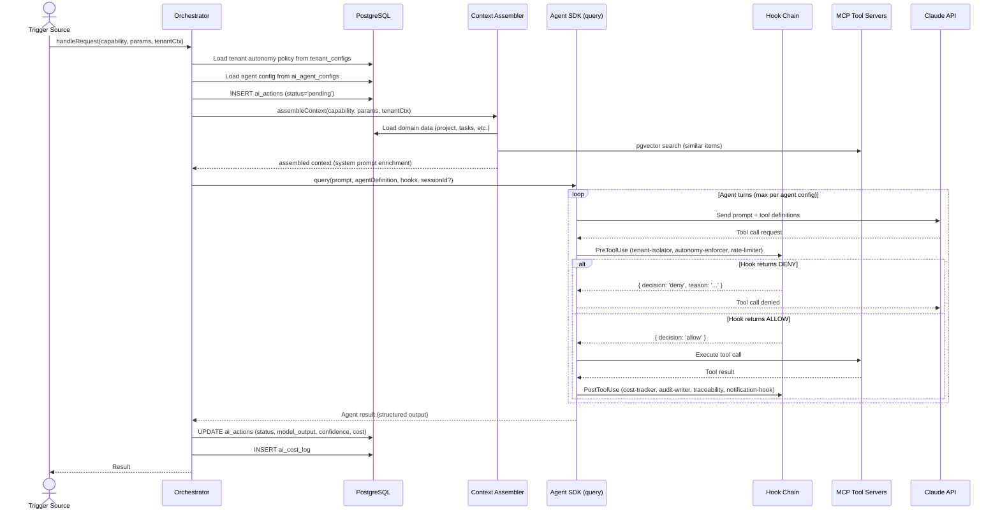
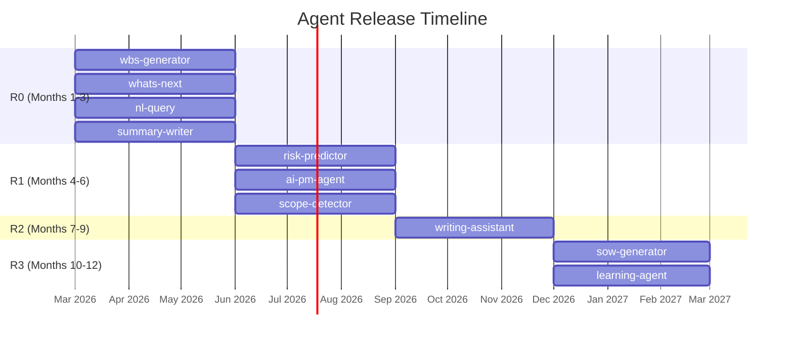
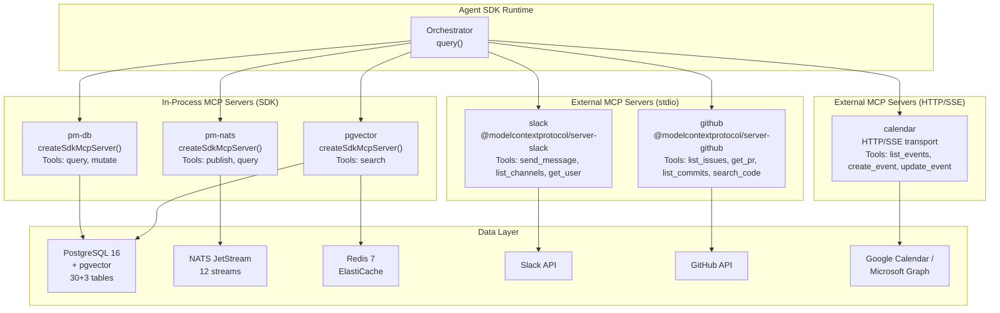
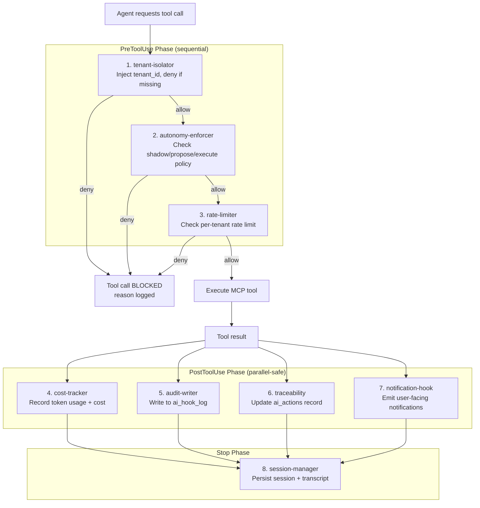
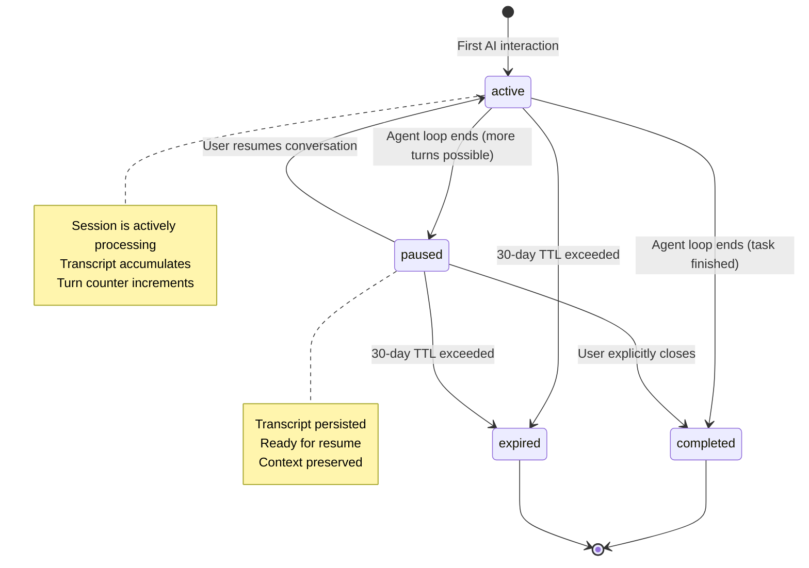
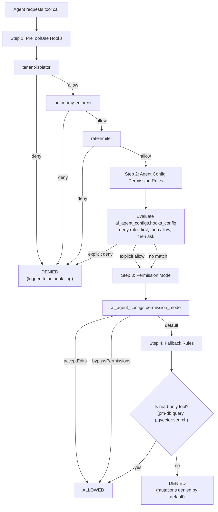
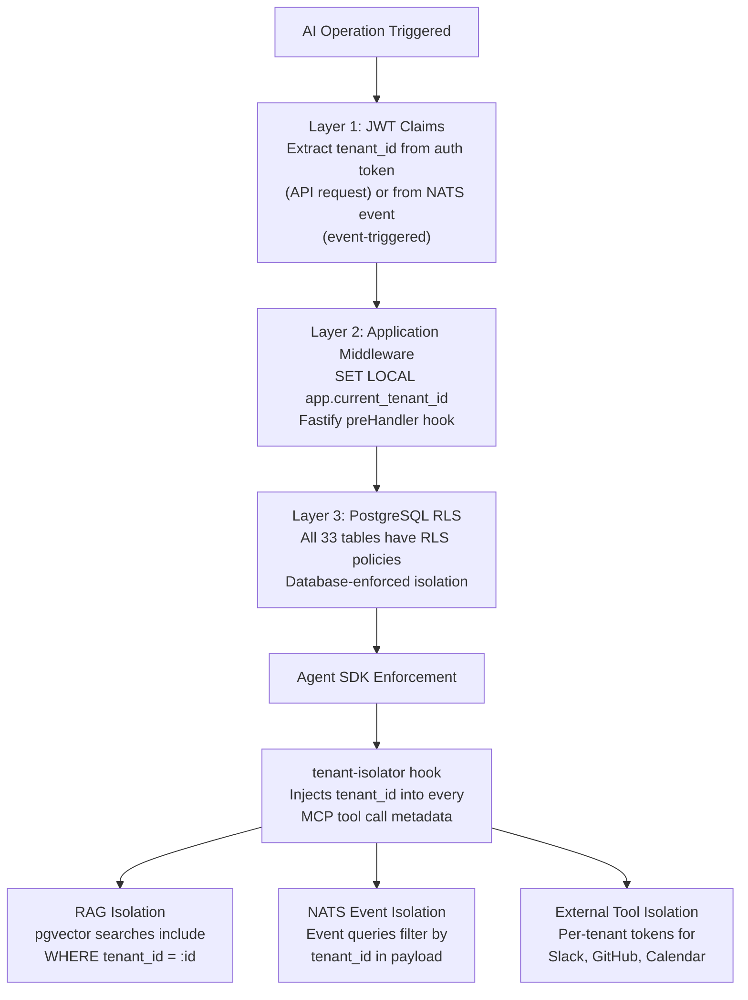

# Agent SDK Architecture — AI-Native PM Tool v2.0

> **Version:** 2.0
> **Date:** February 12, 2026
> **Status:** Draft
> **Authors:** Engineering Team
> **Supersedes:** v1.1 AI Engine (design.md Section 8 — 7-stage monolithic pipeline)
> **Aligned to:** Architecture v3.1, Product Roadmap v2.2, UI/UX Design v1.0, Requirements v1.1

---

## Changelog from v1.1

| Change | v1.1 (design.md §8) | v2.0 (this document) |
|--------|----------------------|----------------------|
| AI orchestration model | Custom 7-stage monolithic pipeline | Claude Agent SDK multi-agent orchestrator |
| Tool access pattern | Direct Anthropic SDK calls + custom wrappers | MCP (Model Context Protocol) tool servers |
| Safety enforcement | Application-layer autonomy checks (Stage 2/7) | Agent SDK hooks (PreToolUse, PostToolUse, Stop) |
| Session management | Stateless per-request | Persistent sessions with transcript resume |
| Agent definitions | Implicit capability configs | Explicit `AgentDefinition` objects per subagent |
| Permission model | Per-tenant autonomy policy only | Three-layer: hooks + agent config + permission mode |
| Observability | Custom traceability pipeline | Hook-based audit + cost tracking + traceability |
| New ADRs | ADR-001 through ADR-012 | + ADR-013 through ADR-016 |
| MCP servers | None | 6 MCP servers (pm-db, pm-nats, pgvector, slack, github, calendar) |
| Hook count | 0 (inline checks) | 8 hooks with typed callbacks |

---

## 1. Overview & Design Philosophy

### 1.1 Why Claude Agent SDK Replaces the Custom Pipeline

The v1.1 design (design.md Section 8) implemented AI orchestration as a custom 7-stage pipeline: TRIGGER, AUTONOMY CHECK, CONTEXT ASSEMBLY, CONFIDENCE CHECK, LLM CALL, POST-PROCESSING, DISPOSITION. Every AI capability flowed through this monolithic pipeline, with each stage hand-coded in TypeScript wrapping the Anthropic SDK directly.

This approach had three structural problems:

1. **Tight coupling.** Every new capability required modifying the orchestrator's routing logic, context assembly, and disposition handling. Adding the AI Writing Assistant (F-102) in v1.1 touched 6 files across 3 directories.

2. **No standard tool interface.** Each capability accessed the database, NATS, and external services through ad-hoc service injections. There was no unified protocol for tool discovery, schema validation, or permission enforcement.

3. **Reinvented safety.** The autonomy check (Stage 2) and disposition (Stage 7) were custom implementations of patterns that the Agent SDK provides natively through hooks and permission modes.

The Claude Agent SDK (`@anthropic-ai/claude-agent-sdk`) provides first-class primitives for all three concerns: multi-agent orchestration via `query()`, standardized tool access via MCP servers, and safety enforcement via typed hooks. The v2.0 redesign replaces the custom pipeline with these SDK-native patterns.

### 1.2 Architecture Principles

| # | Principle | Implication |
|---|-----------|-------------|
| 1 | **Multi-agent isolation** | Each AI capability is a separate subagent with its own system prompt, model selection, tool permissions, and turn limits. Subagents cannot interfere with each other. |
| 2 | **MCP standardization** | All tool access (database, NATS, vector search, Slack, GitHub, Calendar) flows through MCP tool servers with typed schemas. No direct service calls from agent code. |
| 3 | **Hooks for safety** | Every safety concern (tenant isolation, autonomy enforcement, rate limiting, cost tracking, audit logging) is implemented as an Agent SDK hook, not inline application code. |
| 4 | **Sessions for context** | Multi-turn AI interactions (NL queries, writing assistance) use persistent Agent SDK sessions with transcript resume, not stateless request/response. |
| 5 | **Orchestrator as single entry point** | All AI operations enter through the orchestrator. No capability calls the LLM directly. This is unchanged from v1.1 — the principle is preserved, the implementation changes. |
| 6 | **Tenant isolation is non-negotiable** | The `tenant-isolator` hook injects `tenant_id` into every MCP tool call. This is database-enforced via RLS, hook-enforced via PreToolUse, and verified at the application layer. Three layers, zero trust. |

### 1.3 New Architecture Decision Records

| ADR | Decision | Over | Rationale | Revisit When |
|-----|----------|------|-----------|-------------|
| ADR-013 | Claude Agent SDK for orchestration | Custom 7-stage pipeline | SDK provides multi-agent, MCP tools, hooks, sessions as first-class primitives. Reduces custom code by ~60%. | SDK API breaks backward compatibility |
| ADR-014 | MCP tool servers for all tool access | Direct service injection | Standardized schemas, permission enforcement at tool boundary, composable across agents. | MCP protocol changes or performance overhead >50ms per tool call |
| ADR-015 | Hook-based safety over inline checks | Custom autonomy pipeline stages | Hooks are declarative, composable, and evaluated in deterministic order. Easier to audit than scattered inline checks. | Hook evaluation latency exceeds 20ms aggregate |
| ADR-016 | Persistent sessions with transcript resume | Stateless per-request AI calls | Multi-turn NL queries require conversation context. Sessions reduce redundant context assembly by ~40% on follow-up turns. | Session storage exceeds 10GB per tenant |

### 1.4 Comparison: v1.1 Custom Pipeline vs v2.0 Agent SDK

| Dimension | v1.1 (Custom 7-Stage Pipeline) | v2.0 (Agent SDK Native) |
|-----------|--------------------------------|-------------------------|
| Entry point | `AIOchestrator.execute(trigger)` | `orchestrator.query(prompt, agentDef)` |
| Capability routing | `switch(capability)` in orchestrator | `AgentDefinition` selection by capability key |
| Tool access | `this.db.query()`, `this.nats.publish()` | MCP tool calls: `mcp__pm-db__query`, `mcp__pm-nats__publish` |
| Safety checks | Stage 2 (autonomy) + Stage 7 (disposition) | PreToolUse hooks: `tenant-isolator`, `autonomy-enforcer`, `rate-limiter` |
| Context assembly | Stage 3 (custom RAG + template) | System prompt + `assembleContext()` pre-injection |
| Post-processing | Stage 6 (custom JSON parse + schema validation) | Agent SDK structured output + PostToolUse hooks |
| Session state | None (stateless) | `ai_sessions` table + transcript JSON |
| Cost tracking | Custom Redis counters in Stage 5 callback | `cost-tracker` PostToolUse hook |
| Audit trail | Custom `ai_actions` insert in Stage 7 | `audit-writer` + `traceability` PostToolUse hooks |
| Adding a new capability | Modify orchestrator routing, context assembly, disposition | Create `AgentDefinition`, register with orchestrator |
| Lines of custom orchestration code | ~2,500 LOC | ~800 LOC (orchestrator + hook configs) |

---

## 2. Multi-Agent Orchestrator

### 2.1 Orchestrator Role

The orchestrator is the **single entry point** for ALL AI operations in the system. It receives triggers from three sources, selects the appropriate subagent, creates tracking records, spawns the agent via the SDK, and writes results back. No AI capability bypasses the orchestrator.

**Trigger sources:**

| Source | Example | Entry Path |
|--------|---------|------------|
| NATS events | `pm.tasks.created` triggers embedding pipeline | NATS consumer calls `orchestrator.handleEvent(event)` |
| API calls (user-initiated) | User clicks "Generate WBS" | Fastify route calls `orchestrator.handleRequest(req)` |
| Scheduled jobs (BullMQ/cron) | AI PM Agent 15-min loop | BullMQ worker calls `orchestrator.handleScheduled(job)` |

### 2.2 Orchestrator Sequence



### 2.3 Orchestrator Implementation

```typescript
// apps/api/src/ai/orchestrator/orchestrator.ts

import {
  query,
  type ClaudeAgentOptions,
  type AgentResult,
} from '@anthropic-ai/claude-agent-sdk';
import { getAgentDefinition } from './agent-registry';
import { assembleContext } from '../context/assembler';
import { createHookChain } from '../hooks/hook-chain';
import { db } from '../../common/database';
import { nats } from '../../common/nats';
import type { TenantContext, AICapability, OrchestratorResult } from './types';

interface OrchestratorTrigger {
  capability: AICapability;
  params: Record<string, unknown>;
  tenantCtx: TenantContext;
  sessionId?: string;
  triggeredBy: 'nats_event' | 'api_request' | 'scheduled_job';
  triggerEventId?: string;
}

export class AIOrchestrator {
  /**
   * Single entry point for ALL AI operations.
   * No AI capability calls the LLM directly — everything flows through here.
   */
  async execute(trigger: OrchestratorTrigger): Promise<OrchestratorResult> {
    const { capability, params, tenantCtx, sessionId, triggeredBy } = trigger;

    // 1. Load tenant autonomy policy and agent config
    const [autonomyPolicy, agentConfig] = await Promise.all([
      this.loadAutonomyPolicy(tenantCtx.tenantId),
      this.loadAgentConfig(tenantCtx.tenantId, capability),
    ]);

    // 2. Create ai_actions record (status='pending')
    const aiActionId = await this.createAIAction({
      tenantId: tenantCtx.tenantId,
      capability,
      triggerSource: triggeredBy,
      triggerEventId: trigger.triggerEventId,
      status: 'pending',
      disposition: autonomyPolicy.getDisposition(capability),
    });

    // 3. Assemble context (RAG + event history + domain data)
    const context = await assembleContext({
      capability,
      params,
      tenantCtx,
      tokenBudget: agentConfig.tokenBudget,
    });

    // 4. Get agent definition for this capability
    const agentDef = getAgentDefinition(capability, {
      agentConfig,
      autonomyPolicy,
      context,
    });

    // 5. Create hook chain with tenant context
    const hooks = createHookChain({
      tenantCtx,
      aiActionId,
      autonomyPolicy,
      agentConfig,
    });

    // 6. Build Agent SDK options
    const agentOptions: ClaudeAgentOptions = {
      model: agentDef.model,
      system: agentDef.systemPrompt,
      tools: agentDef.tools,
      hooks,
      maxTurns: agentDef.maxTurns,
      permissionMode: agentDef.permissionMode,
      ...(sessionId ? { resume: sessionId } : {}),
    };

    try {
      // 7. Execute via Agent SDK
      const result: AgentResult = await query(
        context.enrichedPrompt,
        agentOptions
      );

      // 8. Write results back
      await this.finalizeAIAction(aiActionId, {
        status: this.mapDisposition(autonomyPolicy.getDisposition(capability)),
        modelUsed: result.model,
        modelOutput: result.output,
        confidenceScore: result.metadata?.confidence,
        inputTokens: result.usage.inputTokens,
        outputTokens: result.usage.outputTokens,
        costUsd: this.calculateCost(result.usage, result.model),
        latencyMs: result.metadata?.latencyMs,
      });

      // 9. Insert cost log
      await this.insertCostLog({
        tenantId: tenantCtx.tenantId,
        aiActionId,
        capability,
        model: result.model,
        inputTokens: result.usage.inputTokens,
        outputTokens: result.usage.outputTokens,
        costUsd: this.calculateCost(result.usage, result.model),
      });

      return {
        aiActionId,
        result: result.output,
        sessionId: result.sessionId,
        status: 'success',
      };
    } catch (error) {
      await this.failAIAction(aiActionId, error);
      throw error;
    }
  }

  private async loadAutonomyPolicy(tenantId: string) {
    const config = await db.query.tenantConfigs.findFirst({
      where: (tc, { eq, and }) =>
        and(eq(tc.tenantId, tenantId), eq(tc.configKey, 'autonomy_policy')),
    });
    return new AutonomyPolicy(config?.configValue ?? DEFAULT_AUTONOMY_POLICY);
  }

  private async loadAgentConfig(tenantId: string, capability: AICapability) {
    const config = await db.query.aiAgentConfigs.findFirst({
      where: (ac, { eq, and }) =>
        and(eq(ac.tenantId, tenantId), eq(ac.capability, capability)),
    });
    return config ?? getDefaultAgentConfig(capability);
  }

  private async createAIAction(data: CreateAIActionInput): Promise<string> {
    const [row] = await db
      .insert(aiActions)
      .values({
        tenantId: data.tenantId,
        capability: data.capability,
        triggerSource: data.triggerSource,
        triggerEventId: data.triggerEventId,
        status: data.status,
        disposition: data.disposition,
        modelUsed: 'pending',
      })
      .returning({ id: aiActions.id });
    return row.id;
  }

  private async finalizeAIAction(
    aiActionId: string,
    data: FinalizeAIActionInput
  ): Promise<void> {
    await db
      .update(aiActions)
      .set({
        status: data.status,
        modelUsed: data.modelUsed,
        modelOutput: data.modelOutput,
        confidenceScore: data.confidenceScore,
        inputTokens: data.inputTokens,
        outputTokens: data.outputTokens,
        costUsd: data.costUsd,
        latencyMs: data.latencyMs,
        updatedAt: new Date(),
      })
      .where(eq(aiActions.id, aiActionId));
  }

  private async insertCostLog(data: InsertCostLogInput): Promise<void> {
    await db.insert(aiCostLog).values(data);
  }

  private async failAIAction(
    aiActionId: string,
    error: unknown
  ): Promise<void> {
    await db
      .update(aiActions)
      .set({
        status: 'failed',
        modelOutput: { error: String(error) },
        updatedAt: new Date(),
      })
      .where(eq(aiActions.id, aiActionId));
  }

  private mapDisposition(
    disposition: 'shadow' | 'propose' | 'execute'
  ): string {
    const map = {
      shadow: 'shadow_logged',
      propose: 'proposed',
      execute: 'executed',
    };
    return map[disposition];
  }

  private calculateCost(
    usage: { inputTokens: number; outputTokens: number },
    model: string
  ): number {
    const rates: Record<string, { input: number; output: number }> = {
      'claude-opus-4-6': { input: 15 / 1_000_000, output: 75 / 1_000_000 },
      'claude-sonnet-4-5': { input: 3 / 1_000_000, output: 15 / 1_000_000 },
    };
    const rate = rates[model] ?? rates['claude-sonnet-4-5'];
    return usage.inputTokens * rate.input + usage.outputTokens * rate.output;
  }
}
```

### 2.4 New DDL: ai_agent_configs Table

This table stores per-tenant per-capability agent configuration. It extends the existing schema (30 tables in v1.1, now 33 with `ai_agent_configs`, `ai_sessions`, and `ai_hook_log`).

```sql
-- Table 31: AI Agent Configs (NEW in v2.0)
CREATE TABLE ai_agent_configs (
  id                UUID PRIMARY KEY DEFAULT gen_random_uuid(),
  tenant_id         UUID NOT NULL REFERENCES tenants(id),
  capability        VARCHAR(100) NOT NULL,
  model_override    VARCHAR(100),
  max_turns         INTEGER NOT NULL DEFAULT 10,
  token_budget      INTEGER NOT NULL DEFAULT 8000,
  permission_mode   VARCHAR(20) NOT NULL DEFAULT 'default'
    CHECK (permission_mode IN ('default', 'acceptEdits', 'bypassPermissions')),
  hooks_config      JSONB NOT NULL DEFAULT '{}',
  enabled           BOOLEAN NOT NULL DEFAULT true,
  created_at        TIMESTAMPTZ NOT NULL DEFAULT now(),
  updated_at        TIMESTAMPTZ NOT NULL DEFAULT now()
);
CREATE UNIQUE INDEX idx_ai_agent_configs_tenant_cap
  ON ai_agent_configs(tenant_id, capability);

-- Table 32: AI Sessions (NEW in v2.0)
CREATE TABLE ai_sessions (
  id                UUID PRIMARY KEY DEFAULT gen_random_uuid(),
  tenant_id         UUID NOT NULL REFERENCES tenants(id),
  user_id           UUID NOT NULL REFERENCES users(id),
  capability        VARCHAR(100) NOT NULL,
  status            VARCHAR(20) NOT NULL DEFAULT 'active'
    CHECK (status IN ('active', 'paused', 'completed', 'expired')),
  parent_session_id UUID REFERENCES ai_sessions(id),
  transcript_path   TEXT,
  turn_count        INTEGER NOT NULL DEFAULT 0,
  last_active_at    TIMESTAMPTZ NOT NULL DEFAULT now(),
  expires_at        TIMESTAMPTZ NOT NULL DEFAULT (now() + INTERVAL '30 days'),
  metadata          JSONB NOT NULL DEFAULT '{}',
  created_at        TIMESTAMPTZ NOT NULL DEFAULT now(),
  updated_at        TIMESTAMPTZ NOT NULL DEFAULT now()
);
CREATE INDEX idx_ai_sessions_tenant_user
  ON ai_sessions(tenant_id, user_id, capability);
CREATE INDEX idx_ai_sessions_status
  ON ai_sessions(tenant_id, status, expires_at);

-- Table 33: AI Hook Log (NEW in v2.0)
CREATE TABLE ai_hook_log (
  id                UUID PRIMARY KEY DEFAULT gen_random_uuid(),
  tenant_id         UUID NOT NULL REFERENCES tenants(id),
  ai_action_id      UUID REFERENCES ai_actions(id),
  hook_name         VARCHAR(100) NOT NULL,
  event_type        VARCHAR(50) NOT NULL,
  tool_name         VARCHAR(200),
  decision          VARCHAR(20) NOT NULL
    CHECK (decision IN ('allow', 'deny', 'modify', 'log')),
  reason            TEXT,
  latency_ms        INTEGER,
  metadata          JSONB NOT NULL DEFAULT '{}',
  created_at        TIMESTAMPTZ NOT NULL DEFAULT now()
);
CREATE INDEX idx_ai_hook_log_tenant_action
  ON ai_hook_log(tenant_id, ai_action_id);
CREATE INDEX idx_ai_hook_log_tenant_hook
  ON ai_hook_log(tenant_id, hook_name, created_at);
```

**RLS policies for new tables:**

```sql
ALTER TABLE ai_agent_configs ENABLE ROW LEVEL SECURITY;
CREATE POLICY tenant_isolation ON ai_agent_configs
  USING (tenant_id = current_setting('app.current_tenant_id')::uuid);

ALTER TABLE ai_sessions ENABLE ROW LEVEL SECURITY;
CREATE POLICY tenant_isolation ON ai_sessions
  USING (tenant_id = current_setting('app.current_tenant_id')::uuid);

ALTER TABLE ai_hook_log ENABLE ROW LEVEL SECURITY;
CREATE POLICY tenant_isolation ON ai_hook_log
  USING (tenant_id = current_setting('app.current_tenant_id')::uuid);
```

---

## 3. Subagent Definitions

### 3.1 Subagent Catalog (10 Agents)

| Agent | Capability | FR Ref | F Ref | Model | Tools (MCP) | Permission Mode | Max Turns | Release |
|-------|-----------|--------|-------|-------|-------------|-----------------|-----------|---------|
| `wbs-generator` | NL-to-WBS | FR-200 | F-011 | `claude-opus-4-6` | pm-db:query, pm-db:mutate, pgvector:search | acceptEdits | 15 | R0 |
| `whats-next` | What's Next Engine | FR-201 | F-012 | `claude-sonnet-4-5` | pm-db:query, pgvector:search | default | 5 | R0 |
| `nl-query` | NL Query | FR-203 | F-014 | `claude-sonnet-4-5` | pm-db:query, pgvector:search | default | 10 | R0 |
| `summary-writer` | Daily/Weekly Summary | FR-202 | F-013 | `claude-sonnet-4-5` | pm-db:query | default | 5 | R0 |
| `risk-predictor` | Risk Prediction | FR-603 | F-030 | `claude-opus-4-6` | pm-db:query, pgvector:search | default | 10 | R1 |
| `ai-pm-agent` | AI PM Agent | FR-601 | F-028 | `claude-sonnet-4-5` | pm-db:query, pm-db:mutate, pm-nats:publish, slack:send_message | acceptEdits | 25 | R1 |
| `scope-detector` | Scope Creep Detector | FR-607 | F-034 | `claude-sonnet-4-5` | pm-db:query, pgvector:search | default | 10 | R1 |
| `sow-generator` | SOW Generator | FR-1800 | F-083 | `claude-opus-4-6` | pm-db:query, pgvector:search | default | 15 | R3 |
| `writing-assistant` | AI Writing | FR-2013 | F-102 | `claude-sonnet-4-5` | pm-db:query | default | 10 | R2 |
| `learning-agent` | Per-Tenant Learning | FR-1600 | F-074 | `claude-sonnet-4-5` | pm-db:query, pgvector:search | default | 15 | R3 |

### 3.2 Agent Definition: wbs-generator

```typescript
// apps/api/src/ai/agents/wbs-generator.ts

import type { AgentDefinition } from '@anthropic-ai/claude-agent-sdk';

export const wbsGeneratorAgent: AgentDefinition = {
  name: 'wbs-generator',
  model: 'claude-opus-4-6',
  permissionMode: 'acceptEdits',
  maxTurns: 15,
  systemPrompt: `You are a Work Breakdown Structure (WBS) generator for an AI-native project management tool.

Given a natural language project description, produce a hierarchical Work Breakdown Structure with:
- Phases (ordered project stages)
- Tasks within each phase (with titles, descriptions, effort estimates in hours)
- Dependencies between tasks (finish-to-start relationships)
- Priority assignments (critical, high, medium, low)
- Sub-tasks where appropriate (single-level nesting only)

Use pgvector:search to find similar past projects within this tenant for estimation calibration.
Use pm-db:query to load existing project context, team members, and custom field definitions.

Output structured JSON matching the WBS schema:
{
  "phases": [
    {
      "name": "string",
      "description": "string",
      "sort_order": number,
      "tasks": [
        {
          "title": "string",
          "description": "string",
          "priority": "critical|high|medium|low",
          "estimated_effort": number,
          "dependencies": ["task_title_ref"],
          "sub_tasks": [{ "title": "string", "estimated_effort": number }]
        }
      ]
    }
  ],
  "confidence": number,
  "calibration_sources": ["similar_project_id"]
}

CONSTRAINTS:
- All effort estimates must be in hours (not days or story points).
- Dependencies must reference tasks by title within the same WBS.
- No circular dependencies.
- Maximum 3 levels of hierarchy: Phase > Task > Sub-task.
- Confidence score (0.0-1.0) reflects data quality and estimation certainty.`,
  tools: [
    'mcp__pm-db__query',
    'mcp__pm-db__mutate',
    'mcp__pgvector__search',
  ],
};
```

### 3.3 Agent Definition: whats-next

```typescript
// apps/api/src/ai/agents/whats-next.ts

import type { AgentDefinition } from '@anthropic-ai/claude-agent-sdk';

export const whatsNextAgent: AgentDefinition = {
  name: 'whats-next',
  model: 'claude-sonnet-4-5',
  permissionMode: 'default',
  maxTurns: 5,
  systemPrompt: `You are a task prioritization engine for a project management tool.

Query the current user's assigned tasks using pm-db:query. Evaluate each task against:
1. Dependency status — tasks with all dependencies resolved rank highest
2. Due date proximity — earliest due date ranks higher
3. Priority level — critical > high > medium > low
4. Downstream impact — tasks that block the most other tasks rank higher
5. Team velocity context — use pgvector:search to find similar past task completion patterns

Return a ranked list of 5-10 tasks the developer should work on next.

Output JSON:
{
  "tasks": [
    {
      "task_id": "uuid",
      "rank": number,
      "reasoning": "Human-readable explanation of why this task is prioritized here",
      "blocking_count": number,
      "urgency_score": number
    }
  ],
  "generated_at": "ISO 8601",
  "algorithm": "ai"
}`,
  tools: ['mcp__pm-db__query', 'mcp__pgvector__search'],
};
```

### 3.4 Agent Definition: nl-query

```typescript
// apps/api/src/ai/agents/nl-query.ts

import type { AgentDefinition } from '@anthropic-ai/claude-agent-sdk';

export const nlQueryAgent: AgentDefinition = {
  name: 'nl-query',
  model: 'claude-sonnet-4-5',
  permissionMode: 'default',
  maxTurns: 10,
  systemPrompt: `You are a project data analyst for an AI-native project management tool.

Answer natural language questions about project data. You have access to:
- pm-db:query — Execute SELECT queries against the project database (tasks, projects, phases, comments, assignments, dependencies, goals, custom fields)
- pgvector:search — Semantic search across task descriptions, comments, and documents

Support multi-turn conversations. When the user asks a follow-up question, use the session context to understand what "it", "those", "the top 3", etc. refer to.

RULES:
- Always query real data — never fabricate task names, dates, or statistics.
- For aggregate questions (counts, averages), use SQL aggregations via pm-db:query.
- For semantic questions ("tasks related to authentication"), use pgvector:search.
- Present results in clear, concise natural language with supporting data.
- If data is insufficient to answer, say so explicitly.`,
  tools: ['mcp__pm-db__query', 'mcp__pgvector__search'],
};
```

### 3.5 Agent Definition: summary-writer

```typescript
// apps/api/src/ai/agents/summary-writer.ts

import type { AgentDefinition } from '@anthropic-ai/claude-agent-sdk';

export const summaryWriterAgent: AgentDefinition = {
  name: 'summary-writer',
  model: 'claude-sonnet-4-5',
  permissionMode: 'default',
  maxTurns: 5,
  systemPrompt: `You are a project summarizer for an AI-native project management tool.

Generate concise daily or weekly summaries of project progress. Query pm-db for:
- Tasks completed in the period
- Tasks created in the period
- Status changes and transitions
- Blockers and dependencies resolved/added
- Comments and key discussions
- Overdue tasks

Output structured summaries:
{
  "period": "daily|weekly",
  "date_range": { "start": "ISO 8601", "end": "ISO 8601" },
  "highlights": ["string"],
  "completed_count": number,
  "created_count": number,
  "blockers": [{ "task_id": "uuid", "description": "string", "duration_hours": number }],
  "upcoming_deadlines": [{ "task_id": "uuid", "title": "string", "due_date": "ISO 8601" }],
  "narrative": "string",
  "client_narrative": "string | null"
}

When client_visible=true is requested, generate a client-safe narrative that:
- Uses business language, not technical jargon
- Focuses on deliverables and milestones, not internal tasks
- Omits internal discussions, resource allocation, and AI confidence scores
- Presents a professional, confidence-inspiring tone`,
  tools: ['mcp__pm-db__query'],
};
```

### 3.6 Agent Definition: risk-predictor

```typescript
// apps/api/src/ai/agents/risk-predictor.ts

import type { AgentDefinition } from '@anthropic-ai/claude-agent-sdk';

export const riskPredictorAgent: AgentDefinition = {
  name: 'risk-predictor',
  model: 'claude-opus-4-6',
  permissionMode: 'default',
  maxTurns: 10,
  systemPrompt: `You are a delivery risk analyst for an AI-native project management tool.

Analyze project data to predict delivery risks. Use pm-db:query to examine:
- Task velocity trends (completion rate over last 2/4/8 weeks)
- Blocker duration patterns (average time tasks spend blocked)
- Dependency chain depth and critical path analysis
- Scope changes vs original WBS baseline
- Team workload distribution and capacity
- Overdue task accumulation rate

Use pgvector:search to find similar risk patterns from historical projects.

Output confidence-scored risk assessments:
{
  "risks": [
    {
      "risk_id": "string",
      "category": "schedule|scope|resource|dependency|quality",
      "severity": "critical|high|medium|low",
      "confidence": number,
      "description": "string",
      "evidence": ["string"],
      "affected_tasks": ["uuid"],
      "mitigation_suggestions": ["string"],
      "estimated_impact_days": number
    }
  ],
  "overall_health": "on_track|at_risk|critical",
  "generated_at": "ISO 8601"
}

CONSTRAINTS:
- Every risk must cite specific evidence from the data.
- Confidence score reflects the quality and quantity of supporting data.
- Mitigation suggestions must be actionable and specific to the project context.
- Run in shadow mode for the first 2-4 weeks per tenant to calibrate.`,
  tools: ['mcp__pm-db__query', 'mcp__pgvector__search'],
};
```

### 3.7 Agent Definition: ai-pm-agent

```typescript
// apps/api/src/ai/agents/ai-pm-agent.ts

import type { AgentDefinition } from '@anthropic-ai/claude-agent-sdk';

export const aiPmAgentDef: AgentDefinition = {
  name: 'ai-pm-agent',
  model: 'claude-sonnet-4-5',
  permissionMode: 'acceptEdits',
  maxTurns: 25,
  systemPrompt: `You are an autonomous AI project manager. Your job is to keep projects moving.

CAPABILITIES:
- Query project state via pm-db:query (tasks, assignments, dependencies, velocity)
- Update task statuses via pm-db:mutate (within autonomy policy limits)
- Publish events via pm-nats:publish (for downstream consumers)
- Send Slack messages via slack:send_message (nudges, summaries, escalations)

BEHAVIOR RULES:
1. Chase overdue updates: If a task has no status change for >48h and is not blocked, send a contextual nudge via Slack to the assignee.
2. Nudge stalled work: If a task is in_progress with no comment or status update for >72h, escalate.
3. Propose escalations: If a critical task is blocked for >24h, propose escalation to the project admin.
4. Respect quiet hours: Do NOT send Slack messages during tenant quiet hours (configured in tenant_configs).
5. Respect nudge limits: Maximum 2 nudges per task per day. Track via pm-db:query on notifications table.
6. Status updates: You may transition tasks from 'created' to 'in_progress' if the assignee acknowledges via Slack.

CONSTRAINTS:
- Never delete tasks or projects.
- Never reassign tasks without proposing first (disposition=propose).
- Always include the task title and project name in Slack messages for context.
- Keep nudge messages concise (under 200 characters) and professional.
- Log every action via pm-nats:publish for audit trail.`,
  tools: [
    'mcp__pm-db__query',
    'mcp__pm-db__mutate',
    'mcp__pm-nats__publish',
    'mcp__slack__send_message',
  ],
};
```

### 3.8 Agent Definition: scope-detector

```typescript
// apps/api/src/ai/agents/scope-detector.ts

import type { AgentDefinition } from '@anthropic-ai/claude-agent-sdk';

export const scopeDetectorAgent: AgentDefinition = {
  name: 'scope-detector',
  model: 'claude-sonnet-4-5',
  permissionMode: 'default',
  maxTurns: 10,
  systemPrompt: `You are a scope creep detector for an AI-native project management tool.

Compare the current task set against the WBS baseline snapshot stored in the project's wbs_baseline JSONB field.

Use pm-db:query to:
1. Load the original WBS baseline for the project
2. Load all current tasks in the project
3. Identify additions (tasks not in baseline), removals (baseline tasks deleted/cancelled), and modifications (significant changes to scope/effort)

Use pgvector:search to find semantically similar tasks that may be duplicates or scope expansions.

Output:
{
  "project_id": "uuid",
  "baseline_task_count": number,
  "current_task_count": number,
  "scope_drift_percentage": number,
  "additions": [{ "task_id": "uuid", "title": "string", "reason": "string" }],
  "removals": [{ "original_title": "string", "reason": "string" }],
  "modifications": [{ "task_id": "uuid", "field": "string", "baseline_value": "string", "current_value": "string" }],
  "alert_level": "none|info|warning|critical",
  "recommendation": "string"
}

Alert when scope drifts >15% from baseline.`,
  tools: ['mcp__pm-db__query', 'mcp__pgvector__search'],
};
```

### 3.9 Agent Definition: sow-generator

```typescript
// apps/api/src/ai/agents/sow-generator.ts

import type { AgentDefinition } from '@anthropic-ai/claude-agent-sdk';

export const sowGeneratorAgent: AgentDefinition = {
  name: 'sow-generator',
  model: 'claude-opus-4-6',
  permissionMode: 'default',
  maxTurns: 15,
  systemPrompt: `You are a Statement of Work (SOW) generator for a consultancy-focused project management tool.

Generate comprehensive SOW documents from project data and historical delivery patterns.

Use pm-db:query to load:
- Project description, phases, and task structure
- Historical effort data from similar completed projects
- Team composition and resource rates
- Client-specific terminology and preferences from tenant_configs

Use pgvector:search to find similar past SOWs and delivery patterns for calibration.

Output structured SOW:
{
  "title": "string",
  "client_name": "string",
  "project_name": "string",
  "executive_summary": "string",
  "scope_of_work": {
    "in_scope": ["string"],
    "out_of_scope": ["string"],
    "assumptions": ["string"]
  },
  "deliverables": [
    {
      "name": "string",
      "description": "string",
      "acceptance_criteria": ["string"],
      "estimated_effort_hours": number,
      "phase": "string"
    }
  ],
  "timeline": {
    "start_date": "ISO 8601",
    "end_date": "ISO 8601",
    "milestones": [{ "name": "string", "date": "ISO 8601", "deliverables": ["string"] }]
  },
  "resource_plan": [{ "role": "string", "allocation_percentage": number, "rate_per_hour": number }],
  "total_estimated_cost": number,
  "payment_schedule": [{ "milestone": "string", "amount": number, "due_date": "ISO 8601" }],
  "terms_and_conditions": "string"
}

CONSTRAINTS:
- All estimates must be grounded in historical data when available.
- Flag low-confidence estimates with explanations.
- Use client-appropriate language (no internal jargon).
- This is a revenue-critical document — accuracy and professionalism are paramount.`,
  tools: ['mcp__pm-db__query', 'mcp__pgvector__search'],
};
```

### 3.10 Agent Definition: writing-assistant

```typescript
// apps/api/src/ai/agents/writing-assistant.ts

import type { AgentDefinition } from '@anthropic-ai/claude-agent-sdk';

export const writingAssistantAgent: AgentDefinition = {
  name: 'writing-assistant',
  model: 'claude-sonnet-4-5',
  permissionMode: 'default',
  maxTurns: 10,
  systemPrompt: `You are a writing assistant for an AI-native project management tool.

Help users write and improve:
- Task descriptions (generate detailed descriptions from titles)
- Comments (professional tone, clear action items)
- Status reports (structured with highlights, blockers, next steps)
- Documentation (technical and business language)
- Meeting notes (structured with attendees, decisions, action items)

Use pm-db:query to load project context, related tasks, and existing documentation to match the project's tone and terminology.

BEHAVIOR:
- Match the existing writing style in the project (formal vs casual).
- When translating technical to business language, preserve accuracy while removing jargon.
- Support streaming output for interactive editing.
- When asked to "improve" text, preserve the original meaning while enhancing clarity and structure.
- Never fabricate project data — only reference real tasks, dates, and people.`,
  tools: ['mcp__pm-db__query'],
};
```

### 3.11 Agent Definition: learning-agent

```typescript
// apps/api/src/ai/agents/learning-agent.ts

import type { AgentDefinition } from '@anthropic-ai/claude-agent-sdk';

export const learningAgentDef: AgentDefinition = {
  name: 'learning-agent',
  model: 'claude-sonnet-4-5',
  permissionMode: 'default',
  maxTurns: 15,
  systemPrompt: `You are a per-tenant learning agent that builds organizational intelligence over time.

Analyze historical project data to:
1. Calibrate estimation models — compare estimated_effort vs actual_effort across completed tasks
2. Identify team velocity patterns — sprint completion rates, throughput by task type
3. Build domain-specific knowledge — common project structures, typical phase sequences, recurring risk patterns
4. Detect estimation biases — systematic over/under-estimation by team member, task type, or project domain

Use pm-db:query to load completed project data, task histories, and effort actuals.
Use pgvector:search to find pattern clusters across projects.

Output:
{
  "tenant_id": "uuid",
  "analysis_period": { "start": "ISO 8601", "end": "ISO 8601" },
  "velocity_metrics": {
    "avg_tasks_per_sprint": number,
    "completion_rate": number,
    "avg_estimation_accuracy": number
  },
  "estimation_calibration": [
    {
      "task_type": "string",
      "avg_estimated": number,
      "avg_actual": number,
      "calibration_factor": number,
      "sample_size": number
    }
  ],
  "risk_patterns": [
    {
      "pattern": "string",
      "frequency": number,
      "typical_impact_days": number,
      "mitigation_that_worked": "string"
    }
  ],
  "recommendations": ["string"]
}

This data feeds back into the WBS generator and risk predictor for tenant-specific calibration.`,
  tools: ['mcp__pm-db__query', 'mcp__pgvector__search'],
};
```

### 3.12 Agent-to-Release Mapping



---

## 4. MCP Tool Servers

### 4.1 MCP Server Topology



### 4.2 pm-db Server (SDK/In-Process)

The `pm-db` MCP server provides database access to all agents. It exposes two tools: `query` (read-only SELECT) and `mutate` (INSERT/UPDATE/DELETE with NATS event emission).

**Tenant isolation is enforced at the tool level:** every query has `WHERE tenant_id = :current_tenant_id` injected by the `tenant-isolator` hook before the tool executes. This is in addition to PostgreSQL RLS.

```typescript
// apps/api/src/ai/mcp/pm-db-server.ts

import {
  createSdkMcpServer,
  tool,
} from '@anthropic-ai/claude-agent-sdk';
import { z } from 'zod';
import { db } from '../../common/database';
import { nats } from '../../common/nats';
import { sql } from 'drizzle-orm';

export const pmDbServer = createSdkMcpServer({
  name: 'pm-db',
  version: '1.0.0',
  tools: {
    query: tool({
      description:
        'Execute a read-only SQL SELECT query against the project management database. ' +
        'Returns rows as JSON array. The tenant_id filter is automatically injected — ' +
        'do NOT include tenant_id in your WHERE clause. ' +
        'Available tables: projects, tasks, phases, task_assignments, task_dependencies, ' +
        'comments, tags, task_tags, ai_actions, audit_log, tenant_configs, embeddings, ' +
        'task_checklists, checklist_items, mentions, custom_field_definitions, ' +
        'custom_field_values, saved_views, goals, goal_task_links, notifications, ' +
        'notification_preferences, automation_rules, forms, documents, reminders, users.',
      parameters: z.object({
        sql_query: z
          .string()
          .describe(
            'A PostgreSQL SELECT query. Must start with SELECT. ' +
            'Do not include INSERT, UPDATE, DELETE, DROP, or ALTER statements.'
          ),
        params: z
          .array(z.union([z.string(), z.number(), z.boolean(), z.null()]))
          .optional()
          .describe('Parameterized query values (use $1, $2, etc. in the query)'),
      }),
      execute: async ({ sql_query, params }, context) => {
        // Validate read-only
        const normalized = sql_query.trim().toUpperCase();
        if (!normalized.startsWith('SELECT')) {
          throw new Error('pm-db:query only supports SELECT statements.');
        }
        const forbidden = ['INSERT', 'UPDATE', 'DELETE', 'DROP', 'ALTER', 'TRUNCATE', 'CREATE'];
        for (const keyword of forbidden) {
          if (normalized.includes(keyword)) {
            throw new Error(`pm-db:query does not allow ${keyword} statements.`);
          }
        }

        // Set RLS context (tenant_id injected by tenant-isolator hook)
        const tenantId = context.metadata?.tenantId;
        if (!tenantId) {
          throw new Error('No tenant context available.');
        }

        const client = await db.$pool.connect();
        try {
          await client.query(
            `SET LOCAL app.current_tenant_id = '${tenantId}'`
          );
          const result = await client.query(sql_query, params ?? []);
          return {
            rows: result.rows,
            rowCount: result.rowCount,
          };
        } finally {
          client.release();
        }
      },
    }),

    mutate: tool({
      description:
        'Execute an INSERT, UPDATE, or DELETE against the project management database. ' +
        'After mutation, automatically emits a NATS event for downstream consumers. ' +
        'Subject to autonomy policy enforcement via the autonomy-enforcer hook. ' +
        'The tenant_id is automatically injected.',
      parameters: z.object({
        operation: z.enum(['INSERT', 'UPDATE', 'DELETE']).describe('SQL operation type'),
        table: z
          .string()
          .describe('Target table name (e.g., "tasks", "comments")'),
        data: z
          .record(z.unknown())
          .optional()
          .describe('For INSERT/UPDATE: column-value pairs'),
        where: z
          .record(z.unknown())
          .optional()
          .describe('For UPDATE/DELETE: WHERE conditions as column-value pairs'),
        returning: z
          .array(z.string())
          .optional()
          .describe('Columns to return after mutation'),
      }),
      execute: async ({ operation, table, data, where, returning }, context) => {
        const tenantId = context.metadata?.tenantId;
        if (!tenantId) {
          throw new Error('No tenant context available.');
        }

        const client = await db.$pool.connect();
        try {
          await client.query(
            `SET LOCAL app.current_tenant_id = '${tenantId}'`
          );

          let result;
          const returningClause = returning?.length
            ? `RETURNING ${returning.join(', ')}`
            : '';

          switch (operation) {
            case 'INSERT': {
              if (!data) throw new Error('INSERT requires data.');
              const injectedData = { ...data, tenant_id: tenantId };
              const columns = Object.keys(injectedData);
              const values = Object.values(injectedData);
              const placeholders = values.map((_, i) => `$${i + 1}`);
              result = await client.query(
                `INSERT INTO ${table} (${columns.join(', ')}) VALUES (${placeholders.join(', ')}) ${returningClause}`,
                values
              );
              break;
            }
            case 'UPDATE': {
              if (!data || !where) throw new Error('UPDATE requires data and where.');
              const setClauses = Object.keys(data).map(
                (k, i) => `${k} = $${i + 1}`
              );
              const whereKeys = Object.keys(where);
              const whereClauses = whereKeys.map(
                (k, i) => `${k} = $${Object.keys(data).length + i + 1}`
              );
              whereClauses.push(
                `tenant_id = $${Object.keys(data).length + whereKeys.length + 1}`
              );
              const allValues = [
                ...Object.values(data),
                ...Object.values(where),
                tenantId,
              ];
              result = await client.query(
                `UPDATE ${table} SET ${setClauses.join(', ')} WHERE ${whereClauses.join(' AND ')} ${returningClause}`,
                allValues
              );
              break;
            }
            case 'DELETE': {
              if (!where) throw new Error('DELETE requires where conditions.');
              const delWhereClauses = Object.keys(where).map(
                (k, i) => `${k} = $${i + 1}`
              );
              delWhereClauses.push(
                `tenant_id = $${Object.keys(where).length + 1}`
              );
              const delValues = [...Object.values(where), tenantId];
              result = await client.query(
                `DELETE FROM ${table} WHERE ${delWhereClauses.join(' AND ')} ${returningClause}`,
                delValues
              );
              break;
            }
          }

          // Emit NATS event for downstream consumers
          const eventSubject = `pm.${table}.${operation.toLowerCase()}d`;
          await nats.publish(eventSubject, {
            type: eventSubject,
            id: crypto.randomUUID(),
            timestamp: new Date().toISOString(),
            tenant_id: tenantId,
            actor: { type: 'ai', id: context.metadata?.aiActionId ?? 'unknown' },
            payload: {
              table,
              operation,
              data: result?.rows?.[0] ?? data,
            },
          });

          return {
            rowCount: result?.rowCount ?? 0,
            rows: result?.rows ?? [],
          };
        } finally {
          client.release();
        }
      },
    }),
  },
});
```

### 4.3 pm-nats Server (SDK/In-Process)

```typescript
// apps/api/src/ai/mcp/pm-nats-server.ts

import { createSdkMcpServer, tool } from '@anthropic-ai/claude-agent-sdk';
import { z } from 'zod';
import { nats, jetstream } from '../../common/nats';

export const pmNatsServer = createSdkMcpServer({
  name: 'pm-nats',
  version: '1.0.0',
  tools: {
    publish: tool({
      description:
        'Publish an event to a NATS JetStream subject. ' +
        'Subject must start with "pm." and follow the stream topology. ' +
        'Available streams: pm.tasks, pm.projects, pm.comments, pm.ai, ' +
        'pm.integrations, pm.notifications, pm.reminders, pm.goals, ' +
        'pm.automations, pm.forms, pm.documents, pm.system.',
      parameters: z.object({
        subject: z
          .string()
          .regex(/^pm\./)
          .describe('NATS subject (e.g., "pm.ai.action_proposed")'),
        payload: z
          .record(z.unknown())
          .describe('Event payload as JSON object'),
      }),
      execute: async ({ subject, payload }, context) => {
        const tenantId = context.metadata?.tenantId;
        if (!tenantId) throw new Error('No tenant context.');

        const event = {
          ...payload,
          id: payload.id ?? crypto.randomUUID(),
          timestamp: payload.timestamp ?? new Date().toISOString(),
          tenant_id: tenantId,
        };

        const js = jetstream();
        await js.publish(subject, JSON.stringify(event));

        return { published: true, subject, eventId: event.id };
      },
    }),

    query: tool({
      description:
        'Read recent events from a NATS JetStream stream. ' +
        'Returns events from the last N minutes for the specified subject filter.',
      parameters: z.object({
        stream: z
          .string()
          .describe('Stream name (e.g., "pm.tasks")'),
        subject_filter: z
          .string()
          .optional()
          .describe('Subject filter (e.g., "pm.tasks.status_changed")'),
        last_minutes: z
          .number()
          .min(1)
          .max(10080)
          .default(60)
          .describe('Look back N minutes (default: 60, max: 7 days)'),
        limit: z
          .number()
          .min(1)
          .max(100)
          .default(20)
          .describe('Maximum events to return'),
      }),
      execute: async ({ stream, subject_filter, last_minutes, limit }, context) => {
        const tenantId = context.metadata?.tenantId;
        if (!tenantId) throw new Error('No tenant context.');

        const js = jetstream();
        const consumer = await js.consumers.get(stream);
        const startTime = new Date(Date.now() - last_minutes * 60 * 1000);

        const messages: unknown[] = [];
        const sub = await consumer.consume({
          deliver_policy: 'by_start_time',
          opt_start_time: startTime.toISOString(),
          filter_subject: subject_filter,
        });

        for await (const msg of sub) {
          const parsed = JSON.parse(msg.data.toString());
          if (parsed.tenant_id === tenantId) {
            messages.push(parsed);
          }
          msg.ack();
          if (messages.length >= limit) break;
        }

        return { events: messages, count: messages.length };
      },
    }),
  },
});
```

### 4.4 pgvector Server (SDK/In-Process)

```typescript
// apps/api/src/ai/mcp/pgvector-server.ts

import { createSdkMcpServer, tool } from '@anthropic-ai/claude-agent-sdk';
import { z } from 'zod';
import { db } from '../../common/database';
import { generateEmbedding } from '../../common/embeddings';

export const pgvectorServer = createSdkMcpServer({
  name: 'pgvector',
  version: '1.0.0',
  tools: {
    search: tool({
      description:
        'Perform cosine similarity search on the embeddings table using pgvector. ' +
        'The query text is embedded using text-embedding-3-small (1536 dimensions) ' +
        'and compared against stored embeddings. Results are tenant-scoped automatically. ' +
        'Use this for semantic search across tasks, comments, projects, and documents.',
      parameters: z.object({
        query_text: z
          .string()
          .min(3)
          .max(2000)
          .describe('Natural language query to embed and search for'),
        entity_type: z
          .enum(['task', 'comment', 'project', 'document', 'all'])
          .default('all')
          .describe('Filter by entity type, or "all" for cross-entity search'),
        top_k: z
          .number()
          .min(1)
          .max(50)
          .default(10)
          .describe('Number of results to return (default: 10)'),
      }),
      execute: async ({ query_text, entity_type, top_k }, context) => {
        const tenantId = context.metadata?.tenantId;
        if (!tenantId) throw new Error('No tenant context.');

        // Generate embedding for the query text
        const queryEmbedding = await generateEmbedding(query_text);
        const embeddingStr = `[${queryEmbedding.join(',')}]`;

        // Build SQL with tenant isolation and optional entity type filter
        const entityFilter =
          entity_type !== 'all'
            ? `AND e.entity_type = '${entity_type}'`
            : '';

        const result = await db.execute(
          `SELECT
            e.entity_type,
            e.entity_id,
            e.metadata,
            1 - (e.embedding <=> '${embeddingStr}'::vector) AS similarity
          FROM embeddings e
          WHERE e.tenant_id = '${tenantId}'
            ${entityFilter}
          ORDER BY e.embedding <=> '${embeddingStr}'::vector
          LIMIT ${top_k}`
        );

        return {
          results: result.rows.map((row: Record<string, unknown>) => ({
            entity_type: row.entity_type,
            entity_id: row.entity_id,
            similarity: Number(row.similarity).toFixed(4),
            metadata: row.metadata,
          })),
          count: result.rows.length,
          model: 'text-embedding-3-small',
          dimensions: 1536,
        };
      },
    }),
  },
});
```

### 4.5 slack Server (stdio)

The Slack MCP server runs as a child process using the stdio transport. It uses per-tenant Slack bot tokens stored in `tenant_configs`.

```typescript
// apps/api/src/ai/mcp/slack-server-config.ts

import type { McpServerConfig } from '@anthropic-ai/claude-agent-sdk';

/**
 * Slack MCP server configuration.
 * Uses @modelcontextprotocol/server-slack via stdio transport.
 * The SLACK_BOT_TOKEN is loaded per-tenant from tenant_configs.
 */
export function getSlackMcpConfig(tenantSlackToken: string): McpServerConfig {
  return {
    transport: 'stdio',
    command: 'npx',
    args: ['-y', '@modelcontextprotocol/server-slack'],
    env: {
      SLACK_BOT_TOKEN: tenantSlackToken,
    },
  };
}

/**
 * Slack MCP tools available to agents:
 *
 * - send_message: Send a message to a Slack channel or DM
 *   Parameters: { channel: string, text: string, thread_ts?: string }
 *
 * - list_channels: List channels the bot is invited to
 *   Parameters: { limit?: number, cursor?: string }
 *
 * - get_user: Get user profile information
 *   Parameters: { user_id: string }
 *
 * Scoping: Only channels the bot is invited to are accessible.
 * Auth: Per-tenant SLACK_BOT_TOKEN from tenant_configs table.
 */
```

### 4.6 github Server (stdio)

```typescript
// apps/api/src/ai/mcp/github-server-config.ts

import type { McpServerConfig } from '@anthropic-ai/claude-agent-sdk';

/**
 * GitHub MCP server configuration.
 * Uses @modelcontextprotocol/server-github via stdio transport.
 * The GITHUB_TOKEN is loaded per-tenant from tenant_configs.
 */
export function getGitHubMcpConfig(tenantGitHubToken: string): McpServerConfig {
  return {
    transport: 'stdio',
    command: 'npx',
    args: ['-y', '@modelcontextprotocol/server-github'],
    env: {
      GITHUB_PERSONAL_ACCESS_TOKEN: tenantGitHubToken,
    },
  };
}

/**
 * GitHub MCP tools available to agents:
 *
 * - list_issues: List issues for a repository
 *   Parameters: { owner: string, repo: string, state?: string, labels?: string[] }
 *
 * - get_pr: Get pull request details
 *   Parameters: { owner: string, repo: string, pull_number: number }
 *
 * - list_commits: List commits on a branch
 *   Parameters: { owner: string, repo: string, sha?: string, per_page?: number }
 *
 * - search_code: Search code across repositories
 *   Parameters: { query: string }
 *
 * Auth: Per-tenant GITHUB_TOKEN from tenant_configs table.
 */
```

### 4.7 calendar Server (HTTP/SSE)

```typescript
// apps/api/src/ai/mcp/calendar-server-config.ts

import type { McpServerConfig } from '@anthropic-ai/claude-agent-sdk';

/**
 * Calendar MCP server configuration.
 * Runs as an HTTP/SSE MCP server connecting to Google Calendar or Microsoft Graph.
 * OAuth2 tokens are stored per-tenant in tenant_configs.
 */
export function getCalendarMcpConfig(
  tenantCalendarConfig: {
    provider: 'google' | 'microsoft';
    oauth2Token: string;
    refreshToken: string;
  }
): McpServerConfig {
  return {
    transport: 'sse',
    url: `http://localhost:${process.env.CALENDAR_MCP_PORT ?? 3100}/sse`,
    headers: {
      Authorization: `Bearer ${tenantCalendarConfig.oauth2Token}`,
      'X-Calendar-Provider': tenantCalendarConfig.provider,
    },
  };
}

/**
 * Calendar MCP tools available to agents:
 *
 * - list_events: List calendar events for a time range
 *   Parameters: { calendar_id: string, start: ISO8601, end: ISO8601, max_results?: number }
 *
 * - create_event: Create a new calendar event
 *   Parameters: { calendar_id: string, summary: string, start: ISO8601, end: ISO8601,
 *                 attendees?: string[], description?: string }
 *
 * - update_event: Update an existing calendar event
 *   Parameters: { calendar_id: string, event_id: string, summary?: string,
 *                 start?: ISO8601, end?: ISO8601, attendees?: string[] }
 *
 * Auth: OAuth2 token from tenant_configs (per-tenant).
 * Provider: Google Calendar API or Microsoft Graph API (per tenant config).
 * Release: R2 (FR-702, F-038)
 */
```

---

## 5. Hooks Architecture

### 5.1 Hook Evaluation Order

Hooks execute in a deterministic order. PreToolUse hooks run before any tool call; PostToolUse hooks run after. The order within each phase is fixed.



### 5.2 Hook 1: tenant-isolator

```typescript
// apps/api/src/ai/hooks/tenant-isolator.ts

import type { HookCallback } from '@anthropic-ai/claude-agent-sdk';

/**
 * Hook: tenant-isolator
 * Event: PreToolUse
 * Matcher: mcp__pm-db* | mcp__pgvector*
 *
 * Purpose: Injects tenant_id into all database and vector search tool calls.
 * Ensures no agent can access data outside its tenant boundary.
 *
 * DENIES the tool call if:
 * - No tenant context is available in the hook metadata
 * - The tool call attempts to override tenant_id
 */
export const tenantIsolatorHook: HookCallback = {
  event: 'PreToolUse',
  matcher: /^mcp__(pm-db|pgvector)__/,
  callback: async ({ toolName, toolInput, metadata }) => {
    const tenantId = metadata?.tenantCtx?.tenantId;

    if (!tenantId) {
      return {
        decision: 'deny',
        reason: 'No tenant context available. All database and vector operations require tenant isolation.',
      };
    }

    // Prevent tenant_id override attempts in tool input
    if (toolInput?.tenant_id && toolInput.tenant_id !== tenantId) {
      return {
        decision: 'deny',
        reason: `Tenant ID mismatch. Expected ${tenantId}, got ${toolInput.tenant_id}. Cross-tenant access denied.`,
      };
    }

    // Inject tenant_id into tool metadata for the MCP server to use
    return {
      decision: 'allow',
      metadata: {
        ...metadata,
        tenantId,
      },
    };
  },
};
```

### 5.3 Hook 2: autonomy-enforcer

```typescript
// apps/api/src/ai/hooks/autonomy-enforcer.ts

import type { HookCallback } from '@anthropic-ai/claude-agent-sdk';

/**
 * Hook: autonomy-enforcer
 * Event: PreToolUse
 * Matcher: mcp__pm-db__mutate | mcp__pm-nats__publish | mcp__slack*
 *
 * Purpose: Enforces the tenant's autonomy policy on mutating operations.
 * - Shadow mode: logs the intended action but DENIES execution.
 * - Propose mode: creates a proposal record and DENIES execution (human must approve).
 * - Execute mode: ALLOWS the tool call to proceed.
 */
export const autonomyEnforcerHook: HookCallback = {
  event: 'PreToolUse',
  matcher: /^mcp__(pm-db__mutate|pm-nats__publish|slack__)/,
  callback: async ({ toolName, toolInput, metadata }) => {
    const { autonomyPolicy, aiActionId, tenantCtx } = metadata ?? {};

    if (!autonomyPolicy || !tenantCtx) {
      return {
        decision: 'deny',
        reason: 'No autonomy policy loaded. Cannot execute mutating operations.',
      };
    }

    const disposition = autonomyPolicy.getDisposition(
      metadata.capability,
      toolName
    );

    // Check quiet hours for Slack operations
    if (toolName.startsWith('mcp__slack__')) {
      const inQuietHours = autonomyPolicy.isInQuietHours(
        tenantCtx.timezone
      );
      if (inQuietHours) {
        return {
          decision: 'deny',
          reason: `Quiet hours active (${autonomyPolicy.quietHoursStart}-${autonomyPolicy.quietHoursEnd} ${tenantCtx.timezone}). Slack messages deferred.`,
        };
      }
    }

    switch (disposition) {
      case 'shadow': {
        // Log the intended action but do not execute
        await logShadowAction({
          aiActionId,
          tenantId: tenantCtx.tenantId,
          toolName,
          toolInput,
          timestamp: new Date(),
        });
        return {
          decision: 'deny',
          reason: `Shadow mode active for ${metadata.capability}. Action logged but not executed. Tool: ${toolName}`,
        };
      }

      case 'propose': {
        // Create a proposal record for human review
        await createProposal({
          aiActionId,
          tenantId: tenantCtx.tenantId,
          toolName,
          toolInput,
          capability: metadata.capability,
        });
        return {
          decision: 'deny',
          reason: `Propose mode active. Action queued for human approval. Tool: ${toolName}`,
        };
      }

      case 'execute': {
        return {
          decision: 'allow',
        };
      }

      default:
        return {
          decision: 'deny',
          reason: `Unknown disposition: ${disposition}. Defaulting to deny.`,
        };
    }
  },
};
```

### 5.4 Hook 3: rate-limiter

```typescript
// apps/api/src/ai/hooks/rate-limiter.ts

import type { HookCallback } from '@anthropic-ai/claude-agent-sdk';
import { redis } from '../../common/redis';

/**
 * Hook: rate-limiter
 * Event: PreToolUse
 * Matcher: all tools (/./)
 *
 * Purpose: Enforces per-tenant rate limits on AI tool calls.
 * Default: 100 AI tool calls per hour per tenant.
 * Configurable via tenant_configs (config_key: 'ai_rate_limit_per_hour').
 *
 * Uses Redis sliding window counter.
 */
export const rateLimiterHook: HookCallback = {
  event: 'PreToolUse',
  matcher: /./, // matches all tools
  callback: async ({ toolName, metadata }) => {
    const tenantId = metadata?.tenantCtx?.tenantId;
    if (!tenantId) {
      return { decision: 'deny', reason: 'No tenant context for rate limiting.' };
    }

    const rateLimit = metadata?.agentConfig?.rateLimit ?? 100;
    const windowKey = `ai_rate:${tenantId}:${getCurrentHourWindow()}`;

    const currentCount = await redis.incr(windowKey);
    if (currentCount === 1) {
      // First request in this window — set TTL
      await redis.expire(windowKey, 3600);
    }

    if (currentCount > rateLimit) {
      return {
        decision: 'deny',
        reason: `Rate limit exceeded: ${currentCount}/${rateLimit} AI tool calls this hour for tenant ${tenantId}. Tool: ${toolName}`,
      };
    }

    return { decision: 'allow' };
  },
};

function getCurrentHourWindow(): string {
  const now = new Date();
  return `${now.getUTCFullYear()}-${now.getUTCMonth()}-${now.getUTCDate()}-${now.getUTCHours()}`;
}
```

### 5.5 Hook 4: cost-tracker

```typescript
// apps/api/src/ai/hooks/cost-tracker.ts

import type { HookCallback } from '@anthropic-ai/claude-agent-sdk';
import { db } from '../../common/database';
import { redis } from '../../common/redis';
import { aiCostLog } from '../../common/schema';

/**
 * Hook: cost-tracker
 * Event: PostToolUse
 * Matcher: all tools
 *
 * Purpose: After any tool call, extracts token usage and cost.
 * Inserts into ai_cost_log table. Checks per-tenant budget limits.
 * Alerts at 80% and 100% of monthly budget.
 */
export const costTrackerHook: HookCallback = {
  event: 'PostToolUse',
  matcher: /./,
  callback: async ({ toolName, toolResult, metadata }) => {
    const tenantId = metadata?.tenantCtx?.tenantId;
    const aiActionId = metadata?.aiActionId;
    if (!tenantId) return;

    const usage = metadata?.tokenUsage;
    if (!usage) return;

    const cost = calculateToolCost(usage, metadata?.model);

    // Insert cost log
    await db.insert(aiCostLog).values({
      tenantId,
      aiActionId,
      capability: metadata?.capability ?? 'unknown',
      model: metadata?.model ?? 'unknown',
      inputTokens: usage.inputTokens ?? 0,
      outputTokens: usage.outputTokens ?? 0,
      costUsd: cost,
    });

    // Update Redis monthly cost counter
    const monthKey = `ai_cost:${tenantId}:${getCurrentMonth()}`;
    const newTotal = await redis.incrbyfloat(monthKey, cost);

    // Check budget limit
    const budget = metadata?.tenantCtx?.aiBudgetMonthlyUsd;
    if (budget) {
      if (newTotal >= budget) {
        // Emit budget exceeded alert
        await emitBudgetAlert(tenantId, 'exceeded', newTotal, budget);
      } else if (newTotal >= budget * 0.8) {
        // Emit 80% warning
        await emitBudgetAlert(tenantId, 'warning_80', newTotal, budget);
      }
    }
  },
};

function calculateToolCost(
  usage: { inputTokens?: number; outputTokens?: number },
  model?: string
): number {
  const rates: Record<string, { input: number; output: number }> = {
    'claude-opus-4-6': { input: 15 / 1_000_000, output: 75 / 1_000_000 },
    'claude-sonnet-4-5': { input: 3 / 1_000_000, output: 15 / 1_000_000 },
  };
  const rate = rates[model ?? 'claude-sonnet-4-5'] ?? rates['claude-sonnet-4-5'];
  return (usage.inputTokens ?? 0) * rate.input + (usage.outputTokens ?? 0) * rate.output;
}

function getCurrentMonth(): string {
  const now = new Date();
  return `${now.getUTCFullYear()}-${String(now.getUTCMonth() + 1).padStart(2, '0')}`;
}

async function emitBudgetAlert(
  tenantId: string,
  level: string,
  current: number,
  budget: number
): Promise<void> {
  // Implementation: emit NATS event pm.system.budget_alert
}
```

### 5.6 Hook 5: audit-writer

```typescript
// apps/api/src/ai/hooks/audit-writer.ts

import type { HookCallback } from '@anthropic-ai/claude-agent-sdk';
import { db } from '../../common/database';
import { aiHookLog } from '../../common/schema';

/**
 * Hook: audit-writer
 * Event: PostToolUse
 * Matcher: all tools
 *
 * Purpose: Writes every tool call to ai_hook_log table.
 * Records: tool_name, decision, latency, metadata.
 * This creates a complete audit trail of all AI tool interactions.
 */
export const auditWriterHook: HookCallback = {
  event: 'PostToolUse',
  matcher: /./,
  callback: async ({ toolName, toolResult, metadata, latencyMs }) => {
    const tenantId = metadata?.tenantCtx?.tenantId;
    if (!tenantId) return;

    await db.insert(aiHookLog).values({
      tenantId,
      aiActionId: metadata?.aiActionId ?? null,
      hookName: 'audit-writer',
      eventType: 'PostToolUse',
      toolName,
      decision: toolResult?.error ? 'log' : 'allow',
      reason: toolResult?.error ? String(toolResult.error) : null,
      latencyMs: latencyMs ?? null,
      metadata: {
        toolInput: metadata?.sanitizedInput,
        resultRowCount: toolResult?.rowCount,
        model: metadata?.model,
      },
    });
  },
};
```

### 5.7 Hook 6: traceability

```typescript
// apps/api/src/ai/hooks/traceability.ts

import type { HookCallback } from '@anthropic-ai/claude-agent-sdk';
import { db } from '../../common/database';
import { aiActions } from '../../common/schema';
import { eq } from 'drizzle-orm';

/**
 * Hook: traceability
 * Event: PostToolUse
 * Matcher: all tools
 *
 * Purpose: Updates the ai_actions record with model_output, confidence_score,
 * actions_proposed, and human-readable explanation after each significant tool call.
 * Maintains the full traceability chain required by FR-400 (F-020).
 */
export const traceabilityHook: HookCallback = {
  event: 'PostToolUse',
  matcher: /./,
  callback: async ({ toolName, toolInput, toolResult, metadata }) => {
    const aiActionId = metadata?.aiActionId;
    if (!aiActionId) return;

    // Only update for mutation tools (reads don't change the action record)
    const isMutation =
      toolName.includes('mutate') ||
      toolName.includes('publish') ||
      toolName.includes('send_message');

    if (!isMutation) return;

    // Append to actions_proposed array
    const currentAction = await db.query.aiActions.findFirst({
      where: eq(aiActions.id, aiActionId),
      columns: { actionsProposed: true },
    });

    const existingActions = (currentAction?.actionsProposed as unknown[]) ?? [];
    const updatedActions = [
      ...existingActions,
      {
        tool: toolName,
        input: toolInput,
        result_summary: toolResult?.rowCount
          ? `${toolResult.rowCount} rows affected`
          : 'completed',
        timestamp: new Date().toISOString(),
      },
    ];

    await db
      .update(aiActions)
      .set({
        actionsProposed: updatedActions,
        updatedAt: new Date(),
      })
      .where(eq(aiActions.id, aiActionId));
  },
};
```

### 5.8 Hook 7: session-manager

```typescript
// apps/api/src/ai/hooks/session-manager.ts

import type { HookCallback } from '@anthropic-ai/claude-agent-sdk';
import { db } from '../../common/database';
import { aiSessions } from '../../common/schema';
import { eq } from 'drizzle-orm';
import { writeFile } from 'fs/promises';
import { join } from 'path';

/**
 * Hook: session-manager
 * Event: Stop
 * Matcher: N/A (Stop hooks fire when the agent loop ends)
 *
 * Purpose: Persists session state to ai_sessions table.
 * Saves the conversation transcript to disk (dev) or S3 (prod).
 * Handles cleanup for completed and expired sessions.
 */
export const sessionManagerHook: HookCallback = {
  event: 'Stop',
  callback: async ({ sessionId, transcript, turnCount, metadata }) => {
    const tenantId = metadata?.tenantCtx?.tenantId;
    const userId = metadata?.tenantCtx?.userId;
    if (!tenantId || !sessionId) return;

    // Determine storage path
    const transcriptPath = getTranscriptPath(tenantId, sessionId);

    // Save transcript to disk/S3
    const transcriptJson = JSON.stringify(transcript, null, 2);
    if (process.env.NODE_ENV === 'production') {
      await uploadToS3(`transcripts/${tenantId}/${sessionId}.json`, transcriptJson);
    } else {
      await writeFile(transcriptPath, transcriptJson, 'utf-8');
    }

    // Upsert session record
    const existing = await db.query.aiSessions.findFirst({
      where: eq(aiSessions.id, sessionId),
    });

    if (existing) {
      await db
        .update(aiSessions)
        .set({
          turnCount,
          transcriptPath,
          lastActiveAt: new Date(),
          status: metadata?.completed ? 'completed' : 'paused',
          updatedAt: new Date(),
        })
        .where(eq(aiSessions.id, sessionId));
    } else {
      await db.insert(aiSessions).values({
        id: sessionId,
        tenantId,
        userId: userId ?? 'system',
        capability: metadata?.capability ?? 'unknown',
        status: metadata?.completed ? 'completed' : 'active',
        transcriptPath,
        turnCount,
        lastActiveAt: new Date(),
      });
    }
  },
};

function getTranscriptPath(tenantId: string, sessionId: string): string {
  if (process.env.NODE_ENV === 'production') {
    return `s3://pm-transcripts/${tenantId}/${sessionId}.json`;
  }
  return join(process.cwd(), 'data', 'transcripts', tenantId, `${sessionId}.json`);
}

async function uploadToS3(key: string, body: string): Promise<void> {
  // Implementation: AWS S3 PutObject
}
```

### 5.9 Hook 8: notification-hook

```typescript
// apps/api/src/ai/hooks/notification-hook.ts

import type { HookCallback } from '@anthropic-ai/claude-agent-sdk';
import { nats } from '../../common/nats';

/**
 * Hook: notification-hook
 * Event: PostToolUse
 * Matcher: mcp__pm-db__mutate
 *
 * Purpose: Emits NATS notification events for user-facing updates
 * triggered by AI mutations. For example, when AI generates a WBS,
 * this hook notifies project members.
 */
export const notificationHook: HookCallback = {
  event: 'PostToolUse',
  matcher: /^mcp__pm-db__mutate$/,
  callback: async ({ toolName, toolInput, toolResult, metadata }) => {
    const tenantId = metadata?.tenantCtx?.tenantId;
    if (!tenantId) return;

    const table = toolInput?.table;
    const operation = toolInput?.operation;

    // Generate user-facing notification for significant AI mutations
    const notificationMap: Record<string, string> = {
      'tasks:INSERT': 'AI created a new task',
      'tasks:UPDATE': 'AI updated a task',
      'projects:UPDATE': 'AI updated project data',
      'comments:INSERT': 'AI added a comment',
    };

    const key = `${table}:${operation}`;
    const message = notificationMap[key];
    if (!message) return;

    await nats.publish('pm.notifications.created', {
      type: 'pm.notifications.created',
      id: crypto.randomUUID(),
      timestamp: new Date().toISOString(),
      tenant_id: tenantId,
      actor: { type: 'ai', id: metadata?.aiActionId ?? 'unknown' },
      payload: {
        notification_type: 'ai_action',
        title: `${message} in ${metadata?.capability ?? 'AI operation'}`,
        entity_type: table,
        entity_id: toolResult?.rows?.[0]?.id,
        ai_action_id: metadata?.aiActionId,
      },
    });
  },
};
```

---

## 6. Session Management

### 6.1 Session Lifecycle



### 6.2 Session Creation

Sessions are created on the first AI interaction per capability per user. The orchestrator checks for an existing active/paused session before creating a new one.

```typescript
// apps/api/src/ai/sessions/session-service.ts

import { db } from '../../common/database';
import { aiSessions } from '../../common/schema';
import { eq, and } from 'drizzle-orm';

interface SessionContext {
  tenantId: string;
  userId: string;
  capability: string;
}

export class SessionService {
  /**
   * Find or create a session for the given user + capability combination.
   * Returns existing active/paused session if one exists, otherwise creates new.
   */
  async findOrCreate(ctx: SessionContext): Promise<string> {
    // Check for existing active or paused session
    const existing = await db.query.aiSessions.findFirst({
      where: and(
        eq(aiSessions.tenantId, ctx.tenantId),
        eq(aiSessions.userId, ctx.userId),
        eq(aiSessions.capability, ctx.capability),
        // Only active or paused sessions
        // SQL: status IN ('active', 'paused')
      ),
      orderBy: (s, { desc }) => [desc(s.lastActiveAt)],
    });

    if (existing) {
      return existing.id;
    }

    // Create new session
    const [session] = await db
      .insert(aiSessions)
      .values({
        tenantId: ctx.tenantId,
        userId: ctx.userId,
        capability: ctx.capability,
        status: 'active',
      })
      .returning({ id: aiSessions.id });

    return session.id;
  }

  /**
   * Resume a paused session. Loads the transcript from storage
   * and passes the session ID to the Agent SDK for context continuity.
   */
  async resume(sessionId: string): Promise<{
    sessionId: string;
    transcript: unknown[];
    turnCount: number;
  }> {
    const session = await db.query.aiSessions.findFirst({
      where: eq(aiSessions.id, sessionId),
    });

    if (!session) {
      throw new Error(`Session ${sessionId} not found.`);
    }

    if (session.status === 'expired' || session.status === 'completed') {
      throw new Error(`Session ${sessionId} is ${session.status} and cannot be resumed.`);
    }

    // Load transcript from storage
    const transcript = await this.loadTranscript(session.transcriptPath);

    // Mark session as active
    await db
      .update(aiSessions)
      .set({ status: 'active', lastActiveAt: new Date(), updatedAt: new Date() })
      .where(eq(aiSessions.id, sessionId));

    return {
      sessionId: session.id,
      transcript,
      turnCount: session.turnCount,
    };
  }

  /**
   * Fork a session: creates a new session with parent_session_id,
   * copies the transcript, and branches the conversation.
   */
  async fork(parentSessionId: string, ctx: SessionContext): Promise<string> {
    const parent = await db.query.aiSessions.findFirst({
      where: eq(aiSessions.id, parentSessionId),
    });

    if (!parent) {
      throw new Error(`Parent session ${parentSessionId} not found.`);
    }

    const [forked] = await db
      .insert(aiSessions)
      .values({
        tenantId: ctx.tenantId,
        userId: ctx.userId,
        capability: ctx.capability,
        status: 'active',
        parentSessionId,
        turnCount: parent.turnCount,
        metadata: { forked_from: parentSessionId, forked_at_turn: parent.turnCount },
      })
      .returning({ id: aiSessions.id });

    // Copy transcript to new path
    const parentTranscript = await this.loadTranscript(parent.transcriptPath);
    const newPath = getTranscriptPath(ctx.tenantId, forked.id);
    await this.saveTranscript(newPath, parentTranscript);

    return forked.id;
  }

  private async loadTranscript(path: string | null): Promise<unknown[]> {
    if (!path) return [];
    // Implementation: read from disk (dev) or S3 (prod)
    return [];
  }

  private async saveTranscript(path: string, transcript: unknown[]): Promise<void> {
    // Implementation: write to disk (dev) or S3 (prod)
  }
}
```

### 6.3 Multi-Turn NL Query Example

The NL query agent uses sessions for conversational context. Here is a three-turn example:

**Turn 1:** "Show me overdue tasks"
- Orchestrator creates session, spawns `nl-query` agent
- Agent calls `mcp__pm-db__query` with `SELECT * FROM tasks WHERE due_date < now() AND status NOT IN ('completed', 'cancelled')`
- Returns 12 overdue tasks
- Session saved with transcript

**Turn 2:** "Filter by Project Alpha"
- Orchestrator resumes session (loads transcript with Turn 1 context)
- Agent understands "those" refers to overdue tasks from Turn 1
- Agent calls `mcp__pm-db__query` with project filter added
- Returns 4 overdue tasks in Project Alpha
- Session updated

**Turn 3:** "Who's assigned to the top 3?"
- Orchestrator resumes session (loads transcript with Turns 1+2)
- Agent understands "top 3" refers to the 4 tasks from Turn 2, ranked by priority
- Agent calls `mcp__pm-db__query` joining `task_assignments` and `users`
- Returns assignee names for the top 3 overdue tasks
- Session updated

### 6.4 Session Configuration

| Parameter | Default | Configurable Via | Description |
|-----------|---------|-----------------|-------------|
| `session_ttl_days` | 30 | `tenant_configs` | Days before inactive sessions expire |
| `max_transcript_size_mb` | 10 | `tenant_configs` | Maximum transcript file size |
| `max_turns_per_session` | 100 | `ai_agent_configs` | Turn limit per session |
| `session_storage` | local disk | Environment variable | `local` (dev) or `s3` (prod) |
| `auto_expire_cron` | daily 03:00 UTC | Hardcoded | Background job to expire stale sessions |

---

## 7. Permission Evaluation Chain

### 7.1 Evaluation Flow



### 7.2 Permission Mode Definitions

| Mode | Reads (pm-db:query, pgvector:search) | Mutations (pm-db:mutate, pm-nats:publish) | External (slack:*, github:*) |
|------|--------------------------------------|-------------------------------------------|------------------------------|
| `default` | Allow | Deny (unless autonomy-enforcer allows) | Deny |
| `acceptEdits` | Allow | Allow (subject to autonomy policy) | Allow (subject to autonomy policy) |
| `bypassPermissions` | Allow | Allow (no autonomy check) | Allow (no autonomy check) |

**Note:** `bypassPermissions` is reserved for system-level operations (e.g., scheduled embedding pipeline). It is never used for user-facing agents. Tenant admins cannot configure agents with `bypassPermissions`.

---

## 8. Context Assembly Integration

### 8.1 Context Assembly Flow

Before spawning a subagent, the orchestrator assembles context from multiple sources. This replaces Stage 3 (CONTEXT ASSEMBLY) from the v1.1 pipeline.

```typescript
// apps/api/src/ai/context/assembler.ts

import { pgvectorServer } from '../mcp/pgvector-server';
import { db } from '../../common/database';
import type { TenantContext, AICapability } from '../orchestrator/types';

interface ContextAssemblyInput {
  capability: AICapability;
  params: Record<string, unknown>;
  tenantCtx: TenantContext;
  tokenBudget: number;
}

interface AssembledContext {
  enrichedPrompt: string;
  ragResults: unknown[];
  eventHistory: unknown[];
  domainData: Record<string, unknown>;
  tokenCount: number;
}

/**
 * Token budget allocation per context source:
 * - RAG results: 40% of budget
 * - Event history: 20% of budget
 * - Domain data: 30% of budget
 * - User prompt: 10% of budget
 */
const BUDGET_ALLOCATION = {
  rag: 0.4,
  events: 0.2,
  domain: 0.3,
  prompt: 0.1,
};

export async function assembleContext(
  input: ContextAssemblyInput
): Promise<AssembledContext> {
  const { capability, params, tenantCtx, tokenBudget } = input;

  // 1. RAG retrieval (pgvector cosine similarity, tenant-scoped)
  const ragBudget = Math.floor(tokenBudget * BUDGET_ALLOCATION.rag);
  const ragResults = await retrieveRAGContext({
    queryText: params.description ?? params.query ?? String(params),
    tenantId: tenantCtx.tenantId,
    entityType: getEntityTypeForCapability(capability),
    topK: 10,
    tokenBudget: ragBudget,
  });

  // 2. NATS event history (last 7 days, relevant subjects)
  const eventBudget = Math.floor(tokenBudget * BUDGET_ALLOCATION.events);
  const eventHistory = await retrieveEventHistory({
    tenantId: tenantCtx.tenantId,
    subjects: getRelevantSubjects(capability),
    lookbackDays: 7,
    tokenBudget: eventBudget,
  });

  // 3. Domain data (project, tasks, custom fields, documents)
  const domainBudget = Math.floor(tokenBudget * BUDGET_ALLOCATION.domain);
  const domainData = await retrieveDomainData({
    capability,
    params,
    tenantId: tenantCtx.tenantId,
    tokenBudget: domainBudget,
  });

  // 4. Construct enriched prompt
  const enrichedPrompt = buildEnrichedPrompt({
    userPrompt: String(params.prompt ?? params.description ?? ''),
    ragContext: formatRAGResults(ragResults),
    eventContext: formatEventHistory(eventHistory),
    domainContext: formatDomainData(domainData),
    capability,
  });

  return {
    enrichedPrompt,
    ragResults,
    eventHistory,
    domainData,
    tokenCount: estimateTokenCount(enrichedPrompt),
  };
}
```

### 8.2 Context Sources by Capability

| Capability | RAG Sources | Event Subjects | Domain Data |
|-----------|-------------|----------------|-------------|
| wbs-generator | Similar projects, documents | pm.projects.*, pm.tasks.created | Project description, team, custom fields |
| whats-next | Similar task completions | pm.tasks.*, pm.integrations.* | User assignments, dependencies, velocity |
| nl-query | Tasks, comments, documents | pm.tasks.*, pm.comments.* | Full project context |
| summary-writer | None (data-driven) | pm.tasks.*, pm.comments.*, pm.projects.* | Period activity aggregation |
| risk-predictor | Historical risk patterns | pm.tasks.*, pm.goals.* | Velocity, blockers, dependency chains |
| ai-pm-agent | None (real-time) | pm.tasks.status_changed | Overdue tasks, stalled work, assignments |
| scope-detector | WBS baseline embeddings | pm.tasks.created | WBS baseline, current task set |
| sow-generator | Past SOWs, delivery patterns | pm.projects.* | Project structure, resource data |
| writing-assistant | Project documents, comments | None | Task context, project terminology |
| learning-agent | Historical projects | pm.tasks.*, pm.projects.* | Completed project data, effort actuals |

---

## 9. Tenant Isolation for AI

### 9.1 Three-Layer Isolation Model



### 9.2 Cross-Tenant Protection

| Protection Point | Mechanism | What Happens on Violation |
|-----------------|-----------|--------------------------|
| JWT validation | Auth middleware verifies RS256 signature | 401 Unauthorized |
| RLS policy | `USING (tenant_id = current_setting('app.current_tenant_id')::uuid)` | 0 rows returned (silent) |
| tenant-isolator hook | PreToolUse check on every MCP tool call | Tool call denied, logged to ai_hook_log |
| pgvector search | `WHERE tenant_id = :id` in every embedding query | Only tenant's embeddings returned |
| NATS event filter | Consumer-side `event.tenant_id` check | Non-matching events skipped |
| External tokens | Per-tenant Slack/GitHub/Calendar tokens from tenant_configs | Agent can only access tenant's integrations |

---

## 10. Quality & Observability

### 10.1 Metrics per Subagent

| Metric | Source | Alert Threshold |
|--------|--------|-----------------|
| Latency (p50, p95, p99) | CloudWatch custom metric from cost-tracker hook | p95 > 30s (WBS), p95 > 8s (NL query) |
| Token usage (input/output) | ai_cost_log table | Monthly cost > 80% budget |
| Cost per operation (USD) | ai_cost_log table | Per-tenant budget exceeded |
| Confidence score | ai_actions.confidence_score | Average < 0.5 over 24h window |
| Acceptance rate | ai_actions WHERE reviewed_by IS NOT NULL | < 60% triggers prompt review |
| Error rate | ai_actions WHERE status = 'failed' | > 10% in 1h window |
| Turn count (avg) | ai_sessions.turn_count | Avg > 80% of maxTurns |
| Hook denial rate | ai_hook_log WHERE decision = 'deny' | > 20% in 1h window |

### 10.2 Evaluation Harness

Golden test sets per capability run in CI on every prompt template change:

| Capability | Test Set Size | Quality Threshold | Evaluation Method |
|-----------|--------------|-------------------|-------------------|
| wbs-generator | 15 project descriptions | Schema validity 100%, effort accuracy within 30% | Automated schema validation + manual review |
| whats-next | 10 task sets | Ranking correlation > 0.7 with expert ranking | Kendall tau correlation |
| nl-query | 25 question/answer pairs | Answer accuracy > 80% | Automated fact-checking against DB |
| summary-writer | 10 activity logs | Client narrative quality score > 7/10 | LLM-as-judge evaluation |
| risk-predictor | 8 historical project snapshots | Risk identification recall > 70% | Retrospective comparison |

### 10.3 Monitoring Stack

| Component | Tool | Purpose |
|-----------|------|---------|
| Agent latency | CloudWatch Metrics (custom) | Per-capability p50/p95/p99 latency |
| Tool call traces | AWS X-Ray | End-to-end trace: orchestrator > hook chain > MCP tool > LLM |
| Error tracking | Sentry | Agent failures, hook errors, MCP server crashes |
| Cost dashboard | CloudWatch Dashboard (custom) | Per-tenant budget gauges, per-capability cost breakdown |
| Hook audit trail | ai_hook_log table + CloudWatch Logs | Complete record of all hook evaluations |
| Session health | CloudWatch Metrics | Active sessions, expired sessions, avg turn count |

---

## 11. Deployment & Scaling

### 11.1 Runtime Topology

**R0 (Months 1-3):** Agent SDK runs within the Fastify API server process. MCP servers (pm-db, pm-nats, pgvector) are in-process SDK servers. No separate AI service.

**R1 (Months 4-6):** Extract AI worker as a separate ECS Fargate service (`apps/ai-worker`). The orchestrator, subagents, MCP servers, and hooks move to this service. The API server communicates with the AI worker via NATS request/reply pattern.

**R2+ (Months 7+):** Horizontal scaling of AI worker tasks independently of the API server. Each AI worker task runs its own agent instances with pooled MCP server connections.

### 11.2 Compute Configuration

| Service | R0 | R1 | R2 | R3 | CPU | Memory |
|---------|----|----|----|----|-----|--------|
| API (includes AI in R0) | 2 tasks | 2 tasks | 3-4 tasks | 2-8 tasks | 1 vCPU | 2 GB |
| AI Worker (R1+) | N/A | 2 tasks | 2-4 tasks | 2-6 tasks | 1 vCPU | 4 GB |
| MCP stdio servers (Slack, GitHub) | In-process | Pooled child processes | Pooled | Pooled | Shared | Shared |

### 11.3 Session Storage

| Layer | Technology | Purpose |
|-------|-----------|---------|
| Hot sessions | Redis (ElastiCache) | Active session metadata, fast lookup, TTL-based expiry |
| Warm sessions | PostgreSQL (ai_sessions table) | Durable session records, queryable history |
| Cold transcripts | S3 (transcripts bucket) | Full conversation transcripts, cost-effective storage |

### 11.4 MCP Server Pooling

External MCP servers (Slack, GitHub) use the stdio transport and are spawned as child processes. To avoid per-request process creation overhead:

- **Pool size:** 1 process per tenant per MCP server type (max 3 per tenant)
- **Idle timeout:** 5 minutes — idle processes are terminated
- **Health check:** Heartbeat every 30 seconds, restart on failure
- **Tenant isolation:** Each process is initialized with tenant-specific tokens; processes are never shared across tenants

### 11.5 Scaling Strategy

| Scaling Trigger | Action |
|----------------|--------|
| AI Worker CPU > 70% for 5 min | Add 1 ECS task (max 6) |
| AI Worker CPU < 30% for 15 min | Remove 1 ECS task (min 1) |
| NATS consumer lag > 1000 messages | Add 1 AI Worker task |
| AI cost per tenant exceeding budget | Rate-limiter hook throttles (no scaling) |
| Session count > 100 active per worker | Add 1 AI Worker task |

---

## Appendix A: Complete Hook Registration

```typescript
// apps/api/src/ai/hooks/hook-chain.ts

import { tenantIsolatorHook } from './tenant-isolator';
import { autonomyEnforcerHook } from './autonomy-enforcer';
import { rateLimiterHook } from './rate-limiter';
import { costTrackerHook } from './cost-tracker';
import { auditWriterHook } from './audit-writer';
import { traceabilityHook } from './traceability';
import { sessionManagerHook } from './session-manager';
import { notificationHook } from './notification-hook';
import type { TenantContext, AutonomyPolicy } from '../orchestrator/types';

interface HookChainConfig {
  tenantCtx: TenantContext;
  aiActionId: string;
  autonomyPolicy: AutonomyPolicy;
  agentConfig: Record<string, unknown>;
}

export function createHookChain(config: HookChainConfig) {
  const metadata = {
    tenantCtx: config.tenantCtx,
    aiActionId: config.aiActionId,
    autonomyPolicy: config.autonomyPolicy,
    agentConfig: config.agentConfig,
  };

  return [
    // PreToolUse hooks (evaluation order matters)
    { ...tenantIsolatorHook, metadata },
    { ...autonomyEnforcerHook, metadata },
    { ...rateLimiterHook, metadata },
    // PostToolUse hooks (parallel-safe)
    { ...costTrackerHook, metadata },
    { ...auditWriterHook, metadata },
    { ...traceabilityHook, metadata },
    { ...notificationHook, metadata },
    // Stop hooks
    { ...sessionManagerHook, metadata },
  ];
}
```

---

## Appendix B: Cross-Reference Index

| Section | FR References | F References | ADR References |
|---------|-------------|-------------|----------------|
| 2. Orchestrator | FR-200, FR-201, FR-202, FR-203, FR-400 | F-011, F-012, F-013, F-014, F-020 | ADR-013 |
| 3. Subagents | FR-200, FR-201, FR-202, FR-203, FR-601, FR-603, FR-607, FR-1600, FR-1800, FR-2013 | F-011, F-012, F-013, F-014, F-028, F-030, F-034, F-074, F-083, F-102 | ADR-001, ADR-013 |
| 4. MCP Servers | FR-101, FR-102, FR-105, FR-200, FR-700, FR-701, FR-702 | F-002, F-003, F-006, F-036, F-037, F-038 | ADR-002, ADR-006, ADR-014 |
| 5. Hooks | FR-300, FR-301, FR-302, FR-303, FR-400, FR-401, FR-1000 | F-015, F-016, F-017, F-018, F-020, F-021, F-046 | ADR-015 |
| 6. Sessions | FR-203, FR-2013 | F-014, F-102 | ADR-016 |
| 7. Permissions | FR-300, FR-302, FR-303 | F-015, F-017, F-018 | ADR-013, ADR-015 |
| 8. Context Assembly | FR-200, FR-203 | F-011, F-014 | ADR-002 |
| 9. Tenant Isolation | FR-101, NFR-200 | F-002 | ADR-004 |
| 10. Observability | FR-400, FR-401, FR-402 | F-020, F-021, F-022 | ADR-012 |
| 11. Deployment | NFR-300, NFR-301 | — | ADR-008, ADR-010 |

---

## Appendix C: New Table Summary (v2.0 Additions)

| # | Table | Purpose | Rows (R3 Est.) |
|---|-------|---------|----------------|
| 31 | `ai_agent_configs` | Per-tenant per-capability agent configuration | ~100 |
| 32 | `ai_sessions` | Agent SDK session metadata and lifecycle | ~50,000 |
| 33 | `ai_hook_log` | Complete audit trail of all hook evaluations | ~500,000 |

**Total tables:** 33 (30 from v1.1 + 3 new)

---

*Agent SDK Architecture v2.0 — 10 Subagents — 6 MCP Servers — 8 Hooks — 33 Tables — Claude Agent SDK Native — Multi-Agent Orchestration — Hook-Based Safety — Session Persistence — Tenant Isolated — Observable — Scalable from R0 through R3+*
