# AI-Native PM Tool — System Architecture v4.0

> **Design philosophy:** The AI runs the project. The human supervises. Every architectural decision answers: "Does this let the AI act autonomously, safely, and observably -- and does it survive from R0 through R3 without a rewrite?"
>
> **Cloud:** AWS (single-cloud, managed services preferred)
> **Team:** 5-7 engineers. Every choice optimizes for operator simplicity at this team size.
> **Target scale:** R0: 1 tenant, 10 users -> R3: 10+ tenants, 100+ users, 100K+ tasks
>
> **v4.0 -- February 2026 -- Tier 4 AI Engine redesigned around Claude Agent SDK**
> **Aligned to:** Product Roadmap v2.2, Requirements v1.1 (103 features), Agent SDK Architecture v2.0

---

## 1. Executive Summary

### What Changed from v3.1 to v4.0

Architecture v4.0 is a **Tier 4 redesign**. Tiers 1-3 and 5-10 carry forward from v3.1 with targeted additions. The AI Engine (Tier 4) and Integration Gateway (Tier 7) are substantially rewritten.

| Dimension | v3.1 | v4.0 | Impact |
|-----------|------|------|--------|
| **AI orchestration** | Custom 7-stage monolithic pipeline | Claude Agent SDK multi-agent orchestrator with `query()` | ~60% less custom orchestration code (~2,500 LOC to ~800 LOC) |
| **Tool access** | Direct Anthropic SDK calls + ad-hoc service injections | 6 MCP (Model Context Protocol) tool servers with typed schemas | Standardized tool interface, composable across agents |
| **Safety enforcement** | Application-layer Stage 2 (autonomy) + Stage 7 (disposition) | 8 Agent SDK hooks (PreToolUse, PostToolUse, Stop) | Declarative, composable, deterministic evaluation order |
| **Session management** | Stateless per-request | Persistent sessions with transcript resume | Multi-turn NL queries reduce redundant context by ~40% |
| **Agent definitions** | Implicit capability configs in orchestrator switch | Explicit `AgentDefinition` objects per subagent | Adding a capability = one file, no orchestrator changes |
| **Permission model** | Per-tenant autonomy policy only | Three-layer: hooks + agent config + permission mode | Finer-grained control per agent per tenant |
| **Integration gateway** | Fastify plugins with custom adapters | MCP servers for Slack, GitHub, Calendar | Agents call integrations via standard MCP protocol |
| **Database tables** | 30 | 34 (+ai_agent_configs, ai_sessions, ai_hook_log, ai_session_events) | Agent SDK metadata and audit persistence |
| **NATS streams** | 12 | 14 (+pm.agent_sessions, pm.agent_hooks) | Agent lifecycle and hook audit events |
| **Application modules** | 14 | 15 (+Agent Management module) | Agent config CRUD, session management API |
| **API endpoints** | ~85 | ~95 (+10 agent management endpoints) | Agent config, session, hook log endpoints |
| **ADRs** | 12 | 16 (+ADR-013 Agent SDK, ADR-014 MCP, ADR-015 Multi-agent hooks, ADR-016 Session persistence) | Four new architectural decisions |

### What Did NOT Change

- Tiers 1 (Client), 2 (Gateway/Auth), 5 (Event Bus core), 6 (Database core), 8 (Security core), 9 (Deployment), 10 (Observability core) carry forward from v3.1 with additive enhancements only.
- All 103 features (FR-100 through FR-2014, F-001 through F-103) remain unchanged.
- Release timeline (R0-R3, 12 months) remains unchanged.
- AWS single-cloud, ECS Fargate, PostgreSQL 16 + pgvector, NATS JetStream, Redis 7 -- all unchanged.
- The 14 application modules from v3.1 are preserved; one new module (Agent Management) is added.

### Cross-Reference Legend

| Prefix | Source Document | Example |
|--------|----------------|---------|
| **FR-xxx** | requirements.md -- Functional Requirements | FR-200 (NL to WBS generation) |
| **NFR-xxx** | requirements.md -- Non-Functional Requirements | NFR-100 (API latency p95 < 500ms) |
| **F-xxx** | roadmap-v2.md -- Feature identifiers | F-011 (NL project setup) |
| **ADR-xxx** | Architecture Decision Records (this document) | ADR-013 (Claude Agent SDK) |

---

## 2. Architecture Principles

Ten principles govern every decision. The first seven carry forward from v3.1. Three new principles address the Agent SDK redesign.

### Carried Forward (v3.1)

1. **AWS-managed over self-managed.** ECS Fargate over Kubernetes. RDS over self-hosted PostgreSQL. ElastiCache over self-managed Redis. A 5-person team cannot operate a Kubernetes cluster and build an AI product simultaneously.

2. **Monorepo, modular monolith, not microservices.** One deployable API service with well-separated internal modules (15 modules in v4.0). Split into services only when independently scaling AI workers is required (R1+). Premature microservices at this team size creates operational overhead that kills velocity.

3. **Event-driven from day 1, but start simple.** NATS JetStream for the event bus -- lighter than Kafka, persistent with replay, sufficient through R3. Every state mutation emits an event. Every AI capability consumes events. 14 streams and 13+ consumers in v4.0.

4. **Single database, stretched intelligently.** PostgreSQL 16 with pgvector for relational + vector in one engine. RLS for tenant isolation. JSONB for flexible fields. Evaluate dedicated vector store only if p95 similarity search exceeds 100ms at 1M+ embeddings.

5. **AI is a first-class infrastructure concern.** The AI engine is not a feature bolted onto a PM tool. It has its own orchestration pipeline, cost tracking, autonomy policies, traceability, evaluation harness, and circuit breakers -- all from R0.

6. **Security is structural, not aspirational.** `tenant_id` on every table from day 1. RLS enforced at the database layer. Immutable audit trail. SOC 2 controls built into the architecture, not retrofitted.

7. **Evergreen means building the R3 data model in R0.** The schema, event streams, and AI pipeline support per-tenant learning, client projection, and enterprise isolation from day 1 -- even if those features are not exposed until R2-R3.

### New in v4.0

8. **Multi-agent isolation.** Each AI capability is a separate subagent with its own system prompt, model selection, tool permissions, and turn limits. Subagents cannot interfere with each other. The orchestrator is the single entry point; no subagent calls the LLM directly. Adding a new capability means creating an `AgentDefinition` file, not modifying the orchestrator.

9. **MCP standardization.** All tool access -- database queries, NATS publishing, vector search, Slack messaging, GitHub integration, calendar sync -- flows through MCP (Model Context Protocol) tool servers with typed schemas. No direct service calls from agent code. MCP provides tool discovery, schema validation, and permission enforcement at the tool boundary.

10. **Hooks-first safety.** Every safety concern -- tenant isolation, autonomy enforcement, rate limiting, cost tracking, audit logging -- is implemented as an Agent SDK hook, not inline application code. Hooks are declarative, composable, and evaluated in a deterministic order. Three PreToolUse hooks gate every tool call; four PostToolUse hooks record every outcome; one Stop hook persists session state.

---

## 3. 10-Tier Architecture Overview

### 3.1 C4 Level 2 -- Container Diagram

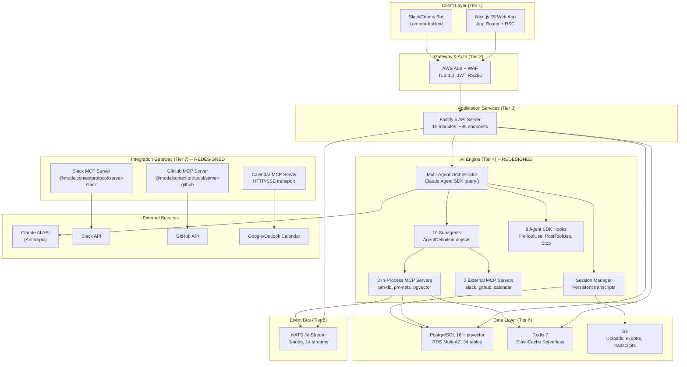

### 3.2 10-Tier ASCII Overview

```
+============================================================================+
|  TIER 1: CLIENT LAYER                                                       |
|  Next.js 15 App Router | (internal) routes | (portal) routes | Slack Bot   |
|  + Kanban (R1) | Calendar (R1) | Table (R1) | Gantt (R2) | Goals (R2)     |
|  + Agent Sessions UI (R0) | Agent Config UI (R1)                           |
+============================================================================+
          |                           |                        |
          v                           v                        v
+============================================================================+
|  TIER 2: GATEWAY & AUTH                                                     |
|  AWS ALB + WAF | JWT (RS256) | RBAC Engine | Tenant Config | WebSocket(R1)|
+============================================================================+
          |
          v
+============================================================================+
|  TIER 3: APPLICATION SERVICES (Fastify 5 Modular Monolith)                  |
|  Project | Task | Dependency | Comment | Audit | User | Projection | Config|
|  + Notification | Goals | Automation | Forms | Documents | Views           |
|  + Agent Management (NEW)                                                   |
+============================================================================+
          |                           |
          v                           v
+============================================================================+
|  TIER 4: AI ENGINE (REDESIGNED -- Claude Agent SDK)                         |
|  Multi-Agent Orchestrator (query()) | 10 Subagents (AgentDefinition)       |
|  6 MCP Servers (pm-db, pm-nats, pgvector, slack, github, calendar)         |
|  8 Hooks (tenant-isolator, autonomy-enforcer, rate-limiter, cost-tracker,  |
|           audit-writer, traceability, notification-hook, session-manager)   |
|  Session Manager (persistent transcripts, resume, fork)                     |
+============================================================================+
          |                           |
          v                           v
+============================================================================+
|  TIER 5: EVENT BUS                                                          |
|  NATS JetStream (3-node) | 14 Streams | 13+ Durable Consumers | DLQ       |
+============================================================================+
          |
          v
+============================================================================+
|  TIER 6: DATABASE                                                           |
|  PostgreSQL 16 + pgvector (RDS) | 34 Tables | Redis 7 (ElastiCache) | S3  |
+============================================================================+
          |
+============================================================================+
|  TIER 7: INTEGRATION GATEWAY (REDESIGNED -- MCP Servers)                    |
|  Slack MCP (stdio) | GitHub MCP (stdio) | Calendar MCP (HTTP/SSE)          |
|  + Webhook System (Fastify plugin, R2) | Jira Import (REST, R2)           |
+============================================================================+

+============================================================================+
|  TIER 8: SECURITY & AI SAFETY                                               |
|  Encryption (AES-256/TLS 1.3) | RLS | Secrets Manager | PII               |
|  + Hook-based AI safety (tenant-isolator, autonomy-enforcer, rate-limiter) |
+============================================================================+

+============================================================================+
|  TIER 9: DEPLOYMENT & CI/CD                                                 |
|  ECS Fargate | AWS CDK (TypeScript) | GitHub Actions | ECR | CloudFront   |
+============================================================================+

+============================================================================+
|  TIER 10: MONITORING & OBSERVABILITY                                        |
|  CloudWatch Metrics/Logs | X-Ray Tracing | Sentry | AI Dashboard          |
|  + Agent metrics (per-subagent latency, hook denial rates, session health) |
+============================================================================+
```

### 3.3 Tier Summary Table

| Tier | Name | Key Technology | What Changed in v4.0 | Related FRs |
|------|------|---------------|---------------------|-------------|
| 1 | Client Layer | Next.js 15, React 19, Shadcn UI | +Agent sessions UI, agent config pages | FR-500-FR-503, FR-201, FR-203 |
| 2 | Gateway & Auth | ALB + WAF, JWT RS256, RBAC | No change from v3.1 | FR-103, FR-104, FR-800-FR-802 |
| 3 | Application Services | Fastify 5, Drizzle ORM, TypeBox | +Agent Management module (+10 endpoints) | FR-102, FR-105-FR-109, FR-2000-FR-2014 |
| 4 | **AI Engine** | **Claude Agent SDK, MCP, Hooks** | **Complete redesign: multi-agent, MCP tools, hooks, sessions** | FR-200-FR-203, FR-300-FR-305, FR-600-FR-607, FR-2013 |
| 5 | Event Bus | NATS JetStream 2.10+ | +2 streams (pm.agent_sessions, pm.agent_hooks), +2 consumers | FR-100 |
| 6 | Database | PostgreSQL 16, pgvector, Redis 7, S3 | +4 tables (ai_agent_configs, ai_sessions, ai_hook_log, ai_session_events) | FR-101, FR-102, NFR-100-NFR-103 |
| 7 | **Integration Gateway** | **MCP servers (Slack, GitHub, Calendar)** | **Redesigned from Fastify plugins to MCP servers** | FR-700-FR-702 |
| 8 | Security & AI Safety | KMS, RLS, Secrets Manager | +Hook-based AI safety layer | FR-800-FR-802, NFR-200-NFR-205 |
| 9 | Deployment & CI/CD | ECS Fargate, CDK, GitHub Actions | +MCP process pool management in AI worker | NFR-300-NFR-303 |
| 10 | Monitoring & Observability | CloudWatch, X-Ray, Sentry | +Per-subagent metrics, hook audit dashboard, session health | FR-400-FR-402 |

---

## 4. Tier 1 -- Client Layer

Carries forward from v3.1 with additions for agent management and session interaction.

| Component | Technology | Release | Purpose |
|-----------|-----------|---------|---------|
| **Web Application** | Next.js 15, App Router, RSC, TypeScript 5+ | R0 | Primary PM interface. AI review/approve UI (F-016), "What's Next" developer view (F-012), NL query panel (F-014), project dashboards. |
| **Kanban Board View** | React DnD, client component | R1 | AI-annotated board view with blocked task flags and priority overlays (F-087). |
| **Calendar View** | Custom calendar grid, client component | R1 | Tasks by due date on month/week/day grid (F-091). |
| **Table View** | Virtualized table, client component | R1 | Spreadsheet-like bulk editing with saved views (F-092). |
| **Gantt Chart View** | Gantt library, AI overlays | R2 | AI-annotated timeline: predicted delays, critical path (F-088). |
| **Notification Inbox** | Client component, WebSocket | R1 | Bell icon with unread count, filter by type (F-096). |
| **Goals Dashboard** | Server + client components | R2 | Goal tree view, OKR hierarchy, auto-calculated progress (F-095). |
| **Agent Sessions Panel** | Client component, streaming | R0 | **NEW.** Multi-turn NL query UI with session resume. Shows agent thinking, tool calls, and results in real-time. Streaming via SSE. |
| **Agent Config UI** | Server + client components | R1 | **NEW.** Admin interface for per-tenant agent configuration: enable/disable agents, set autonomy modes, configure rate limits, view hook logs. |
| **Client Portal** | Next.js 15, route group (`/portal/[tenantSlug]`) | R2 | Client-facing view with AI-generated narratives (F-055, F-059). |
| **Slack / Teams Bot** | Slack Bolt SDK / Teams Bot Framework, Lambda | R1 | AI PM Agent delivery channel (F-036). |
| **Public REST API** | Versioned `/api/v1/`, cursor-based pagination | R2 | External programmatic access (F-063). |

**Route Groups (updated):**

| Route Group | URL Pattern | New in v4.0 | Release |
|-------------|-------------|-------------|---------|
| `(internal)` | `/dashboard`, `/projects/*`, `/tasks/*`, `/ai-review/*`, `/ai-sessions/*`, `/settings/*`, `/settings/agents/*`, `/goals/*` | `/ai-sessions/*`, `/settings/agents/*` | R0 |
| `(portal)` | `/portal/[tenantSlug]/*` | No change | R2 |
| `api/` | `/api/*` | No change | R0 |

---

## 5. Tier 2 -- Gateway and Auth

**Carried forward from v3.1 without modification.** Single entry point for all traffic. Every request is authenticated, tenant-resolved, and rate-limited before reaching application code.

| Component | Technology | Release | Purpose |
|-----------|-----------|---------|---------|
| **API Gateway** | AWS ALB + AWS WAF | R0 | TLS 1.3 termination, request routing, WAF rules for OWASP Top 10. Path-based routing: `/api/*` -> API target group, `/*` -> Web target group. |
| **Authentication Service** | Custom auth module (Fastify plugin), RS256 JWT | R0 | Password auth with bcrypt (R0). SAML/OIDC SSO (R1). MFA via TOTP (R1). JWT carries `tenant_id`, `user_id`, `role` claims. 1h access tokens, 30d refresh with rotation. |
| **RBAC Engine** | Application-layer enforcement + DB check | R0-R3 | Four-stage rollout: Admin + Developer (R0) -> +Client (R2) -> +PM (R3). |
| **Config Service** | Tenant config table + in-memory cache (5min TTL) | R0 | Per-tenant settings: status labels, priority scales, AI model preferences, feature flags, autonomy policy defaults (F-010). |
| **WebSocket Gateway** | Socket.io on Fastify, ALB WebSocket support | R1 | Real-time task board updates, comment streams, AI decision notifications, agent session streaming. |

**Key decisions (unchanged):**

- Custom auth over Auth0/Clerk -- full control over tenant isolation in JWT claims.
- ALB over API Gateway (AWS) -- handles routing and TLS without per-request pricing.
- Session state in Redis (ElastiCache) -- refresh tokens, active session tracking.

---

## 6. Tier 3 -- Application Services

One deployable Fastify 5 API service with **15** well-separated internal modules. Each module owns its domain logic, database queries, and event emissions. They share a process, a database connection pool, and a NATS client. The Agent Management module is new in v4.0.

### 6.1 C4 Level 3 -- API Server Components

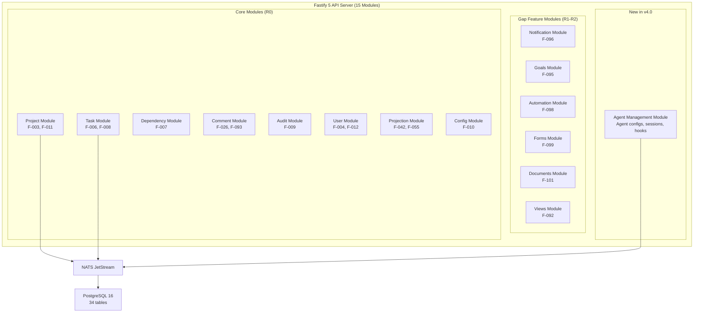

### 6.2 Module Catalog

| Module | Key Responsibilities | Feature Refs | Release |
|--------|---------------------|-------------|---------|
| **Project** | Project CRUD, NL description storage, WBS baseline snapshots (JSONB), phase management. | F-003, F-011 | R0 |
| **Task** | Full task lifecycle: configurable statuses, multiple assignees, effort tracking, `ai_generated` + `ai_confidence` flags, sub-tasks, checklists (F-089), recurring tasks (F-090). | F-006, F-008, F-089, F-090 | R0 |
| **Dependency** | Finish-to-start relationships, circular dependency prevention via DAG traversal. | F-007 | R0 |
| **Comment** | Per-task threads, `client_visible` boolean, @mentions (F-093), action items (F-097). | F-026, F-093, F-097 | R0 |
| **Audit** | Immutable `audit_log` table (INSERT only). Field-level diffs with `actor_type` (user/ai/system/integration). | F-009 | R0 |
| **User** | Tenant-scoped user management, `/users/me/next` endpoint, availability tracking. | F-004, F-012 | R0 |
| **Projection** | Internal truth -> client-safe view transformation. Field-level redaction, narrative generation. | F-042, F-055 | R0/R2 |
| **Config** | Per-tenant settings: status labels, priority levels, phase templates, feature flags, autonomy policies. | F-010 | R0 |
| **Notification** | Notification inbox (F-096), preference management, channel dispatch, reminders (F-103). | F-096, F-103 | R1 |
| **Goals** | Goals and OKR hierarchy, key results, goal-task links, auto-calculated progress. | F-095 | R2 |
| **Automation** | User-configurable if-then rules. Trigger evaluation, action execution. | F-098 | R2 |
| **Forms** | Form builder, public submission endpoint, task creation on submission. | F-099 | R2 |
| **Documents** | Collaborative documents, Markdown content, pgvector indexing for RAG. | F-101 | R2 |
| **Views** | Saved views system, view configurations (columns, sort, filters, grouping). | F-092 | R1 |
| **Agent Management** | **NEW in v4.0.** Agent config CRUD (per-tenant per-capability), session management API (list, resume, fork, expire), hook log queries, agent health metrics. | ADR-013, ADR-016 | R0 |

### 6.3 Agent Management Module -- Endpoint Catalog

| # | Method | Route | Purpose | Release |
|---|--------|-------|---------|---------|
| 1 | GET | `/api/v1/agents/configs` | List all agent configs for tenant | R0 |
| 2 | GET | `/api/v1/agents/configs/:capability` | Get agent config by capability | R0 |
| 3 | PUT | `/api/v1/agents/configs/:capability` | Update agent config (model, max turns, permission mode, hooks) | R0 |
| 4 | GET | `/api/v1/agents/sessions` | List AI sessions for current user (or all, if admin) | R0 |
| 5 | GET | `/api/v1/agents/sessions/:sessionId` | Get session details + transcript summary | R0 |
| 6 | POST | `/api/v1/agents/sessions/:sessionId/resume` | Resume a paused session | R0 |
| 7 | POST | `/api/v1/agents/sessions/:sessionId/fork` | Fork a session (branch conversation) | R1 |
| 8 | DELETE | `/api/v1/agents/sessions/:sessionId` | Expire/close a session | R0 |
| 9 | GET | `/api/v1/agents/hooks/log` | Query hook audit log (admin only) | R1 |
| 10 | GET | `/api/v1/agents/metrics` | Agent health metrics: latency, error rate, acceptance rate | R1 |

### 6.4 Technology Stack

| Choice | Technology | Rationale |
|--------|-----------|-----------|
| Runtime | Node.js 22 LTS | Shared language with Next.js frontend. TypeScript end-to-end. |
| Framework | Fastify 5 | Fastest Node.js HTTP framework. Plugin architecture maps to modules. |
| ORM | Drizzle ORM | TypeScript-first, readable SQL, schema-as-code with versioned migrations. |
| Validation | TypeBox (Fastify native) + Zod (shared with frontend) | Request validation at framework level. |
| Monorepo | Turborepo + pnpm workspaces | `packages/shared` for types, `apps/web`, `apps/api`, `apps/ai-worker`. |
| AI SDK | `@anthropic-ai/claude-agent-sdk` | **NEW.** Multi-agent orchestration, MCP tool servers, hooks, sessions. |

---

## 7. Tier 4 -- AI Engine (REDESIGNED)

This is the product. Every other tier exists to feed data into and execute actions from this tier.

**v4.0 replaces the v3.1 custom 7-stage pipeline with the Claude Agent SDK.** The orchestrator, subagents, MCP servers, hooks, and sessions are all SDK-native constructs.

### 7.1 Architecture Components

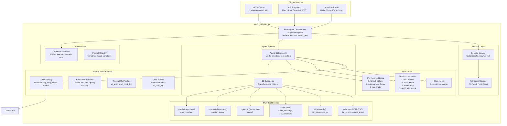

### 7.2 v3.1 vs v4.0 -- Pipeline Mapping

The v3.1 7-stage pipeline maps to v4.0 Agent SDK constructs as follows:

| v3.1 Stage | v4.0 Equivalent | Implementation |
|------------|----------------|----------------|
| 1. TRIGGER | Trigger source routing | `orchestrator.execute(trigger)` with typed `OrchestratorTrigger` |
| 2. AUTONOMY CHECK | PreToolUse hook | `autonomy-enforcer` hook on mutating tool calls |
| 3. CONTEXT ASSEMBLY | Pre-spawn context assembler | `assembleContext()` before `query()` call |
| 4. CONFIDENCE CHECK | Agent-internal reasoning | Subagent system prompts include confidence thresholds |
| 5. LLM CALL | Agent SDK `query()` | SDK manages model routing, retry, streaming |
| 6. POST-PROCESSING | Structured output + PostToolUse hooks | SDK structured output validation + hook chain |
| 7. DISPOSITION | PreToolUse autonomy-enforcer | Shadow/propose/execute enforced at tool boundary |

### 7.3 Orchestrator Sequence

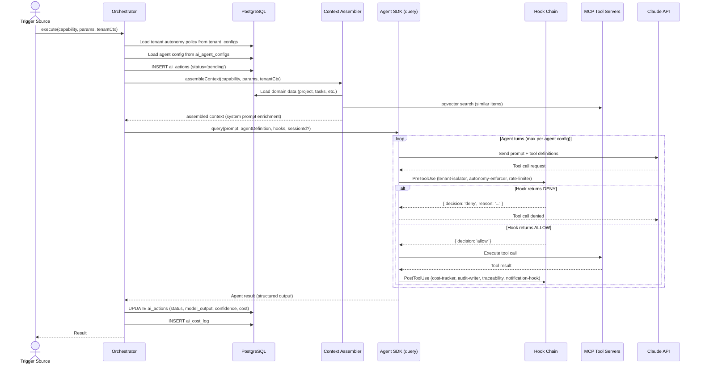

### 7.4 Subagent Catalog (10 Agents)

| Agent | Capability | FR Ref | F Ref | Model | MCP Tools | Permission Mode | Max Turns | Release |
|-------|-----------|--------|-------|-------|-----------|-----------------|-----------|---------|
| `wbs-generator` | NL-to-WBS | FR-200 | F-011 | claude-opus-4-6 | pm-db:query, pm-db:mutate, pgvector:search | acceptEdits | 15 | R0 |
| `whats-next` | What's Next Engine | FR-201 | F-012 | claude-sonnet-4-5 | pm-db:query, pgvector:search | default | 5 | R0 |
| `nl-query` | NL Query | FR-203 | F-014 | claude-sonnet-4-5 | pm-db:query, pgvector:search | default | 10 | R0 |
| `summary-writer` | Daily/Weekly Summary | FR-202 | F-013 | claude-sonnet-4-5 | pm-db:query | default | 5 | R0 |
| `risk-predictor` | Risk Prediction | FR-603 | F-030 | claude-opus-4-6 | pm-db:query, pgvector:search | default | 10 | R1 |
| `ai-pm-agent` | AI PM Agent | FR-601 | F-028 | claude-sonnet-4-5 | pm-db:query, pm-db:mutate, pm-nats:publish, slack:send_message | acceptEdits | 25 | R1 |
| `scope-detector` | Scope Creep Detector | FR-607 | F-034 | claude-sonnet-4-5 | pm-db:query, pgvector:search | default | 10 | R1 |
| `writing-assistant` | AI Writing | FR-2013 | F-102 | claude-sonnet-4-5 | pm-db:query | default | 10 | R2 |
| `sow-generator` | SOW Generator | FR-1800 | F-083 | claude-opus-4-6 | pm-db:query, pgvector:search | default | 15 | R3 |
| `learning-agent` | Per-Tenant Learning | FR-1600 | F-074 | claude-sonnet-4-5 | pm-db:query, pgvector:search | default | 15 | R3 |

### 7.5 MCP Tool Server Topology

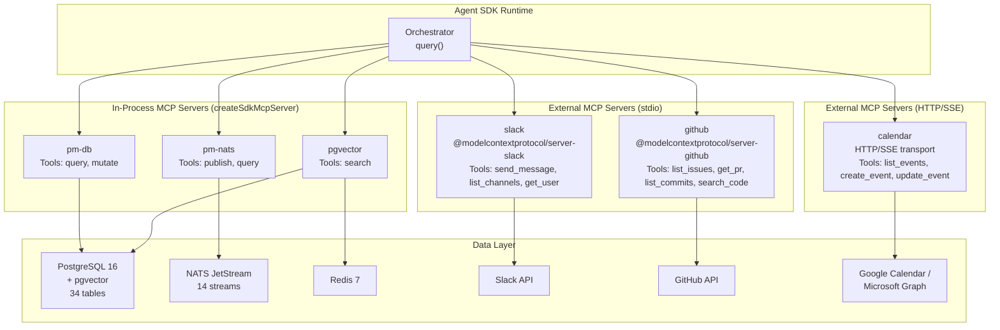

### 7.6 MCP Server Catalog

| Server | Transport | Tools | Tenant Isolation | Release |
|--------|-----------|-------|-----------------|---------|
| **pm-db** | In-process (SDK) | `query` (read-only SELECT), `mutate` (INSERT/UPDATE/DELETE + NATS event emission) | `SET LOCAL app.current_tenant_id` per call + RLS + tenant-isolator hook | R0 |
| **pm-nats** | In-process (SDK) | `publish` (emit to NATS stream), `query` (read recent events from stream) | `tenant_id` injected into every event payload | R0 |
| **pgvector** | In-process (SDK) | `search` (cosine similarity on embeddings, text-embedding-3-small 1536d) | `WHERE tenant_id = :id` in every embedding query | R0 |
| **slack** | stdio (child process) | `send_message`, `list_channels`, `get_user` | Per-tenant SLACK_BOT_TOKEN from tenant_configs | R1 |
| **github** | stdio (child process) | `list_issues`, `get_pr`, `list_commits`, `search_code` | Per-tenant GITHUB_TOKEN from tenant_configs | R1 |
| **calendar** | HTTP/SSE | `list_events`, `create_event`, `update_event` | Per-tenant OAuth2 token from tenant_configs | R2 |

### 7.7 Hook Architecture

Eight hooks execute in a deterministic order. PreToolUse hooks run sequentially before any tool call (any deny aborts). PostToolUse hooks run in parallel after the tool call. The Stop hook fires when the agent loop ends.

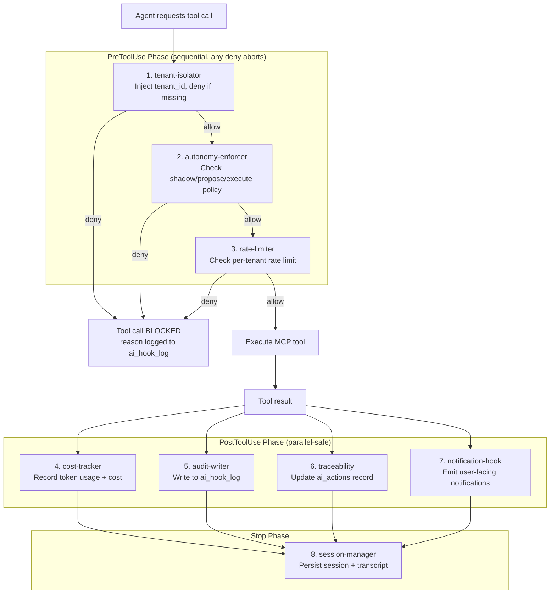

### 7.8 Hook Catalog

| # | Hook | Event | Matcher | Purpose | Key Behavior |
|---|------|-------|---------|---------|-------------|
| 1 | `tenant-isolator` | PreToolUse | `mcp__(pm-db\|pgvector)__*` | Injects tenant_id into DB/vector tool calls | DENY if no tenant context or tenant_id mismatch |
| 2 | `autonomy-enforcer` | PreToolUse | `mcp__(pm-db__mutate\|pm-nats__publish\|slack__)` | Enforces shadow/propose/execute per autonomy policy | Shadow: log + DENY. Propose: create proposal + DENY. Execute: ALLOW. Checks quiet hours for Slack. |
| 3 | `rate-limiter` | PreToolUse | `.*` (all tools) | Per-tenant rate limit on AI tool calls | Redis sliding window counter. Default: 100 tool calls/hour/tenant. |
| 4 | `cost-tracker` | PostToolUse | `.*` (all tools) | Records token usage and USD cost | Inserts ai_cost_log. Checks monthly budget (alert at 80%, block at 100%). |
| 5 | `audit-writer` | PostToolUse | `.*` (all tools) | Writes every tool call to ai_hook_log | Complete audit trail: tool_name, decision, latency, metadata. |
| 6 | `traceability` | PostToolUse | `.*` (all tools) | Updates ai_actions with actions_proposed | Only for mutation tools. Appends to actions_proposed JSONB array. |
| 7 | `notification-hook` | PostToolUse | `mcp__pm-db__mutate` | Emits NATS notification events for AI mutations | Maps table+operation to user-facing notification messages. |
| 8 | `session-manager` | Stop | N/A | Persists session state and transcript | Upserts ai_sessions. Saves transcript to S3 (prod) or disk (dev). |

### 7.9 Session Management

Sessions enable multi-turn AI interactions (NL queries, writing assistance) with conversation context preservation.

**Session lifecycle:**

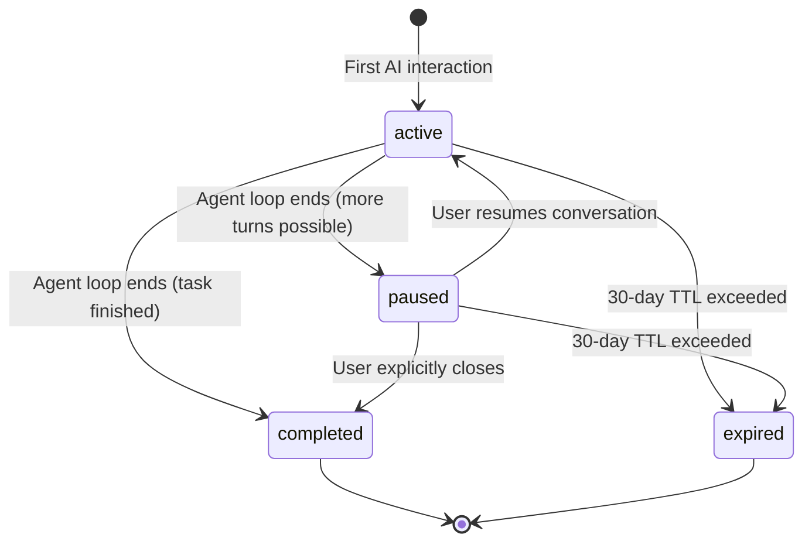

**Session configuration:**

| Parameter | Default | Configurable Via | Description |
|-----------|---------|-----------------|-------------|
| `session_ttl_days` | 30 | `tenant_configs` | Days before inactive sessions expire |
| `max_transcript_size_mb` | 10 | `tenant_configs` | Maximum transcript file size |
| `max_turns_per_session` | 100 | `ai_agent_configs` | Turn limit per session |
| `session_storage` | local disk | Environment variable | `local` (dev) or `s3` (prod) |
| `auto_expire_cron` | daily 03:00 UTC | Hardcoded | Background job to expire stale sessions |

**Session storage tiers:**

| Layer | Technology | Purpose |
|-------|-----------|---------|
| Hot sessions | Redis (ElastiCache) | Active session metadata, fast lookup, TTL-based expiry |
| Warm sessions | PostgreSQL (ai_sessions table) | Durable session records, queryable history |
| Cold transcripts | S3 (transcripts bucket) | Full conversation transcripts, cost-effective storage |

### 7.10 Permission Evaluation Chain

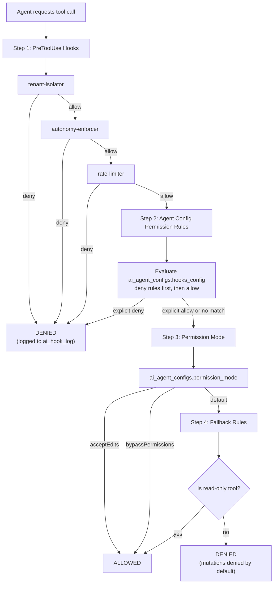

**Permission mode definitions:**

| Mode | Reads (pm-db:query, pgvector:search) | Mutations (pm-db:mutate, pm-nats:publish) | External (slack:*, github:*) |
|------|--------------------------------------|-------------------------------------------|------------------------------|
| `default` | Allow | Deny (unless autonomy-enforcer allows) | Deny |
| `acceptEdits` | Allow | Allow (subject to autonomy policy) | Allow (subject to autonomy policy) |
| `bypassPermissions` | Allow | Allow (no autonomy check) | Allow (no autonomy check) |

`bypassPermissions` is reserved for system-level operations (e.g., scheduled embedding pipeline). Never used for user-facing agents. Tenant admins cannot configure agents with `bypassPermissions`.

### 7.11 Context Assembly

Before spawning a subagent, the orchestrator assembles context from multiple sources. This replaces Stage 3 (CONTEXT ASSEMBLY) from the v3.1 pipeline.

**Token budget allocation:**

| Context Source | Budget % | Description |
|---------------|----------|-------------|
| RAG results | 40% | pgvector cosine similarity, tenant-scoped, top-k=10 |
| Event history | 20% | Last 7 days of relevant NATS events |
| Domain data | 30% | Project, tasks, custom fields, documents |
| User prompt | 10% | Original user input |

**Context sources by capability:**

| Capability | RAG Sources | Event Subjects | Domain Data |
|-----------|-------------|----------------|-------------|
| wbs-generator | Similar projects, documents | pm.projects.*, pm.tasks.created | Project description, team, custom fields |
| whats-next | Similar task completions | pm.tasks.*, pm.integrations.* | User assignments, dependencies, velocity |
| nl-query | Tasks, comments, documents | pm.tasks.*, pm.comments.* | Full project context |
| summary-writer | None (data-driven) | pm.tasks.*, pm.comments.*, pm.projects.* | Period activity aggregation |
| risk-predictor | Historical risk patterns | pm.tasks.*, pm.goals.* | Velocity, blockers, dependency chains |
| ai-pm-agent | None (real-time) | pm.tasks.status_changed | Overdue tasks, stalled work, assignments |
| scope-detector | WBS baseline embeddings | pm.tasks.created | WBS baseline, current task set |
| sow-generator | Past SOWs, delivery patterns | pm.projects.* | Project structure, resource data |
| writing-assistant | Project documents, comments | None | Task context, project terminology |
| learning-agent | Historical projects | pm.tasks.*, pm.projects.* | Completed project data, effort actuals |

### 7.12 Shared AI Infrastructure

| Component | Technology | Purpose |
|-----------|-----------|---------|
| **LLM Gateway** | TypeScript module wrapping Anthropic SDK | Model routing (Opus for generation/risk, Sonnet for queries/summaries). Retry with exponential backoff + fallback. Circuit breaker: 5 consecutive failures -> 60s open state. |
| **Prompt Registry** | Versioned YAML files (`/prompts/{capability}/v{N}.yaml`) | Central prompt templates with context injection. Schema validation for output format. Version-pinned per capability. |
| **Evaluation Harness** | Golden test sets + acceptance tracking | Quality checks on every prompt version change. Tracks: acceptance rate (<60% triggers review), override rate (>40% = miscalibration). |
| **Traceability Pipeline** | `ai_actions` + `ai_hook_log` tables | Every AI action logged: trigger -> context -> prompt hash -> output -> confidence -> disposition -> review -> rollback. |
| **Cost Tracker** | Redis counters + `ai_cost_log` table | Per-operation: input/output tokens, USD cost, model, capability, tenant_id. Per-tenant monthly budget caps with pre-flight check. |

---

## 8. Tier 5 -- Event Bus

The nervous system. Every AI capability, every integration, and every observability pipeline consumes from this bus. v4.0 adds 2 new streams for agent lifecycle events.

### 8.1 NATS JetStream Configuration

| Attribute | Value |
|-----------|-------|
| **Version** | NATS 2.10+ |
| **Deployment** | 3-node cluster on ECS Fargate with EFS for JetStream persistence |
| **Retention** | 30-day message retention per stream |
| **Delivery** | At-least-once delivery guarantee |
| **Max message size** | 1MB |
| **Storage** | File-based (EFS mount) for persistence across container restarts |
| **Cluster discovery** | ECS Service Discovery (Cloud Map) |

### 8.2 Stream Topology (14 Streams)

| Stream | Subjects | Producers | Key Consumers | New in v4.0 |
|--------|----------|-----------|---------------|-------------|
| `pm.tasks` | `.created`, `.updated`, `.status_changed`, `.assigned`, `.completed`, `.dependency_resolved`, `.dependency_blocked`, `.checklist_updated`, `.recurrence_triggered`, `.custom_field_updated` | Task Module, Recurrence Scheduler | AI Adaptive, Audit Writer, Embedding Pipeline, Notification Gen, Projection Updater, Automation Engine | -- |
| `pm.projects` | `.created`, `.updated`, `.phase_changed`, `.baseline_set` | Project Module | AI Summarizer, Embedding Pipeline, Scope Creep Detector | -- |
| `pm.comments` | `.created`, `.updated`, `.deleted`, `.mention_created`, `.action_assigned` | Comment Module | Embedding Pipeline, Notification Gen, Automation Engine | -- |
| `pm.ai` | `.action_proposed`, `.action_approved`, `.action_rejected`, `.action_executed`, `.confidence_low` | AI Orchestrator | Traceability Pipeline, Cost Tracker, Evaluation Harness | -- |
| `pm.integrations` | `.git_commit`, `.git_pr_merged`, `.slack_message`, `.calendar_updated` | MCP Servers (via hooks) | AI Adaptive, Task Module | -- |
| `pm.notifications` | `.created` | Notification Generator | Notification Router | -- |
| `pm.reminders` | `.due` | Reminder Scheduler (pg_cron) | Notification Gen | -- |
| `pm.goals` | `.progress_updated`, `.at_risk` | Goals Module | Notification Gen, AI Adaptive | -- |
| `pm.automations` | `.triggered`, `.executed` | Automation Engine | Audit Writer, Cost Tracker | -- |
| `pm.forms` | `.submitted` | Forms Module | Task Module, Notification Gen | -- |
| `pm.documents` | `.created`, `.updated` | Documents Module | Embedding Pipeline, Notification Gen | -- |
| `pm.system` | `.config_changed`, `.tenant_created`, `.user_invited`, `.budget_alert` | Config, User Modules, Cost Tracker | Config Cache Invalidation, Notification Router | +`.budget_alert` |
| **`pm.agent_sessions`** | `.created`, `.resumed`, `.paused`, `.completed`, `.expired`, `.forked` | Session Manager (hook) | Session Cleanup Job, Agent Metrics | **NEW** |
| **`pm.agent_hooks`** | `.denied`, `.allowed`, `.rate_limited`, `.budget_exceeded` | Hook Chain | Agent Metrics Dashboard, Alerting | **NEW** |

### 8.3 Durable Consumers (13)

| Consumer | Subscribes To | Purpose | Release | New in v4.0 |
|----------|--------------|---------|---------|-------------|
| `audit-writer` | `pm.tasks.*`, `pm.projects.*`, `pm.comments.*`, `pm.ai.*` | Writes immutable audit log entries | R0 | -- |
| `ai-adaptive` | `pm.tasks.*`, `pm.integrations.*` | Feeds task state changes to adaptive task engine | R0/R1 | -- |
| `ai-summarizer` | `pm.tasks.*`, `pm.projects.*`, `pm.comments.*` | Aggregates activity for summary generation | R0 | -- |
| `embedding-pipeline` | `pm.tasks.created`, `pm.tasks.updated`, `pm.comments.created`, `pm.projects.created`, `pm.documents.*` | Generates embeddings for pgvector | R0 | -- |
| `projection-updater` | `pm.tasks.*`, `pm.projects.*`, `pm.comments.*` | Updates client-facing projection views | R0/R2 | -- |
| `notification-router` | `pm.notifications.created`, `pm.tasks.assigned`, etc. | Routes notifications to channels | R0/R1 | -- |
| `cost-tracker` | `pm.ai.*` | Tracks AI operation costs per tenant | R0 | -- |
| `escalation-monitor` | `pm.tasks.status_changed`, `pm.tasks.dependency_blocked` | Monitors for escalation conditions | R1 | -- |
| `notification-generator` | `pm.tasks.*`, `pm.comments.*`, `pm.ai.*`, `pm.reminders.*`, `pm.goals.*` | Creates notification records | R1 | -- |
| `recurrence-scheduler` | `pm.tasks.recurrence_triggered` | Clones recurring tasks | R1 | -- |
| `automation-engine` | `pm.tasks.*`, `pm.comments.*` | Evaluates user-defined automation rules | R2 | -- |
| **`agent-session-cleanup`** | `pm.agent_sessions.expired` | Cleans up expired sessions, archives transcripts to Glacier | R0 | **NEW** |
| **`agent-metrics-aggregator`** | `pm.agent_hooks.*`, `pm.agent_sessions.*` | Aggregates hook events and session data into CloudWatch metrics | R0 | **NEW** |

### 8.4 Event Flow Diagram

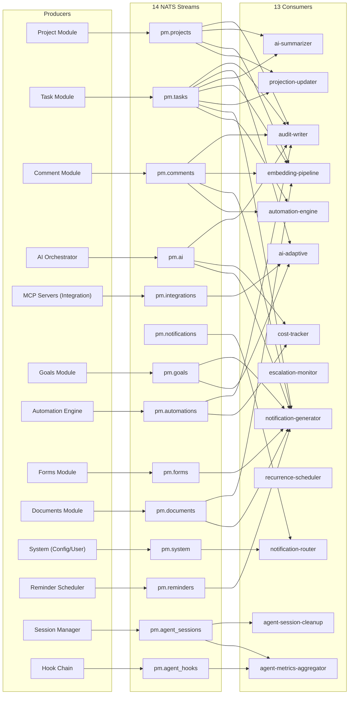

### 8.5 DLQ Strategy (unchanged from v3.1)

| Aspect | Configuration |
|--------|---------------|
| **Retry policy** | 3 retries with exponential backoff: 1s, 5s, 25s |
| **DLQ per consumer** | Dedicated DLQ stream per consumer |
| **DLQ retention** | 7 days |
| **DLQ monitoring** | CloudWatch alarm on DLQ message count > 0 |
| **DLQ replay** | Manual replay via admin CLI tool |

---

## 9. Tier 6 -- Database

One database, stretched intelligently. v4.0 adds 4 tables for Agent SDK metadata, bringing the total to 34.

### 9.1 Storage Components

| Component | AWS Service | Configuration | Purpose |
|-----------|-------------|---------------|---------|
| **PostgreSQL 16** | RDS (Multi-AZ) | R0: `db.r6g.large` (2 vCPU, 16 GB). R2: `db.r6g.xlarge` + read replica. | Primary relational store. 34 tables. JSONB for WBS baselines, AI action metadata, configurable fields. |
| **pgvector** | Co-located in RDS | `text-embedding-3-small` (1536 dims). IVFFlat index R0-R2, HNSW at R3. | Embeddings for tasks, comments, project descriptions, documents. |
| **Redis 7** | ElastiCache Serverless | AOF persistence + hourly snapshots. | Session storage, rate limiting, AI queues, config cache, AI response cache, agent session hot cache. |
| **S3** | S3 Standard + S3 Glacier | 5 buckets: `uploads`, `exports`, `reports`, `backups`, `transcripts`. | File attachments, exports, report PDFs, database backups, agent session transcripts. |
| **Full-Text Search** | PostgreSQL FTS | `tsvector` columns on tasks, projects, comments, documents. GIN indexes. | Search across all text content. |

### 9.2 Complete Table Catalog (34 Tables)

| # | Table | FR Ref | Release | Est. Rows (R3) | RLS | Notes |
|---|-------|--------|---------|----------------|-----|-------|
| 1 | `tenants` | FR-101 | R0 | ~10 | No | Queried by super admin |
| 2 | `users` | FR-103 | R0 | ~200 | Yes | (tenant_id, email) unique |
| 3 | `projects` | FR-102 | R0 | ~100 | Yes | JSONB wbs_baseline |
| 4 | `phases` | FR-102 | R0 | ~500 | Yes | Per-project ordering |
| 5 | `tasks` | FR-105 | R0 | ~100K | Yes | FTS via tsvector, recurrence columns (R1) |
| 6 | `task_assignments` | FR-105 | R0 | ~150K | Yes | Roles: assignee, reviewer, approver |
| 7 | `task_dependencies` | FR-106 | R0 | ~50K | Yes | Finish-to-start only |
| 8 | `comments` | FR-503 | R0 | ~200K | Yes | FTS, action item columns (R1) |
| 9 | `tags` | FR-1100 | R1 | ~500 | Yes | Project or tenant scope |
| 10 | `task_tags` | FR-1100 | R1 | ~300K | Yes | Junction table |
| 11 | `ai_actions` | FR-400 | R0 | ~50K | Yes | Full AI traceability |
| 12 | `ai_cost_log` | FR-1000 | R0 | ~100K | Yes | Per-operation cost tracking |
| 13 | `audit_log` | FR-108 | R0 | ~1M+ | Yes | Partitioned by month, INSERT only |
| 14 | `tenant_configs` | FR-109 | R0 | ~100 | Yes | Key-value JSONB config |
| 15 | `embeddings` | FR-200 | R0 | ~500K | Yes | IVFFlat vector index |
| 16 | `task_checklists` | FR-2000 | R0 | ~50K | Yes | Per-task checklists |
| 17 | `checklist_items` | FR-2000 | R0 | ~200K | Yes | Checklist items with completion |
| 18 | `mentions` | FR-2004 | R0 | ~100K | Yes | Comment @mentions |
| 19 | `custom_field_definitions` | FR-2005 | R1 | ~1K | Yes | Polymorphic field types |
| 20 | `custom_field_values` | FR-2005 | R1 | ~500K | Yes | Per-task field values |
| 21 | `saved_views` | FR-2003 | R1 | ~2K | Yes | View configs (JSONB) |
| 22 | `goals` | FR-2006 | R2 | ~1K | Yes | Self-referencing hierarchy |
| 23 | `goal_task_links` | FR-2006 | R2 | ~10K | Yes | Goal-task junction |
| 24 | `notifications` | FR-2007 | R1 | ~500K | Yes | Evaluate partitioning at 1M |
| 25 | `notification_preferences` | FR-2007 | R1 | ~2K | Yes | Per-user, per-type, per-channel |
| 26 | `automation_rules` | FR-2009 | R2 | ~500 | Yes | Trigger + action config (JSONB) |
| 27 | `forms` | FR-2010 | R2 | ~200 | Yes | Field definitions (JSONB), public slug |
| 28 | `documents` | FR-2012 | R2 | ~10K | Yes | Markdown, FTS, client_visible |
| 29 | `reminders` | FR-2014 | R1 | ~20K | Yes | Partial index on unsent |
| 30 | `tasks` (extensions) | FR-2001 | R1 | -- | -- | Recurrence + action item columns |
| **31** | **`ai_agent_configs`** | ADR-013 | R0 | ~100 | Yes | **NEW: Per-tenant per-capability agent configuration** |
| **32** | **`ai_sessions`** | ADR-016 | R0 | ~50K | Yes | **NEW: Agent SDK session metadata and lifecycle** |
| **33** | **`ai_hook_log`** | ADR-015 | R0 | ~500K | Yes | **NEW: Complete audit trail of all hook evaluations** |
| **34** | **`ai_session_events`** | ADR-016 | R0 | ~200K | Yes | **NEW: Per-session tool call events for replay** |

### 9.3 DDL for 4 New Tables

```sql
-- Table 31: AI Agent Configs (NEW in v4.0)
CREATE TABLE ai_agent_configs (
  id                UUID PRIMARY KEY DEFAULT gen_random_uuid(),
  tenant_id         UUID NOT NULL REFERENCES tenants(id),
  capability        VARCHAR(100) NOT NULL,
  model_override    VARCHAR(100),
  max_turns         INTEGER NOT NULL DEFAULT 10,
  token_budget      INTEGER NOT NULL DEFAULT 8000,
  permission_mode   VARCHAR(20) NOT NULL DEFAULT 'default'
    CHECK (permission_mode IN ('default', 'acceptEdits', 'bypassPermissions')),
  hooks_config      JSONB NOT NULL DEFAULT '{}',
  enabled           BOOLEAN NOT NULL DEFAULT true,
  created_at        TIMESTAMPTZ NOT NULL DEFAULT now(),
  updated_at        TIMESTAMPTZ NOT NULL DEFAULT now()
);
CREATE UNIQUE INDEX idx_ai_agent_configs_tenant_cap
  ON ai_agent_configs(tenant_id, capability);

-- Table 32: AI Sessions (NEW in v4.0)
CREATE TABLE ai_sessions (
  id                UUID PRIMARY KEY DEFAULT gen_random_uuid(),
  tenant_id         UUID NOT NULL REFERENCES tenants(id),
  user_id           UUID NOT NULL REFERENCES users(id),
  capability        VARCHAR(100) NOT NULL,
  status            VARCHAR(20) NOT NULL DEFAULT 'active'
    CHECK (status IN ('active', 'paused', 'completed', 'expired')),
  parent_session_id UUID REFERENCES ai_sessions(id),
  transcript_path   TEXT,
  turn_count        INTEGER NOT NULL DEFAULT 0,
  last_active_at    TIMESTAMPTZ NOT NULL DEFAULT now(),
  expires_at        TIMESTAMPTZ NOT NULL DEFAULT (now() + INTERVAL '30 days'),
  metadata          JSONB NOT NULL DEFAULT '{}',
  created_at        TIMESTAMPTZ NOT NULL DEFAULT now(),
  updated_at        TIMESTAMPTZ NOT NULL DEFAULT now()
);
CREATE INDEX idx_ai_sessions_tenant_user
  ON ai_sessions(tenant_id, user_id, capability);
CREATE INDEX idx_ai_sessions_status
  ON ai_sessions(tenant_id, status, expires_at);

-- Table 33: AI Hook Log (NEW in v4.0)
CREATE TABLE ai_hook_log (
  id                UUID PRIMARY KEY DEFAULT gen_random_uuid(),
  tenant_id         UUID NOT NULL REFERENCES tenants(id),
  ai_action_id      UUID REFERENCES ai_actions(id),
  hook_name         VARCHAR(100) NOT NULL,
  event_type        VARCHAR(50) NOT NULL,
  tool_name         VARCHAR(200),
  decision          VARCHAR(20) NOT NULL
    CHECK (decision IN ('allow', 'deny', 'modify', 'log')),
  reason            TEXT,
  latency_ms        INTEGER,
  metadata          JSONB NOT NULL DEFAULT '{}',
  created_at        TIMESTAMPTZ NOT NULL DEFAULT now()
);
CREATE INDEX idx_ai_hook_log_tenant_action
  ON ai_hook_log(tenant_id, ai_action_id);
CREATE INDEX idx_ai_hook_log_tenant_hook
  ON ai_hook_log(tenant_id, hook_name, created_at);

-- Table 34: AI Session Events (NEW in v4.0)
CREATE TABLE ai_session_events (
  id                UUID PRIMARY KEY DEFAULT gen_random_uuid(),
  tenant_id         UUID NOT NULL REFERENCES tenants(id),
  session_id        UUID NOT NULL REFERENCES ai_sessions(id),
  turn_number       INTEGER NOT NULL,
  event_type        VARCHAR(50) NOT NULL
    CHECK (event_type IN ('user_message', 'agent_message', 'tool_call', 'tool_result', 'hook_deny', 'error')),
  tool_name         VARCHAR(200),
  input_data        JSONB,
  output_data       JSONB,
  token_usage       JSONB,
  latency_ms        INTEGER,
  created_at        TIMESTAMPTZ NOT NULL DEFAULT now()
);
CREATE INDEX idx_ai_session_events_session
  ON ai_session_events(session_id, turn_number);
CREATE INDEX idx_ai_session_events_tenant
  ON ai_session_events(tenant_id, created_at);
```

**RLS policies for all 4 new tables:**

```sql
ALTER TABLE ai_agent_configs ENABLE ROW LEVEL SECURITY;
CREATE POLICY tenant_isolation ON ai_agent_configs
  USING (tenant_id = current_setting('app.current_tenant_id')::uuid);

ALTER TABLE ai_sessions ENABLE ROW LEVEL SECURITY;
CREATE POLICY tenant_isolation ON ai_sessions
  USING (tenant_id = current_setting('app.current_tenant_id')::uuid);

ALTER TABLE ai_hook_log ENABLE ROW LEVEL SECURITY;
CREATE POLICY tenant_isolation ON ai_hook_log
  USING (tenant_id = current_setting('app.current_tenant_id')::uuid);

ALTER TABLE ai_session_events ENABLE ROW LEVEL SECURITY;
CREATE POLICY tenant_isolation ON ai_session_events
  USING (tenant_id = current_setting('app.current_tenant_id')::uuid);
```

### 9.4 Entity-Relationship Diagram (34 Tables)

```mermaid
erDiagram
    tenants ||--o{ users : "has"
    tenants ||--o{ projects : "has"
    tenants ||--o{ tenant_configs : "configured by"
    tenants ||--o{ goals : "tracks"
    tenants ||--o{ automation_rules : "defines"
    tenants ||--o{ forms : "creates"
    tenants ||--o{ ai_agent_configs : "configures agents"
    tenants ||--o{ ai_sessions : "has sessions"
    tenants ||--o{ ai_hook_log : "logs hooks"

    users ||--o{ task_assignments : "assigned to"
    users ||--o{ comments : "writes"
    users ||--o{ notifications : "receives"
    users ||--o{ notification_preferences : "configures"
    users ||--o{ saved_views : "saves"
    users ||--o{ reminders : "sets"
    users ||--o{ documents : "authors"
    users ||--o{ ai_sessions : "owns"

    projects ||--o{ phases : "contains"
    projects ||--o{ tasks : "contains"
    projects ||--o{ tags : "scopes"
    projects ||--o{ custom_field_definitions : "defines"
    projects ||--o{ forms : "accepts via"
    projects ||--o{ documents : "stores"

    phases ||--o{ tasks : "groups"

    tasks ||--o{ task_assignments : "has"
    tasks ||--o{ task_dependencies : "blocks/blocked by"
    tasks ||--o{ comments : "discussed in"
    tasks ||--o{ task_tags : "tagged with"
    tasks ||--o{ task_checklists : "contains"
    tasks ||--o{ custom_field_values : "has"
    tasks ||--o{ goal_task_links : "linked to"
    tasks ||--o{ reminders : "reminded via"
    tasks ||--o{ tasks : "parent/sub-task"

    task_checklists ||--o{ checklist_items : "contains"
    comments ||--o{ mentions : "references"
    goals ||--o{ goal_task_links : "tracks"
    goals ||--o{ goals : "parent/child"

    ai_actions ||--o{ ai_cost_log : "costed at"
    ai_actions ||--o{ audit_log : "logged in"
    ai_actions ||--o{ ai_hook_log : "hooks logged"

    ai_sessions ||--o{ ai_session_events : "contains events"
    ai_sessions ||--o{ ai_sessions : "parent/fork"
    ai_agent_configs ||--o{ ai_sessions : "configures"
```

### 9.5 Row-Level Security (RLS)

Every tenant-scoped table (all 34 except `tenants`) has an RLS policy:

```sql
CREATE POLICY tenant_isolation ON <table_name>
  USING (tenant_id = current_setting('app.current_tenant_id')::uuid);
```

The API middleware sets `app.current_tenant_id` per request from the JWT claim before any query executes. The `tenant-isolator` hook additionally injects tenant_id into every MCP tool call. Three layers of isolation: JWT -> RLS -> Hook.

### 9.6 Indexing Strategy

Carried forward from v3.1, with additions:

- `tenant_id` as the first column in every composite index
- Soft deletes (`deleted_at` timestamp) on all user-facing entities
- `created_at` and `updated_at` auto-managed via Drizzle defaults
- `ai_generated` boolean + `ai_confidence` float on tasks and comments
- `audit_log`: INSERT-only, partitioned by month
- GIN indexes on all `tsvector` columns
- IVFFlat index on embeddings (evaluate HNSW at R3)
- Partial indexes on active queries (e.g., `ai_sessions WHERE status IN ('active', 'paused')`)
- **NEW:** `ai_hook_log` indexed by `(tenant_id, hook_name, created_at)` for hook audit queries
- **NEW:** `ai_session_events` indexed by `(session_id, turn_number)` for transcript replay

---

## 10. Tier 7 -- Integration Gateway (REDESIGNED)

v3.1 used Fastify plugins as integration adapters. v4.0 replaces the three primary integrations (Slack, GitHub, Calendar) with MCP servers that agents call directly via the standard MCP protocol. Non-agent integrations (Webhooks, Jira Import) remain as Fastify plugins.

### 10.1 MCP-Based Integrations (NEW)

| Integration | MCP Server | Transport | Auth | Tools | Release |
|-------------|-----------|-----------|------|-------|---------|
| **Slack** | `@modelcontextprotocol/server-slack` | stdio (child process) | Per-tenant SLACK_BOT_TOKEN from tenant_configs | `send_message`, `list_channels`, `get_user` | R1 |
| **GitHub** | `@modelcontextprotocol/server-github` | stdio (child process) | Per-tenant GITHUB_TOKEN from tenant_configs | `list_issues`, `get_pr`, `list_commits`, `search_code` | R1 |
| **Calendar** | Custom MCP server (HTTP/SSE) | HTTP/SSE | Per-tenant OAuth2 token from tenant_configs | `list_events`, `create_event`, `update_event` | R2 |

**Key architectural change:** In v3.1, integrations were Fastify plugins that normalized external events into NATS subjects. In v4.0, agents call external services directly through MCP tool servers. The `notification-hook` (PostToolUse) handles emitting NATS events for downstream consumers when agents interact with external services.

### 10.2 Non-MCP Integrations (Fastify Plugins, unchanged)

| Integration | Protocol | Release | Purpose |
|-------------|----------|---------|---------|
| **Webhook System (outbound)** | Tenant-configurable subscriptions | R2 | Event notifications to external URLs. Retry with exponential backoff. HMAC-SHA256 signature. |
| **Jira Import** | REST API batch migration | R2 | One-time inbound migration: projects, tasks, dependencies, comments. |

### 10.3 MCP Process Pool Management

External MCP servers (Slack, GitHub) are spawned as child processes. To avoid per-request process creation overhead:

| Parameter | Value |
|-----------|-------|
| **Pool size** | 1 process per tenant per MCP server type (max 3 per tenant) |
| **Idle timeout** | 5 minutes -- idle processes terminated |
| **Health check** | Heartbeat every 30 seconds, restart on failure |
| **Tenant isolation** | Each process initialized with tenant-specific tokens; never shared across tenants |
| **Startup latency** | ~2s cold start; pooling avoids this on subsequent calls |

---

## 11. Tier 8 -- Security and AI Safety

Security is structural in this architecture. v4.0 adds hook-based AI safety as a fourth layer on top of the existing three-layer tenant isolation model.

### 11.1 Security Controls

| Control | Implementation | Release |
|---------|---------------|---------|
| **Encryption at rest** | AES-256 via AWS KMS. RDS encrypted storage. S3 SSE. ElastiCache encryption. | R0 |
| **Encryption in transit** | TLS 1.3 on all connections. | R0 |
| **Tenant isolation** | PostgreSQL RLS + JWT tenant_id claims + Per-request context setting + **tenant-isolator hook**. | R0 |
| **Secrets management** | AWS Secrets Manager for DB credentials, API keys, JWT signing keys. Auto-rotated. | R0 |
| **Immutable audit trail** | `audit_log` table (INSERT only) + `ai_hook_log` table (INSERT only). | R0 |
| **PII handling** | `client_visible=false` redacted before LLM ingestion. Emails hashed in logs. | R1 |
| **Prompt injection defense** | Input sanitization before context assembly. Tenant data in structured fields. Output validation. | R2 |
| **AI cross-tenant leakage prevention** | RAG scoped by tenant_id. Embedding queries include tenant filter. MCP tool calls scoped by tenant-isolator hook. | R0 |
| **AI autonomy enforcement** | `autonomy-enforcer` hook gates all mutating tool calls. Shadow/propose/execute per capability per tenant. | R0 |
| **AI rate limiting** | `rate-limiter` hook enforces per-tenant rate limits on all AI tool calls. Redis sliding window. | R0 |
| **SOC 2 Type I** | Access controls, change management, data protection, monitoring, incident response. | R2 |
| **SOC 2 Type II** | 6-month sustained evidence collection. | R3 |

### 11.2 Four-Layer Tenant Isolation

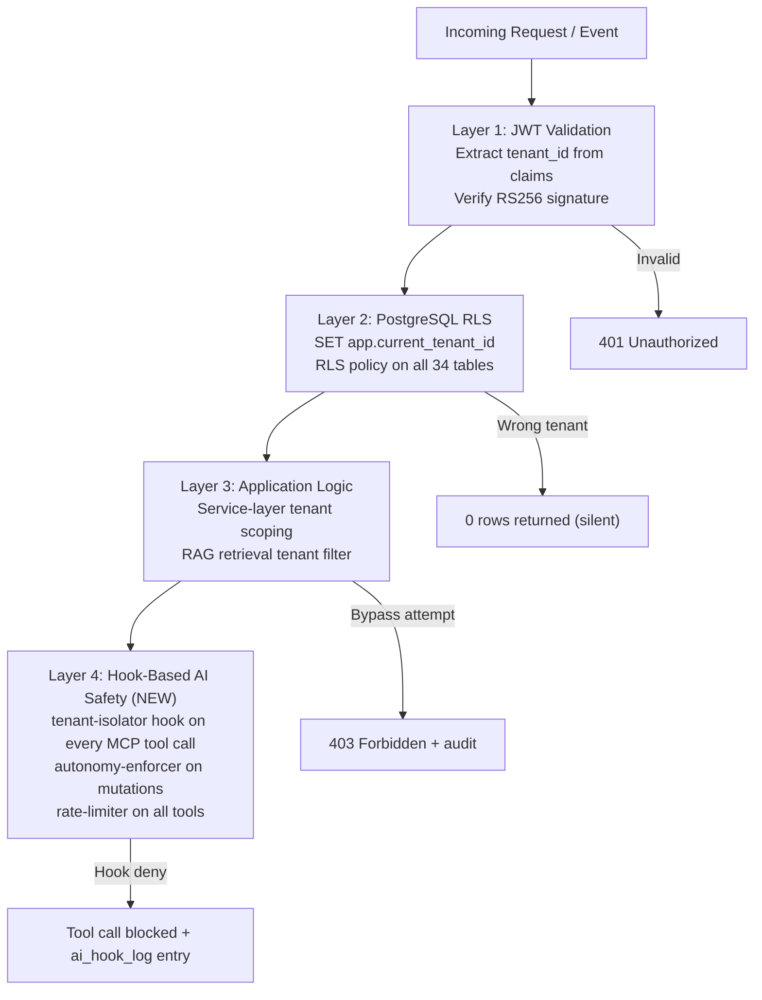

---

## 12. Tier 9 -- Deployment and CI/CD

Optimized for a small team on AWS. v4.0 adds MCP process pool management to the AI worker service.

### 12.1 AWS Deployment Topology

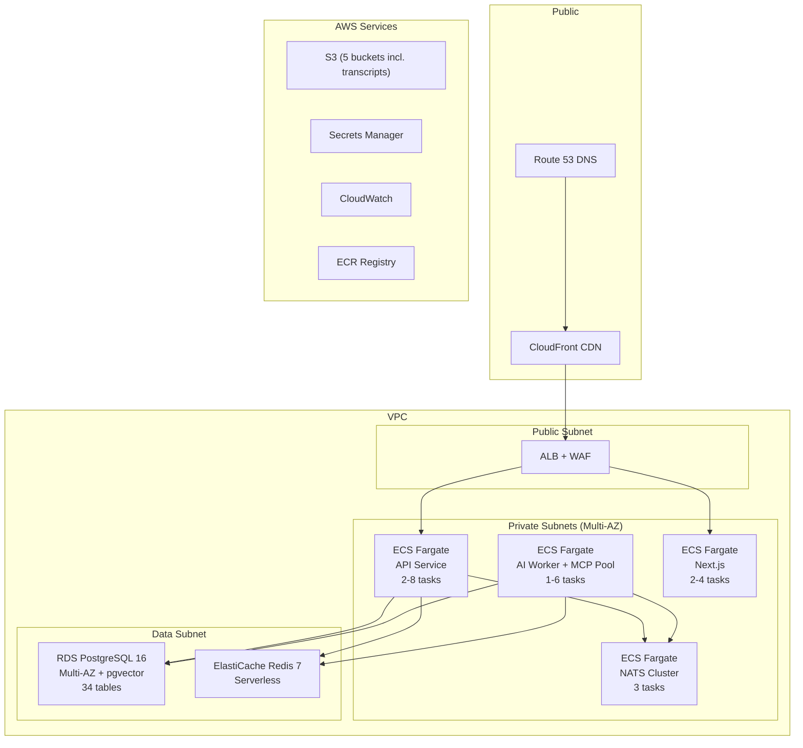

### 12.2 Compute Configuration

| Service | R0 | R1 | R2 | R3 | CPU | Memory |
|---------|----|----|----|----|-----|--------|
| API (includes AI in R0) | 2 tasks | 2 | 3-4 | 2-8 | 1 vCPU | 2 GB |
| AI Worker + MCP Pool (R1+) | N/A | 2 | 2-4 | 2-6 | 1 vCPU | 4 GB |
| Web (Next.js) | 2 tasks | 2 | 2-4 | 2-4 | 0.5 vCPU | 1 GB |
| NATS | 3 tasks | 3 | 3 | 3-5 | 0.5 vCPU | 1 GB |

### 12.3 AI Worker Extraction (R1)

**R0:** Agent SDK runs within the Fastify API server process. MCP servers (pm-db, pm-nats, pgvector) are in-process. No separate AI service.

**R1:** Extract AI worker as a separate ECS Fargate service (`apps/ai-worker`). The orchestrator, subagents, MCP servers, hooks, and session manager move to this service. The API server communicates with the AI worker via NATS request/reply pattern.

**R2+:** Horizontal scaling of AI worker tasks independently of the API server. Each AI worker task runs its own agent instances with pooled MCP server connections.

### 12.4 Scaling Strategy

| Scaling Trigger | Action |
|----------------|--------|
| AI Worker CPU > 70% for 5 min | Add 1 ECS task (max 6) |
| AI Worker CPU < 30% for 15 min | Remove 1 ECS task (min 1) |
| NATS consumer lag > 1000 messages | Add 1 AI Worker task |
| AI cost per tenant exceeding budget | Rate-limiter hook throttles (no scaling) |
| Active sessions > 100 per worker | Add 1 AI Worker task |

### 12.5 CI/CD Pipeline

Trunk-based development. All changes via PR with approval.

```
Automated: lint -> type-check -> unit test -> integration test (testcontainers)
  -> ai evaluation (golden test sets) -> build -> deploy to staging
  -> smoke test -> promote to production
```

Infrastructure as Code: AWS CDK (TypeScript). Single `cdk deploy` for full environment.

**Environments:** `dev` (single-AZ, smallest instances), `staging` (mirrors prod topology), `prod` (Multi-AZ, encrypted, monitored).

---

## 13. Tier 10 -- Monitoring and Observability

The AI engine requires purpose-built observability. v4.0 adds per-subagent metrics, hook audit dashboards, and session health monitoring.

| Component | AWS Service / Tool | Purpose |
|-----------|-------------------|---------|
| **Metrics** | CloudWatch Metrics + Dashboards | Application metrics, database metrics, AI metrics (latency, tokens, cost, confidence). Per-subagent breakdown. |
| **Logging** | CloudWatch Logs + Logs Insights | Centralized structured JSON logs from all ECS services. 30-day retention (prod). |
| **Distributed Tracing** | AWS X-Ray | End-to-end: API -> Orchestrator -> Hook Chain -> MCP Tool -> LLM. |
| **Error Tracking** | Sentry (SaaS) | Real-time error capture: agent failures, hook errors, MCP server crashes. |
| **Alerting** | CloudWatch Alarms -> SNS -> PagerDuty/Slack | Circuit breaker open, AI failure rate > 10%, budget exceeded, NATS lag > 1000, hook denial rate > 20%. |
| **AI Dashboard** | CloudWatch Dashboard (custom) | Per-capability latency, per-tenant budget, acceptance rates, prompt version A/B, circuit breaker state, shadow mode status. |
| **Agent Metrics** | CloudWatch custom metrics from agent-metrics-aggregator | **NEW.** Per-subagent: latency p50/p95/p99, tool call counts, hook denial rates, session counts, turn distribution. |
| **Hook Audit Dashboard** | CloudWatch Dashboard + ai_hook_log queries | **NEW.** Hook evaluation timeline, denial reasons, rate limit utilization, autonomy enforcement counts. |
| **Session Health** | CloudWatch Metrics | **NEW.** Active/paused/expired session counts, avg turn count, transcript storage usage, session resume rate. |

### 13.1 Performance Budgets

| Metric | Target |
|--------|--------|
| API p95 latency | < 500ms (non-AI endpoints) |
| AI operation p95 | < 8s (NL query), < 30s (WBS generation) |
| Hook chain evaluation | < 20ms aggregate (all 3 PreToolUse hooks) |
| MCP tool call overhead | < 50ms per tool call (excluding external API latency) |
| First Contentful Paint | < 1.5s |
| Time to Interactive | < 3s |
| NATS consumer lag | < 1000 messages |

### 13.2 Per-Subagent Metrics

| Metric | Source | Alert Threshold |
|--------|--------|-----------------|
| Latency (p50, p95, p99) | CloudWatch custom from cost-tracker hook | p95 > 30s (WBS), p95 > 8s (NL query) |
| Token usage (input/output) | ai_cost_log table | Monthly cost > 80% budget |
| Cost per operation (USD) | ai_cost_log table | Per-tenant budget exceeded |
| Confidence score | ai_actions.confidence_score | Average < 0.5 over 24h |
| Acceptance rate | ai_actions WHERE reviewed_by IS NOT NULL | < 60% triggers prompt review |
| Error rate | ai_actions WHERE status = 'failed' | > 10% in 1h window |
| Turn count (avg) | ai_sessions.turn_count | Avg > 80% of maxTurns |
| Hook denial rate | ai_hook_log WHERE decision = 'deny' | > 20% in 1h window |

### 13.3 Evaluation Harness

Golden test sets per capability run in CI on every prompt template change:

| Capability | Test Set Size | Quality Threshold | Evaluation Method |
|-----------|--------------|-------------------|-------------------|
| wbs-generator | 15 descriptions | Schema validity 100%, effort accuracy within 30% | Automated schema validation + manual review |
| whats-next | 10 task sets | Ranking correlation > 0.7 with expert ranking | Kendall tau correlation |
| nl-query | 25 question/answer pairs | Answer accuracy > 80% | Automated fact-checking against DB |
| summary-writer | 10 activity logs | Client narrative quality > 7/10 | LLM-as-judge evaluation |
| risk-predictor | 8 historical snapshots | Risk identification recall > 70% | Retrospective comparison |

---

## 14. Data Flow Diagrams

### 14.1 NL-to-WBS Generation (v4.0 -- Agent SDK)

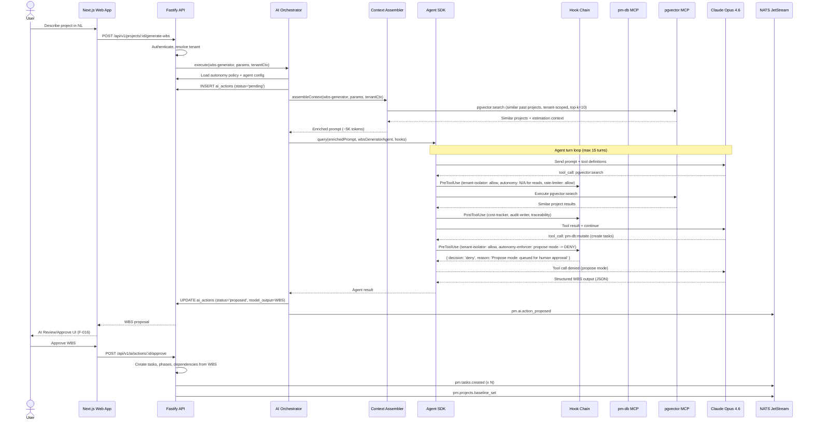

### 14.2 AI PM Agent Loop (v4.0 -- Agent SDK)

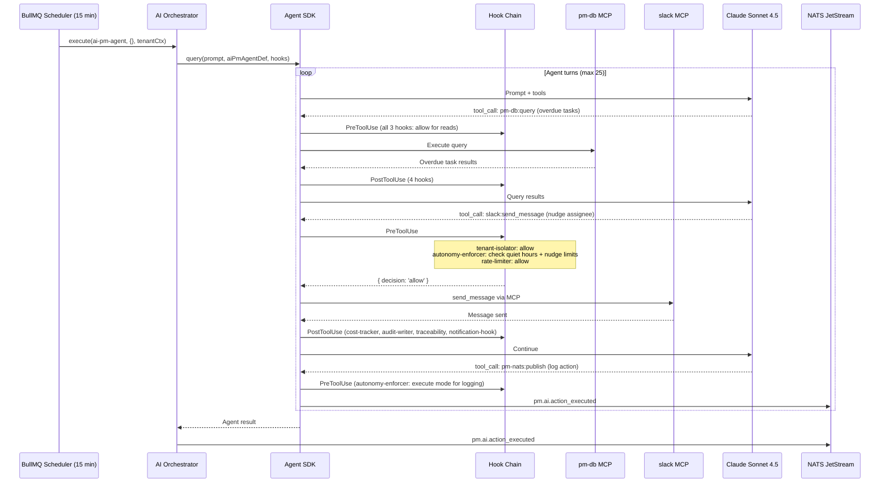

---

## 15. API Endpoint Summary

~95 endpoints across 16 modules (15 application modules + auth). All endpoints use `/api/v1/` prefix, JWT auth (unless noted), and cursor-based pagination.

| Module | Endpoints | Key Routes | Release | New in v4.0 |
|--------|-----------|------------|---------|-------------|
| **Projects** | 10 | CRUD + generate-wbs + baseline + phases | R0 | -- |
| **Tasks** | 8 | CRUD + status transition + bulk create + import | R0 | -- |
| **Dependencies** | 3 | Add, list, remove | R0 | -- |
| **Assignments** | 2 | Assign, remove | R0 | -- |
| **Comments** | 4 | CRUD | R0 | -- |
| **Users** | 7 | Profile, invite, role, What's Next | R0 | -- |
| **AI Operations** | 9 | Query, actions CRUD, approve/reject/rollback, costs, policy | R0 | -- |
| **Audit** | 2 | Query log, entity trail | R0 | -- |
| **Config** | 2 | Get all, update key | R0 | -- |
| **Auth** | 9 | Login, refresh, logout, password reset, MFA, SSO | R0/R1 | -- |
| **Portal** | 6 | Projects, milestones, updates, query, comments | R2 | -- |
| **Admin** | 6 | Tenants CRUD, AI dashboard, shadow mode | R0/R1 | -- |
| **Checklists** | 7 | CRUD for checklists + items | R0 | -- |
| **Mentions** | 1 | List mentions for user | R0 | -- |
| **Custom Fields** | 5 | Definitions CRUD + set values | R1 | -- |
| **Notifications** | 5 | List, mark read, get/update preferences | R1 | -- |
| **Action Items** | 2 | Assign comment, list pending | R1 | -- |
| **Reminders** | 3 | Create, list, delete | R1 | -- |
| **Saved Views** | 4 | CRUD | R1 | -- |
| **Goals** | 8 | CRUD + link/unlink tasks + progress | R2 | -- |
| **Automations** | 5 | CRUD + execution logs | R2 | -- |
| **Forms** | 6 | CRUD + public submit + submissions | R2 | -- |
| **Documents** | 5 | CRUD | R2 | -- |
| **AI Writing** | 1 | Generate/improve content (streaming) | R2 | -- |
| **Agent Management** | **10** | **Agent configs, sessions, hooks, metrics** | **R0/R1** | **NEW** |

**API Conventions (unchanged):**

| Aspect | Convention |
|--------|-----------|
| Base URL | `/api/v1/` |
| Auth | `Authorization: Bearer <jwt>` |
| Pagination | Cursor-based: `?cursor=<opaque>&limit=50` (max 100) |
| Sorting | `?sort=created_at&order=desc` |
| Filtering | Query params: `?status=in_progress&priority=high` |
| Includes | `?include=phases,tasks,dependencies` |
| Error format | `{ "error": { "code": "...", "message": "...", "details": [...] } }` |
| Rate limiting | Per-tenant, per-endpoint. Headers: `X-RateLimit-*` |
| IDs | UUID v4 |
| Timestamps | ISO 8601 with timezone |

---

## 16. Architecture Decision Records (16 ADRs)

### ADRs 1-12 (Carried Forward from v3.1)

| ADR | Decision | Over | Rationale | Revisit When |
|-----|----------|------|-----------|-------------|
| ADR-001 | Hosted Claude API | Self-hosted / fine-tuned LLM | Lower ops burden, faster iteration, latest model access. 5-person team cannot run GPU infra. | R3: evaluate fine-tuning for per-tenant learning |
| ADR-002 | RAG with pgvector | Prompt engineering only / dedicated vector DB | pgvector co-located with relational data enables SQL JOINs in RAG queries. | p95 vector search > 100ms at 1M+ embeddings |
| ADR-003 | NATS JetStream | Kafka / Redis Streams / SQS | Kafka overprovisioned for 13 consumers. NATS: persistent, replayable, lightweight ops. | Consumer count > 50 or throughput > 100K events/min |
| ADR-004 | Shared schema + RLS | Schema-per-tenant / DB-per-tenant | Fast to ship. Database-enforced isolation. Single connection pool. | R3: evaluate schema isolation for enterprise tier |
| ADR-005 | Hybrid pricing | Pure per-seat / pure usage-based | Per-seat erodes margins on heavy AI users. Hybrid: subscription + AI metering. | After first 10 paying tenants |
| ADR-006 | PostgreSQL 16 + pgvector | Separate Pinecone/Weaviate | One database to operate. Co-location enables relational+vector queries. | Vector corpus > 1M rows or latency degrades |
| ADR-007 | Fastify (Node.js + TypeScript) | NestJS / FastAPI | Shared language with Next.js. Fastest Node.js framework. Single hiring profile. | Python-specific ML requirements in R3 |
| ADR-008 | ECS Fargate | EKS (Kubernetes) | Zero cluster management for 5-person team. | Service count > 15 or dedicated platform engineer |
| ADR-009 | AWS CDK (TypeScript) | Terraform / CloudFormation | Same language as entire stack. Higher-level constructs. | Multi-cloud requirement |
| ADR-010 | Modular monolith -> extract AI worker | Microservices from day 1 | Microservices at 5 engineers = overhead killing velocity. | Module scaling requirements diverge significantly |
| ADR-011 | Next.js 15 (single app, route groups) | Separate frontends | One codebase, shared components, single deployment. | Portal requires different deployment model |
| ADR-012 | CloudWatch + X-Ray + Sentry | Datadog / Grafana Cloud | CloudWatch included with AWS. X-Ray native tracing. Sentry for frontend errors. | Observability needs outgrow CloudWatch |

### ADRs 13-16 (NEW in v4.0)

| ADR | Decision | Over | Rationale | Revisit When |
|-----|----------|------|-----------|-------------|
| **ADR-013** | **Claude Agent SDK for orchestration** | Custom 7-stage pipeline | SDK provides multi-agent, MCP tools, hooks, sessions as first-class primitives. Reduces custom orchestration code by ~60% (2,500 LOC to ~800 LOC). Adding a new capability = creating an `AgentDefinition` file. No orchestrator routing changes. Hooks replace hand-coded safety checks. Sessions replace stateless context rebuilding. | SDK API breaks backward compatibility or introduces >50ms latency overhead |
| **ADR-014** | **MCP tool servers for all tool access** | Direct service injection into capabilities | Standardized schemas enable tool discovery and permission enforcement at the tool boundary. Same tool (pm-db:query) is composable across all 10 subagents without per-capability wiring. External tools (Slack, GitHub, Calendar) use the same MCP protocol, eliminating adapter-specific code. Community MCP servers (@modelcontextprotocol/*) reduce custom integration code. | MCP protocol changes or performance overhead >50ms per tool call |
| **ADR-015** | **Hook-based safety over inline checks** | Custom autonomy pipeline stages (v3.1 Stage 2/7) | Hooks are declarative, composable, and evaluated in deterministic order. The `tenant-isolator` hook runs on every database/vector tool call; the `autonomy-enforcer` hook runs on every mutation; the `rate-limiter` hook runs on everything. This is easier to audit than scattered inline checks across 10 capabilities. Adding a new safety concern = adding a new hook. No existing code changes. | Hook evaluation latency exceeds 20ms aggregate |
| **ADR-016** | **Persistent sessions with transcript resume** | Stateless per-request AI calls | Multi-turn NL queries require conversation context. Sessions reduce redundant context assembly by ~40% on follow-up turns. The `session-manager` Stop hook handles persistence automatically. Sessions stored in three tiers: Redis (hot), PostgreSQL (warm), S3 (cold transcripts). 30-day TTL with automatic expiry. | Session storage exceeds 10GB per tenant or transcript replay latency >2s |

---

## 17. Technology Stack

| Category | Technology | Version | Purpose |
|----------|-----------|---------|---------|
| **Frontend** | Next.js | 15+ | Web application, App Router, RSC |
| | React | 19+ | UI framework |
| | TypeScript | 5+ | Type safety, strict mode |
| | Shadcn UI | Latest | UI component library |
| | Tailwind CSS | 4+ | Utility-first styling |
| | React Hook Form + Zod | Latest | Form validation |
| **Backend** | Fastify | 5 | HTTP framework, 15 modules |
| | Node.js | 22 LTS | Runtime |
| | Drizzle ORM | Latest | Database ORM, migrations |
| | TypeBox | Latest | Request validation (Fastify native) |
| **AI** | Claude Agent SDK | Latest | Multi-agent orchestration, MCP, hooks, sessions |
| | Claude Opus 4.6 | Latest | WBS generation, risk prediction, SOW generation |
| | Claude Sonnet 4.5 | Latest | NL queries, summaries, PM agent, writing assistant |
| | text-embedding-3-small | Latest | 1536-dim embeddings for pgvector |
| | MCP (Model Context Protocol) | Latest | Standardized tool interface |
| **Database** | PostgreSQL | 16 | Primary relational store, 34 tables |
| | pgvector | Latest | Vector similarity search |
| | Redis | 7 | Cache, sessions, rate limiting, queues |
| **Messaging** | NATS JetStream | 2.10+ | Event bus, 14 streams, 13 consumers |
| **Storage** | S3 | Latest | Files, exports, backups, transcripts |
| **Infrastructure** | ECS Fargate | Latest | Container orchestration |
| | AWS CDK | Latest | Infrastructure as Code (TypeScript) |
| | ALB + WAF | Latest | Load balancing, web application firewall |
| | RDS | Latest | Managed PostgreSQL |
| | ElastiCache | Latest | Managed Redis |
| | CloudFront | Latest | CDN |
| | Route 53 | Latest | DNS |
| | Secrets Manager | Latest | Secrets storage, auto-rotation |
| | KMS | Latest | Encryption key management |
| **Observability** | CloudWatch | Latest | Metrics, logs, dashboards, alarms |
| | X-Ray | Latest | Distributed tracing |
| | Sentry | Latest | Error tracking |
| **CI/CD** | GitHub Actions | Latest | CI/CD pipeline |
| | ECR | Latest | Container registry |
| **Monorepo** | Turborepo | Latest | Build orchestration |
| | pnpm | Latest | Package management |

---

## 18. Cost Model

### 18.1 Infrastructure Costs (Monthly, AWS)

| Component | R0 (Internal) | R1 (Pilot) | R2 (3 Tenants) | R3 (10 Tenants) |
|-----------|---------------|------------|-----------------|------------------|
| ECS Fargate (API + AI Worker + Web) | $120 | $220 | $440 | $880 |
| RDS PostgreSQL (Multi-AZ, 34 tables) | $95 | $95 | $190 | $380 |
| ElastiCache Redis | $25 | $50 | $100 | $200 |
| NATS (3-node ECS) | $60 | $60 | $60 | $90 |
| Claude API (AI operations) | $35 | $100 | $180 | $480 |
| S3 + CloudFront (incl. transcripts) | $12 | $18 | $35 | $70 |
| Monitoring (CloudWatch + Sentry) | $30 | $55 | $85 | $160 |
| SES (notifications) | $0 | $5 | $15 | $40 |
| Secrets Manager + misc | $10 | $15 | $20 | $30 |
| **Total** | **~$387** | **~$618** | **~$1,125** | **~$2,330** |

**v4.0 cost delta from v3.1:** +~$20/mo at R0 (Agent SDK adds marginal Claude API cost for hook evaluations and session management overhead). +~$50/mo at R1 (MCP process pool for Slack/GitHub). +~$80/mo at R2-R3 (transcript storage in S3, increased hook logging volume). The delta is <8% of total infrastructure cost.

### 18.2 Unit Economics (R2 Target)

- Revenue per tenant: $500/mo (Pro tier average)
- Infrastructure cost per tenant: ~$125/mo (shared infra amortized + per-tenant AI)
- **Gross margin: ~75%**
- At 10 tenants (R3): ~$5,000 revenue / ~$2,330 infra = **~53% gross margin**

### 18.3 AI Token Cost Model (Per Tenant Per Month)

| Tier | AI Ops/Month | Est. Token Cost | Subscription Price |
|------|-------------|----------------|-------------------|
| Starter | ~500 | $10-18 | $29/mo |
| Pro | ~2,000 | $30-55 | $99/mo |
| Enterprise | ~5,000+ | $70-140 | $249+/mo |

**v4.0 token cost note:** The Agent SDK's multi-turn sessions reduce redundant context assembly by ~40% on follow-up turns, partially offsetting the increased token usage from hook evaluation messages. Net effect: approximately neutral token cost per operation compared to v3.1.

---

## 19. Release-Architecture Alignment

| Tier | R0 (Months 1-3) | R1 (Months 4-6) | R2 (Months 7-9) | R3 (Months 10-12) |
|------|------------------|------------------|------------------|---------------------|
| **Client** | Web app (internal), list views, agent sessions panel | + Kanban, Calendar, Table, Notification inbox, Slack bot, agent config UI | + Client portal, Gantt, Goals dashboard, Public API | + PM role views |
| **Gateway** | ALB + WAF, password auth, RBAC (Admin+Dev) | + SSO, + MFA, + WebSocket | + Client role | + PM role |
| **Application** | 8 core modules + Agent Management | + Notification, Views; + Custom Fields, Recurring Tasks, Templates | + Goals, Automation, Forms, Documents; + Projection live | + Enterprise config |
| **AI Engine** | 4 subagents (WBS, What's Next, NL Query, Summary), 3 in-process MCP servers, 8 hooks, session manager | + 3 subagents (Risk, PM Agent, Scope), + 2 external MCP servers (Slack, GitHub) | + 1 subagent (Writing Assistant), + 1 MCP server (Calendar) | + 2 subagents (SOW, Learning) |
| **Event Bus** | 8 core streams + 2 agent streams (10), 9 consumers | + 4 new streams (14 total), + 2 new consumers (11) | + automation-engine consumer (12), + agent-metrics (13) | Evaluate 5-node if throughput demands |
| **Data** | PG 16 + pgvector, Redis, S3; 22 core tables (18 + 4 agent) | + 6 new tables (28 total) | + 6 new tables (34 total) | + Read replica, evaluate schema isolation |
| **Integrations** | None (in-process MCP only) | + Slack MCP, + GitHub MCP | + Calendar MCP, + Webhooks, + Jira import | + Additional providers |
| **Security** | RLS, encryption, audit trail, secrets, hook-based AI safety | + SOC 2 controls | + PII scanning, prompt injection defense, SOC 2 Type I | + SOC 2 Type II |
| **Deployment** | ECS Fargate (2 tasks), CDK, GitHub Actions | + AI Worker as separate service with MCP pool | + Auto-scaling policies | + Performance optimization |
| **Monitoring** | CloudWatch basics, Sentry, agent metrics | + X-Ray tracing, AI dashboard, hook audit dashboard | + Custom alerting, session health | + Tenant-level monitoring |

---

## 20. Monorepo Structure

```
ai-pm-tool/
+-- apps/
|   +-- web/                        # Next.js 15 (internal + portal)
|   |   +-- app/
|   |   |   +-- (internal)/         # Internal PM routes
|   |   |   |   +-- dashboard/
|   |   |   |   +-- projects/
|   |   |   |   +-- tasks/
|   |   |   |   +-- ai-review/
|   |   |   |   +-- ai-sessions/    # NEW: Agent session UI
|   |   |   |   +-- goals/
|   |   |   |   +-- settings/
|   |   |   |   |   +-- agents/     # NEW: Agent config UI
|   |   |   +-- (portal)/           # Client portal routes (R2)
|   |   |   +-- api/                # BFF routes
|   |   +-- components/
|   |   |   +-- ui/                 # Shadcn UI primitives
|   |   |   +-- ai/                 # AI review, What's Next, NL Query, Writing Assistant
|   |   |   +-- agents/             # NEW: Agent session panel, config forms
|   |   |   +-- views/              # Kanban, Calendar, Table, Gantt
|   |   |   +-- notifications/
|   |   |   +-- goals/
|   |   |   +-- forms/
|   |   |   +-- documents/
|   +-- api/                        # Fastify 5 API server
|   |   +-- src/
|   |   |   +-- modules/
|   |   |   |   +-- project/        # routes/ services/ repositories/ types/ events/
|   |   |   |   +-- task/
|   |   |   |   +-- dependency/
|   |   |   |   +-- comment/
|   |   |   |   +-- audit/
|   |   |   |   +-- user/
|   |   |   |   +-- projection/
|   |   |   |   +-- config/
|   |   |   |   +-- notification/
|   |   |   |   +-- goals/
|   |   |   |   +-- automation/
|   |   |   |   +-- forms/
|   |   |   |   +-- documents/
|   |   |   |   +-- views/
|   |   |   |   +-- agent-management/  # NEW: agent config, sessions, hooks API
|   |   |   +-- ai/
|   |   |   |   +-- orchestrator/      # Orchestrator (execute, routing)
|   |   |   |   +-- agents/            # AgentDefinition files (10 agents)
|   |   |   |   |   +-- wbs-generator.ts
|   |   |   |   |   +-- whats-next.ts
|   |   |   |   |   +-- nl-query.ts
|   |   |   |   |   +-- summary-writer.ts
|   |   |   |   |   +-- risk-predictor.ts
|   |   |   |   |   +-- ai-pm-agent.ts
|   |   |   |   |   +-- scope-detector.ts
|   |   |   |   |   +-- writing-assistant.ts
|   |   |   |   |   +-- sow-generator.ts
|   |   |   |   |   +-- learning-agent.ts
|   |   |   |   +-- mcp/               # MCP tool server implementations
|   |   |   |   |   +-- pm-db-server.ts
|   |   |   |   |   +-- pm-nats-server.ts
|   |   |   |   |   +-- pgvector-server.ts
|   |   |   |   |   +-- slack-server-config.ts
|   |   |   |   |   +-- github-server-config.ts
|   |   |   |   |   +-- calendar-server-config.ts
|   |   |   |   +-- hooks/             # Hook implementations (8 hooks)
|   |   |   |   |   +-- tenant-isolator.ts
|   |   |   |   |   +-- autonomy-enforcer.ts
|   |   |   |   |   +-- rate-limiter.ts
|   |   |   |   |   +-- cost-tracker.ts
|   |   |   |   |   +-- audit-writer.ts
|   |   |   |   |   +-- traceability.ts
|   |   |   |   |   +-- notification-hook.ts
|   |   |   |   |   +-- session-manager.ts
|   |   |   |   |   +-- hook-chain.ts   # Hook registration + ordering
|   |   |   |   +-- sessions/           # Session service (findOrCreate, resume, fork)
|   |   |   |   +-- context/            # Context assembler (RAG + events + domain)
|   |   |   |   +-- gateway/            # LLM Gateway (model routing, retry, circuit breaker)
|   |   |   |   +-- evaluation/         # Evaluation harness (golden test sets)
|   |   |   |   +-- traceability/       # Traceability pipeline (ai_actions, ai_hook_log)
|   |   |   +-- events/                 # NATS producers + consumers
|   |   |   +-- integrations/           # Non-MCP integrations (webhooks, Jira import)
|   |   |   +-- auth/
|   |   |   +-- common/
|   |   +-- Dockerfile
|   +-- ai-worker/                  # R1+: Separate ECS service
|       +-- src/
|           +-- orchestrator/       # Orchestrator (moved from api in R1)
|           +-- agents/             # AgentDefinition files
|           +-- mcp/                # MCP servers + pool manager
|           +-- hooks/              # Hook chain
|           +-- sessions/           # Session service
|           +-- consumers/          # NATS event consumers
|           +-- scheduled/          # BullMQ scheduled jobs
+-- packages/
|   +-- shared/                     # Shared types, validators, constants
|   |   +-- types/
|   |   +-- validators/
|   |   +-- constants/
|   +-- db/                         # Drizzle schema + migrations
|   |   +-- schema/
|   |   +-- migrations/
|   |   +-- seeds/
|   +-- prompts/                    # Versioned prompt templates
|       +-- wbs-generator/
|       +-- nl-query/
|       +-- summary/
|       +-- risk-predictor/
|       +-- writing-assistant/
+-- infra/                          # AWS CDK
|   +-- lib/
|   |   +-- vpc-stack.ts
|   |   +-- database-stack.ts
|   |   +-- compute-stack.ts
|   |   +-- monitoring-stack.ts
|   |   +-- pipeline-stack.ts
|   +-- bin/
|       +-- app.ts
+-- tests/
|   +-- integration/
|   +-- ai-evaluation/              # Golden test sets
|   +-- load/
+-- turbo.json
+-- pnpm-workspace.yaml
+-- docker-compose.yml              # Local dev: PG, Redis, NATS
```

---

## 21. What Makes This Architecture Evergreen

1. **No rewrite gates.** The R0 schema supports R3 features. The 4 new Agent SDK tables are built in R0 even though the full agent ecosystem (10 subagents, 6 MCP servers) is not complete until R3. Session persistence, hook logging, and agent configuration are available from day 1.

2. **Scaling is configuration, not architecture.** R0-to-R2 scaling = changing ECS task counts and RDS instance sizes in CDK config. AI worker extraction in R1 is planned, not reactive.

3. **AI capabilities are truly pluggable.** In v3.1, adding a capability touched 6 files across 3 directories. In v4.0, adding a capability means: create one `AgentDefinition` file under `ai/agents/`, list its allowed MCP tools, and register it with the orchestrator's agent registry. The hook chain, traceability, cost tracking, and evaluation harness handle it automatically. Zero orchestrator routing changes.

4. **Safety scales with the system.** Adding a new safety concern (e.g., PII redaction for SOC 2 in R2) means adding one hook. The hook chain evaluates it in deterministic order with every other hook. No existing hooks are modified.

5. **The event bus decouples everything.** Adding the 2 new streams (pm.agent_sessions, pm.agent_hooks) and 2 new consumers required zero changes to the existing 12 streams and 11 consumers. The event schema is the contract.

6. **MCP standardization future-proofs integrations.** Adding a new integration (e.g., Jira MCP server, Microsoft Teams MCP server) means implementing the MCP protocol with typed tool schemas. All subagents can immediately use the new tools without code changes.

7. **Sessions reduce cost over time.** As users adopt multi-turn NL queries and writing assistance, session-based context reuse reduces per-turn token consumption by ~40% compared to stateless context rebuilding.

---

*AI-Native PM Tool -- Architecture v4.0 -- 103 Features -- 15 Modules -- 10 Subagents -- 6 MCP Servers -- 8 Hooks -- 14 Streams -- 13 Consumers -- 34 Tables -- ~95 Endpoints -- 16 ADRs -- Claude Agent SDK Native -- Multi-Agent Orchestration -- MCP Tool Standardization -- Hook-Based Safety -- Session Persistence -- Tenant Isolated -- Observable -- Evergreen from R0 through R3+*
