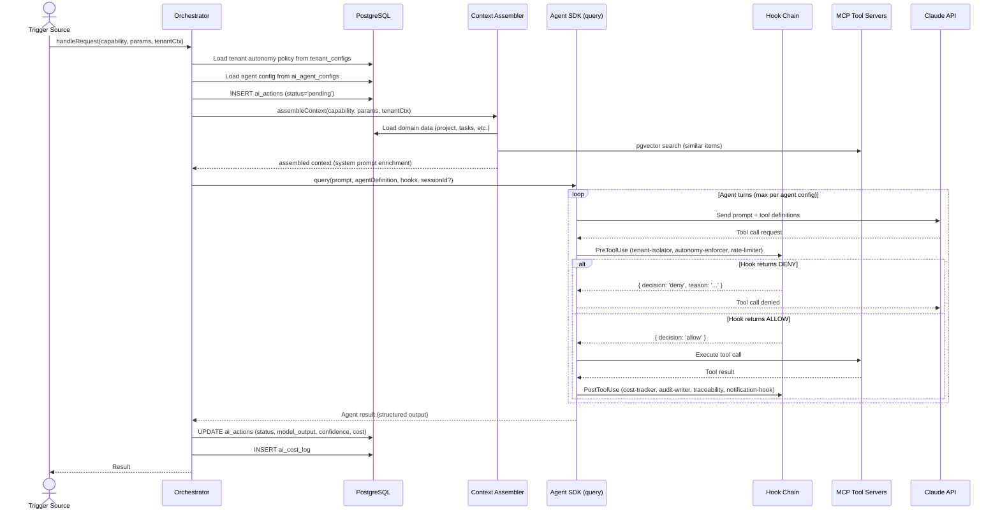

# AI-Native PM Tool — Technical Design Document

> **Version:** 2.0
> **Date:** February 12, 2026
> **Status:** Draft
> **Authors:** Engineering Team
> **Supersedes:** v1.1 (requirement_and_design_v2/design.md)
> **Aligned to:** Architecture v3.1, Agent SDK Architecture v2.0, Product Roadmap v2.2, UI/UX Design System v1.0, Requirements v1.1

---

## Changelog

| Change | v1.1 | v2.0 (this document) |
|--------|------|----------------------|
| Architecture reference | v3.1 | v3.1 (unchanged) |
| Roadmap reference | v2.2 | v2.2 (unchanged) |
| Application modules | 14 | 15 (+Agent module) |
| NATS streams | 12 | 14 (+pm.ai.sessions, +pm.ai.hooks) |
| Durable consumers | 11 | 11 (unchanged) |
| DDL tables | 30 | 34 (+ai_agent_configs, +ai_sessions, +ai_hook_log, +ai_mcp_servers) |
| API endpoints | ~85 | ~95 across 16 modules |
| AI orchestration | Custom 7-stage monolithic pipeline | Claude Agent SDK multi-agent orchestrator |
| Tool access pattern | Direct Anthropic SDK calls + custom wrappers | MCP (Model Context Protocol) tool servers (6 servers) |
| Safety enforcement | Application-layer autonomy checks (Stage 2/7) | Agent SDK hooks (8 hooks: PreToolUse, PostToolUse, Stop) |
| Session management | Stateless per-request | Persistent sessions with transcript resume (ai_sessions table) |
| Agent definitions | Implicit capability configs | Explicit `AgentDefinition` objects per subagent (10 agents) |
| Permission model | Per-tenant autonomy policy only | Three-layer: hooks + agent config + permission mode |
| Observability | Custom traceability pipeline | Hook-based audit + cost tracking + traceability |
| ADRs | 12 (ADR-001 through ADR-012) | 16 (+ADR-013 through ADR-016) |
| MCP servers | None | 6 MCP servers (pm-db, pm-nats, pgvector, slack, github, calendar) |
| Hook count | 0 (inline checks) | 8 hooks with typed callbacks |
| AI capabilities | 10 | 10 (unchanged, but implemented as subagents) |
| Feature count | 103 | 103 (unchanged) |
| Monorepo packages | 3 (shared, db, prompts) | 4 (+agents) |

---

## 1. Introduction

### 1.1 Purpose

This document provides the comprehensive technical design for the AI-Native PM Tool — a project management platform where the AI runs the project and the human supervises. It translates the system architecture (v3.1), agent SDK architecture (v2.0), and product roadmap (v2.2, 103 features across R0-R3) into implementable specifications covering all ten architectural tiers, database schemas (34 tables), API contracts (~95 endpoints), event flows (14 streams), Agent SDK integration, and deployment configurations.

**v2.0** supersedes v1.1 by replacing the custom 7-stage AI orchestration pipeline with the Claude Agent SDK (`@anthropic-ai/claude-agent-sdk`) multi-agent architecture. All non-AI sections are carried forward from v1.1 with updates reflecting the expanded schema and event topology.

### 1.2 References

| Document | Description |
|----------|-------------|
| `requirements.md` | Functional (FR-xxx) and non-functional (NFR-xxx) requirements |
| `architecture-v3.1.md` | System architecture v3.1 — 10-tier design, 12 Mermaid diagrams, 30 tables, 12 streams, 11 consumers, ~85 endpoints, ADRs |
| `roadmap-v2.md` | Product roadmap v2.2 — 103 features (F-001 through F-103), release gates |
| `ui-ux-design.md` | UI/UX system design — 21 ASCII wireframes, 6 Mermaid diagrams, design tokens, component architecture |
| `agent-sdk-architecture.md` | Agent SDK v2.0 — 10 subagents, 6 MCP servers, 8 hooks, session management, multi-agent orchestrator |

### 1.3 Cross-Reference Conventions

| Prefix | Meaning | Example |
|--------|---------|---------|
| **FR-xxx** | Functional requirement from requirements.md | FR-200 (NL to WBS generation) |
| **NFR-xxx** | Non-functional requirement from requirements.md | NFR-100 (API latency p95 < 500ms) |
| **F-xxx** | Feature from roadmap-v2.md | F-011 (NL project setup) |
| **ADR-xxx** | Architecture decision record | ADR-001 (Hosted Claude API) |

### 1.4 Requirement Identifier Mapping

The following mapping connects FR identifiers used throughout this document to their corresponding roadmap features:

| FR Range | Domain | Roadmap Features |
|----------|--------|-----------------|
| FR-100–FR-109 | Platform Foundation | F-001 through F-010 |
| FR-200–FR-203 | AI Engine Core Loop | F-011 through F-014 |
| FR-300–FR-305 | AI Safety & Autonomy | F-015 through F-019, F-035 |
| FR-400–FR-402 | AI Observability | F-020 through F-022 |
| FR-500–FR-503 | Human Surfaces | F-023 through F-026 |
| FR-600–FR-607 | AI Proactive Ops (R1) | F-027 through F-034 |
| FR-700–FR-702 | Integrations | F-036 through F-038 |
| FR-800–FR-802 | Security & Identity | F-039 through F-041 |
| FR-900–FR-901 | Client Projection | F-042 through F-043 |
| FR-1000–FR-1002 | SaaS Infrastructure | F-044 through F-046 |
| FR-1100–FR-1103 | Enhanced Task Mgmt | F-047 through F-050 |
| FR-1200–FR-1202 | Visualization | F-051 through F-053 |
| FR-1300–FR-1305 | Multi-Tenancy & Client | F-054 through F-059 |
| FR-1400–FR-1402 | Monetization | F-060 through F-062 |
| FR-1500–FR-1503 | Platform Hardening | F-063 through F-066 |
| FR-1600–FR-1606 | Enhanced AI (R2) | F-067 through F-073 |
| FR-1700–FR-1704 | Per-Tenant Intelligence | F-074 through F-078 |
| FR-1800–FR-1803 | Consultancy Moat | F-083 through F-086 |
| FR-1900–FR-1901 | Visualization (Promoted) | F-087 (->R1), F-088 (->R2) |
| FR-2000–FR-2014 | ClickUp Gap Features | F-089 through F-103 |

---

## 2. Architecture Overview

### 2.1 Architecture Principles

Eight principles govern every decision in this design. They resolve all tensions between speed-to-ship and long-term scalability. Principle #8 is new in v2.0.

| # | Principle | Implication |
|---|-----------|-------------|
| 1 | **AWS-managed over self-managed** | ECS Fargate over Kubernetes. RDS over self-hosted PostgreSQL. ElastiCache over self-managed Redis. A 5-person team cannot operate a Kubernetes cluster and build an AI product simultaneously. |
| 2 | **Monorepo, modular monolith, not microservices** | One deployable API service with well-separated internal modules (15 modules at v2.0). Split into services only when independently scaling AI workers is required (R1+). |
| 3 | **Event-driven from day 1, but start simple** | NATS JetStream for the event bus — lighter than Kafka, persistent with replay. Every state mutation emits an event. Every AI capability consumes events. 14 streams, 11 durable consumers. |
| 4 | **Single database, stretched intelligently** | PostgreSQL 16 with pgvector for relational + vector in one engine. RLS for tenant isolation. JSONB for flexible fields. 34 tables with full DDL. |
| 5 | **AI is a first-class infrastructure concern** | The AI engine has its own multi-agent orchestrator, hook-based safety pipeline, MCP tool servers, session management, cost tracking, autonomy policies, traceability, evaluation harness, and circuit breakers — all from R0. 10 AI subagents across R0-R3. |
| 6 | **Security is structural, not aspirational** | `tenant_id` on every table from day 1. RLS enforced at the database layer on all 34 tables. Immutable audit trail. SOC 2 controls built into the architecture. Three-layer tenant isolation for AI operations (hooks + middleware + RLS). |
| 7 | **Evergreen means building the R3 data model in R0** | The schema, event streams, and AI pipeline support per-tenant learning, client projection, and enterprise isolation from day 1 — even if those features ship in R2-R3. |
| 8 | **SDK-native patterns over custom implementations** | Use Claude Agent SDK primitives (multi-agent orchestration via `query()`, MCP tool servers, typed hooks, persistent sessions) instead of building custom equivalents. Reduces custom AI orchestration code by ~60%. **New in v2.0.** |

### 2.2 10-Tier Architecture Diagram

```
+============================================================================+
|  TIER 1: CLIENT LAYER                                                       |
|  Next.js 15 App Router | (internal) routes | (portal) routes | Slack Bot   |
|  Views: List, Board(R1), Calendar(R1), Table(R1), Gantt(R2), Timeline(R1)  |
|  Notification Inbox(R1) | Goals Dashboard(R2) | Docs/KB(R2)               |
+============================================================================+
          |                           |                        |
          v                           v                        v
+============================================================================+
|  TIER 2: GATEWAY & AUTH                                                     |
|  AWS ALB + WAF | JWT (RS256) | RBAC Engine | Tenant Config | WebSocket(R1)|
+============================================================================+
          |
          v
+============================================================================+
|  TIER 3: APPLICATION SERVICES (Fastify Modular Monolith — 15 Modules)      |
|  Project | Task | Dependency | Comment | Audit | User | Projection | Config|
|  + Notification | Goals | Automation | Forms | Documents | Views | Agent   |
+============================================================================+
          |                           |
          v                           v
+============================================================================+
|  TIER 4: AI ENGINE (Claude Agent SDK v2.0)                                  |
|  Multi-Agent Orchestrator | 10 Subagents | 6 MCP Servers | 8 Hooks        |
|  Session Management | Context Assembly | Evaluation Harness               |
+============================================================================+
          |                           |
          v                           v
+============================================================================+
|  TIER 5: EVENT BUS                                                          |
|  NATS JetStream (3-node) | 14 Streams | 11 Durable Consumers | DLQ        |
+============================================================================+
          |
          v
+============================================================================+
|  TIER 6: DATABASE                                                           |
|  PostgreSQL 16 + pgvector (34 tables) | Redis 7 (ElastiCache) | S3        |
+============================================================================+
          |
+============================================================================+
|  TIER 7: INTEGRATION GATEWAY                                                |
|  Git Adapter | Slack Adapter | Calendar Adapter | Webhooks | Jira Import   |
+============================================================================+

+============================================================================+
|  TIER 8: SECURITY & AI SAFETY                                               |
|  Encryption (AES-256/TLS 1.3) | RLS (34 tables) | Secrets Mgr | PII      |
|  Hook-Based Safety: tenant-isolator, autonomy-enforcer, rate-limiter       |
+============================================================================+

+============================================================================+
|  TIER 9: DEPLOYMENT & CI/CD                                                 |
|  ECS Fargate | AWS CDK (TypeScript) | GitHub Actions | ECR | CloudFront   |
+============================================================================+

+============================================================================+
|  TIER 10: MONITORING & OBSERVABILITY                                        |
|  CloudWatch Metrics/Logs | X-Ray Tracing | Sentry | AI Dashboard          |
|  Hook Audit Trail (ai_hook_log) | Session Metrics | Per-Subagent Metrics   |
+============================================================================+
```

### 2.3 Tier Summary

| Tier | Name | Key Technology | Primary Release | Related FRs |
|------|------|---------------|----------------|-------------|
| 1 | Client Layer | Next.js 15, RSC, Shadcn UI | R0 | FR-500-503, FR-201, FR-203, FR-1900-1901, FR-2002-2003 |
| 2 | Gateway & Auth | ALB + WAF, JWT RS256, RBAC | R0 | FR-103, FR-104, FR-800-802 |
| 3 | Application Services | Fastify 5, Drizzle ORM, 15 modules | R0 | FR-102, FR-105-109, FR-900, FR-2000-2014 |
| 4 | AI Engine | Claude Agent SDK, 10 subagents, 6 MCP servers, 8 hooks | R0 | FR-200-203, FR-300-305, FR-600-607, FR-2013 |
| 5 | Event Bus | NATS JetStream 2.10+, 14 streams, 11 consumers | R0 | FR-100 |
| 6 | Database | PostgreSQL 16, pgvector, 34 tables | R0 | FR-101, FR-102, NFR-100-103 |
| 7 | Integration Gateway | Fastify plugins, OAuth 2.0 | R1 | FR-700-702 |
| 8 | Security & AI Safety | KMS, RLS (34 tables), Secrets Manager, Agent SDK Hooks | R0 | FR-800-802, NFR-200-205 |
| 9 | Deployment & CI/CD | ECS Fargate, CDK, GitHub Actions | R0 | NFR-300-303 |
| 10 | Monitoring & Observability | CloudWatch, X-Ray, Sentry, Hook Audit Trail | R0 | FR-400-402 |

---

## 3. Technology Stack

### 3.1 Decision Matrix

| Category | Choice | Over (Alternative) | Rationale |
|----------|--------|-------------------|-----------|
| Cloud | AWS (single-cloud) | Multi-cloud | Managed services, single vendor, CDK alignment |
| Compute | ECS Fargate | EKS / Kubernetes | Zero cluster management for 5-person team |
| Runtime | Node.js 22 LTS | Python / Go | Shared language with Next.js, single hiring profile |
| API Framework | Fastify 5 | NestJS / Express | Fastest Node.js framework, plugin architecture |
| Frontend | Next.js 15 App Router | Separate apps | RSC maturity, route groups for internal + portal |
| ORM | Drizzle ORM | Prisma / Knex | TypeScript-first, readable SQL, schema-as-code |
| Database | PostgreSQL 16 + pgvector | Separate vector DB | One DB to operate, relational + vector co-located |
| Event Bus | NATS JetStream | Kafka / Redis Streams | Persistent, replayable, lightweight ops |
| AI Model | Claude API (hosted) | Self-hosted LLM | Lower ops burden, latest model access |
| AI Orchestration | Claude Agent SDK | Custom 7-stage pipeline | Multi-agent, MCP tools, hooks, sessions as first-class primitives. **New in v2.0.** |
| IaC | AWS CDK (TypeScript) | Terraform | Same language as stack, higher-level constructs |
| Monitoring | CloudWatch + X-Ray + Sentry | Datadog | Included with AWS, no additional vendor cost |
| Validation | TypeBox + Zod | Joi / Yup | Fastify-native + shared with frontend |

### 3.2 Architecture Decision Records (16 ADRs)

#### ADR-001 — Hosted Claude API over Self-Hosted LLM

| Attribute | Value |
|-----------|-------|
| **Status** | Accepted |
| **Context** | The AI engine requires large language model capabilities for WBS generation, NL querying, summarization, risk prediction, and autonomous agent operations. The team must decide between hosting/fine-tuning open-source models (LLaMA, Mistral) or using a hosted API (Claude, GPT). |
| **Decision** | Use Anthropic's hosted Claude API (Opus 4.6 for generation/risk, Sonnet 4.5 for queries/summaries) via the Claude Agent SDK. |
| **Rationale** | A 5-person team cannot run GPU infrastructure and build an AI product simultaneously. Hosted API provides: latest model access without retraining, predictable per-token pricing, zero ML-ops overhead, built-in safety features. |
| **Consequences** | Positive: faster iteration, no GPU cost, automatic model improvements. Negative: vendor dependency, data leaves our infrastructure (mitigated by Anthropic's data handling policies), per-token costs at scale. |
| **Revisit Trigger** | R3: evaluate fine-tuning when tenant-specific data volume justifies it and per-tenant learning (FR-1700, F-074) demands customization beyond RAG. |
| **Related FRs** | FR-200, FR-203, FR-600, FR-601, FR-607 |

#### ADR-002 — RAG with pgvector over Prompt Engineering Only

| Attribute | Value |
|-----------|-------|
| **Status** | Accepted |
| **Context** | AI capabilities need access to tenant-specific historical data (past projects, task patterns, estimation accuracy) to produce contextually relevant outputs. Options: pure prompt engineering with context injection, RAG with vector storage, or model fine-tuning. |
| **Decision** | Implement RAG using pgvector co-located in PostgreSQL. Embed tasks, comments, project descriptions, and documents using `text-embedding-3-small` (1536 dimensions). |
| **Rationale** | Prompt engineering alone does not scale past a single project. pgvector co-located with relational data enables SQL JOINs in RAG queries (e.g., "find similar tasks in this tenant's history" with tenant scoping in the same query). No separate vector DB infrastructure to operate. |
| **Consequences** | Positive: single database to operate, tenant-scoped vector search via SQL, JOINs between relational and vector data. Negative: pgvector performance ceiling at very large scale, IVFFlat index rebuild required periodically. |
| **Revisit Trigger** | When p95 vector similarity search exceeds 100ms at 1M+ embeddings. Evaluate dedicated Pinecone/Weaviate at that point. |
| **Related FRs** | FR-200, FR-203, FR-600, FR-1700 |

#### ADR-003 — NATS JetStream over Kafka / Redis Streams

| Attribute | Value |
|-----------|-------|
| **Status** | Accepted |
| **Context** | The event-driven architecture (FR-100, F-001) requires a persistent, replayable message bus with consumer groups. Options: Apache Kafka, NATS JetStream, Redis Streams, AWS SQS/SNS. |
| **Decision** | Use NATS JetStream 2.10+ deployed as a 3-node cluster on ECS Fargate with 30-day retention and at-least-once delivery. |
| **Rationale** | Kafka is overprovisioned for 11 consumers and <10K events/day (requires ZooKeeper/KRaft, broker tuning, partition rebalancing). Redis Streams lack replay durability. SQS lacks fan-out patterns. NATS JetStream provides persistence, replay, consumer groups, and dead letter queues with dramatically lower operational complexity. |
| **Consequences** | Positive: lightweight ops, persistent with replay, sufficient through R3. Negative: smaller ecosystem than Kafka, fewer managed service options on AWS. |
| **Revisit Trigger** | When consumer count exceeds 50 or throughput exceeds 100K events/min. |
| **Related FRs** | FR-100, FR-400 |

#### ADR-004 — Shared Schema + RLS over Schema-per-Tenant

| Attribute | Value |
|-----------|-------|
| **Status** | Accepted |
| **Context** | Multi-tenancy (FR-101, F-002) requires data isolation between tenants. Options: shared schema with `tenant_id` + RLS, schema-per-tenant, database-per-tenant. |
| **Decision** | Shared schema with `tenant_id` on every table, enforced via PostgreSQL Row-Level Security policies. |
| **Rationale** | Fast to ship. Database-enforced isolation (not application-trust). Single connection pool. Single migration path. Works from R0 (single tenant) through R2 (multi-tenant) without schema changes. |
| **Consequences** | Positive: simple operations, single connection pool, one migration path. Negative: noisy neighbor risk at extreme scale, less physical isolation for compliance-sensitive tenants. |
| **Revisit Trigger** | R3: evaluate schema isolation for enterprise tier (F-080) with strict compliance requirements. |
| **Related FRs** | FR-101, FR-1300, NFR-200 |

#### ADR-005 — Hybrid Pricing Model

| Attribute | Value |
|-----------|-------|
| **Status** | Accepted |
| **Context** | AI-heavy tools with pure per-seat pricing erode margins on heavy AI users. Pure usage-based pricing is unpredictable for buyers. The pricing model must align cost with value delivered. |
| **Decision** | Hybrid model: base subscription (per workspace) + AI operations metering (generous included tier, overage billing) + client portal seats as add-on. Three tiers: Starter ($29/mo), Pro ($99/mo), Enterprise ($249+/mo). |
| **Rationale** | Base subscription provides revenue predictability for buyers. AI metering aligns infrastructure cost with actual usage. Client portal as add-on captures additional value for consultancy use case. |
| **Consequences** | Positive: predictable revenue, cost-aligned AI usage, upsell path. Negative: complex billing logic, requires accurate cost tracking per tenant (FR-1000, F-046). |
| **Revisit Trigger** | After first 10 paying tenants — validate with real usage data. |
| **Related FRs** | FR-1400, FR-1000 |

#### ADR-006 — PostgreSQL 16 + pgvector over Separate Vector DB

| Attribute | Value |
|-----------|-------|
| **Status** | Accepted |
| **Context** | The AI engine requires vector similarity search for RAG. Options: dedicated vector database (Pinecone, Weaviate, Qdrant) alongside PostgreSQL, or pgvector extension co-located in PostgreSQL. |
| **Decision** | Use pgvector extension in PostgreSQL 16 (RDS). `text-embedding-3-small` at 1536 dimensions. IVFFlat index for R0-R2, evaluate HNSW at R3. |
| **Rationale** | One database to operate, backup, monitor, and scale. Co-location enables relational + vector queries in a single statement (tenant-scoped similarity search with JOINs). Eliminates a separate infrastructure component and its associated operational burden. |
| **Consequences** | Positive: single DB, tenant-scoped vector search via SQL, simplified operations. Negative: pgvector is less performant than dedicated vector DBs at very large scale. |
| **Revisit Trigger** | When vector corpus exceeds 1M rows or search latency degrades beyond p95 100ms. |
| **Related FRs** | FR-200, FR-203, FR-1700 |

#### ADR-007 — Fastify (Node.js + TypeScript) over NestJS / FastAPI

| Attribute | Value |
|-----------|-------|
| **Status** | Accepted |
| **Context** | The API server framework choice affects developer velocity, performance, and hiring. Options: Fastify (Node.js), NestJS (Node.js), FastAPI (Python), Express (Node.js). |
| **Decision** | Fastify 5 on Node.js 22 LTS with TypeScript 5+. |
| **Rationale** | Shared language with Next.js frontend = single hiring profile. Fastify is the fastest Node.js HTTP framework. Plugin architecture maps cleanly to the modular monolith pattern. Schema-based validation via TypeBox is native. TypeScript end-to-end with shared types via monorepo. |
| **Consequences** | Positive: highest performance Node.js framework, plugin architecture for modules, shared types with frontend. Negative: smaller ecosystem than Express, less opinionated than NestJS. |
| **Revisit Trigger** | If Python-specific ML/data science requirements emerge in R3. |
| **Related FRs** | FR-102, FR-105, NFR-100 |

#### ADR-008 — ECS Fargate over EKS

| Attribute | Value |
|-----------|-------|
| **Status** | Accepted |
| **Context** | Container orchestration for API, AI workers, web app, and NATS cluster. Options: ECS Fargate (serverless containers), EKS (managed Kubernetes), EC2 with Docker Compose. |
| **Decision** | ECS Fargate for all compute workloads. |
| **Rationale** | Zero cluster management. No node pool sizing, no RBAC for infrastructure, no Helm charts, no ArgoCD. Fargate provides auto-scaling containers at the complexity ceiling a 5-person team should operate. The team writes Dockerfiles and task definitions — not cluster configurations. |
| **Consequences** | Positive: zero cluster ops, auto-scaling, pay-per-use. Negative: less flexibility than Kubernetes, no custom operators, slightly higher per-container cost. |
| **Revisit Trigger** | When service count exceeds 15 or team has a dedicated platform engineer. |
| **Related FRs** | NFR-300, NFR-301 |

#### ADR-009 — AWS CDK (TypeScript) over Terraform

| Attribute | Value |
|-----------|-------|
| **Status** | Accepted |
| **Context** | Infrastructure as Code tool for provisioning and managing AWS resources. Options: AWS CDK (TypeScript), Terraform (HCL), CloudFormation (YAML/JSON), Pulumi. |
| **Decision** | AWS CDK with TypeScript. |
| **Rationale** | Same language as the entire stack. Higher-level constructs reduce IaC boilerplate (e.g., `ApplicationLoadBalancedFargateService` creates ALB + target group + ECS service + security groups in one construct). The team already knows TypeScript. |
| **Consequences** | Positive: single language across entire stack, high-level constructs, type safety. Negative: AWS-only (we committed to AWS), CloudFormation under the hood adds abstraction layer. |
| **Revisit Trigger** | If multi-cloud becomes a requirement. |
| **Related FRs** | NFR-300 |

#### ADR-010 — Modular Monolith, Extract AI Worker at R1

| Attribute | Value |
|-----------|-------|
| **Status** | Accepted |
| **Context** | Service topology for the application layer. Options: microservices from day 1, modular monolith, monolith without module boundaries. |
| **Decision** | Modular monolith in R0 with clean module boundaries (each module has routes/, services/, repositories/, types/, events/). Extract AI worker as the first separate ECS service in R1 when async AI processing needs independent scaling. |
| **Rationale** | Microservices at 5 engineers = operational overhead that kills product velocity (service discovery, distributed tracing, deployment choreography, network debugging). The modular monolith gives clean separation with zero distributed systems overhead. |
| **Consequences** | Positive: fast to ship, zero distributed systems overhead, clean extraction path. Negative: shared process means a bug in one module can affect others, single scaling unit until R1. |
| **Revisit Trigger** | When a module's scaling requirements diverge significantly from the monolith. |
| **Related FRs** | FR-100, NFR-300 |

#### ADR-011 — Next.js 15 Single App with Route Groups

| Attribute | Value |
|-----------|-------|
| **Status** | Accepted |
| **Context** | Frontend architecture for both internal PM interface and external client portal. Options: two separate Next.js apps, single app with route groups, micro-frontends. |
| **Decision** | Single Next.js 15 app with route groups: `(internal)` for PM interface, `(portal)` for client-facing views. |
| **Rationale** | One codebase, shared components, single deployment. Route groups provide clean URL separation without operational overhead of two apps. Shared component library (Shadcn UI) across both surfaces. |
| **Consequences** | Positive: single deployment, shared components, one build pipeline. Negative: portal and internal share the same deployment — a deploy to one affects both. |
| **Revisit Trigger** | If portal requires fundamentally different deployment model (e.g., edge-only, separate scaling). |
| **Related FRs** | FR-500, FR-1300, FR-1301 |

#### ADR-012 — CloudWatch + X-Ray + Sentry over Datadog

| Attribute | Value |
|-----------|-------|
| **Status** | Accepted |
| **Context** | Observability stack for metrics, logging, tracing, and error tracking. Options: Datadog (all-in-one), Grafana Cloud, CloudWatch + X-Ray + Sentry, self-hosted Prometheus + Grafana. |
| **Decision** | CloudWatch for metrics and logs, X-Ray for distributed tracing, Sentry for frontend error tracking. |
| **Rationale** | CloudWatch is included with AWS services (no additional vendor cost). X-Ray provides distributed tracing natively with ECS and Fastify. Sentry adds frontend error tracking with source maps and release correlation that CloudWatch lacks. Three focused tools instead of one expensive vendor. |
| **Consequences** | Positive: low cost, native AWS integration, Sentry for frontend quality. Negative: three tools to manage, CloudWatch dashboards less flexible than Datadog. |
| **Revisit Trigger** | If observability needs outgrow CloudWatch (complex custom dashboards, long-term metric retention) — evaluate Grafana Cloud. |
| **Related FRs** | FR-400, FR-402 |

#### ADR-013 — Claude Agent SDK for Orchestration (NEW in v2.0)

| Attribute | Value |
|-----------|-------|
| **Status** | Accepted |
| **Context** | v1.1 implemented AI orchestration as a custom 7-stage pipeline (TRIGGER, AUTONOMY CHECK, CONTEXT ASSEMBLY, CONFIDENCE CHECK, LLM CALL, POST-PROCESSING, DISPOSITION). Every AI capability flowed through this monolithic pipeline, with each stage hand-coded in TypeScript wrapping the Anthropic SDK directly. This approach had structural problems: tight coupling (adding AI Writing Assistant touched 6 files across 3 directories), no standard tool interface (ad-hoc service injections), and reinvented safety patterns. |
| **Decision** | Replace custom 7-stage pipeline with Claude Agent SDK (`@anthropic-ai/claude-agent-sdk`). Use SDK-native multi-agent orchestration via `query()`, standardized tool access via MCP servers, and safety enforcement via typed hooks. |
| **Rationale** | SDK provides first-class primitives for multi-agent orchestration, tool access, and safety enforcement. Reduces custom AI orchestration code from ~2,500 LOC to ~800 LOC. Adding a new capability requires creating an `AgentDefinition` and registering it — no modification to orchestrator routing, context assembly, or disposition handling. |
| **Consequences** | Positive: ~60% less custom orchestration code, standardized tool interface, composable safety hooks. Negative: SDK version dependency, potential API changes. |
| **Revisit Trigger** | If Claude Agent SDK breaks backward compatibility or imposes unacceptable performance overhead. |
| **Related FRs** | FR-200, FR-201, FR-202, FR-203, FR-400 |

#### ADR-014 — MCP Tool Servers for All Tool Access (NEW in v2.0)

| Attribute | Value |
|-----------|-------|
| **Status** | Accepted |
| **Context** | In v1.1, each AI capability accessed the database, NATS, and external services through ad-hoc service injections. There was no unified protocol for tool discovery, schema validation, or permission enforcement. |
| **Decision** | Implement 6 MCP (Model Context Protocol) tool servers: `pm-db` (database), `pm-nats` (event bus), `pgvector` (vector search), `slack` (Slack API), `github` (GitHub API), `calendar` (calendar API). All agent tool access flows through MCP. |
| **Rationale** | Standardized schemas, permission enforcement at tool boundary, composable across agents. MCP provides typed tool definitions with Zod schemas, making tool access auditable and testable. |
| **Consequences** | Positive: uniform tool access, per-tool permission enforcement, composable across agents. Negative: MCP abstraction layer adds ~10ms overhead per tool call. |
| **Revisit Trigger** | If MCP protocol changes or per-tool-call overhead exceeds 50ms. |
| **Related FRs** | FR-101, FR-102, FR-105, FR-200, FR-700, FR-701, FR-702 |

#### ADR-015 — Hook-Based Safety over Inline Checks (NEW in v2.0)

| Attribute | Value |
|-----------|-------|
| **Status** | Accepted |
| **Context** | v1.1 implemented safety as Stage 2 (autonomy check) and Stage 7 (disposition) of the custom pipeline — inline application code scattered across the orchestrator. |
| **Decision** | Implement 8 Agent SDK hooks: tenant-isolator, autonomy-enforcer, rate-limiter (PreToolUse); cost-tracker, audit-writer, traceability, notification-hook (PostToolUse); session-manager (Stop). |
| **Rationale** | Hooks are declarative, composable, and evaluated in deterministic order. Easier to audit than scattered inline checks. Each hook has a single responsibility, typed callbacks, and logged output. |
| **Consequences** | Positive: deterministic safety evaluation, composable, auditable via ai_hook_log. Negative: hook chain adds latency (~15ms aggregate). |
| **Revisit Trigger** | If hook evaluation latency exceeds 20ms aggregate or hook count exceeds 15. |
| **Related FRs** | FR-300, FR-301, FR-302, FR-303, FR-400, FR-401, FR-1000 |

#### ADR-016 — Persistent Sessions with Transcript Resume (NEW in v2.0)

| Attribute | Value |
|-----------|-------|
| **Status** | Accepted |
| **Context** | v1.1 AI operations were stateless per-request. Multi-turn NL queries required reconstructing full context on every follow-up question. |
| **Decision** | Implement persistent AI sessions via `ai_sessions` table with transcript resume. Sessions support active/paused/completed/expired lifecycle, parent-child forking, and 30-day TTL. |
| **Rationale** | Multi-turn NL queries (FR-203) require conversation context. Writing assistance (FR-2013) benefits from iterative refinement. Sessions reduce redundant context assembly by ~40% on follow-up turns. |
| **Consequences** | Positive: natural multi-turn conversations, reduced redundant context assembly, session forking for exploration. Negative: storage overhead (transcripts), session cleanup complexity. |
| **Revisit Trigger** | If session storage exceeds 10GB per tenant or transcript sizes cause memory pressure. |
| **Related FRs** | FR-203, FR-2013 |

---

## 4. Monorepo Structure

### 4.1 Directory Layout

```
ai-pm-tool/
+-- apps/
|   +-- web/                        # Next.js 15 (internal + portal)
|   |   +-- app/
|   |   |   +-- (internal)/         # Internal PM routes
|   |   |   |   +-- dashboard/
|   |   |   |   +-- projects/
|   |   |   |   +-- tasks/
|   |   |   |   +-- ai-review/
|   |   |   |   +-- notifications/  # Notification inbox
|   |   |   |   +-- goals/          # Goals & OKR dashboard
|   |   |   |   +-- documents/      # Docs & knowledge base
|   |   |   |   +-- settings/
|   |   |   +-- (portal)/           # Client portal routes (R2)
|   |   |   |   +-- [tenantSlug]/
|   |   |   |   |   +-- overview/
|   |   |   |   |   +-- milestones/
|   |   |   |   |   +-- queries/
|   |   |   +-- api/                # Next.js API routes (BFF pattern)
|   |   +-- components/
|   |   |   +-- ui/                 # Shadcn UI primitives
|   |   |   +-- ai/                 # AI review, What's Next, NL Query
|   |   |   +-- projects/
|   |   |   +-- tasks/
|   |   |   +-- views/              # Board, calendar, table, gantt
|   |   |   +-- notifications/      # Inbox, preferences
|   |   |   +-- goals/              # Goal tree, progress
|   |   |   +-- documents/          # Markdown editor, list
|   |   |   +-- forms/              # Form builder, preview
|   |   |   +-- layout/
|   |   +-- lib/
|   |   +-- styles/
|   +-- api/                        # Fastify API server
|   |   +-- src/
|   |   |   +-- modules/
|   |   |   |   +-- project/        # routes/ services/ repositories/ types/ events/
|   |   |   |   +-- task/
|   |   |   |   +-- dependency/
|   |   |   |   +-- comment/
|   |   |   |   +-- audit/
|   |   |   |   +-- user/
|   |   |   |   +-- projection/
|   |   |   |   +-- config/
|   |   |   |   +-- notification/
|   |   |   |   +-- goals/
|   |   |   |   +-- automation/
|   |   |   |   +-- forms/
|   |   |   |   +-- documents/
|   |   |   |   +-- views/
|   |   |   |   +-- agent/          # NEW v2.0: Agent SDK API endpoints
|   |   |   +-- ai/
|   |   |   |   +-- orchestrator/   # v2.0: Agent SDK orchestrator (replaces 7-stage)
|   |   |   |   +-- agents/         # v2.0: AgentDefinition objects (10 subagents)
|   |   |   |   |   +-- wbs-generator.ts
|   |   |   |   |   +-- whats-next.ts
|   |   |   |   |   +-- nl-query.ts
|   |   |   |   |   +-- summary-writer.ts
|   |   |   |   |   +-- risk-predictor.ts
|   |   |   |   |   +-- ai-pm-agent.ts
|   |   |   |   |   +-- scope-detector.ts
|   |   |   |   |   +-- sow-generator.ts
|   |   |   |   |   +-- writing-assistant.ts
|   |   |   |   |   +-- learning-agent.ts
|   |   |   |   +-- mcp/            # v2.0: MCP tool server implementations
|   |   |   |   |   +-- pm-db-server.ts
|   |   |   |   |   +-- pm-nats-server.ts
|   |   |   |   |   +-- pgvector-server.ts
|   |   |   |   |   +-- slack-server-config.ts
|   |   |   |   |   +-- github-server-config.ts
|   |   |   |   |   +-- calendar-server-config.ts
|   |   |   |   +-- hooks/          # v2.0: Agent SDK hook implementations
|   |   |   |   |   +-- tenant-isolator.ts
|   |   |   |   |   +-- autonomy-enforcer.ts
|   |   |   |   |   +-- rate-limiter.ts
|   |   |   |   |   +-- cost-tracker.ts
|   |   |   |   |   +-- audit-writer.ts
|   |   |   |   |   +-- traceability.ts
|   |   |   |   |   +-- notification-hook.ts
|   |   |   |   |   +-- session-manager.ts
|   |   |   |   |   +-- hook-chain.ts
|   |   |   |   +-- sessions/       # v2.0: Session management service
|   |   |   |   |   +-- session-service.ts
|   |   |   |   +-- context/        # Context assembly + RAG
|   |   |   |   +-- evaluation/     # Eval harness
|   |   |   +-- events/             # NATS producers + consumers
|   |   |   +-- integrations/       # Git, Slack, Calendar adapters
|   |   |   +-- auth/               # Authentication + RBAC
|   |   |   +-- common/             # Middleware, error handling, logging
|   |   +-- Dockerfile
|   |   +-- package.json
|   +-- ai-worker/                  # R1+: Separate ECS service
|       +-- src/
|           +-- agent-loop/         # AI PM Agent 15-min cycle
|           +-- consumers/          # NATS event consumers for AI
|           +-- scheduled/          # Cron-triggered AI jobs
+-- packages/
|   +-- shared/                     # Shared types, validators, constants
|   |   +-- types/                  # TypeScript interfaces
|   |   +-- validators/             # Zod schemas (API + web)
|   |   +-- constants/              # Status labels, priorities, event subjects
|   +-- db/                         # Drizzle schema + migrations (34 tables)
|   |   +-- schema/
|   |   +-- migrations/
|   |   +-- seeds/
|   +-- prompts/                    # Versioned prompt templates
|   |   +-- wbs-generator/
|   |   |   +-- v1.0.yaml
|   |   |   +-- v1.1.yaml
|   |   +-- nl-query/
|   |   +-- summary/
|   |   +-- risk-predictor/
|   |   +-- writing-assistant/
|   +-- agents/                     # NEW v2.0: Agent SDK package
|       +-- definitions/            # Shared AgentDefinition types + defaults
|       +-- mcp-schemas/            # MCP tool Zod schemas (shared)
|       +-- hooks/                  # Hook type definitions + registration utilities
|       +-- sessions/               # Session management utilities
+-- infra/                          # AWS CDK
|   +-- lib/
|   |   +-- vpc-stack.ts
|   |   +-- database-stack.ts
|   |   +-- compute-stack.ts
|   |   +-- monitoring-stack.ts
|   |   +-- pipeline-stack.ts
|   +-- bin/
|       +-- app.ts
+-- tests/
|   +-- integration/
|   +-- ai-evaluation/              # Golden test sets
|   +-- load/
+-- turbo.json
+-- pnpm-workspace.yaml
+-- docker-compose.yml              # Local dev: PG, Redis, NATS
```

### 4.2 Package Boundaries

Each module in `apps/api/src/modules/` follows a strict internal structure:

```
modules/task/
+-- routes/              # Fastify route handlers (HTTP layer)
|   +-- task.routes.ts
|   +-- task.schemas.ts  # TypeBox request/response schemas
+-- services/            # Business logic (domain layer)
|   +-- task.service.ts
+-- repositories/        # Database access (data layer)
|   +-- task.repository.ts
+-- types/               # Module-specific TypeScript types
|   +-- task.types.ts
+-- events/              # NATS event producers
    +-- task.events.ts
```

**Rules:**
- Modules communicate via service interfaces, never by importing another module's repository directly.
- Cross-module queries use service-to-service calls within the same process (no HTTP between modules).
- Events are the primary mechanism for cross-module side effects (audit logging, embedding generation, notifications).

### 4.3 Turborepo + pnpm Workspace Configuration

```yaml
# pnpm-workspace.yaml
packages:
  - 'apps/*'
  - 'packages/*'
  - 'infra'
```

```json
// turbo.json
{
  "$schema": "https://turbo.build/schema.json",
  "globalDependencies": [".env"],
  "pipeline": {
    "build": {
      "dependsOn": ["^build"],
      "outputs": ["dist/**", ".next/**"]
    },
    "dev": {
      "cache": false,
      "persistent": true
    },
    "lint": {},
    "type-check": {},
    "test": {
      "dependsOn": ["build"]
    },
    "db:migrate": {
      "cache": false
    }
  }
}
```

### 4.4 New Package: packages/agents/ (v2.0)

The `packages/agents/` package provides shared Agent SDK types, MCP tool schemas, and hook registration utilities used by both `apps/api` (R0 in-process) and `apps/ai-worker` (R1+ separate service).

**Rationale:** When the AI worker extracts in R1, both the API and AI worker need consistent agent definitions, MCP schemas, and hook types. This package prevents duplication.

**Contents:**
- `definitions/`: Shared `AgentDefinition` TypeScript interface, default agent configs, model routing table
- `mcp-schemas/`: Zod schemas for MCP tool parameters (shared between MCP server implementations and tests)
- `hooks/`: Hook type definitions (`HookCallback`), hook registration utility (`createHookChain`), hook evaluation order constants
- `sessions/`: Session lifecycle types, transcript format definitions

---

## 5. Authentication & Authorization

> **Related FRs:** FR-103 (authentication, F-004), FR-104 (RBAC, F-005), FR-800 (SSO, F-039), FR-801 (MFA, F-040), FR-802 (session hardening, F-041)

### 5.1 ALB + WAF Configuration

| Component | Configuration | Release |
|-----------|---------------|---------|
| **AWS ALB** | TLS 1.3 termination, HTTPS listener on 443, HTTP->HTTPS redirect on 80. Target groups: `web` (Next.js), `api` (Fastify). Path-based routing: `/api/*` -> API target group, `/*` -> Web target group. | R0 |
| **AWS WAF** | Attached to ALB. Rule groups: AWS Managed OWASP Core Rule Set, AWS Managed Known Bad Inputs, AWS Managed IP Reputation. Custom rules: rate limiting (1000 req/5min per IP), geo-blocking (optional per tenant config). | R0 |
| **Health checks** | ALB health check: `GET /health` on API (200 OK with DB + NATS connectivity status). Unhealthy threshold: 3 consecutive failures. | R0 |

### 5.2 JWT Structure

All authenticated requests carry a JWT in the `Authorization: Bearer <token>` header.

**Access token payload (RS256, 1h expiry):**

```json
{
  "sub": "user_uuid",
  "tenant_id": "tenant_uuid",
  "role": "admin|developer|client|pm",
  "email": "user@example.com",
  "iat": 1709000000,
  "exp": 1709003600,
  "jti": "unique_token_id"
}
```

**Key management:**
- RS256 asymmetric signing (private key in Secrets Manager, public key distributed)
- Key rotation: new keypair generated every 90 days, old key valid for 7 days after rotation
- Token validation: verify signature, check `exp`, check `tenant_id` exists, check `role` is valid

### 5.3 Session Management

| Aspect | Configuration |
|--------|---------------|
| **Access token** | 1h expiry, stateless JWT, not stored server-side |
| **Refresh token** | 30-day expiry, stored in Redis (ElastiCache) with `session:{user_id}:{jti}` key |
| **Token rotation** | Every refresh request issues new access + refresh token pair, invalidates old refresh token |
| **Concurrent sessions** | Max 5 active sessions per user (configurable per tenant). New session evicts oldest. |
| **Forced logout** | Admin can invalidate all sessions for a user by deleting all `session:{user_id}:*` keys in Redis |
| **Secure cookies** | Refresh token in `HttpOnly`, `Secure`, `SameSite=Strict` cookie. Access token in memory (not cookie). |

### 5.4 SSO / MFA (R1)

**SSO (FR-800, F-039):**
- SAML 2.0 via `passport-saml` for enterprise IdPs (Okta, Azure AD)
- OIDC via `openid-client` for Google Workspace, Microsoft Entra ID
- Per-tenant SSO configuration stored in `tenant_configs` table
- SSO-only enforcement: tenant admin can disable password auth when SSO is configured

**MFA (FR-801, F-040):**
- TOTP via authenticator apps (Google Authenticator, Authy)
- Recovery codes: 10 single-use codes generated at MFA setup, stored bcrypt-hashed
- Admin-enforceable: tenant admin can require MFA for all users or specific roles
- MFA challenge inserted after password verification, before JWT issuance

### 5.5 RBAC Engine

**Permission matrix (FR-104, F-005):**

| Permission | Site Admin | Developer | Client (R2) | PM (R3) |
|------------|-----------|-----------|-------------|---------|
| Manage tenants | Yes | No | No | No |
| Create projects | Yes | No | No | Yes |
| View all projects | Yes | Yes* | No | Yes* |
| Modify tasks | Yes | Yes* | No | Yes* |
| View task details | Yes | Yes* | No | Yes* |
| Add comments | Yes | Yes* | Yes** | Yes* |
| View client portal | No | No | Yes | No |
| Configure AI policy | Yes | No | No | No |
| Approve AI actions | Yes | No | No | Yes |
| View AI decisions | Yes | Yes* | No | Yes* |
| Manage users | Yes | No | No | No |
| View audit log | Yes | No | No | Yes* |
| Export data | Yes | No | Yes** | Yes* |
| Configure integrations | Yes | No | No | No |
| Manage AI sessions | Yes | No | No | Yes |
| View AI hook log | Yes | No | No | Yes* |

> `*` = scoped to assigned projects. `**` = scoped to own tenant's portal, client-visible content only.

**Enforcement chain (per request):**

```
1. Authenticate    -> Verify JWT signature + expiry
2. Resolve tenant  -> Extract tenant_id from JWT claims
3. Set RLS context -> SET LOCAL app.current_tenant_id = '<tenant_id>'
4. Check role      -> Verify user role against required permission
5. Check scope     -> For project-scoped roles, verify user assignment to project
6. Execute handler -> Business logic runs with tenant-isolated DB context
```

**Implementation:**
```typescript
// Fastify preHandler hook
async function authGuard(
  request: FastifyRequest,
  reply: FastifyReply,
  options: { permission: string; projectScoped?: boolean }
) {
  const { tenant_id, user_id, role } = request.user; // from JWT

  // Set RLS context
  await request.db.execute(
    sql`SET LOCAL app.current_tenant_id = ${tenant_id}`
  );

  // Check permission
  if (!hasPermission(role, options.permission)) {
    return reply.code(403).send({ error: 'Insufficient permissions' });
  }

  // Check project scope if needed
  if (options.projectScoped && role !== 'admin') {
    const projectId = request.params.projectId;
    const isAssigned = await checkProjectAssignment(user_id, projectId);
    if (!isAssigned) {
      return reply.code(403).send({ error: 'Not assigned to this project' });
    }
  }
}
```

### 5.6 Tenant Config Service (FR-109, F-010)

Per-tenant configurable values cached in Redis with 5-minute TTL.

**Stored in `tenant_configs` table:**
- Custom status labels (e.g., "In QA" instead of "In Review")
- Priority scales (3-level, 5-level, custom)
- AI model preferences (default confidence thresholds)
- Feature flags (per-tenant feature gating)
- Autonomy policy defaults
- SSO configuration (SAML/OIDC endpoints, certificates)
- Notification preferences
- Branding (portal logo, colors) for R2
- Agent SDK per-capability overrides (v2.0)
- MCP server tokens (Slack, GitHub, Calendar) per tenant (v2.0)

**Cache invalidation:**
- Config updates emit `pm.system.config_changed` NATS event
- All API instances subscribe to this event and invalidate their local Redis cache
- Cache key: `tenant_config:{tenant_id}`
- TTL: 5 minutes (fallback if NATS invalidation fails)

---

## 6. Application Modules (15 Modules)

> **Related FRs:** FR-102 (project CRUD, F-003), FR-105 (task lifecycle, F-006), FR-106 (dependencies, F-007), FR-107 (sub-tasks, F-008), FR-108 (audit trail, F-009), FR-503 (comments, F-026), FR-900 (projection, F-042), FR-2000-FR-2014 (ClickUp gap features)

One deployable Fastify API service with well-separated internal modules. Each module owns its domain logic, database queries, and event emissions. They share a process, a database connection pool, and a NATS client.

### 6.1 Module Architecture Pattern

Each module in the Fastify modular monolith follows a consistent internal structure:

```
module/
+-- routes/           # HTTP handlers — thin layer, delegates to services
|   +-- module.routes.ts    # Fastify route registrations
|   +-- module.schemas.ts   # TypeBox request/response schemas
+-- services/         # Business logic — domain rules, orchestration
|   +-- module.service.ts
+-- repositories/     # Database access — Drizzle queries, SQL
|   +-- module.repository.ts
+-- types/            # Module-specific TypeScript types
|   +-- module.types.ts
+-- events/           # NATS event producers — emits on state changes
    +-- module.events.ts
```

**Module registration as Fastify plugin:**
```typescript
// modules/task/routes/task.routes.ts
import { FastifyPluginAsync } from 'fastify';
import { TaskService } from '../services/task.service';

const taskRoutes: FastifyPluginAsync = async (fastify) => {
  const taskService = new TaskService(fastify.db, fastify.nats);

  fastify.post('/tasks', {
    schema: createTaskSchema,
    preHandler: [fastify.auth({ permission: 'tasks.create', projectScoped: true })],
    handler: async (request, reply) => {
      const task = await taskService.create(request.body, request.user);
      return reply.code(201).send(task);
    }
  });
};

export default taskRoutes;
```

### 6.2 Module Catalog (15 Modules)

| Module | Release | Key Responsibilities | Feature Refs |
|--------|---------|---------------------|-------------|
| **Project** | R0 | Project CRUD, NL description storage, WBS baseline snapshots (JSONB), phase management, composite endpoints. | F-003, F-011 |
| **Task** | R0 | Full task lifecycle: configurable statuses, multiple assignees (junction table), effort tracking, `ai_generated` + `ai_confidence` flags, single-level sub-tasks, checklists (F-089), recurring tasks (F-090). | F-006, F-008, F-089, F-090 |
| **Dependency** | R0 | Finish-to-start relationships, circular dependency prevention via DAG traversal, auto blocked/unblocked propagation. | F-007 |
| **Comment** | R0 | Per-task threads, `client_visible` boolean, edit/delete with "edited" indicator, @mentions (F-093), action items (F-097). Feeds embedding pipeline for RAG. | F-026, F-093, F-097 |
| **Audit** | R0 | Immutable INSERT-only `audit_log`. Field-level diffs: `entity_type`, `entity_id`, `field_name`, `old_value`, `new_value`, `actor_type`, `actor_id`, `ai_action_id`. Partitioned monthly. | F-009 |
| **User** | R0 | Tenant-scoped user management, `/users/me/next` endpoint for AI-curated task prioritization, availability tracking, workload metrics. | F-004, F-012 |
| **Projection** | R0/R2 | Internal truth -> client-safe view transformation. Field-level redaction rules, narrative generation, approval workflow. Data layer, not UI filter. | F-042, F-055 |
| **Config** | R0 | Per-tenant settings: status labels, priority levels, AI confidence thresholds, autonomy policies. Redis-cached with NATS invalidation. | F-010 |
| **Notification** | R1 | Notification generator (from events), notification inbox API, user notification preferences (in-app/email/Slack), delivery routing. | F-096 (FR-2007) |
| **Goals** | R2 | Goal/Objective/Key Result CRUD, self-referencing hierarchy, goal-task links, auto-calculated progress, AI risk flagging. | F-095 (FR-2006) |
| **Automation** | R2 | User-configurable if-then rules. Trigger types: status_changed, assigned, due_soon, dependency_resolved, custom_field_changed. Action types: change_status, assign_user, add_tag, send_notification, trigger_webhook. | F-098 (FR-2009) |
| **Forms** | R2 | Form builder with drag-and-drop fields. Public shareable link (no auth). Submissions create tasks. Field types: text, number, date, select, multi-select, URL, email, checkbox. | F-099 (FR-2010) |
| **Documents** | R2 | Collaborative Markdown documents linked to projects. Draft/published/archived statuses. Indexed into pgvector for RAG. Client-visible flag for projection layer. | F-101 (FR-2012) |
| **Views** | R1 | Saved view configurations (list, board, calendar, table, timeline, gantt). Column configs, sort/filter state, default views per user per project. | F-092 (FR-2003) |
| **Agent** | R0 | **NEW v2.0.** Agent SDK management endpoints: session lifecycle, agent config CRUD, hook log queries, MCP server status, AI session resume/fork. See Section 6.17. | — |

### 6.3 Project Module (FR-102, F-003; FR-200, F-011)

**Responsibilities:**
- Project CRUD with tenant-scoped uniqueness constraints (no duplicate project names per tenant)
- NL description storage (used as input for WBS generation)
- WBS baseline snapshots (JSONB — captures the original AI-generated WBS for scope creep detection)
- Phase management (ordered phases within a project)
- Composite endpoints: `GET /projects/:id?include=phases,tasks,dependencies` for efficient data loading

**Key service methods:**
```typescript
interface ProjectService {
  create(data: CreateProjectInput, actor: Actor): Promise<Project>;
  update(id: string, data: UpdateProjectInput, actor: Actor): Promise<Project>;
  getById(id: string, includes?: string[]): Promise<ProjectWithRelations>;
  list(filters: ProjectFilters, pagination: CursorPagination): Promise<PaginatedResult<Project>>;
  setBaseline(id: string, wbs: WBSBaseline, actor: Actor): Promise<void>;
  getBaseline(id: string): Promise<WBSBaseline | null>;
  softDelete(id: string, actor: Actor): Promise<void>;
}
```

**Events emitted:**
- `pm.projects.created` — on project creation
- `pm.projects.updated` — on any field change
- `pm.projects.phase_changed` — on phase add/remove/reorder
- `pm.projects.baseline_set` — when WBS baseline is saved (triggers scope creep monitoring)

### 6.4 Task Module (FR-105, F-006; FR-107, F-008)

**Task lifecycle state machine:**

```
                    +---------------+
                    |   created     |
                    +-------+-------+
                            |
                            v
                    +---------------+
              +-----|  in_progress  |------+
              |     +-------+-------+     |
              |             |             |
              v             v             v
       +----------+ +---------------+ +----------+
       |  blocked  | |  in_review    | | cancelled|
       +----------+ +-------+-------+ +----------+
              |             |
              |             v
              |     +---------------+
              +---->|  completed    |
                    +---------------+

  Valid transitions:
    created     -> in_progress, cancelled
    in_progress -> in_review, blocked, cancelled
    blocked     -> in_progress (when dependency resolves)
    in_review   -> completed, in_progress (returned), cancelled
    completed   -> (terminal state)
    cancelled   -> (terminal state)
```

**Assignment junction table:**

Tasks support multiple assignees via the `task_assignments` junction table with assignment roles:

| Role | Purpose |
|------|---------|
| `assignee` | Primary worker on the task |
| `reviewer` | Reviews completed work |
| `approver` | Approves the task for completion |

**AI metadata on tasks:**
- `ai_generated: boolean` — whether this task was created by the AI (e.g., WBS generation)
- `ai_confidence: float` — the AI's confidence in the task's definition (0.0 to 1.0)

**Sub-tasks (FR-107, F-008):**
- Single-level nesting only (a sub-task cannot have its own sub-tasks)
- `parent_task_id` FK on the `tasks` table (nullable, self-referential)
- Parent rollup: parent task progress calculated from sub-task completion percentage
- Promote/demote: a sub-task can be promoted to a top-level task and vice versa

**Key service methods:**
```typescript
interface TaskService {
  create(data: CreateTaskInput, actor: Actor): Promise<Task>;
  update(id: string, data: UpdateTaskInput, actor: Actor): Promise<Task>;
  transition(id: string, newStatus: TaskStatus, actor: Actor): Promise<Task>;
  assign(id: string, assignments: TaskAssignment[], actor: Actor): Promise<void>;
  getById(id: string): Promise<TaskWithRelations>;
  list(filters: TaskFilters, pagination: CursorPagination): Promise<PaginatedResult<Task>>;
  getSubTasks(parentId: string): Promise<Task[]>;
  bulkCreate(tasks: CreateTaskInput[], actor: Actor): Promise<Task[]>;  // for WBS import
  softDelete(id: string, actor: Actor): Promise<void>;
}
```

**Events emitted:**
- `pm.tasks.created` — on task creation (including AI-generated)
- `pm.tasks.updated` — on any field change
- `pm.tasks.status_changed` — on status transition
- `pm.tasks.assigned` — on assignment change
- `pm.tasks.completed` — on transition to completed status
- `pm.tasks.dependency_resolved` — when all blocking dependencies are satisfied
- `pm.tasks.dependency_blocked` — when a new blocking dependency is added
- `pm.tasks.checklist_updated` — on checklist item added/completed/deleted
- `pm.tasks.recurrence_triggered` — when recurring task schedule fires
- `pm.tasks.custom_field_updated` — on custom field value change

### 6.5 Dependency Module (FR-106, F-007)

**Relationship type:** Finish-to-start (FS) only in R0. Task B is blocked by Task A — B cannot start until A is completed.

**Circular dependency prevention:**
- Application-layer DAG traversal (not a DB trigger — more testable)
- On dependency creation: traverse the dependency graph from the target task back to the source
- If the source is reachable from the target, the dependency would create a cycle — reject with 400 error

```typescript
async function wouldCreateCycle(
  sourceTaskId: string,
  targetTaskId: string,
  projectId: string
): Promise<boolean> {
  const visited = new Set<string>();
  const queue = [targetTaskId];

  while (queue.length > 0) {
    const current = queue.shift()!;
    if (current === sourceTaskId) return true; // cycle detected
    if (visited.has(current)) continue;
    visited.add(current);

    const dependencies = await getDependenciesOf(current, projectId);
    queue.push(...dependencies.map(d => d.blocked_by_task_id));
  }

  return false;
}
```

**Automatic status propagation:**
- When a task transitions to `completed`, check all tasks that depend on it
- For each dependent task: if ALL its dependencies are now completed, emit `pm.tasks.dependency_resolved`
- The Task Module consumer listens for `pm.tasks.dependency_resolved` and transitions blocked tasks to `in_progress`

### 6.6 Comment Module (FR-503, F-026)

- Per-task comment threads (comments belong to a task)
- `client_visible: boolean` — determines whether the comment passes through the projection layer to the client portal
- Default: `client_visible = false` (internal comments are private by default)
- Edit/delete with "edited" indicator (`edited_at` timestamp, null if never edited)
- Soft delete: `deleted_at` timestamp, deleted comments show as "[deleted]" in the thread
- @mentions (FR-2004, F-093): reference users with `@username`, stored in `mentions` table, triggers notification
- Action items (FR-2008, F-097): comments can be assigned as action items with `assigned_to` and `action_status`

**RAG pipeline integration:**
- New comments emit `pm.comments.created` event
- The `embedding-pipeline` consumer generates an embedding for the comment text
- Embeddings stored in `embeddings` table with `entity_type = 'comment'`

### 6.7 Audit Module (FR-108, F-009)

**Immutable audit log — INSERT only, no UPDATE or DELETE grants.**

**Field-level diffs:**

| Column | Type | Description |
|--------|------|-------------|
| `id` | UUID | Primary key |
| `tenant_id` | UUID | Tenant scope |
| `entity_type` | VARCHAR(50) | `task`, `project`, `phase`, `comment`, `user`, `config`, `goal`, `automation`, `document` |
| `entity_id` | UUID | ID of the changed entity |
| `action` | VARCHAR(50) | `created`, `updated`, `deleted`, `status_changed`, `assigned` |
| `field_name` | VARCHAR(100) | Specific field that changed (null for create/delete) |
| `old_value` | TEXT | Previous value (null for create) |
| `new_value` | TEXT | New value (null for delete) |
| `actor_type` | VARCHAR(20) | `user`, `ai`, `system`, `integration` |
| `actor_id` | UUID | User ID, AI action ID, or system identifier |
| `ai_action_id` | UUID | FK to `ai_actions` table (null if not AI-initiated) |
| `metadata` | JSONB | Additional context (IP address, request ID, integration source) |
| `created_at` | TIMESTAMPTZ | Immutable timestamp |

**Partitioning:** Monthly partitioning when table exceeds 1M rows. Old partitions (>90 days) archived to S3 Glacier.

### 6.8 User Module (FR-103, F-004; FR-201, F-012)

**What's Next endpoint (FR-201, F-012):**

```typescript
// GET /api/v1/users/me/next
interface WhatsNextResponse {
  tasks: PrioritizedTask[];
  generated_at: string;      // ISO 8601
  algorithm: 'rules' | 'ai'; // R0: rules, R1+: ai
}

interface PrioritizedTask {
  task: Task;
  rank: number;
  reasoning: string;          // "Dependency resolved 2h ago, due tomorrow"
  project: { id: string; name: string };
  blocking_count: number;     // how many tasks this blocks
}
```

**R0 ranking algorithm (rules-based, no LLM):**
1. Tasks with all dependencies resolved (newly unblocked) — highest priority
2. Tasks sorted by due date proximity (earliest due first)
3. Within same due date: sorted by priority (critical > high > medium > low)
4. Tie-breaker: tasks that block the most other tasks (highest downstream impact)

### 6.9 Projection Module (FR-900, F-042)

**Purpose:** Transform internal truth into client-safe views. This is a data layer, not a UI filter.

**Projection rules:**

| Entity | Internal Fields (hidden) | External Fields (visible) |
|--------|--------------------------|---------------------------|
| Task | `assignee_ids`, `actual_effort`, `ai_confidence`, `ai_generated`, internal comments, internal tags | `title`, `description` (sanitized), `status`, `priority`, `due_date`, `phase`, client-visible comments |
| Project | Resource allocation, internal risk flags, cost data, velocity metrics | `name`, `description`, phases, milestones, completion %, AI narratives |
| Comment | Comments with `client_visible = false` | Comments with `client_visible = true` |

### 6.10 Config Module (FR-109, F-010)

**Per-tenant configurable values:**

| Config Key | Type | Default | Description |
|------------|------|---------|-------------|
| `status_labels` | JSONB | `["created","in_progress","in_review","completed","cancelled","blocked"]` | Custom task status labels |
| `priority_levels` | JSONB | `["low","medium","high","critical"]` | Priority scale |
| `ai_confidence_threshold` | FLOAT | `0.6` | Minimum confidence for AI to proceed |
| `ai_autonomy_mode` | VARCHAR | `propose` | Default: shadow/propose/execute |
| `quiet_hours_start` | TIME | `18:00` | AI PM Agent quiet hours start |
| `quiet_hours_end` | TIME | `09:00` | AI PM Agent quiet hours end |
| `quiet_hours_timezone` | VARCHAR | `UTC` | Timezone for quiet hours |
| `max_nudges_per_task_per_day` | INT | `2` | Rate limit for AI nudges |
| `sso_config` | JSONB | `null` | SSO provider configuration |
| `mfa_required_roles` | JSONB | `[]` | Roles requiring MFA |
| `branding` | JSONB | `{}` | Portal branding (logo URL, colors) |
| `ai_rate_limit_per_hour` | INT | `100` | Per-tenant AI tool call rate limit (v2.0) |
| `session_ttl_days` | INT | `30` | AI session expiry TTL (v2.0) |

### 6.11 Notification Module (FR-2007, F-096)

**Responsibilities:**
- Generate notification records from NATS events based on user preferences
- Serve notification inbox API (paginated, filterable by type/read status)
- Manage per-user per-type per-channel notification preferences
- Route notifications to delivery channels (in-app, email, Slack)

**Two-stage pipeline:**
1. **Generation:** `notification-generator` consumer creates notification records from events
2. **Delivery:** `notification-router` consumer pushes to channels (WebSocket/SSE, email, Slack)

**Batch grouping:** Multiple rapid events (e.g., 5 task assignments in 10 seconds) consolidated into a single notification.

### 6.12 Goals Module (FR-2006, F-095)

**Responsibilities:**
- Goal/Objective/Key Result CRUD with self-referencing hierarchy
- Goal-to-task links via `goal_task_links` junction table
- Auto-calculated progress: `current_value = SUM(linked_completed) / SUM(linked_total) * target_value`
- AI integration: AI PM Agent flags goals at risk based on linked task velocity

**Events emitted:**
- `pm.goals.progress_updated` — when linked task completion changes goal progress
- `pm.goals.at_risk` — when AI determines goal is behind schedule

### 6.13 Automation Module (FR-2009, F-098)

**Responsibilities:**
- CRUD for user-configurable if-then automation rules
- `automation-engine` consumer evaluates rules against incoming NATS events
- Execute matched actions (change status, assign user, add tag, send notification, trigger webhook)
- Log all executions for audit trail

**Trigger types:** `task_status_changed`, `task_assigned`, `task_due_soon`, `dependency_resolved`, `custom_field_changed`

**Action types:** `change_status`, `assign_user`, `add_tag`, `send_notification`, `set_priority`, `trigger_webhook`

### 6.14 Forms Module (FR-2010, F-099)

**Responsibilities:**
- Form builder (field definitions stored as JSONB array)
- Public shareable link generation (`/forms/{public_slug}`, no auth required)
- Submissions create tasks in target project/phase with field mapping
- Notification sent to configured assignee on submission

**Field types:** text, number, date, select, multi-select, URL, email, checkbox

### 6.15 Documents Module (FR-2012, F-101)

**Responsibilities:**
- Collaborative Markdown documents linked to projects
- Draft/published/archived lifecycle
- `client_visible` flag for projection layer
- Indexed into pgvector for RAG (AI can reference organizational knowledge)

**RAG integration:**
1. Document created/updated -> `pm.documents.created/updated` event
2. `embedding-pipeline` consumer generates embedding
3. NL Query Engine and WBS Generator retrieve relevant document content during context assembly

### 6.16 Views Module (FR-2003, F-092)

**Responsibilities:**
- CRUD for saved view configurations
- View types: list, board, calendar, table, timeline, gantt
- Per-user per-project default views
- Configuration stored as JSONB: columns, sort order, filters, grouping rules

### 6.17 Agent Module (NEW in v2.0)

**Responsibilities:**
- Agent SDK management endpoints (session lifecycle, config, diagnostics)
- CRUD for per-tenant per-capability agent configurations (`ai_agent_configs` table)
- Session resume/fork API
- Hook log query API
- MCP server health status

**Key endpoints (10):**

| Method | Path | Description | Auth Role | FR Ref |
|--------|------|-------------|-----------|--------|
| GET | `/api/v1/agent/sessions` | List AI sessions (paginated, filterable by capability, status) | Admin, PM | FR-203 |
| GET | `/api/v1/agent/sessions/:id` | Get session detail with turn count and metadata | Admin, PM | FR-203 |
| POST | `/api/v1/agent/sessions/:id/resume` | Resume a paused session | Admin, Dev*, PM* | FR-203 |
| POST | `/api/v1/agent/sessions/:id/fork` | Fork a session (branch conversation) | Admin, Dev*, PM* | FR-203 |
| DELETE | `/api/v1/agent/sessions/:id` | Expire a session | Admin, PM | FR-203 |
| GET | `/api/v1/agent/configs` | List agent configs for tenant | Admin | FR-300 |
| PUT | `/api/v1/agent/configs/:capability` | Update agent config (model, turns, permission mode) | Admin | FR-300 |
| GET | `/api/v1/agent/hooks/log` | Query hook evaluation log (filterable by hook, decision, date) | Admin, PM | FR-400 |
| GET | `/api/v1/agent/mcp/status` | MCP server health check (all 6 servers) | Admin | FR-402 |
| GET | `/api/v1/agent/metrics` | Per-subagent metrics (latency, cost, acceptance rate) | Admin, PM | FR-402 |

---

## 7. AI Engine Integration (Claude Agent SDK v2.0)

> **Related FRs:** FR-200 (NL to WBS, F-011), FR-201 (What's Next, F-012), FR-202 (summaries, F-013), FR-203 (NL query, F-014), FR-300 (autonomy policy, F-015), FR-301 (AI review UI, F-016), FR-302 (shadow mode, F-017), FR-303 (confidence thresholds, F-018), FR-304 (rollback, F-019), FR-305 (decision log, F-035), FR-400 (traceability, F-020), FR-401 (evaluation harness, F-021), FR-402 (runtime monitoring, F-022), FR-600-FR-607 (AI proactive ops), FR-2013 (AI writing assistant, F-102)

This is the product. Every other tier exists to feed data into and execute actions from this tier.

**v2.0 replaces the custom 7-stage pipeline (v1.1 Section 8) with Claude Agent SDK native patterns.** See ADR-013 for rationale.

### 7.1 v1.1 to v2.0 Comparison

| Dimension | v1.1 (Custom 7-Stage Pipeline) | v2.0 (Agent SDK Native) |
|-----------|--------------------------------|-------------------------|
| Entry point | `AIOrchestrator.execute(trigger)` | `orchestrator.query(prompt, agentDef)` |
| Capability routing | `switch(capability)` in orchestrator | `AgentDefinition` selection by capability key |
| Tool access | `this.db.query()`, `this.nats.publish()` | MCP tool calls: `mcp__pm-db__query`, `mcp__pm-nats__publish` |
| Safety checks | Stage 2 (autonomy) + Stage 7 (disposition) | PreToolUse hooks: `tenant-isolator`, `autonomy-enforcer`, `rate-limiter` |
| Context assembly | Stage 3 (custom RAG + template) | System prompt + `assembleContext()` pre-injection |
| Post-processing | Stage 6 (custom JSON parse + schema validation) | Agent SDK structured output + PostToolUse hooks |
| Session state | None (stateless) | `ai_sessions` table + transcript JSON |
| Cost tracking | Custom Redis counters in Stage 5 callback | `cost-tracker` PostToolUse hook |
| Audit trail | Custom `ai_actions` insert in Stage 7 | `audit-writer` + `traceability` PostToolUse hooks |
| Adding a new capability | Modify orchestrator routing, context assembly, disposition | Create `AgentDefinition`, register with orchestrator |
| Lines of custom orchestration code | ~2,500 LOC | ~800 LOC (orchestrator + hook configs) |

### 7.2 Multi-Agent Orchestrator

The orchestrator is the **single entry point** for ALL AI operations in the system. It receives triggers from three sources, selects the appropriate subagent, creates tracking records, spawns the agent via the SDK, and writes results back. No AI capability bypasses the orchestrator.

**Trigger sources:**

| Source | Example | Entry Path |
|--------|---------|------------|
| NATS events | `pm.tasks.created` triggers embedding pipeline | NATS consumer calls `orchestrator.handleEvent(event)` |
| API calls (user-initiated) | User clicks "Generate WBS" | Fastify route calls `orchestrator.handleRequest(req)` |
| Scheduled jobs (BullMQ/cron) | AI PM Agent 15-min loop | BullMQ worker calls `orchestrator.handleScheduled(job)` |

**Orchestrator sequence (Mermaid):**



**Orchestrator implementation:**

```typescript
// apps/api/src/ai/orchestrator/orchestrator.ts

import {
  query,
  type ClaudeAgentOptions,
  type AgentResult,
} from '@anthropic-ai/claude-agent-sdk';
import { getAgentDefinition } from './agent-registry';
import { assembleContext } from '../context/assembler';
import { createHookChain } from '../hooks/hook-chain';
import { db } from '../../common/database';
import { nats } from '../../common/nats';
import type { TenantContext, AICapability, OrchestratorResult } from './types';

interface OrchestratorTrigger {
  capability: AICapability;
  params: Record<string, unknown>;
  tenantCtx: TenantContext;
  sessionId?: string;
  triggeredBy: 'nats_event' | 'api_request' | 'scheduled_job';
  triggerEventId?: string;
}

export class AIOrchestrator {
  /**
   * Single entry point for ALL AI operations.
   * No AI capability calls the LLM directly — everything flows through here.
   */
  async execute(trigger: OrchestratorTrigger): Promise<OrchestratorResult> {
    const { capability, params, tenantCtx, sessionId, triggeredBy } = trigger;

    // 1. Load tenant autonomy policy and agent config
    const [autonomyPolicy, agentConfig] = await Promise.all([
      this.loadAutonomyPolicy(tenantCtx.tenantId),
      this.loadAgentConfig(tenantCtx.tenantId, capability),
    ]);

    // 2. Create ai_actions record (status='pending')
    const aiActionId = await this.createAIAction({
      tenantId: tenantCtx.tenantId,
      capability,
      triggerSource: triggeredBy,
      triggerEventId: trigger.triggerEventId,
      status: 'pending',
      disposition: autonomyPolicy.getDisposition(capability),
    });

    // 3. Assemble context (RAG + event history + domain data)
    const context = await assembleContext({
      capability,
      params,
      tenantCtx,
      tokenBudget: agentConfig.tokenBudget,
    });

    // 4. Get agent definition for this capability
    const agentDef = getAgentDefinition(capability, {
      agentConfig,
      autonomyPolicy,
      context,
    });

    // 5. Create hook chain with tenant context
    const hooks = createHookChain({
      tenantCtx,
      aiActionId,
      autonomyPolicy,
      agentConfig,
    });

    // 6. Build Agent SDK options
    const agentOptions: ClaudeAgentOptions = {
      model: agentDef.model,
      system: agentDef.systemPrompt,
      tools: agentDef.tools,
      hooks,
      maxTurns: agentDef.maxTurns,
      permissionMode: agentDef.permissionMode,
      ...(sessionId ? { resume: sessionId } : {}),
    };

    try {
      // 7. Execute via Agent SDK
      const result: AgentResult = await query(
        context.enrichedPrompt,
        agentOptions
      );

      // 8. Write results back
      await this.finalizeAIAction(aiActionId, {
        status: this.mapDisposition(autonomyPolicy.getDisposition(capability)),
        modelUsed: result.model,
        modelOutput: result.output,
        confidenceScore: result.metadata?.confidence,
        inputTokens: result.usage.inputTokens,
        outputTokens: result.usage.outputTokens,
        costUsd: this.calculateCost(result.usage, result.model),
        latencyMs: result.metadata?.latencyMs,
      });

      // 9. Insert cost log
      await this.insertCostLog({
        tenantId: tenantCtx.tenantId,
        aiActionId,
        capability,
        model: result.model,
        inputTokens: result.usage.inputTokens,
        outputTokens: result.usage.outputTokens,
        costUsd: this.calculateCost(result.usage, result.model),
      });

      return {
        aiActionId,
        result: result.output,
        sessionId: result.sessionId,
        status: 'success',
      };
    } catch (error) {
      await this.failAIAction(aiActionId, error);
      throw error;
    }
  }

  private mapDisposition(
    disposition: 'shadow' | 'propose' | 'execute'
  ): string {
    const map = {
      shadow: 'shadow_logged',
      propose: 'proposed',
      execute: 'executed',
    };
    return map[disposition];
  }

  private calculateCost(
    usage: { inputTokens: number; outputTokens: number },
    model: string
  ): number {
    const rates: Record<string, { input: number; output: number }> = {
      'claude-opus-4-6': { input: 15 / 1_000_000, output: 75 / 1_000_000 },
      'claude-sonnet-4-5': { input: 3 / 1_000_000, output: 15 / 1_000_000 },
    };
    const rate = rates[model] ?? rates['claude-sonnet-4-5'];
    return usage.inputTokens * rate.input + usage.outputTokens * rate.output;
  }
}
```

### 7.3 Subagent Catalog (10 Agents)

| Agent | Capability | FR Ref | F Ref | Model | Tools (MCP) | Permission Mode | Max Turns | Release |
|-------|-----------|--------|-------|-------|-------------|-----------------|-----------|---------|
| `wbs-generator` | NL-to-WBS | FR-200 | F-011 | `claude-opus-4-6` | pm-db:query, pm-db:mutate, pgvector:search | acceptEdits | 15 | R0 |
| `whats-next` | What's Next Engine | FR-201 | F-012 | `claude-sonnet-4-5` | pm-db:query, pgvector:search | default | 5 | R0 |
| `nl-query` | NL Query | FR-203 | F-014 | `claude-sonnet-4-5` | pm-db:query, pgvector:search | default | 10 | R0 |
| `summary-writer` | Daily/Weekly Summary | FR-202 | F-013 | `claude-sonnet-4-5` | pm-db:query | default | 5 | R0 |
| `risk-predictor` | Risk Prediction | FR-603 | F-030 | `claude-opus-4-6` | pm-db:query, pgvector:search | default | 10 | R1 |
| `ai-pm-agent` | AI PM Agent | FR-601 | F-028 | `claude-sonnet-4-5` | pm-db:query, pm-db:mutate, pm-nats:publish, slack:send_message | acceptEdits | 25 | R1 |
| `scope-detector` | Scope Creep Detector | FR-607 | F-034 | `claude-sonnet-4-5` | pm-db:query, pgvector:search | default | 10 | R1 |
| `sow-generator` | SOW Generator | FR-1800 | F-083 | `claude-opus-4-6` | pm-db:query, pgvector:search | default | 15 | R3 |
| `writing-assistant` | AI Writing | FR-2013 | F-102 | `claude-sonnet-4-5` | pm-db:query | default | 10 | R2 |
| `learning-agent` | Per-Tenant Learning | FR-1600 | F-074 | `claude-sonnet-4-5` | pm-db:query, pgvector:search | default | 15 | R3 |

### 7.4 MCP Tool Server Topology (6 Servers)

| MCP Server | Transport | Tools | Purpose | Release |
|------------|-----------|-------|---------|---------|
| `pm-db` | SDK/In-Process | `query`, `mutate` | Database read/write with tenant isolation + NATS event emission | R0 |
| `pm-nats` | SDK/In-Process | `publish`, `query` | Event bus publish and event history retrieval | R0 |
| `pgvector` | SDK/In-Process | `search` | Cosine similarity search on embeddings (1536-dim, text-embedding-3-small) | R0 |
| `slack` | stdio | `send_message`, `list_channels`, `get_user` | Slack API via per-tenant bot token | R1 |
| `github` | stdio | `list_issues`, `get_pr`, `list_commits`, `search_code` | GitHub API via per-tenant PAT | R1 |
| `calendar` | HTTP/SSE | `list_events`, `create_event`, `update_event` | Google Calendar / Microsoft Graph via per-tenant OAuth2 | R2 |

**In-process servers** (pm-db, pm-nats, pgvector) use `createSdkMcpServer()` and run within the same Node.js process as the orchestrator. Zero network overhead.

**External servers** (slack, github) spawn as child processes via stdio transport. Pooled per-tenant (max 3 processes per tenant).

**HTTP/SSE servers** (calendar) connect to a separate MCP server process via HTTP/SSE transport.

### 7.5 Hook Architecture (8 Hooks)

Hooks execute in a deterministic order. PreToolUse hooks run before any tool call; PostToolUse hooks run after. The order within each phase is fixed.

**Hook evaluation order:**

```
Agent requests tool call
  |
  v
PreToolUse Phase (sequential — short-circuit on deny):
  1. tenant-isolator      -> Inject tenant_id, deny if missing
  2. autonomy-enforcer    -> Check shadow/propose/execute policy
  3. rate-limiter          -> Check per-tenant rate limit
  |
  v (if all allow)
Execute MCP tool
  |
  v
PostToolUse Phase (parallel-safe):
  4. cost-tracker          -> Record token usage + cost
  5. audit-writer          -> Write to ai_hook_log
  6. traceability          -> Update ai_actions record
  7. notification-hook     -> Emit user-facing notifications
  |
  v
Stop Phase:
  8. session-manager       -> Persist session + transcript
```

**Hook summary:**

| # | Hook | Event | Matcher | Purpose |
|---|------|-------|---------|---------|
| 1 | `tenant-isolator` | PreToolUse | `mcp__pm-db*`, `mcp__pgvector*` | Injects tenant_id into every DB/vector tool call. Denies if no tenant context or tenant_id override attempt. |
| 2 | `autonomy-enforcer` | PreToolUse | `mcp__pm-db__mutate`, `mcp__pm-nats__publish`, `mcp__slack__*` | Enforces shadow/propose/execute disposition. Checks quiet hours for Slack. |
| 3 | `rate-limiter` | PreToolUse | All tools | Per-tenant sliding window rate limit (Redis). Default: 100 AI tool calls/hour. |
| 4 | `cost-tracker` | PostToolUse | All tools | Inserts into ai_cost_log. Checks monthly budget. Alerts at 80% and 100%. |
| 5 | `audit-writer` | PostToolUse | All tools | Writes every tool call to ai_hook_log table. |
| 6 | `traceability` | PostToolUse | All tools | Updates ai_actions with actions_proposed array. |
| 7 | `notification-hook` | PostToolUse | `mcp__pm-db__mutate` | Emits pm.notifications.created for significant AI mutations. |
| 8 | `session-manager` | Stop | N/A | Persists session to ai_sessions table. Saves transcript to disk/S3. |

**Hook chain registration:**

```typescript
// apps/api/src/ai/hooks/hook-chain.ts

import { tenantIsolatorHook } from './tenant-isolator';
import { autonomyEnforcerHook } from './autonomy-enforcer';
import { rateLimiterHook } from './rate-limiter';
import { costTrackerHook } from './cost-tracker';
import { auditWriterHook } from './audit-writer';
import { traceabilityHook } from './traceability';
import { sessionManagerHook } from './session-manager';
import { notificationHook } from './notification-hook';
import type { TenantContext, AutonomyPolicy } from '../orchestrator/types';

interface HookChainConfig {
  tenantCtx: TenantContext;
  aiActionId: string;
  autonomyPolicy: AutonomyPolicy;
  agentConfig: Record<string, unknown>;
}

export function createHookChain(config: HookChainConfig) {
  const metadata = {
    tenantCtx: config.tenantCtx,
    aiActionId: config.aiActionId,
    autonomyPolicy: config.autonomyPolicy,
    agentConfig: config.agentConfig,
  };

  return [
    // PreToolUse hooks (evaluation order matters)
    { ...tenantIsolatorHook, metadata },
    { ...autonomyEnforcerHook, metadata },
    { ...rateLimiterHook, metadata },
    // PostToolUse hooks (parallel-safe)
    { ...costTrackerHook, metadata },
    { ...auditWriterHook, metadata },
    { ...traceabilityHook, metadata },
    { ...notificationHook, metadata },
    // Stop hooks
    { ...sessionManagerHook, metadata },
  ];
}
```

### 7.6 Session Management

**Session lifecycle:**
- `active` — Session is actively processing, transcript accumulating, turn counter incrementing
- `paused` — Agent loop ended with more turns possible, transcript persisted, ready for resume
- `completed` — Agent loop ended (task finished), transcript archived
- `expired` — 30-day TTL exceeded, session cannot be resumed

**Session creation:** Sessions are created on the first AI interaction per capability per user. The orchestrator checks for an existing active/paused session before creating a new one.

**Multi-turn NL Query example (3 turns):**

1. **Turn 1:** "Show me overdue tasks" — Orchestrator creates session, spawns `nl-query` agent. Agent queries DB. Returns 12 overdue tasks. Session saved.

2. **Turn 2:** "Filter by Project Alpha" — Orchestrator resumes session (loads transcript). Agent understands "those" = overdue tasks from Turn 1. Returns 4 tasks in Project Alpha.

3. **Turn 3:** "Who's assigned to the top 3?" — Orchestrator resumes session. Agent joins task_assignments and users. Returns assignee names.

**Session configuration:**

| Parameter | Default | Configurable Via | Description |
|-----------|---------|-----------------|-------------|
| `session_ttl_days` | 30 | `tenant_configs` | Days before inactive sessions expire |
| `max_transcript_size_mb` | 10 | `tenant_configs` | Maximum transcript file size |
| `max_turns_per_session` | 100 | `ai_agent_configs` | Turn limit per session |
| `session_storage` | local disk | Environment variable | `local` (dev) or `s3` (prod) |
| `auto_expire_cron` | daily 03:00 UTC | Hardcoded | Background job to expire stale sessions |

### 7.7 Autonomy Policy Engine (FR-300, F-015)

**Three modes:**

| Mode | Data Modified? | User Visible? | Human Approval? | Use Case |
|------|---------------|---------------|-----------------|----------|
| `shadow` | No | Admin-only dashboard | No | Trust-building phase. AI runs but nothing happens. |
| `propose` | No (until approved) | AI Review UI | Yes, mandatory | Default for most actions. Human supervises. |
| `execute` | Yes, immediately | Post-hoc in activity feed | No (but logged) | Low-risk, high-confidence, tenant opted-in |

**Default:** Propose everything, execute nothing. Tenants opt into `execute` mode per action type as trust builds.

**v2.0 enforcement:** Autonomy is enforced via the `autonomy-enforcer` PreToolUse hook (see Section 7.5). In v1.1, this was Stage 2 of the custom pipeline.

### 7.8 Permission Evaluation Chain

**Four-step evaluation flow:**

```
Step 1: PreToolUse Hooks
  tenant-isolator -> deny if no tenant context
  autonomy-enforcer -> deny if shadow/propose mode
  rate-limiter -> deny if over limit

Step 2: Agent Config Permission Rules
  Evaluate ai_agent_configs.hooks_config
  deny rules first, then allow, then ask

Step 3: Permission Mode
  ai_agent_configs.permission_mode
  default -> Fall through to Step 4
  acceptEdits -> ALLOW
  bypassPermissions -> ALLOW

Step 4: Fallback Rules
  Read-only tool (pm-db:query, pgvector:search)? -> ALLOW
  Mutation tool? -> DENY (mutations denied by default)
```

**Permission mode definitions:**

| Mode | Reads (pm-db:query, pgvector:search) | Mutations (pm-db:mutate, pm-nats:publish) | External (slack:*, github:*) |
|------|--------------------------------------|-------------------------------------------|------------------------------|
| `default` | Allow | Deny (unless autonomy-enforcer allows) | Deny |
| `acceptEdits` | Allow | Allow (subject to autonomy policy) | Allow (subject to autonomy policy) |
| `bypassPermissions` | Allow | Allow (no autonomy check) | Allow (no autonomy check) |

**Note:** `bypassPermissions` is reserved for system-level operations (e.g., scheduled embedding pipeline). It is never used for user-facing agents.

### 7.9 Context Assembly

Before spawning a subagent, the orchestrator assembles context from multiple sources. Token budget allocation per context source:
- RAG results: 40% of budget
- Event history: 20% of budget
- Domain data: 30% of budget
- User prompt: 10% of budget

**Context sources by capability:**

| Capability | RAG Sources | Event Subjects | Domain Data |
|-----------|-------------|----------------|-------------|
| wbs-generator | Similar projects, documents | pm.projects.*, pm.tasks.created | Project description, team, custom fields |
| whats-next | Similar task completions | pm.tasks.*, pm.integrations.* | User assignments, dependencies, velocity |
| nl-query | Tasks, comments, documents | pm.tasks.*, pm.comments.* | Full project context |
| summary-writer | None (data-driven) | pm.tasks.*, pm.comments.*, pm.projects.* | Period activity aggregation |
| risk-predictor | Historical risk patterns | pm.tasks.*, pm.goals.* | Velocity, blockers, dependency chains |
| ai-pm-agent | None (real-time) | pm.tasks.status_changed | Overdue tasks, stalled work, assignments |
| scope-detector | WBS baseline embeddings | pm.tasks.created | WBS baseline, current task set |
| sow-generator | Past SOWs, delivery patterns | pm.projects.* | Project structure, resource data |
| writing-assistant | Project documents, comments | None | Task context, project terminology |
| learning-agent | Historical projects | pm.tasks.*, pm.projects.* | Completed project data, effort actuals |

### 7.10 Tenant Isolation for AI (Three-Layer Model)

```
Layer 1: JWT Claims
  -> Every request carries tenant_id in JWT
  -> Verified at authentication middleware

Layer 2: Application Middleware
  -> SET LOCAL app.current_tenant_id = '<tenant_id_from_jwt>'
  -> Set before any database query executes

Layer 3: PostgreSQL RLS
  -> Every tenant-scoped table has RLS policy
  -> USING (tenant_id = current_setting('app.current_tenant_id')::uuid)
  -> Database physically cannot return rows from other tenants

Layer 4 (v2.0): Agent SDK Hooks
  -> tenant-isolator hook injects tenant_id into every MCP tool call
  -> RAG searches include WHERE tenant_id = :id
  -> NATS event queries filter by tenant_id in payload
  -> Per-tenant tokens for Slack, GitHub, Calendar
```

**Cross-tenant protection matrix:**

| Protection Point | Mechanism | What Happens on Violation |
|-----------------|-----------|--------------------------|
| JWT validation | Auth middleware verifies RS256 signature | 401 Unauthorized |
| RLS policy | `USING (tenant_id = ...)` | 0 rows returned (silent) |
| tenant-isolator hook | PreToolUse check on every MCP tool call | Tool call denied, logged to ai_hook_log |
| pgvector search | `WHERE tenant_id = :id` in every embedding query | Only tenant's embeddings returned |
| NATS event filter | Consumer-side `event.tenant_id` check | Non-matching events skipped |
| External tokens | Per-tenant Slack/GitHub/Calendar tokens from tenant_configs | Agent can only access tenant's integrations |

### 7.11 AI Quality & Observability

**Metrics per subagent:**

| Metric | Source | Alert Threshold |
|--------|--------|-----------------|
| Latency (p50, p95, p99) | CloudWatch custom metric from cost-tracker hook | p95 > 30s (WBS), p95 > 8s (NL query) |
| Token usage (input/output) | ai_cost_log table | Monthly cost > 80% budget |
| Cost per operation (USD) | ai_cost_log table | Per-tenant budget exceeded |
| Confidence score | ai_actions.confidence_score | Average < 0.5 over 24h window |
| Acceptance rate | ai_actions WHERE reviewed_by IS NOT NULL | < 60% triggers prompt review |
| Error rate | ai_actions WHERE status = 'failed' | > 10% in 1h window |
| Turn count (avg) | ai_sessions.turn_count | Avg > 80% of maxTurns |
| Hook denial rate | ai_hook_log WHERE decision = 'deny' | > 20% in 1h window |

**Evaluation harness (CI/CD):**

| Capability | Test Set Size | Quality Threshold | Evaluation Method |
|-----------|--------------|-------------------|-------------------|
| wbs-generator | 15 project descriptions | Schema validity 100%, effort accuracy within 30% | Automated schema validation + manual review |
| whats-next | 10 task sets | Ranking correlation > 0.7 with expert ranking | Kendall tau correlation |
| nl-query | 25 question/answer pairs | Answer accuracy > 80% | Automated fact-checking against DB |
| summary-writer | 10 activity logs | Client narrative quality score > 7/10 | LLM-as-judge evaluation |
| risk-predictor | 8 historical project snapshots | Risk identification recall > 70% | Retrospective comparison |

---

## 8. NATS Event Bus (14 Streams, 11 Consumers)

> **Related FRs:** FR-100 (event-driven architecture, F-001), FR-400 (AI traceability, F-020)

### 8.1 NATS JetStream Configuration

| Attribute | Value |
|-----------|-------|
| **Version** | NATS 2.10+ |
| **Deployment** | 3-node cluster on ECS Fargate with EFS for JetStream persistence |
| **Retention** | 30-day message retention per stream |
| **Delivery** | At-least-once delivery guarantee |
| **Max message size** | 1MB |
| **Storage** | File-based (EFS mount) for persistence across container restarts |
| **Cluster discovery** | ECS Service Discovery (Cloud Map) |

### 8.2 Stream Topology (14 Streams)

| Stream | Subjects | Producers | Key Consumers |
|--------|----------|-----------|---------------|
| `pm.tasks` | `.created`, `.updated`, `.status_changed`, `.assigned`, `.completed`, `.dependency_resolved`, `.dependency_blocked`, `.checklist_updated`, `.recurrence_triggered`, `.custom_field_updated` | Task Module, Recurrence Scheduler | AI Adaptive, Audit Writer, Embedding Pipeline, Notification Generator, Projection Updater, Automation Engine |
| `pm.projects` | `.created`, `.updated`, `.phase_changed`, `.baseline_set` | Project Module | AI Summarizer, Embedding Pipeline, Scope Creep Detector |
| `pm.comments` | `.created`, `.updated`, `.deleted`, `.mention_created`, `.action_assigned` | Comment Module | Embedding Pipeline, Notification Generator, Automation Engine |
| `pm.ai` | `.action_proposed`, `.action_approved`, `.action_rejected`, `.action_executed`, `.confidence_low` | AI Orchestrator | Traceability Pipeline, Cost Tracker, Evaluation Harness |
| `pm.integrations` | `.git_commit`, `.git_pr_merged`, `.slack_message`, `.calendar_updated` | Integration Adapters | AI Adaptive, Task Module (auto-complete) |
| `pm.notifications` | `.created` | Notification Generator | Notification Router (delivery) |
| `pm.reminders` | `.due` | Reminder Scheduler | Notification Generator |
| `pm.goals` | `.progress_updated`, `.at_risk` | Goals Module | Notification Generator, AI Adaptive |
| `pm.automations` | `.triggered`, `.executed` | Automation Engine | Audit Writer, Cost Tracker |
| `pm.forms` | `.submitted` | Forms Module (public endpoint) | Task Module (creates task), Notification Generator |
| `pm.documents` | `.created`, `.updated` | Documents Module | Embedding Pipeline (RAG), Notification Generator |
| `pm.system` | `.config_changed`, `.tenant_created`, `.user_invited`, `.budget_alert` | Config, User Modules, Cost Tracker Hook | Config Cache Invalidation, Notification Router |
| `pm.ai.sessions` | `.created`, `.resumed`, `.paused`, `.completed`, `.expired`, `.forked` | Session Manager Hook, Session Service | Audit Writer, Session Metrics (CloudWatch) | **NEW v2.0** |
| `pm.ai.hooks` | `.evaluated`, `.denied`, `.error` | All Hooks (via ai_hook_log) | Audit Writer, Hook Metrics (CloudWatch) | **NEW v2.0** |

### 8.3 Durable Consumers (11)

| Consumer | Subscribes To | Purpose | Release |
|----------|--------------|---------|---------|
| `audit-writer` | `pm.tasks.*`, `pm.projects.*`, `pm.comments.*`, `pm.ai.*`, `pm.automations.*`, `pm.ai.sessions.*`, `pm.ai.hooks.*` | Writes immutable audit log entries for every state change | R0 |
| `ai-adaptive` | `pm.tasks.*`, `pm.integrations.*`, `pm.goals.*` | Feeds task state changes and git activity to adaptive engine | R0 (rules) / R1 (AI) |
| `ai-summarizer` | `pm.tasks.*`, `pm.projects.*`, `pm.comments.*` | Aggregates activity for daily/weekly summary generation | R0 |
| `embedding-pipeline` | `pm.tasks.created/updated`, `pm.comments.created`, `pm.projects.created`, `pm.documents.*` | Generates embeddings, stores in pgvector | R0 |
| `projection-updater` | `pm.tasks.*`, `pm.projects.*`, `pm.comments.*` | Updates client-facing projection views | R0 (model) / R2 (active) |
| `notification-router` | `pm.notifications.created`, `pm.system.*` | Routes notifications to channels (in-app, email, Slack) | R0 (in-app) / R1 (Slack) |
| `cost-tracker` | `pm.ai.*`, `pm.automations.*` | Tracks AI operation costs per tenant, updates Redis counters | R0 |
| `escalation-monitor` | `pm.tasks.status_changed`, `pm.tasks.dependency_blocked` | Monitors for escalation conditions (blocked >48h, overdue) | R1 |
| `notification-generator` | `pm.tasks.*`, `pm.comments.*`, `pm.ai.*`, `pm.reminders.*`, `pm.goals.*`, `pm.forms.*`, `pm.documents.*` | Creates notification records based on user preferences | R1 |
| `recurrence-scheduler` | `pm.tasks.recurrence_triggered` | Clones recurring tasks when schedule fires (iCal RRULE) | R1 |
| `automation-engine` | `pm.tasks.*`, `pm.comments.*` | Evaluates and executes user-defined automation rules | R2 |

### 8.4 TypeScript Event Schema

```typescript
// packages/shared/types/events.ts

/** Base event interface — all events extend this */
interface BaseEvent {
  type: string;                // dot-notation subject
  id: string;                  // unique event ID (UUID) for idempotency
  timestamp: string;           // ISO 8601
  tenant_id: string;           // UUID — every event is tenant-scoped
  actor: {
    type: 'user' | 'ai' | 'system' | 'integration';
    id: string;
  };
}

/** Task created event */
interface TaskCreatedEvent extends BaseEvent {
  type: 'pm.tasks.created';
  payload: {
    task_id: string;
    project_id: string;
    title: string;
    status: string;
    priority: string;
    assignee_ids: string[];
    ai_generated: boolean;
    ai_confidence?: number;
    phase_id?: string;
    parent_task_id?: string;
    estimated_effort?: number;
    due_date?: string;
  };
}

/** Task status changed event */
interface TaskStatusChangedEvent extends BaseEvent {
  type: 'pm.tasks.status_changed';
  payload: {
    task_id: string;
    project_id: string;
    old_status: string;
    new_status: string;
    transition_reason?: string;
  };
}

/** AI action proposed event */
interface AIActionProposedEvent extends BaseEvent {
  type: 'pm.ai.action_proposed';
  payload: {
    ai_action_id: string;
    capability: string;
    confidence: number;
    disposition: 'shadow' | 'proposed' | 'executed';
    summary: string;
    affected_entities: { type: string; id: string }[];
    model_used: string;
    input_tokens: number;
    output_tokens: number;
    latency_ms: number;
  };
}

/** AI session created event (NEW v2.0) */
interface AISessionCreatedEvent extends BaseEvent {
  type: 'pm.ai.sessions.created';
  payload: {
    session_id: string;
    user_id: string;
    capability: string;
    parent_session_id?: string;
  };
}

/** AI hook evaluated event (NEW v2.0) */
interface AIHookEvaluatedEvent extends BaseEvent {
  type: 'pm.ai.hooks.evaluated';
  payload: {
    hook_name: string;
    tool_name: string;
    decision: 'allow' | 'deny' | 'modify' | 'log';
    latency_ms: number;
    ai_action_id?: string;
  };
}
```

### 8.5 Dead Letter Queue (DLQ) Strategy

| Aspect | Configuration |
|--------|---------------|
| **Retry policy** | 3 retries with exponential backoff: 1s, 5s, 25s |
| **DLQ per consumer** | Each durable consumer has a dedicated DLQ stream (e.g., `dlq.audit-writer`) |
| **DLQ retention** | 7 days |
| **DLQ monitoring** | CloudWatch alarm on DLQ message count > 0 |
| **DLQ replay** | Manual replay via admin CLI tool |

### 8.6 Idempotency

All consumers implement idempotency using the event `id` field:

```typescript
async function processEvent(event: BaseEvent): Promise<void> {
  const key = `processed:${consumerName}:${event.id}`;
  const alreadyProcessed = await redis.get(key);
  if (alreadyProcessed) return; // skip duplicate

  await handleEvent(event);

  // Mark as processed (TTL: 7 days)
  await redis.set(key, '1', 'EX', 7 * 24 * 60 * 60);
}
```

---

## 9. Database Schema

> **v2.0 delta:** 30 tables (v1.1) + 4 new Agent SDK tables = **34 tables total**. New tables: `ai_agent_configs` (Table 31), `ai_sessions` (Table 32), `ai_hook_log` (Table 33), `ai_mcp_servers` (Table 34).
>
> **Related FRs:** FR-100 (multi-tenancy), FR-102 (project model), FR-105 (task model), FR-200 (WBS), FR-2000-FR-2014 (gap features), NFR-201 (tenant isolation)
>
> **Related ADRs:** ADR-003 (PostgreSQL + pgvector), ADR-006 (Drizzle ORM), ADR-008 (shared schema + RLS), ADR-013 (Agent SDK adoption), ADR-016 (persistent AI sessions)

### 9.1 Schema Conventions

All tables follow these conventions unless explicitly noted:

| Convention | Rule |
|------------|------|
| **Primary key** | `id UUID PRIMARY KEY DEFAULT gen_random_uuid()` |
| **Tenant scope** | `tenant_id UUID NOT NULL REFERENCES tenants(id)` as second column (all tables except `tenants`) |
| **Soft deletes** | `deleted_at TIMESTAMPTZ` where applicable (not on junction tables or log tables) |
| **Timestamps** | `created_at TIMESTAMPTZ NOT NULL DEFAULT now()`, `updated_at TIMESTAMPTZ NOT NULL DEFAULT now()` |
| **Indexes** | `tenant_id` as leading column in all composite indexes |
| **RLS** | Enabled on all tenant-scoped tables via `USING (tenant_id = current_setting('app.current_tenant_id')::uuid)` |
| **Naming** | Snake_case for all identifiers; plural table names |
| **Foreign keys** | Named references; `ON DELETE CASCADE` only for dependent junction/child tables |
| **JSONB defaults** | `DEFAULT '{}'` for objects, `DEFAULT '[]'` for arrays |

### 9.2 Entity-Relationship Summary

```
tenants 1--* users
tenants 1--* projects
tenants 1--* tags
tenants 1--* tenant_configs
tenants 1--* automation_rules
tenants 1--* forms
tenants 1--* goals
tenants 1--* custom_field_definitions
tenants 1--* ai_agent_configs          (NEW v2.0)
tenants 1--* ai_mcp_servers            (NEW v2.0)

projects 1--* phases
projects 1--* tasks
projects 1--* documents
projects 1--* saved_views

tasks 1--* task_assignments
tasks 1--* task_dependencies
tasks 1--* comments
tasks 1--* task_tags
tasks 1--* task_checklists
tasks 1--* custom_field_values
tasks 1--* reminders
tasks 0..1--* tasks (parent-child)
tasks 0..1--* tasks (recurrence)

comments 1--* mentions

task_checklists 1--* checklist_items

goals 1--* goal_task_links
goals 0..1--* goals (parent-child)

users 1--* notifications
users 1--* notification_preferences
users 1--* ai_sessions                 (NEW v2.0)

ai_actions 1--* ai_hook_log            (NEW v2.0)
ai_actions 1--* ai_cost_log
ai_actions 0..1--* audit_log
```

### 9.3 Table DDL

#### 9.3.1 Table 1: tenants

```sql
-- Table 1: tenants
-- Central tenant record. No RLS (queried by super admin across tenants).
CREATE TABLE tenants (
  id              UUID PRIMARY KEY DEFAULT gen_random_uuid(),
  name            VARCHAR(255) NOT NULL,
  slug            VARCHAR(100) NOT NULL UNIQUE,
  plan            VARCHAR(50) NOT NULL DEFAULT 'internal',
  settings        JSONB NOT NULL DEFAULT '{}',
  ai_budget_monthly_usd  DECIMAL(10,2),
  created_at      TIMESTAMPTZ NOT NULL DEFAULT now(),
  updated_at      TIMESTAMPTZ NOT NULL DEFAULT now(),
  deleted_at      TIMESTAMPTZ
);
CREATE UNIQUE INDEX idx_tenants_slug ON tenants(slug) WHERE deleted_at IS NULL;
```

**JSONB shape (`settings`):**
```json
{
  "branding": { "logo_url": "...", "primary_color": "#..." },
  "features": { "client_portal": true, "ai_writing_assistant": false },
  "limits": { "max_projects": 50, "max_users": 100 }
}
```

#### 9.3.2 Table 2: users

```sql
-- Table 2: users
-- Tenant-scoped user accounts. Supports password + SSO + MFA.
CREATE TABLE users (
  id              UUID PRIMARY KEY DEFAULT gen_random_uuid(),
  tenant_id       UUID NOT NULL REFERENCES tenants(id),
  email           VARCHAR(255) NOT NULL,
  password_hash   VARCHAR(255),
  name            VARCHAR(255) NOT NULL,
  role            VARCHAR(50) NOT NULL DEFAULT 'developer',
  avatar_url      VARCHAR(500),
  timezone        VARCHAR(100) DEFAULT 'UTC',
  notification_prefs JSONB NOT NULL DEFAULT '{}',
  mfa_enabled     BOOLEAN NOT NULL DEFAULT false,
  mfa_secret      VARCHAR(255),
  recovery_codes  JSONB,
  last_login_at   TIMESTAMPTZ,
  created_at      TIMESTAMPTZ NOT NULL DEFAULT now(),
  updated_at      TIMESTAMPTZ NOT NULL DEFAULT now(),
  deleted_at      TIMESTAMPTZ
);
CREATE UNIQUE INDEX idx_users_tenant_email ON users(tenant_id, email) WHERE deleted_at IS NULL;
CREATE INDEX idx_users_tenant_role ON users(tenant_id, role);
```

**Role enum:** `site_admin`, `pm`, `developer`, `client`

**JSONB shape (`notification_prefs`):**
```json
{
  "email_digest": "daily",
  "slack_dm": true,
  "in_app_sound": true,
  "quiet_hours": { "start": "22:00", "end": "08:00", "timezone": "America/New_York" }
}
```

#### 9.3.3 Table 3: projects

```sql
-- Table 3: projects
-- Core project entity. wbs_baseline stores the AI-generated WBS snapshot.
CREATE TABLE projects (
  id              UUID PRIMARY KEY DEFAULT gen_random_uuid(),
  tenant_id       UUID NOT NULL REFERENCES tenants(id),
  name            VARCHAR(255) NOT NULL,
  description     TEXT,
  nl_description  TEXT,
  status          VARCHAR(50) NOT NULL DEFAULT 'active',
  start_date      DATE,
  target_end_date DATE,
  actual_end_date DATE,
  wbs_baseline    JSONB,
  settings        JSONB NOT NULL DEFAULT '{}',
  created_by      UUID NOT NULL REFERENCES users(id),
  created_at      TIMESTAMPTZ NOT NULL DEFAULT now(),
  updated_at      TIMESTAMPTZ NOT NULL DEFAULT now(),
  deleted_at      TIMESTAMPTZ
);
CREATE UNIQUE INDEX idx_projects_tenant_name ON projects(tenant_id, name) WHERE deleted_at IS NULL;
CREATE INDEX idx_projects_tenant_status ON projects(tenant_id, status);
```

**Status enum:** `active`, `on_hold`, `completed`, `archived`

**JSONB shape (`wbs_baseline`):**
```json
{
  "snapshot_date": "2026-03-01T00:00:00Z",
  "ai_action_id": "uuid",
  "phases": [
    {
      "name": "Discovery",
      "tasks": [
        { "title": "Stakeholder interviews", "effort_hours": 16, "priority": "high" },
        { "title": "Requirements gathering", "effort_hours": 24, "priority": "high" }
      ]
    }
  ],
  "total_effort_hours": 320,
  "total_task_count": 42,
  "estimated_duration_weeks": 8
}
```

#### 9.3.4 Table 4: phases

```sql
-- Table 4: phases
-- Project phases (ordered containers for tasks).
CREATE TABLE phases (
  id              UUID PRIMARY KEY DEFAULT gen_random_uuid(),
  tenant_id       UUID NOT NULL REFERENCES tenants(id),
  project_id      UUID NOT NULL REFERENCES projects(id) ON DELETE CASCADE,
  name            VARCHAR(255) NOT NULL,
  description     TEXT,
  sort_order      INTEGER NOT NULL DEFAULT 0,
  status          VARCHAR(50) NOT NULL DEFAULT 'pending',
  start_date      DATE,
  end_date        DATE,
  created_at      TIMESTAMPTZ NOT NULL DEFAULT now(),
  updated_at      TIMESTAMPTZ NOT NULL DEFAULT now(),
  deleted_at      TIMESTAMPTZ
);
CREATE UNIQUE INDEX idx_phases_tenant_project_name ON phases(tenant_id, project_id, name) WHERE deleted_at IS NULL;
CREATE INDEX idx_phases_tenant_project_order ON phases(tenant_id, project_id, sort_order);
```

#### 9.3.5 Table 5: tasks

```sql
-- Table 5: tasks
-- Central work item. Supports hierarchy (parent_task_id), recurrence (FR-2001),
-- AI generation tracking, and full-text search.
CREATE TABLE tasks (
  id                UUID PRIMARY KEY DEFAULT gen_random_uuid(),
  tenant_id         UUID NOT NULL REFERENCES tenants(id),
  project_id        UUID NOT NULL REFERENCES projects(id),
  phase_id          UUID REFERENCES phases(id),
  parent_task_id    UUID REFERENCES tasks(id),
  title             VARCHAR(500) NOT NULL,
  description       TEXT,
  status            VARCHAR(50) NOT NULL DEFAULT 'created',
  priority          VARCHAR(20) NOT NULL DEFAULT 'medium',
  estimated_effort  DECIMAL(10,2),
  actual_effort     DECIMAL(10,2),
  start_date        DATE,
  due_date          DATE,
  actual_finish_date DATE,
  ai_generated      BOOLEAN NOT NULL DEFAULT false,
  ai_confidence     FLOAT,
  client_visible    BOOLEAN NOT NULL DEFAULT false,
  recurrence_rule   TEXT,                                    -- iCal RRULE (FR-2001)
  recurrence_parent_id UUID REFERENCES tasks(id),            -- (FR-2001)
  next_recurrence_at TIMESTAMPTZ,                            -- (FR-2001)
  search_vector     TSVECTOR,
  metadata          JSONB NOT NULL DEFAULT '{}',
  created_by        UUID NOT NULL REFERENCES users(id),
  created_at        TIMESTAMPTZ NOT NULL DEFAULT now(),
  updated_at        TIMESTAMPTZ NOT NULL DEFAULT now(),
  deleted_at        TIMESTAMPTZ
);
CREATE INDEX idx_tasks_tenant_project ON tasks(tenant_id, project_id);
CREATE INDEX idx_tasks_tenant_status ON tasks(tenant_id, status);
CREATE INDEX idx_tasks_tenant_priority ON tasks(tenant_id, priority);
CREATE INDEX idx_tasks_tenant_due_date ON tasks(tenant_id, due_date);
CREATE INDEX idx_tasks_tenant_phase ON tasks(tenant_id, phase_id);
CREATE INDEX idx_tasks_parent ON tasks(parent_task_id) WHERE parent_task_id IS NOT NULL;
CREATE INDEX idx_tasks_search ON tasks USING GIN(search_vector);
CREATE INDEX idx_tasks_ai_generated ON tasks(tenant_id, ai_generated) WHERE ai_generated = true;
CREATE INDEX idx_tasks_recurrence ON tasks(next_recurrence_at) WHERE next_recurrence_at IS NOT NULL;
CREATE INDEX idx_tasks_recurrence_parent ON tasks(tenant_id, recurrence_parent_id) WHERE recurrence_parent_id IS NOT NULL;
```

**Status enum:** `created`, `ready`, `in_progress`, `review`, `completed`, `blocked`, `cancelled`

**Priority enum:** `critical`, `high`, `medium`, `low`

**JSONB shape (`metadata`):**
```json
{
  "imported_from": "jira",
  "jira_key": "PROJ-123",
  "story_points": 5,
  "labels": ["backend", "api"],
  "sprint_id": "uuid"
}
```

**search_vector trigger:**
```sql
-- Auto-update search_vector on title/description changes
CREATE OR REPLACE FUNCTION tasks_search_vector_update() RETURNS trigger AS $$
BEGIN
  NEW.search_vector :=
    setweight(to_tsvector('english', COALESCE(NEW.title, '')), 'A') ||
    setweight(to_tsvector('english', COALESCE(NEW.description, '')), 'B');
  RETURN NEW;
END;
$$ LANGUAGE plpgsql;

CREATE TRIGGER trg_tasks_search_vector
  BEFORE INSERT OR UPDATE OF title, description ON tasks
  FOR EACH ROW EXECUTE FUNCTION tasks_search_vector_update();
```

#### 9.3.6 Table 6: task_assignments

```sql
-- Table 6: task_assignments
-- M:N relationship between tasks and users with role differentiation.
CREATE TABLE task_assignments (
  id              UUID PRIMARY KEY DEFAULT gen_random_uuid(),
  tenant_id       UUID NOT NULL REFERENCES tenants(id),
  task_id         UUID NOT NULL REFERENCES tasks(id) ON DELETE CASCADE,
  user_id         UUID NOT NULL REFERENCES users(id),
  role            VARCHAR(20) NOT NULL DEFAULT 'assignee',
  assigned_at     TIMESTAMPTZ NOT NULL DEFAULT now(),
  assigned_by     UUID NOT NULL REFERENCES users(id),
  CONSTRAINT valid_assignment_role CHECK (role IN ('assignee', 'reviewer', 'approver'))
);
CREATE UNIQUE INDEX idx_task_assignments_unique ON task_assignments(tenant_id, task_id, user_id, role);
CREATE INDEX idx_task_assignments_tenant_user ON task_assignments(tenant_id, user_id);
CREATE INDEX idx_task_assignments_task ON task_assignments(task_id);
```

#### 9.3.7 Table 7: task_dependencies

```sql
-- Table 7: task_dependencies
-- Finish-to-start dependency model. Cycle detection enforced at application layer.
CREATE TABLE task_dependencies (
  id                  UUID PRIMARY KEY DEFAULT gen_random_uuid(),
  tenant_id           UUID NOT NULL REFERENCES tenants(id),
  task_id             UUID NOT NULL REFERENCES tasks(id) ON DELETE CASCADE,
  blocked_by_task_id  UUID NOT NULL REFERENCES tasks(id) ON DELETE CASCADE,
  dependency_type     VARCHAR(20) NOT NULL DEFAULT 'finish_to_start',
  notes               TEXT,
  created_at          TIMESTAMPTZ NOT NULL DEFAULT now(),
  CONSTRAINT no_self_dependency CHECK (task_id != blocked_by_task_id),
  CONSTRAINT valid_dependency_type CHECK (dependency_type IN ('finish_to_start'))
);
CREATE UNIQUE INDEX idx_task_deps_unique ON task_dependencies(tenant_id, task_id, blocked_by_task_id);
CREATE INDEX idx_task_deps_blocked_by ON task_dependencies(tenant_id, blocked_by_task_id);
```

#### 9.3.8 Table 8: comments

```sql
-- Table 8: comments
-- Task comments with @mention support, action items (FR-2008), and full-text search.
CREATE TABLE comments (
  id              UUID PRIMARY KEY DEFAULT gen_random_uuid(),
  tenant_id       UUID NOT NULL REFERENCES tenants(id),
  task_id         UUID NOT NULL REFERENCES tasks(id) ON DELETE CASCADE,
  author_id       UUID NOT NULL REFERENCES users(id),
  content         TEXT NOT NULL,
  client_visible  BOOLEAN NOT NULL DEFAULT false,
  edited_at       TIMESTAMPTZ,
  assigned_to     UUID REFERENCES users(id),                 -- action items (FR-2008)
  is_action_item  BOOLEAN NOT NULL DEFAULT false,            -- (FR-2008)
  action_status   VARCHAR(20) CHECK (action_status IN ('pending','completed')),
  action_completed_at TIMESTAMPTZ,
  search_vector   TSVECTOR,
  created_at      TIMESTAMPTZ NOT NULL DEFAULT now(),
  updated_at      TIMESTAMPTZ NOT NULL DEFAULT now(),
  deleted_at      TIMESTAMPTZ
);
CREATE INDEX idx_comments_tenant_task ON comments(tenant_id, task_id);
CREATE INDEX idx_comments_search ON comments USING GIN(search_vector);
CREATE INDEX idx_comments_action_items ON comments(tenant_id, assigned_to, action_status) WHERE is_action_item = true;
```

#### 9.3.9 Table 9: tags

```sql
-- Table 9: tags
-- Tenant-scoped or project-scoped labels for task categorization.
CREATE TABLE tags (
  id              UUID PRIMARY KEY DEFAULT gen_random_uuid(),
  tenant_id       UUID NOT NULL REFERENCES tenants(id),
  project_id      UUID REFERENCES projects(id),
  name            VARCHAR(100) NOT NULL,
  color           VARCHAR(7) NOT NULL DEFAULT '#6B7280',
  is_internal     BOOLEAN NOT NULL DEFAULT false,
  created_at      TIMESTAMPTZ NOT NULL DEFAULT now(),
  deleted_at      TIMESTAMPTZ
);
CREATE UNIQUE INDEX idx_tags_tenant_name ON tags(tenant_id, COALESCE(project_id, '00000000-0000-0000-0000-000000000000'), name) WHERE deleted_at IS NULL;
```

#### 9.3.10 Table 10: task_tags

```sql
-- Table 10: task_tags
-- M:N junction between tasks and tags.
CREATE TABLE task_tags (
  task_id         UUID NOT NULL REFERENCES tasks(id) ON DELETE CASCADE,
  tag_id          UUID NOT NULL REFERENCES tags(id) ON DELETE CASCADE,
  tenant_id       UUID NOT NULL REFERENCES tenants(id),
  created_at      TIMESTAMPTZ NOT NULL DEFAULT now(),
  PRIMARY KEY (task_id, tag_id)
);
CREATE INDEX idx_task_tags_tenant_tag ON task_tags(tenant_id, tag_id);
```

#### 9.3.11 Table 11: ai_actions

```sql
-- Table 11: ai_actions
-- Every AI operation is recorded here regardless of disposition.
-- In v2.0, actions may reference an ai_session for multi-turn context.
CREATE TABLE ai_actions (
  id                UUID PRIMARY KEY DEFAULT gen_random_uuid(),
  tenant_id         UUID NOT NULL REFERENCES tenants(id),
  trigger_event_id  VARCHAR(255),
  trigger_source    VARCHAR(50) NOT NULL,
  capability        VARCHAR(100) NOT NULL,
  model_used        VARCHAR(100) NOT NULL,
  prompt_version    VARCHAR(50),
  prompt_hash       VARCHAR(64),
  input_tokens      INTEGER NOT NULL DEFAULT 0,
  output_tokens     INTEGER NOT NULL DEFAULT 0,
  cost_usd          DECIMAL(10,6) NOT NULL DEFAULT 0,
  latency_ms        INTEGER,
  confidence_score  FLOAT,
  disposition       VARCHAR(20) NOT NULL,
  status            VARCHAR(20) NOT NULL DEFAULT 'pending',
  context_summary   TEXT,
  model_output      JSONB,
  actions_proposed  JSONB,
  rollback_data     JSONB,
  session_id        UUID,                                    -- (NEW v2.0) links to ai_sessions
  reviewed_by       UUID REFERENCES users(id),
  reviewed_at       TIMESTAMPTZ,
  review_notes      TEXT,
  created_at        TIMESTAMPTZ NOT NULL DEFAULT now(),
  updated_at        TIMESTAMPTZ NOT NULL DEFAULT now(),
  CONSTRAINT valid_disposition CHECK (disposition IN ('shadow', 'proposed', 'executed')),
  CONSTRAINT valid_status CHECK (status IN ('pending', 'shadow_logged', 'proposed', 'approved', 'rejected', 'executed', 'rolled_back', 'failed'))
);
CREATE INDEX idx_ai_actions_tenant_capability ON ai_actions(tenant_id, capability);
CREATE INDEX idx_ai_actions_tenant_status ON ai_actions(tenant_id, status);
CREATE INDEX idx_ai_actions_tenant_created ON ai_actions(tenant_id, created_at);
CREATE INDEX idx_ai_actions_session ON ai_actions(session_id) WHERE session_id IS NOT NULL;
```

**v2.0 note:** The `session_id` column is added in v2.0 to link actions to persistent AI sessions. This enables multi-turn conversation history and session-level cost tracking. The foreign key to `ai_sessions` is added after that table is created (see Table 32).

**JSONB shape (`model_output`):**
```json
{
  "raw_response": "...",
  "parsed_result": { },
  "schema_validation": { "valid": true, "errors": [] },
  "actions": [
    { "type": "create_task", "data": { "title": "...", "phase": "..." } }
  ]
}
```

#### 9.3.12 Table 12: ai_cost_log

```sql
-- Table 12: ai_cost_log
-- Granular token cost tracking per AI operation.
-- Aggregated by tenant + month for budget enforcement.
CREATE TABLE ai_cost_log (
  id              UUID PRIMARY KEY DEFAULT gen_random_uuid(),
  tenant_id       UUID NOT NULL REFERENCES tenants(id),
  ai_action_id    UUID REFERENCES ai_actions(id),
  capability      VARCHAR(100) NOT NULL,
  model           VARCHAR(100) NOT NULL,
  input_tokens    INTEGER NOT NULL,
  output_tokens   INTEGER NOT NULL,
  cost_usd        DECIMAL(10,6) NOT NULL,
  created_at      TIMESTAMPTZ NOT NULL DEFAULT now()
);
CREATE INDEX idx_ai_cost_log_tenant_month ON ai_cost_log(tenant_id, date_trunc('month', created_at));
CREATE INDEX idx_ai_cost_log_tenant_capability ON ai_cost_log(tenant_id, capability);
```

#### 9.3.13 Table 13: audit_log

```sql
-- Table 13: audit_log
-- Immutable, append-only, partitioned by month.
-- Application user has INSERT-only privilege (no UPDATE/DELETE).
CREATE TABLE audit_log (
  id              UUID PRIMARY KEY DEFAULT gen_random_uuid(),
  tenant_id       UUID NOT NULL REFERENCES tenants(id),
  entity_type     VARCHAR(50) NOT NULL,
  entity_id       UUID NOT NULL,
  action          VARCHAR(50) NOT NULL,
  field_name      VARCHAR(100),
  old_value       TEXT,
  new_value       TEXT,
  actor_type      VARCHAR(20) NOT NULL,
  actor_id        UUID,
  ai_action_id    UUID REFERENCES ai_actions(id),
  metadata        JSONB NOT NULL DEFAULT '{}',
  created_at      TIMESTAMPTZ NOT NULL DEFAULT now()
  -- NO updated_at -- INSERT-only
  -- NO deleted_at -- never deleted
) PARTITION BY RANGE (created_at);

-- Monthly partitions (auto-created by pg_partman or manual DDL)
CREATE TABLE audit_log_2026_02 PARTITION OF audit_log FOR VALUES FROM ('2026-02-01') TO ('2026-03-01');
CREATE TABLE audit_log_2026_03 PARTITION OF audit_log FOR VALUES FROM ('2026-03-01') TO ('2026-04-01');
-- Future partitions created by pg_partman or scheduled job

CREATE INDEX idx_audit_tenant_entity ON audit_log(tenant_id, entity_type, entity_id);
CREATE INDEX idx_audit_tenant_created ON audit_log(tenant_id, created_at);
CREATE INDEX idx_audit_actor ON audit_log(tenant_id, actor_type, actor_id);
CREATE INDEX idx_audit_ai_action ON audit_log(ai_action_id) WHERE ai_action_id IS NOT NULL;

-- Enforce immutability
REVOKE UPDATE, DELETE ON audit_log FROM app_user;
```

**actor_type enum:** `user`, `system`, `ai`, `integration`

#### 9.3.14 Table 14: tenant_configs

```sql
-- Table 14: tenant_configs
-- Key-value config store for per-tenant settings.
-- Used by ConfigService with Redis cache invalidation.
CREATE TABLE tenant_configs (
  id              UUID PRIMARY KEY DEFAULT gen_random_uuid(),
  tenant_id       UUID NOT NULL REFERENCES tenants(id),
  config_key      VARCHAR(100) NOT NULL,
  config_value    JSONB NOT NULL,
  created_at      TIMESTAMPTZ NOT NULL DEFAULT now(),
  updated_at      TIMESTAMPTZ NOT NULL DEFAULT now()
);
CREATE UNIQUE INDEX idx_tenant_configs_key ON tenant_configs(tenant_id, config_key);
```

**Well-known config keys (v2.0 additions marked):**

| Config Key | Type | Default | Description |
|------------|------|---------|-------------|
| `ai.autonomy_mode` | string | `"shadow"` | Global AI autonomy: shadow, propose, execute |
| `ai.budget_monthly_usd` | number | `50` | Monthly AI token budget in USD |
| `ai.quiet_hours` | object | `{"start":"22:00","end":"08:00","tz":"UTC"}` | No AI nudges during these hours |
| `ai.nudge_limit_per_day` | number | `2` | Max nudges per task per day |
| `ai.confidence_threshold` | number | `0.7` | Minimum confidence for auto-execution |
| `ai.agent_max_turns` | number | `10` | (NEW v2.0) Default max turns per session |
| `ai.agent_token_budget` | number | `8000` | (NEW v2.0) Default token budget per session |
| `ai.agent_permission_mode` | string | `"default"` | (NEW v2.0) Default permission mode for agents |
| `ai.hooks_enabled` | boolean | `true` | (NEW v2.0) Enable/disable hook chain |
| `client_portal.enabled` | boolean | `false` | Enable client portal |
| `integrations.slack.enabled` | boolean | `false` | Slack integration active |
| `integrations.git.provider` | string | `"github"` | Git provider |
| `integrations.git.auto_complete` | boolean | `false` | Auto-complete tasks on PR merge |

#### 9.3.15 Table 15: embeddings

```sql
-- Table 15: embeddings
-- pgvector storage for RAG context retrieval.
-- IVFFlat index for R0-R2; evaluate HNSW at R3.
CREATE EXTENSION IF NOT EXISTS vector;

CREATE TABLE embeddings (
  id              UUID PRIMARY KEY DEFAULT gen_random_uuid(),
  tenant_id       UUID NOT NULL REFERENCES tenants(id),
  entity_type     VARCHAR(50) NOT NULL,
  entity_id       UUID NOT NULL,
  content_hash    VARCHAR(64) NOT NULL,
  embedding       vector(1536) NOT NULL,
  metadata        JSONB NOT NULL DEFAULT '{}',
  created_at      TIMESTAMPTZ NOT NULL DEFAULT now()
);
CREATE INDEX idx_embeddings_tenant_entity ON embeddings(tenant_id, entity_type, entity_id);
CREATE UNIQUE INDEX idx_embeddings_content_hash ON embeddings(tenant_id, entity_type, entity_id, content_hash);
CREATE INDEX idx_embeddings_vector ON embeddings USING ivfflat (embedding vector_cosine_ops) WITH (lists = 100);
```

**entity_type values:** `project`, `task`, `comment`, `document`

**RAG query pattern:**
```sql
-- Tenant-scoped similarity search (never post-filter)
SELECT e.entity_type, e.entity_id, e.metadata,
       1 - (e.embedding <=> $1::vector) AS similarity
FROM embeddings e
WHERE e.tenant_id = current_setting('app.current_tenant_id')::uuid
  AND e.entity_type = ANY($2)
ORDER BY e.embedding <=> $1::vector
LIMIT $3;
```

#### 9.3.16 Table 16: task_checklists (FR-2000)

```sql
-- Table 16: task_checklists
-- Named checklist containers on tasks. Multiple checklists per task.
CREATE TABLE task_checklists (
  id              UUID PRIMARY KEY DEFAULT gen_random_uuid(),
  task_id         UUID NOT NULL REFERENCES tasks(id) ON DELETE CASCADE,
  tenant_id       UUID NOT NULL REFERENCES tenants(id),
  title           VARCHAR(255) NOT NULL DEFAULT 'Checklist',
  sort_order      INTEGER NOT NULL DEFAULT 0,
  created_at      TIMESTAMPTZ NOT NULL DEFAULT now(),
  updated_at      TIMESTAMPTZ NOT NULL DEFAULT now()
);
CREATE INDEX idx_task_checklists_task ON task_checklists(tenant_id, task_id);
```

#### 9.3.17 Table 17: checklist_items (FR-2000)

```sql
-- Table 17: checklist_items
-- Individual items within a checklist. Tracks completion state.
CREATE TABLE checklist_items (
  id              UUID PRIMARY KEY DEFAULT gen_random_uuid(),
  checklist_id    UUID NOT NULL REFERENCES task_checklists(id) ON DELETE CASCADE,
  tenant_id       UUID NOT NULL REFERENCES tenants(id),
  text            TEXT NOT NULL,
  is_completed    BOOLEAN NOT NULL DEFAULT false,
  completed_by    UUID REFERENCES users(id),
  completed_at    TIMESTAMPTZ,
  sort_order      INTEGER NOT NULL DEFAULT 0,
  created_at      TIMESTAMPTZ NOT NULL DEFAULT now()
);
CREATE INDEX idx_checklist_items_checklist ON checklist_items(tenant_id, checklist_id);
```

#### 9.3.18 Table 18: mentions (FR-2004)

```sql
-- Table 18: mentions
-- @mention records extracted from comments. Drives notification generation.
CREATE TABLE mentions (
  id              UUID PRIMARY KEY DEFAULT gen_random_uuid(),
  comment_id      UUID NOT NULL REFERENCES comments(id) ON DELETE CASCADE,
  mentioned_user_id UUID NOT NULL REFERENCES users(id),
  tenant_id       UUID NOT NULL REFERENCES tenants(id),
  created_at      TIMESTAMPTZ NOT NULL DEFAULT now()
);
CREATE INDEX idx_mentions_user ON mentions(tenant_id, mentioned_user_id);
CREATE INDEX idx_mentions_comment ON mentions(tenant_id, comment_id);
```

#### 9.3.19 Table 19: custom_field_definitions (FR-2005)

```sql
-- Table 19: custom_field_definitions
-- Schema for tenant/project-scoped custom fields.
-- Supports 9 field types including formula fields.
CREATE TABLE custom_field_definitions (
  id              UUID PRIMARY KEY DEFAULT gen_random_uuid(),
  tenant_id       UUID NOT NULL REFERENCES tenants(id),
  project_id      UUID REFERENCES projects(id),
  name            VARCHAR(255) NOT NULL,
  field_type      VARCHAR(20) NOT NULL CHECK (field_type IN ('text','number','date','select','multi_select','url','email','checkbox','formula')),
  options         JSONB DEFAULT '[]',
  formula_expression TEXT,
  is_required     BOOLEAN NOT NULL DEFAULT false,
  sort_order      INTEGER NOT NULL DEFAULT 0,
  created_at      TIMESTAMPTZ NOT NULL DEFAULT now(),
  updated_at      TIMESTAMPTZ NOT NULL DEFAULT now()
);
CREATE INDEX idx_custom_field_defs_tenant ON custom_field_definitions(tenant_id, project_id);
CREATE UNIQUE INDEX idx_custom_field_defs_name ON custom_field_definitions(tenant_id, COALESCE(project_id, '00000000-0000-0000-0000-000000000000'::uuid), name);
```

**JSONB shape (`options` for select/multi_select):**
```json
[
  { "value": "option_1", "label": "Option 1", "color": "#EF4444" },
  { "value": "option_2", "label": "Option 2", "color": "#10B981" }
]
```

#### 9.3.20 Table 20: custom_field_values (FR-2005)

```sql
-- Table 20: custom_field_values
-- Polymorphic value storage for custom fields on tasks.
-- One of value_text/value_number/value_date/value_json is populated based on field_type.
CREATE TABLE custom_field_values (
  id              UUID PRIMARY KEY DEFAULT gen_random_uuid(),
  field_definition_id UUID NOT NULL REFERENCES custom_field_definitions(id) ON DELETE CASCADE,
  task_id         UUID NOT NULL REFERENCES tasks(id) ON DELETE CASCADE,
  tenant_id       UUID NOT NULL REFERENCES tenants(id),
  value_text      TEXT,
  value_number    NUMERIC,
  value_date      TIMESTAMPTZ,
  value_json      JSONB,
  created_at      TIMESTAMPTZ NOT NULL DEFAULT now(),
  updated_at      TIMESTAMPTZ NOT NULL DEFAULT now()
);
CREATE UNIQUE INDEX idx_custom_field_values_unique ON custom_field_values(tenant_id, field_definition_id, task_id);
CREATE INDEX idx_custom_field_values_task ON custom_field_values(tenant_id, task_id);
```

#### 9.3.21 Table 21: saved_views (FR-2003)

```sql
-- Table 21: saved_views
-- User-defined view configurations (filters, sorts, columns, layout).
CREATE TABLE saved_views (
  id              UUID PRIMARY KEY DEFAULT gen_random_uuid(),
  tenant_id       UUID NOT NULL REFERENCES tenants(id),
  user_id         UUID NOT NULL REFERENCES users(id),
  project_id      UUID REFERENCES projects(id),
  name            VARCHAR(255) NOT NULL,
  view_type       VARCHAR(20) NOT NULL CHECK (view_type IN ('list','board','calendar','table','gantt','timeline')),
  config          JSONB NOT NULL DEFAULT '{}',
  is_default      BOOLEAN NOT NULL DEFAULT false,
  created_at      TIMESTAMPTZ NOT NULL DEFAULT now(),
  updated_at      TIMESTAMPTZ NOT NULL DEFAULT now()
);
CREATE INDEX idx_saved_views_user ON saved_views(tenant_id, user_id);
CREATE INDEX idx_saved_views_project ON saved_views(tenant_id, project_id);
```

**JSONB shape (`config`):**
```json
{
  "columns": ["title", "status", "priority", "due_date", "assignees"],
  "filters": {
    "status": ["in_progress", "review"],
    "priority": ["high", "critical"],
    "assignee": "me"
  },
  "sort": { "field": "due_date", "order": "asc" },
  "group_by": "status",
  "board_columns": ["created", "in_progress", "review", "completed"]
}
```

#### 9.3.22 Table 22: goals (FR-2006)

```sql
-- Table 22: goals
-- OKR hierarchy: goals -> objectives -> key results.
-- Supports parent-child nesting and auto-progress calculation.
CREATE TABLE goals (
  id              UUID PRIMARY KEY DEFAULT gen_random_uuid(),
  tenant_id       UUID NOT NULL REFERENCES tenants(id),
  title           VARCHAR(500) NOT NULL,
  description     TEXT,
  goal_type       VARCHAR(20) NOT NULL CHECK (goal_type IN ('goal','objective','key_result')),
  parent_goal_id  UUID REFERENCES goals(id),
  target_value    NUMERIC,
  current_value   NUMERIC DEFAULT 0,
  unit            VARCHAR(50),
  status          VARCHAR(20) NOT NULL DEFAULT 'on_track' CHECK (status IN ('on_track','at_risk','behind','completed')),
  owner_id        UUID REFERENCES users(id),
  due_date        TIMESTAMPTZ,
  created_at      TIMESTAMPTZ NOT NULL DEFAULT now(),
  updated_at      TIMESTAMPTZ NOT NULL DEFAULT now()
);
CREATE INDEX idx_goals_tenant ON goals(tenant_id, status);
CREATE INDEX idx_goals_parent ON goals(tenant_id, parent_goal_id);
CREATE INDEX idx_goals_owner ON goals(tenant_id, owner_id);
```

#### 9.3.23 Table 23: goal_task_links (FR-2006)

```sql
-- Table 23: goal_task_links
-- M:N junction between goals and tasks for progress tracking.
CREATE TABLE goal_task_links (
  goal_id         UUID NOT NULL REFERENCES goals(id) ON DELETE CASCADE,
  task_id         UUID NOT NULL REFERENCES tasks(id) ON DELETE CASCADE,
  tenant_id       UUID NOT NULL REFERENCES tenants(id),
  created_at      TIMESTAMPTZ NOT NULL DEFAULT now(),
  PRIMARY KEY (goal_id, task_id)
);
CREATE INDEX idx_goal_task_links_task ON goal_task_links(tenant_id, task_id);
```

#### 9.3.24 Table 24: notifications (FR-2007)

```sql
-- Table 24: notifications
-- In-app notification records. Generated by notification-generator consumer.
CREATE TABLE notifications (
  id              UUID PRIMARY KEY DEFAULT gen_random_uuid(),
  tenant_id       UUID NOT NULL REFERENCES tenants(id),
  user_id         UUID NOT NULL REFERENCES users(id),
  type            VARCHAR(30) NOT NULL CHECK (type IN ('mention','assignment','status_change','comment','ai_action','reminder','escalation','due_soon')),
  title           VARCHAR(500) NOT NULL,
  body            TEXT,
  entity_type     VARCHAR(50),
  entity_id       UUID,
  is_read         BOOLEAN NOT NULL DEFAULT false,
  read_at         TIMESTAMPTZ,
  created_at      TIMESTAMPTZ NOT NULL DEFAULT now()
);
CREATE INDEX idx_notifications_user ON notifications(tenant_id, user_id, is_read, created_at DESC);
CREATE INDEX idx_notifications_entity ON notifications(tenant_id, entity_type, entity_id);
```

#### 9.3.25 Table 25: notification_preferences (FR-2007)

```sql
-- Table 25: notification_preferences
-- Per-user per-type per-channel delivery preferences.
CREATE TABLE notification_preferences (
  id              UUID PRIMARY KEY DEFAULT gen_random_uuid(),
  user_id         UUID NOT NULL REFERENCES users(id),
  tenant_id       UUID NOT NULL REFERENCES tenants(id),
  notification_type VARCHAR(30) NOT NULL,
  channel         VARCHAR(10) NOT NULL CHECK (channel IN ('in_app','email','slack')),
  enabled         BOOLEAN NOT NULL DEFAULT true,
  UNIQUE (user_id, notification_type, channel)
);
CREATE INDEX idx_notification_prefs_user ON notification_preferences(tenant_id, user_id);
```

#### 9.3.26 Table 26: automation_rules (FR-2009)

```sql
-- Table 26: automation_rules
-- "When X happens, do Y" rules. Evaluated by automation-executor consumer.
CREATE TABLE automation_rules (
  id              UUID PRIMARY KEY DEFAULT gen_random_uuid(),
  tenant_id       UUID NOT NULL REFERENCES tenants(id),
  project_id      UUID REFERENCES projects(id),
  name            VARCHAR(255) NOT NULL,
  trigger_event   VARCHAR(50) NOT NULL,
  trigger_conditions JSONB NOT NULL DEFAULT '{}',
  action_type     VARCHAR(50) NOT NULL,
  action_config   JSONB NOT NULL DEFAULT '{}',
  is_active       BOOLEAN NOT NULL DEFAULT true,
  run_count       INTEGER NOT NULL DEFAULT 0,
  last_run_at     TIMESTAMPTZ,
  created_at      TIMESTAMPTZ NOT NULL DEFAULT now(),
  updated_at      TIMESTAMPTZ NOT NULL DEFAULT now()
);
CREATE INDEX idx_automation_rules_tenant ON automation_rules(tenant_id, is_active);
CREATE INDEX idx_automation_rules_trigger ON automation_rules(tenant_id, trigger_event, is_active);
```

**JSONB shape (`trigger_conditions`):**
```json
{
  "old_status": "in_progress",
  "new_status": "review",
  "priority": ["high", "critical"]
}
```

**JSONB shape (`action_config`):**
```json
{
  "action": "assign_user",
  "user_id": "uuid-of-reviewer",
  "role": "reviewer",
  "notify": true
}
```

#### 9.3.27 Table 27: forms (FR-2010)

```sql
-- Table 27: forms
-- Configurable intake forms that create tasks on submission.
-- Published forms are accessible via public slug (no auth required).
CREATE TABLE forms (
  id              UUID PRIMARY KEY DEFAULT gen_random_uuid(),
  tenant_id       UUID NOT NULL REFERENCES tenants(id),
  project_id      UUID REFERENCES projects(id),
  title           VARCHAR(255) NOT NULL,
  description     TEXT,
  fields          JSONB NOT NULL DEFAULT '[]',
  target_phase_id UUID REFERENCES phases(id),
  default_assignee_id UUID REFERENCES users(id),
  is_published    BOOLEAN NOT NULL DEFAULT false,
  public_slug     VARCHAR(100) UNIQUE,
  submission_count INTEGER NOT NULL DEFAULT 0,
  created_at      TIMESTAMPTZ NOT NULL DEFAULT now(),
  updated_at      TIMESTAMPTZ NOT NULL DEFAULT now()
);
CREATE INDEX idx_forms_tenant ON forms(tenant_id, project_id);
CREATE UNIQUE INDEX idx_forms_slug ON forms(public_slug) WHERE public_slug IS NOT NULL;
```

**JSONB shape (`fields`):**
```json
[
  {
    "id": "field_1",
    "type": "text",
    "label": "Issue Title",
    "required": true,
    "maps_to": "task.title"
  },
  {
    "id": "field_2",
    "type": "textarea",
    "label": "Description",
    "required": false,
    "maps_to": "task.description"
  },
  {
    "id": "field_3",
    "type": "select",
    "label": "Priority",
    "options": ["low", "medium", "high", "critical"],
    "maps_to": "task.priority"
  }
]
```

#### 9.3.28 Table 28: documents (FR-2012)

```sql
-- Table 28: documents
-- Knowledge base / documentation pages linked to projects.
-- Supports AI Writing Assistant (FR-2013) and full-text search.
CREATE TABLE documents (
  id              UUID PRIMARY KEY DEFAULT gen_random_uuid(),
  tenant_id       UUID NOT NULL REFERENCES tenants(id),
  project_id      UUID REFERENCES projects(id),
  title           VARCHAR(500) NOT NULL,
  content         TEXT NOT NULL DEFAULT '',
  author_id       UUID NOT NULL REFERENCES users(id),
  status          VARCHAR(20) NOT NULL DEFAULT 'draft' CHECK (status IN ('draft','published','archived')),
  client_visible  BOOLEAN NOT NULL DEFAULT false,
  search_vector   TSVECTOR,
  created_at      TIMESTAMPTZ NOT NULL DEFAULT now(),
  updated_at      TIMESTAMPTZ NOT NULL DEFAULT now(),
  deleted_at      TIMESTAMPTZ
);
CREATE INDEX idx_documents_tenant ON documents(tenant_id, project_id, status);
CREATE INDEX idx_documents_search ON documents USING GIN(search_vector);
CREATE INDEX idx_documents_author ON documents(tenant_id, author_id);
```

#### 9.3.29 Table 29: reminders (FR-2014)

```sql
-- Table 29: reminders
-- User-set reminders on tasks. Processed by reminder-scheduler consumer.
CREATE TABLE reminders (
  id              UUID PRIMARY KEY DEFAULT gen_random_uuid(),
  task_id         UUID NOT NULL REFERENCES tasks(id) ON DELETE CASCADE,
  user_id         UUID NOT NULL REFERENCES users(id),
  tenant_id       UUID NOT NULL REFERENCES tenants(id),
  remind_at       TIMESTAMPTZ NOT NULL,
  message         TEXT,
  is_sent         BOOLEAN NOT NULL DEFAULT false,
  sent_at         TIMESTAMPTZ,
  created_at      TIMESTAMPTZ NOT NULL DEFAULT now()
);
CREATE INDEX idx_reminders_due ON reminders(remind_at, is_sent) WHERE is_sent = false;
CREATE INDEX idx_reminders_user ON reminders(tenant_id, user_id);
CREATE INDEX idx_reminders_task ON reminders(tenant_id, task_id);
```

#### 9.3.30 Table 30: (reserved -- tasks extension columns)

> Tables 1-29 above plus the recurrence/action-item extension columns on `tasks` and `comments` tables constitute the v1.1 baseline of 30 table definitions. Tables 31-34 below are **new in v2.0**.

---

### 9.4 New Tables (v2.0 -- Agent SDK)

#### 9.4.1 Table 31: ai_agent_configs (NEW in v2.0)

> **Related:** ADR-013 (Agent SDK), Section 7 (AI Engine Integration)

```sql
-- Table 31: ai_agent_configs
-- Per-tenant per-capability agent configuration.
-- Controls which models, turn limits, token budgets, and permission modes
-- are applied when the orchestrator spawns a subagent.
CREATE TABLE ai_agent_configs (
  id                UUID PRIMARY KEY DEFAULT gen_random_uuid(),
  tenant_id         UUID NOT NULL REFERENCES tenants(id),
  capability        VARCHAR(100) NOT NULL,
  model_override    VARCHAR(100),
  max_turns         INTEGER NOT NULL DEFAULT 10,
  token_budget      INTEGER NOT NULL DEFAULT 8000,
  permission_mode   VARCHAR(20) NOT NULL DEFAULT 'default'
    CHECK (permission_mode IN ('default', 'acceptEdits', 'bypassPermissions')),
  hooks_config      JSONB NOT NULL DEFAULT '{}',
  enabled           BOOLEAN NOT NULL DEFAULT true,
  created_at        TIMESTAMPTZ NOT NULL DEFAULT now(),
  updated_at        TIMESTAMPTZ NOT NULL DEFAULT now()
);
CREATE UNIQUE INDEX idx_ai_agent_configs_tenant_cap
  ON ai_agent_configs(tenant_id, capability);
```

**Capabilities managed:**
- `wbs-generator`, `whats-next`, `nl-query`, `summary-writer`
- `risk-predictor`, `ai-pm-agent`, `scope-detector`, `sow-generator`
- `writing-assistant`, `learning-agent`

**JSONB shape (`hooks_config`):**
```json
{
  "disabled_hooks": ["rate-limiter"],
  "cost_tracker_override": { "daily_limit_usd": 5.0 },
  "autonomy_override": "propose"
}
```

#### 9.4.2 Table 32: ai_sessions (NEW in v2.0)

> **Related:** ADR-016 (persistent sessions), Section 7.5 (Session Management)

```sql
-- Table 32: ai_sessions
-- Persistent multi-turn AI conversation sessions.
-- Supports resume, fork, and expiry. Transcript stored on S3 via transcript_path.
CREATE TABLE ai_sessions (
  id                UUID PRIMARY KEY DEFAULT gen_random_uuid(),
  tenant_id         UUID NOT NULL REFERENCES tenants(id),
  user_id           UUID NOT NULL REFERENCES users(id),
  capability        VARCHAR(100) NOT NULL,
  status            VARCHAR(20) NOT NULL DEFAULT 'active'
    CHECK (status IN ('active', 'paused', 'completed', 'expired')),
  parent_session_id UUID REFERENCES ai_sessions(id),
  transcript_path   TEXT,
  turn_count        INTEGER NOT NULL DEFAULT 0,
  last_active_at    TIMESTAMPTZ NOT NULL DEFAULT now(),
  expires_at        TIMESTAMPTZ NOT NULL DEFAULT (now() + INTERVAL '30 days'),
  metadata          JSONB NOT NULL DEFAULT '{}',
  created_at        TIMESTAMPTZ NOT NULL DEFAULT now(),
  updated_at        TIMESTAMPTZ NOT NULL DEFAULT now()
);
CREATE INDEX idx_ai_sessions_tenant_user
  ON ai_sessions(tenant_id, user_id, capability);
CREATE INDEX idx_ai_sessions_status
  ON ai_sessions(tenant_id, status, expires_at);
CREATE INDEX idx_ai_sessions_parent
  ON ai_sessions(parent_session_id) WHERE parent_session_id IS NOT NULL;
```

**Add deferred FK from ai_actions:**
```sql
-- Add session_id FK now that ai_sessions table exists
ALTER TABLE ai_actions
  ADD CONSTRAINT fk_ai_actions_session
  FOREIGN KEY (session_id) REFERENCES ai_sessions(id);
```

**Session lifecycle:**
```
create -> active -> paused -> active -> completed
                          \-> expired (via TTL job)

fork: parent_session_id -> creates new session inheriting transcript
```

**JSONB shape (`metadata`):**
```json
{
  "project_id": "uuid",
  "initial_prompt": "Generate WBS for mobile app project",
  "forked_from_turn": 5,
  "total_tokens_used": 12500,
  "total_cost_usd": 0.45,
  "agent_version": "1.2.0"
}
```

#### 9.4.3 Table 33: ai_hook_log (NEW in v2.0)

> **Related:** ADR-015 (hook-based safety), Section 7.4 (Hook Architecture)

```sql
-- Table 33: ai_hook_log
-- Records every hook evaluation for observability and debugging.
-- Links to ai_actions for full traceability.
CREATE TABLE ai_hook_log (
  id                UUID PRIMARY KEY DEFAULT gen_random_uuid(),
  tenant_id         UUID NOT NULL REFERENCES tenants(id),
  ai_action_id      UUID REFERENCES ai_actions(id),
  hook_name         VARCHAR(100) NOT NULL,
  event_type        VARCHAR(50) NOT NULL,
  tool_name         VARCHAR(200),
  decision          VARCHAR(20) NOT NULL
    CHECK (decision IN ('allow', 'deny', 'modify', 'log')),
  reason            TEXT,
  latency_ms        INTEGER,
  metadata          JSONB NOT NULL DEFAULT '{}',
  created_at        TIMESTAMPTZ NOT NULL DEFAULT now()
);
CREATE INDEX idx_ai_hook_log_tenant_action
  ON ai_hook_log(tenant_id, ai_action_id);
CREATE INDEX idx_ai_hook_log_tenant_hook
  ON ai_hook_log(tenant_id, hook_name, created_at);
CREATE INDEX idx_ai_hook_log_decision
  ON ai_hook_log(tenant_id, decision) WHERE decision = 'deny';
```

**hook_name values:** `tenant-isolator`, `autonomy-enforcer`, `rate-limiter`, `cost-tracker`, `audit-writer`, `traceability`, `notification-hook`, `session-manager`

**event_type values:** `beforeToolCall`, `afterToolCall`, `beforeModelCall`, `afterModelCall`, `sessionStart`, `sessionEnd`

#### 9.4.4 Table 34: ai_mcp_servers (NEW in v2.0)

> **Related:** ADR-014 (MCP tool servers), Section 7.3 (MCP Server Topology)

```sql
-- Table 34: ai_mcp_servers
-- Registry of MCP (Model Context Protocol) tool servers available to agents.
-- Enables dynamic server discovery and per-tenant server configuration.
CREATE TABLE ai_mcp_servers (
  id                UUID PRIMARY KEY DEFAULT gen_random_uuid(),
  tenant_id         UUID NOT NULL REFERENCES tenants(id),
  server_name       VARCHAR(100) NOT NULL,
  server_type       VARCHAR(20) NOT NULL
    CHECK (server_type IN ('stdio', 'sse', 'http')),
  command           TEXT,
  args              JSONB DEFAULT '[]',
  env_vars          JSONB DEFAULT '{}',
  url               TEXT,
  capabilities      JSONB NOT NULL DEFAULT '[]',
  enabled           BOOLEAN NOT NULL DEFAULT true,
  health_check_url  TEXT,
  last_health_check TIMESTAMPTZ,
  health_status     VARCHAR(20) DEFAULT 'unknown'
    CHECK (health_status IN ('healthy', 'unhealthy', 'unknown', 'disabled')),
  metadata          JSONB NOT NULL DEFAULT '{}',
  created_at        TIMESTAMPTZ NOT NULL DEFAULT now(),
  updated_at        TIMESTAMPTZ NOT NULL DEFAULT now()
);
CREATE UNIQUE INDEX idx_ai_mcp_servers_tenant_name
  ON ai_mcp_servers(tenant_id, server_name);
CREATE INDEX idx_ai_mcp_servers_tenant_enabled
  ON ai_mcp_servers(tenant_id, enabled) WHERE enabled = true;
```

**Default MCP servers (seeded per tenant):**

| server_name | server_type | Description |
|-------------|-------------|-------------|
| `pm-db` | stdio | PostgreSQL read/write via Drizzle ORM |
| `pm-nats` | stdio | NATS JetStream publish/subscribe |
| `pgvector` | stdio | Semantic search over embeddings |
| `slack` | sse | Slack API (DMs, channels, slash commands) |
| `github` | sse | GitHub API (PRs, commits, repos) |
| `calendar` | sse | Calendar API (availability, events) |

**JSONB shape (`capabilities`):**
```json
[
  { "tool": "query_tasks", "description": "Query tasks with filters" },
  { "tool": "create_task", "description": "Create a new task" },
  { "tool": "update_task", "description": "Update task fields" }
]
```

**JSONB shape (`env_vars` -- encrypted at rest):**
```json
{
  "DATABASE_URL": "ref:secrets-manager:pm-db-url",
  "NATS_URL": "ref:secrets-manager:nats-url"
}
```

---

### 9.5 Row-Level Security (RLS) Policies

All 33 tenant-scoped tables (all except `tenants` itself) have RLS enabled:

```sql
-- Enable RLS on all tenant-scoped tables (v1.1 baseline: 29 tables)
ALTER TABLE users ENABLE ROW LEVEL SECURITY;
ALTER TABLE projects ENABLE ROW LEVEL SECURITY;
ALTER TABLE phases ENABLE ROW LEVEL SECURITY;
ALTER TABLE tasks ENABLE ROW LEVEL SECURITY;
ALTER TABLE task_assignments ENABLE ROW LEVEL SECURITY;
ALTER TABLE task_dependencies ENABLE ROW LEVEL SECURITY;
ALTER TABLE comments ENABLE ROW LEVEL SECURITY;
ALTER TABLE tags ENABLE ROW LEVEL SECURITY;
ALTER TABLE task_tags ENABLE ROW LEVEL SECURITY;
ALTER TABLE ai_actions ENABLE ROW LEVEL SECURITY;
ALTER TABLE ai_cost_log ENABLE ROW LEVEL SECURITY;
ALTER TABLE audit_log ENABLE ROW LEVEL SECURITY;
ALTER TABLE tenant_configs ENABLE ROW LEVEL SECURITY;
ALTER TABLE embeddings ENABLE ROW LEVEL SECURITY;
ALTER TABLE task_checklists ENABLE ROW LEVEL SECURITY;
ALTER TABLE checklist_items ENABLE ROW LEVEL SECURITY;
ALTER TABLE mentions ENABLE ROW LEVEL SECURITY;
ALTER TABLE custom_field_definitions ENABLE ROW LEVEL SECURITY;
ALTER TABLE custom_field_values ENABLE ROW LEVEL SECURITY;
ALTER TABLE saved_views ENABLE ROW LEVEL SECURITY;
ALTER TABLE goals ENABLE ROW LEVEL SECURITY;
ALTER TABLE goal_task_links ENABLE ROW LEVEL SECURITY;
ALTER TABLE notifications ENABLE ROW LEVEL SECURITY;
ALTER TABLE notification_preferences ENABLE ROW LEVEL SECURITY;
ALTER TABLE automation_rules ENABLE ROW LEVEL SECURITY;
ALTER TABLE forms ENABLE ROW LEVEL SECURITY;
ALTER TABLE documents ENABLE ROW LEVEL SECURITY;
ALTER TABLE reminders ENABLE ROW LEVEL SECURITY;

-- NEW v2.0: Enable RLS on Agent SDK tables (4 tables)
ALTER TABLE ai_agent_configs ENABLE ROW LEVEL SECURITY;
ALTER TABLE ai_sessions ENABLE ROW LEVEL SECURITY;
ALTER TABLE ai_hook_log ENABLE ROW LEVEL SECURITY;
ALTER TABLE ai_mcp_servers ENABLE ROW LEVEL SECURITY;

-- Create tenant isolation policy (same pattern for all 33 tables)
-- Example:
CREATE POLICY tenant_isolation ON users
  USING (tenant_id = current_setting('app.current_tenant_id')::uuid);

CREATE POLICY tenant_isolation ON ai_agent_configs
  USING (tenant_id = current_setting('app.current_tenant_id')::uuid);

CREATE POLICY tenant_isolation ON ai_sessions
  USING (tenant_id = current_setting('app.current_tenant_id')::uuid);

CREATE POLICY tenant_isolation ON ai_hook_log
  USING (tenant_id = current_setting('app.current_tenant_id')::uuid);

CREATE POLICY tenant_isolation ON ai_mcp_servers
  USING (tenant_id = current_setting('app.current_tenant_id')::uuid);

-- Repeat for all remaining 28 tables (same pattern)
```

**Middleware enforcement:**
```typescript
// Applied per request, scoped to transaction via SET LOCAL
async function setTenantContext(tenantId: string): Promise<void> {
  await db.execute(sql`SET LOCAL app.current_tenant_id = ${tenantId}`);
}
```

### 9.6 Indexing Strategy

| Index Type | Usage | Examples |
|------------|-------|---------|
| **Composite B-tree** | `tenant_id` as leading column in all tenant-scoped queries | `(tenant_id, project_id)`, `(tenant_id, status)` |
| **GIN (tsvector)** | Full-text search on tasks, comments, documents | `GIN(search_vector)` |
| **IVFFlat (pgvector)** | Cosine similarity search for RAG (R0-R2) | `USING ivfflat (embedding vector_cosine_ops)` |
| **HNSW (pgvector)** | Evaluate at R3 for higher recall | `USING hnsw (embedding vector_cosine_ops)` |
| **Partial** | Filter to active/relevant subset | `WHERE deleted_at IS NULL`, `WHERE ai_generated = true`, `WHERE is_sent = false` |
| **Unique** | Business uniqueness constraints | `(tenant_id, email)`, `(tenant_id, project_id, name)` |

**Index sizing estimate (R3, 10 tenants):**

| Table | Row Estimate | Index Count | Est. Index Size |
|-------|-------------|-------------|-----------------|
| tasks | ~100K | 10 | ~50 MB |
| audit_log | ~1M+ | 4 | ~100 MB (partitioned) |
| embeddings | ~500K | 3 | ~2 GB (vector index) |
| comments | ~200K | 3 | ~30 MB |
| custom_field_values | ~500K | 2 | ~40 MB |
| notifications | ~500K | 2 | ~40 MB |
| All others | ~varied | ~50 total | ~100 MB |
| **Total** | | | **~2.4 GB** |

### 9.7 Drizzle ORM Migration Strategy

**Schema-as-code approach:** Every table is defined in TypeScript using Drizzle ORM. The DDL above is the reference; Drizzle generates equivalent SQL.

```typescript
// packages/db/schema/tasks.ts
import { pgTable, uuid, varchar, text, decimal, boolean, date, timestamp, jsonb } from 'drizzle-orm/pg-core';
import { tenants } from './tenants';
import { projects } from './projects';
import { phases } from './phases';
import { users } from './users';

export const tasks = pgTable('tasks', {
  id: uuid('id').primaryKey().defaultRandom(),
  tenantId: uuid('tenant_id').notNull().references(() => tenants.id),
  projectId: uuid('project_id').notNull().references(() => projects.id),
  phaseId: uuid('phase_id').references(() => phases.id),
  parentTaskId: uuid('parent_task_id').references((): any => tasks.id),
  title: varchar('title', { length: 500 }).notNull(),
  description: text('description'),
  status: varchar('status', { length: 50 }).notNull().default('created'),
  priority: varchar('priority', { length: 20 }).notNull().default('medium'),
  estimatedEffort: decimal('estimated_effort', { precision: 10, scale: 2 }),
  actualEffort: decimal('actual_effort', { precision: 10, scale: 2 }),
  startDate: date('start_date'),
  dueDate: date('due_date'),
  actualFinishDate: date('actual_finish_date'),
  aiGenerated: boolean('ai_generated').notNull().default(false),
  aiConfidence: decimal('ai_confidence').$type<number>(),
  clientVisible: boolean('client_visible').notNull().default(false),
  recurrenceRule: text('recurrence_rule'),
  recurrenceParentId: uuid('recurrence_parent_id').references((): any => tasks.id),
  nextRecurrenceAt: timestamp('next_recurrence_at', { withTimezone: true }),
  metadata: jsonb('metadata').notNull().default({}),
  createdBy: uuid('created_by').notNull().references(() => users.id),
  createdAt: timestamp('created_at', { withTimezone: true }).notNull().defaultNow(),
  updatedAt: timestamp('updated_at', { withTimezone: true }).notNull().defaultNow(),
  deletedAt: timestamp('deleted_at', { withTimezone: true }),
});
```

```typescript
// packages/db/schema/ai-sessions.ts (NEW v2.0)
import { pgTable, uuid, varchar, text, integer, timestamp, jsonb } from 'drizzle-orm/pg-core';
import { tenants } from './tenants';
import { users } from './users';

export const aiSessions = pgTable('ai_sessions', {
  id: uuid('id').primaryKey().defaultRandom(),
  tenantId: uuid('tenant_id').notNull().references(() => tenants.id),
  userId: uuid('user_id').notNull().references(() => users.id),
  capability: varchar('capability', { length: 100 }).notNull(),
  status: varchar('status', { length: 20 }).notNull().default('active'),
  parentSessionId: uuid('parent_session_id').references((): any => aiSessions.id),
  transcriptPath: text('transcript_path'),
  turnCount: integer('turn_count').notNull().default(0),
  lastActiveAt: timestamp('last_active_at', { withTimezone: true }).notNull().defaultNow(),
  expiresAt: timestamp('expires_at', { withTimezone: true }).notNull(),
  metadata: jsonb('metadata').notNull().default({}),
  createdAt: timestamp('created_at', { withTimezone: true }).notNull().defaultNow(),
  updatedAt: timestamp('updated_at', { withTimezone: true }).notNull().defaultNow(),
});
```

**Migration workflow:**
```bash
# Generate migration from schema changes
pnpm --filter db drizzle-kit generate:pg

# Run migrations
pnpm --filter db drizzle-kit push:pg

# Migration files stored in packages/db/migrations/
# Migrations are version-controlled and run in order
# v2.0 migration adds: ai_agent_configs, ai_sessions, ai_hook_log, ai_mcp_servers
# v2.0 migration adds: ai_actions.session_id column + FK
```

### 9.8 DDL Reference Summary (34 Tables)

| # | Table | Row Count Est. (R3) | Partitioned | RLS | Key Indexes |
|---|-------|---------------------|-------------|-----|-------------|
| 1 | tenants | ~10 | No | No | slug (unique) |
| 2 | users | ~200 | No | Yes | (tenant_id, email), (tenant_id, role) |
| 3 | projects | ~100 | No | Yes | (tenant_id, name), (tenant_id, status) |
| 4 | phases | ~500 | No | Yes | (tenant_id, project_id, name) |
| 5 | tasks | ~100K | No (evaluate at 500K) | Yes | (tenant_id, project_id), (tenant_id, status), GIN(search_vector) |
| 6 | task_assignments | ~150K | No | Yes | (tenant_id, user_id), (task_id) |
| 7 | task_dependencies | ~50K | No | Yes | (tenant_id, task_id, blocked_by) |
| 8 | comments | ~200K | No | Yes | (tenant_id, task_id), GIN(search_vector) |
| 9 | tags | ~500 | No | Yes | (tenant_id, name) |
| 10 | task_tags | ~300K | No | Yes | (tenant_id, tag_id) |
| 11 | ai_actions | ~50K | No (evaluate at 100K) | Yes | (tenant_id, capability), (tenant_id, status), (session_id) |
| 12 | ai_cost_log | ~100K | No | Yes | (tenant_id, month), (tenant_id, capability) |
| 13 | audit_log | ~1M+ | Yes (monthly) | Yes | (tenant_id, entity_type, entity_id), (tenant_id, created_at) |
| 14 | tenant_configs | ~100 | No | Yes | (tenant_id, config_key) |
| 15 | embeddings | ~500K | No | Yes | IVFFlat(embedding), (tenant_id, entity_type, entity_id) |
| 16 | task_checklists | ~50K | No | Yes | (tenant_id, task_id) |
| 17 | checklist_items | ~200K | No | Yes | (tenant_id, checklist_id) |
| 18 | mentions | ~100K | No | Yes | (tenant_id, mentioned_user_id) |
| 19 | custom_field_definitions | ~1K | No | Yes | (tenant_id, project_id), unique(name) |
| 20 | custom_field_values | ~500K | No | Yes | unique(field_def, task), (tenant_id, task_id) |
| 21 | saved_views | ~2K | No | Yes | (tenant_id, user_id) |
| 22 | goals | ~1K | No | Yes | (tenant_id, status), (tenant_id, parent) |
| 23 | goal_task_links | ~10K | No | Yes | (tenant_id, task_id) |
| 24 | notifications | ~500K | No (evaluate at 1M) | Yes | (tenant_id, user_id, is_read) |
| 25 | notification_preferences | ~2K | No | Yes | (tenant_id, user_id) |
| 26 | automation_rules | ~500 | No | Yes | (tenant_id, trigger_event) |
| 27 | forms | ~200 | No | Yes | (tenant_id, project_id), unique(slug) |
| 28 | documents | ~10K | No | Yes | (tenant_id, project_id, status), GIN(search_vector) |
| 29 | reminders | ~20K | No | Yes | (remind_at, is_sent) partial |
| 30 | -- | (reserved for extensions) | -- | -- | -- |
| **31** | **ai_agent_configs** | **~100** | **No** | **Yes** | **unique(tenant_id, capability)** |
| **32** | **ai_sessions** | **~10K** | **No** | **Yes** | **(tenant_id, user_id, capability), (tenant_id, status)** |
| **33** | **ai_hook_log** | **~200K** | **No (evaluate partitioning at 500K)** | **Yes** | **(tenant_id, ai_action_id), (tenant_id, hook_name)** |
| **34** | **ai_mcp_servers** | **~60** | **No** | **Yes** | **unique(tenant_id, server_name)** |

---

## 10. Integration Gateway

> **Related FRs:** FR-700 (Slack, F-036), FR-701 (Git, F-037), FR-702 (Calendar, F-038), FR-1500 (Webhooks, F-064), FR-1600 (Jira Import, F-073)

### 10.1 Adapter Pattern

Each integration is a Fastify plugin with three responsibilities:

1. **Authenticate** the external service (OAuth token management, webhook verification)
2. **Normalize** inbound events to NATS subjects (`pm.integrations.*`)
3. **Format** outbound messages for the external service's API

Adapters share no state with each other. Adding a new integration = adding a new plugin file.

```typescript
// integrations/git/git.adapter.ts
import { FastifyPluginAsync } from 'fastify';

const gitAdapter: FastifyPluginAsync = async (fastify) => {
  // Inbound webhook receiver
  fastify.post('/webhooks/git/:provider', {
    handler: async (request, reply) => {
      const { provider } = request.params;  // github | gitlab | azure-devops
      const verified = verifyWebhookSignature(request, provider);
      if (!verified) return reply.code(401).send();

      const normalizedEvent = normalizeGitEvent(provider, request.body);
      await fastify.nats.publish(normalizedEvent.subject, normalizedEvent.payload);

      return reply.code(200).send({ received: true });
    }
  });
};
```

**v2.0 integration with Agent SDK:** Integration adapters can now also be exposed as MCP tool servers (see Section 7.3). The `slack`, `github`, and `calendar` MCP servers wrap the same adapter logic, allowing AI agents to interact with external services through the MCP protocol. This dual-path design means:
- **Inbound webhooks** continue to flow through the adapter pattern (external -> NATS)
- **AI-initiated outbound actions** flow through MCP servers (agent -> MCP -> external API)
- Both paths share the same OAuth token management and rate limiting

### 10.2 Git Adapter (FR-701, F-037)

**Release:** R1
**Providers:** GitHub (primary), GitLab (R2), Azure DevOps (R3)

**Inbound signals:**
- Push events: extract commit messages, match task IDs
- PR/MR events: link PR to tasks, track review status
- PR merge events: auto-complete linked tasks (when autonomy policy allows)

**Task linking convention:**
- Branch naming: `feature/TASK-{task_id_short}` or `fix/TASK-{task_id_short}`
- Commit message: `[TASK-{task_id_short}]` prefix or `Closes TASK-{task_id_short}`
- PR body: `Linked tasks: TASK-{task_id_short}, TASK-{task_id_short}`

**Auto-complete on PR merge:**
```
PR merged event received
  -> Extract linked task IDs from branch name + PR body
  -> For each linked task:
    -> Check autonomy policy: is auto-complete allowed?
    -> If yes: transition task to 'completed', actor_type = 'integration'
    -> Emit: pm.tasks.completed, pm.tasks.status_changed
    -> If no: create AI proposal for task completion
```

### 10.3 Slack Adapter (FR-700, F-036)

**Release:** R1
**Authentication:** OAuth 2.0 (Slack App with bot + user tokens)

**Slash commands:**

| Command | Description | Response |
|---------|-------------|----------|
| `/aipm status` | Current project summary | AI-generated status from Summary Engine |
| `/aipm next` | My prioritized tasks | What's Next Engine response for the user |
| `/aipm query <question>` | NL query about projects | Routes to NL Query Engine |
| `/aipm help` | Available commands | Static help text |

**Outbound notifications (via AI PM Agent):**
- Nudge DMs to task owners (overdue, stalled)
- Daily summary posted to project channel
- Risk alerts posted to admin channel
- Escalation notifications

**App Home tab (R1):**
- Project overview for the authenticated user
- Pending AI actions requiring approval
- Quick access to What's Next list

### 10.4 Calendar Adapter (FR-702, F-038)

**Release:** R1
**Protocols:** CalDAV, Google Calendar API (OAuth 2.0), Microsoft Graph API (OAuth 2.0)

**Inbound signals:**
- Team member availability (busy/free blocks)
- PTO/vacation entries

**Outbound actions:**
- Milestone meetings auto-created on project milestones
- Sprint planning sessions scheduled based on team availability

**Data used by:** Resource Optimization Engine (FR-605, F-032) -- availability data informs workload balancing.

### 10.5 Webhook System (Outbound) (FR-1500, F-064)

**Release:** R2

**Design:**
- Tenants configure webhook subscriptions via Settings UI or API
- Each subscription specifies: event types to listen for, target URL, optional secret for signature verification

**Security:**
- HMAC-SHA256 signature in `X-Webhook-Signature` header
- Signature computed over the JSON payload using the tenant's webhook secret
- Receiving service verifies signature before processing

**Retry policy:**
- 3 retries with exponential backoff: 10s, 60s, 300s
- After 3 failures: disable the webhook subscription, notify tenant admin
- Webhook delivery log retained for 7 days

### 10.6 Jira Import (FR-1600, F-073)

**Release:** R2

**Migration scope:**
- Projects: name, description, status
- Tasks/issues: title, description, status (mapped), priority, assignee, dates
- Dependencies: blocked-by relationships (Jira link types mapped)
- Comments: text, author, timestamps

**Process:**
1. Tenant provides Jira API token + project key
2. Batch import via Jira REST API (paginated, rate-limited)
3. Preview screen: mapping review (status mapping, priority mapping, user matching)
4. Validation: identify unmappable fields, duplicate detection
5. Import execution: create entities with `metadata.imported_from = 'jira'` flag
6. Post-import: generate embeddings for imported content

---

## 11. Security

> **Related FRs:** FR-800 (SSO, F-039), FR-801 (MFA, F-040), FR-802 (session hardening, F-041), NFR-200 (encryption), NFR-201 (tenant isolation), NFR-202 (secrets management), NFR-203 (PII handling), NFR-204 (prompt injection defense), NFR-205 (SOC 2)

### 11.1 Encryption Matrix

| Data State | Method | Key Management |
|------------|--------|---------------|
| At rest -- RDS | AES-256 | AWS KMS (automatic key rotation) |
| At rest -- S3 | AES-256 (SSE-S3 or SSE-KMS) | AWS KMS |
| At rest -- ElastiCache | AES-256 | ElastiCache encryption |
| In transit -- ALB to services | TLS 1.3 | ACM-managed certificates |
| In transit -- services to RDS | TLS 1.3 | RDS CA certificate |
| In transit -- services to ElastiCache | TLS 1.3 | ElastiCache in-transit encryption |
| In transit -- services to NATS | TLS 1.3 | Self-signed CA (internal) |
| JWT signing | RS256 | Asymmetric keypair in Secrets Manager |

### 11.2 Four-Layer Tenant Isolation (v2.0 update)

```
Layer 1: JWT Claims
  -> Every request carries tenant_id in JWT
  -> Verified at authentication middleware

Layer 2: Application Middleware
  -> SET LOCAL app.current_tenant_id = '<tenant_id_from_jwt>'
  -> Set before any database query executes

Layer 3: PostgreSQL RLS
  -> All 33 tenant-scoped tables have RLS policy
  -> USING (tenant_id = current_setting('app.current_tenant_id')::uuid)
  -> Database physically cannot return rows from other tenants

Layer 4: Agent SDK Hook (NEW v2.0)
  -> tenant-isolator hook runs before every tool call
  -> Verifies tool arguments include correct tenant_id
  -> Strips cross-tenant references from agent context
  -> Logged in ai_hook_log table
```

**AI-specific isolation:**
- RAG retrieval: pgvector queries include `WHERE tenant_id = :tenant_id` (not post-filter)
- Embedding queries: tenant filter applied in the vector search query itself
- Context assembly: verified to contain only current tenant's data via assertion checks
- LLM prompts: no raw cross-tenant data in system prompts
- MCP servers: each tool call validates tenant_id before execution (NEW v2.0)
- Agent sessions: scoped to single tenant via ai_sessions.tenant_id (NEW v2.0)

### 11.3 Secrets Management

| Secret | Storage | Rotation |
|--------|---------|----------|
| Database credentials | AWS Secrets Manager | Auto-rotation every 30 days |
| JWT signing keys | AWS Secrets Manager | Manual rotation every 90 days |
| Claude API key | AWS Secrets Manager | Manual rotation on demand |
| Slack/Git OAuth tokens | AWS Secrets Manager | Per-tenant, refreshed via OAuth flow |
| Webhook signing secrets | AWS Secrets Manager | Per-tenant, rotatable by tenant admin |
| MCP server credentials | AWS Secrets Manager | Referenced via `env_vars` in ai_mcp_servers (NEW v2.0) |

**Access pattern:** Application reads secrets via AWS SDK at startup and caches in memory. Secrets are never stored in environment variables, code, or logs.

### 11.4 PII Handling (R1+)

| Control | Implementation |
|---------|---------------|
| Comment redaction | Comments with `client_visible = false` excluded from LLM context assembly |
| Email hashing | User emails hashed (SHA-256) in application logs |
| Prompt sanitization | AI prompts sanitized before archival (PII patterns replaced with placeholders) |
| Configurable regex | Per-project redaction regex patterns (e.g., SSN, credit card numbers) |
| Data minimization | LLM context includes only minimum data required for the operation |
| Session transcripts | Stored on S3 with encryption; PII scrubbed before storage (NEW v2.0) |

### 11.5 Prompt Injection Defense (R2+)

| Defense Layer | Implementation |
|---------------|---------------|
| Input sanitization | User input sanitized before inclusion in LLM context (strip control chars, limit length) |
| Structured fields | Tenant data passed in structured fields, not raw user input in system prompts |
| Output validation | LLM output validated against expected JSON schema before execution |
| Action logging | Every AI action logged for forensic review (full chain in `ai_actions` table) |
| Rate limiting | Per-tenant rate limits on AI operations prevent abuse |
| Hook chain | Agent SDK hooks evaluate every tool call before execution (NEW v2.0) |
| MCP server validation | MCP servers validate parameters independently of agent (NEW v2.0) |

### 11.6 SOC 2 Control Mapping

| SOC 2 Criteria | Implementation | Release |
|----------------|---------------|---------|
| **CC6.1** Logical access | RBAC + JWT + RLS + Agent SDK hooks | R0 |
| **CC6.2** Authentication | Password + MFA + SSO | R0/R1 |
| **CC6.3** Access provisioning | Admin-managed roles, invitation flow | R0 |
| **CC6.6** System boundaries | VPC, security groups, WAF | R0 |
| **CC6.7** Change management | GitOps, PR approvals, CI/CD gates | R0 |
| **CC7.1** Monitoring | CloudWatch, Sentry, alerting, ai_hook_log | R0 |
| **CC7.2** Incident response | PagerDuty integration, runbooks | R1 |
| **CC8.1** Data protection | Encryption at rest + in transit | R0 |
| **A1.2** Data recovery | Automated backups, S3 cross-region replication | R0 |
| **PI1.1** Data integrity | FK constraints, immutable audit log, hook chain | R0 |

---

## 12. Deployment & CI/CD

> **Related FRs:** NFR-300 (infrastructure), NFR-301 (auto-scaling), NFR-302 (CI/CD pipeline), NFR-303 (environments)

### 12.1 AWS Infrastructure

**VPC layout:**

```
VPC: 10.0.0.0/16
+-- Public Subnets (2 AZs)
|   +-- 10.0.1.0/24 (AZ-a) -- ALB, NAT Gateway
|   +-- 10.0.2.0/24 (AZ-b) -- ALB, NAT Gateway
+-- Private Subnets (2 AZs)
|   +-- 10.0.10.0/24 (AZ-a) -- ECS tasks (API, Web, AI Worker, NATS)
|   +-- 10.0.20.0/24 (AZ-b) -- ECS tasks (replica)
+-- Isolated Subnets (2 AZs)
    +-- 10.0.100.0/24 (AZ-a) -- RDS primary, ElastiCache
    +-- 10.0.200.0/24 (AZ-b) -- RDS standby
```

**Security groups:**
- ALB SG: inbound 443 from 0.0.0.0/0, outbound to ECS SG
- ECS SG: inbound from ALB SG only, outbound to RDS SG + ElastiCache SG + NATS SG + internet (for Claude API)
- RDS SG: inbound 5432 from ECS SG only
- ElastiCache SG: inbound 6379 from ECS SG only
- NATS SG: inbound 4222/6222/8222 from ECS SG only

### 12.2 ECS Fargate Services

| Service | R0 Tasks | R1 Tasks | R2 Tasks | R3 Tasks | CPU | Memory |
|---------|----------|----------|----------|----------|-----|--------|
| API | 2 | 2 | 3-4 | 2-8 | 1 vCPU | 2 GB |
| AI Workers | 1 (in-process) | 2 (separate) | 2-4 | 2-6 | 1 vCPU | 4 GB |
| Web (Next.js) | 2 | 2 | 2 | 2-4 | 0.5 vCPU | 1 GB |
| NATS Cluster | 3 | 3 | 3 | 3-5 | 0.5 vCPU | 1 GB |

**Auto-scaling policies:**

| Service | Metric | Target | Min | Max | Cooldown |
|---------|--------|--------|-----|-----|----------|
| API | CPU utilization | 70% | 2 | 8 | 300s |
| AI Workers | BullMQ queue depth | 50 pending | 1 | 4 | 120s |
| Web | CPU utilization | 70% | 2 | 4 | 300s |

### 12.3 CI/CD Pipeline (GitHub Actions)

```
PR Created / Updated
  |
  +-- [Parallel] lint (ESLint + Prettier)
  +-- [Parallel] type-check (tsc --noEmit)
  +-- [Parallel] unit test (Vitest, coverage report)
  |
  +-- [Sequential after all parallel pass]
      |
      +-- integration test (testcontainers: PG, Redis, NATS)
      |
      +-- build (Turborepo: apps/api, apps/web, apps/ai-worker)
      |
      +-- Docker build + push to ECR
      |
      +-- Deploy to staging
      |   +-- Run smoke tests against staging
      |
      +-- [Manual gate] Approve production deploy
      |
      +-- Deploy to production
          +-- Rolling update (zero downtime)
          +-- Health check verification
          +-- Rollback on failure (automatic)
```

**GitHub Actions workflow:**
```yaml
# .github/workflows/ci.yml
name: CI/CD Pipeline

on:
  pull_request:
    branches: [main]
  push:
    branches: [main]

jobs:
  lint:
    runs-on: ubuntu-latest
    steps:
      - uses: actions/checkout@v4
      - uses: pnpm/action-setup@v2
      - run: pnpm install --frozen-lockfile
      - run: pnpm turbo lint

  type-check:
    runs-on: ubuntu-latest
    steps:
      - uses: actions/checkout@v4
      - uses: pnpm/action-setup@v2
      - run: pnpm install --frozen-lockfile
      - run: pnpm turbo type-check

  test:
    runs-on: ubuntu-latest
    steps:
      - uses: actions/checkout@v4
      - uses: pnpm/action-setup@v2
      - run: pnpm install --frozen-lockfile
      - run: pnpm turbo test -- --coverage
      - uses: actions/upload-artifact@v4
        with:
          name: coverage
          path: coverage/

  integration:
    needs: [lint, type-check, test]
    runs-on: ubuntu-latest
    services:
      postgres:
        image: pgvector/pgvector:pg16
        env:
          POSTGRES_PASSWORD: test
        ports: ['5432:5432']
      redis:
        image: redis:7
        ports: ['6379:6379']
      nats:
        image: nats:2.10
        ports: ['4222:4222']
    steps:
      - uses: actions/checkout@v4
      - uses: pnpm/action-setup@v2
      - run: pnpm install --frozen-lockfile
      - run: pnpm turbo test:integration

  deploy-staging:
    needs: [integration]
    if: github.ref == 'refs/heads/main'
    runs-on: ubuntu-latest
    environment: staging
    steps:
      - uses: actions/checkout@v4
      - uses: aws-actions/configure-aws-credentials@v4
      - run: pnpm turbo build
      - run: docker build -t api ./apps/api
      - run: docker push $ECR_REPO/api:$GITHUB_SHA
      - run: npx cdk deploy --app 'npx ts-node infra/bin/app.ts' --context env=staging

  deploy-production:
    needs: [deploy-staging]
    if: github.ref == 'refs/heads/main'
    runs-on: ubuntu-latest
    environment:
      name: production
      url: https://app.aipm.example.com
    steps:
      - uses: actions/checkout@v4
      - uses: aws-actions/configure-aws-credentials@v4
      - run: npx cdk deploy --app 'npx ts-node infra/bin/app.ts' --context env=production
```

### 12.4 CDK Stack Structure

| Stack | Resources | Dependencies |
|-------|-----------|-------------|
| `VpcStack` | VPC, subnets, NAT gateways, security groups | None |
| `DatabaseStack` | RDS PostgreSQL, ElastiCache Redis, S3 buckets | VpcStack |
| `ComputeStack` | ECS cluster, Fargate services (API, AI Worker, Web, NATS), ALB, target groups, auto-scaling | VpcStack, DatabaseStack |
| `MonitoringStack` | CloudWatch dashboards, alarms, SNS topics, X-Ray | ComputeStack |
| `PipelineStack` | CodePipeline (optional), ECR repositories, IAM roles | All stacks |

```typescript
// infra/lib/compute-stack.ts
import * as cdk from 'aws-cdk-lib';
import * as ecs from 'aws-cdk-lib/aws-ecs';
import * as ecsPatterns from 'aws-cdk-lib/aws-ecs-patterns';

export class ComputeStack extends cdk.Stack {
  constructor(scope: cdk.App, id: string, props: ComputeStackProps) {
    super(scope, id, props);

    const cluster = new ecs.Cluster(this, 'AiPmCluster', {
      vpc: props.vpc,
      containerInsights: true,
    });

    // API Service
    const apiService = new ecsPatterns.ApplicationLoadBalancedFargateService(
      this, 'ApiService', {
        cluster,
        cpu: 1024,
        memoryLimitMiB: 2048,
        desiredCount: 2,
        taskImageOptions: {
          image: ecs.ContainerImage.fromEcrRepository(props.apiRepo),
          containerPort: 3000,
          environment: {
            NODE_ENV: 'production',
            DATABASE_URL: props.databaseUrl,
          },
          secrets: {
            JWT_PRIVATE_KEY: ecs.Secret.fromSecretsManager(props.jwtSecret),
            ANTHROPIC_API_KEY: ecs.Secret.fromSecretsManager(props.claudeSecret),
          },
        },
        publicLoadBalancer: true,
        certificate: props.certificate,
      }
    );

    // Auto-scaling
    const scaling = apiService.service.autoScaleTaskCount({
      minCapacity: 2,
      maxCapacity: 8,
    });
    scaling.scaleOnCpuUtilization('CpuScaling', {
      targetUtilizationPercent: 70,
      scaleInCooldown: cdk.Duration.seconds(300),
      scaleOutCooldown: cdk.Duration.seconds(300),
    });
  }
}
```

### 12.5 Environments

| Aspect | Dev | Staging | Production |
|--------|-----|---------|------------|
| AZ | Single | Multi-AZ | Multi-AZ |
| RDS | db.t3.medium | db.r6g.large | db.r6g.large (Multi-AZ) |
| ECS tasks | 1 per service | Mirrors prod count | As defined above |
| Encryption | At rest only | Full (matches prod) | Full |
| Monitoring | Basic CloudWatch | Full (matches prod) | Full + PagerDuty |
| Data | Seed data | Anonymized prod subset | Production |
| Domain | dev.aipm.internal | staging.aipm.example.com | app.aipm.example.com |

---

## 13. Monitoring & Observability

> **Related FRs:** FR-400 (AI traceability, F-020), FR-401 (evaluation harness, F-021), FR-402 (runtime monitoring, F-022)

### 13.1 Application Metrics

| Metric | Source | Dashboard |
|--------|--------|-----------|
| Request latency (p50, p95, p99) | Fastify request hooks -> CloudWatch EMF | API Performance |
| Error rate (4xx, 5xx) | Fastify error handler -> CloudWatch | API Performance |
| Request throughput (req/s) | ALB metrics | API Performance |
| Task creation rate | NATS event counter | Business Metrics |
| Active users (DAU/WAU) | Application logs -> CloudWatch Insights | Business Metrics |

### 13.2 Database Metrics

| Metric | Source | Alert Threshold |
|--------|--------|-----------------|
| Connection count | RDS CloudWatch | >80% of max connections |
| Replication lag | RDS CloudWatch (R2+ with read replica) | >5s |
| Query latency (p95) | RDS Performance Insights | >100ms |
| Free storage space | RDS CloudWatch | <20% remaining |
| CPU utilization | RDS CloudWatch | >80% sustained |

### 13.3 AI Metrics (v2.0 update)

| Metric | Source | Alert Threshold |
|--------|--------|-----------------|
| AI operation latency (per capability) | `ai_actions.latency_ms` -> CloudWatch | p95 > 30s (WBS), p95 > 8s (query) |
| Token usage (input/output) | `ai_cost_log` -> CloudWatch | >80% of tenant budget |
| Cost per operation | `ai_cost_log` -> CloudWatch | Daily cost > 2x baseline |
| Confidence score distribution | `ai_actions.confidence_score` -> CloudWatch | Average < 0.5 |
| Acceptance rate | `ai_actions` (approved / total proposed) | <60% per capability |
| Circuit breaker state | LLM Gateway -> CloudWatch | State = OPEN |
| LLM API error rate | LLM Gateway -> CloudWatch | >10% of calls |
| Hook denial rate | `ai_hook_log` (deny / total) -> CloudWatch | >20% denial rate (NEW v2.0) |
| Session duration | `ai_sessions` (last_active_at - created_at) -> CloudWatch | p95 > 30min (NEW v2.0) |
| MCP server health | `ai_mcp_servers.health_status` -> CloudWatch | Any server unhealthy (NEW v2.0) |

### 13.4 Structured JSON Logging

All services log structured JSON to stdout, collected by CloudWatch Logs.

```json
{
  "timestamp": "2026-03-01T10:15:30.000Z",
  "level": "info",
  "service": "api",
  "module": "task",
  "method": "POST",
  "path": "/api/v1/tasks",
  "tenant_id": "uuid",
  "user_id": "uuid",
  "request_id": "uuid",
  "duration_ms": 45,
  "status_code": 201,
  "message": "Task created"
}
```

**v2.0 addition -- Agent SDK log format:**
```json
{
  "timestamp": "2026-03-01T10:15:30.000Z",
  "level": "info",
  "service": "ai-worker",
  "module": "agent-sdk",
  "session_id": "uuid",
  "tenant_id": "uuid",
  "capability": "wbs-generator",
  "event": "tool_call",
  "tool": "pm-db:query_tasks",
  "hook_chain": ["tenant-isolator:allow", "rate-limiter:allow", "cost-tracker:allow"],
  "latency_ms": 12,
  "message": "Tool call completed"
}
```

**Log retention:**
- Production: 30 days in CloudWatch Logs, archived to S3 for 1 year
- Staging: 7 days
- Dev: 3 days

### 13.5 X-Ray Distributed Tracing

**Integration points:**
- Fastify middleware: traces every HTTP request
- NATS producer/consumer: traces event publish and processing
- LLM Gateway: traces AI API calls (model, latency, tokens)
- Drizzle queries: traces database calls
- Agent SDK hooks: traces hook evaluations (NEW v2.0)
- MCP server calls: traces tool invocations (NEW v2.0)

**Trace structure for NL-to-WBS flow (v2.0 update):**
```
[API Request] POST /api/v1/projects/generate-wbs (total: 12.5s)
  +-- [Auth] JWT verification (2ms)
  +-- [RLS] Set tenant context (1ms)
  +-- [Agent SDK] Create session (5ms)
  +-- [Hook] tenant-isolator: allow (1ms)
  +-- [Hook] autonomy-enforcer: allow (mode=propose) (2ms)
  +-- [Hook] rate-limiter: allow (3ms)
  +-- [MCP:pm-db] query_tasks (context assembly) (25ms)
  +-- [MCP:pgvector] similarity_search (120ms)
  +-- [MCP:pm-db] load_project (35ms)
  +-- [Hook] cost-tracker: allow (budget check) (2ms)
  +-- [LLM Call] Claude Opus (11,200ms)
  +-- [Hook] audit-writer: log (10ms)
  +-- [Post-process] Schema validation (5ms)
  +-- [NATS] Publish pm.ai.action_proposed (3ms)
  +-- [NATS] Publish pm.ai.sessions.created (2ms)
```

### 13.6 Sentry (Frontend Error Tracking)

**Configuration:**
- Source maps uploaded on each deploy
- Release tracking tied to Git SHA
- Breadcrumbs for user actions (navigation, clicks, API calls)
- User context: tenant_id, user_id, role (no PII)
- Error grouping by component and error type

### 13.7 Alerting Rules

| Alert | Condition | Severity | Channel |
|-------|-----------|----------|---------|
| Circuit breaker open | LLM Gateway state = OPEN | Critical | PagerDuty + Slack |
| AI failure rate >10% | Rolling 5min window | High | Slack |
| Per-tenant budget exceeded | Redis counter > budget | Medium | Slack + email to tenant admin |
| NATS consumer lag >1000 | Consumer lag metric | High | Slack |
| RDS connection pool >80% | CloudWatch metric | High | PagerDuty |
| API p95 latency >2s | CloudWatch metric | Medium | Slack |
| 5xx error spike | >5% of requests in 5min | Critical | PagerDuty + Slack |
| DLQ message count >0 | Any DLQ stream | Medium | Slack |
| RDS free storage <20% | CloudWatch metric | High | Slack |
| ECS task crash loop | Task restart >3 in 10min | Critical | PagerDuty |
| Hook denial rate >20% | ai_hook_log aggregation | Medium | Slack (NEW v2.0) |
| MCP server unhealthy | ai_mcp_servers health check | High | Slack (NEW v2.0) |

### 13.8 AI Observability Dashboard (v2.0 update)

Dedicated CloudWatch dashboard for AI operations:

| Panel | Visualization | Data Source |
|-------|---------------|-------------|
| Per-capability latency | Histogram (p50, p95, p99) | `ai_actions.latency_ms` |
| Per-tenant budget usage | Gauge (% of monthly budget) | Redis counters |
| Acceptance/rejection rates | Time series (7-day rolling) | `ai_actions` status counts |
| Token usage by capability | Stacked bar chart | `ai_cost_log` |
| Circuit breaker state | Status indicator | LLM Gateway metric |
| Shadow mode vs live | Pie chart per capability | `ai_actions.disposition` |
| Confidence distribution | Histogram | `ai_actions.confidence_score` |
| Cost per tenant per day | Time series | `ai_cost_log` aggregated |
| Hook evaluation summary | Stacked bar (allow/deny/modify) | `ai_hook_log` (NEW v2.0) |
| Active sessions | Gauge per capability | `ai_sessions` (NEW v2.0) |
| MCP server health | Status grid | `ai_mcp_servers` (NEW v2.0) |
| Session turn distribution | Histogram | `ai_sessions.turn_count` (NEW v2.0) |

---

## 14. Data Flow Diagrams

### 14.1 Pattern 1 -- NL to WBS (v2.0 Agent SDK Flow)

```
User                   Web App              API Gateway           Fastify API
  |                      |                     |                     |
  |  Describe project    |                     |                     |
  |  in natural lang.    |                     |                     |
  +--------------------->|                     |                     |
  |                      |  POST /api/v1/      |                     |
  |                      |  projects/:id/      |                     |
  |                      |  generate-wbs       |                     |
  |                      +------------------->|                     |
  |                      |                     |  Auth + tenant      |
  |                      |                     |  resolution         |
  |                      |                     +------------------->|
  |                      |                     |                     |
  |                      |                     |      Agent SDK Orchestrator
  |                      |                     |           |
  |                      |                     |   1. Create ai_session
  |                      |                     |   2. Hook: tenant-isolator (allow)
  |                      |                     |   3. Hook: autonomy-enforcer (propose)
  |                      |                     |   4. Spawn wbs-generator subagent
  |                      |                     |      |
  |                      |                     |      +-- MCP:pm-db - load project
  |                      |                     |      +-- MCP:pgvector - similar projects
  |                      |                     |      +-- Hook: cost-tracker (budget OK)
  |                      |                     |      +-- LLM Call: Claude Opus
  |                      |                     |      +-- Parse JSON, validate schema
  |                      |                     |      +-- Extract: 4 phases, 28 tasks
  |                      |                     |   5. Hook: audit-writer (log)
  |                      |                     |   6. Create ai_action (proposed)
  |                      |                     |   7. Emit pm.ai.action_proposed
  |                      |                     |           |
  |                      |   WBS proposal      |<----------+
  |                      |<--------------------|
  |  AI Review screen    |                     |
  |<---------------------|                     |
  |                      |                     |
  |  [Approve]           |                     |
  +--------------------->|                     |
  |                      |  POST /api/v1/ai/   |
  |                      |  actions/:id/approve|
  |                      +------------------->|
  |                      |                     +------------------->|
  |                      |                     |  Task Module:       |
  |                      |                     |  bulk create tasks  |
  |                      |                     |  (28 tasks)         |
  |                      |                     |           |
  |                      |                     |  Events emitted:    |
  |                      |                     |  pm.ai.action_approved
  |                      |                     |  pm.tasks.created (x28)
  |                      |                     |  pm.projects.baseline_set
  |                      |                     |           |
  |                      |                     |  Consumers:         |
  |                      |                     |  audit-writer       |
  |                      |                     |  embedding-pipeline |
  |                      |                     |  projection-updater |
  |                      |   Success           |<----------+
  |                      |<--------------------|
  |  Project with WBS    |                     |
  |<---------------------|                     |
```

### 14.2 Pattern 2 -- AI PM Agent Loop (v2.0 Agent SDK Flow)

```
BullMQ Scheduler              AI Worker Service
  |                              |
  |  Every 15 minutes            |
  +----------------------------->|
  |                              |
  |                   FOR each tenant:
  |                     FOR each active project:
  |                              |
  |                   Agent SDK Orchestrator:
  |                     Spawn ai-pm-agent subagent
  |                              |
  |                   MCP:pm-db -> query overdue tasks
  |                   MCP:pm-db -> query stalled tasks (>48h)
  |                   MCP:pm-db -> query unblocked tasks
  |                              |
  |                   FOR each actionable item:
  |                              |
  |                   Hook: autonomy-enforcer
  |                     nudge -> execute (if allowed)
  |                     escalation -> propose
  |                              |
  |                   Hook: rate-limiter
  |                     IF in quiet hours -> queue for later
  |                     IF nudge count >= 2/task/day -> skip
  |                              |
  |                   LLM Call (Sonnet):
  |                     Generate contextual nudge message
  |                              |
  |                   DISPOSITION:
  |                     |
  |                     +-- Nudge (execute):
  |                     |     MCP:slack -> send DM
  |                     |     Hook: audit-writer (log)
  |                     |
  |                     +-- Escalation (propose):
  |                           Create ai_action (proposed)
  |                           PM sees in AI Review UI
  |                              |
  |                   Emit events:
  |                     pm.ai.action_executed (nudges)
  |                     pm.ai.action_proposed (escalations)
```

### 14.3 Pattern 3 -- Client Portal Query

```
Client                Portal UI            API Gateway           Fastify API
  |                     |                     |                     |
  | "When will Phase    |                     |                     |
  |  2 be done?"        |                     |                     |
  +------------------->|                     |                     |
  |                     |  POST /api/v1/      |                     |
  |                     |  portal/query       |                     |
  |                     +------------------->|                     |
  |                     |                     |  Auth: client JWT   |
  |                     |                     |  Role: client       |
  |                     |                     |  Scope: tenant only |
  |                     |                     +------------------->|
  |                     |                     |                     |
  |                     |                     |  Agent SDK:         |
  |                     |                     |  Spawn nl-query     |
  |                     |                     |  Hook: tenant-isolator
  |                     |                     |    (client_visible  |
  |                     |                     |     = true ONLY)    |
  |                     |                     |                     |
  |                     |                     |  MCP:pm-db (projected)
  |                     |                     |  MCP:pgvector (scoped)
  |                     |                     |                     |
  |                     |                     |  LLM Call (Sonnet): |
  |                     |                     |    Answer from      |
  |                     |                     |    projected data   |
  |                     |                     |                     |
  |                     |                     |  Post-Processing:   |
  |                     |                     |    Redaction check  |
  |                     |                     |                     |
  |                     |                     |  Confidence > 0.8   |
  |                     |                     |  AND no sensitive?  |
  |                     |                     |    YES -> respond   |
  |                     |                     |    NO -> flag for PM|
  |                     |                     |                     |
  |                     |  Streaming response |<--------------------|
  |                     |<--------------------|                     |
  | "Phase 2 is on      |                     |                     |
  |  track for March 15.|                     |                     |
  |  3 of 8 milestones  |                     |                     |
  |  complete."         |                     |                     |
  |<--------------------|                     |                     |
```

### 14.4 Pattern 4 -- Git to Task Update Flow

```
Developer              GitHub                Integration Gateway     NATS Bus
  |                      |                        |                    |
  |  Merge PR            |                        |                    |
  |  (branch: feature/   |                        |                    |
  |   TASK-abc123)       |                        |                    |
  +--------------------->|                        |                    |
  |                      |  Webhook: PR merged    |                    |
  |                      +----------------------->|                    |
  |                      |                        |                    |
  |                      |  Git Adapter:          |                    |
  |                      |  1. Verify webhook sig |                    |
  |                      |  2. Parse branch name  |                    |
  |                      |     -> task_id: abc123 |                    |
  |                      |  3. Parse PR body      |                    |
  |                      |     -> additional links |                    |
  |                      |                        |                    |
  |                      |  Publish:              |                    |
  |                      |  pm.integrations.      |                    |
  |                      |  git_pr_merged         |                    |
  |                      |                        +------------------->|
  |                      |                        |                    |
  |                      |                        |    Task Module:    |
  |                      |                        |    Check autonomy  |
  |                      |                        |    IF allowed:     |
  |                      |                        |    task -> completed
  |                      |                        |    Emit events     |
```

### 14.5 Pattern 5 -- Daily Summary Generation

```
BullMQ Scheduler          AI Worker            NATS Bus            Slack Adapter
  |                          |                    |                     |
  |  Daily at 17:00 UTC      |                    |                     |
  +------------------------->|                    |                     |
  |                          |                    |                     |
  |               FOR each tenant:                |                     |
  |                 FOR each active project:       |                     |
  |                          |                    |                     |
  |               Agent SDK: Spawn summary-writer |                     |
  |                 MCP:pm-db -> load today's data |                     |
  |                 LLM Call (Sonnet): summarize   |                     |
  |                 Autonomy: daily_summary=execute |                     |
  |                          |                    |                     |
  |               Store summary in DB             |                     |
  |               Emit: pm.ai.action_executed     |                     |
  |                          +------------------>|                     |
  |                          |                    |                     |
  |                          |              Notification Router:        |
  |                          |                    +------------------->|
  |                          |                    |  Post to project    |
  |                          |                    |  Slack channel      |
```

### 14.6 Pattern 6 -- Risk Prediction Flow

```
NATS Event                     AI Worker
  |                                |
  | pm.tasks.status_changed        |
  | (task blocked for 72h+)        |
  +------------------------------->|
  |                                |
  |                    Agent SDK: Spawn risk-predictor
  |                    Hook: autonomy-enforcer
  |                      shadow (weeks 1-4) | propose (week 5+)
  |                                |
  |                    MCP:pm-db -> blocked task details
  |                    MCP:pm-db -> dependency chain
  |                    MCP:pgvector -> similar past incidents
  |                                |
  |                    LLM Call (Opus):
  |                      Analyze risk, severity, mitigations
  |                                |
  |                    Disposition:
  |                      shadow -> log only
  |                      propose -> PM reviews
  |                                |
  |                    Emit: pm.ai.action_proposed
```

### 14.7 Pattern 7 -- Notification Pipeline

```
Task Module               NATS JetStream          notification-generator
  |                            |                          |
  | pm.tasks.assigned          |                          |
  +--------------------------->|                          |
  |                            |  pm.notifications stream |
  |                            +------------------------->|
  |                            |                          |
  |                            |  1. Load user prefs from DB
  |                            |  2. Check user wants in_app?
  |                            |     -> INSERT notifications row
  |                            |  3. Emit pm.notifications.created
  |                            |                          |
  |                            |                   notification-router
  |                            |                          |
  |                            |  Route by channel:       |
  |                            |    in_app -> WebSocket   |
  |                            |    email  -> SES send    |
  |                            |    slack  -> Slack API   |
```

### 14.8 Pattern 8 -- Automation Execution

```
Any Module                NATS JetStream          automation-executor
  |                            |                          |
  | pm.tasks.status_changed    |                          |
  +--------------------------->|                          |
  |                            |  pm.automations stream   |
  |                            +------------------------->|
  |                            |                          |
  |                            |  1. Query automation_rules
  |                            |     WHERE trigger_event matches
  |                            |     AND is_active = true
  |                            |  2. Evaluate trigger_conditions
  |                            |  3. Execute action
  |                            |  4. Update rule.run_count++
  |                            |  5. Emit pm.automations.executed
```

---

## 15. Cost Model

### 15.1 Infrastructure Costs (Monthly, AWS)

| Component | R0 (Internal) | R1 (Pilot) | R2 (3 Tenants) | R3 (10 Tenants) |
|-----------|---------------|------------|-----------------|------------------|
| ECS Fargate (API + AI + Web) | $120 | $200 | $400 | $800 |
| RDS PostgreSQL (Multi-AZ) | $95 | $95 | $190 | $380 |
| ElastiCache Redis | $25 | $50 | $100 | $200 |
| NATS (3-node ECS) | $60 | $60 | $60 | $90 |
| Claude API (AI operations) | $30 | $80 | $150 | $400 |
| S3 + CloudFront | $10 | $15 | $30 | $60 |
| Monitoring (CloudWatch + Sentry) | $30 | $50 | $80 | $150 |
| Secrets Manager + misc | $10 | $15 | $20 | $30 |
| **Total** | **~$380** | **~$565** | **~$1,030** | **~$2,110** |

> **v2.0 note:** Agent SDK adds negligible infrastructure cost. The orchestrator and subagents run within existing AI Worker ECS tasks. MCP servers run as child processes (stdio) or sidecar containers (sse). Primary cost increase is from multi-turn sessions consuming more tokens per interaction (estimated +15-25% over single-shot).

### 15.2 AI Token Cost Model (Per Tenant Per Month)

| Tier | AI Ops/Month | Estimated Token Cost | Subscription Price | Gross Margin |
|------|-------------|---------------------|--------------------|--------------|
| Starter | ~500 | $8-15 | $29/mo | ~60-75% |
| Pro | ~2,000 | $25-50 | $99/mo | ~70-80% |
| Enterprise | ~5,000+ | $60-120 | $249+/mo | ~55-75% |

**Token cost breakdown per operation type:**

| Operation | Model | Input Tokens | Output Tokens | Est. Cost |
|-----------|-------|-------------|---------------|-----------|
| NL-to-WBS generation | Opus 4 | ~5,000 | ~3,000 | $0.12-0.18 |
| NL query | Sonnet 4.5 | ~2,000 | ~1,000 | $0.01-0.02 |
| Daily summary | Sonnet 4.5 | ~3,000 | ~1,000 | $0.01-0.02 |
| Risk prediction | Opus 4 | ~4,000 | ~2,000 | $0.09-0.14 |
| PM Agent nudge | Sonnet 4.5 | ~2,000 | ~500 | $0.008-0.01 |
| Scope creep check | Sonnet 4.5 | ~3,000 | ~1,000 | $0.01-0.02 |
| AI Writing Assistant | Sonnet 4.5 | ~2,000 | ~1,500 | $0.01-0.02 |
| SOW generation (R3) | Opus 4 | ~8,000 | ~5,000 | $0.20-0.30 |

### 15.3 Unit Economics

**R2 target (3 tenants, Pro tier):**
- Revenue: 3 x $99 = $297/mo
- Infrastructure cost: ~$1,030/mo (shared)
- Per-tenant infrastructure: ~$110/mo amortized
- Per-tenant AI cost: ~$35/mo (Pro tier average)
- Per-tenant total cost: ~$145/mo
- **Gross margin per Pro tenant: ~65% on AI; ~78% factoring shared infra**

**R3 target (10 tenants):**
- Revenue: ~$5,000/mo (mix of tiers)
- Infrastructure: ~$2,110/mo
- AI costs scale sub-linearly with caching and prompt optimization
- **Target gross margin: ~58%** (improving as tenant count increases)

---

## 16. API Design

### 16.1 Conventions

| Aspect | Convention |
|--------|-----------|
| Base URL | `/api/v1/` |
| Versioning | URL path versioning (`/api/v1/`, `/api/v2/`) |
| Authentication | `Authorization: Bearer <jwt>` header |
| Pagination | Cursor-based: `?cursor=<opaque_string>&limit=50` (max 100) |
| Sorting | `?sort=created_at&order=desc` |
| Filtering | Query params: `?status=in_progress&priority=high&assignee=uuid` |
| Includes | `?include=phases,tasks,dependencies` for composite responses |
| Error format | `{ "error": { "code": "...", "message": "...", "details": [...] } }` |
| Rate limiting | Per-tenant, per-endpoint. Headers: `X-RateLimit-Limit`, `X-RateLimit-Remaining`, `X-RateLimit-Reset` |
| Content type | `application/json` |
| Timestamps | ISO 8601 (`2026-03-01T10:15:30.000Z`) |
| IDs | UUID v4 |

### 16.2 Error Response Format

```json
{
  "error": {
    "code": "VALIDATION_ERROR",
    "message": "Request validation failed",
    "details": [
      { "field": "title", "message": "Title is required", "code": "REQUIRED" }
    ],
    "request_id": "uuid"
  }
}
```

**Standard error codes:**

| HTTP Status | Error Code | Description |
|-------------|-----------|-------------|
| 400 | `VALIDATION_ERROR` | Request body/params failed validation |
| 400 | `CIRCULAR_DEPENDENCY` | Dependency would create a cycle |
| 400 | `INVALID_TRANSITION` | Task status transition not allowed |
| 401 | `UNAUTHORIZED` | Missing or invalid JWT |
| 403 | `FORBIDDEN` | Role lacks required permission |
| 404 | `NOT_FOUND` | Resource does not exist |
| 409 | `CONFLICT` | Duplicate resource |
| 429 | `RATE_LIMITED` | Too many requests |
| 500 | `INTERNAL_ERROR` | Unexpected server error |
| 503 | `AI_UNAVAILABLE` | LLM circuit breaker open |

### 16.3 Full Endpoint Catalog (~95 Endpoints)

#### Auth (9 endpoints)

| Method | Path | Description | Auth Role | Rate Limit | FR Ref |
|--------|------|-------------|-----------|------------|--------|
| POST | `/api/v1/auth/login` | Password login | Public | 10/min | FR-103 |
| POST | `/api/v1/auth/refresh` | Refresh access token | Authenticated | 30/min | FR-103 |
| POST | `/api/v1/auth/logout` | Revoke session | Authenticated | 30/min | FR-103 |
| POST | `/api/v1/auth/forgot-password` | Request password reset | Public | 5/min | FR-103 |
| POST | `/api/v1/auth/reset-password` | Reset password with token | Public | 5/min | FR-103 |
| POST | `/api/v1/auth/mfa/setup` | Initialize MFA setup | Authenticated | 5/h | FR-801 |
| POST | `/api/v1/auth/mfa/verify` | Verify MFA code | Authenticated | 10/min | FR-801 |
| POST | `/api/v1/auth/sso/:provider` | Initiate SSO flow | Public | 20/min | FR-800 |
| POST | `/api/v1/auth/sso/:provider/callback` | SSO callback | Public | 20/min | FR-800 |

#### Projects (10 endpoints)

| Method | Path | Description | Auth Role | Rate Limit | FR Ref |
|--------|------|-------------|-----------|------------|--------|
| POST | `/api/v1/projects` | Create project | Admin, PM | 100/h | FR-102 |
| GET | `/api/v1/projects` | List projects | Admin, Dev*, PM* | 120/min | FR-102 |
| GET | `/api/v1/projects/:id` | Get project detail | Admin, Dev*, PM* | 120/min | FR-102 |
| PATCH | `/api/v1/projects/:id` | Update project | Admin, PM* | 100/h | FR-102 |
| DELETE | `/api/v1/projects/:id` | Soft-delete project | Admin | 20/h | FR-102 |
| POST | `/api/v1/projects/:id/generate-wbs` | Generate WBS from NL | Admin, PM | 10/h | FR-200 |
| GET | `/api/v1/projects/:id/baseline` | Get WBS baseline | Admin, Dev*, PM* | 60/min | FR-607 |
| POST | `/api/v1/projects/:id/phases` | Add phase | Admin, PM* | 50/h | FR-102 |
| PATCH | `/api/v1/projects/:id/phases/:phaseId` | Update phase | Admin, PM* | 50/h | FR-102 |
| DELETE | `/api/v1/projects/:id/phases/:phaseId` | Remove phase | Admin, PM* | 20/h | FR-102 |

#### Tasks (8 endpoints)

| Method | Path | Description | Auth Role | Rate Limit | FR Ref |
|--------|------|-------------|-----------|------------|--------|
| POST | `/api/v1/tasks` | Create task | Admin, Dev*, PM* | 200/h | FR-105 |
| GET | `/api/v1/tasks` | List tasks (filtered) | Admin, Dev*, PM* | 120/min | FR-105 |
| GET | `/api/v1/tasks/:id` | Get task detail | Admin, Dev*, PM* | 120/min | FR-500 |
| PATCH | `/api/v1/tasks/:id` | Update task fields | Admin, Dev*, PM* | 200/h | FR-105 |
| POST | `/api/v1/tasks/:id/transition` | Change task status | Admin, Dev*, PM* | 200/h | FR-105 |
| DELETE | `/api/v1/tasks/:id` | Soft-delete task | Admin, PM* | 50/h | FR-105 |
| POST | `/api/v1/tasks/bulk` | Bulk create tasks | Admin, PM | 10/h | FR-200 |
| POST | `/api/v1/tasks/import` | Import from CSV/XLSX | Admin, PM | 5/h | FR-1100 |

#### Dependencies (3 endpoints)

| Method | Path | Description | Auth Role | Rate Limit | FR Ref |
|--------|------|-------------|-----------|------------|--------|
| POST | `/api/v1/tasks/:id/dependencies` | Add dependency | Admin, Dev*, PM* | 100/h | FR-106 |
| GET | `/api/v1/tasks/:id/dependencies` | List dependencies | Admin, Dev*, PM* | 120/min | FR-106 |
| DELETE | `/api/v1/tasks/:id/dependencies/:depId` | Remove dependency | Admin, Dev*, PM* | 100/h | FR-106 |

#### Task Assignments (2 endpoints)

| Method | Path | Description | Auth Role | Rate Limit | FR Ref |
|--------|------|-------------|-----------|------------|--------|
| POST | `/api/v1/tasks/:id/assignments` | Assign user(s) | Admin, PM* | 200/h | FR-105 |
| DELETE | `/api/v1/tasks/:id/assignments/:userId` | Remove assignment | Admin, PM* | 200/h | FR-105 |

#### Comments (4 endpoints)

| Method | Path | Description | Auth Role | Rate Limit | FR Ref |
|--------|------|-------------|-----------|------------|--------|
| POST | `/api/v1/tasks/:id/comments` | Add comment | Admin, Dev*, PM*, Client** | 200/h | FR-503 |
| GET | `/api/v1/tasks/:id/comments` | List comments | Admin, Dev*, PM*, Client** | 120/min | FR-503 |
| PATCH | `/api/v1/comments/:id` | Edit comment | Admin, Dev*, PM*, Client** | 100/h | FR-503 |
| DELETE | `/api/v1/comments/:id` | Soft-delete comment | Admin, Dev*, PM* | 50/h | FR-503 |

#### Users (7 endpoints)

| Method | Path | Description | Auth Role | Rate Limit | FR Ref |
|--------|------|-------------|-----------|------------|--------|
| GET | `/api/v1/users/me` | Get current user | Any | 120/min | FR-103 |
| GET | `/api/v1/users/me/next` | AI-curated tasks | Any (non-client) | 60/min | FR-201 |
| PATCH | `/api/v1/users/me` | Update profile | Any | 20/h | FR-103 |
| GET | `/api/v1/users` | List users in tenant | Admin, PM | 60/min | FR-103 |
| POST | `/api/v1/users/invite` | Invite user | Admin | 50/h | FR-103 |
| PATCH | `/api/v1/users/:id/role` | Change role | Admin | 20/h | FR-104 |
| DELETE | `/api/v1/users/:id` | Deactivate user | Admin | 20/h | FR-103 |

#### AI Operations (9 endpoints)

| Method | Path | Description | Auth Role | Rate Limit | FR Ref |
|--------|------|-------------|-----------|------------|--------|
| POST | `/api/v1/query` | NL query | Admin, Dev*, PM* | 30/min | FR-203 |
| GET | `/api/v1/ai/actions` | List AI actions | Admin, PM | 60/min | FR-400 |
| GET | `/api/v1/ai/actions/:id` | Get AI action detail | Admin, PM | 60/min | FR-400 |
| POST | `/api/v1/ai/actions/:id/approve` | Approve proposal | Admin, PM | 100/h | FR-301 |
| POST | `/api/v1/ai/actions/:id/reject` | Reject proposal | Admin, PM | 100/h | FR-301 |
| POST | `/api/v1/ai/actions/:id/rollback` | Rollback action | Admin, PM | 20/h | FR-304 |
| GET | `/api/v1/ai/costs` | AI cost summary | Admin | 30/min | FR-1000 |
| GET | `/api/v1/ai/policy` | Get autonomy policy | Admin | 30/min | FR-300 |
| PUT | `/api/v1/ai/policy` | Update autonomy policy | Admin | 10/h | FR-300 |

#### Agent (10 endpoints -- NEW v2.0)

| Method | Path | Description | Auth Role | Rate Limit | FR Ref |
|--------|------|-------------|-----------|------------|--------|
| POST | `/api/v1/agent/sessions` | Start new AI session | Admin, PM | 30/h | ADR-016 |
| GET | `/api/v1/agent/sessions` | List active sessions | Admin, PM | 60/min | ADR-016 |
| GET | `/api/v1/agent/sessions/:id` | Get session detail | Admin, PM | 60/min | ADR-016 |
| POST | `/api/v1/agent/sessions/:id/message` | Send message to session | Admin, PM | 60/min | ADR-016 |
| POST | `/api/v1/agent/sessions/:id/pause` | Pause session | Admin, PM | 30/h | ADR-016 |
| POST | `/api/v1/agent/sessions/:id/resume` | Resume session | Admin, PM | 30/h | ADR-016 |
| POST | `/api/v1/agent/sessions/:id/fork` | Fork session | Admin, PM | 20/h | ADR-016 |
| GET | `/api/v1/agent/configs` | List agent configs | Admin | 30/min | ADR-013 |
| PUT | `/api/v1/agent/configs/:capability` | Update agent config | Admin | 10/h | ADR-013 |
| GET | `/api/v1/agent/hooks/log` | Query hook log | Admin | 30/min | ADR-015 |

#### Audit (2 endpoints)

| Method | Path | Description | Auth Role | Rate Limit | FR Ref |
|--------|------|-------------|-----------|------------|--------|
| GET | `/api/v1/audit` | Query audit log | Admin, PM* | 30/min | FR-108 |
| GET | `/api/v1/audit/entity/:type/:id` | Entity audit trail | Admin, PM*, Dev* | 60/min | FR-108 |

#### Config (2 endpoints)

| Method | Path | Description | Auth Role | Rate Limit | FR Ref |
|--------|------|-------------|-----------|------------|--------|
| GET | `/api/v1/config` | Get tenant config | Admin | 30/min | FR-109 |
| PATCH | `/api/v1/config/:key` | Update config | Admin | 20/h | FR-109 |

#### Checklists (7 endpoints)

| Method | Path | Description | Auth Role | Rate Limit | FR Ref |
|--------|------|-------------|-----------|------------|--------|
| POST | `/api/v1/tasks/:id/checklists` | Create checklist | Admin, Dev*, PM* | 100/h | FR-2000 |
| GET | `/api/v1/tasks/:id/checklists` | List checklists | Admin, Dev*, PM* | 120/min | FR-2000 |
| PATCH | `/api/v1/checklists/:id` | Update checklist | Admin, Dev*, PM* | 100/h | FR-2000 |
| DELETE | `/api/v1/checklists/:id` | Delete checklist | Admin, Dev*, PM* | 50/h | FR-2000 |
| POST | `/api/v1/checklists/:id/items` | Add item | Admin, Dev*, PM* | 200/h | FR-2000 |
| PATCH | `/api/v1/checklists/:checklistId/items/:itemId` | Update item | Admin, Dev*, PM* | 200/h | FR-2000 |
| DELETE | `/api/v1/checklists/:checklistId/items/:itemId` | Delete item | Admin, Dev*, PM* | 100/h | FR-2000 |

#### Mentions (1 endpoint)

| Method | Path | Description | Auth Role | Rate Limit | FR Ref |
|--------|------|-------------|-----------|------------|--------|
| GET | `/api/v1/users/me/mentions` | List mentions | Any (non-client) | 60/min | FR-2004 |

#### Custom Fields (5 endpoints)

| Method | Path | Description | Auth Role | Rate Limit | FR Ref |
|--------|------|-------------|-----------|------------|--------|
| POST | `/api/v1/custom-fields` | Create definition | Admin, PM | 50/h | FR-2005 |
| GET | `/api/v1/custom-fields` | List definitions | Admin, Dev*, PM* | 120/min | FR-2005 |
| PATCH | `/api/v1/custom-fields/:id` | Update definition | Admin, PM | 50/h | FR-2005 |
| DELETE | `/api/v1/custom-fields/:id` | Delete definition | Admin | 20/h | FR-2005 |
| PATCH | `/api/v1/tasks/:id/custom-fields` | Set values on task | Admin, Dev*, PM* | 200/h | FR-2005 |

#### Notifications (5 endpoints)

| Method | Path | Description | Auth Role | Rate Limit | FR Ref |
|--------|------|-------------|-----------|------------|--------|
| GET | `/api/v1/notifications` | List notifications | Any | 120/min | FR-2007 |
| PATCH | `/api/v1/notifications/:id/read` | Mark as read | Any | 200/h | FR-2007 |
| PATCH | `/api/v1/notifications/read-all` | Mark all read | Any | 20/h | FR-2007 |
| GET | `/api/v1/notifications/preferences` | Get preferences | Any | 30/min | FR-2007 |
| PUT | `/api/v1/notifications/preferences` | Update preferences | Any | 20/h | FR-2007 |

#### Action Items (2 endpoints)

| Method | Path | Description | Auth Role | Rate Limit | FR Ref |
|--------|------|-------------|-----------|------------|--------|
| PATCH | `/api/v1/comments/:id/assign` | Assign as action item | Admin, Dev*, PM* | 100/h | FR-2008 |
| GET | `/api/v1/users/me/action-items` | List action items | Any (non-client) | 60/min | FR-2008 |

#### Reminders (3 endpoints)

| Method | Path | Description | Auth Role | Rate Limit | FR Ref |
|--------|------|-------------|-----------|------------|--------|
| POST | `/api/v1/tasks/:id/reminders` | Create reminder | Admin, Dev*, PM* | 100/h | FR-2014 |
| GET | `/api/v1/users/me/reminders` | List reminders | Any (non-client) | 60/min | FR-2014 |
| DELETE | `/api/v1/reminders/:id` | Delete reminder | Any (own only) | 50/h | FR-2014 |

#### Saved Views (4 endpoints)

| Method | Path | Description | Auth Role | Rate Limit | FR Ref |
|--------|------|-------------|-----------|------------|--------|
| POST | `/api/v1/views` | Create saved view | Admin, Dev*, PM* | 50/h | FR-2003 |
| GET | `/api/v1/views` | List saved views | Admin, Dev*, PM* | 120/min | FR-2003 |
| PATCH | `/api/v1/views/:id` | Update view | Any (own only) | 50/h | FR-2003 |
| DELETE | `/api/v1/views/:id` | Delete view | Any (own only) | 50/h | FR-2003 |

#### Goals & OKRs (8 endpoints)

| Method | Path | Description | Auth Role | Rate Limit | FR Ref |
|--------|------|-------------|-----------|------------|--------|
| POST | `/api/v1/goals` | Create goal | Admin, PM | 50/h | FR-2006 |
| GET | `/api/v1/goals` | List goals | Admin, Dev*, PM* | 120/min | FR-2006 |
| GET | `/api/v1/goals/:id` | Get goal detail | Admin, Dev*, PM* | 120/min | FR-2006 |
| PATCH | `/api/v1/goals/:id` | Update goal | Admin, PM | 50/h | FR-2006 |
| DELETE | `/api/v1/goals/:id` | Delete goal | Admin, PM | 20/h | FR-2006 |
| POST | `/api/v1/goals/:id/link` | Link task to goal | Admin, PM* | 100/h | FR-2006 |
| DELETE | `/api/v1/goals/:id/link/:taskId` | Unlink task | Admin, PM* | 100/h | FR-2006 |
| GET | `/api/v1/goals/:id/progress` | Get goal progress | Admin, Dev*, PM* | 60/min | FR-2006 |

#### Automations (5 endpoints)

| Method | Path | Description | Auth Role | Rate Limit | FR Ref |
|--------|------|-------------|-----------|------------|--------|
| POST | `/api/v1/automations` | Create rule | Admin, PM | 50/h | FR-2009 |
| GET | `/api/v1/automations` | List rules | Admin, PM | 120/min | FR-2009 |
| PATCH | `/api/v1/automations/:id` | Update rule | Admin, PM | 50/h | FR-2009 |
| DELETE | `/api/v1/automations/:id` | Delete rule | Admin, PM | 20/h | FR-2009 |
| GET | `/api/v1/automations/logs` | Execution history | Admin, PM | 60/min | FR-2009 |

#### Forms (6 endpoints)

| Method | Path | Description | Auth Role | Rate Limit | FR Ref |
|--------|------|-------------|-----------|------------|--------|
| POST | `/api/v1/forms` | Create form | Admin, PM | 50/h | FR-2010 |
| GET | `/api/v1/forms` | List forms | Admin, PM | 120/min | FR-2010 |
| PATCH | `/api/v1/forms/:id` | Update form | Admin, PM | 50/h | FR-2010 |
| DELETE | `/api/v1/forms/:id` | Delete form | Admin, PM | 20/h | FR-2010 |
| POST | `/api/v1/forms/:slug/submit` | Submit form | Public | 30/min | FR-2010 |
| GET | `/api/v1/forms/:id/submissions` | List submissions | Admin, PM | 60/min | FR-2010 |

#### Documents (5 endpoints)

| Method | Path | Description | Auth Role | Rate Limit | FR Ref |
|--------|------|-------------|-----------|------------|--------|
| POST | `/api/v1/documents` | Create document | Admin, Dev*, PM* | 100/h | FR-2012 |
| GET | `/api/v1/documents` | List documents | Admin, Dev*, PM* | 120/min | FR-2012 |
| GET | `/api/v1/documents/:id` | Get document | Admin, Dev*, PM*, Client** | 120/min | FR-2012 |
| PATCH | `/api/v1/documents/:id` | Update document | Admin, Dev*, PM* | 100/h | FR-2012 |
| DELETE | `/api/v1/documents/:id` | Soft-delete | Admin, PM* | 50/h | FR-2012 |

#### AI Writing Assistant (1 endpoint)

| Method | Path | Description | Auth Role | Rate Limit | FR Ref |
|--------|------|-------------|-----------|------------|--------|
| POST | `/api/v1/ai/write` | Generate/improve content (streaming) | Admin, Dev*, PM* | 30/min | FR-2013 |

#### Portal (6 endpoints)

| Method | Path | Description | Auth Role | Rate Limit | FR Ref |
|--------|------|-------------|-----------|------------|--------|
| GET | `/api/v1/portal/projects` | List client projects | Client | 60/min | FR-1301 |
| GET | `/api/v1/portal/projects/:id` | Get project detail | Client | 60/min | FR-1301 |
| GET | `/api/v1/portal/projects/:id/milestones` | Get milestones | Client | 60/min | FR-1301 |
| GET | `/api/v1/portal/projects/:id/updates` | Get AI narratives | Client | 30/min | FR-1303 |
| POST | `/api/v1/portal/query` | Client NL query | Client | 20/min | FR-1305 |
| POST | `/api/v1/portal/projects/:id/comments` | Add comment | Client | 50/h | FR-1302 |

#### Admin (6 endpoints)

| Method | Path | Description | Auth Role | Rate Limit | FR Ref |
|--------|------|-------------|-----------|------------|--------|
| GET | `/api/v1/admin/tenants` | List tenants | Site Admin | 30/min | FR-104 |
| POST | `/api/v1/admin/tenants` | Create tenant | Site Admin | 10/h | FR-1300 |
| GET | `/api/v1/admin/tenants/:id` | Get tenant detail | Site Admin | 30/min | FR-1300 |
| PATCH | `/api/v1/admin/tenants/:id` | Update tenant | Site Admin | 20/h | FR-1300 |
| GET | `/api/v1/admin/ai/dashboard` | AI metrics | Site Admin | 30/min | FR-402 |
| GET | `/api/v1/admin/ai/shadow` | Shadow results | Site Admin | 30/min | FR-302 |

> `*` = scoped to assigned projects. `**` = scoped to client's tenant, client-visible content only.

**Endpoint count summary:**

| Category | v1.1 Count | v2.0 Count | Delta |
|----------|-----------|-----------|-------|
| Auth | 9 | 9 | 0 |
| Projects | 10 | 10 | 0 |
| Tasks | 8 | 8 | 0 |
| Dependencies | 3 | 3 | 0 |
| Task Assignments | 2 | 2 | 0 |
| Comments | 4 | 4 | 0 |
| Users | 7 | 7 | 0 |
| AI Operations | 9 | 9 | 0 |
| **Agent (NEW)** | **0** | **10** | **+10** |
| Audit | 2 | 2 | 0 |
| Config | 2 | 2 | 0 |
| Checklists | 7 | 7 | 0 |
| Mentions | 1 | 1 | 0 |
| Custom Fields | 5 | 5 | 0 |
| Notifications | 5 | 5 | 0 |
| Action Items | 2 | 2 | 0 |
| Reminders | 3 | 3 | 0 |
| Saved Views | 4 | 4 | 0 |
| Goals & OKRs | 8 | 8 | 0 |
| Automations | 5 | 5 | 0 |
| Forms | 6 | 6 | 0 |
| Documents | 5 | 5 | 0 |
| AI Writing | 1 | 1 | 0 |
| Portal | 6 | 6 | 0 |
| Admin | 6 | 6 | 0 |
| **Total** | **~85** | **~95** | **+10** |

---

## 17. Appendices

### 17.1 Prompt Template Architecture

```yaml
# packages/prompts/wbs-generator/v1.0.yaml
metadata:
  capability: wbs-generator
  version: "1.0"
  model: claude-opus-4
  max_input_tokens: 5000
  max_output_tokens: 3000
  schema: schemas/wbs-output.json
  domain: software_delivery
  author: ai-team
  reviewed_by: tech-lead
  last_updated: "2026-02-15"

system_prompt: |
  You are an expert project manager specializing in software delivery projects.
  Your task is to generate a detailed Work Breakdown Structure (WBS) from a
  natural language project description.

  ## Domain Expertise: Software Delivery
  You understand sprint-based development, agile methodologies, CI/CD pipelines,
  code review workflows, QA processes, and deployment strategies.

  ## Historical Context from This Organization
  {{#if rag_results}}
  Similar past projects in this organization:
  {{#each rag_results}}
  - **{{this.project_name}}**: {{this.summary}}
    - Duration: {{this.actual_duration_weeks}} weeks
    - Team size: {{this.team_size}}
    - Key insight: {{this.key_learning}}
  {{/each}}
  {{/if}}

  ## Estimation Calibration
  {{#if estimation_context}}
  Based on this organization's historical data:
  {{estimation_context}}
  {{else}}
  No historical estimation data available. Use industry standard estimates.
  {{/if}}

  ## Output Requirements
  Return a valid JSON object matching the WBS schema:
  - Phases: logical project phases with clear boundaries
  - Tasks: specific, actionable items within each phase
  - Dependencies: identify task ordering constraints
  - Effort estimates: in hours, realistic based on context
  - Confidence notes: areas of uncertainty or risk

  Be specific, not generic. Reference the project description details.
  If information is insufficient, note gaps in confidence_notes.

user_prompt: |
  ## Project Description
  {{project_description}}

  {{#if additional_context}}
  ## Additional Context
  {{additional_context}}
  {{/if}}

  Generate the WBS now. Return only valid JSON.

output_schema:
  type: object
  required: [project_name, phases, suggested_timeline_weeks, confidence_notes]
  properties:
    project_name:
      type: string
    phases:
      type: array
      items:
        type: object
        required: [name, order, tasks]
        properties:
          name: { type: string }
          order: { type: integer }
          tasks:
            type: array
            items:
              type: object
              required: [title, estimated_effort_hours, priority]
              properties:
                title: { type: string }
                description: { type: string }
                estimated_effort_hours: { type: number, minimum: 0.5 }
                priority: { type: string, enum: [low, medium, high, critical] }
                dependencies: { type: array, items: { type: string } }
                sub_tasks:
                  type: array
                  items:
                    type: object
                    properties:
                      title: { type: string }
                      estimated_effort_hours: { type: number }
    suggested_timeline_weeks: { type: integer, minimum: 1 }
    confidence_notes: { type: array, items: { type: string } }
```

**v2.0 note:** In the Agent SDK architecture, prompt templates are now embedded in subagent definitions (see Section 7.2). The YAML-based prompt template system above is retained for backwards compatibility and version tracking, but the Agent SDK's `instructions` field is the primary vehicle for system prompts. The `output_schema` is used by the orchestrator's post-processing validation step.

### 17.2 Event Schema Catalog (~42 Events)

| Event Subject | Payload Key Fields | Consumers |
|---------------|-------------------|-----------|
| `pm.tasks.created` | task_id, project_id, title, status, priority, ai_generated | audit-writer, ai-adaptive, embedding-pipeline, projection-updater |
| `pm.tasks.updated` | task_id, changed_fields | audit-writer, embedding-pipeline, projection-updater |
| `pm.tasks.status_changed` | task_id, old_status, new_status | audit-writer, ai-adaptive, escalation-monitor, notification-router, automation-executor |
| `pm.tasks.assigned` | task_id, assignee_ids, assigner_id | audit-writer, notification-router |
| `pm.tasks.completed` | task_id, project_id, actual_effort | audit-writer, ai-adaptive, ai-summarizer |
| `pm.tasks.dependency_resolved` | task_id, resolved_dependency_ids | ai-adaptive, notification-router |
| `pm.tasks.dependency_blocked` | task_id, blocking_task_id | escalation-monitor, notification-router |
| `pm.tasks.checklist_updated` | task_id, checklist_id, action | audit-writer, notification-generator |
| `pm.tasks.recurrence_triggered` | task_id, recurrence_parent_id | reminder-scheduler |
| `pm.tasks.custom_field_updated` | task_id, field_definition_id, old_value, new_value | audit-writer, automation-executor, embedding-pipeline |
| `pm.projects.created` | project_id, name, created_by | audit-writer, embedding-pipeline |
| `pm.projects.updated` | project_id, changed_fields | audit-writer, embedding-pipeline |
| `pm.projects.phase_changed` | project_id, phase_id, action | audit-writer |
| `pm.projects.baseline_set` | project_id, baseline_snapshot_hash | scope-creep-detector |
| `pm.comments.created` | comment_id, task_id, author_id, client_visible | embedding-pipeline, notification-router |
| `pm.comments.updated` | comment_id, old_content_hash | embedding-pipeline |
| `pm.comments.deleted` | comment_id | embedding-pipeline |
| `pm.comments.mention_created` | comment_id, mentioned_user_id, mentioner_id | notification-generator |
| `pm.comments.action_assigned` | comment_id, assigned_to, assigner_id | notification-generator |
| `pm.ai.action_proposed` | ai_action_id, capability, confidence, disposition | cost-tracker, traceability, evaluation-harness |
| `pm.ai.action_approved` | ai_action_id, reviewed_by | audit-writer, traceability |
| `pm.ai.action_rejected` | ai_action_id, reviewed_by, notes | traceability, evaluation-harness |
| `pm.ai.action_executed` | ai_action_id, capability, actions_taken | audit-writer, cost-tracker |
| `pm.ai.confidence_low` | ai_action_id, capability, confidence_score | evaluation-harness |
| `pm.ai.sessions.created` | session_id, user_id, capability | audit-writer (NEW v2.0) |
| `pm.ai.sessions.completed` | session_id, turn_count, total_tokens | cost-tracker (NEW v2.0) |
| `pm.ai.hooks.denied` | hook_name, tool_name, reason, tenant_id | alerting, audit-writer (NEW v2.0) |
| `pm.ai.hooks.evaluated` | hook_name, decision, latency_ms | observability (NEW v2.0) |
| `pm.notifications.created` | notification_id, user_id, type, entity_type, entity_id | notification-router |
| `pm.reminders.due` | reminder_id, task_id, user_id, message | notification-generator |
| `pm.goals.progress_updated` | goal_id, old_progress, new_progress, status | notification-generator, audit-writer |
| `pm.goals.at_risk` | goal_id, reason, linked_task_count | notification-generator |
| `pm.automations.triggered` | rule_id, trigger_event, matched_entity_id | audit-writer |
| `pm.automations.executed` | rule_id, action_type, affected_entity_ids | audit-writer, cost-tracker |
| `pm.forms.submitted` | form_id, created_task_id, submitter_info | notification-generator, audit-writer |
| `pm.documents.created` | document_id, project_id, title, author_id | embedding-pipeline, notification-generator, document-indexer |
| `pm.documents.updated` | document_id, changed_fields | embedding-pipeline, document-indexer |
| `pm.integrations.git_commit` | commit_sha, repository, author, linked_task_ids | ai-adaptive |
| `pm.integrations.git_pr_merged` | pr_number, branch, linked_task_ids | task-module (auto-complete) |
| `pm.integrations.slack_message` | channel, user, content_hash | ai-adaptive |
| `pm.integrations.calendar_updated` | user_id, availability_blocks | resource-optimizer |
| `pm.system.config_changed` | tenant_id, config_key | config-cache-invalidation |

> v2.0 adds 4 new events (marked above) on 2 new streams: `pm.ai.sessions` and `pm.ai.hooks`.

### 17.3 Release-Feature-FR Cross-Reference

| Release | Features | FR Range | Key Deliverables |
|---------|----------|----------|-----------------|
| R0 (Mo 1-3) | F-001 to F-026 | FR-100 to FR-503 | Event bus, tenant model, core schema (18 tables), auth, RBAC, NL-to-WBS, What's Next, NL query, shadow mode, autonomy policy, AI traceability, task/project UI, checklists, mentions, **Agent SDK orchestrator** |
| R1 (Mo 4-6) | F-027 to F-053 | FR-600 to FR-1202, FR-2003/2005/2007/2008/2014 | Adaptive engine, AI PM agent, risk prediction, scope creep, Git/Slack/Calendar integrations, SSO/MFA, projection layer, SOC 2 prep, tags, search, visualizations, notifications, saved views, custom fields, action items, reminders (+12 tables = 30 total), **MCP servers, session management** |
| R2 (Mo 7-9) | F-054 to F-073 | FR-1300 to FR-1606, FR-2006/2009/2010/2012/2013 | Multi-tenancy live, client portal, client role, billing, API layer, webhooks, SOC 2 Type I, AI guardrails, predictive dating, sprint planning, goals/OKRs, automations, forms, documents, AI writing assistant, **+4 Agent SDK tables = 34 total** |
| R3 (Mo 10-12) | F-074 to F-088 | FR-1700 to FR-1803 | Per-tenant learning, estimation engine, template intelligence, SOW generator, PM role, SOC 2 Type II, Kanban/Gantt views |

### 17.4 Release-Architecture Alignment Matrix (v2.0 update)

| Tier | R0 (Months 1-3) | R1 (Months 4-6) | R2 (Months 7-9) | R3 (Months 10-12) |
|------|------------------|------------------|------------------|---------------------|
| **Client** | Web app (list view), AI review UI | + Board, Calendar, Table, Timeline views, Notification inbox, Slack bot | + Client portal, Gantt view, Goals dashboard, Docs/KB, Public API | Optional: enhanced views |
| **Gateway** | ALB + WAF, password auth, RBAC (Admin+Dev) | + SSO, MFA, WebSocket | + Client role | + PM role |
| **Application** | 9 modules (Project-Config + Agent) | + Notification, Views, Custom Fields (15 total) | + Goals, Automation, Forms, Documents | + Enterprise config |
| **AI Engine** | Agent SDK orchestrator, WBS subagent, What's Next, NL Query, shadow mode, hooks | + AI PM Agent, Risk predictor, Scope creep, Summary, MCP servers | + AI Writing Assistant, guardrails, cost dashboard | + Per-tenant learning, SOW generator |
| **Event Bus** | 8 core streams (incl. ai.sessions, ai.hooks), 8 consumers | + 6 new streams (14 total), + 3 new consumers (11 total) | No stream changes needed | Evaluate 5-node NATS |
| **Data** | 18 tables + 4 Agent SDK tables (22 total), PG 16 + pgvector, Redis, S3 | + 12 tables (34 total) | + Read replica | Evaluate schema isolation |
| **Integrations** | None | + Git, Slack/Teams, MCP servers | + Calendar, Webhooks, Jira import | + Additional providers |
| **Security** | RLS, encryption, audit trail, Agent SDK hooks | + SOC 2 controls | + PII scanning, prompt injection, SOC 2 Type I | + SOC 2 Type II |
| **Deployment** | ECS Fargate (2 tasks), CDK, CI/CD | + AI Worker separate service | + Auto-scaling | + Performance tuning |
| **Monitoring** | CloudWatch basics, Sentry, hook log | + X-Ray, AI dashboard, MCP health | + Custom alerting | + Tenant-level monitoring |

### 17.5 v1.1 to v2.0 Delta Summary

| Dimension | v1.1 | v2.0 | Delta |
|-----------|------|------|-------|
| **AI Engine** | Custom 7-stage pipeline | Claude Agent SDK multi-agent orchestrator | Replaced |
| **Tables** | 30 | 34 | +4 (ai_agent_configs, ai_sessions, ai_hook_log, ai_mcp_servers) |
| **NATS Streams** | 12 | 14 | +2 (pm.ai.sessions, pm.ai.hooks) |
| **NATS Consumers** | 11 | 11 | 0 (existing consumers updated) |
| **Events** | ~38 | ~42 | +4 (session/hook events) |
| **Modules** | 14 | 15 | +1 (Agent module) |
| **Endpoints** | ~85 | ~95 | +10 (Agent module endpoints) |
| **ADRs** | 12 | 16 | +4 (ADR-013 through ADR-016) |
| **Monorepo packages** | 6 | 7 | +1 (packages/agents) |
| **Subagents** | N/A | 10 | New concept |
| **MCP Servers** | N/A | 6 | New concept |
| **Hooks** | N/A | 8 | New concept |
| **RLS tables** | 29 | 33 | +4 |

### 17.6 Evergreen Architecture Validation (v2.0 update)

The v1.1 to v2.0 upgrade demonstrates the architecture's extensibility. Despite replacing the entire AI engine layer, the changes required:

1. **Zero changes to existing modules.** The 14 existing application modules (Project through Documents) continue unchanged. The new Agent module follows the identical module pattern.

2. **Zero changes to existing NATS streams.** The 12 existing streams remain. Two new streams (`pm.ai.sessions`, `pm.ai.hooks`) plug into the same JetStream infrastructure.

3. **Zero changes to existing tables.** The 30 existing tables remain. One column added to `ai_actions` (`session_id`). Four new tables follow existing conventions (tenant_id, RLS, UUID PKs, JSONB).

4. **Zero changes to existing API endpoints.** The ~85 existing endpoints remain. Ten new endpoints added for the Agent module.

5. **The Agent SDK replaces only the AI orchestration layer** (Section 7). It does not affect:
   - Authentication/authorization (Section 5)
   - NATS event bus patterns (Section 8)
   - Database schema patterns (Section 9)
   - Integration gateway (Section 10)
   - Security framework (Section 11)
   - Deployment infrastructure (Section 12)
   - Monitoring patterns (Section 13)

6. **The hook system is additive.** Hooks wrap existing behavior (tenant isolation, rate limiting, cost tracking) in a standardized Agent SDK interface. The underlying logic is unchanged.

This validates Architecture Principle #7: **the R0 schema and infrastructure support R3 features and fundamental AI engine replacements**. The modular monolith + event bus + RLS pattern absorbs changes without cascade effects.

---

*AI-Native PM Tool -- Technical Design Document v2.0 -- February 12, 2026 -- Aligned to Architecture v3.1, Agent SDK Architecture v2.0, and Product Roadmap v2.2*
