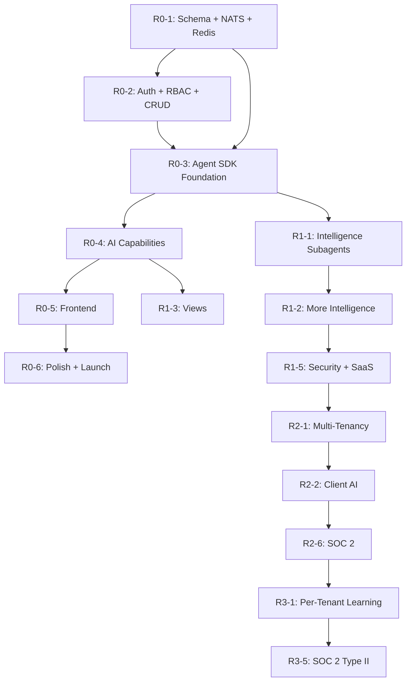

# AI-Native PM Tool — Implementation Plan

> **Version:** 2.0
> **Date:** February 2026
> **Status:** Draft
> **Aligned to:** Architecture v4.0 · Agent SDK Architecture v1.0 · Design v2.0 · Requirements v2.0 · Roadmap v2.3

---

## Changelog

| Version | Date | Changes |
|---------|------|---------|
| v1.0 | February 9, 2026 | Initial plan — 24 sprints, 103 features across R0–R3 |
| v1.1 | February 10, 2026 | Updated sprint distribution for 15 ClickUp gap features (FR-2000–FR-2014) |
| v2.0 | February 2026 | **Agent SDK integration.** Sprint R0-3 redesigned for Agent SDK foundation. Sprint R0-4 updated for subagent-based AI capabilities. 12 new features (FR-3000–FR-3011) distributed across sprints. Total: 115 features across 24 sprints. |

---

## 1. Overview

### 1.1 Timeline

- **Duration:** 12 months
- **Releases:** 4 (R0, R1, R2, R3) — 3 months each
- **Sprints:** 24 total (2-week sprints, 6 per release)
- **Features:** 115 total (103 original + 12 Agent SDK)

### 1.2 Key Change in v2.0

The custom 7-stage AI pipeline from v1.1 is replaced by the Claude Agent SDK multi-agent architecture. This shifts significant work into Sprint R0-3 (Agent SDK Foundation) but reduces custom AI code by ~60% in subsequent sprints. AI capabilities in R0-4 through R3 are implemented as subagents with MCP tools and hooks, not custom pipeline stages.

### 1.3 Release Themes

| Release | Months | Sprints | Feature Count | Theme |
|---------|--------|---------|---------------|-------|
| **R0** | 1-3 | R0-1 to R0-6 | 36 | Foundation + Core AI + Agent SDK |
| **R1** | 4-6 | R1-1 to R1-6 | 38 | Intelligence Layer + SaaS Prep + Views |
| **R2** | 7-9 | R2-1 to R2-6 | 28 | External Launch + Monetization |
| **R3** | 10-12 | R3-1 to R3-6 | 13 | Platform + Per-Tenant Intelligence |

---

## 2. Team Structure

| Role | Count | Responsibilities |
|------|-------|-----------------|
| Backend Engineer | 2 | API, data model, NATS consumers, business logic |
| AI/ML Engineer | 1-2 | Agent SDK orchestrator, subagents, MCP servers, hooks, prompt engineering |
| Fullstack Engineer | 1-2 | Next.js frontend, Shadcn UI, AI interaction surfaces |
| DevOps/Infra Engineer | 1 | AWS CDK, CI/CD, monitoring, NATS/Redis/PG operations |

**v2.0 note:** AI/ML engineers now also own Agent SDK integration, MCP server development, and hook implementation. This is the critical path for R0-3 and R0-4.

---

## 3. Sprint Details — R0 (Months 1-3)

### Sprint R0-1 (Weeks 1-2): Infrastructure + Schema

**Goal:** Set up the development environment and core data infrastructure.

| Task | Owner | Features |
|------|-------|----------|
| PostgreSQL 16 + pgvector setup (Docker Compose) | DevOps | FR-101, FR-102 |
| Drizzle ORM schema (core 15 tables + 4 Agent SDK tables) | Backend | FR-102 |
| NATS JetStream cluster (3-node Docker) | DevOps | FR-100 |
| Redis 7 setup | DevOps | — |
| Monorepo scaffold (Turborepo + pnpm) | DevOps | — |
| CI/CD pipeline (GitHub Actions: lint, test, build) | DevOps | — |
| RLS policies on all tenant-scoped tables | Backend | FR-101 |
| Create ai_sessions, ai_agent_configs, ai_hook_log, ai_mcp_servers tables | Backend | FR-3003, FR-3006 |

**Features delivered:** FR-100, FR-101, FR-102

**Exit criteria:** `docker compose up` brings up PG+NATS+Redis; migrations run; RLS verified; CI green.

---

### Sprint R0-2 (Weeks 3-4): Auth + RBAC + Core API

**Goal:** Implement authentication, authorization, and core CRUD APIs.

| Task | Owner | Features |
|------|-------|----------|
| JWT auth (RS256, refresh rotation, bcrypt) | Backend | FR-103 |
| RBAC engine (Admin + Developer roles) | Backend | FR-104 |
| Projects CRUD API | Backend | FR-102 |
| Tasks CRUD API (full field set, dependencies, sub-tasks) | Backend | FR-105, FR-106, FR-107 |
| Audit trail infrastructure (INSERT-only table) | Backend | FR-108 |
| Admin-configurable values (status labels, priorities) | Backend | FR-109 |
| Task checklists API | Backend | FR-2000 |
| @Mentions parsing + storage | Backend | FR-2004 |

**Features delivered:** FR-103, FR-104, FR-105, FR-106, FR-107, FR-108, FR-109, FR-2000, FR-2004

**Exit criteria:** Auth flows working; RBAC enforced on all endpoints; CRUD operations with audit logging.

---

### Sprint R0-3 (Weeks 5-6): Agent SDK Foundation — CRITICAL PATH

**Goal:** Set up the Claude Agent SDK multi-agent infrastructure.

| Task | Owner | Features |
|------|-------|----------|
| Install `@anthropic-ai/claude-agent-sdk` | AI/ML | FR-3000 |
| Implement orchestrator agent (main entry point) | AI/ML | FR-3000 |
| Define subagent skeletons for 4 R0 capabilities | AI/ML | FR-3001 |
| Create MCP server: pm-db (query + mutate via Drizzle) | AI/ML | FR-3002 |
| Create MCP server: pgvector (semantic search with tenant filter) | AI/ML | FR-3002 |
| Create MCP server: pm-nats (publish + query) | AI/ML | FR-3002 |
| Implement PreToolUse hooks: tenant-isolator, autonomy-enforcer, rate-limiter | AI/ML | FR-3004 |
| Implement PostToolUse hooks: cost-tracker, audit-writer, traceability | AI/ML | FR-3004 |
| Implement Stop hook: session-manager | AI/ML | FR-3004 |
| Implement notification-hook | AI/ML | FR-3004 |
| Session management: create, resume, fork, expire | AI/ML + Backend | FR-3003 |
| Permission evaluation chain (4-step) | AI/ML | FR-3005 |
| Tool restrictions enforcement per subagent | AI/ML | FR-3006 |
| Autonomy policy engine (shadow/propose/execute) | AI/ML + Backend | FR-300 |
| Integration tests: agent → subagent → MCP tool → hooks | AI/ML | — |

**Features delivered:** FR-3000, FR-3001, FR-3002, FR-3003, FR-3004, FR-3005, FR-3006, FR-300

**Exit criteria:** Orchestrator spawns subagent; subagent calls MCP tool; hooks fire correctly; session persists; tenant isolation verified.

**Risk:** This is the highest-risk sprint. Mitigation: AI/ML lead starts SDK prototyping in Week 3 during R0-2.

---

### Sprint R0-4 (Weeks 7-8): Core AI Capabilities

**Goal:** Implement the 4 R0 AI capabilities as Agent SDK subagents.

| Task | Owner | Features |
|------|-------|----------|
| WBS Generator subagent (Opus, R/W tools, 15 turns) | AI/ML | FR-200 |
| Domain-specific prompt templates (3 project types) | AI/ML | FR-200 |
| What's Next engine (R0: rules-based, no LLM) | Backend | FR-201 |
| NL Query subagent (Sonnet, R/O tools, 10 turns) | AI/ML | FR-203 |
| Multi-turn NL query with session support | AI/ML | FR-3011 |
| AI Summary Writer subagent (Sonnet, R/O, 5 turns) | AI/ML | FR-202 |
| AI review/approve interface (backend API) | Backend | FR-301 |
| Prompt registry setup (versioned YAML templates) | AI/ML | — |
| RAG pipeline: embedding generation + pgvector retrieval | AI/ML + Backend | — |
| Confidence thresholds + graceful degradation | AI/ML | FR-303 |

**Features delivered:** FR-200, FR-201, FR-202, FR-203, FR-301, FR-303, FR-3011

**Exit criteria:** NL-to-WBS generates valid WBS; NL query returns answers; summaries generate; multi-turn sessions work.

---

### Sprint R0-5 (Weeks 9-10): Frontend Foundation

**Goal:** Build the web application shell and core UI views.

| Task | Owner | Features |
|------|-------|----------|
| Next.js 15 App Router setup | Fullstack | — |
| Shadcn UI + Tailwind v4 design system | Fullstack | — |
| App shell (header, sidebar, content area) | Fullstack | FR-502 |
| Login/registration page | Fullstack | FR-103 |
| Dashboard (What's Next + AI Summary) | Fullstack | FR-201, FR-202 |
| Project list + project detail views | Fullstack | FR-501 |
| Task list + task detail (3-column layout) | Fullstack | FR-500 |
| NL Query panel (multi-turn with session indicator) | Fullstack | FR-203, FR-3011 |
| WBS Generator UI (submit + review) | Fullstack | FR-200 |
| AI Review panel (proposals list) | Fullstack | FR-301 |
| Comment system with @mentions UI | Fullstack | FR-503, FR-2004 |
| Task checklist widget | Fullstack | FR-2000 |

**Features delivered:** FR-500, FR-501, FR-502, FR-503

**Exit criteria:** All R0 pages render with real data; NL query multi-turn works end-to-end.

---

### Sprint R0-6 (Weeks 11-12): Polish + Internal Launch

**Goal:** Harden, polish, and launch internally.

| Task | Owner | Features |
|------|-------|----------|
| AI shadow mode implementation | AI/ML | FR-302 |
| Rollback/revert semantics | Backend | FR-304 |
| AI traceability pipeline (ai_actions logging) | AI/ML | FR-400 |
| AI evaluation harness (golden test sets) | AI/ML | FR-401 |
| Runtime monitoring (CloudWatch metrics + alarms) | DevOps | FR-402 |
| Bug fixes and performance optimization | All | — |
| Internal team onboarding and training | All | — |
| Load testing at R0 scale (1 tenant, 10 users, 1K tasks) | DevOps | — |

**Features delivered:** FR-302, FR-304, FR-400, FR-401, FR-402

**Exit criteria:** Internal team using daily; shadow mode active; monitoring dashboards operational.

---

## 4. Sprint Details — R1 (Months 4-6)

### Sprint R1-1 (Weeks 13-14): Intelligence Layer

| Task | Owner | Features |
|------|-------|----------|
| AI PM Agent subagent (Sonnet, R/W + Slack tools, 25 turns) | AI/ML | FR-601 |
| Risk Predictor subagent (Opus, R/O, 10 turns) | AI/ML | FR-603 |
| Scope Creep Detector subagent (Sonnet, R/O, 10 turns) | AI/ML | FR-607 |
| Slack integration as MCP server (stdio transport) | AI/ML + Backend | FR-700 |
| Subagent parallelization (Promise.all orchestrator) | AI/ML | FR-3009 |

**Features delivered:** FR-601, FR-603, FR-607, FR-700, FR-3009

---

### Sprint R1-2 (Weeks 15-16): Intelligence Layer (cont.)

| Task | Owner | Features |
|------|-------|----------|
| Adaptive task engine (velocity-aware prioritization) | AI/ML + Backend | FR-600 |
| Auto-generated status reports | AI/ML | FR-602 |
| Cross-project dependency mapping | Backend | FR-604 |
| Resource optimization engine | AI/ML | FR-605 |
| Auto-escalation workflows | Backend + AI/ML | FR-606 |
| Git integration as MCP server | Backend | FR-701 |

**Features delivered:** FR-600, FR-602, FR-604, FR-605, FR-606, FR-701

---

### Sprint R1-3 (Weeks 17-18): Views + Enhanced Tasks

| Task | Owner | Features |
|------|-------|----------|
| Kanban board view (read-only, AI annotations) | Fullstack | FR-1900 |
| Calendar view (month/week/day, drag-to-reschedule) | Fullstack | FR-2002 |
| Table view (inline editing, saved views) | Fullstack | FR-2003 |
| Custom fields (8 types, tenant/project-scoped) | Backend + Fullstack | FR-2005 |
| Default + custom tags | Backend | FR-1000 |

**Features delivered:** FR-1900, FR-2002, FR-2003, FR-2005, FR-1000

---

### Sprint R1-4 (Weeks 19-20): Visualization + Notifications

| Task | Owner | Features |
|------|-------|----------|
| Dependency chain visualization (DAG) | Fullstack | FR-1100 |
| AI-annotated timeline view | Fullstack | FR-1101 |
| Portfolio dashboard (multi-project) | Fullstack | FR-1102 |
| Smart notification system (inbox + preferences) | Backend + Fullstack | FR-2007 |
| Assigned comments / action items | Backend | FR-2008 |
| AI decision log UI | Fullstack | FR-305 |

**Features delivered:** FR-1100, FR-1101, FR-1102, FR-2007, FR-2008, FR-305

---

### Sprint R1-5 (Weeks 21-22): Security + SaaS Prep

| Task | Owner | Features |
|------|-------|----------|
| SSO integration (SAML 2.0, OIDC) | Backend | FR-800 |
| MFA (TOTP + email OTP) | Backend | FR-801 |
| Session hardening (token rotation, concurrent limits) | Backend | FR-802 |
| Client projection data model | Backend | FR-900 |
| Basic read-only client view (pilot) | Fullstack | FR-901 |
| Tenant plan + feature flags | Backend | FR-902 |
| SOC 2 prep (controls documentation) | DevOps | FR-903 |
| AI cost tracking + rate controls | AI/ML + Backend | FR-904 |
| Agent Session Dashboard UI | Fullstack | FR-3008 |

**Features delivered:** FR-800, FR-801, FR-802, FR-900, FR-901, FR-902, FR-903, FR-904, FR-3008

---

### Sprint R1-6 (Weeks 23-24): Polish + Pilot Launch

| Task | Owner | Features |
|------|-------|----------|
| Full-text search (PostgreSQL FTS + GIN) | Backend | FR-1002 |
| Advanced filtering + sorting (saved views) | Fullstack | FR-1003 |
| Recurring tasks | Backend | FR-2001 |
| Task reminders (pg_cron + notification delivery) | Backend | FR-2014 |
| Calendar integration as MCP server | Backend | FR-702 |
| Custom Tool Extension API (MCP server registration) | AI/ML | FR-3007 |
| Bug fixes, performance tuning, stability | All | — |
| Pilot client onboarding (1-2 clients) | All | — |

**Features delivered:** FR-1002, FR-1003, FR-2001, FR-2014, FR-702, FR-3007

**R1 Exit Criteria:** Intelligence layer operational; pilot clients onboarded; Agent SDK subagents for all 7 deployed capabilities; SOC 2 controls documented.

---

## 5. Sprint Details — R2 (Months 7-9)

### Sprint R2-1 (Weeks 25-26): Multi-Tenancy + Client Portal

| Task | Owner | Features |
|------|-------|----------|
| Multi-tenancy live (tenant provisioning, RLS verification) | Backend + DevOps | FR-1200 |
| Client portal (full, white-labeled) | Fullstack | FR-1201 |
| Client role + permissions | Backend | FR-1202 |
| Self-service client onboarding (email invite flow) | Backend + Fullstack | FR-1204 |

**Features delivered:** FR-1200, FR-1201, FR-1202, FR-1204

---

### Sprint R2-2 (Weeks 27-28): Client AI + Reporting

| Task | Owner | Features |
|------|-------|----------|
| Automated client reporting (projection-layer filtered) | AI/ML | FR-1203 |
| Client-facing AI assistant (NL query, projected data only) | AI/ML | FR-1205 |
| AI guardrails for multi-tenant (PII redaction, context isolation) | AI/ML | FR-1403 |
| Tiered pricing (Starter/Pro, feature gating) | Backend | FR-1300 |

**Features delivered:** FR-1203, FR-1205, FR-1403, FR-1300

---

### Sprint R2-3 (Weeks 29-30): Monetization + Enhanced AI

| Task | Owner | Features |
|------|-------|----------|
| AI cost management (live dashboards, rate limits) | Backend + Fullstack | FR-1301 |
| Predictive delivery dating | AI/ML | FR-1500 |
| Scenario planning (what-if analysis) | AI/ML | FR-1502 |
| AI sprint planning (scope suggestions) | AI/ML | FR-1503 |
| Dynamic agent configuration (factory pattern, admin UI) | AI/ML + Fullstack | FR-3010 |

**Features delivered:** FR-1301, FR-1500, FR-1502, FR-1503, FR-3010

---

### Sprint R2-4 (Weeks 31-32): Platform Features

| Task | Owner | Features |
|------|-------|----------|
| Gantt chart view | Fullstack | FR-1901 |
| Goals & OKRs (hierarchy, task linking) | Backend + Fullstack | FR-2006 |
| Custom automations (if-then rules engine) | Backend | FR-2009 |
| Form view / task intake forms | Backend + Fullstack | FR-2010 |
| Bulk task import (CSV/XLSX) | Backend | FR-1001 |

**Features delivered:** FR-1901, FR-2006, FR-2009, FR-2010, FR-1001

---

### Sprint R2-5 (Weeks 33-34): Content + Intelligence

| Task | Owner | Features |
|------|-------|----------|
| Docs & knowledge base (Markdown, RAG-indexed) | Backend + Fullstack | FR-2012 |
| AI writing assistant subagent (Sonnet, R/O) | AI/ML | FR-2013 |
| Formula / computed fields | Backend | FR-2011 |
| Custom AI rules per project | AI/ML | FR-1504 |
| Smart time tracking | AI/ML | FR-1505 |
| AI meeting prep + follow-up | AI/ML | FR-1501 |

**Features delivered:** FR-2012, FR-2013, FR-2011, FR-1504, FR-1505, FR-1501

---

### Sprint R2-6 (Weeks 35-36): Hardening + Compliance

| Task | Owner | Features |
|------|-------|----------|
| Public API layer (REST /api/v1/, OpenAPI docs) | Backend | FR-1400 |
| Webhook system (tenant-configurable, HMAC-SHA256) | Backend | FR-1401 |
| Data export (CSV, JSON, S3 temporary) | Backend | FR-1302 |
| SOC 2 Type I audit initiation | DevOps | FR-1402 |
| Additional integrations (Jira import) | Backend | FR-1506 |
| Load testing at R2 scale (3 tenants, 50 users) | DevOps | — |
| Bug fixes, stability, performance | All | — |

**Features delivered:** FR-1400, FR-1401, FR-1302, FR-1402, FR-1506

**R2 Exit Criteria:** Client portal live; paying tenants onboarded; SOC 2 Type I initiated; 10 subagents deployed; dynamic agent config available.

---

## 6. Sprint Details — R3 (Months 10-12)

### Sprint R3-1 (Weeks 37-38): Per-Tenant Intelligence

| Task | Owner | Features |
|------|-------|----------|
| Per-tenant AI learning (tenant-scoped model contexts) | AI/ML | FR-1600 |
| AI estimation engine (velocity-based, confidence intervals) | AI/ML | FR-1601 |
| Template intelligence (learning-agent subagent) | AI/ML | FR-1602 |

**Features delivered:** FR-1600, FR-1601, FR-1602

---

### Sprint R3-2 (Weeks 39-40): AI Coaching + Consultancy

| Task | Owner | Features |
|------|-------|----------|
| AI coaching layer (delivery pattern insights) | AI/ML | FR-1603 |
| AI retrospective facilitator (planned vs actual analysis) | AI/ML | FR-1604 |
| AI-generated SOWs (sow-generator subagent, Opus) | AI/ML | FR-1800 |

**Features delivered:** FR-1603, FR-1604, FR-1800

---

### Sprint R3-3 (Weeks 41-42): Knowledge + Onboarding

| Task | Owner | Features |
|------|-------|----------|
| Knowledge capture (lessons learned extraction) | AI/ML | FR-1801 |
| AI onboarding for new joiners (project brief generation) | AI/ML | FR-1802 |
| Full self-service onboarding (zero human intervention) | Fullstack + Backend | FR-1700 |

**Features delivered:** FR-1801, FR-1802, FR-1700

---

### Sprint R3-4 (Weeks 43-44): Productization

| Task | Owner | Features |
|------|-------|----------|
| Project Manager role (project-scoped permissions) | Backend | FR-1702 |
| Enterprise tier (schema isolation option, custom SLAs) | Backend + DevOps | FR-1701 |
| Embedded analytics + benchmarking | Fullstack | FR-1803 |

**Features delivered:** FR-1702, FR-1701, FR-1803

---

### Sprint R3-5 (Weeks 45-46): Compliance + Hardening

| Task | Owner | Features |
|------|-------|----------|
| SOC 2 Type II observation + assessment | DevOps | FR-1703 |
| Performance optimization at scale (10+ tenants) | All | — |
| Load testing at R3 scale (10 tenants, 100+ users) | DevOps | — |

**Features delivered:** FR-1703

---

### Sprint R3-6 (Weeks 47-48): Polish + Launch

| Task | Owner | Features |
|------|-------|----------|
| Final bug fixes and stability | All | — |
| Documentation and knowledge transfer | All | — |
| Production hardening and monitoring | DevOps | — |
| R3 retrospective and year-2 planning | All | — |

**R3 Exit Criteria:** 10+ tenants; per-tenant AI learning active; SOC 2 Type II in progress; full self-service onboarding; all 10 subagents deployed with per-tenant configurations.

---

## 7. Feature-to-Sprint Mapping

| Sprint | Features (FR numbers) | Count |
|--------|-----------------------|-------|
| R0-1 | FR-100, FR-101, FR-102 | 3 |
| R0-2 | FR-103, FR-104, FR-105, FR-106, FR-107, FR-108, FR-109, FR-2000, FR-2004 | 9 |
| R0-3 | FR-3000, FR-3001, FR-3002, FR-3003, FR-3004, FR-3005, FR-3006, FR-300 | 8 |
| R0-4 | FR-200, FR-201, FR-202, FR-203, FR-301, FR-303, FR-3011 | 7 |
| R0-5 | FR-500, FR-501, FR-502, FR-503 | 4 |
| R0-6 | FR-302, FR-304, FR-400, FR-401, FR-402 | 5 |
| R1-1 | FR-601, FR-603, FR-607, FR-700, FR-3009 | 5 |
| R1-2 | FR-600, FR-602, FR-604, FR-605, FR-606, FR-701 | 6 |
| R1-3 | FR-1900, FR-2002, FR-2003, FR-2005, FR-1000 | 5 |
| R1-4 | FR-1100, FR-1101, FR-1102, FR-2007, FR-2008, FR-305 | 6 |
| R1-5 | FR-800, FR-801, FR-802, FR-900, FR-901, FR-902, FR-903, FR-904, FR-3008 | 9 |
| R1-6 | FR-1002, FR-1003, FR-2001, FR-2014, FR-702, FR-3007 | 6 |
| R2-1 | FR-1200, FR-1201, FR-1202, FR-1204 | 4 |
| R2-2 | FR-1203, FR-1205, FR-1403, FR-1300 | 4 |
| R2-3 | FR-1301, FR-1500, FR-1502, FR-1503, FR-3010 | 5 |
| R2-4 | FR-1901, FR-2006, FR-2009, FR-2010, FR-1001 | 5 |
| R2-5 | FR-2012, FR-2013, FR-2011, FR-1504, FR-1505, FR-1501 | 6 |
| R2-6 | FR-1400, FR-1401, FR-1302, FR-1402, FR-1506 | 5 |
| R3-1 | FR-1600, FR-1601, FR-1602 | 3 |
| R3-2 | FR-1603, FR-1604, FR-1800 | 3 |
| R3-3 | FR-1801, FR-1802, FR-1700 | 3 |
| R3-4 | FR-1702, FR-1701, FR-1803 | 3 |
| R3-5 | FR-1703 | 1 |
| R3-6 | (polish, no new features) | 0 |
| **Total** | | **115** |

---

## 8. Dependency Graph

### 8.1 Critical Path

```
Schema (R0-1) → Event Bus (R0-1) → Auth/RBAC (R0-2) → Agent SDK Foundation (R0-3) → AI Capabilities (R0-4) → Frontend (R0-5) → Polish (R0-6)
```

The critical path runs through R0-3 (Agent SDK Foundation). This sprint has zero slack and must complete on time for R0-4 to begin.

### 8.2 Key Dependencies



---

## 9. Risk Register

| # | Risk | Impact | Probability | Mitigation |
|---|------|--------|-------------|------------|
| 1 | Agent SDK API breaking changes | High | Medium | Pin SDK version; abstract behind interface layer; update quarterly |
| 2 | R0-3 sprint overruns (Agent SDK complexity) | High | Medium | AI/ML lead starts prototyping in R0-2 (Week 3-4); pair programming |
| 3 | Claude API cost overruns | Medium | Medium | Budget caps via cost-tracker hook; rate limiting; model fallback (Opus→Sonnet) |
| 4 | Team velocity lower than planned | High | Low | Cut "Could Defer" features first; backlog is prioritized |
| 5 | MCP server performance issues | Medium | Low | In-process SDK transport for critical servers; connection pooling |
| 6 | Multi-tenant AI context isolation failure | High | Low | 4-layer isolation (JWT + middleware + RLS + tenant-isolator hook); automated tests |
| 7 | Prompt quality regression | Medium | Medium | Golden test sets (FR-401); CI integration in R1; prompt version control |
| 8 | SOC 2 audit delays | Medium | Low | Start controls documentation in R1; engage auditor early |

---

## 10. Quality Gates

### 10.1 Per-Sprint Gates

| Gate | Requirement |
|------|-------------|
| Test coverage | ≥ 80% on new code |
| Zero P0 bugs | No critical/blocking bugs unresolved |
| Security scan | No high/critical vulnerabilities (npm audit, Snyk) |
| Performance | API endpoints < 500ms p95 |
| CI green | All tests passing, lint clean, build successful |

### 10.2 Per-Release Gates

| Gate | R0 | R1 | R2 | R3 |
|------|----|----|----|----|
| Load testing | 1 tenant, 10 users | 20 users, 10K tasks | 3 tenants, 50 users | 10+ tenants, 100+ users |
| Penetration testing | — | — | External pen test | External pen test |
| Compliance | — | SOC 2 controls documented | SOC 2 Type I initiated | SOC 2 Type II in progress |
| AI quality | WBS acceptance > 40% | WBS acceptance > 60% | Client AI accuracy > 80% | Per-tenant learning validated |
| Agent SDK | 4 subagents, 3 MCP servers | 7 subagents, 6 MCP servers | 10 subagents, dynamic config | Per-tenant agent tuning |

---

## 11. Definition of Done

A feature is "done" when:

1. **Code complete:** Implementation matches the FR acceptance criteria
2. **Tests passing:** Unit + integration tests at ≥ 80% coverage
3. **Code reviewed:** PR approved by at least 1 reviewer
4. **Security scanned:** No high/critical vulnerabilities
5. **Documentation updated:** API docs, architecture docs if changed
6. **Deployed to staging:** Verified in staging environment
7. **PM accepted:** Product manager confirms the feature meets requirements

---

## 12. Agent SDK Integration Timeline

| Sprint | Agent SDK Milestone |
|--------|-------------------|
| R0-3 | Orchestrator + 4 subagent skeletons + 3 MCP servers + 8 hooks + sessions |
| R0-4 | 4 subagents fully operational (wbs-gen, whats-next, nl-query, summary) |
| R1-1 | +3 subagents (ai-pm-agent, risk-predictor, scope-detector) + Slack MCP |
| R1-2 | Git MCP server |
| R1-5 | Agent Session Dashboard UI |
| R1-6 | Calendar MCP server + Custom Tool Extension API |
| R2-3 | Dynamic agent configuration (per-tenant) |
| R2-5 | Writing assistant subagent |
| R3-1 | Learning agent subagent + per-tenant AI tuning |
| R3-2 | SOW generator subagent |

---

*End of Document*
