# AI-Native PM Tool — UI/UX Design System & Page Specification

> **Version:** 2.0
> **Date:** February 2026
> **Status:** Draft
> **Aligned to:** Architecture v4.0, Agent SDK Architecture, Product Roadmap v2.2, Requirements v1.1, Design v2.0
> **Target:** Frontend implementation team — zero design ambiguity
> **Changelog:** v2.0 adds multi-turn AI sessions (Agent SDK), 4 new wireframes (W-09a, W-22 to W-24), updated component architecture, agent lifecycle UI states

---

## 1. Introduction & Cross-References

### 1.1 Purpose

This document is the complete frontend design specification for the AI-Native PM Tool. It defines every page, component, layout, interaction pattern, and design token required to implement the web application. A frontend engineer should be able to build any screen from this document alone, without consulting a designer.

### 1.2 Tech Stack

| Layer | Technology | Purpose |
|-------|-----------|---------|
| Framework | Next.js 15 App Router | RSC, route groups `(internal)` + `(portal)`, server actions |
| UI Primitives | Shadcn UI | Accessible, unstyled component library |
| Styling | Tailwind CSS v4 | Utility-first, design token enforcement |
| Server State | TanStack Query v5 | Cache, mutations, optimistic updates |
| Forms | React Hook Form + Zod | Validation, schema sharing with backend |
| Drag & Drop | dnd-kit | Kanban, task reordering |
| Command Palette | cmdk | Cmd+K global search and actions |
| Charts | Recharts | Dashboard visualizations |
| URL State | nuqs | Filter/pagination state in URL |
| Virtual Scroll | @tanstack/react-virtual | Long list performance |
| Icons | Lucide React | 16x16 icon system |
| Font | Inter (next/font/google) | System typography |

### 1.3 Cross-Reference Conventions

| Prefix | Source Document | Example |
|--------|----------------|---------|
| **FR-xxx** | requirements.md — Functional Requirements | FR-500 (Task Detail View) |
| **NFR-xxx** | requirements.md — Non-Functional Requirements | NFR-100 (API latency p95 < 500ms) |
| **F-xxx** | roadmap-v2.md — Feature IDs | F-012 (What's Next) |
| **ADR-xxx** | design.md — Architecture Decision Records | ADR-011 (Next.js route groups) |
| **W-xxx** | This document — Wireframe IDs | W-01 (Login/Registration) |

### 1.4 Release Scope

| Release | UI Pages Delivered |
|---------|-------------------|
| R0 | Dashboard, Project List, Project Detail, Task List, Task Detail, AI Review, NL Query, Settings, Login |
| R1 | Kanban Board, Calendar View, Table View, AI Timeline, Portfolio Dashboard, Notification Inbox, Dependency Graph, Agent Session Dashboard, Agent Decision Log, Agent Config Panel |
| R2 | Client Portal, Goals/OKR Dashboard, Gantt Chart, Form Builder, Docs Editor |
| R3 | SOW Generator, Coaching Dashboard, Analytics/Benchmarking |

---

## 2. Information Architecture & Navigation

### 2.1 Sitemap

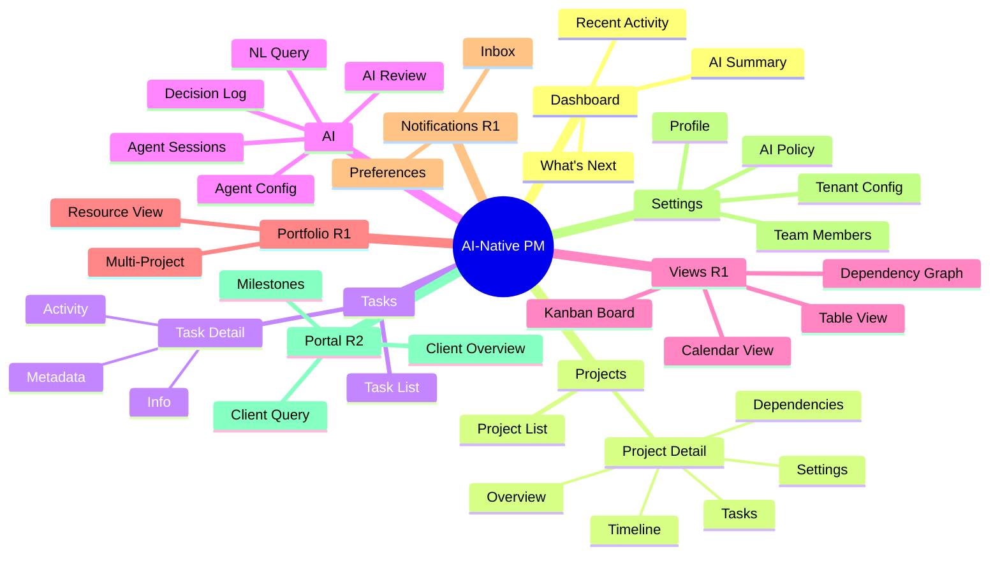

### 2.2 URL Routing Tree (App Router)

```
app/
├── (auth)/
│   ├── login/page.tsx
│   ├── forgot-password/page.tsx
│   └── reset-password/page.tsx
├── (internal)/
│   ├── layout.tsx                    # AppShell: header + sidebar + content
│   ├── dashboard/page.tsx            # What's Next + AI Summary (FR-201)
│   ├── projects/
│   │   ├── page.tsx                  # Project list (FR-501)
│   │   └── [projectId]/
│   │       ├── page.tsx              # Project detail — overview tab (FR-501)
│   │       ├── tasks/page.tsx        # Task list for project (FR-501)
│   │       ├── board/page.tsx        # Kanban view (FR-1900, R1)
│   │       ├── calendar/page.tsx     # Calendar view (FR-2002, R1)
│   │       ├── table/page.tsx        # Table view (FR-2003, R1)
│   │       ├── timeline/page.tsx     # AI timeline (FR-1201, R1)
│   │       ├── dependencies/page.tsx # Dependency graph (FR-1200, R1)
│   │       ├── gantt/page.tsx        # Gantt chart (FR-1202, R2)
│   │       └── settings/page.tsx     # Project settings
│   ├── tasks/
│   │   └── [taskId]/page.tsx         # Task detail (FR-500)
│   ├── ai/
│   │   ├── review/page.tsx           # AI review queue (FR-301)
│   │   ├── decisions/page.tsx        # AI decision log (FR-608, R1)
│   │   ├── sessions/page.tsx         # Agent session dashboard (R1)
│   │   └── config/page.tsx           # Agent config panel — admin (R1)
│   ├── portfolio/page.tsx            # Portfolio dashboard (FR-1202, R1)
│   ├── notifications/page.tsx        # Notification inbox (FR-2007, R1)
│   ├── goals/page.tsx                # Goals & OKRs (FR-2006, R2)
│   └── settings/
│       ├── page.tsx                  # Profile settings
│       ├── ai-policy/page.tsx        # Autonomy controls (FR-300)
│       ├── team/page.tsx             # User management
│       └── tenant/page.tsx           # Tenant config (FR-109)
├── (portal)/                         # R2 — Client-facing
│   └── [tenantSlug]/
│       ├── layout.tsx                # Portal shell: simplified header + nav
│       ├── page.tsx                  # Client overview (FR-1301)
│       ├── milestones/page.tsx       # Milestone progress (FR-1301)
│       └── query/page.tsx            # Client NL query (FR-1305)
└── api/                              # BFF routes
    └── [...proxy]/route.ts           # Proxy to Fastify API
```

### 2.3 Route Group Structure

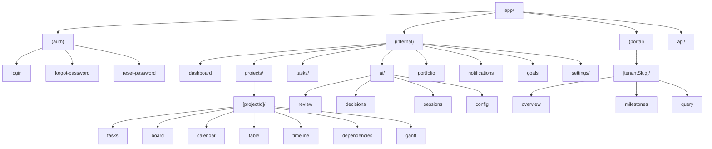

### 2.4 Sidebar Navigation

The sidebar is role-based (FR-502, F-025). Items shown per role:

| Nav Item | Icon | URL | Admin | Developer | PM (R3) | Client (R2) |
|----------|------|-----|-------|-----------|---------|-------------|
| Dashboard | `LayoutDashboard` | `/dashboard` | Yes | Yes | Yes | -- |
| Projects | `FolderKanban` | `/projects` | Yes | Yes | Yes | -- |
| AI Review | `Sparkles` | `/ai/review` | Yes | -- | Yes | -- |
| AI Sessions | `MessageSquare` | `/ai/sessions` | Yes | -- | Yes | -- |
| Portfolio | `BarChart3` | `/portfolio` | Yes | -- | Yes | -- |
| Notifications | `Bell` | `/notifications` | Yes | Yes | Yes | -- |
| Goals | `Target` | `/goals` | Yes | -- | Yes | -- |
| Settings | `Settings` | `/settings` | Yes | -- | -- | -- |
| AI Config | `Cpu` | `/ai/config` | Yes | -- | -- | -- |
| Client Portal | `Globe` | `/portal` | -- | -- | -- | Yes |

**Sidebar behavior:**
- Desktop: collapsed icon-only (56px), expands to 240px on hover/click
- Mobile: hamburger trigger, full-screen slide-out, swipe to dismiss
- Active item: `text-black dark:text-white bg-gray-100 dark:bg-gray-800`
- Inactive item: `text-gray-500 hover:text-gray-700 dark:hover:text-gray-300`
- All sections collapsed by default, persist state in `localStorage`
- Notification badge: red dot on Bell icon when unread > 0

---

## 3. Design Tokens

### 3.1 Color System

All colors are semantic tokens mapped via Tailwind CSS v4 `@theme`.

| Token | Light | Dark | Usage |
|-------|-------|------|-------|
| `--primary` | `hsl(222 47% 31%)` | `hsl(217 91% 60%)` | Primary actions, active nav |
| `--primary-foreground` | `hsl(0 0% 100%)` | `hsl(0 0% 100%)` | Text on primary |
| `--secondary` | `hsl(210 40% 96%)` | `hsl(217 33% 17%)` | Secondary buttons, badges |
| `--success` | `hsl(142 71% 45%)` | `hsl(142 71% 45%)` | Completed states, positive |
| `--warning` | `hsl(38 92% 50%)` | `hsl(38 92% 50%)` | At-risk, caution |
| `--error` | `hsl(0 84% 60%)` | `hsl(0 63% 31%)` | Errors, destructive |
| `--info` | `hsl(199 89% 48%)` | `hsl(199 89% 48%)` | Informational badges |
| `--background` | `hsl(0 0% 100%)` | `hsl(224 71% 4%)` | Page background |
| `--foreground` | `hsl(224 71% 4%)` | `hsl(210 20% 98%)` | Default text |
| `--muted` | `hsl(210 40% 96%)` | `hsl(215 28% 17%)` | Muted backgrounds |
| `--muted-foreground` | `hsl(215 16% 47%)` | `hsl(218 11% 65%)` | Muted text |
| `--border` | `hsl(214 32% 91%)` | `hsl(215 28% 17%)` | Borders, dividers |
| `--ring` | `hsl(222 47% 31%)` | `hsl(217 91% 60%)` | Focus rings |

### 3.2 Typography

| Element | Class | Size | Weight | Line Height |
|---------|-------|------|--------|-------------|
| Body (baseline) | `text-xs` | 12px | `font-normal` (400) | 16px |
| Label / caption | `text-xs` | 12px | `font-medium` (500) | 16px |
| Section header | `text-xs` | 12px | `font-bold` (700) | 16px |
| Page title | `text-sm` | 14px | `font-semibold` (600) | 20px |
| Modal title | `text-sm` | 14px | `font-bold` (700) | 20px |
| Stats / KPI | `text-lg` | 18px | `font-bold` (700) | 28px |
| Navigation | `text-xs` | 12px | `font-normal` (400) | 16px |

**Font stack:** `Inter, ui-sans-serif, system-ui, -apple-system, sans-serif`

### 3.3 Spacing

Base unit: 4px. All spacing uses Tailwind tokens.

| Token | Value | Usage |
|-------|-------|-------|
| `p-1` | 4px | Icon padding, tight spacing |
| `p-2` | 8px | Card padding, input padding |
| `p-3` | 12px | Section padding |
| `p-4` | 16px | Page padding, card body |
| `gap-1` | 4px | Inline element spacing |
| `gap-2` | 8px | Form field spacing |
| `gap-4` | 16px | Section spacing |
| `gap-6` | 24px | Page section spacing |

### 3.4 Shadows & Borders

| Token | Value | Usage |
|-------|-------|-------|
| `shadow-sm` | `0 1px 2px rgba(0,0,0,0.05)` | Cards, dropdowns |
| `shadow-md` | `0 4px 6px rgba(0,0,0,0.1)` | Modals, popovers |
| `shadow-lg` | `0 10px 15px rgba(0,0,0,0.1)` | Dialogs, command palette |
| `border` | `1px solid var(--border)` | Default border |
| `rounded-md` | `6px` | Buttons, inputs |
| `rounded-lg` | `8px` | Cards, panels |
| `rounded-xl` | `12px` | Modals, large containers |

### 3.5 Motion

| Property | Value | Usage |
|----------|-------|-------|
| Duration | `300ms` | Default transition |
| Easing | `cubic-bezier(0.25, 0.46, 0.45, 0.94)` | Spring-like |
| Sidebar expand | `300ms ease-out` | Sidebar collapse/expand |
| Modal enter | `200ms ease-out` | Modal/dialog open |
| Modal exit | `150ms ease-in` | Modal/dialog close |
| Skeleton pulse | `2s ease-in-out infinite` | Loading skeleton |

**Reduced motion:** All animations disabled when `prefers-reduced-motion: reduce`. Provide equivalent non-animated feedback (opacity transitions instead of movement).

---

## 4. Application Shell Layout

### 4.1 Shell Structure

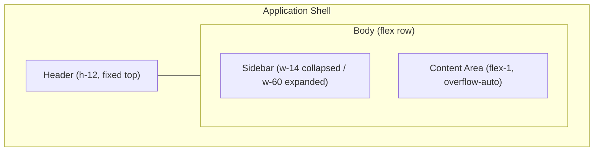

### 4.2 Header Specification

| Element | Spec |
|---------|------|
| Height | `h-12` (48px) |
| Background | `bg-background border-b` |
| Left | Logo (24x24) + App name (`text-sm font-semibold`) |
| Center | Command palette trigger (`Cmd+K`, `cmdk`) |
| Right | Notification bell + User avatar dropdown |
| Position | `fixed top-0 left-0 right-0 z-50` |

### 4.3 Sidebar Specification

| Property | Collapsed | Expanded |
|----------|-----------|----------|
| Width | `w-14` (56px) | `w-60` (240px) |
| Items | Icon only | Icon + label |
| Padding | `py-1 px-2` | `py-1 px-3` |
| Spacing | `space-y-0.5` | `space-y-0.5` |
| Transition | `300ms width ease-out` | |

### 4.4 Content Area

| Property | Spec |
|----------|------|
| Padding | `p-4` desktop, `p-3` mobile |
| Max width | `max-w-7xl mx-auto` |
| Overflow | `overflow-y-auto` |
| Breadcrumbs | Top of content area, `text-xs`, interactive links |

### 4.5 Responsive Breakpoints

| Breakpoint | Width | Layout |
|------------|-------|--------|
| `xs` | 320px | Single column, bottom nav |
| `sm` | 375px | Single column, bottom nav |
| `md` | 768px | Sidebar collapsed + content |
| `lg` | 1024px | Sidebar expanded + content |
| `xl` | 1440px | Sidebar expanded + content + right panel |

---

## 5. Wireframes — Core Pages (W-01 to W-21)

### W-01: Login / Registration

**Refs:** FR-100, FR-101, F-001, F-002

```
+------------------------------------------+
| [Logo]  AI-Native PM                     |
+------------------------------------------+
|                                          |
|     +----------------------------+       |
|     |     Welcome Back           |       |
|     |                            |       |
|     |  Email                     |       |
|     |  [________________________]|       |
|     |                            |       |
|     |  Password                  |       |
|     |  [________________________]|       |
|     |                            |       |
|     |  [  Sign In             ]  |       |
|     |                            |       |
|     |  Forgot password?  Sign Up |       |
|     +----------------------------+       |
|                                          |
+------------------------------------------+
```

**Annotations:**
- Centered card (max-w-sm), `shadow-lg rounded-xl`
- Email field: `type="email"`, inline validation
- Password field: `type="password"`, show/hide toggle
- Sign In: primary button, full width, loading spinner on submit
- OAuth buttons below (Google, GitHub) if enabled
- Registration form: name, email, password, confirm password, tenant name

---

### W-02: Dashboard Overview

**Refs:** FR-201, FR-202, F-011, F-012

```
+--[Header: Logo | Cmd+K | Bell Avatar]---+
|[Nav]|                                    |
|     | Dashboard                          |
|     | +-------------+ +---------------+  |
|     | | AI Summary  | | What's Next   |  |
|     | | 12 tasks    | | 1. Review PR  |  |
|     | | 3 at-risk   | | 2. Update doc |  |
|     | | 2 blocked   | | 3. Sprint rev |  |
|     | +-------------+ +---------------+  |
|     |                                    |
|     | +--[Recent Activity]-------------+ |
|     | | [avatar] John moved Task-42    | |
|     | | [avatar] AI flagged risk on P3 | |
|     | | [avatar] Sara completed T-88   | |
|     | +--------------------------------+ |
+------------------------------------------+
```

**Annotations:**
- 2-column grid at `lg`, stacked at `md` and below
- AI Summary card: `bg-primary/5 border-primary/20 rounded-lg p-4`
- What's Next: ordered list, each item clickable to task detail
- Recent Activity: virtual scroll for long lists, avatar + action + timestamp
- Auto-refresh: TanStack Query `refetchInterval: 30_000`

---

### W-03: Project List

**Refs:** FR-501, F-020, F-021

```
+--[Header]--------------------------------+
|[Nav]|                                    |
|     | Projects          [+ New Project]  |
|     | [Search___] [Status v] [Sort v]    |
|     |                                    |
|     | +------+--------+------+--------+  |
|     | | Name | Status | Tasks| Updated|  |
|     | +------+--------+------+--------+  |
|     | | Proj | Active |  24  | 2h ago |  |
|     | | Web  | At Risk|  42  | 1d ago |  |
|     | | API  | Done   |  18  | 3d ago |  |
|     | +------+--------+------+--------+  |
|     |                                    |
|     | [< 1 2 3 ... 10 >]                 |
+------------------------------------------+
```

**Annotations:**
- Search: `cmdk` inline, debounced 300ms
- Filters: status, date range, owner — URL state via `nuqs`
- Table: sortable columns, click row to navigate to project detail
- Pagination: 20 items/page, `nuqs` for page state
- New Project button: opens modal with form (name, description, template)
- Empty state: illustration + "Create your first project" CTA

---

### W-04: Project Detail / Task Board

**Refs:** FR-501, FR-502, F-022, F-023

```
+--[Header]--------------------------------+
|[Nav]|                                    |
|     | Project: Website Redesign          |
|     | [Overview][Tasks][Board][Timeline]  |
|     |                                    |
|     | +----------+----------+----------+ |
|     | | To Do    | In Prog  | Done     | |
|     | |          |          |          | |
|     | | [Task-1] | [Task-3] | [Task-5] | |
|     | | [Task-2] | [Task-4] | [Task-6] | |
|     | |          |          |          | |
|     | | +Add     | +Add     |          | |
|     | +----------+----------+----------+ |
|     |                                    |
+------------------------------------------+
```

**Annotations:**
- Tab bar: `text-xs`, underline active tab, URL-driven (`?tab=board`)
- Board columns: `dnd-kit` drag-and-drop between columns
- Task cards: title, assignee avatar, priority badge, due date
- Column header: count badge, "+" button to quick-add task
- Horizontal scroll on mobile for columns
- Overview tab: project description, team, milestones summary

---

### W-05: Task Detail Panel

**Refs:** FR-500, FR-503, F-024

```
+--[Header]--------------------------------+
|[Nav]| Task List       | Task Detail      |
|     |                 |                  |
|     | [Search___]     | Task-42: Fix nav |
|     |                 | Status: [In Prog]|
|     | * Task-40       | Assignee: [John] |
|     | * Task-41       | Priority: [High] |
|     | > Task-42 <--   | Due: [Feb 28]    |
|     | * Task-43       |                  |
|     |                 | Description:     |
|     |                 | [Rich text edit] |
|     |                 |                  |
|     |                 | [Activity Tab]   |
|     |                 | John: "Updated"  |
|     |                 | AI: "Risk flag"  |
+------------------------------------------+
```

**Annotations:**
- 3-column layout at `xl`: nav | task list | task detail
- 2-column at `lg`: task list | task detail
- Mobile: full-screen task detail, back button
- Inline editing: click status/assignee/priority to change
- Activity feed: comments + AI annotations + history, chronological
- Subtasks: collapsible list below description
- Metadata sidebar: custom fields, labels, dependencies

---

### W-06: WBS Generator Panel (AI)

**Refs:** FR-400, F-030

```
+--[Header]--------------------------------+
|[Nav]|                                    |
|     | WBS Generator                      |
|     |                                    |
|     | Project: [Website Redesign    v]   |
|     | Prompt:                            |
|     | [Break down the frontend work   ]  |
|     | [into tasks with estimates      ]  |
|     |                                    |
|     | [Generate WBS]                     |
|     |                                    |
|     | +--[Generated WBS]--------------+  |
|     | | 1. Setup (2d)                 |  |
|     | |   1.1 Next.js scaffold (4h)   |  |
|     | |   1.2 Design tokens (4h)      |  |
|     | | 2. Components (5d)            |  |
|     | |   2.1 Header (8h)             |  |
|     | |   2.2 Sidebar (8h)            |  |
|     | +-------------------------------+  |
|     | [Accept All] [Edit] [Regenerate]   |
+------------------------------------------+
```

**Annotations:**
- Project selector: dropdown, pre-filled if navigated from project
- Prompt: multi-line textarea, placeholder with examples
- Generate: primary button, streams response via SSE
- WBS tree: indented, expandable nodes, editable inline
- Accept All: creates tasks in project, shows confirmation
- Edit: opens inline editor per WBS item
- Confidence badges on each generated item

---

### W-07: What's Next Panel (AI)

**Refs:** FR-201, F-012

```
+--[Header]--------------------------------+
|[Nav]|                                    |
|     | What's Next                        |
|     |                                    |
|     | AI-prioritized tasks for today:    |
|     |                                    |
|     | 1. [!] Review PR #42        [->]   |
|     |    Due today, blocker for T-55     |
|     |                                    |
|     | 2. [~] Update API docs      [->]   |
|     |    Sprint goal, 80% complete       |
|     |                                    |
|     | 3. [ ] Sprint retrospective [->]   |
|     |    Scheduled for 3pm               |
|     |                                    |
|     | Reasoning: Prioritized by due      |
|     | date, blocker impact, and sprint   |
|     | goal alignment.                    |
|     |                                    |
|     | [Refresh] [Adjust Priorities]      |
+------------------------------------------+
```

**Annotations:**
- Ordered list: priority icon (! urgent, ~ medium, blank normal)
- Each item: task title, reason snippet, arrow to navigate
- Reasoning section: collapsible, AI explanation of prioritization
- Refresh: re-queries AI with current state
- Adjust Priorities: opens modal to set custom priority weights
- Auto-refreshes every 5 minutes

---

### W-08: AI Review Panel (Split View)

**Refs:** FR-301, FR-302, F-031

```
+--[Header]--------------------------------+
|[Nav]|                                    |
|     | AI Review Queue          [3 items] |
|     |                                    |
|     | +--[Queue]----+--[Detail]--------+ |
|     | |             |                  | |
|     | | > Move T-12 | Action: Move     | |
|     | |   to Done   | Task-12 to Done  | |
|     | |             |                  | |
|     | |   Reassign  | Confidence: 87%  | |
|     | |   T-33      | Reasoning:       | |
|     | |             | "All subtasks    | |
|     | |   Flag risk | complete, tests  | |
|     | |   on P-5    | passing."        | |
|     | |             |                  | |
|     | |             | [Approve] [Deny] | |
|     | |             | [Edit & Approve] | |
|     | +-------------+------------------+ |
+------------------------------------------+
```

**Annotations:**
- Split view: queue list (1/3) | detail (2/3)
- Queue items: action type icon, brief description, timestamp
- Detail: full action description, confidence %, AI reasoning
- Approve: executes action, removes from queue, shows toast
- Deny: dismisses with optional feedback textarea
- Edit & Approve: inline edit fields, then execute
- Badge count in sidebar nav item

---

### W-09: NL Query Panel (Slide-Out)

**Refs:** FR-600, F-040

```
+--[Header]--------------------------------+
|[Nav]| [Current Page]    +--[NL Query]--+ |
|     |                   |              | |
|     |                   | Ask AI...    | |
|     |                   |              | |
|     |                   | [How many    | |
|     |                   |  tasks are   | |
|     |                   |  overdue?  ] | |
|     |                   |              | |
|     |                   | [Send]       | |
|     |                   |              | |
|     |                   | Answer:      | |
|     |                   | 7 tasks are  | |
|     |                   | overdue.     | |
|     |                   | [View Tasks] | |
|     |                   |              | |
|     |                   | Suggestions: | |
|     |                   | "Show by     | |
|     |                   |  project"    | |
|     |                   +--------------+ |
+------------------------------------------+
```

**Annotations:**
- Slide-out panel: 360px width, `shadow-lg`, backdrop blur
- Trigger: Cmd+K or AI icon in header
- Input: auto-focus, placeholder "Ask anything about your projects..."
- Send: primary button or Enter key
- Answer: markdown rendered, streaming response
- Action buttons: context-dependent (View Tasks, Create Chart, Export)
- Suggestions: clickable follow-up queries
- Close: X button, Escape key, click outside

---

### W-10: Settings / Tenant Config

**Refs:** FR-109, FR-300, F-050

```
+--[Header]--------------------------------+
|[Nav]|                                    |
|     | Settings                           |
|     | [Profile][AI Policy][Team][Tenant] |
|     |                                    |
|     | Profile                            |
|     | +------------------------------+   |
|     | | Name:  [John Smith        ]  |   |
|     | | Email: [john@company.com  ]  |   |
|     | | Avatar: [Upload]             |   |
|     | | Theme:  [Light v]            |   |
|     | | Notifications: [On/Off]      |   |
|     | +------------------------------+   |
|     |                                    |
|     | [Save Changes]                     |
+------------------------------------------+
```

**Annotations:**
- Tab navigation: Profile, AI Policy, Team, Tenant
- AI Policy tab: autonomy level slider (1-5), action type toggles
- Team tab: member list with role badges, invite button
- Tenant tab: org name, billing info, plan details (admin only)
- Form validation: React Hook Form + Zod, inline errors
- Save: optimistic update with rollback on failure

---

### W-11: Team Management

**Refs:** FR-110, F-051

```
+--[Header]--------------------------------+
|[Nav]|                                    |
|     | Team Management     [+ Invite]     |
|     | [Search___]                        |
|     |                                    |
|     | +------+-------+------+--------+   |
|     | | Name | Email | Role | Status |   |
|     | +------+-------+------+--------+   |
|     | | John | j@c.c | Admin| Active |   |
|     | | Sara | s@c.c | Dev  | Active |   |
|     | | Alex | a@c.c | PM   | Invite |   |
|     | +------+-------+------+--------+   |
|     |                                    |
|     | Showing 3 of 3 members             |
+------------------------------------------+
```

**Annotations:**
- Table: sortable by name, role, status
- Invite button: modal with email + role selector
- Role dropdown: Admin, Developer, PM, Viewer
- Status badges: Active (green), Invited (yellow), Deactivated (gray)
- Row actions: edit role, deactivate, remove (with confirmation)
- Search: filter by name or email, debounced 300ms

---

### W-12: Kanban Board View (R1)

**Refs:** FR-1900, F-089

```
+--[Header]--------------------------------+
|[Nav]|                                    |
|     | Project > Kanban Board             |
|     | [Filter v] [Group v] [+ Column]    |
|     |                                    |
|     | +--------+--------+--------+-----+ |
|     | |Backlog |To Do   |In Prog |Done | |
|     | |   (5)  |  (8)   |  (3)   | (12)| |
|     | |        |        |        |     | |
|     | |[card]  |[card]  |[card]  |[card]| |
|     | |[card]  |[card]  |[card]  |     | |
|     | |[card]  |[card]  |        |     | |
|     | |        |        |        |     | |
|     | |+Add    |+Add    |+Add    |     | |
|     | +--------+--------+--------+-----+ |
+------------------------------------------+
```

**Annotations:**
- Columns: dnd-kit sortable, horizontal scroll on mobile
- Cards: drag between columns, shows title, assignee, priority, due
- Group by: status (default), assignee, priority, label
- Filter: assignee, priority, label, due date range
- Column limit: WIP limit badge, yellow highlight when exceeded
- Quick add: inline input at column bottom, Enter to create

---

### W-13: Calendar View (R1)

**Refs:** FR-2002, F-091

```
+--[Header]--------------------------------+
|[Nav]|                                    |
|     | Project > Calendar                 |
|     | [< Feb 2026 >] [Month|Week|Day]   |
|     |                                    |
|     | Mon  Tue  Wed  Thu  Fri  Sat  Sun  |
|     | +----+----+----+----+----+----+--+ |
|     | |    |    |    |    |    |    |  | |
|     | | 1  | 2  | 3  | 4  | 5  | 6 | 7| |
|     | |    |[T1]|    |[T2]|    |   |  | |
|     | +----+----+----+----+----+----+--+ |
|     | | 8  | 9  | 10 | 11 | 12 |13 |14| |
|     | |[T3]|    |[T4]|    |[T5]|   |  | |
|     | +----+----+----+----+----+----+--+ |
+------------------------------------------+
```

**Annotations:**
- View modes: Month (default), Week, Day
- Tasks shown on due date, colored by priority
- Click task to open detail panel
- Drag task to reschedule (updates due date)
- Today highlighted with primary color border
- Overflow: "+3 more" link when > 3 tasks in a day cell

---

### W-14: Table View (R1)

**Refs:** FR-2003, F-092

```
+--[Header]--------------------------------+
|[Nav]|                                    |
|     | Project > Table View               |
|     | [Search] [Filter v] [Columns v]    |
|     |                                    |
|     | +--+------+------+----+-----+----+ |
|     | |# | Name | Stat | Pri| Due  |Asgn| |
|     | +--+------+------+----+-----+----+ |
|     | |1 | Fix  | Open | Hi | 2/15|John| |
|     | |2 | Add  | Prog | Md | 2/20|Sara| |
|     | |3 | Test | Done | Lo | 2/10|Alex| |
|     | +--+------+------+----+-----+----+ |
|     |                                    |
|     | [< 1 2 3 >]  Showing 1-20 of 45   |
+------------------------------------------+
```

**Annotations:**
- Sortable columns: click header to sort ASC/DESC
- Inline editing: double-click cell to edit
- Column visibility: toggle columns via dropdown
- Bulk actions: checkbox column, select multiple for batch update
- Export: CSV/JSON export button
- Virtual scroll for large datasets (> 100 rows)
- Mobile: card layout instead of table

---

### W-15: AI-Annotated Timeline (R1)

**Refs:** FR-1201, F-060

```
+--[Header]--------------------------------+
|[Nav]|                                    |
|     | Project > Timeline                 |
|     | [Zoom: Week v] [Filter v]          |
|     |                                    |
|     | Feb 10    Feb 17    Feb 24   Mar 3 |
|     | |---------|---------|--------|     |
|     | [==Setup==]                         |
|     |      [====Frontend Dev====]        |
|     |              [===Testing===]       |
|     |                                    |
|     | AI Annotations:                    |
|     | [!] Setup may slip 2 days          |
|     | [~] Frontend on track              |
|     | [i] Testing starts Feb 24          |
+------------------------------------------+
```

**Annotations:**
- Horizontal timeline: zoom levels (Day, Week, Month, Quarter)
- Task bars: colored by status, drag to resize (updates dates)
- Dependencies: arrow lines between related tasks
- AI annotations: risk flags, suggestions overlaid on timeline
- Hover: tooltip with task details and AI reasoning
- Critical path highlighting in red

---

### W-16: Portfolio Dashboard (R1)

**Refs:** FR-1202, F-061

```
+--[Header]--------------------------------+
|[Nav]|                                    |
|     | Portfolio Dashboard                |
|     |                                    |
|     | +----------+----------+----------+ |
|     | | Active:8 | At Risk:2| Done: 15 | |
|     | +----------+----------+----------+ |
|     |                                    |
|     | +-----+------+------+----------+   |
|     | | Proj| Health|Prog% | Next Due |   |
|     | +-----+------+------+----------+   |
|     | | Web | Green | 72%  | Feb 15   |   |
|     | | API | Red   | 45%  | Feb 20   |   |
|     | | App | Yellow| 60%  | Mar 01   |   |
|     | +-----+------+------+----------+   |
+------------------------------------------+
```

**Annotations:**
- Summary cards: total active, at-risk, completed projects
- Health: green/yellow/red dot, AI-calculated from task progress + risks
- Progress: horizontal bar chart in cell
- Click row to navigate to project detail
- Charts section below: Recharts bar/line for trend over time
- Filter by team, date range, health status

---

### W-17: Notification Inbox (R1)

**Refs:** FR-2007, F-093

```
+--[Header]--------------------------------+
|[Nav]|                                    |
|     | Notifications      [Mark All Read] |
|     | [All][Mentions][AI][Assignments]    |
|     |                                    |
|     | Today                              |
|     | +--------------------------------+ |
|     | | [*] AI flagged risk on Proj-3  | |
|     | |     2 minutes ago              | |
|     | +--------------------------------+ |
|     | | [ ] Sara mentioned you in T-42 | |
|     | |     1 hour ago                 | |
|     | +--------------------------------+ |
|     | | [ ] Assigned: Fix login bug    | |
|     | |     3 hours ago                | |
|     | +--------------------------------+ |
+------------------------------------------+
```

**Annotations:**
- Tabs: All, Mentions, AI Actions, Assignments
- Unread: bold text, blue dot indicator
- Click: navigates to relevant entity (task, project, review)
- Mark all read: batch operation
- Group by: Today, Yesterday, This Week, Older
- Real-time: WebSocket push for new notifications
- Swipe to dismiss on mobile

---

### W-18: Dependency Graph (R1)

**Refs:** FR-1200, F-059

```
+--[Header]--------------------------------+
|[Nav]|                                    |
|     | Project > Dependencies             |
|     | [Zoom +/-] [Filter v] [Layout v]   |
|     |                                    |
|     |    [Task-1]--->[Task-3]            |
|     |       |            |               |
|     |       v            v               |
|     |    [Task-2]--->[Task-4]            |
|     |                    |               |
|     |                    v               |
|     |               [Task-5]             |
|     |                                    |
|     | Legend: [-->] blocks  [..>] related |
|     | Critical path highlighted in red   |
+------------------------------------------+
```

**Annotations:**
- Graph: force-directed layout, D3.js or similar
- Nodes: task cards with title, status badge
- Edges: solid = blocks, dashed = related
- Critical path: red highlighted edges
- Click node: opens task detail side panel
- Zoom: mouse wheel, pinch on mobile
- Layout options: tree, force-directed, hierarchical

---

### W-19: Client Portal (R2)

**Refs:** FR-1301, FR-1305, F-070

```
+--[Portal Header: Company Logo]----------+
|                                          |
| Welcome, Client Name                     |
| Project: Website Redesign                |
|                                          |
| +--[Progress]-------------------------+  |
| | Overall: [=========>     ] 72%      |  |
| | Milestones: 3/5 complete            |  |
| +-------------------------------------+  |
|                                          |
| +--[Milestones]---+--[Ask AI]--------+   |
| | [x] Discovery   | "When will the   |   |
| | [x] Design      |  project finish?"|   |
| | [x] Frontend    |                  |   |
| | [ ] Backend     | Est. completion: |   |
| | [ ] Launch      | March 15, 2026   |   |
| +-----------------+------------------+   |
+------------------------------------------+
```

**Annotations:**
- Simplified shell: no sidebar, minimal header with client logo
- Progress bar: animated on load, color by health
- Milestones: checkbox list with dates and status
- Ask AI: simplified NL query scoped to client's project
- Read-only: clients cannot edit tasks or milestones
- Responsive: fully functional on mobile

---

### W-20: Goals & OKR Dashboard (R2)

**Refs:** FR-2006, F-094

```
+--[Header]--------------------------------+
|[Nav]|                                    |
|     | Goals & OKRs          [+ Goal]     |
|     | Q1 2026                            |
|     |                                    |
|     | Objective: Ship v2.0               |
|     | +----+------------------+------+   |
|     | | KR | Description      | Prog |   |
|     | +----+------------------+------+   |
|     | | 1  | API coverage 90% | 72%  |   |
|     | | 2  | 0 critical bugs  | 100% |   |
|     | | 3  | Client approval   | 50%  |   |
|     | +----+------------------+------+   |
|     |                                    |
|     | Overall: [==========>    ] 74%     |
+------------------------------------------+
```

**Annotations:**
- Objective-level cards with nested KR table
- Progress bars: auto-calculated from linked tasks
- Add Goal: modal with objective, key results, linked projects
- Quarter selector: Q1-Q4 navigation
- AI suggestion: "Based on velocity, KR-3 may miss target"
- Drill down: click KR to see linked tasks

---

### W-21: Gantt Chart View (R2)

**Refs:** FR-1202, F-095

```
+--[Header]--------------------------------+
|[Nav]|                                    |
|     | Project > Gantt Chart              |
|     | [Zoom: Week v] [Critical Path]     |
|     |                                    |
|     | Task       |Feb10|Feb17|Feb24|Mar3|
|     | -----------+-----+-----+-----+----+
|     | Setup      |[===]|     |     |    |
|     |  Scaffold  |[==] |     |     |    |
|     |  Tokens    | [=] |     |     |    |
|     | Frontend   |     |[========] |    |
|     |  Header    |     |[===]|     |    |
|     |  Sidebar   |     |  [===]    |    |
|     | Testing    |     |     |[======]  |
|     | -----------+-----+-----+-----+----+
+------------------------------------------+
```

**Annotations:**
- Left panel: task hierarchy (WBS tree), resizable
- Right panel: timeline bars, zoom (Day/Week/Month/Quarter)
- Dependencies: arrow connectors between bars
- Critical path toggle: highlights in red
- Drag bars to reschedule, drag edges to resize duration
- Milestones: diamond markers on timeline
- Baseline comparison: gray ghost bars for original plan

---

## 6. Wireframes — Agent SDK Pages (W-09a, W-22 to W-24)

### W-09a: NL Query Panel (Multi-Turn) — UPDATED

**Refs:** FR-600, F-040, Agent SDK

```
+--[Header]--------------------------------+
|[Nav]| [Current Page]  +--[NL Query]----+ |
|     |                 | Session: #a3f2 | |
|     |                 | Cap: nl_query  | |
|     |                 | [New] [Resume] | |
|     |                 |                | |
|     |                 | You: How many  | |
|     |                 | tasks overdue? | |
|     |                 |                | |
|     |                 | AI: 7 tasks    | |
|     |                 | are overdue.   | |
|     |                 | [View Tasks]   | |
|     |                 |                | |
|     |                 | You: Show by   | |
|     |                 | project        | |
|     |                 |                | |
|     |                 | AI: [streaming | |
|     |                 |  ...]          | |
|     |                 |                | |
|     |                 | [Fork] [____] | |
|     |                 |        [Send]  | |
|     |                 +----------------+ |
+------------------------------------------+
```

**Annotations:**
- Session indicator: session ID (truncated), capability badge, duration
- New Session: creates fresh agent session, clears history
- Resume Session: dropdown of recent sessions (last 10)
- Message bubbles: user right-aligned, AI left-aligned
- Streaming: animated dots while AI responds, progressive text render
- Fork button: branches current conversation into new session
- Conversation history: scrollable, virtual scroll for long sessions
- Session persists across page navigation within same browser tab

---

### W-22: Agent Session Dashboard

**Refs:** Agent SDK, F-040

```
+--[Header]--------------------------------+
|[Nav]|                                    |
|     | Agent Sessions                     |
|     |                                    |
|     | +--------+--------+---------+      |
|     | |Active:3|Paused:1|Total:142|      |
|     | | $12.40 | $0.80  | $847.20 |      |
|     | +--------+--------+---------+      |
|     |                                    |
|     | [Capability v][Status v][Date v]   |
|     |                                    |
|     | +----+--------+------+-----+-----+ |
|     | | ID | Capblty| Stat | Dur |Cost | |
|     | +----+--------+------+-----+-----+ |
|     | |a3f2| NL Qry |Active| 5m |$0.12| |
|     | |b7e1| WBS Gen|Done  |12m |$0.45| |
|     | |c9d4| Review |Pause | 3m |$0.08| |
|     | +----+--------+------+-----+-----+ |
|     |                                    |
|     | [< 1 2 3 >]                        |
+------------------------------------------+
```

**Annotations:**
- Summary cards: active/paused/total sessions with cost aggregation
- Filter bar: capability dropdown (10 agents), status, date range
- Table columns: session ID (link), capability, status badge, started, duration, cost, actions
- Status badges: Active (green pulse), Paused (yellow), Completed (gray), Expired (red)
- Click row: navigates to session detail with decision log
- Cost: calculated from token usage, displayed in USD
- Auto-refresh: 10s interval for active sessions
- Pagination: 20 per page, URL state via `nuqs`

---

### W-23: Agent Decision Log

**Refs:** Agent SDK, FR-608

```
+--[Header]--------------------------------+
|[Nav]|                                    |
|     | Session #a3f2 — Decision Log       |
|     | Cap: nl_query | Turns: 5 | $0.12  |
|     |                                    |
|     | [All][Allowed][Denied][Modified]    |
|     |                                    |
|     | Turn 1                             |
|     | +--------------------------------+ |
|     | | Tool: projectQuery        92%  | |
|     | | > Input: {project: "web"...}   | |
|     | | > Output: {tasks: [...]}       | |
|     | | Hook: ALLOWED            14ms  | |
|     | +--------------------------------+ |
|     |                                    |
|     | Turn 2                             |
|     | +--------------------------------+ |
|     | | Tool: taskUpdate          78%  | |
|     | | > Input: {taskId: 42...}       | |
|     | | Hook: DENIED (no perms)  8ms   | |
|     | +--------------------------------+ |
+------------------------------------------+
```

**Annotations:**
- Session header: capability, turn count, total cost
- Filter tabs: All, Allowed, Denied, Modified decisions
- Expandable rows: click to show full input/output JSON
- Confidence score: percentage badge, color-coded (green > 80, yellow > 60, red < 60)
- Hook decision: ALLOWED (green), DENIED (red), MODIFIED (yellow) badges
- Latency: milliseconds per tool call
- Tool name: monospace font, linked to tool documentation
- Chronological order: newest at bottom (chat-like)
- Export: JSON download of full session trace

---

### W-24: Agent Config Panel (Admin)

**Refs:** Agent SDK, FR-300

```
+--[Header]--------------------------------+
|[Nav]|                                    |
|     | Agent Configuration    [Admin]     |
|     |                                    |
|     | Capability: [nl_query          v]  |
|     |                                    |
|     | +--[Model & Limits]-------------+  |
|     | | Model:  (o) Sonnet  ( ) Opus  |  |
|     | | Max Turns:  [===|====] 15     |  |
|     | | Timeout:    [==|=====] 5 min  |  |
|     | +-------------------------------+  |
|     |                                    |
|     | +--[Allowed Tools]--------------+  |
|     | | [x] projectQuery              |  |
|     | | [x] taskSearch                |  |
|     | | [ ] taskUpdate                |  |
|     | | [ ] taskDelete                |  |
|     | | [x] analyticsQuery            |  |
|     | +-------------------------------+  |
|     |                                    |
|     | +--[Permissions]----------------+  |
|     | | Mode: (o) Default             |  |
|     | |       ( ) Accept Edits        |  |
|     | |       ( ) Bypass Permissions  |  |
|     | +-------------------------------+  |
|     |                                    |
|     | +--[Hooks]-----------------------+ |
|     | | beforeToolCall:  [On ] [Off]   | |
|     | | afterToolCall:   [On ] [Off]   | |
|     | | onError:         [On ] [Off]   | |
|     | +-------------------------------+  |
|     |                                    |
|     | [Save Configuration] [Reset]       |
+------------------------------------------+
```

**Annotations:**
- Capability selector: dropdown of all 10 agent capabilities
- Model selector: radio buttons, Sonnet (default) or Opus
- Max turns slider: 1-50, default varies by capability
- Timeout slider: 1-30 minutes
- Allowed tools: checkbox list, varies per capability
- Permission mode: radio group with description tooltips
- Hook toggles: on/off per lifecycle hook
- Save: validates config, shows diff preview before saving
- Reset: restores capability defaults with confirmation dialog
- Admin-only page: redirect non-admins to 403

---

## 7. Component Architecture

### 7.1 Component Hierarchy

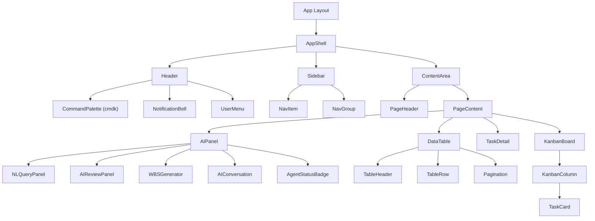

### 7.2 Core Components

#### Layout Components

```typescript
// AppShell — wraps all internal pages
interface AppShellProps {
  children: React.ReactNode;
}

// Sidebar — role-based navigation
interface SidebarProps {
  collapsed: boolean;
  onToggle: () => void;
  role: 'admin' | 'developer' | 'pm' | 'viewer';
}

// PageHeader — breadcrumbs + title + actions
interface PageHeaderProps {
  title: string;
  breadcrumbs: { label: string; href: string }[];
  actions?: React.ReactNode;
}
```

#### Data Display Components

```typescript
// DataTable — generic sortable, filterable table
interface DataTableProps<T> {
  data: T[];
  columns: ColumnDef<T>[];
  pagination?: { page: number; pageSize: number; total: number };
  onSort?: (column: string, direction: 'asc' | 'desc') => void;
  onFilter?: (filters: Record<string, unknown>) => void;
  onRowClick?: (row: T) => void;
  loading?: boolean;
  emptyState?: React.ReactNode;
}

// TaskCard — used in Kanban, lists, and search results
interface TaskCardProps {
  task: {
    id: string;
    title: string;
    status: TaskStatus;
    priority: Priority;
    assignee?: { name: string; avatarUrl: string };
    dueDate?: string;
    labels?: string[];
  };
  draggable?: boolean;
  onClick?: () => void;
}

// KanbanBoard — drag-and-drop board
interface KanbanBoardProps {
  columns: {
    id: string;
    title: string;
    tasks: TaskCardProps['task'][];
    wipLimit?: number;
  }[];
  onTaskMove: (taskId: string, fromCol: string, toCol: string, index: number) => void;
  onTaskClick: (taskId: string) => void;
}
```

#### AI Components — Existing

```typescript
// NLQueryPanel — session-aware multi-turn (UPDATED)
interface NLQueryPanelProps {
  sessionId?: string;
  onNewSession: () => void;
  onResumeSession: (sessionId: string) => void;
  onFork: (sessionId: string) => void;
  projectContext?: { projectId: string; projectName: string };
}

// AIReviewPanel — split view queue
interface AIReviewPanelProps {
  queue: AIReviewItem[];
  onApprove: (itemId: string) => void;
  onDeny: (itemId: string, feedback?: string) => void;
  onEditApprove: (itemId: string, edits: Record<string, unknown>) => void;
}

// WBSGenerator — AI work breakdown
interface WBSGeneratorProps {
  projectId: string;
  onAccept: (wbs: WBSNode[]) => void;
  onRegenerate: (prompt: string) => void;
}
```

#### AI Components — NEW (Agent SDK)

```typescript
// useAISession — hook for agent session management
interface UseAISessionReturn {
  session: AgentSession | null;
  messages: ConversationMessage[];
  isStreaming: boolean;
  createSession: (capability: string, context?: Record<string, unknown>) => Promise<string>;
  resumeSession: (sessionId: string) => Promise<void>;
  forkSession: (sessionId: string) => Promise<string>;
  sendMessage: (content: string) => Promise<void>;
  listSessions: (filters?: SessionFilters) => Promise<AgentSession[]>;
  endSession: () => Promise<void>;
}

// AIConversation — multi-turn message display
interface AIConversationProps {
  messages: ConversationMessage[];
  isStreaming: boolean;
  onSend: (content: string) => void;
  onFork?: () => void;
  renderAction?: (action: AIAction) => React.ReactNode;
}

interface ConversationMessage {
  id: string;
  role: 'user' | 'assistant';
  content: string;
  timestamp: string;
  actions?: AIAction[];
  toolCalls?: ToolCallTrace[];
}

// AgentStatusBadge — session status indicator
interface AgentStatusBadgeProps {
  status: 'active' | 'paused' | 'completed' | 'expired' | 'error';
  size?: 'sm' | 'md';
  pulse?: boolean; // animated pulse for active
}

// Status color mapping:
// active   -> green  bg-green-100 text-green-800
// paused   -> yellow bg-yellow-100 text-yellow-800
// completed-> gray   bg-gray-100 text-gray-600
// expired  -> red    bg-red-100 text-red-800
// error    -> red    bg-red-100 text-red-800 (with icon)

// AgentSessionList — filterable, sortable session table
interface AgentSessionListProps {
  sessions: AgentSession[];
  loading: boolean;
  filters: SessionFilters;
  onFilterChange: (filters: SessionFilters) => void;
  onSessionClick: (sessionId: string) => void;
  pagination: PaginationState;
}

interface AgentSession {
  id: string;
  capability: string;
  status: 'active' | 'paused' | 'completed' | 'expired' | 'error';
  startedAt: string;
  duration: number; // seconds
  turnCount: number;
  cost: number; // USD
  userId: string;
  projectId?: string;
}

interface SessionFilters {
  capability?: string;
  status?: string;
  dateRange?: { from: string; to: string };
}

// AgentDecisionLog — expandable tool call trace
interface AgentDecisionLogProps {
  sessionId: string;
  toolCalls: ToolCallTrace[];
  filter: 'all' | 'allowed' | 'denied' | 'modified';
  onFilterChange: (filter: string) => void;
}

interface ToolCallTrace {
  id: string;
  turn: number;
  toolName: string;
  input: Record<string, unknown>;
  output: Record<string, unknown>;
  hookDecision: 'allowed' | 'denied' | 'modified';
  hookReason?: string;
  confidence: number; // 0-100
  latencyMs: number;
  timestamp: string;
}

// AgentConfigForm — admin capability configuration
interface AgentConfigFormProps {
  capability: string;
  config: AgentCapabilityConfig;
  onSave: (config: AgentCapabilityConfig) => void;
  onReset: () => void;
}

interface AgentCapabilityConfig {
  model: 'sonnet' | 'opus';
  maxTurns: number;
  timeoutMinutes: number;
  allowedTools: string[];
  permissionMode: 'default' | 'acceptEdits' | 'bypassPermissions';
  hooks: {
    beforeToolCall: boolean;
    afterToolCall: boolean;
    onError: boolean;
  };
}
```

### 7.3 Shared Utility Components

```typescript
// EmptyState — consistent empty state across all pages
interface EmptyStateProps {
  icon: LucideIcon;
  title: string;
  description: string;
  action?: { label: string; onClick: () => void };
}

// LoadingState — skeleton/spinner/progress
interface LoadingStateProps {
  variant: 'skeleton' | 'spinner' | 'progress';
  lines?: number; // for skeleton
  progress?: number; // for progress bar
  message?: string; // for long operations > 5s
}

// ErrorState — error with recovery
interface ErrorStateProps {
  title: string;
  message: string;
  retry?: () => void;
  fallback?: React.ReactNode;
}

// ConfirmDialog — destructive action confirmation
interface ConfirmDialogProps {
  open: boolean;
  title: string;
  description: string;
  confirmLabel: string;
  variant: 'default' | 'destructive';
  onConfirm: () => void;
  onCancel: () => void;
  loading?: boolean;
}
```

---

## 8. Interaction Patterns

### 8.1 AI Interaction Flow (Multi-Agent)

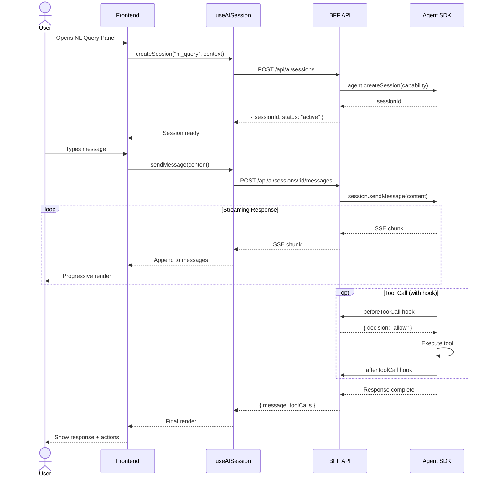

### 8.2 Loading States

| Duration | Component | Behavior |
|----------|-----------|----------|
| < 300ms | None | No loading indicator (avoid flash) |
| 300ms - 3s | Spinner | `LoadingState variant="spinner"` |
| 3s - 10s | Progress | `LoadingState variant="progress"` with message |
| > 10s | Progress + message | Informative message + cancel option |
| Content load | Skeleton | `LoadingState variant="skeleton"` matching content shape |

### 8.3 Empty States

| Page | Icon | Title | Action |
|------|------|-------|--------|
| Projects | `FolderKanban` | No projects yet | Create your first project |
| Tasks | `CheckSquare` | No tasks found | Add a task or adjust filters |
| Notifications | `Bell` | All caught up | No new notifications |
| AI Sessions | `MessageSquare` | No sessions yet | Start a conversation with AI |
| Decision Log | `FileSearch` | No tool calls | This session has no recorded decisions |

### 8.4 Error States

| Error Type | UI Treatment | Recovery |
|------------|-------------|----------|
| Network error | Banner at top, red | Retry button + auto-retry in 30s |
| 401 Unauthorized | Redirect to login | Re-authenticate |
| 403 Forbidden | Inline error message | Contact admin link |
| 404 Not Found | Full-page empty state | Back to previous page |
| 422 Validation | Inline field errors | Fix and resubmit |
| 500 Server Error | Error dialog | Retry or report bug |
| AI Timeout | Inline message | Retry with shorter query |
| AI Rate Limit | Toast notification | Wait indicator with countdown |

### 8.5 Optimistic Updates

| Action | Optimistic Behavior | Rollback |
|--------|---------------------|----------|
| Task status change | Immediately move card/update badge | Revert position + error toast |
| Task assignment | Show new avatar immediately | Revert avatar + error toast |
| Comment post | Show comment immediately | Remove comment + error toast |
| AI Review approve | Remove from queue immediately | Re-add to queue + error toast |
| Notification read | Dim immediately | Re-bold + error toast |

### 8.6 Streaming Response Pattern

```typescript
// Pattern for rendering streaming AI responses
// Used in NLQueryPanel, WBSGenerator, and AIConversation

// 1. Show typing indicator immediately
// 2. Render markdown progressively as chunks arrive
// 3. Parse and render action buttons when complete
// 4. Update tool call trace in decision log
// 5. Handle abort via AbortController on unmount/cancel
```

---

## 9. Mermaid Diagrams

### 9.1 Application Shell Layout

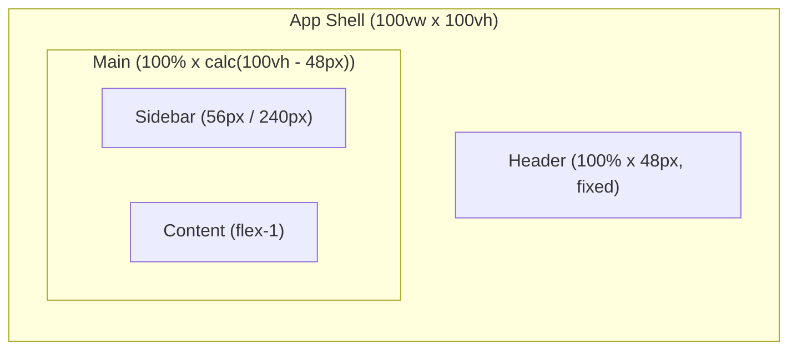

### 9.2 Navigation Flow

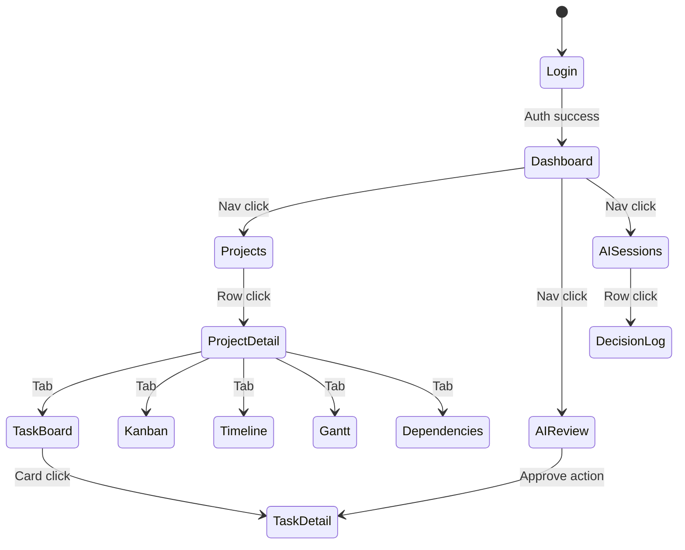

### 9.3 State Management Flow

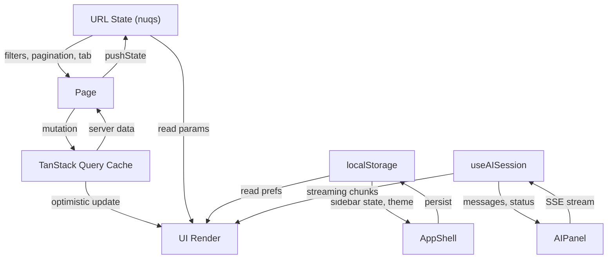

### 9.4 AI Interaction Flow (Multi-Agent Orchestrator)

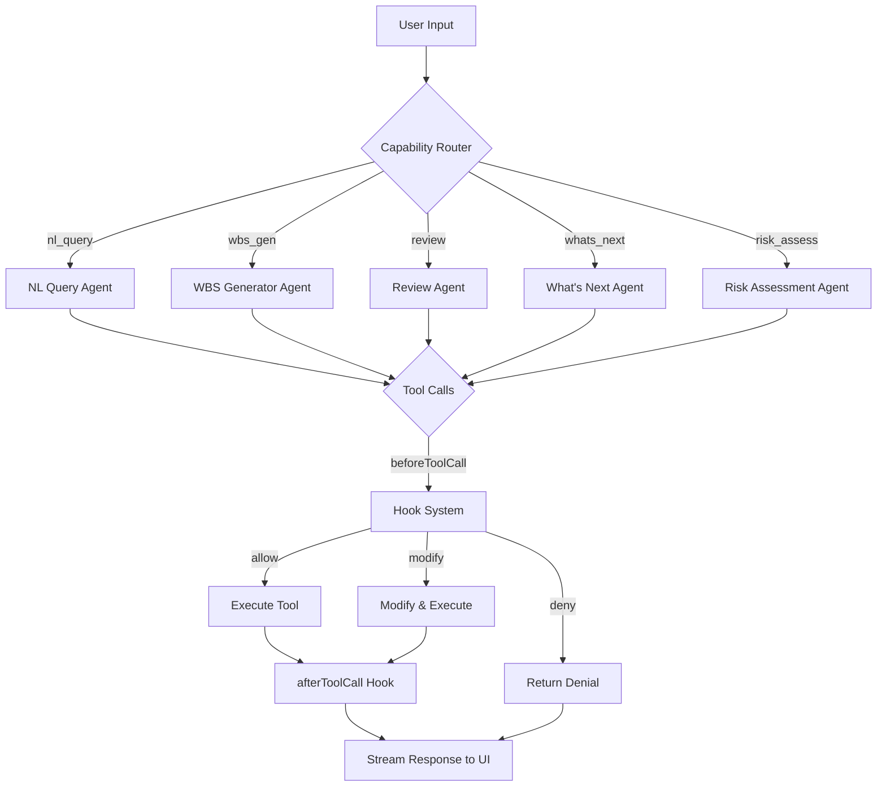

### 9.5 Multi-Turn Conversation Flow

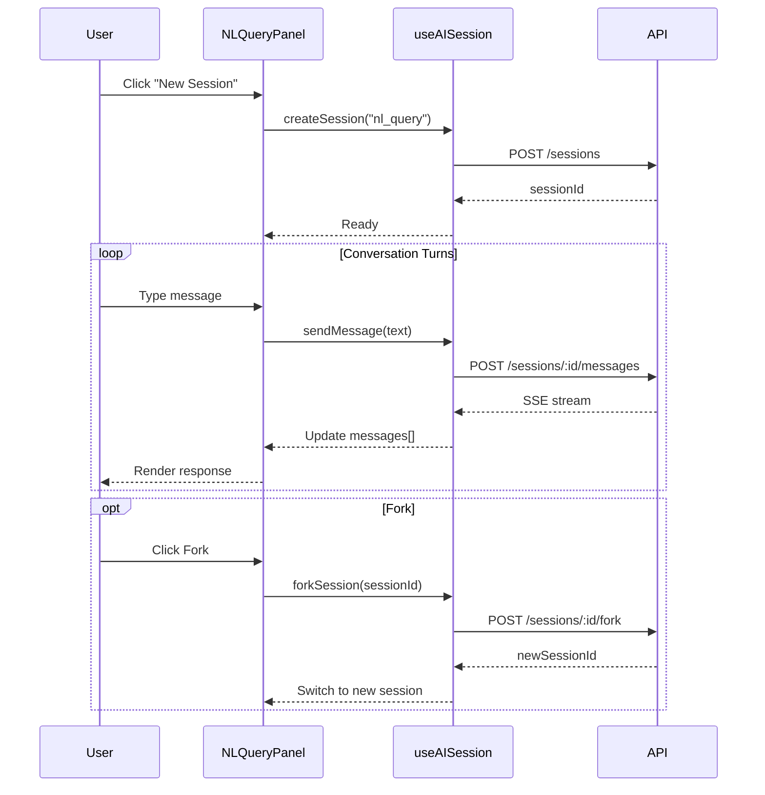

### 9.6 Agent Session Lifecycle UI States

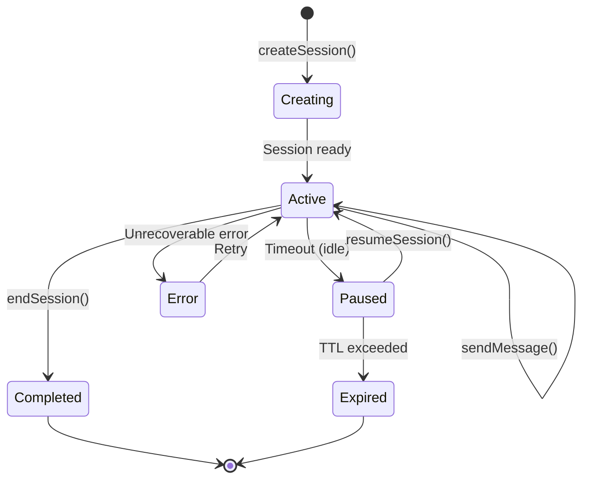

### 9.7 Responsive Breakpoint Diagram

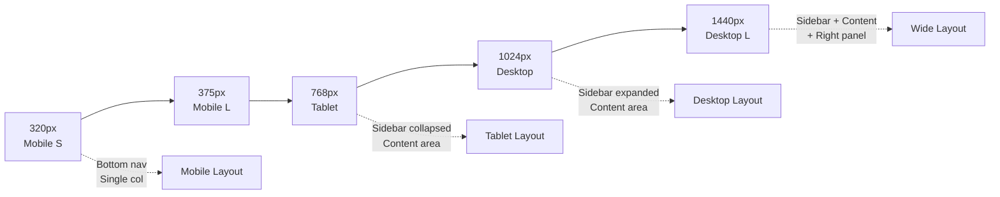

---

## 10. Accessibility

### 10.1 WCAG AA Compliance

| Requirement | Implementation |
|-------------|---------------|
| Color contrast | 4.5:1 normal text, 3:1 large text (18px+ or 14px+ bold) |
| Focus visible | `ring-2 ring-ring ring-offset-2` on all interactive elements |
| Text resize | All text uses relative units (rem), supports 200% zoom |
| Motion | `prefers-reduced-motion` disables all animations |
| Color alone | Never use color as sole indicator — always pair with icon/text |

### 10.2 Keyboard Navigation

| Key | Action |
|-----|--------|
| `Tab` | Move focus forward through interactive elements |
| `Shift+Tab` | Move focus backward |
| `Enter` / `Space` | Activate focused element |
| `Escape` | Close modal/dropdown/panel, return focus to trigger |
| `Arrow Up/Down` | Navigate within lists, menus, tables |
| `Arrow Left/Right` | Navigate tabs, horizontal menus |
| `Cmd+K` | Open command palette |
| `Home/End` | Jump to first/last item in list |

### 10.3 ARIA Patterns

| Component | ARIA Role | Required Attributes |
|-----------|-----------|-------------------|
| Sidebar | `navigation` | `aria-label="Main navigation"` |
| Sidebar item | `link` | `aria-current="page"` when active |
| Kanban column | `list` | `aria-label="Column: {name}"` |
| Task card | `listitem` | `aria-grabbed` when dragging |
| Modal | `dialog` | `aria-modal="true"`, `aria-labelledby` |
| Notification badge | `status` | `aria-label="{count} unread"` |
| AI streaming | `status` | `aria-live="polite"`, `aria-busy` |
| Agent status badge | `status` | `aria-label="Session {status}"` |
| Decision log row | `row` | `aria-expanded` for expandable |

### 10.4 Focus Management

- **Modal open:** Focus trapped inside modal, first focusable element receives focus
- **Modal close:** Focus returns to the element that triggered the modal
- **Slide-out panel:** Focus moves to panel, trapped until dismissed
- **Route change:** Focus moves to page title or main content area
- **Toast notifications:** `aria-live="polite"`, do not steal focus
- **Dropdown menus:** Arrow keys to navigate, Enter to select, Escape to close

### 10.5 Screen Reader Support

- All images: `alt` text (decorative images: `alt=""`)
- All form fields: visible `<label>` elements (not just placeholders)
- Status changes: `aria-live` regions for dynamic content
- Loading states: `aria-busy="true"` with descriptive `aria-label`
- Data tables: `<th>` with `scope` attributes, `<caption>` for context

---

## 11. Performance Budgets

### 11.1 Core Web Vitals

| Metric | Target | Measurement |
|--------|--------|-------------|
| First Contentful Paint (FCP) | < 1.5s | Lighthouse |
| Largest Contentful Paint (LCP) | < 2.5s | Lighthouse |
| Time to Interactive (TTI) | < 3.0s | Lighthouse |
| Cumulative Layout Shift (CLS) | < 0.1 | Lighthouse |
| First Input Delay (FID) | < 100ms | Chrome UX Report |
| Interaction to Next Paint (INP) | < 200ms | Chrome UX Report |
| Performance Score | > 90 | Lighthouse |

### 11.2 Bundle Size Budgets

| Bundle | Max Size (gzip) | Strategy |
|--------|----------------|----------|
| Initial JS | 180KB | Route-level code splitting |
| Initial CSS | 30KB | Tailwind purge, no unused styles |
| Per-route chunk | 50KB | Lazy load via `next/dynamic` |
| Vendor chunk | 100KB | Tree-shake, analyze with `@next/bundle-analyzer` |
| Images | N/A | Next.js `<Image>` with WebP/AVIF, lazy load |

### 11.3 Lazy Loading Strategy

| Component | Trigger | Technique |
|-----------|---------|-----------|
| Route pages | Navigation | Next.js automatic code splitting |
| Kanban board | Tab selection | `next/dynamic` with loading skeleton |
| Charts (Recharts) | Viewport entry | `next/dynamic` + `IntersectionObserver` |
| Dependency graph (D3) | Tab selection | `next/dynamic` with loading skeleton |
| AI panels | User trigger | `next/dynamic` with spinner |
| Command palette | `Cmd+K` | `next/dynamic`, preload on hover |
| Virtual scroll lists | > 50 items | `@tanstack/react-virtual` |

### 11.4 Image Optimization

| Format | Usage |
|--------|-------|
| WebP | Default for all raster images |
| AVIF | Progressive enhancement where supported |
| SVG | Icons, logos, illustrations |
| Blur placeholder | `blurDataURL` for all above-fold images |
| Responsive | `srcSet` with 640/768/1024/1440 widths |

---

## 12. Dark Mode

### 12.1 Implementation Strategy

Dark mode uses CSS custom properties defined in Tailwind v4 `@theme`. The system follows the user's OS preference by default, with manual override stored in `localStorage`.

### 12.2 Token Mapping

| Token | Light Mode | Dark Mode |
|-------|-----------|-----------|
| `--background` | `hsl(0 0% 100%)` | `hsl(224 71% 4%)` |
| `--foreground` | `hsl(224 71% 4%)` | `hsl(210 20% 98%)` |
| `--card` | `hsl(0 0% 100%)` | `hsl(224 71% 4%)` |
| `--card-foreground` | `hsl(224 71% 4%)` | `hsl(210 20% 98%)` |
| `--muted` | `hsl(210 40% 96%)` | `hsl(215 28% 17%)` |
| `--muted-foreground` | `hsl(215 16% 47%)` | `hsl(218 11% 65%)` |
| `--accent` | `hsl(210 40% 96%)` | `hsl(215 28% 17%)` |
| `--accent-foreground` | `hsl(222 47% 31%)` | `hsl(210 20% 98%)` |
| `--border` | `hsl(214 32% 91%)` | `hsl(215 28% 17%)` |
| `--input` | `hsl(214 32% 91%)` | `hsl(215 28% 17%)` |

### 12.3 Detection & Toggle

```typescript
// Theme detection priority:
// 1. localStorage("theme") — user manual choice
// 2. prefers-color-scheme — OS preference
// 3. "light" — default fallback

// Toggle: Settings > Profile > Theme dropdown
// Options: Light, Dark, System (auto-detect)
// Applied via class="dark" on <html> element
```

### 12.4 Testing Requirements

- Every component must be visually verified in both modes
- Contrast ratios must pass WCAG AA in both modes
- Screenshots in both modes for design review
- No hardcoded colors — all via semantic tokens

---

## 13. Cross-Reference Index

### 13.1 Wireframe to Functional Requirement Mapping

| Wireframe | ID | Functional Requirements |
|-----------|----|------------------------|
| Login/Registration | W-01 | FR-100, FR-101 |
| Dashboard Overview | W-02 | FR-201, FR-202 |
| Project List | W-03 | FR-501 |
| Project Detail / Task Board | W-04 | FR-501, FR-502 |
| Task Detail Panel | W-05 | FR-500, FR-503 |
| WBS Generator Panel | W-06 | FR-400 |
| What's Next Panel | W-07 | FR-201 |
| AI Review Panel | W-08 | FR-301, FR-302 |
| NL Query Panel | W-09 | FR-600 |
| NL Query Multi-Turn | W-09a | FR-600 |
| Settings / Tenant Config | W-10 | FR-109, FR-300 |
| Team Management | W-11 | FR-110 |
| Kanban Board View | W-12 | FR-1900 |
| Calendar View | W-13 | FR-2002 |
| Table View | W-14 | FR-2003 |
| AI-Annotated Timeline | W-15 | FR-1201 |
| Portfolio Dashboard | W-16 | FR-1202 |
| Notification Inbox | W-17 | FR-2007 |
| Dependency Graph | W-18 | FR-1200 |
| Client Portal | W-19 | FR-1301, FR-1305 |
| Goals & OKR Dashboard | W-20 | FR-2006 |
| Gantt Chart View | W-21 | FR-1202 |
| Agent Session Dashboard | W-22 | FR-608 |
| Agent Decision Log | W-23 | FR-608 |
| Agent Config Panel | W-24 | FR-300 |

### 13.2 Wireframe to Feature ID Mapping

| Wireframe | ID | Feature IDs | Release |
|-----------|----|------------|---------|
| Login/Registration | W-01 | F-001, F-002 | R0 |
| Dashboard Overview | W-02 | F-011, F-012 | R0 |
| Project List | W-03 | F-020, F-021 | R0 |
| Project Detail / Task Board | W-04 | F-022, F-023 | R0 |
| Task Detail Panel | W-05 | F-024 | R0 |
| WBS Generator Panel | W-06 | F-030 | R0 |
| What's Next Panel | W-07 | F-012 | R0 |
| AI Review Panel | W-08 | F-031 | R0 |
| NL Query Panel | W-09 | F-040 | R0 |
| NL Query Multi-Turn | W-09a | F-040 | R1 |
| Settings / Tenant Config | W-10 | F-050 | R0 |
| Team Management | W-11 | F-051 | R0 |
| Kanban Board View | W-12 | F-089 | R1 |
| Calendar View | W-13 | F-091 | R1 |
| Table View | W-14 | F-092 | R1 |
| AI-Annotated Timeline | W-15 | F-060 | R1 |
| Portfolio Dashboard | W-16 | F-061 | R1 |
| Notification Inbox | W-17 | F-093 | R1 |
| Dependency Graph | W-18 | F-059 | R1 |
| Client Portal | W-19 | F-070 | R2 |
| Goals & OKR Dashboard | W-20 | F-094 | R2 |
| Gantt Chart View | W-21 | F-095 | R2 |
| Agent Session Dashboard | W-22 | F-040 | R1 |
| Agent Decision Log | W-23 | F-040 | R1 |
| Agent Config Panel | W-24 | F-050 | R1 |

### 13.3 NFR Coverage

| NFR | Related Sections |
|-----|-----------------|
| NFR-100 (API latency p95 < 500ms) | Section 8 (optimistic updates), Section 11 (performance) |
| NFR-101 (UI response < 100ms) | Section 11 (FID < 100ms, INP < 200ms) |
| NFR-102 (Accessibility WCAG AA) | Section 10 (full accessibility spec) |
| NFR-103 (Mobile responsive) | Section 4.5 (breakpoints), Section 5 (wireframes) |
| NFR-104 (Dark mode) | Section 12 (dark mode spec) |
| NFR-105 (Bundle size) | Section 11.2 (bundle budgets) |

---

*End of document. Version 2.0 — February 2026.*
*Next revision: Update after R0 sprint implementation begins with component library screenshots.*
