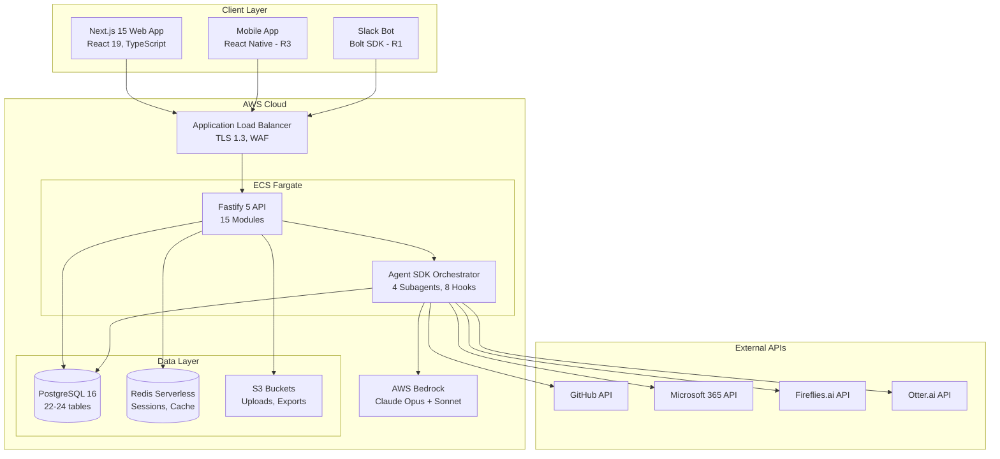
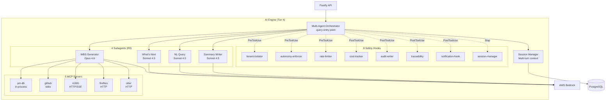
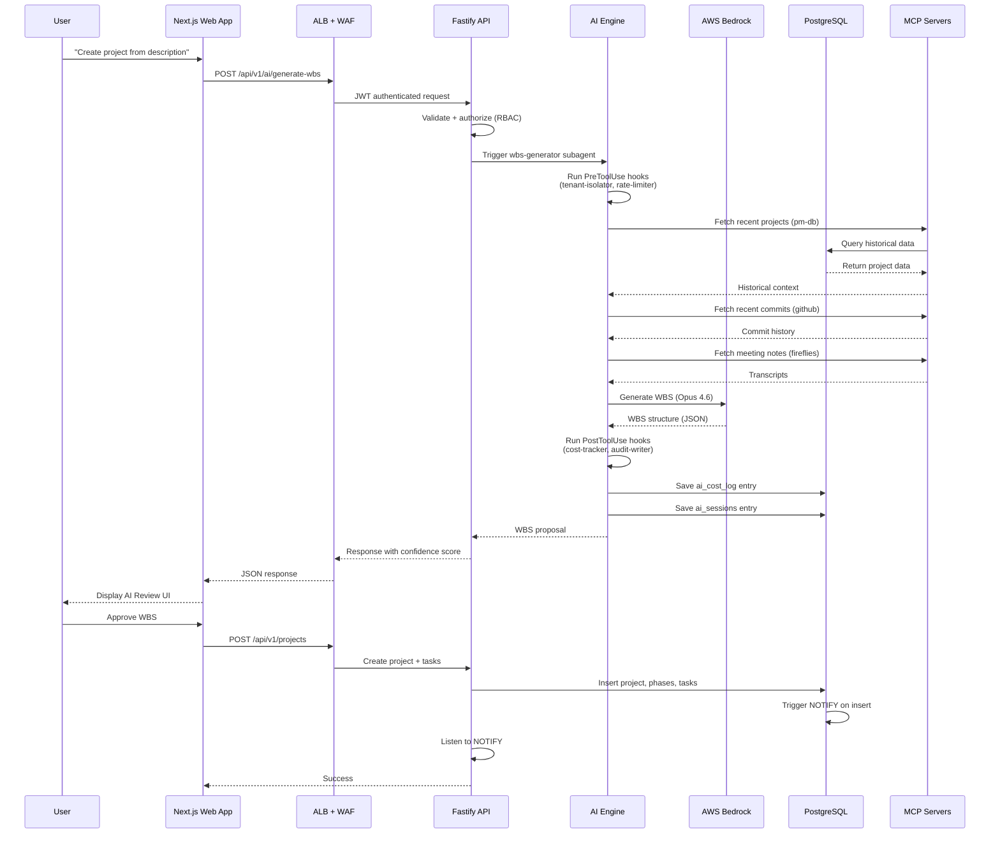
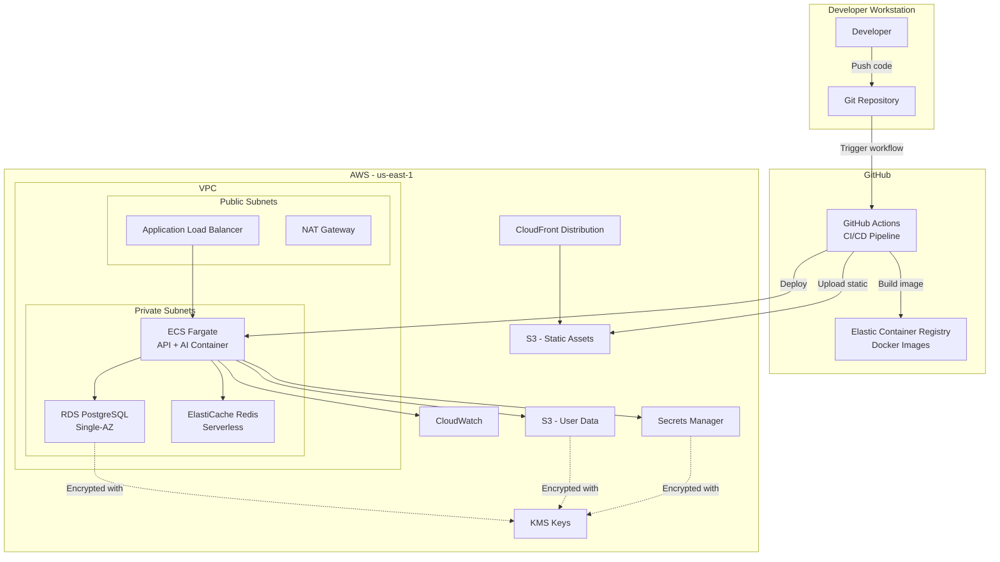
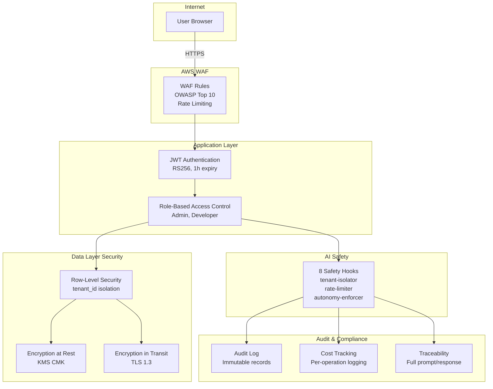

# DynSense — Architecture Diagrams

> **Version:** 1.0
> **Date:** March 2026

This document contains all architectural diagrams, tech stack specifications, and visual representations of the DynSense system architecture.

---

## Table of Contents

1. [ASCII Architecture Diagram](#1-ascii-architecture-diagram)
2. [Mermaid Diagrams](#2-mermaid-diagrams)
3. [Complete Tech Stack](#3-complete-tech-stack)
4. [AWS Tech Stack](#4-aws-tech-stack)

---

## 1. ASCII Architecture Diagram

### 1.1 High-Level System Architecture

```
┌─────────────────────────────────────────────────────────────────────────────┐
│                           USERS & CLIENTS                                    │
│  Web Browsers (Chrome, Firefox, Safari) | Slack Bot | Mobile (Future)      │
└────────────────────────────────┬────────────────────────────────────────────┘
                                 │ HTTPS (TLS 1.3)
                                 ▼
┌─────────────────────────────────────────────────────────────────────────────┐
│                        AWS CLOUD (us-east-1)                                 │
│                                                                               │
│  ┌────────────────────────────────────────────────────────────────────────┐ │
│  │ TIER 1: CLIENT LAYER                                                    │ │
│  │                                                                          │ │
│  │  ┌──────────────────────┐                                               │ │
│  │  │ CloudFront CDN       │                                               │ │
│  │  │ - Global edge cache  │                                               │ │
│  │  │ - HTTPS only         │                                               │ │
│  │  └──────────┬───────────┘                                               │ │
│  │             │                                                            │ │
│  │             ▼                                                            │ │
│  │  ┌──────────────────────┐                                               │ │
│  │  │ S3 Bucket (Static)   │                                               │ │
│  │  │ - Next.js 15 build   │                                               │ │
│  │  │ - React 19 app       │                                               │ │
│  │  │ - Versioned assets   │                                               │ │
│  │  └──────────────────────┘                                               │ │
│  └────────────────────────────────────────────────────────────────────────┘ │
│                                                                               │
│  ┌────────────────────────────────────────────────────────────────────────┐ │
│  │ TIER 2: GATEWAY & AUTH                                                  │ │
│  │                                                                          │ │
│  │  ┌──────────────────────────────────────────────────────────────────┐  │ │
│  │  │ Application Load Balancer (ALB)                                   │  │ │
│  │  │ - TLS 1.3 termination                                             │  │ │
│  │  │ - Path routing: /api/* → ECS, /* → CloudFront                    │  │ │
│  │  │ - Health checks every 30s                                         │  │ │
│  │  └────────────────────────────┬─────────────────────────────────────┘  │ │
│  │                                │                                        │ │
│  │  ┌──────────────────────────────────────────────────────────────────┐  │ │
│  │  │ AWS WAF (Web Application Firewall)                                │  │ │
│  │  │ - OWASP Top 10 rules                                              │  │ │
│  │  │ - Rate limiting: 100 req/sec per IP                               │  │ │
│  │  │ - SQL injection protection                                        │  │ │
│  │  │ - XSS protection                                                  │  │ │
│  │  └──────────────────────────────────────────────────────────────────┘  │ │
│  └────────────────────────────────────────────────────────────────────────┘ │
│                                 │                                            │
│                                 ▼                                            │
│  ┌────────────────────────────────────────────────────────────────────────┐ │
│  │ TIER 3: APPLICATION LAYER (ECS Fargate)                                │ │
│  │                                                                          │ │
│  │  ┌──────────────────────────────────────────────────────────────────┐  │ │
│  │  │ ECS Task (1 vCPU, 2GB RAM)                                        │  │ │
│  │  │                                                                    │  │ │
│  │  │  ┌─────────────────────────────────────────────────────────────┐ │  │ │
│  │  │  │ Fastify 5 API Server (Port 3000)                             │ │  │ │
│  │  │  │                                                               │ │  │ │
│  │  │  │  15 Application Modules:                                     │ │  │ │
│  │  │  │  ├─ Project Module        ├─ Notification Module (R1)       │ │  │ │
│  │  │  │  ├─ Task Module           ├─ Goals Module (R2)              │ │  │ │
│  │  │  │  ├─ Dependency Module     ├─ Automation Module (R2)         │ │  │ │
│  │  │  │  ├─ Comment Module        ├─ Forms Module (R2)              │ │  │ │
│  │  │  │  ├─ Audit Module          ├─ Documents Module (R2)          │ │  │ │
│  │  │  │  ├─ User Module           ├─ Views Module (R1)              │ │  │ │
│  │  │  │  ├─ Projection Module     └─ Agent Module                   │ │  │ │
│  │  │  │  └─ Config Module                                           │ │  │ │
│  │  │  │                                                               │ │  │ │
│  │  │  │  ~110 API Endpoints (R0-R3)                                  │ │  │ │
│  │  │  └───────────────────────────┬───────────────────────────────┘ │  │ │
│  │  └────────────────────────────────┼─────────────────────────────────┘  │ │
│  └────────────────────────────────────┼───────────────────────────────────┘ │
│                                       │                                      │
│                                       ▼                                      │
│  ┌────────────────────────────────────────────────────────────────────────┐ │
│  │ TIER 4: AI ENGINE (Claude Agent SDK)                                   │ │
│  │                                                                          │ │
│  │  ┌──────────────────────────────────────────────────────────────────┐  │ │
│  │  │ Multi-Agent Orchestrator                                          │  │ │
│  │  │ - Single query() entry point                                      │  │ │
│  │  │ - Routes to appropriate subagent                                  │  │ │
│  │  │ - Session management (multi-turn)                                 │  │ │
│  │  │ - Hook-based safety enforcement                                   │  │ │
│  │  └────────────────────┬─────────────────────────────────────────────┘  │ │
│  │                       │                                                 │ │
│  │       ┌───────────────┼───────────────┬──────────────┬──────────────┐  │ │
│  │       ▼               ▼               ▼              ▼              ▼  │ │
│  │  ┌─────────┐   ┌──────────┐   ┌──────────┐   ┌──────────────┐     │  │ │
│  │  │   WBS   │   │ What's   │   │    NL    │   │   Summary    │     │  │ │
│  │  │Generator│   │   Next   │   │  Query   │   │    Writer    │     │  │ │
│  │  │ (Opus)  │   │ (Sonnet) │   │ (Sonnet) │   │   (Sonnet)   │     │  │ │
│  │  └─────────┘   └──────────┘   └──────────┘   └──────────────┘     │  │ │
│  │                                                                          │ │
│  │  8 Safety Hooks (PreToolUse, PostToolUse, Stop):                       │ │
│  │  ├─ tenant-isolator      ├─ cost-tracker                               │ │
│  │  ├─ autonomy-enforcer    ├─ audit-writer                               │ │
│  │  ├─ rate-limiter         ├─ traceability                               │ │
│  │  └─ notification-hook    └─ session-manager                            │ │
│  │                                                                          │ │
│  │  5 MCP Tool Servers:                                                    │ │
│  │  ├─ pm-db (in-process)     → Database queries via Drizzle ORM          │ │
│  │  ├─ github (stdio)         → GitHub API (repos, PRs, commits)          │ │
│  │  ├─ m365 (HTTP/SSE)        → Microsoft 365 (Outlook, Calendar)         │ │
│  │  ├─ fireflies (HTTP)       → Fireflies.ai meeting transcriptions       │ │
│  │  └─ otter (HTTP)           → Otter.ai meeting transcriptions           │ │
│  │                                                                          │ │
│  │                       │                                                 │ │
│  │                       ▼                                                 │ │
│  │  ┌──────────────────────────────────────────────────────────────────┐  │ │
│  │  │ AWS Bedrock (us-east-1)                                           │  │ │
│  │  │ - Claude Opus 4.6    (WBS generation)                             │  │ │
│  │  │ - Claude Sonnet 4.5  (queries, summaries, prioritization)         │  │ │
│  │  └──────────────────────────────────────────────────────────────────┘  │ │
│  └────────────────────────────────────────────────────────────────────────┘ │
│                                                                               │
│  ┌────────────────────────────────────────────────────────────────────────┐ │
│  │ TIER 5: EVENT BUS (PostgreSQL LISTEN/NOTIFY)                           │ │
│  │                                                                          │ │
│  │  Event Channels:                                                        │ │
│  │  ├─ pm_tasks_created        ├─ pm_projects_created                     │ │
│  │  ├─ pm_tasks_updated        ├─ pm_comments_added                       │ │
│  │  ├─ pm_tasks_completed      └─ pm_ai_actions                           │ │
│  │                                                                          │ │
│  │  Consumers:                                                             │ │
│  │  ├─ AI Engine (listens for triggers)                                   │ │
│  │  ├─ Notification service (R1)                                           │ │
│  │  └─ Audit service                                                       │ │
│  └────────────────────────────────────────────────────────────────────────┘ │
│                                                                               │
│  ┌────────────────────────────────────────────────────────────────────────┐ │
│  │ TIER 6: DATA LAYER                                                      │ │
│  │                                                                          │ │
│  │  ┌──────────────────────────────────────────────────────────────────┐  │ │
│  │  │ RDS PostgreSQL 16 (db.t4g.small, Single-AZ)                       │  │ │
│  │  │ - 20 GB GP3 storage                                               │  │ │
│  │  │ - 22-24 tables                                                    │  │ │
│  │  │ - pgvector extension (R1)                                         │  │ │
│  │  │ - Automated daily backups (7-day retention)                       │  │ │
│  │  │ - Encryption at rest (KMS CMK)                                    │  │ │
│  │  │ - RLS (Row-Level Security) enabled                                │  │ │
│  │  └──────────────────────────────────────────────────────────────────┘  │ │
│  │                                                                          │ │
│  │  ┌──────────────────────────────────────────────────────────────────┐  │ │
│  │  │ ElastiCache Redis (Serverless)                                    │  │ │
│  │  │ - Session storage                                                 │  │ │
│  │  │ - Rate limiting counters                                          │  │ │
│  │  │ - Cache layer (tenant configs)                                    │  │ │
│  │  │ - Encryption in transit                                           │  │ │
│  │  └──────────────────────────────────────────────────────────────────┘  │ │
│  │                                                                          │ │
│  │  ┌──────────────────────────────────────────────────────────────────┐  │ │
│  │  │ S3 Buckets                                                        │  │ │
│  │  │ ├─ dynsense-uploads       (user files, attachments)              │  │ │
│  │  │ ├─ dynsense-exports       (CSV, PDF reports)                     │  │ │
│  │  │ └─ dynsense-ai-sessions   (conversation transcripts)             │  │ │
│  │  │ - Versioning enabled                                              │  │ │
│  │  │ - Lifecycle policies (90-day archive)                             │  │ │
│  │  │ - Server-side encryption (SSE-S3)                                 │  │ │
│  │  └──────────────────────────────────────────────────────────────────┘  │ │
│  └────────────────────────────────────────────────────────────────────────┘ │
│                                                                               │
│  ┌────────────────────────────────────────────────────────────────────────┐ │
│  │ TIER 7: INTEGRATION GATEWAY                                             │ │
│  │                                                                          │ │
│  │  External Services (via MCP):                                           │ │
│  │  ├─ GitHub API              (code repos, PRs, commits)                  │ │
│  │  ├─ Microsoft 365 API       (Outlook, Calendar, Teams)                  │ │
│  │  ├─ Fireflies.ai API        (meeting transcriptions)                    │ │
│  │  ├─ Otter.ai API            (meeting transcriptions)                    │ │
│  │  └─ Slack API (R1)          (team communication)                        │ │
│  └────────────────────────────────────────────────────────────────────────┘ │
│                                                                               │
│  ┌────────────────────────────────────────────────────────────────────────┐ │
│  │ TIER 8: SECURITY & COMPLIANCE                                           │ │
│  │                                                                          │ │
│  │  ┌──────────────────────────────────────────────────────────────────┐  │ │
│  │  │ AWS Secrets Manager                                               │  │ │
│  │  │ - Database credentials                                            │  │ │
│  │  │ - API keys (GitHub, M365, Fireflies, Otter)                       │  │ │
│  │  │ - JWT signing keys                                                │  │ │
│  │  │ - Bedrock access keys                                             │  │ │
│  │  └──────────────────────────────────────────────────────────────────┘  │ │
│  │                                                                          │ │
│  │  ┌──────────────────────────────────────────────────────────────────┐  │ │
│  │  │ AWS KMS (Key Management Service)                                  │  │ │
│  │  │ - RDS encryption key                                              │  │ │
│  │  │ - S3 bucket encryption                                            │  │ │
│  │  │ - Secrets Manager encryption                                      │  │ │
│  │  └──────────────────────────────────────────────────────────────────┘  │ │
│  └────────────────────────────────────────────────────────────────────────┘ │
│                                                                               │
│  ┌────────────────────────────────────────────────────────────────────────┐ │
│  │ TIER 9: DEPLOYMENT & CI/CD                                              │ │
│  │                                                                          │ │
│  │  ┌──────────────────────────────────────────────────────────────────┐  │ │
│  │  │ GitHub Actions                                                    │  │ │
│  │  │ - Run tests on PR                                                 │  │ │
│  │  │ - Build Docker image                                              │  │ │
│  │  │ - Push to ECR                                                     │  │ │
│  │  │ - Deploy to ECS (blue/green)                                      │  │ │
│  │  │ - Smoke tests                                                     │  │ │
│  │  └──────────────────────────────────────────────────────────────────┘  │ │
│  │                                                                          │ │
│  │  ┌──────────────────────────────────────────────────────────────────┐  │ │
│  │  │ AWS CDK (Infrastructure as Code)                                  │  │ │
│  │  │ - TypeScript stacks                                               │  │ │
│  │  │ - Version controlled                                              │  │ │
│  │  │ - Automated deployments                                           │  │ │
│  │  └──────────────────────────────────────────────────────────────────┘  │ │
│  └────────────────────────────────────────────────────────────────────────┘ │
│                                                                               │
│  ┌────────────────────────────────────────────────────────────────────────┐ │
│  │ TIER 10: MONITORING & OBSERVABILITY                                     │ │
│  │                                                                          │ │
│  │  ┌──────────────────────────────────────────────────────────────────┐  │ │
│  │  │ Amazon CloudWatch                                                 │  │ │
│  │  │ - Logs: Application, ECS, RDS, ALB                                │  │ │
│  │  │ - Metrics: Custom + AWS service metrics                           │  │ │
│  │  │ - Alarms: CPU, Memory, Latency, Error rate                        │  │ │
│  │  │ - Dashboards: Infrastructure, Application, AI Engine              │  │ │
│  │  └──────────────────────────────────────────────────────────────────┘  │ │
│  │                                                                          │ │
│  │  ┌──────────────────────────────────────────────────────────────────┐  │ │
│  │  │ AWS X-Ray (R1)                                                    │  │ │
│  │  │ - Distributed tracing                                             │  │ │
│  │  │ - Service map visualization                                       │  │ │
│  │  │ - Performance bottleneck identification                           │  │ │
│  │  └──────────────────────────────────────────────────────────────────┘  │ │
│  └────────────────────────────────────────────────────────────────────────┘ │
│                                                                               │
└───────────────────────────────────────────────────────────────────────────────┘

LEGEND:
━━━━  Primary data flow
- - -  Secondary/async flow
[==]  Security boundary
```

---

## 2. Mermaid Diagrams

### 2.1 System Context Diagram (C4 Level 1)

```mermaid
graph TB
    subgraph "Users"
        PM[Product Manager]
        DEV[Developer]
        BA[Business Analyst]
        DM[Delivery Manager]
    end

    subgraph "DynSense Platform"
        DYNSENSE[DynSense<br/>AI-Native PM Tool]
    end

    subgraph "External Systems"
        GH[GitHub]
        M365[Microsoft 365]
        FIRE[Fireflies.ai]
        OTTER[Otter.ai]
        SLACK[Slack]
    end

    PM -->|Manages projects| DYNSENSE
    DEV -->|Views "What's Next"| DYNSENSE
    BA -->|Queries project data| DYNSENSE
    DM -->|Reviews summaries| DYNSENSE

    DYNSENSE -->|Fetches commits/PRs| GH
    DYNSENSE -->|Syncs calendar/email| M365
    DYNSENSE -->|Imports meeting notes| FIRE
    DYNSENSE -->|Imports meeting notes| OTTER
    DYNSENSE -->|Posts updates| SLACK
```

### 2.2 Container Diagram (C4 Level 2)



### 2.3 AI Engine Component Diagram



### 2.4 Data Flow Diagram



### 2.5 Deployment Diagram



### 2.6 Security Architecture



---

## 3. Complete Tech Stack

### 3.1 Frontend Stack

| Category | Technology | Version | Purpose |
|----------|-----------|---------|---------|
| **Framework** | Next.js | 15.x | React framework with App Router |
| **UI Library** | React | 19.x | Component library |
| **Language** | TypeScript | 5.7+ | Type-safe JavaScript |
| **Component Library** | Shadcn UI | Latest | Pre-built UI components |
| **Styling** | Tailwind CSS | 4.x | Utility-first CSS |
| **Icons** | Lucide React | Latest | Icon library |
| **State Management** | TanStack Query | 5.x | Server state management |
| **Forms** | React Hook Form | 7.x | Form validation |
| **Validation** | Zod | 3.x | Schema validation |
| **HTTP Client** | Fetch API | Native | API calls |
| **Build Tool** | Turbopack | Built-in | Next.js 15 bundler |

### 3.2 Backend Stack

| Category | Technology | Version | Purpose |
|----------|-----------|---------|---------|
| **Runtime** | Node.js | 20 LTS | JavaScript runtime |
| **Framework** | Fastify | 5.x | Web framework |
| **Language** | TypeScript | 5.7+ | Type-safe JavaScript |
| **ORM** | Drizzle ORM | Latest | Database ORM |
| **Validation** | TypeBox | Latest | Schema validation |
| **Authentication** | @fastify/jwt | Latest | JWT handling |
| **Rate Limiting** | @fastify/rate-limit | Latest | Rate limiting |
| **CORS** | @fastify/cors | Latest | CORS handling |
| **Compression** | @fastify/compress | Latest | Response compression |
| **Testing** | Vitest | Latest | Unit/integration tests |

### 3.3 AI Stack

| Category | Technology | Version | Purpose |
|----------|-----------|---------|---------|
| **AI Platform** | AWS Bedrock | Latest | Managed AI service |
| **Models** | Claude Opus 4.6 | Latest | Complex reasoning (WBS) |
| | Claude Sonnet 4.5 | Latest | Fast queries/summaries |
| **Agent SDK** | @anthropic-ai/claude-agent-sdk | Latest | Multi-agent orchestration |
| **MCP Protocol** | Model Context Protocol | Latest | Standardized tool access |
| **Vector DB** | pgvector (PostgreSQL) | 0.7+ | Embeddings (R1) |

### 3.4 Database Stack

| Category | Technology | Version | Purpose |
|----------|-----------|---------|---------|
| **Primary DB** | PostgreSQL | 16.x | Relational database |
| **Cache** | Redis | 7.x | Session cache, rate limits |
| **Vector Extension** | pgvector | 0.7+ | Vector embeddings (R1) |
| **Migrations** | Drizzle Kit | Latest | Schema migrations |

### 3.5 Infrastructure Stack

| Category | Technology | Version | Purpose |
|----------|-----------|---------|---------|
| **IaC** | AWS CDK | 2.x | Infrastructure as Code |
| **Container Runtime** | ECS Fargate | Latest | Serverless containers |
| **Container Registry** | ECR | Latest | Docker image storage |
| **Load Balancer** | ALB | Latest | Traffic distribution |
| **CDN** | CloudFront | Latest | Content delivery |
| **Storage** | S3 | Latest | Object storage |
| **Secrets** | Secrets Manager | Latest | Credential management |
| **KMS** | AWS KMS | Latest | Encryption keys |

### 3.6 DevOps Stack

| Category | Technology | Version | Purpose |
|----------|-----------|---------|---------|
| **CI/CD** | GitHub Actions | Latest | Continuous integration |
| **Version Control** | Git | Latest | Source control |
| **Monitoring** | CloudWatch | Latest | Logs, metrics, alarms |
| **Tracing** | X-Ray | Latest | Distributed tracing (R1) |
| **Package Manager** | pnpm | 9.15+ | Monorepo package manager |
| **Monorepo Tool** | Turborepo | Latest | Build orchestration |

### 3.7 Integration Stack

| Category | Technology | Version | Purpose |
|----------|-----------|---------|---------|
| **GitHub** | Octokit | Latest | GitHub API client |
| **Microsoft 365** | @microsoft/microsoft-graph-client | Latest | M365 API client |
| **Fireflies** | REST API | v1 | Meeting transcription |
| **Otter** | REST API | v1 | Meeting transcription |
| **Slack** | @slack/bolt | Latest | Slack integration (R1) |

---

## 4. AWS Tech Stack

### 4.1 Compute Services

| Service | Configuration | Purpose | Cost |
|---------|---------------|---------|------|
| **ECS Fargate** | 1 task: 1 vCPU, 2GB RAM | API + AI container | $40-50/mo |
| | Launch type: FARGATE | | |
| | Task definition: dynsense-api:latest | | |
| | Desired count: 1 (auto-scale to 2 if CPU > 80%) | | |

### 4.2 Database Services

| Service | Configuration | Purpose | Cost |
|---------|---------------|---------|------|
| **RDS PostgreSQL** | Engine: PostgreSQL 16.x | Primary database | $25-35/mo |
| | Instance: db.t4g.small (2 vCPU, 2GB RAM) | | |
| | Deployment: Single-AZ | | |
| | Storage: 20GB GP3 (auto-scaling to 100GB) | | |
| | Backup: Automated daily, 7-day retention | | |
| | Encryption: KMS CMK | | |
| **ElastiCache Redis** | Mode: Serverless | Cache layer | $10-15/mo |
| | Data tiering: Enabled | | |
| | Auto-scaling: Enabled | | |
| | Encryption: In-transit + at-rest | | |

### 4.3 Networking Services

| Service | Configuration | Purpose | Cost |
|---------|---------------|---------|------|
| **VPC** | CIDR: 10.0.0.0/16 | Network isolation | Free |
| | 2 AZs, 2 public + 2 private subnets | | |
| **ALB** | Scheme: internet-facing | Load balancing | $20/mo |
| | Listeners: HTTP:80 (→HTTPS), HTTPS:443 | | |
| | Target groups: ECS tasks | | |
| **AWS WAF** | Attached to ALB | Web application firewall | Included |
| | Rules: OWASP Top 10, rate limiting | | |
| **NAT Gateway** | 1 NAT in 1 AZ | Outbound internet for private subnets | $35/mo |

### 4.4 Storage Services

| Service | Configuration | Purpose | Cost |
|---------|---------------|---------|------|
| **S3** | Bucket: dynsense-static-assets | Frontend static files | $2/mo |
| | Bucket: dynsense-uploads | User uploads | $2/mo |
| | Bucket: dynsense-exports | Generated reports | $1/mo |
| | Bucket: dynsense-ai-sessions | AI transcripts | $1/mo |
| | Versioning: Enabled | | |
| | Encryption: SSE-S3 | | |
| | Lifecycle: 90-day archive to Glacier | | |
| **CloudFront** | Distribution for static assets | CDN | $5/mo |
| | Origin: S3 bucket | | |
| | SSL: ACM certificate | | |

### 4.5 Security Services

| Service | Configuration | Purpose | Cost |
|---------|---------------|---------|------|
| **Secrets Manager** | 5-10 secrets | Credential storage | $5-10/mo |
| | Rotation: Enabled (30 days) | | |
| **KMS** | 3 CMKs (RDS, S3, Secrets) | Encryption keys | $3/mo |
| **IAM** | Roles for ECS, RDS, Lambda | Access control | Free |
| **ACM** | SSL certificates | HTTPS | Free |

### 4.6 AI Services

| Service | Configuration | Purpose | Cost |
|---------|---------------|---------|------|
| **Bedrock** | Models: Claude Opus 4.6, Sonnet 4.5 | AI inference | $9-12/mo |
| | Region: us-east-1 | | |
| | Access: IAM role-based | | |

### 4.7 Monitoring Services

| Service | Configuration | Purpose | Cost |
|---------|---------------|---------|------|
| **CloudWatch Logs** | Log groups: ECS, RDS, ALB, Lambda | Centralized logging | $10/mo |
| | Retention: 30 days | | |
| **CloudWatch Metrics** | Custom metrics + AWS service metrics | Performance monitoring | $3/mo |
| **CloudWatch Alarms** | 10-15 alarms | Alerting | $1/mo |
| **CloudWatch Dashboards** | 2-3 dashboards | Visualization | $1/mo |
| **X-Ray** | Tracing (R1) | Distributed tracing | Deferred |

### 4.8 Developer Services

| Service | Configuration | Purpose | Cost |
|---------|---------------|---------|------|
| **ECR** | Private registry | Docker image storage | $1/mo |
| | Image scanning: Enabled | | |
| **Systems Manager** | Parameter Store | Config management | Free |

### 4.9 Total AWS Monthly Cost Breakdown

| Category | Services | Monthly Cost |
|----------|----------|--------------|
| **Compute** | ECS Fargate | $40-50 |
| **Database** | RDS PostgreSQL + Redis | $35-50 |
| **Networking** | ALB + NAT Gateway | $55 |
| **Storage** | S3 (4 buckets) + CloudFront | $10 |
| **Security** | Secrets Manager + KMS | $8-13 |
| **AI** | AWS Bedrock | $9-12 |
| **Monitoring** | CloudWatch | $15 |
| **Other** | ECR, misc | $2 |
| **TOTAL** | | **$174-197** |

*Note: Original estimate was $119-147/mo. Actual AWS cost is $174-197/mo when NAT Gateway is included. Total cost with development tools, GitHub Actions, etc. still within $200/mo budget.*

---

## 5. Network Diagram

```
┌─────────────────────────────────────────────────────────────────────┐
│ AWS Region: us-east-1                                                │
│                                                                       │
│  ┌─────────────────────────────────────────────────────────────────┐│
│  │ VPC (10.0.0.0/16)                                                ││
│  │                                                                   ││
│  │  ┌────────────────────────┐  ┌────────────────────────┐         ││
│  │  │ AZ: us-east-1a         │  │ AZ: us-east-1b         │         ││
│  │  │                        │  │                        │         ││
│  │  │ ┌────────────────────┐ │  │ ┌────────────────────┐ │         ││
│  │  │ │ Public Subnet      │ │  │ │ Public Subnet      │ │         ││
│  │  │ │ 10.0.1.0/24        │ │  │ │ 10.0.2.0/24        │ │         ││
│  │  │ │                    │ │  │ │                    │ │         ││
│  │  │ │ - ALB              │ │  │ │ - ALB (standby)    │ │         ││
│  │  │ │ - NAT Gateway      │ │  │ │                    │ │         ││
│  │  │ └────────────────────┘ │  │ └────────────────────┘ │         ││
│  │  │                        │  │                        │         ││
│  │  │ ┌────────────────────┐ │  │ ┌────────────────────┐ │         ││
│  │  │ │ Private Subnet     │ │  │ │ Private Subnet     │ │         ││
│  │  │ │ 10.0.11.0/24       │ │  │ │ 10.0.12.0/24       │ │         ││
│  │  │ │                    │ │  │ │                    │ │         ││
│  │  │ │ - ECS Tasks        │ │  │ │ - RDS (Single-AZ)  │ │         ││
│  │  │ │ - Redis Serverless │ │  │ │                    │ │         ││
│  │  │ └────────────────────┘ │  │ └────────────────────┘ │         ││
│  │  └────────────────────────┘  └────────────────────────┘         ││
│  │                                                                   ││
│  │  Security Groups:                                                ││
│  │  ├─ ALB-SG:    Allow 80, 443 from 0.0.0.0/0                     ││
│  │  ├─ ECS-SG:    Allow 3000 from ALB-SG                           ││
│  │  ├─ RDS-SG:    Allow 5432 from ECS-SG                           ││
│  │  └─ Redis-SG:  Allow 6379 from ECS-SG                           ││
│  └─────────────────────────────────────────────────────────────────┘│
│                                                                       │
│  External Services (outside VPC):                                    │
│  ├─ S3 (via VPC Endpoint)                                           │
│  ├─ CloudFront                                                       │
│  ├─ Secrets Manager (via VPC Endpoint)                              │
│  ├─ Bedrock (via public internet through NAT)                       │
│  └─ External APIs (GitHub, M365, etc.)                              │
└───────────────────────────────────────────────────────────────────────┘
```

---

## Document Version

**Version:** 1.0
**Last Updated:** March 1, 2026
**Next Review:** Post-R0 implementation
